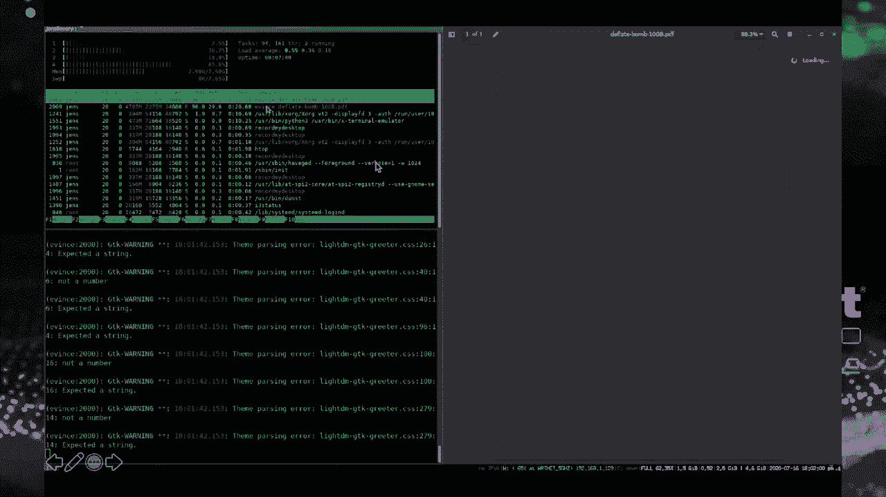

# 【转载】Black Hat USA 2020 会议视频 - P42：43 - Portable Document Flaws 101 - 坤坤武特 - BV1g5411K7fe

 [MUSIC]。

 >> Greetings everyone。 Welcome to the talk， portable document class 101 at。

 a Visual Black-ass conference in strange times。

 So my name is Jens Miller， I'm a PhD candidate at， the University of Bohrholm in Germany。

 and today I'm going to give you an introduction to， our current research which is a joint work from。

 Bohrholm on dangerous features of PDF。 So in this briefing we will together dive deep into。

 the less known features of， the PDF specification which can lead to serious security flaws。

 So in 45 minutes you may say， well I didn't know that PDF can actually do that。 Okay。

 so let's put on our Las Vegas sunglasses， and let's get started。 Also。

 I'm introducing a new rule for this talk。 So whenever I'm going to show you a demo。

 we are all going to have a drink or a beer together， and there's really going to be a lot of demos。

 And this briefing。 Okay， so here's an outline of today's talk。

 First I'm going to give you some background information， on the PDF document structure and features。

 so you'll get a better understanding of the attacks to follow。

 Then I'm going to introduce our four attack classes based。

 on malicious documents that basically lead to denial of service。

 affecting the host on which the document is processed。

 Information disclosure attacks linking personal data out of the victims computer。

 manipulation of data， and even code execution on the victims machine。

 And finally I'm going to provide an evaluation of those attacks。

 on 28 popular PDF viewers as well as countermeasures for developers。 Okay。

 let's start with some technical background on PDF。

 I guess we are all more or less familiar with the portable document format。

 which is basically a defector standard for electronic document exchange。

 So PDF was developed in the early 90s by Adobe， and it's an ISO standard since 2008 with the current version being PDF two。

0。 According to Adobe 250 billion PDF documents have been opened in their product in one single year。

 so I guess it's fair to say that PDF is used in almost every company and institution out there。

 and it's definitely worth having a deeper look at the capabilities。

 of potentially malicious documents。 Okay， let's first have a look at a simple PDF document。

 So here's a minimal hello world PDF file opened in Adobe Reader。 However。

 you can also open this very same file using a text deter like V。I。 for example。

 And as you can see here， we can actually read and edit the document。

 There may be some binary parts like like graphics or compressed data streams。

 but the structure of a PDF file is basically plain text so you can read strings maybe like hello world。

 On an abstract level， each PDF document consists of four parts。 First of all。

 it's a header which is only one line containing the PDF version of the document like one out seven。

 A cross-reference， sorry a body which contains a definition of pages of the document and their actual content。

 This is the most important part。 Also， a cross-reference section which contains an index table defining the offsets of all the documents of all the objects within that document。

 And finally a trailer which contains some more information such as a reference to the root element of the document。

 So PDF documents they are actually processed from the bottom to the top。

 Now let's have a look at some related work。 So in the past when talking about PDF security we have seen various things like。

 for example， we have seen the reason attacks on PDF encryption and also on PDF signatures which we both demonstrated last year。

 But also in the context of PDF what happens very often is that companies and institutions they publish PDF documents that are somewhat poorly redacted and thereby reveal sensitive information。

 This happens very often because content objects are usually not deleted。

 If the file is edited they are simply not referenced anymore and then this allows you to recover previous revisions of a document。

 A comprehensive study was for example performed by Simon Gaffinkle and by many others。

 Also we have seen some metadata issues that reveal the original author of a document which is not always desired。

 So such issues they were presented for example at Black Hat 2008 by Shima Alonso。

 And finally we have seen a lot of research on polyglot PDF files that are also valid images or other file types because the PDF header does not have to start at the beginning of a file。

 as demonstrated for example by Orch Ibertyni。 Now in this talk we will focus on insecure features of PDF。

 And when you study the PDF specification for interesting features you will quickly stumble up on PDF actions which are used for various purposes such as for external links。

 or to navigate for example to a certain page within the document。

 And even JavaScript within PDF is actually defined as a PDF action。

 Now all those actions that can be triggered using native PDF events for example when opening。

 closing or on printing the document。 And most actions they can have a PDF file specification as a target which could be for example a UAL in order to define a hyperlink。

 Okay so we systematically studied the PDF specification for PDF actions and for events that can trigger them。

 And then we tried to visualize all those findings resulting in my whiteboard being filled up with a complete mess。

 So here's a more clean representation and this is basically the most important slide of the talk which will follow us over and over again。

 So we identified four special objects which allow you to call arbitrary actions which is page annotations。

 fields and catalog as shown in the upper part。 We call those events。

 Now for calling an action most objects they offer multiple alternatives。

 For example here the catalog object defines the open action event but also an additional action AAS events。

 And each event can now launch any sequence of PDF actions which are depicted in the middle part。

 The meaning of the action will come to that later。

 And the target of an action can be a file handle or to be more technical a PDF file specification which is a multipurpose object that can be either an embedded file。

 So a data stream within the document， a local file on disk。

 a removed URL or even an ad work share depending on the parameters and the context。

 Now if a pass from an event over an action to a file handle and it exists and it's not explicitly blocked by the application opening the document this may result for example in file system access or in URL invocation as we'll see later。

 But before coming to the actual attacks let me introduce our attacker model。

 So our attack scenario is as follows。 All the victim has to do is to open a malicious document provided by the attacker。

 This is a realistic scenario because PDF is generally considered as relatively safe and even sophisticated uses they download and open PDF files from untrusted sources like email attachments or the internet。

 For example invoices， placket slides， placket， vite papers and so on are provided as PDF files。

 Now once this document which we denote as the malicious document is opened bad sayings happen depending on the actual attack。

 So for example in our service attacks they would cause the PDF viewer or maybe even the operating system to consume all available system resources or cause them to crash。

 Note that no use interaction other than opening the document is required for any of the attacks。

 So in case a PDF application would display a confirmation dialog before performing a certain action we do not classify this as vulnerable。

 Okay let me come to the attacks。 So our methodology in finding the attacks was pretty simple。

 We systematically started the PDF standard for legitimate features that are critical from a security point of view and which can be abused for attacks。

 So let's start having some fun with the portable document format resulting in the null of service。

 Let's start with how to create a PDF infinite loop。

 So for this let's first have a look on how the pages object of a PDF document is defined。

 So a document can have multiple or one or multiple pages or no page at all。

 And this is usually done using the pages special object within the document catalog。

 And the pages object has a kids entry containing a reference to each page in the document。

 Or as the standard phrases it the kids entry contains an area of indirect references to immediate children of this note。

 Now interestingly the children may be page objects or other page screenouts。 Oh wait okay。

 Interestingly in other words the kids entry of a pages object can reference to a pages object itself。

 So basically to itself they are by creating a cycle。

 And this is a no problem of the specification when parsing PDF files it was already addressed in 2007。

 So we thought maybe there are some more issues in the specification。 Maybe there are more examples。

 Let's have a deeper look and study the specification for elements for objects that allow self-referencing。

 distortion and other constructs that may somehow lead to infinite loops。

 So we came up with the following attack variants。 So PDF actions they allow you to specify an array of next actions to be performed。

 And basically this can easily result in action cycles。 Let me show you a demo。

 Demos always means we have to drink。 But you can see here was an event。

 an open action that triggers object number seven， which is an action that goes to a certain page in the document。

 Now there is an entry next action which refers to object number seven again and thereby we have the cycle right。

 And then also there are two more object numbers， object eight and object nine。

 And they also once again have an entry once again referencing to object number seven and then again we have another cycle。

 Okay， let's open this document in Adobe Reader for example。

 What you can see here is while parsing the document it jumps from page to page and you can't close it anymore。

 and the CPU goes up which is somewhat annoying。 It's not really bad but it's somewhat annoying。

 Okay， and there are lots of other variants without any actions。

 So using pure structural elements like object stream loops。

 So PDF object streams they make ten other objects object streams and thereby once again allowing to craft a document with cycles。

 Or for example you have probably seen PDF documents that contain an outline。

 And the entries of an outline they can reference to themselves or to each other and then once again you can craft the PDF file that when processed creates。

 or parses or cycles and results in an infinite loop。

 Also PDF defines type four calculator functions for example to transform colors。

 And this may once again allow us to define an infinite loop by defining a recursive function。

 And finally in case the PDF application supports JavaScript within documents well then infinite loops are super easy to introduce。

 Okay， so the takeaway here is that there's lots of options to keep the PDF processing application busy by forcing it into an infinite loop thereby consuming all available CPU。

 And we also exhaust all available memory sure we can。

 So most of you are probably aware of the problem of sip bumps。

 So data amplification attacks based on malicious sip archives。

 So the first publicly documented denial of service attack using a sip bump was conducted back in 1997 against a feed-on-ed mailbox operator。

 But not only sip files but also stream objects within PDF documents that can be compressed using various algorithms such as deflate in order to reduce the overall file size of the document。

 Now such compressed PDF streams they were absolutely standard and they are contained in most PDF documents in the wild。

 And not processing applications they must first decompress those streams in order to display their content。

 right？ Which raises the question if compression bombs based on malicious PDF documents can be built。

 Okay， here's basically our hello world example again。 Let's change this。

 Let's craft a valid PDF file containing a very long string of 10 gigabyte of repeated characters。

 Aaa and so on to be displayed。 So this results in 10 gigabyte on disk resulting in 10 gigabyte in memory。

 Which is no gain for the attacker yet。 Let's now compress this content stream。

 So in PDF the flated decode filter indicates that the stream must be decompressed before being displayed。

 And this results now in a compression ratio of 12， 123。

 which is unfortunately the maximum compression ratio that can be achieved with the deflate algorithm。

 However， our PDF file size can be further reduced by concatenating multiple compression filters。

 Which is totally PDF standard to concatenate multiple filters。

 And we can only even do this for a third time which then results in around 600 bytes on disk being decompressed into 10 gigabyte in memory。

 So we have a compression ratio of 1 to 18 million which is quite good。

 Let's have a demo on Linux this time。 There's our standard hello world file but you can see that the content is compressed using a triple deflate filter。

 The length is around 600 bytes。

 Let's open this file in events。 The default PDF view of work known and it's loading and loading trying to display the content。

 And what you can see here is that memory goes up and up and up。 This is not a virtual machine。

 My laptop only has 8 gigabyte of RAM。 I do now have to manually interrupt this process。

 Otherwise， my whole operating system will freeze and I don't want that。 And interestingly。

 you don't even have to open the file。 So it's enough to open the content directory in Nautilos in the GNOME file manager or even in Windows Explorer to trigger deflate bumps。

 Now， this may be problematic。 A bit more problematic than the infinite loop， right？

 Because we can potentially freeze the whole operating system depending on resource limitations mechanisms of course。

 It's still not that bad because the impact of course of the Nautilos service is somewhat limited for end users。

 But it can lead to severe business impairment if the document is processed on a server。 For example。

 a winch actually uses popular in the background which is a really popular PDF library which is one of the two deflate bumps and is used by various web applications to process or convert uploaded PDF files on the server side。

 Okay， that's out of scope in this talk but this can be really bad。 Okay。

 so let's not proceed with information disclosure attacks that leak personal data out of the victims computed to the attacker such as for example PDF document form data。

 local files on disk or NTLM user credentials。 Let's start with how PDF documents can silently phone home。

 So， at Blackhead 2008， Eric Filia showed how to use an open action event to trigger a UI action。

 thereby resulting in UI invocation in Adobe Reader。 Now。

 this pass was quickly blocked in most PDF implementations which we now ask you for user content before resolving the UI。

 But what if you just dry another parse using this pass by calling the UI action from a different event like from the additional actions of a page object we can bypass existing protection mechanisms。

 for example in perfect PDF reader。 We can also use a completely different action such as the launch action which we'll have a closer look later to trigger a URL。

 So this pass actually describes a clickable link in a PDF document。

 But what Firefox does is it prefatches the URL which was not intended by the developers because it results in request forgery。

 right？ So in the context of the web of course request forgery can lead to further web security related weaknesses。

 For example， a malicious document that's uploaded to cloud storage that could trigger at least same site requests。

 and this could be exported maybe to perform actions in the context of the user's account in case that only same site cookies are used to protect against cross-site request forgery。

 Okay， so I guess it's obvious what we need to do here。

 We need to test all possible passes systematically。 So this means all possible events。

 all possible PDF actions， and we use the URL as a file specification target。

 And if you do this really systematically， it crafted a lot of test cases。

 then what happens is if we test them in 28 popular PDF applications。

 our 16 of them will resolve the URL in the background without asking for any user consent。

 And this can definitely be considered as privacy invasive， right？

 So it could be used for example to de-anonymize users like journalists or activists behind a shared mailbox。

 We don't want that。 Okay， next I would show how user input in PDF forms can be leaked to an attacker controlled server。

 So PDF documents that can contain forms to be filled out by the user。

 This is a feature used on a daily basis。 For example。

 for many office tasks like vacation requests and so on。

 And depending on the nature of the form of course this user input can certainly be sensitive。

 It can contain data like financial or medical records and so on。 And therefore the question arises。

 if an attacker can somehow access and leak such information。

 So the idea of the attack is as follows。 The victim downloads a form so PDF document which contains form fields from an attacker controlled source and fills it out on screen。

 For example， in order to print it。 Note that there are legitimate cases where a form is obtained from a shared party。

 while the user input should not be revealed to this party。 For example。

 text forms can be downloaded from all over the web。

 Even so you do not want arbitrary websites to see the input data for the text form。

 And also they have to be manually signed anyway to be accepted by the IIS， right？

 Now what if this text form is manipulated in such a way that it suddenly in the background。

 it takes to iterates of data without the user noticing and sends the user input data to the attacker's server？

 How could we do this？ Well， this can be done by combining the did print and the page closed events of the catalog and annotation objects within a document together with a submit form action。

 However， all form data， all user input is sent to the attacker's web server once a document is either printed or closed。

 Another option of course would be if supported to use JavaScript to submit the form。

 Or you could use other functions defined in the Adobe PDF JavaScript reference to accelerate PDF form values。

 Maybe I should show you a demo here。 So what you can see here is that did print is object number five。

 which is an action， which means after printing a form should be submitted。 To evil。com port 8080。

 And open the file with perfect PDF premium for example。

 And this is now a minimum example for a PDF form where the user would enter some sensitive information like I don't know。

 hello black cat。 And if the user prints a document， in this example we print to some system printer。

 What happens is that in a background the user input like hello black cat is suddenly sent to our server。

 Which is definitely not intended like this。

 Okay， let me show you how PDF documents can silently exfiltrate even arbitrary files on disk。

 We do this by changing multiple legitimate PDF features together。 So how could we achieve this？

 We have not only have to link data to the internet， which we have already seen。

 we also need to read from local files， right？ And to achieve this。

 maybe let's have a closer look at the PDF standard。

 So we've already seen PDF forms that can also submit themselves。 However。

 now the data to be submitted cannot only be a PDF form field value。

 it can be a reference to arbitrary stream objects。 Now if you study the PDF reference。

 you will find a part where it says every PDF stream on its part can reference to an external file。

 Okay， you see where this goes。 Basically we embed files on disk into the document and then exfiltrate them using the submit form action or using JavaScript。

 To some external URL。 Let me show you once again a demo。

 In this example we have an embedded file that actually refers to an external file on disk。

 See if it's in any of which is， you know， the standard Windows system file。

 Let's open the document in a nuanced power PDF， for example。

 And once the document is opened silently， the content of that file on disk is leaked to our server。

 e-will。com。 Which is pretty bad。 And this also works for other PDF viewers。 Okay， next one。

 let me show you how PDF documents can leak， and TLM hashes for Windows user credentials and why this works until today。

 So in 1997 our， and Spangler posted a vulnerability in Windows NT on the backtrack mailing list。

 which can be summarized as follows。 Any client program can trigger a connection to a malicious Windows SMB server。

 Now if the server requests authentication， the Windows client will automatically try to log on with a hash of the current users credentials。

 And this is a well-known design problem in the Windows operating system。

 I guess most of you are aware of this。

 And what can be done with it was such a cup captured， NTM version 2 hashes。

 which is the current version they allow for efficient offline cracking of the user password。

 For example using hash cat。 And also if you use or support previous versions of NTM they are actually trivial to crack。

 And they can be considered as broken anyway as shown by Moxie， Marlon， Spike and Badas。

 Or you can also use NTM hashes to perform relay attacks and authenticate under the user's identity as shown by Ashoa and Tamlo。

 Of course it's up to the configuration of the victims set up like password strengths and security policy if such attacks are actually feasible。

 Okay， now in April 2018 checkpoint research showed that similar attacks can be performed with malicious PDF files。

 And they found that the target of a go-to action can be set to a network share。

 And thereby leaking credentials in the form of NTM hashes。

 And this issue was actually quickly fixed in Adobe and Fauxit。

 Let's see if we can find some bypasses。 What do we need to do？

 We need to systemally test all possible passes。 Okay？ All possible events。

 So for example by using various techniques to access a network share like by including it as an external content stream。

 Or by using all possible PDF actions that allow a file specification and then use a network share as the string for file specification。

 This may allow us to basically bypass protection mechanisms which works in a lot of years。

 Let me show you a demo for Fauxit。 Okay， trivial open action event and action number five which would usually be blocked by Fauxit。

 But if you say the file is not going to be open but to print it then this network share will silently be opened in the background by Fauxit。

 Let's use responder as a malicious SMB server to see if we get any income user credentials。

 And here we go if we open the file in Fauxit we will see the hash of the users password。 Okay。

 that's not too good either， right？ Our next class of attacks is data manipulation。

 With lots of sub attacks once again that allow an attacker to modify PDF form values。

 write local files on the host file system or master displayed content of a document based on the opening application。

 Let's start with form modification。 So our goal here is to create a PDF document that manipulates itself or to be more precisely its form values。

 So the idea of this attack is as follows。 Similar to form data leakage as the extract area the victim obtains or homelessly looking PDF document from an attacker controlled source。

 For example a text document。 And the goal of the attacker is now to dynamically and without knowledge of the victim many pollute form field data。

 What's the impact？ Well this could be abused to for example get the victim into big trouble by making some wrong fields and get the victim into trouble of text fraud to suspicion。

 But also maybe to gain a financial advantage。 For example by adding the attacker as recipient of a text refund。

 Okay， there are two ways to achieve this。 Firstly we can use the import data action。

 So form field values that can be set in a document using the import data action which basically imports form data from an external source。

 Like a URL or from an embedded file。 And overrides existing document form data and this action this could be triggered immediately maybe before printing using the catalog's build print event。

 And if JavaScript is supported you can use JavaScript functions to set the content of specific form fields。

 Well this may not have an advantage because you can first back up the old value and then later on restore the old value so the victim will not even realize that something has been changed。

 Let me show you a demo。 Next we have a build print and a did print event and both of them reference to JavaScript actions。

 And first of all the backup the old form field value and then we set the value to a new string and after printing we will restore the backed up value。

 Okay， let's do this in Adobe and we have the original value we print it in this case we print it to to fox it so as a system printer so you can easily see the result。

 And what we will see here is that when printed the modified string is contained in that document or in the printed version which can be bad in case of for example text forms。

 I can do some more now let me show how PDF documents how they can write you and overwrite arbitrary files on disk。

 How to achieve this。

 So as previously described the PDF standard enables documents to order submit form data to external web service。

 But technically the web service URL is defined using a PDF file specification。

 And this can also be a local file on disk。 So this ambiguity in the standard may be interpreted by implementations in such a way that they enable documents to submit PDF form data to a local file and they are writing to this file on disk。

 Furthermore there are various JavaScript functions which are defined in the reference which allowed to write to local files。

 So if successful this feature can be used to overwrite arbitrary files on the victim's file system and thereby purge their content。

 So one more time。 Okay we have basically an on-close action。

 And what it does it is submit a form to drive E with the file name placket。evil。

 On drive E we don't have any file yet let's try to do this in master PDF。

 Let's close our malicious document again。 And then let's see if the submitted form was submitted to a local file on disk。

 Okay you cannot write arbitrary content but you control parts of the content by changing the form field values。

 And you can of course overwrite existing content which could be bad。

 Okay so the last attack in this attack class is content masking。

 Now I will craft a document that renders different content in different PDF viewers。

 This can be used for example to show different content to multiple reviewers of an academic paper。

 Or to trick content filters and search engines which now index different text than the one that is shown when opening the document。

 To achieve this we systematically studied the PDF standard for ambiguities。

 Ambiquities add various levels at this index and structure level that lead to different parts of the document actually being processed by different PDF implementations。

 For example PDF objects before the PDF header or after any end of file marker they may not be processed by certain applications。

 Or a PDF file can contain yet another document as an embedded file。

 And then using some tricks it may become unclear which one actually to show。

 What about objects with duplicate object numbers or objects that are not listed in a cross reference table。

 Also it's unclear how content streams should be parsed if their length value does not match the offset of the end stream marker。

 I will show an example in a second。 And finally there are some edge cases on the syntax level of content streams like uppercase。

 lowercase and so on。 So those attacks or those edge cases they lead to 33 single edge case variants and each of them renders differently in different viewers。

 Just let me give you one example。 So a PDF stream usually or has to start with the keyboard stream and has to end with the delimiter end stream。

 Higher the stream lengths must also be defined which can lead to uppercase should I display the red text or the blue text。

 So in this example half of the tested viewers they respect the delimiter and show the red content stream while the other half of the tested viewers they showed the blue content stream based on the lengths。

 And now we found 62 further edge cases that as said lead to different content being shown by different viewers。

 And in some cases only one viewer shows a certain content。

 However note that it's also possible to chain those edge cases together within one single document to achieve the same effect。

 Okay， demo time。 So we have some edge case examples in this case for Adobe and you see a different string and a different color basically for Adobe compared to FoxID or PDF exchange or neutral reader。

 Which can be problematic in the context where we assume that PDF document renders exactly the same content and not something completely different。

 So for example in the case of a business contract。 Okay。

 this is what you have been waiting for our last class of attacks is the execution of arbitrary code on the victim's machine basically by silently launching an executable from the malicious document。

 We do this using the launch action。 Now what is the launch action？

 The launch action is a somewhat special PDF action that according to this standard launches an application or opens or prints a document。

 That sounds interesting， right？ The standard does not provide any security considerations regarding this obviously dangerous feature and it even specifies how to pass command line parameters to the launched application。

 Therefore， it's somewhat fair to say that PDF offers code execution by design if the standard is implemented in a straightforward manner。

 So how to test for this once again， we use all possible PDF events。

 This time to call a launch action with the open parameter。

 And our target here is an execute table which is either embedded within the PDF document or provided as a local file。

 So let's see if in 2020 we still find PDF users that do not ask the user before launching arbitrary execute tables。

 This is your last time to drink so make it double。

 You can see simple code execution by design in a neutral PDF reader in neutral pro in PDF studio studio pro and also in some older versions of PDF architect。

 So your life can be simple， right？ No bother overflows， no nothing。

 Simply abusing legitimate features。 Okay， let me come to an evaluation so you can see which attacks are actually possible on which PDF viewers。

 So we tested 28 popular PDF processing applications。

 Basically all PDF applications for the major platforms， Windows， Mac OS。

 Linux and web browsers because they can also view and display PDF documents natively。

 And if a fewer version like Adobe reader and an additional version like Adobe bro was available。

 we tested both because they supported somewhat different feature set。 Okay。

 now our evaluation shows that 26 out of 28 tested applications are vulnerable to at least one attack。

 So for example， infinite loops in one variant or another they have a possible in almost any reader resulting in the application either to hang or to crash。

 And the same holds for deflate bombs which are somewhat hard to protect against if you don't have any strict resource limitations。

 And using various techniques we could craft PDF documents that suddenly phone home once a document is being opened in 16 of the tested readers。

 User input in PDF forms can be silently leaked to an attacker controlled server for 11 of the tested applications。

 We were able to silently execute raid files on disk by chaining together legitimate PDF features in six applications。

 For three of them however， there are some limitations regarding the file type。

 12 applications they silently leaked the users anti-IM hashes so we found various bypasses to existing patches for example for Foxit。

 Now forms that manipulate themselves using the import action for example or chara script by changing their form values。

 For example when printed they were supported only by four readers even so this is actually a standard PDF in the end but it didn't work very often。

 Okay but file system access or file write access so writing to arbitrary files on disk worked for two applications which is pretty bad。

 And for six viewers we could craft a document that renders different content in each and every other PDF viewer。

 For the others you basically have to chain edge cases together to achieve the same effect。

 And in four applications we had straightforward execution based on the launch action。

 For another tree Linux based viewers this works only in the case of mono execute habits so the impact is a bit limited。

 Okay now the takeaway here is that virtually all tested PDF applications there at least some issues right？

 And PDF viewers that only implement a minimal subset of the PDF standard they are usually less vulnerable。

 So such a subset without any fancy features that is usually enough to simply display a document as shown for example by the PDF implementations for MegaS and Linux but also web browsers。

 Okay we reported all those issues to the affected vendors back in January some of them are fixed and some of them work until today。

 Now how would you fix those issues？ So I would say to counter infinite loops。

 constructs that lead to cycles or to recursion they must be prohibited in implementations and also ambiguous formulations that should be removed from this standard。

 Which could also help to prevent content masking attacks。

 Also why not limiting the resources a single document is allowed to consume similar to a website in a modern web browser。

 Thereby malicious document would not affect the whole application or the whole operating system anymore。

 Now while our text do not depend on JavaScript a lot of native PDF features there were undoubtedly implemented in JavaScript。

 Thereby providing an even larger attack surface。 So let's remove or restrict JavaScript and also given that PDF is supposed to be a format for portable documents we'd argue that they need to embed really a full programming language is somewhat debatable。

 Now finally and most importantly secure PDF processing applications they should identify and cut the dangerous parts in malicious documents。

 So most of our attacks they took a pass from an event down to a file handle and if this pass was not blocked or required user content the attack was successful。

 Now many applications they blocked particular passes but they failed to block them all because they were no systematic protection approach。

 Okay let me come to a conclusion。 So PDF is more than a simple document format。

 PDF is really really complex and it's got a lot of dangerous features。

 Applications that blindly implement the standard they're somewhat flawed by design。

 So if you're a developer of a PDF application be careful which standard features you actually want to include。

 Also even in 2020 you can get code execution based on pure logic chain exploitation。

 Okay thank you you can find all the exploit files on GitHub as well as a comprehensive test suite in order to test full PDF implementations for vulnerabilities。

 I really really really really hope to see you all next year in Vegas。 [BLANK_AUDIO]。

