# P44：45 - TiYunZong Exploit Chain to Remotely Root Modern Android Devices - Pwn Andro - 坤坤武特 - BV1g5411K7fe

 Hi everyone， my name is Kumbo。 From 60 of life， I'm glad to have this opportunity to。

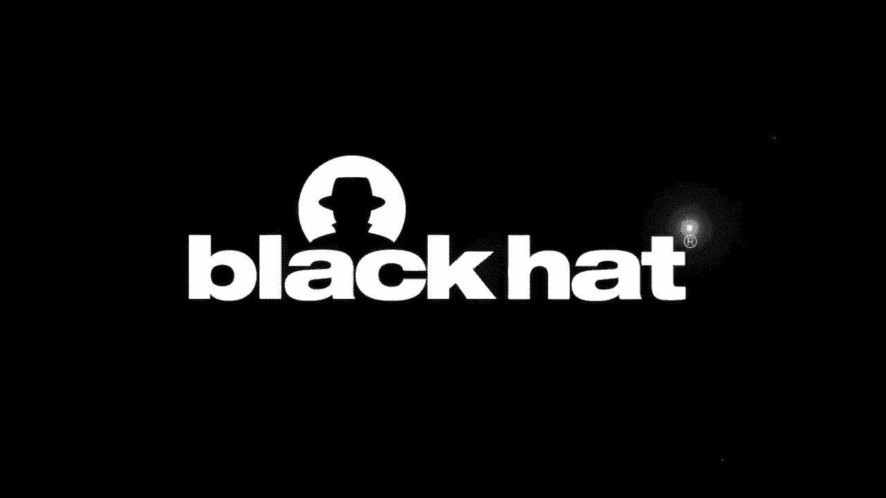

 share this talk with you。 As we know， because of the exist of many motivations in Android。

 nowadays it's very difficult to remove the Android devices。 But today， I'll show you how。

 I'm moving the toughest Android device， the beautiful。 At the beginning of this talk。

 I want to introduce， our team shortly。 I'm the team leader of 360 of life。

 Our main research fields are， Android Assistant Services and the Chrome Brothers' Equity。

 We have found more than 300 vulnerabilities， in Android Assistant。

 We won the highest reward in the history of ASR programming in 2013。

 Because of the expert chain introduced in this talk， we have won the highest reward in the。

 history of all Google VIP programs in 2019。 We have also had different targets in different。

 phone contests。 A brief look at today's agenda。 I'll first explain why Google Peace phone is a。

 tough target from two aspects。 The price paid by variability blocks and the results of mobile。

 contour in the last three years。 Next， I'll introduce remote intelligence of Android devices。 Then。

 I'll share my experience of calling Android devices six times in different competitions。 Next。

 we'll overview the expert chain named Tiwi Zung。 It can remove Nizoo's。

 value rate of core-compest Android devices to include pixel devices。 After that， I'll detail。

 the three vulnerabilities in the chain and how I change these three vulnerabilities for exploitation。

 without any output。 At the end of this presentation， I'll demonstrate how to get a reverse share。

 with due to permission of a pixel phone by accessing a malicious link in Android。

 Which is the most secure smartphone？ It's an open question。 The other thing there is no standard。

 answer。 Android and iOS are the two most popular mobile operating system in the world， and there。

 are too many arguments about which one is most secure。 There are different answers from different。

 perspectives。 It will be answered questions from the perspective of the price paid by。

 vulnerability blocks。 It seems that Android is more secure than iOS。 The volume paid up to $0。

5 million for Android FCP/0/Clico expert chain， which is higher than， iOS FCP/0/Clico expert chain。

 If we assume Android is more secure than iOS。

 the remaining question is which is the most secure phone among Android phones。

 It's easier to answer， than the previous one。 Google Pixel phone often have more updates or versions。

 secret patches， and vulnerability mitigations than other Android phones， which make it more。

 difficult to be attacked。 It's shown in the table。 The platform is the only device that will not。

 be postponed in mobile phone to all competitions in the last three years。 While iPhone will。

 be postponed seven times in total， other Android devices include sensor， Galaxy， Huawei， Mate。

 P-Series， Xiaomi Mi devices， will be postponed several times in the context too。 Many exploits。

 demonstrated in the context target Android devices exist in our state of OS component or。

 unsecured customer code， so we can conclude that Pico device is a tough target。

 Before I talk about my expert chain， I want to give you a。

 Italian service analysis of remotely compromised smartphones。 As shown in the future。

 remote attacks of smartphones can be divided into two categories， but it's a tough vector。

 It attacks through internet and attacks through adjacent network。 Normally speaking。

 it attacks that exploit vulnerabilities in products， apps， and emails。

 can be launched through internet more easily。 It attacks that exploit vulnerabilities in， overseas。

 Rutus by far and best banned are most of the launched through a adjacent network。

 It attacks from internet more destructive than it attacks from adjacent network。

 but the former orphan needs some interactions such as clicking a URL， opening an email or instance。

 message。 It's a relative idio to non-ITIL from adjacent network with all the interaction。

 Then from the internet。 Product form and platform are amazing adjacent network attacks。 It's hard。

 to say which attack is more harmful between the local network attack and one critical。

 internet deployable attack。

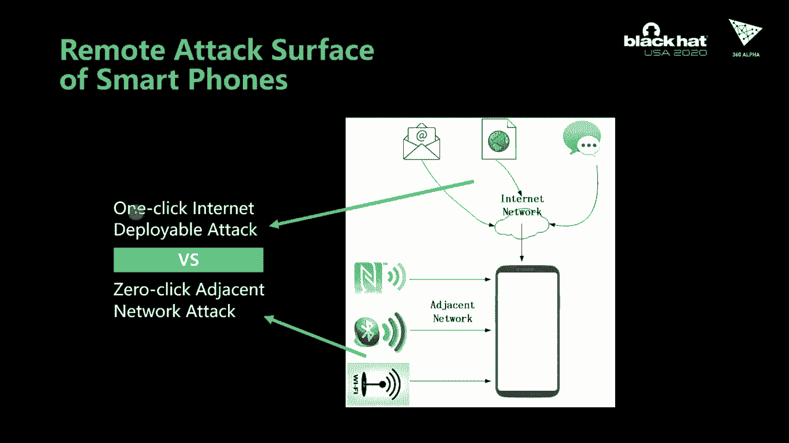

 The exploit chain， I use the tool to remove the user form in one critical internet deployable。

 attack chain。 This table summarizes some remote working experience from the BAMI target enjoyed。

 in recent years。 In mobile PON2 2015， I found there's a 6 with a single vulnerability。

 A fourth gadget， RCE in clone render process， then I changed this RCE into a ULSS vulnerability。

 so any JavaScript could be introduced to Google Play website， any apps， any app could be installed。

 In PON2 2016， I found the 3 and joined the phone with a single express chain。

 The express chain also starts from a VF bar， combined with a clone/civic list。

 The web view in Android had no sign-up hours at that time。 By exploiting the VF bar again in a。

 web view， clone sign-up hours could be bypassed easily。 This sign-up was escaping metal that。

 doesn't work anymore because web view is sign-up hours now。 It's also sign-up hours now。

 In PON2 2016， I found a table saw with a single vulnerability。 One small。

 method is similar to PON2 2015。 Half PON2 2016， Google updated the remote apps installation features。

 to prompt the user to enter their password， which makes this phone a very technical。

 but it took more than a year for them to mitigate its cut-over type。 As of clone 77。

 such as nation has been enabled on Android devices。 It's nearly。

 impossible to navigate the RCE to USS method。 In PON2 2017， I found a Galaxy S8 with two bugs。

 an OBS bug in sensor， internet browser， and a U-L app map vulnerability in sensor， e-source。

 GR-block module。 I can get a virtual system user permission through this express chain。 In 2018。

 I found a peaceful phone with two bugs。 A V8 engine bug is used to get RCE in。

 the sandbox render process。 Above in Android， my log module is used to escape from clone's， sandbox。

 Together， this express chain can be used to inject arbitrary code into system。

 solver by accessing AM or L in Pro。 In 2013， I found a piece of 3 with 3 bugs。

 and named this express chain Tvindo。

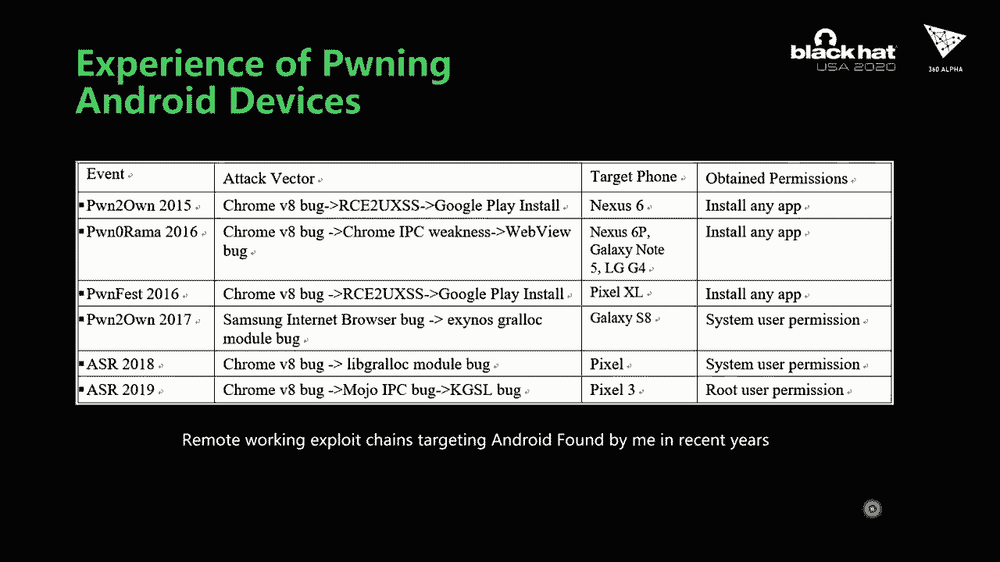

 So， what is Tvindo？ Tvindo is from a very famous Chinese Kung Fu story， and this Kung Fu。

 allows people to move upward， swiftly， and efficiently as if clouds are the stairs。

 The express chain includes 3 bars， which are just not the cloud stairs of Tvindo。

 The express chain is composed of 3 bars， 2 clone bars， and 1 Qualcomm KGSL Java bug。

 The attack vector is malicious links。 Once victim， access a web link conjured by attack。

 Attack can get reversed shell with root permission of the attack phone。

 This video shows how to remotely get root permission with the use protein。 First， ROB。

 as part of V8 is exploited to achieve remote code execution in a Chrome render process。

 Render process runs in the SCN， CVE-2， 3， 1，5， 6， 7 is a bug in core-contribute Java。

 but it can be treated directly from isolated app domain。 In order to trigger this bug。

 we need to escape from isolated app domain in the help of， CVE-2， 1，5， 7， 0。 Firstly。

 it is a use-after free vulnerability in the media component。

 A compromised render process can trigger this vulnerability through module code。

 By exploiting this bug， our recall can be executed in Chrome privilege process。

 This process runs in the SCNX domain， uncharged app， access GPU Java。

 I'm going to detail how to exploit these three bugs separately。

 First， let me introduce the RCE vulnerability。

 This bug exists in the talk code of Chrome VS JavaScript engine。 VS is a code-stub-assembler。

 provided no native primitive thing abstraction over an anomaly。 VS talkio is a VS-specific domain。

 specific language that is translated， to code assembly。 In the code-stub-assembler。

 here we add many JavaScript's built-in functions and objects are implemented by VS talk。

 This bug will show the build process of a talk code。 If there is any bug in talk code。

 it will be propagated to the generate the CSA code and then to generate the snapshot。

 bug in the end。 The snapshot bug is embedded into Chrome to speed up the。

 initialization of all built-in functionality in VS heap。

 Before we talk about the RCE bug， we have to know the JST function memory node first。

 JST function in Chrome VS is the internal reparitation of function in JavaScript。

 The start of this object in VS is not fixed。 It may contain the field prototype or initial map or。

 node。 The field prototype or initial map is the last field of JST function in VS HAD。

 This is the field information of the function。 Had prototype snorts means the area function has the field prototype or initial map。

 So it is set in 64 bytes。 This is the field information of the function， has int。

 It has no prototype node。 So it is set in 56 bytes。 In most situations， if a function。

 is a constructor， it has prototype node。 If a function is not a constructor。

 it has no prototype node， but there is an exception。 The function proxy is a constructor。

 but it has no prototype node。 So the bug is here。 The token macro gets derived map。

 didn't check whether the argument's new target， contains prototype or initial map。

 And the access is directly。 So it's an auto-bound access。 It's easy to trigger the bug。

 You can only need one or one of Java's code。 As shown on screen。

 you can create an untapped array with reframe dot construct to trigger the bug。

 Reframe dot construct will call the token function， create tapped array。

 This function will call the， vulnerable macro， create derived map。

 Because the new target argument is set to the progressive， function。

 So the OBR says we have retrieved。 But if a bug just gives a run in Chrome， simply。

 non-scene special will happen。 Or the OBR says has already occurred。

 It is because that after nodeing prototype or initial map， the manual will be treated as an aim。

 It's constructed and loaded and， compared with target。 And in most situations。

 this manual is an equal map， but its constructor， is not the same as the target。

 So execution flow will be able to no pass。 Everything is normal。 If a manual isn't a map。

 execution flow will be able to no pass too。 It's fair to be cast to a map。 Because there's no pass。

 we'll make all the access useness to exploit this bug。

 The execution flow must return a map in fast path。 So here you'll exploit the strategy of this bug。

 First we have to free the object below the， proxy function。

 Then we occupy the free space with an object whose map。

 constructs is uninetally related to the map X。 And then drop all reference to， the map X。

 So the garbage connect will mark the map XL， garbage and various sweep is in schedule， sweep task。

 Then we achieve the OBS bug before map X gets swept by Gc。 So the vulnerable。

 gets developed map once built out to the node pass， the pointer of map X will still be used in。

 create type array。 After sweep task finished， we occupy the free space of map X with a map whose。

 constructor is uninetally related to the LRA。 So what we'll get is a map from type LRA is map。

 LRA uninetally related to LRA but it's not out。 Especially it's an end-of-the-kind。

 unit at LRA type。 It's easy to implement arbitrary read and write with this map on the object。

 With the ability of arbitrary read and write， we can enable module Gs binding and。

 equals broad volume module validity to scale from Chrome's sandbox。

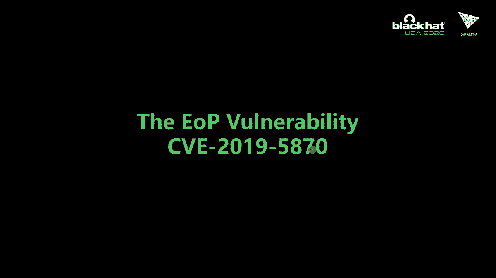

 Next， I'm going to introduce the EOP bug。 Chrome uses a multi-process architecture。 It's。

 as a net render process from other pre-wrist process。 As the video show， the main process。

 that runs the UI and the MIGHTIS types is called the browser process。 The GPU process is a process。

 used when Chrome is displaying GPU and celerated content。 Likewise， the type of specific processes。

 are called random processes。 Normally， random process has the noise privilege。 The GPU process。

 and the browser process have high privileges。 Random processes are highly sun-bosted and many。

 interactions between the and the system are processed by other pre-wrist process。 In Android。

 random process runs in the domain-asculated app。 The GPU process and the。

 browser process run in the domain aren't just the app。 They are seapart calling a random process。

 while the EOP bug is called GPU process。 The communication between processes is the VR advocacy。

 There are two exercises in Chrome， NSC， MC and module advocacy。 Module is Chrome's new。

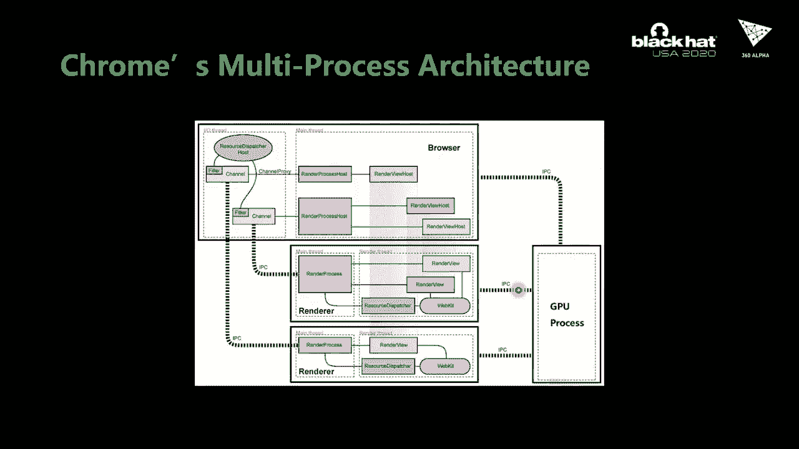

 advocacy system。 The EOP bug can be triggered by a module conference。 The window process。

 is a UAF vulnerability in Chrome's media component。 It is related with the interface of our content。

 decryption module。 This module and all Chrome 2。3 DRM productivity， HTML file， video and audio。

 The IDL format of the content decryption module is shown on the screen。 The function in NSC3。

 is responsible for initiating the CDM。 If its narration succeeds， CDMID will be no。

 there and will not be used to locate the CDM and the remote side。

 The initial function is implemented in C++ if initializations succeed。

 The function on CDM created will be called this function will be called。 The cause of the。

 vulnerability is that there is no rejection to the number of the calls of the function， initial。

 If this function is called twice by through module code， in debug watching。

 this detail will be retrieved and all CDM created would be called task 2。

 which without the same module stem service would be reduced to the task in the function of CDM。

 created。 In the function， reduced to CDM， two CDMID's will be mapped to the same module stem。

 service in NAP4。 When module stem service will be distributed， only one CDMID will unregister。

 and remove from the MAM CDM。 The other stem ID will map to a dangernim point。 Up that。

 if the function gets the stem context level called will， inform mention the stem ID。

 the URL would actually not 6。 Modus stem service can be configured to be run in different process。

 It can be configured to run， in the browser process， the GPU process。

 It also can be configured to run in utility process。 Desktop Chrome is the desktop Chrome config。

 CDM service run in utility process。 Utility process is highly send-bosted just as a render process。

 So it can't be， exploited to escape or send both in desktop Chrome。 But not only。

 modus stem service can't be run in the GPU process by defaulting Android。 So we can。

 exploit this part to access the GPU drive directly。 The URL object is modus stem service。

 Its cell is small。 It has only 48 bytes。 There is a lot of noise in the heap in this cell range。

 So it's hard to， reoccupy the free module stem service object with controlled data。 Now。

 a member pointer pointer a large object。 This type is middle DRM bridge。 The cell is 168 bytes。

 In debug washing， the 160 bytes in release washing。 We can occupy the memory of the free。

 module DRM bridge。 You can control data。 So we can control its water table。 All right。

 it's a water table。 It's a 6-NAC。 We can use RP to finish the exploit。 But there is。

 another problem。 We can't allocate memory with no address in GPU process。

 So we don't know where the water table points can be modified to point to。 We need another。

 information disclosure by the two-faith air。 Water table with no address。 Then we can finish the。

 exploit by the top。 However， it's not a good choice。 There is a simple solution。

 We know random process， and the GPU process have the same memory layout in Android。

 They are further from the same process。 So we know the best address of most cell library in GPU process。

 The cell library， needs LLVM GL-based user system function。

 So there will be a system function point in this cell library after loading。 Now if we modify。

 water table pointer to point to near system function point， when you have a cost。

 the system function is called。 The argument is a controable tool。 We can use the simple method。

 We can use a simpler method。 We tend to leave C to execute any shell command in GPU process。

 So we scale from the Chrome sandbox。

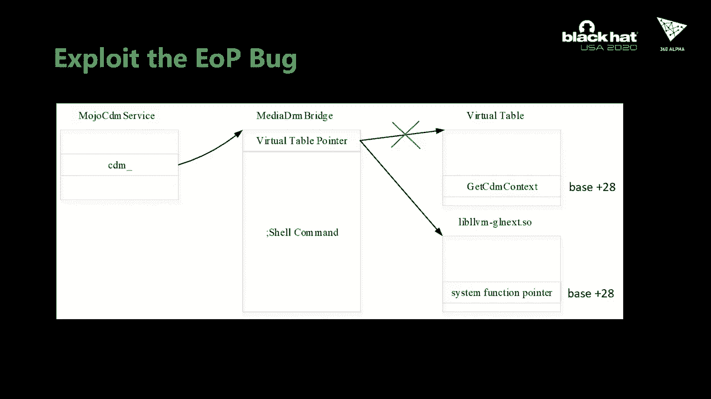

 Next， I'm going to introduce the root vulnerability。

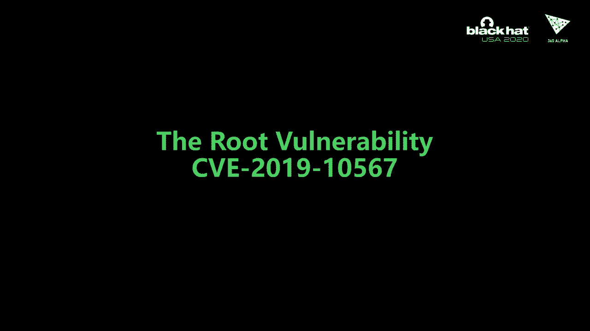

 The Google Pixel phone has an Azure node GPU。 It's used KGSL driver developed by Qualcomm。

 The picture shows the architecture of KGSL driver。 Apps can create adrenal context with different。

 priorities。 Normally there are four content context priorities。 0， 1， 2， and 3， 0 denotes。

 the highest priority and 3 denotes the noise priority。 Each adrenal context is bonded to a rainbow。

 Depending on its priority， because adrenal context， has four priorities。

 There are four variables relatively。 There are RBL， RBL 2， RBL 3， and RBL 4。 Similar。

 CPU has different privilege-enabled GPU karate in different modes。 Adrenal GPU karate in two modes。

 Primarily in the mode and RBL mode。 Some pages and registers。

 can only be accessed or modified in privileged mode。 After I create adrenal context。

 the app can send GPU karate to the context by our control。 Each context can be a command too。

 The CPU commands are killed。 This battery is the core module in KGSL。

 It's drawn in a separate color thread。 The Google Pixel phone has adrenal GPU。 It's used KGSL。

 drama developed by Qualcomm。 The picture shows the architecture of KGSL drama。

 Apps can create adrenal context with different priorities。 [pause]， [pause]， [pause]， [pause]。

 [pause]， [pause]， [pause]， [pause]， The Google Pixel phone has an Arduino GPU using the KGSL drivers developed by Qualcomm。

 The picture shows the architecture of the KGSL drivers。

 Apps can create an Arduino context with different priorities。

 Normally there are 4 context properties 0， 1， and 3。

 0 denotes the highest priority and 3 denotes the noise priority。

 Each Arduino context is bounded to a VIN buffer， depending on its priority。

 Because Arduino context has 4 priorities， there are 4 VIN buffers relatively。 I will 0， RBE1， R2。

 and R3， similar as CPU has different pre-managed network。 GPU can run in different modes。

 Arduino GPU can run in two modes， pre-managed mode and un-pre-managed mode。

 Some pages and registers can only be accessed and modified in pre-managed mode。

 After the map creates an Arduino context， the app can send GPU commands to the context by。

 our control。 Each context has a mode queue。 We see the GPU commands are queued。

 The dispatch is the core module in KGSL。 It runs in a separate kernel thread and keeps reading commands from the queue and sub-submitting。

 them to VIN buffers。 After command are sub-mitting to a VIN buffer。

 the red point of the VIN buffer is updated。 Now the GPU executes some commands。

 The read point is updated by GPU。 Every context you different page tables or the sound pages are mapped globally to all。

 contexts。 This list shows all globally mapped pages in beautiful form。

 Note that scratch in that file is a globally mapped page and VIN will exploit it later。

 Some pages in this list are not only mapped by GPU but also can be modified by CPU。

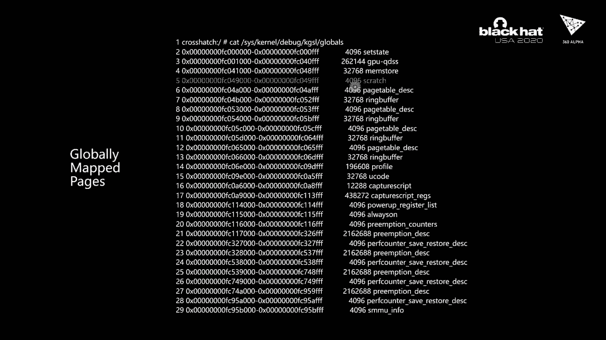

 The one for this kind of page。 The scratch memory is one page data that is mapped into the GPU。

 This is enough for some shared data between GPU and CPU。 For example。

 it will be used by the GPU to write updates and read points for each VIN buffer。

 The format of the scratch is shown in this table。 In the first 16 bytes。

 the read point of four VIN buffers。 In the information。

 the read point of read buffer is stored in scratch memory。

 The scratch memory is mapped in GPU space and CPU space。 The read point of sensitive data for KGS。

 The read points will allocate buffer from read buffers。

 But the scratch memory is runnys to dry table by normal GPU command process of instructions。

 in this function。 In this none， the function KGSL-allocator-globe。

 Allocator-globe memory without read only and privilege flag。

 So RPD-R can be modified by GPU command process of。 。in the function， in the function。

 a adrenal read buffer-allocator space。 The RPD-R is the variable RPD-R in NAF file。

 It reads from the scratch memory。 In RPD-R can be modified to any manual。

 The function can be connected to return a run read buffer point。 And without。

 we can override the exist command process instructions and indicate the initial。

 command process instructions into read buffer to execute。 So how to exploit this bug？

 There are few public documents about the internal architecture in the GPU。

 You can only speculate some internal behaviors of the GPU。

 RPD-R in the scratch memory are updated by the GPU。

 But it seems that there are just shadows of the read points used by the GPU to fetch instructions。

 Refrain the RPD-R in the scratch memory don't affect the execution flow of the GPU。

 Narken is affects the kernel allocation space for read buffers。

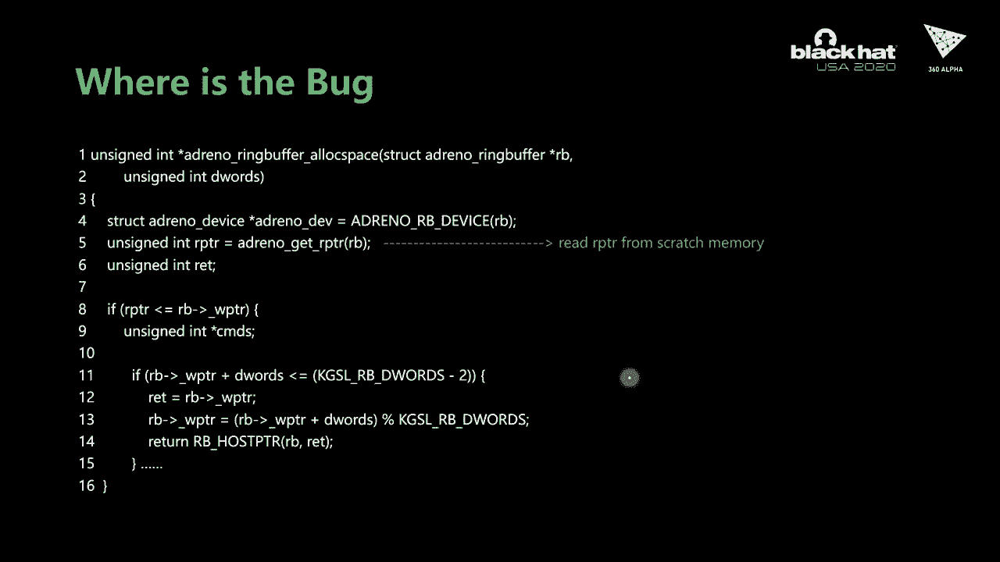

 RPD-R points to the next instruction， which will be executed by the GPU and the WPD-R。

 and the RPD-R points to the start of free space of a run buffer。

 There are two scenarios of the prediction of read PTR and read PTR。

 Read PTR less than or equal read PTR or read PTR， not even read PTR。

 When read points are less than or equal to read point， if there is enough space from read。

 point to the end of the read buffer， and locating its input， we just need to advance。

 read points and return the original read point。 If there is enough space towards the end of the read buffer。

 we have to look for space， from the beginning of the read buffer to the read point。

 If there is enough space， it runs from the beginning of the read point from the beginning。

 of the read buffer， otherwise the allocation will fail。

 Then read point is not then read point if there is enough space from read point to read， point。

 we just need to advance the read point and return the original read point， otherwise。

 there， allocation will fail。 Read point in scratch buffer can be said to any value by no more deviance instruction。

 because of the bug， so we can pull the allocation function。 Assume on screen。

 assume that our GPU executing some instructions， RPTR is less than direct， PTR。

 it requires to offer locating a non-space read buffer issue because of the space at。

 the beginning and the end is more， the request will fail。 If we modify RPTR in scratch memory。

 it runs its new WKTR。 Then some space will run in mode L3。

 as this moment if another request of locating a non-space， from read buffer is issued。

 it will succeed， but some existing command process instructions， will be overwritten。

 The adrenal GPU will exclude instruction still from the original RPTR without executing non-anand。

 instructions， this means executing from the middle of instruction， through some data of。

 the instruction is all be called， so it's possible to induce arbitrary command process。

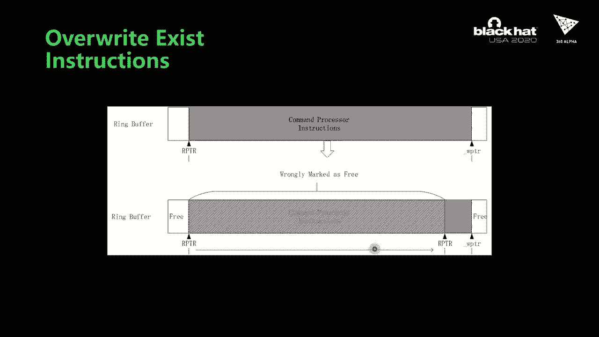

 instructions into read buffer in WKTR， write up to read buffer。

 When GPU instructions are dispatched to read buffer， CPE in direct buffer prefecture instructions。

 are inserted into read buffer by KTS-driven。 CPU instructions provided in user mode are in indirect buffers。

 they are not called into， read buffer， relatively。

 The execution flow will jump to indirect buffer when CPE indirect buffer prefecture instruction。

 is executed， it's difficult to write up to recording to read buffer not connected， we。

 found another value in user profiling command。 User profiling command is used to read GPU tickets at the start and end of GPU command。

 The GPU address of the profiling buffer is comfortable by user mode and can be said to， any manual。

 GPU address is 8 bytes， it's enough to write a CPE log or CPE set protection mode in Georgia。

 into it， as shown in the future it's CPE instruction sequence of executing our KTS-13， GPU command。

 CPE indirect buffer prefecture instructions， instructions are read by other instructions。

 instructions to enable and disable protection mode instructions to start and end user profiling。

 If protection mode is disabled， GPU runs in previous mode。 Many previous registers can be modified。

 protection mode can only be disabled by CPE instructions， which runs in read buffer。

 CPE instructions is executed in read-driven buffer， have no permission to disable protection。

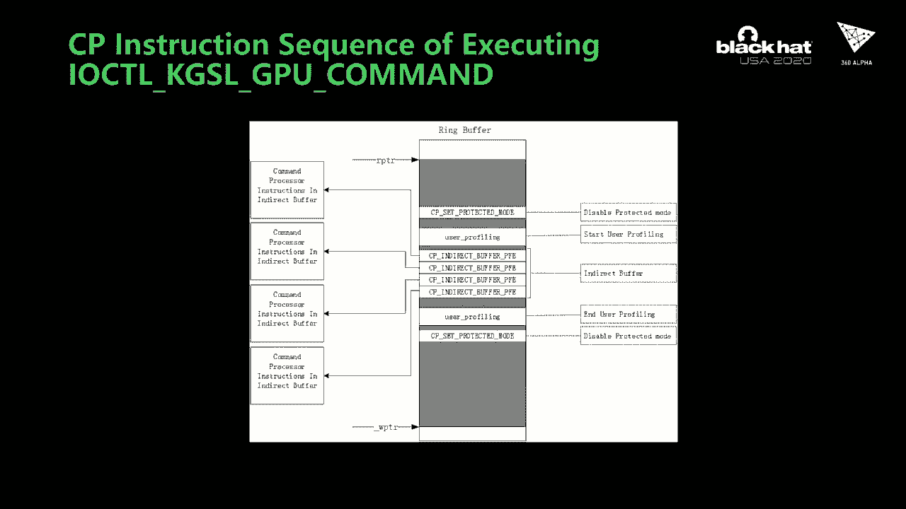

 mode。 As mentioned before， we can execute a CPE instruction from its middle， so we can explore。

 the buffer as shown in the future。 Before we trigger the buffer。

 the layout of a read buffer is shown on the left。 The first CPE in read buffer prefecture will jump to read-driven buffer。

 In this buffer， there is a CPE read-driven instruction which will wait until the value。

 is specified to become a specific value， as this moment is shown to continue in those， satisfies。

 So read-point-of， the read-point will point to the next CPE in due to buffer prefecture。

 instruction。 Then retrieve the buffer in the high-st the probability context。

 so we can pre-empt the， read instruction to modify read-point to Neo2。io。io。

 We'll see the GPU kernel。 The space before read-point is all free。

 Then we execute our control KTL/GV command two times to override the read buffer as shown。

 in the middle。 The GPU address of the second and fourth user-profiting command is carefully designed。

 CPE log-instortion and CPE protected the model's instruction。

 If the read condition is satisfied at this moment after executing some prefaged instructions。

 CPE log-instortion will be executed as shown on the right。

 CPE log-instortion will involve all the instructions until the CPE says protect the model。

 The CPE says protect the model's instruction will disable the protecting model。

 So the free CPE induced buffer prefecture instruction will jump to induce buffer with， protect of。

 Now we can change TTR to any manual， but its Georgians in the data buffer is a powerful， primitive。

 We can exploit to read and read arbitrary physical memory including code segments in kernel。

 It's easy to exploit it to get arbitrary kernel-color execution。

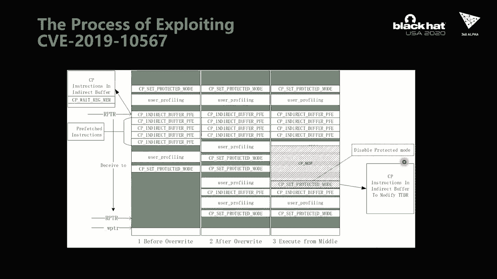

 At the end of my presentation， let me show you a demo of the whole exploit chain。 First。

 we launch a web server in the attack's computer。 Then the victim from access is the malicious link。

 We can see a reverse shell will be established。 Please wait for a moment。 Okay。

 we get a reverse shell。 Then the target can execute the download data by the way to exploit the data vulnerability。

 to get a load shell。 We run the load exploit。 You can see we have a load commission。

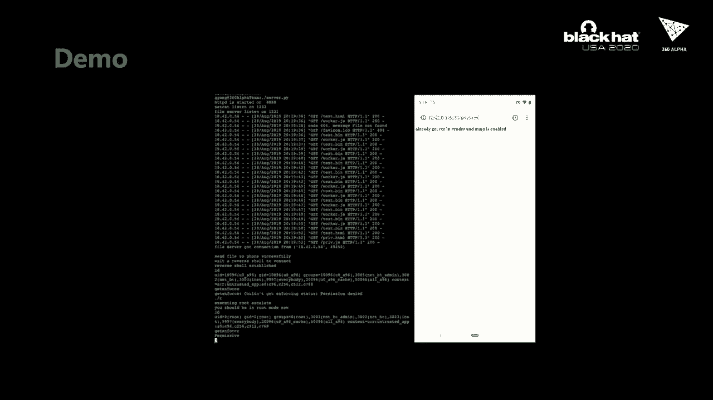

 And it's needed because it's disabled。 I showed a conclusion。 In this presentation， first。

 explain the web Google piece of phone in one of the most secure， smartphones。 Then。

 introduce the reverse italicopes of Android phone and 6 Android Express chain from the。

 BME over 6 years。 After that， we overview the express chain which can emotionally do to the order and joy-diver。

 say include Google piece of phone。 At the end， I detailed three vulnerabilities in the chain and how I exploit them。

 Okay， that's all for my talk。 Thanks for your listening。

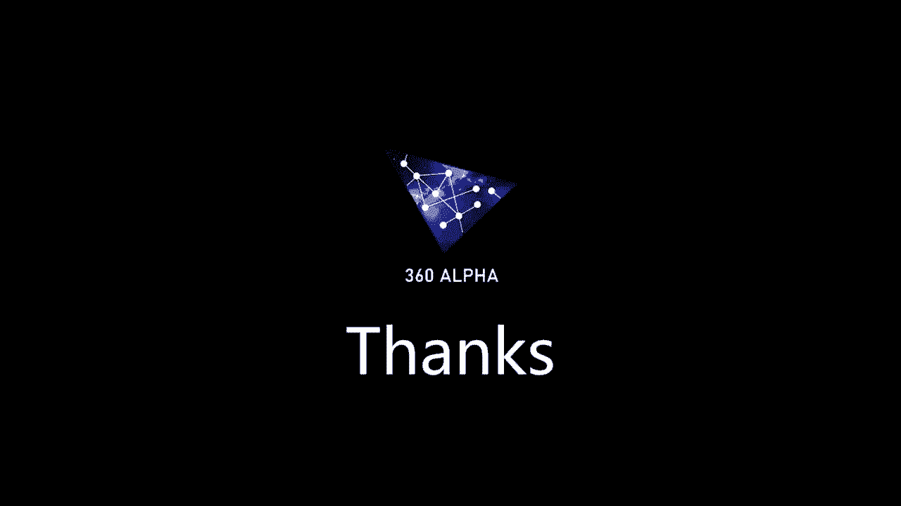

 Any questions？ Okay。 Hello。 Okay， thank you everyone for your listening for my talk。

 If you have any questions， you can contact me on R。V。R。B。 where we can answer that。 (buzzing)。

