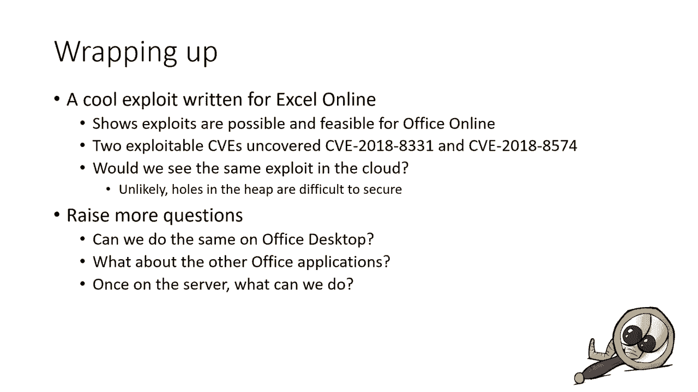

# 【转载】Black Hat USA 2020 会议视频 - P45：46 - I calc'd Calc - Exploiting Excel Online - 坤坤武特 - BV1g5411K7fe

 Hi there， this is Nicholas Jolien。 It's great to be with you today。 I hope that you are。

 safe and doing well in those difficult times。 I'm going to talk about a project that I did。

 in summer 2018 for Excel online。 I work for Microsoft at the MSRC and I'm doing this recording。

 from VUK， from home。 Actually， I'm living in Cheltenham in England。 I'm here to talk about。

 an exploit that I did for Excel online。 I guess that this presentation is going to take roughly。

 about 30 minutes or so。 I'm going to talk first about Office Exploids that we've seen in the。

 past years。 Then I will describe a bit the Office online server， what's going on there。

 how the services interact between each other。 Then I will dig on the vulnerability that。

 I found and how I managed to exploit it。 In Vienna， we will discuss a bit this exploit。

 see if this is a kind of thing that we could expect to see in the cloud today。 I hope that。

 you guys are going to learn a few things from this presentation and I really hope that you。

 will enjoy it。 Let's go。 Office Exploids。 A good thing when you work at Microsoft at the。

 MSRC is that you see loads of exploits。 By loads， I don't mean that we are going to see。

 exploits on a weekly basis， but often， those are quite frequent。 Office Exploids， I don't。

 think so in the recent years， but we saw some about two to three years ago。 I'm thinking。

 especially of those affecting the commanickers。 In this case， we cannot really talk about。

 Office Exploids as those exploits were actually targeting Windows components。 I did myself an。

 exploit on one of these commanickers， the Obseref moniker。 If you are curious， go check out。

 my output presentation that I did at last year。 Yeah， if you are curious。 Exploids targeting。

 Office core functionalities， those are quite rare。 I'm thinking about it。 The only ones。

 that I can remember dates from five years ago。 Those were targeting the Office EPS from Parser。

 The exploits at that moment were quite interesting。 I'm wondering why we didn't see that much press。

 about it。 If you are curious， go check them out。 Those are quite interesting as well。

 When I wrote those slides， I initially forgot about the stack over filling the equation editor。

 Why did I forget that？ It's probably because the exploit was too simple。 It was just a simple。

 stack smash in a component where absolutely no mitigations existed。 No such thing like。

 ASR or things like that。 The exploit was just trivial。 But apart from that， I don't think。

 that we've seen anything， at least in the recent years。 What about Office Online？ When I。

 initially did that research， I had never seen an exploit for Office Online。 We've seen bugs。

 I'm thinking about something that Juru reported to us a couple of years ago。 The history of。

 this VRP is that he found an issue in GDI and he managed to trigger it through a Word， document。

 The vulnerability here was an uninitialized memory issue。 We commonly agreed with Juru that。

 we wouldn't service this issue as this wasn't posing a significant threat to our customers。

 And then he came back a couple of weeks later saying that this issue actually affected Office。

 Online。 At that moment， this is a scenario that we just hadn't felt about。 His proof of concept。

 was just the same file， copied three times。 When you looked at this copy on Office Online。

 you could see that a different picture was rendered each time。 So here， we cannot really。

 speak about an Office Online exploit。 I don't believe that Juru was able to exploit that。

 but he was still able to demonstrate it。 So what about the Office Online server？ It's basically。

 just an IRS server running on a fresh build of Windows 10， where loads of services interact。

 between each other。 So when I did those slides， I dozed it off VM that I used as a testing。

 environment back in the days。 And it's amazing to see that in this VM， there are almost more。

 than 500 services running at the same time。 So of course， this is a testing environment。

 so it doesn't really compare to what you would see in production。 But that still gives an。

 idea of what's going on there。 So there are dozens of scenarios of usage for Office Online。

 The most common ones are， for example， when you receive an email from Outlook on the web。

 and this email contains some attachments， some of these documents。 So in those case， you。

 can just look， see those attachments in your browser， and then Office Online will run their。

 name for you。 Another use case scenario is just when you want to edit some documents， on the cloud。

 Then in this case， you will be directly interacting with the Office Online， server。

 So one thing that I'd like to to precise here is that there are two different servers。

 So there is a server that we call Office Online。 This is a thing that you can find on the cloud。

 so the public doesn't have access to it。 And there is another version that we'll call Office。

 on Prima。 And this one， you can actually don't know some builds。 If I remember correctly from。

 November 2018， with just a simple Visual Studio subscription。 If you want more recent builds。

 you need something like volume license agreements。 So it's a bit more complicated to get。 But。

 if you're curious， if you want to test things， you can still get a copy。 So let's come back。

 to this project。 So in 2018， we are seeing all these exploits affecting desktop Office。

 And the question there is， all right， so we know that the desktop Office is vulnerable。

 There are some medications， but yeah， there are those exploits。 But what about the online， server？

 Is it just possible to get an exploit there？ So this is the first question。 Just。

 make like some kind of feasibility study， see if one could achieve remote code execution。

 on the server。 And then the next question would be how would one do that？ How much time。

 would that take？ Would we need some things like， I don't know， symbols， for example， like。

 insider knowledge， insider information？ That's an interesting question。 And then in Vienna。

 if we ever managed to exploit a vulnerability， what can be that matter so that Office on。

 9 isn't such to make Office on 9 a harder target for Explider。 So you see several questions。

 that needed some answers。 So I choose to go after Excel online。 I could have gone after。

 a PowerPoint or a world。 I chose Excel， so there are several reasons for this。 So before。

 I joined Microsoft， I was working for a company named ViewPen Security。 And at that moment。

 I've done some a bit of research on Excel。 I found a couple of bugs。 I did a couple of， exploits。

 but that's quite some time ago。 And so I was already a bit familiar with the internals。

 how things worked there。 I just had a couple of ideas for complex exploits that I've never。

 really put in practice。 And so I was a bit curious to see if I could get something done。

 And then of course， I was curious to use Microsoft resources to look at Excel， because at that。

 moment， this is something that I had never done before。 So what is Excel online？ So as， I said。

 Office online is an IS server and Excel online is just a service running in， that IS。

 So it's basically a huge DLL Excel server that contains most of Excel desktop， core functionalities。

 So if you find a bug affecting desktop Excel， chances are that it。

 will also affect the online server。 So now we are in 2018。 And the question is， how do。

 we find a bug in Excel online？ So you know， Excel has been first like formed over 20 years。

 and by finders， externals also by the product team。 We did make sense for me to start running。

 a fuzzer maybe on the cloud。 I don't know。 We need to think a bit about that。 And also。

 what am I after？ What kind of bugs am I looking for？ Because Excel online， there are some。

 mitigations like that， PSR or things like that。 I need to get a small， an interesting bug。

 at least interesting enough so that I can bypass some mitigations。 Also， I'd like to。

 come back to one thing。 Why aren't we seeing more exploits targeting Office core features。

 especially because of mitigations？ Occasionally， we can have exploits that we call like one。

 shot exploits that just a file that would trigger such a complicated exploits that every single。

 mitigation would be bypassed at once。 That occasionally happens。 So here， the example that。

 I'm giving here is from three sevens。 It's quite quite an interesting exploit。 He started。

 getting here an image format and I think that he found a cool heap corruption and he was。

 able to exploit that heap corruption in such a way that with just one file， he managed。

 to get a remote code exemption even without even with a depth and ASR enabled。 Those are。

 very occasional exploits。 We don't see them every day。 What we see most commonly are exploits， with。

 for example， JavaScript engines。 So typically exploits for a web browser。 Exploits。

 where you can dynamically interact with your vulnerability， like typically with JavaScript。

 Or when you have a bug affixed into kernel， then you have certain APIs to play with that， bug。

 So there's our most common things that we see。 But for Excel， there's no such thing。

 There's no thing like JavaScript engine。 Actually， there is one， but you don't have access to， it。

 No， in Excel， there is something cool。 There are the formulas。 And when you think， a bit about that。

 Excel， I think a bit more than 200 formulas。 I don't remember the exact， figure。

 but it's something around that。 And when you think about all those formulas， then， yes。

 it's certainly possible to get something good done with this。 So think， for example。

 about all these string package。 You've got everything there。 If you want to manipulate， pointers。

 strings， then yes， you've got all the functions you need。 Everything that you。

 can find that you would be able to find in JavaScript， you can find it in just formulas。

 except formulas。 So there are still a couple of things that are more difficult。 I'm thinking。

 for example， of the fact that you cannot set a variable with the formulas。 So say that。

 you're in cell A3 and you type equal 3 plus 5， then cell A3 will be set to 8。 But within。

 that formula， you cannot set the content of another cell。 So this is one of the limitations。

 of this scenario。 But there are still several over cool things。 Typically， I'm thinking of。

 the lookup formulas that you can use to emulate for loops。 So here， the reasoning is such。

 If we can find a vulnerability in one of those formulas， then it might be possible to exploit。

 that issue with over formulas。 And this is the idea that I had at the moment， but this。

 is something that I've never managed to exploit myself。 So this is where I'm starting。 So now。

 how do we find an interesting bug for Excel online？ So here， I'm going to use my experience。

 So I'm coming back a long time ago， basically， when I started， I started in 2008 for a view， pen。

 So at that moment， it wasn't named view pen already， but that was coming。 And so I。

 started in September 2008。 And in October 2008， the next month， I remember there was。

 a patch for Excel。 And one of the vulnerabilities that had been fixed at that moment came， had。

 been reported by the ZDI。 So this was basically the first time that I was dealing with an integer。

 workflow。 So I remember going to that advisory and reading it probably 50 times to try to。

 figure out some clues as we were just clueless。 We had no idea what was going on。 We knew there。

 was something that was affecting the red formula， but apart from that， pretty much nothing else。

 So I do remember also the thing， that thing。 And I'm pretty sure that I spent more than two days。

 trying to figure out what was the issue。 I do remember seeing a multiplication that had been。

 changed in the fix， but at the moment， I was a new， I was not literally a beginner。 And to me。

 didn't make sense that just a simple multiplication could lead to a vulnerability。 Turns out the。

 vulnerability was quite simple。 Rep repeats a repeat formula， takes two arguments and a string。

 and a counter。 And if you multiply， if you multiply is a counter by the length of the string， it's。

 possible to get that multiplication to a workflow on 32 bits。 And then you'd then allocate an under。

 size buffer， leading that to ever a stack overflow or a heap overflow。 So I'd be and I found it。

 And， I was quite happy when I found it。 But then the question that I asked myself in 2018 is how that。

 bug had been fixed。 Because I did remember that bug。 I was very curious of it。 So I looked at the。

 code and then yeah， the bug was correct。 Yeah， 10 years after， no way this was still going to be。

 a vulnerability。 So at the moment， at the time， the developers fix that by introducing your function。

 called CBR up safe。 And this function just makes sure that the math is correct and doesn't。

 overflow。 So let's have a deeper look at that function just a checks on just some checks on the additions。

 and multiplications using a safe in type。 So yeah， nothing to nothing interesting anymore for us。

 there。 However， as we are looking for entry points in the code， potentially whenever entry points。

 one， it's what I felt at that moment was maybe I could just look for other references to this。

 function and see who calls that because again， I don't have much experience at that moment with。

 formulas。 I'm not sure of what what is going on there。 So， so I told you I walk from Microsoft and。

 I have access to the source code， but I still use either pretty much every day。

 And so I did look for， reference for us。 So just doing a simple Xref on the CBR in IDA。

 And this gives about 100 different， results。 And in this result。

 three of them points to a function called FM concatenate。 So you don't， have the symbols。

 but I can't tell you that the name of the function is FM concatenate。 Let's look， at them。

 And more particularly， let's look at the last one。 And when you look at the code in IDA。

 you see a bunch of multiplications and additions。 This is done right before a code to CBR， oxide。

 which is supposed to check additions and multiplications。 And so when you look at that as a。

 bug hunter， you think like， okay， there is something here。 It's not possible。

 This is this is too weird。 So the next thing you do， obviously。

 is trying to figure out who calls this function。 And then you， just by doing a simple Xref。

 you find a mentioned of a string named text join。 So at that moment， I'm like you。

 I have no idea what this is。 So let's let's look at the internet。 And a quick search。

 gave me this documentation from Microsoft saying that text join is just another formula using。

 concatenating cells and strings。 So pay attention to the first argument here， the denominator。

 So this can have several form。 And here we are interesting in the reference form。

 And this is where things get cool。 So when you look again at that assembly， you think that。

 when Xref has been first again for over 20 years， something like that。

 it's to be definitely missing， something。 And again， yeah， very something that I don't see。 This is。

 these are my first faults， literally。 And then just looking at the code。

 you can see the history and it turns out that in 2015。

 some new code had been added to that to that form。 And at that moment， as a developer decided to。

 support 3D references or references on three dimensions， column row and spreadsheet。

 And now once you have everything in mind， it's pretty much it's very easy to get a simple。

 book and the formula that you can see on the screen right now will trigger， I believe， an。

 access violation or right access violation in the vulnerable version of Excel。 That's cool。 We know。

 of our bug。 Let's see if we can exploit it。 So most of the time， the problem with those issues。

 is that you are going to hit the end of the page quite quickly and you won't be able to exploit it。

 Because usually you trigger your entire job of flow and then you allocate some space on the heap。

 and then there are several loops。 So in this case， there are like three different loops。

 which we'll be trying to write data on the heap。 So we need to get out of these loops。 We need to。

 find something where we can safely exit and control the corruption。

 And it turns out that it's actually， possible in this scenario。

 Very something that we can abort here。 So if one of the cells that we。

 are trying to concatenate contains an error， Excel will see that error and will just raise an exception。

 in this function。 And so in VN， we will just exit the loop without hitting that end of page。

 So this is a good thing。 That means that we have a controable heap overflow。 And this is quite good。

 One thing that I didn't mention is that we are writing pointers to strings， not just bytes。

 So let's look a bit more at this issue。 So there are a few constraints。 Of course。

 constraints from Excel， for example， the number of rows or the number of columns。

 But there are also something else。 As we are forced to trigger an issue， an error， an exception。

 Excel at the end of that function will just free everything。 Which means that those pointers that。

 you've just written， those pointers that you are using to overflow the heap， those will no point。

 to free memory。 And when you think a bit about that， you initially have an integer overflow that。

 leads to a heap overflow that no leads to sever use after free。 So at first， the primitive。

 looked good， but looking better， where it's not the best bug ever。

 But it's certainly possible to get， something。 And then comes the exploitation。

 So probably the first thing that you will try to do， is get a lick memory。

 because you need to bypass ASL。 So here， the memory is quite easy to get， an exploit done。

 It's because Excel stores string in memory with a counter on two bytes， followed by。

 the string itself。 Which means that if you override that counter。

 then you would be able to read past， the bounds of the string。 So once you've got that in mind。

 you can think about a scenario where you， would override that counter to that string length with a pointer。

 And then you would be able to read， past the bounds of that string。

 potentially reading things like the tables pointer something that， that。 So at that moment。

 the scenario is quite simple。 Just praise a heap， make some hope， make， some holes。

 triggers a vulnerability。 And then， yeah， let's cross fingers。 Let's hope that there is。

 something included to lick。 But you know， I'm not very scared of this。

 So it's probably going to work。 And if you've ever done something like that before。

 if you are an expert writer， you know that things， will never go according to a plan。

 There is always something that you haven't thought of。 And in my， case。

 it was the undo or control Z。 And this is quite cool。 Actually， when you think about that。

 when you type something in a cell， you can always revert your changer。 And then， except we'll just。

 keep everything in memory， which means for us that those strings， they won't be free like this。 No。

 and I totally forgot about that。 I didn't even consider this in the beginning。 So it took me a。

 couple of at least hours， good hours， probably days to realize what was going on。 I just couldn't。

 free my strings。 So once you've got that in mind， there are several scenarios where you can work。

 around。 So the first scenario would be to exhaust that undo stack， just enter so many actions that。

 in the end， Xl would be forced to free those strings。 So primarily。

 this scenario is that it would force， you to make so many allocations。

 And then the heap would be a bit unstable。 Your exploit wouldn't be， reliable。

 So I didn't opt for this scenario。 I went for another scenario。 So things have changed， since 2018。

 But at that moment， there was a button in calculate worldbook。 And using that button。

 you could actually commit your changes， which means that Xl would just free all those strings。

 everything that you wanted to be free。 And it wouldn't be possible for you to revert those changes。

 So this is what I did。 So now I've got my leak。 I know that overwriting a string length with a。

 pointer is enough for me to read past the bounds。 And this is what it looks like when you do something。

 like that with Xl online。 You literally get some Chinese results in your cells。 And now coming back。

 to the string package， this is where you can use it。 You use the string functions to just play on。

 these Chinese characters， which are in the end pointers。 So this is cool。 Now， what are we leaking？

 I believe that the first thing I did once my leak was working was to check every single formula。

 see if there was one that could potentially allocate some C++ objects with the tables。 Yeah。

 that would make sense。 I went over demo。 I didn't find anything。 That doesn't mean that。

 it's not possible。 There are some really complicated formulas。

 like typically I'm thinking of the pivot， tables， formulas。 Those are quite complex。

 and I wouldn't be surprised if in Vienna it was possible， to get something allocated with them。 No。

 I went for a different scenario。 I want to play with charts， graphs。 So again。

 there are dozens of charts， and each of them leads to allocate a different object， in memory。

 And those objects are C++ objects with the tables and pointers to other objects。 In my case。

 I found a graph with a pointer to a title object。 And that title object was had a pointer。

 in its structure to a string object。 And that was cool， because as I was overriding the heap with。

 pointers to string， I could potentially overwrite that object up to overriding a pointer to title。

 object， and then override that final pointers with some some control characters。 My intention at。

 that moment was to get a read primitive so that I would be able to read data from Excel server。

 Basically， disclose the entire binary。 Turns out that this scenario didn't work for various reasons。

 I could get it to work sometimes， but it wasn't reliable enough。 So in Vienna， I failed to get a。

 read/write primitive。 I just opted for more simple scenarios。

 I was assuming that I knew already Excel， serve， which is okay when you are attacking Excel on-prem。

 for example， you've got access to the， build so you can work around。

 you can have an idea of where your gadgets are。 And in Vienna， you would just replay a static wrap。

 That works。 And so in my case， I just managed to trigger a。

 Vtable code on one of those graphs to get a good execution。 And the exploit there was quite cool。

 because I just need to resize one of the graphs to get a good execution。 So you know what。

 I'm going to show it to you。 So I've got a demo here。 Hopefully it will work， reasons。

 So I'm going to comment it quickly。 So this is the Office Online server that you're， seeing。

 and this is the Excel online process。 So the best way to interact with it is just to create a。

 blank email and add an Excel file to it， and then preview it so that it will be sent to Excel online。

 Then we go to edit mode， which will enable us to interact with the server。 And so here we go。

 So now first thing I'm doing is spray the heap and make a couple of holes so that later I can。

 fill those holes and trigger a server in RBT to override the counter of a string。 And this is。

 what's happening here。 So we got successor， we got the expert server MBT succeeded。

 because we've got， that string showing weird characters。 And here we go。 Here。

 this is what I call my heap visualizer。 So I'm basically looking at the heap using Excel cells。

 So let's come back to the first spreadsheet。 Now let's make more holes and let's insert some graphs。

 So this is to be able to， lick something。 This is to be able to lick a V table。

 So if I remember correctly， yes there are two graphs。

 here that are put there just to be sure that it's going to work。

 Let's come back to my heap visualizer。 Did that work？ Yes， it worked。

 Because right now you can see those V tables。 You can see those pointers。

 So we just need to trigger as V or NARBT one last time。 So the third time to be to override one of。

 these V tables and hopefully trigger good execution。 And if things worked at that moment。

 we just need to resize one of those graphs to trigger one payload。 Let's see if we were lucky。

 Turns out that yeah， we were lucky。 Magic of the record did be moved。

 So let's discuss a bit this exploit。 Is it the kind of thing that we could potentially expect to see。

 on the cloud？ Maybe it's skeptical on this。 Especially when I'm thinking of all those memory manipulations。

 You need to sculpt the heap。 You need to be able to put some holes to trigger your vulnerability。

 But the problem is when you attack a production environment， there will be all those users working。

 on XS spreadsheet at the same time。 So to me it sounds a bit complicated to be able to reach。

 a state， a heap state that could potentially be useful for your exploit scenario。

 That doesn't mean that it's not possible。 Definitely not。 And the thing is with IIS。

 if your process crashes， then if your process crashes， then it will just restart it for you。

 And in the end， you just need one try， one lucky try to get your payload executed。

 So I found a burger。 It wasn't definitely not the best burger。 I actually found two。 The second。

 issue was affecting the forecast formula。 And it turns out that at that moment， those were not。

 available on the FIS online。 So I did not really look at them in the exploit scenario。

 The third thing is in VN， you just do with what you have。 And so I had one bug and I managed to。

 exploit it。 I'm quite convinced that by putting more effort on it， it's possible to get something。

 really cool。 Something where you could potentially leak and read the entire Excel binary。

 I didn't do that because I was limited on time。 But that's definitely something possible。

 And of course， this raises more questions。 So it's possible to do that on Excel online。

 Can we do it on desktop Excel as well？ Can you get， is it possible to craft an Excel file so that。

 everything will be done at the same time， bypass ASR， bypass depth， etc。 And then。

 add even an exploit for protected view。 I don't know， possibly。 And then of course。

 once you have control on the server， what can you do？ But then this will probably be a subject for。

 an X presentation I'd like at。 So I hope that you've enjoyed this presentation。 And if you have。

 questions， I'm always there。 Thank you。 Thank you for your attention。

 Hope you had a good moment with me。

 Thanks。 But thank you for listening。 I hope you had a good time。 So taking any questions？

 You must have questions， I'm sure。 Can I speculate if this same type of attack could theoretically be performed on something like Google。

 documents？ I have literally no idea of what's running on the Google Cloud。 So I cannot answer that。

 I guess maybe。 Yes， but I don't know。 She does Google guys， actually。 They must know about that。

 Any other questions？ Any other questions？ Come on， don't be shy。 Hi， Angelis。

 Can I approve this box？ No， but what you've got enough to build your own proof of concept。

 if you're curious。 I believe that you can understand that I'm not going to provide the X。

 Is it likely that world would be subject to the same variety？ So the book that I。

 exploited was in Excel。 So there was a former in Excel， very small such thing in the world。

 Is there any vulnerability in the world that could be exploited？ Yeah。

 but I'm sure I don't have any。 I mean that you can put on tree， get the same sort of thing in the。

 world。 But definitely with something else。 Do I know if detection capabilities with Azure something exists？

 This is actually a good question。 I am not aware of anything like that。

 There would be detections on the behavior of IS。 For example， things like if it's。

 a random process like CMD or this kind of thing。 Yeah， that would raise some alarms。 But。

 detections based on typically malicious Excel formulas。 No， I don't think that there's anything。

 right now。 Any other questions？ I like the question on the Google documents。 By the way。

 you should definitely ask those guys the same questions。 Anything else？ Come on， don't be shy。

 I can't see you。 In my exploit account， did I trigger any forensic login from the exploit？

 So I was testing on my own environment。 So there was no searching there。 There wasn't any AV or。

 anything in part there。 I know that exploit didn't trigger anything。 As I said。

 I was loading a library from a remote chair。 I tried to do that in your exploit。 You're。

 probably going to raise dozens of different alarms if you do that。 Anything else？

 I'm taking advantage of this Q&A session to remind you that we've got。

 job offers in our team in Chaltnom in the UK。 So if you want to work with me， then you're。

 must welcome to bring me on Twitter or just a look at the job that we've learned。

 I would love to get your city。 In your questions。 Thank you， anyway。

 for great feedback on this chat。 I can see that you， enjoyed the presentation。 So that's good。

 [silence]， Anything else？ What is our no-var question then？ I think I'm good to review them。

 Thank you all for following me。 Have a great day guys。

