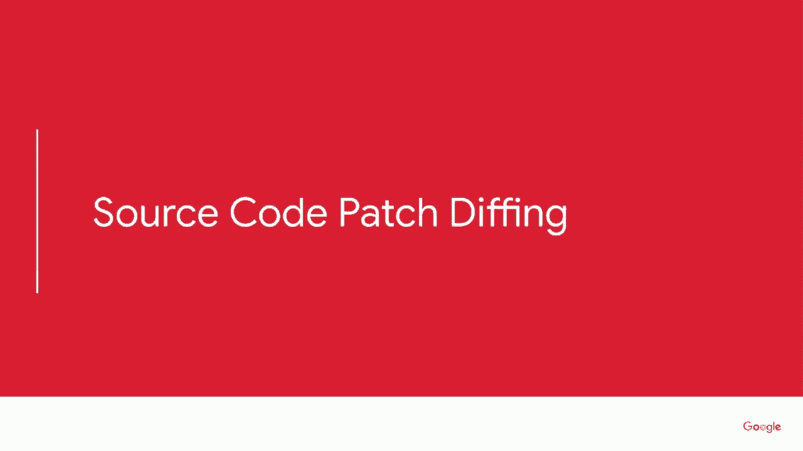
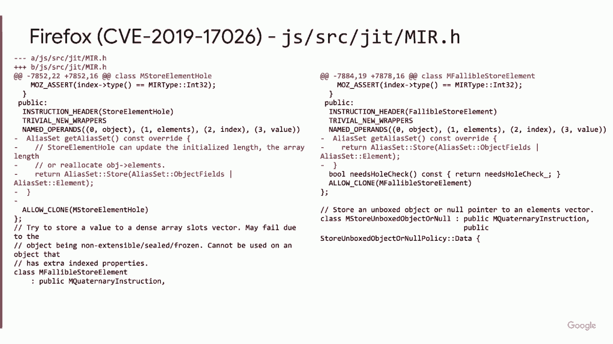
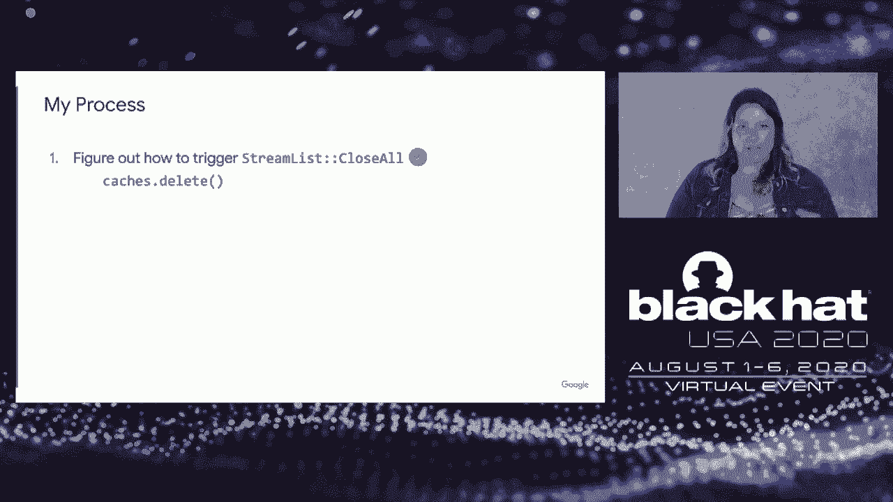

# 【转载】Black Hat USA 2020 会议视频 - P46：47 - Reversing the Root - Identifying the Exploited Vulnerability in 0-days Used - 坤坤武特 - BV1g5411K7fe

 Hi， I'm Maddie Stone and this is Reversing the Root， identifying the exploited vulnerability。

 and zero days used in the wild。 So as I said， my name is Maddie Stone and I'm a security researcher on Google Project。

 Zero where I focus on zero days used in the wild。 So understanding them。

 analyzing and seeing what we can learn and act based on them。 So why did I want to do this talk？

 Why do I think it's worth your time？ Is that we care a lot about making it harder for people to exploit users using zero days。

 And so when zero days are， exploits are detected in the wild， that's the failure case for。

 these attackers。 And so we need to learn as much as possible each time that happens。

 We need to learn what their vulnerability is， use those data points to help inform how。

 we're going to respond to it， such as variant analysis and other systemic changes to kill。

 bug classes or break exploit methods and not work in this sort of theoretical realm， but。

 take each of those few cases and really make sure that we're using those as the data points。

 to inform what we do。 And so one of those big integral parts is doing a root cause analysis。

 Because a lot of times when we see here about zero days， exploits and whether that's a blog。

 or news or things like that or even just an advisory， they talk about maybe what the malware。

 payload is， maybe what the threat actor behind it， the goals。

 But a lot of time they don't really get into the nitty gritty of how did those attackers。

 get that initial access to then go and do the bad thing。 So us at Project Zero。

 we're really focusing on each time a zero day is detected to perform， a root cause analysis。

 And the goal of these root cause analysis comes down to figuring out what that vulnerability。

 is and in such depth that we can trigger it through a POC because that really shows you。

 you know all the details and not just sort of the overarching summary。

 And then how did the attackers exploit it？ Like what was that exploit methodology？

 And those are the two big things of the foundations that then allow us to move on to act， have。

 suggestions for where should we invest in research and different things like that。

 In this presentation though， our focus is about that vulnerability。

 And more so than just giving you a presentation in the survey of what are those root cause。

 vulnerabilities that have been used in the race and zero day exploits is that we want。

 to talk about that process。 Reverse engineer to reverse engineer， how can we become more efficient。

 come up with， new ways to make sure we're more precise when we dig down into the information we have whether。

 it's the exploit or the patches or tips to figure out what that vulnerability is。

 And then that allows us to make hypotheses and brainstorm to come up with our next steps。

 and our actions based on the facts of the vulnerability。 So just as a brief。

 I'm giving this you know three weeks before， y'all are seeing this。

 presentation so these all of these root causes should be published for your perusal。 And so we。

 for each of the case studies， there is a root cause analysis we've already performed。

 that include all of this detail as well as the information about the exploit method and different。

 hypotheses and brainstorms we have about those facts。

 And we also have others published so you can go to our website to see the case studies。

 covered here as well as the others we've investigated。

 So to be very open and transparent with you though， these are the take the ways I hope。

 that you have and what I sort of， how I pitched this talk to the review board is the first。

 thing I hope that each of y'all and not in the room but on your couches and your sweats。

 Gain from this is one， there's a lot of different ways to reverse engineer vulnerability。

 We sometimes talk about the different processes as a monolith where in actuality there's a。

 lot of creativity and a lot of different choices you can take to raise your likelihood for success。

 as well as useless resources have to invest less time， skills etc。 to get the answer。

 I also want to be frank that not every endeavor is successful。

 And so I'm presenting two case studies where I failed。

 I didn't quite get to the end but I don't want those to be discouraging for anyone else。

 who wants to get in this realm。 We can use you， we need more brains working on these problems。

 And so each time we don't get to the end goal or have a success of identifying the root。

 cause we have a lot to learn from that that we can then apply if we're deliberate to the。

 next set to raise our probability of success。 Lastly。

 sometimes there's a lot of resources describing what a technique is but it doesn't。

 get into the nitty gritty of how it appears in practice。

 And I've heard sometimes it's hard for people to take those theoretical descriptions and。

 apply them。 So hopefully this talk will show you through seven different case studies how not everything。

 has to be the same and what are some of those differences that you can see when root causing。

 one zero day to another。 And you know， pandemic brain has gotten to us all and I'm here recording this talk with。

 no one in the room so let's have a little fun with it。 So yo， yo， yo， I'm baddy stone。

 I got these zero days so let's talk about the ways that。

 we get to the root so we can scream woot and when the root cause that bone life won't be， so dull。

 So hopefully this talk isn't dull。 We have some fun talking about processes and how to be a better reverse engineers。

 My goal is to start the conversation so I can learn from you。

 I can share what we approach zero during and so let's get into it。 First off。

 want to make sure all of us are starting from the same foundations， understand。

 what terms I'm using so let's cover basic super quickly。

 The four categories of techniques I'm covering and sort of classes of techniques are one。

 reversing the exploit sample。 I think that's what most people think of when you say you're going to analyze a zero。

 day exploit is you're going to load it into IDA or take the bytecode into another tool。

 and start line by line statically reversing it。 I want to show you some case studies of other ways that can appear and that's the one that。

 usually happens when you actually have that zero day sample。 However。

 there's a lot of cases when you don't have those samples and so that's where we get。

 into binary patch dipping which is well written about well research but it can still take a。

 couple different looks and there's a lot of different ways or lessons learned I have from。

 giving it a shot so that's the second category。 The third is source code patch dipping and that usually comes into play for the code。

 bases where that are open source such as Android， Chrome， Firefox， etc。

 Or you may be have privilege access as a vendor or a partner such that you can see the source。

 code patches and the repos or the changelogs so that's when you may use that technique， instead。

 And lastly sometimes in our industry they're sharing or we receive tips about exploits。

 that are in use and so that's sort of what I'm calling bug hunting based on exploit details。

 You don't have patches and you don't have an exploit but you've received some details。

 so how do you work on that。 This is just a simple overview for anyone who hasn't worked in this space at all of。

 some of the questions you ask yourself and how you end up at some of the different techniques。

 And the last other thing that I think is interesting is that your role plays a big part。

 in how you go about this root causing。 Sometimes you might be the person who discovered the exploit and so your goals are largely get。

 it patched from the vendor so you may or may not decide to root cause and you will also。

 be regularly reflecting on how much of your time and resources should you invest。

 Because if you decide oh I have this exploit I have this crash and I don't want to report。

 it until I have that root cause vulnerability and I'm super confident then you're allowing。

 time to continue without it being patched versus sending it to the vendor even if you don't。

 understand exactly how it works。 So in that case you often have access to the exploit but not necessarily the source code。

 or that vendor developer expertise on whatever it's exploiting。

 Next you're the vendor of you probably have the most access to details whether that's。

 experts who actually wrote the code that's being exploited。 You have the source code。

 You likely have the exploit or the crash from the original discovered or cause they reported。

 it to you。 And so you also can't really make that decision of oh no this took too long deciding I'm not。

 going to root cause it all the way。 You're going to need to hopefully take it all the way to the end。

 And lastly there's third party which may be users or researchers who may see in the。

 advisory see a mention of blog post that something has been exploited in the wild and。

 you likely have the least amount of information and you also need to decide what your investment。

 of how much time and energy you want to put into it。

 So I'm presenting seven case studies here and all done of root causes done by project。

 zero and project zero's role has gone through each of these three at different times。

 Sometimes we discover it sometimes vendors ask to partner with us for expertise to help。

 them figure out patches or the root cause and most often we're the third party researchers。

 who are trying to dig in and learn as much as we can without being either the two。

 So now let's get into the fun stuff of the case studies。

 So the first category we're going to go into is two different case studies of you have。

 the exploit on hand and you want to root cause it but it can take two very different looks。

 So the first one is a series of windows J script exploits that were exploited in the wild。

 So it started with CVE 2019 1367 and then went on to CVE 2019 1429 and finally 2020。

 067 4 and those are all trivial variants of each other。

 So all three of these were immediately or originally detected by Clemon of the Google。

 threat analysis group and Clemon did some of the exploited analysis while Yvonne from。

 project zero did the root causing of the bug。 So here are the three Microsoft security advisories and the first one in their description for。

 each of them is a remote code execution vulnerability exists in the way that the scripting engine。

 handles objects in memory and Internet Explorer。 So Yvonne's ready to dig into this figure out what the vulnerability these exploits are。

 exploiting are and I think one of the important things to remember is Yvonne has studied and。

 written tooling extensively for J script。 He is not new to this platform。

 He has published a lot of research in the area and when he looks at this looks at the。

 exploits sample he doesn't decide to try to statically reverse it。

 Instead he decides to run the exploit through a simple custom test case metemizer which I。

 thought was a really cool idea and why I wanted to include it here。

 So this is the main portion of the code from the exploit and Yvonne's test case metemizer。

 was simple in the fact that you put in the exploit it ensures it crashes and each time。

 there is a crash it removes a line of code。 If the exploit no longer causes a crash once a line of code is removed then that tells。

 you that that was important for triggering the vulnerability。

 So the test case metemizer tells them that it's these lines of code that are responsible。

 for triggering the vulnerability。 And that's what those codes in format look like。

 So from that Yvonne then annotated it for us as well as cleaned it up a little bit。

 So what the vulnerability was when you take those two lines is that down at the bottom。

 a radar sort is called with a custom callback that function F。 And so we can see them the。

 definition of function F。 So the first thing it does is it creates a bunch of objects。

 otherwise known as JScript variables。 And it then stores a reference to one of those objects or variables in the arguments array。

 And the key here is that the arguments array isn't tracked by garbage collector。

 So then in step four they delete all of the objects or the JScript variables and then call。

 garbage collector so that all of those are reclaimed。

 And lastly though we still have the reference though to one of them in the arguments array。

 giving us the use after free。 So that was a really cool idea I thought and it was super quick。

 But if Yvonne hadn't had all of this expertise in this bug class specifically as well as。

 tooling that he had already created for JScript probably would have taken him a lot longer。

 And so that expertise and experience already with setting up tooling for JScript definitely。

 came in handy。 The next case study we're going to cover is the iOS uncover jailbreak。

 So we in Project Zero don't technically consider this as your day exploit that's used in the。

 wild but you still had to go through similar actions to root cause the vulnerability。

 And Brandon recently published a blog post on this so I thought it was interesting。

 I'm going to cover some of the highlights that Brandon showed which I thought were super。

 interesting and thus willing or not willing wanting to share with y'all。

 So first as one does he took the exploit and opened it up in Ida with the intention of。

 statically reversing but he saw that it was heavily obfuscated and Brandon was like I。

 think I can try something else I can pivot I don't need to commit to statically reversing， it。

 So instead he decided to run it on a device。 So Brandon has a lot of expertise in iOS kernel exploits and so to him he was like huh many。

 memory corruption based exploits have this critical section where the kernel state is。

 corrupted and so if the exploit doesn't continue and instead is stopped then the system is unstable。

 So he had the idea load that cover app onto the device and press stop in the middle of。

 it and that led him to a kernel crash。 So he was right on target there and the key here is that it was interesting this kernel。

 panic says there's a use after free in the Calick dot 16 allocation zone of the kernel。

 So he wasn't fully trusting it quite yet but was like this is worth tracking down and。

 seeing if there's anything there。 So the next step was he wanted to determine if the vulnerability relies on reallocating。

 a Calick dot 16 allocation as if it's a use after free or something like that。

 So he wrote an app that continuously allocates and frees to that zone because if it does。

 then it's messing up that reallocation and thus should break the exploit and it did。

 As soon as the jailbreak button was pressed in the uncover app while the app that does。

 reallocating was running in the background there was a kernel panic but this didn't happen。

 when Brandon changed his custom app to Calick dot 32。

 So that's telling him then yep you're right on target this exploit relies on a reallocation。

 to the Calick dot 16 area。 So next he analyzed the stack traces from those use after free cat just and he's symbolicated。

 it which I didn't know was word but I love it now that I do。

 So once he's symbolicated it it looks super interesting Brandon had recently completed a。

 study of iOS exploits and he the LIO underscore list I/O called Cisco immediately caught his。

 attention because from that survey he looked into light speed and light speed based exploits。

 were dependent on the vulnerable Cisco of this LIO list I/O。

 So then he started to dig into how does this exploit run compared to the original light。

 speed exploit they weren't exactly the same but he went ahead and used check rain and pungo。

 I/O to patch that Cisco in the kernel cache and that was then how he was able to determine。

 that the exploit methodology had changed but Apple had actually reintroduced the original。

 light speed bug into the back into iOS and so that's how he root caused the vulnerability。

 So a few takeaways is with the exploit sample Brandon did this had the identified the vulnerability。

 within four hours in a POC or proof of concept within ten but his expertise in kernel exploits。

 I would think definitely played a role as well as recently studying previous exploits。

 So because of that he was able to quickly identify the similarities with LIS style or similarities。

 with light speed and I think that's an important reason for us to continually publishing and。

 looking back at historical zero day exploit data。 I think it's also important to highlight he didn't pause or see any reason not to pivot。

 and switch to dynamic reversing when that when he saw the exploit was obfuscated and thus static。

 reversing might not be as reliable or as quick。 And then one other line that was in his blog post that I thought was super interesting and。

 wanted to call out even though it didn't work in this case is Brandi used his knowledge。

 that iOS exploits often use mock ports for their exploitation and so he wrote an app that。

 was turning the IPC port zone and when the uncover exploits still worked while that app。

 that was turning IPC ports was running it suggested that the exploit used a different。

 exploitation method that didn't rely on heap grooming of the mock port allocations。

 So I thought that was a super interesting if you're looking at iOS a good way that he。

 used his knowledge to then try and apply to figure out what a root cause was。

 So that was what you do when you reverse the exploit and you have the exploit sample on。

 hand now let's get into binary patch dipping。

 So these talks were cut down from once black hat with remote so this is going to be a super。

 quick section both of the case studies have been talked about and blogged about as well。

 as binary patch dipping has been talked about a lot so instead I want to answer some questions。

 of process that haven't been answered elsewhere。 So the first case study is the what's that won't from last summer that was allegedly。

 used by NSO and Facebook's advisory for said it's a buffer overflow vulnerability in the。

 what's app VoIP stack which allowed RCE via a series of RTCP packets。

 So I did a full talk on my binary patch dipping process for this vulnerability so there's。

 the video in slides if you want to get more in detail but from that I had some more questions。

 of how did you decide what to binary patch dip。 So to take a step back and cover that is when you have a mobile app you need to make the。

 decision is it iOS or Android that's going to largely come from your expertise I used。

 to be on the Android security team much more expertise than Android so I went down that。

 route if you have expertise in neither iOS or Android I'd guess that Android is probably。

 the easier place to start with open tooling and things like that。

 Next the question is there's a lot of files in Android APK's where do you start your。

 dipping and first is it going to be the Dalvik bytecode or native code so Dalvik bytecode。

 is the compiled Java or Kotlin from an Android app where native code are libraries that are。

 compiled CRC++。 So having read Natalie Sylvanovich's mini blog posts about analyzing web conferencing and。

 video conferencing apps I saw that that's often a native code so I'm that narrowed it down。

 to just native libraries however what's up had 16 of them for each of the different architectures。

 that support it so the next step is figuring out which of these is do you use and thankfully。

 I turned my chair around asked Natalie and she said oh if it's doing RTCP that's usually。

 a string in whichever elf is doing that behavior and lib what's up there so was the only one。

 that had that string and so that is how I got to that point which is described in the。

 other conference presentation of how I started and how I made the decision of what to do。

 binary patch dipping on for that vulnerability。 So I statically reverse engineered it then to understand the patch and then use dynamic。

 tooling a tool called Freida for dynamic instrumentation to understand how the patch function could。

 be triggered and as I said to hear more about all of that go ahead and check out the other。

 presentation。 The other attempt in my first failure case of attempting to root cause analysis of vulnerability。

 was a Windows Win32K VON that was disclosed last December it was detected by Anton Ivanov。

 Ivanov and Alexei Kulejev of Kaspersky lab and the Microsoft security advisor said that。

 it's an elevation of privilege vulnerability that exists in Microsoft when the Win32K component。

 feels to properly handle objects in memory。 So I taken on this role at Project Zero wanting to study more zero days that are exploited。

 in the wild but I had no Windows experience and that seemed like a gap that I wanted to。

 address so I figured hey this is as good a time as ever to jump in and start looking。

 at Windows for the first time。 So I attempted to begin by an Apache to think this bug。

 I thought I found it， wrote up a root cause on it， wrote a talk to show how it's triggered。

 finished a full blog post on it 24 hours before the blog post was set to be published。

 We sent it to Microsoft as we do for vendors just to give a heads up 24 hours beforehand。

 and they came back and said nice work but this is the wrong vulnerability。

 So I think this is one of the weaknesses or struggles of binary patch dipping is you're。

 looking at a monolith of it can include lots and lots of different vulnerabilities within。

 that file。 And it came down to I made a wrong assumption as I was getting ready to patch of I had updated。

 this Windows 7 VM and once I got to September the only other option Windows update gave me。

 was to update to December when the vulnerability was patched and despite all my maneuvering in。

 the Windows update gooey I couldn't get it to offer me an October or November patch。

 Do I falsely or incorrectly assumed maybe they just weren't those it's an old piece of software。

 maybe they don't too monthly。 So I patched it September to December and it just so happened there ended up to be a vulnerability。

 that matched all the details I knew about the exploit but it was actually patched in October。

 and must not be correct vulnerability。 So to hear more about that full process I did of getting up to speed on patch dipping。

 on Windows as well as what happened and what went wrong feel free to check out the blog。

 post but I also think this is a great case because Pjilter Flurechik got it right and。

 so he also documented his process and showed how he got to the correct end result。

 So some conclusions on binary patch dipping as a whole it's generally the most time consuming。

 of all the methods but it's also one of the most documented and there's a lot of tooling。

 that's gone into it and research gone into it so that's cool and interesting。

 This is one that usually only needs to be done if you're playing the role of third parties。

 not as much vendors or detectors but I do think it has the highest likelihood of getting。

 it wrong and sometimes not even realizing you got it wrong like in my case where I ended。

 up reversing the wrong vulnerability and so I think that's something to keep in mind of。

 what's your goals and constantly evaluating against the amount of investment resources。

 it takes。 So the next category is sorts code patch dipping。

 So this will happen as I said much more often when you're looking at vulnerabilities or exploits。

 targeting open source software。 So in this case this is Firefox it was actually disclosed in January of 2020 not even though。

 it has a 2019 CVE it was detected by Chihu。 Samuel Gross from our team analyzed it。

 The Mozilla bug security report is now public and de-restricted but when Samuel completed。

 his process it was not so he's going through the process of just looking at the patch seal。

 and only having the information that was in the Mozilla security advisory where they said。

 it's an incorrect alias information and I on monkey jit compiler for setting array elements。

 that could lead to a tech fusion。 So two files were changed in this patch the first one being alias analysis dot cpp and。

 so what we see in this file is that there's this giant switch case statement and they're。

 moving the store element whole and the fallible store element operations from one section of。

 the case to another。 Okay so we're looking at store element whole infallible store element。

 The other changes much more informative so it's in my r dot h which is medium intermediate。

 representation I think the in my might have gotten wrong but you get the gist and so we。

 see that they're actually only doing deletions and so the vulnerability is within the alias。

 information and this alias information describes any side effects a jit operation can have。

 So in this case they're changing the store element whole infallible store element operations。

 and what they're doing is that originally the code said that store element whole infallible。

 store element the side effects they can have is they can only influence the object feels。

 in the element fields but this was incorrect because they could actually influence。

 Anything and so by deleting this they're now telling the jit compiler hey store element。

 whole infallible store element need to be more generalized so if you execute one of these。

 assume anything can be changed and looking at this Samuel was like immediately this is。

 an incorrect side effect modeling issue in the jet jit endred。

 Samuel also an expert in this blood bug class specifically as well as jit engine exploitation。

 So from there he had the bug class within you know a couple minutes of opening the patch。

 but it still took him two days to figure out the park so the process he went through。

 is from looking at that patch he was like huh this likely causes unexpected execution。

 of arbitrary JavaScript。 Maybe that's index index successors in the prototype chain no the jit compiler guards。

 against that but the thing is is they will happily accept negative numbers as the index。

 and so when they accept that negative number as the index it allows writing a property。

 and not an element and these are arrays so you're writing the array property instead。

 of an array element。 And so if there's a property setter on the property negative one that will pass the jit's。

 requirements about what input objects are allowed but it's also going to cause unexpected。

 execution of job script during those two operations so that's the root cause vulnerability。

 And so from that I thought it was interesting in this case how Samuel was like it was immediately。

 obvious to me what that bug class was but to get down to fully understand the vulnerability。

 such that you can write a trigger or a park for it it took much more time and so that keeps。

 us thinking of huh with someone with minimal or no experience have been able to figure。

 it out as well。 I think that experience probably was pretty critical。

 The second case study here is another Firefox bug because I thought it would be interesting。

 to do a tale of two fireboxes and compare them and this is another failure case if we。

 want to call it back or learning you know development opportunity。

 So this one was disclosed in April of this year and it was detected by Francisco Alonso。

 and Javier Marcus and the security advisory said under certain conditions when handling。

 a readable stream a race condition can cause a use after free。 So the bug was still de-restricted。

 Mozilla usually keeps them it seems de-restricted for three to six months ish but we had the。

 patch seal。 So the patch is actually in the cache subsystem in the streamless。cpp file。

 This is the only file that was changed and they only changed this one function streamless。

 close all。 And so the changes is that originally streamless close all would call on the stream control。

 object close all。 Stream control is the parent or the browser side of the IPDL interface。

 So this actually took me a while to figure out because like the windows one I had no。

 browser experience but thought huh I want to give this Firefox thing a shot and see how。

 this turns out。 And so IPDL it turns out is the IPC mechanism within Firefox so it's allowing browser side。

 process to communicate with render or content side process。

 So what they're doing is instead of just calling close all they're first setting that。

 stream control pointer to null and then calling the stream control close all and then calling。

 shutdown。 So if we're setting it to null my first thought is where else is stream control checked what。

 else can it influence。 And so it turns out there's four different places that check whether or not stream control。

 is null and each of these functions if stream control is not null will call close or shut。

 down on the stream control。 So my first thought about this is suddenly huh maybe that use after free is two threads。

 two of these calls racing with each other such that in one case it's free and then they're。

 still calling the other close or shut down。 And so this seemed to start panning out because the shutdown call will end up calling sends delete。

 which does the free on the stream control。 So my process after this of what I thought you know coming in with a very naive not really。

 knowing IPDL or any browser internals。 So my first thought is figure out how to trigger streamless close all and that actually happened。

 pretty quickly figured out caches。delete that's how I can call it。

 The next step was I thought huh maybe I should find two ways to trigger it because that is。

 how it might have to race or something like that。 So to do that which I got some suggestions from Sergey and I think Samuel or Mark on our team。

 that run the unit tests for it to see if anything else can trigger that code。

 So that's what I did and I found that there was this other function that allowed it。

 But this highlighted where I made a wrong assumption of this and another vulnerability。

 were both disclosed at the same time。 So you make the safe assumption of one's going to be a renderer exploit and one's going。

 to be the sandbox escape。 I had for some reason I don't know that I made the conscious decision but I'd been operating。

 as if this was the render exploit。 But you couldn't call clear storage for principle from an unprivileged renderer and that's when。

 I realized that no streamless close all is on the browser side and so this is actually。

 the sandbox escape and the other one was the render exploit。

 So now we can operate as if we have a compromised renderer and that's how we're triggering this。

 vulnerability。 So the next step I thought was huh so now let's try and do this from two different threads。

 There's a race condition going on。 But I can never get that and it makes sense now that I understand more about IPDL of that。

 there's only one parent side of that interface but with all of my tests I could only get the。

 calls queued not in a place where they raced with each other and at that point I decide。

 it's time for me to move on。 I had a look at what was the return on investment when I knew the bug would be restricted at。

 some point and the reporters of the exploit had also said they'd write a blog post。

 So that's where I decided to pause， call it and I actually started more research on IPDL。

 because I thought this would be interesting to learn more about。

 Fast forward I spent more time learning IPDL internals and the bug is de-restricted and。

 it realized I got it wrong。 That's what didn't need to be the process。

 It's not actually a race condition of trying to get two of those calls to race with each。

 other from different threads。 Instead there's a recursion happening that allows for the use after free。

 So I made an incorrect assumption that led to me going down a process that of course。

 was going to have me spin my wheels。 And so some closing thoughts of。

 "I didn't figure out the root causal and the ability， in a timely way。"。

 I ran into a couple of hurdles of assuming it was a render exploit and not the sandbox。

 escape as well as getting stuck in IPDL internals and trusting the term race condition。

 But it's also promising of that as soon as the bug report was de-restricted it was really。

 obvious to me exactly what the vulnerability was which means likely more prepared in the。

 future and so I hope no one gets discouraged if you have failures early on but want to。

 get into the stuff of just keep going， just keep working。 It's a normal part of the process。

 And a few more source code patch dipping conclusions as I'm getting tied on time of。

 more likely how to getting correct than binary patch dipping due to it only being one fix。

 at a time。 But I think something we have to remember is that in order to do source code patch dipping。

 effectively we do really rely on transparency from vendors。

 I know vendors don't do transparency exactly to prevent source code patch dipping but we。

 need to remember that in those case the attackers still know what the vulnerability is。

 So they are operating with more knowledge about what went on in the security issues than us。

 as the defenders。 So hopefully vendors will continue to be transparent that this is a security fix or this。

 fix in our repos was for this bug for example。 So lastly super quickly sometimes you get tips about an exploit and that happened for。

 me on the Android binder bug that I reported and was disclosed last fall。

 So how it started I received a scripted list of characteristics about the exploit。

 I go into this in full details about the process what happened if you want to know what the。

 why we you know all that stuff in the blog post as well as an offensive con presentation。

 What I wanted to highlight is so I got these details what do you do with it because this。

 isn't something that never happens in our industry it actually happens a fair amount。

 for people but it can seem very intimidating to be where do I start。

 So first I come through change logs and patches because that was one of the big things and。

 the focus was how do I break this down and use programmatic efforts to really narrow。

 down the area I need to search for。 So for me that was what's in pixel three but not pixel two as well as using the Linux。

 kernel mailing list to look for any patches that affected list at or list del due to the。

 information in the description about config debug list。

 And so one thing that haven't talked about as much is that I originally thought I found。

 the bug but once I got into finally comparing it to all the details it didn't match a single。

 one of those it didn't match one of those details it matched all the rest。

 And the other thing is sure maybe things have changed since the detail list had come。

 out but it also seemed very complex to exploit when you could likely find an easier bug to。

 exploit and so it just didn't feel right but getting one more detail allowed me to find。

 it within I think it was one or two working days。 And so using that information to identify exactly what the vulnerability was with extremely high。

 level of confidence nothing else matched can just make a difference。

 And so some of the biggest thing I would like to highlight here is that when we're talking。

 about role and we're talking about investment is that oftentimes if you receive these details。

 about the exploit it means that it is still actively being exploited with no one knows what。

 the patch is no patch has been deployed and so there is a much bigger return on that investment。

 of really going in because otherwise it's going to continue to be exploited without being， fixed。

 So I hope we all try and do that as well as continue to build tooling that allows some。

 of those details to be searchable programmatically rather than having to be manual。

 Whew that was whirlwind but my conclusion for you is that one I think there's a lot of。

 innovation happening in this process that we can share with each other even though we tend。

 to talk about it as reverse engineering as a monolith but I thought it was really cool。

 you know the test case immunomizer forcing crash while running etc。

 So I hope we all continue to share the different techniques we use with each other and I would。

 also say something that's been struggle for me is making sure I challenge any assumptions。

 that come from descriptions whether that's people's blog posts or an advisory is not taking that。

 as you know sort of the word but really thinking about because a lot of the terms of art we。

 use can mean slightly different things to different people but lastly the biggest guarantor。

 for success is in end up the knowledge of the target and exploit death and that's not shocking。

 to any of us especially when you consider how many people report bugs or exploits without。

 doing that root cause vulnerability analysis they just send it to a vendor with a crash。

 or a sample because it is hard and it's not a specific technique is going to fix that but。

 the cool thing is is we can all grow experience we can work on growing our red team exploit。

 dev knowledge we can work on really digging into a single platform so we can all do this。

 and continue to contribute to that root causing and with that thank you I hope you enjoyed。

 this from your couch in your sweats and as I said there's lots of resources available。

 as well as the detailed root cause analysis for each of these zero days as well as others。

 on the project your website thank you。

 Hello thank you all for coming I've been told that I did a very long talk so we don't really。

 have any time for questions but I appreciate you all tuning in feel free to contact me on。

 Twitter or my email is mavistone@google if you want to talk more about this as well as。

 I'll get the slides up and lots of resources and I'll stay on chat for a little bit longer。

 so thanks again。