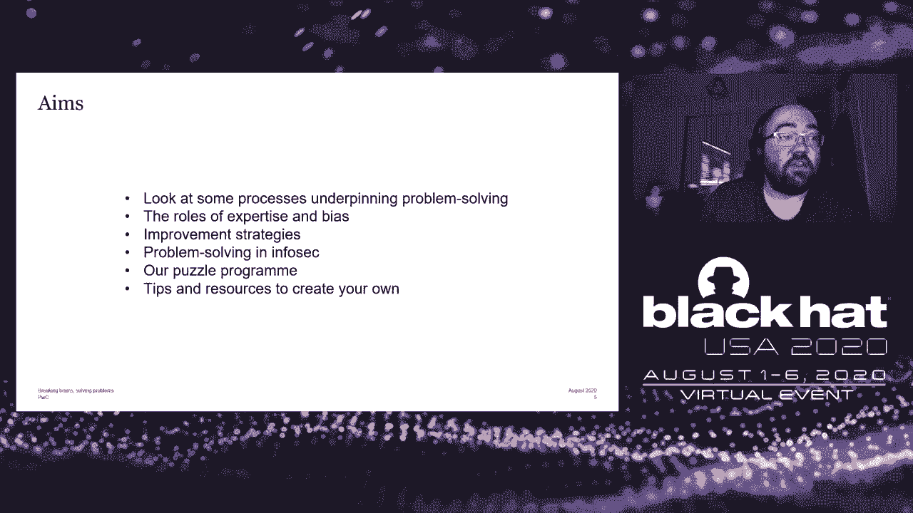
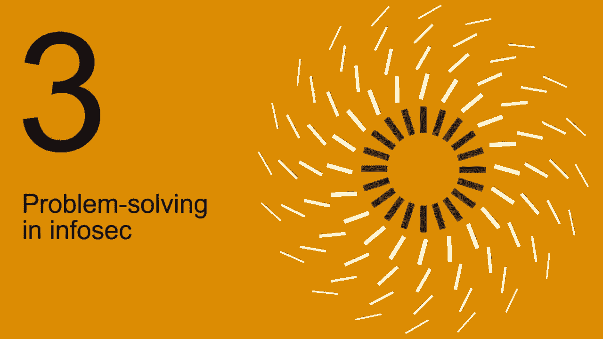
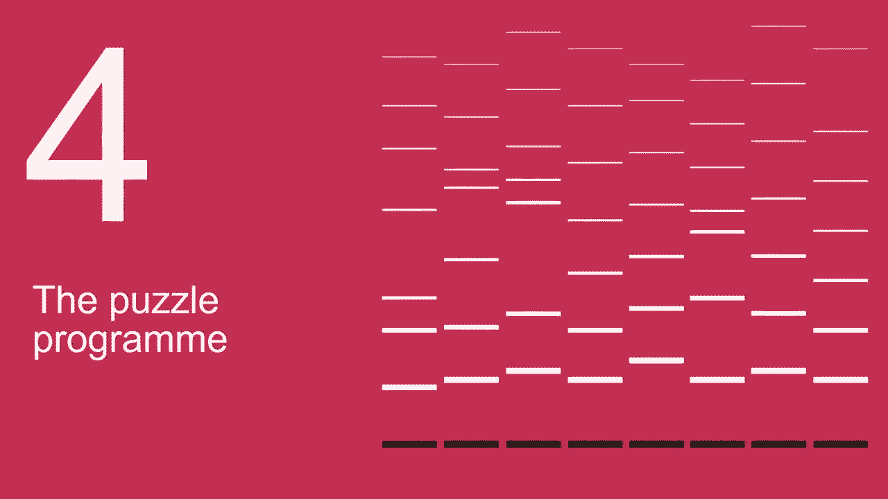
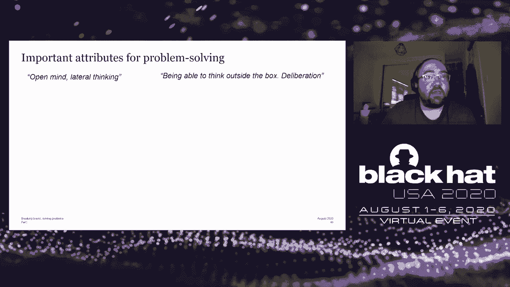

# 【转载】Black Hat USA 2020 会议视频 - P47：48 - Breaking Brains, Solving Problems - Lessons Learned from 2 Years of Setting - 坤坤武特 - BV1g5411K7fe

 [Music]。

 Okay， hi everyone and welcome to Breaking Brain's Solving Problems。

 Lessons learned from two years of setting puzzles and videos for， infaset professions。

 So to introduce myself my name is Matt Wixi， I lead。

 cybersecurity research for PwCUK's Cybersecurity Practice。 I also am a part-time。

 PhD student at University College London。 Prior to joining PwC I worked in law。

 enforcement in the UK doing cyber R&D and I am a puzzle addict which is what I'm。

 going to talk to you about today。 Before we get started if you go to the darkartlab。com/crossword20。

 you'll find a security themed cryptid crossword and whoever sends me the most。

 correct answers for that crossword by the 13th of August at 1300 hours will， win a prize。

 It's not going to be a big prize， I'll tell you in advance but you will get。

 a prize and some kudos as well。 Do feel free to make a start during the talk if。

 you find your mind wandering a little bit as we'll see that can be a good。

 approach to problem solving。 So in this talk we're going to look at some processes underpinning problem。

 solving the roles of expertise and bias in those processes and in problem， solving generally。

 Some strategies for improvement， problem solving as applied， to InfoSec specifically。

 The puzzle program that I run at PwC and then some。

 tips and resources for creating your own puzzle program in your organisation as， well。

 So how problem solving works？ Really all higher level cognition is。

 problem solving to some extent。 You have some desired end state that you want to。

 get to and in order to get to that end state you have to solve problems。 They。

 may be fairly simple but they may be very complex。 And really problem solving is。

 any activation of concepts in the brain to access further concepts。 In terms of。

 the brain itself there are a number of regions associated with problem。

 solving mostly the prefrontal cortex but other areas as well。 And there are。

 specific regions of the brain which activate when problem solving is complete。

 that kind of a hard moment when you get the solution。 And we know that when people。

 try to solve problems there is some form of abstract representation。 There's the。

 creation of mental structures in the mind but the exact mechanisms behind that， are not clear。

 It's a bit of a mystery。 When it comes to problem solving。

 particularly with what are called non-iduline problems which is where you。

 don't need information outside of the puzzle， pretext of puzzle stimulus itself。

 There are two steps understanding and searching。 Understanding involves。

 assimilating the stimulus of a puzzle。 So understanding what it is you're being。

 asked to do and how that's presented and then forming mental structures to， represent that problem。

 And that can involve a variety of perceptual， processes depending on the media in which the puzzle is presented。

 And then the searching。 So searching is actually finding or calculating。

 a solution following that understanding phase and。

 the process of problem solving is usually a blend of those two things。

 and it may be a kind of circular process so it's not necessarily linear。

 It may go back and forth between those two phases。

 So when solving a problem there is first a definition of a problem space。

 and that's the diagram you see here on the top right。 An initial problem state is， defined。

 You have various operators which can change， the state and they may be explicitly given or there may be things that you。

 have to deduce or induce and then you test if the new state once you've applied。

 those operators resembles or is the desired solution， the desired end state。

 And there are various strategies you can use when， problem solving。

 I've put some of them here there are others， but these tend to be the most common or the most well known。

 Proceed strategies which is simply a linear process。 Choose an operator， testing if。

 it affects a state and whether that's a solution and then repeating。

 Backward chaining where you start at the solution if it's known。

 and try and work out how to get to that end state。

 Sub-golding this is where you choose an operator you try and make it fit。

 If it doesn't fit you try and make it fit so that becomes a sub goal。

 to the end goal of getting to that end state。 So an example of that applied to。

 security would be if you're a pen tester testing a web app。

 you might want to try SQL queries or cross-site scripting。

 and there might be a web application firewall that prevents you from。

 running those types of queries so your sub-gold would be to try and bypass。

 the WAF in order to get your queries to the web app and then further exploit it。

 Means and analysis is simply working out what the difference is currently。

 between your present state and the end goal and then trying to reduce that， difference。

 And then finally and probably most， interesting that I think is insight。

 And insight results in a change in the， problem space itself。

 So to give you an example from the world， of riddles and puzzles you're probably familiar with the the riddle of。

 the boat and the river so you have a number of items a bag of cool and a。

 chicken and a fox and you have to get them over to the other side of a。

 river in a boat but you can only take one item across at a time。

 and if you leave the corner with the chicken the chicken is the corn if you。

 leave the chicken with the fox the fox eats the chicken。

 So insight with that particular riddle is the realization that as well as taking。

 things from riverbank A to riverbank B you can also take them back in the。

 opposite direction and that's what opens up a solution in that case。

 In terms of testing and measuring problem solving ability so problem。

 solving ability is often it's considered an innate skill。

 It's something which you either have or you don't you can't teach it。

 and the research suggests that actually that isn't true that everyone can get。

 better at problem solving everyone has the ability to。

 problem solve and to improve and there are various ways you can measure。

 someone's problem solving ability you can measure it by the time it takes them to。

 solve certain problems。 Probably most compellingly their approach。

 to problem solving but also their comfort level with。

 ambiguity with uncertain situations with unpredictability and that sort of thing。

 And there are various specific tests that researchers have come up with。

 for perhaps testing out how good someone is of， problem solving a survey of statements testing people's tolerance for ambiguity。

 and embedded figures tests which may give you an indication of someone's ability。

 to deal with unstructured tasks。 The role of expertise in problem solving is an interesting one especially。

 in security。 So experts tend to know a larger variety of what are called， problem schemas。

 A schema is a categorization of a problem。 It's saying oh this is one of those types of problems。

 Any evidence suggests that particularly with experts the triggering。

 process for those schemas happens earlier than it does， for non-experts。 That can lead to problems。

 It can lead， people to make assumptions and with some problems。

 those assumptions can be quite dangerous and particularly again in the world of。

 puzzles and riddles authors of puzzles will often play on those assumptions in。

 order to try and trick you。 So if you take， the Knights and Laves type puzzle for example you may have come across this。

 before this is where Knights always tell the truth names always lie。

 and you have to try and work out information by asking， one of them or both of them the question。

 And typically those sorts of problems， there are lots of problems within that kind of。

 that category but those sorts of problems tend to have。

 one approach and if you kind of read the setup to a puzzle and you assume。

 oh it's going to be one of those types of puzzles。

 that can lead you down a path of assumptions which may make it much harder。

 to actually solve the puzzle。 Some evidence suggests that expertise might。

 not play a huge role in some problems or some areas of。

 problem solving so there was a study some time ago。

 where undergraduates and mathematicians were given algebra problems。

 and you would expect that the experts the mathematicians。

 would look at a problem and say oh it's one of these types of problems and then。

 solve it but actually that didn't happen。 What happened was。

 that the the experts took about as much time to solve the problems as the。

 novices as the undergraduates but they made fewer mistakes。

 that was kind of the key differential there。 Some other things that experts tend。

 to do as opposed to novices they tend to solve problems into categories。

 based on solutions whereas novices tend to sort them based on the problem， itself。

 Experts as I mentioned may perform faster， it may be something to do with what's called memory chunking。

 which is essentially kind of being able to make certain deductive leaps。

 based on putting kind of chunks of memory and chunks of experience together。

 but as I said experts often don't perform faster， the key difference might be that they just made fewer mistakes。

 Experts also tend， to be better at self-monitoring so working out where they're going wrong。

 and also estimating the difficulty at the start of the process which is。

 obviously very important particularly as you can imagine in security as well。

 Now there are a number of biases which are， particularly applicable to problem solving。

 I've put six here but there， there are likely many more so experienced bias is something you see。

 quite a lot with decision makers with management， and it's relying on past experience to make decisions。

 again similar to that kind of triggering process of schemas to say oh。

 we've had a similar situation before that's how we doubled it then。

 this is how we're going to do with it now and whilst that can be useful。

 it can also lead to assumptions it can lead to， making the wrong decision and not recognizing that the current situation。

 is different from previous situations。 Self-serving bias is almost a kind of。

 eager-related one so this is the belief that we're making logical and rational。

 decisions even if we're not necessarily。 Hindsight bias is putting higher。

 probabilities on known outcomes anchoring is a particularly important one so。

 anchoring is the process of avoiding what's called cognitive dissonance。

 and cognitive dissonance there's been a lot of research written about it。

 it's essentially the kind of gap between reality and our beliefs。

 and understanding that that gap exists and we kind of as a species we'll go a。

 long way to to avoid cognitive dissonance and that's， particularly the case with problem solving。

 Confirmation bias I'm sure many， people have heard of that's kind of prioritizing evidence that reinforces。

 our beliefs and not prioritizing or placing， lesser importance while evidence that challenges our beliefs。

 and then finally the sunk cost fallacy so this isn't so much a bias but it is a。

 kind of logical fallacy it's an interesting example。

 and you may kind of have come across examples of this， in your professional experience。

 The sunk cost fallacy an example that's， commonly given is if you work for a company that's building。

 a new type of plane and this plane is it's doing something that's never been。

 done before whatever that is it's some sort of， innovation and you've spent 90% of your budget。

 you're about two weeks away from launching this plane。

 not literally but you're about two weeks away from actually putting it on the。

 market and selling it to someone and then you hear that your competitor。

 has used exactly the same innovation but in a much more efficient way。

 they're going to sell their plane for cheaper it works better it's safer it's。

 more reliable and they're going to release it in a week's time。

 so the sunk cost fallacy is kind of saying oh well we've come this far we're。

 going to spend the remaining 10% of our budget and we're going to work the next。

 two weeks to launch our plane anyway even though we know。

 that there's a you know a far better product that's going to be on the。

 market before that and it's about kind of weighing up。

 in the long run what is actually going to cost you more。

 So improvement strategies generally for problem solving the first is just to do。

 more so like any cognitive skill or really any motor skill。

 the more you do the better you get at it and the more you do you'll find that。

 some of these strategies will kind of come into place almost automatically。

 so compounding for example this is putting one or more operators together。

 enabling you to make deductive leaps that's not something you think about。

 consciously or something that just happened。 Some things you do need to think about consciously are testing assumptions。

 and changing your beliefs recognizing that you have a particular perspective on。

 the world and that perspective may inhibit solutions， rather than yield them。

 Top-down refinement is another habit of experts in。

 problem solving it's about looking at the bigger picture。

 There are also specific strategies you can undertake to help conceptualize。

 problems in order to solve them。 So again from the world puzzles and riddles。

 the Monty Hall problem I'll let you look up in your own time I'll go into it here。

 but it's a problem that asks you to start quite small。

 and actually the answer is an obvious unless you come at it big。

 so as opposed to three things which is in the original Monty Hall problem。

 if you expand that to a hundred things it becomes a lot easier to understand。

 the blue eyes riddle which I'll come on to a little bit later。

 is a logic puzzle which starts with which starts big with a hundred。

 things and that could be kind of quite difficult to conceptualize but if you。

 look at it from the perspective of starting small and start with。

 one thing then it becomes a lot easier to conceptualize and you can kind of。

 gradually build up two things three things and so on。

 Avoiding rabbit holes is an important one so you know rabbit holes particularly。

 in security we end up down a lot of them particularly for those in。

 technical roles rabbit holes can be good they're not necessarily。

 bad they can lead you to the acquisition of， very niche and important and otherwise obscure learning。

 it can be very good。 The issue is when it distracts you from the end goal and when。

 you end up down a rabbit hole and can't remember how you got there。

 or how to get out so that's just a conscious thing you have to be kind of。

 you have to be conscious of it when you end up down a rabbit hole。

 you have to remember why you went down there in the first place and how to get， back out。

 Self-explanation or rubber ducky debugging， so anyone in development will perhaps be familiar with the concept of rubber。

 ducky debugging you you know when you're having a shower or having a。

 bath you explain the problem to an inanimate object like a rubber。

 duck and that helps you to hopefully make some breakthroughs in。

 the problem-solving process by explaining the problem to yourself as if。

 you're explaining it to someone else。 Spontaneous thought I mentioned a little。

 bit earlier this is about letting the problem sort of wash over you。

 and not thinking about it consciously although the evidence suggests that。

 your brain will at least part of your brain will continue working on that。

 problem unconsciously and then finally awareness of the。

 various biases so including the ones the six ones that I。

 went through earlier but also just recognizing in general。

 that we see the world or tend to see the world through dominant constructs。

 this means that we have a particular worldview which we prefer。

 and dominant constructs tend to inhibit solutions。

 whereas alternate constructs are recognizing that there are other。

 worldviews or other ways to see the world can actually， lead to solutions and to problem-solving。

 Okay so I'm just going to cover problem-solving in Infosec now so。

 Infosec problem-solving problems in security tend to be what are called。

 knowledge-rich problems that is that they require。

 knowledge outside of the problem itself whether that's technical knowledge， policy knowledge。

 experience in a particular thing whatever it happens to。

 be and they can also be quite ill-defined so they may not have。

 concrete boundaries there may not be a sort of concrete limit on the problem。

 area or the problem space。 A variety of people undertake。

 problems in security coming from a variety of backgrounds and levels of。

 experience from experts through to pre-nervices so people。

 are completely near to the field and there are many schemas depending on。

 which particular part of security you're working。 I'm sure you could think of hundreds of examples of problems in。

 Infosec both technical and non-technical。 I just wanted to talk about one。

 very briefly which I think illustrates the process pretty well so it's a。

 talk from DEFCON 16 by Mattie Aharamini of the， Offensive Security Team and he's talking about a particular exploit that was。

 developed for a particular vulnerability and whilst developing that exploit。

 they experienced multiple obstacles multiple setbacks which required。

 lateral thinking and innovation and awareness of biases and that sort of。

 thing so really good examples on YouTube。 And generally speaking the same strategies apply for。

 improvement when it comes to problem solving for， problem solving in security as they do for problem solving generally。

 A couple of other things that might assist with problem solving in security。

 the first is problem itemals so this is essentially a problem。

 which or two problems which have the same underlying。

 requirements and the same underlying demands but may have a slightly different。

 cover story so the actual problem space remains the same。

 On that note incomplete knowledge transfer may be useful so。

 knowledge transfer is the use of experience and awareness and， knowledge from one domain to another。

 It very rarely happens completely， if at all but certainly it can it happens incompletely all the time。

 which is why it's important I think to have a diversity in background and。

 expertise in security for people to come from multi-disciplinary。

 backgrounds because many people will be able to apply that。

 knowledge transfer and come up with a solution。 And that can be useful for applying puzzles and riddles and learning from。

 those two real world situations。 And then there's problem solving by analogy so。

 if you particularly if you work in a technical role you'll be familiar with。

 analogies and using them to explain various technical concepts。

 to less technical audiences but it can also help with problem solving as well。

 The research does suggest that people need to be explicitly told of what that。

 told what that analogy is in order to try and make it relate to the problem。

 but certainly with things like CTFs there is an element of problem solving， by analogy there。

 So I mentioned CTFs I'm now going to talk about our。

 puzzle program which I think is kind of an alternative way， to address problem solving in security。

 So at PWC we have about 300 staff comprising people from the technical。

 disciplines like pen testing into response through to architecture specialists， cool consultants。

 sector specific consultants and people in support policy， and leadership roles as well。

 So really varied mix of backgrounds and， technical knowledge and just looking at this graphic here this。

 represents people's undergraduate degrees in our practice。

 so you can see obviously computer science comes out on top as you'd expect。

 but a whole host of qualifications in other sciences in arts and humanities。

 in language and other subjects as well。 So the first puzzle began in early 2018 with me trolling a colleague with a puzzle。

 you can find a version of it at that link and it's supposed to be one of the。

 hardest logic puzzles ever。 Since then there have been about。

 40 puzzles most of them are designed for the scratch although some of them have。

 been adapted from existing puzzles and they tend to cover these four categories。

 wordplay or cryptic puzzles logic puzzles， math and probability and technical。

 challenges so similar to CTFs or CTFs。 Some of them are themed， some of them are， abstract。

 some of them are independent， some of them are multi-stage so you need。

 the answers from a previous stage to get to the next stage。

 and the majority of them are designed to be solved within two or three days。

 although some take a little bit longer。 And the perfect puzzle ideally has some。

 sort of interesting story or premise behind it something that draws people， in。

 Ideally it has very little exposition you don't really want。

 paragraphs of explanation of the background of the puzzle。

 You may have a hidden trapdoor function this is optional but。

 an alternative way to get to the solution which might rely on a particular。

 particular lateral piece of thinking or a particular piece of knowledge。

 You can have red hearings and Easter eggs really depends on your preference I， like putting them in。

 I have a colleague who designs escape rooms who， detests red hearings but it really depends on your preference。

 Some of the most interesting puzzles actually are something completely。

 unconnected to the premise of the puzzle itself。 They can be really fascinating ones but ideally a puzzle always has its own。

 internal logic the answer should be obtainable from the question itself。

 and ideally other than maybe the use of a search engine for a quick query。

 you shouldn't need any specialist knowledge beyond the premise itself either。

 So a very quick example of a puzzle that we've run I won't read this whole。

 thing out but essentially you're trying to find someone's birthday from， various clues。

 The crucial clue here is square eight to get the month and。

 the day add another square to that and it's obvious。

 and what you're being asked is what is the date of birth what's the birthday。

 and where does my friend live and the location of where my friend lives。

 is an example of something seemingly unconnected， to the premise of the puzzle。

 So on reading that puzzle I'm playing on various assumptions I'm giving various。

 clues so an assumption is that the date of birth is going to be a normal date， i。e。

 it's going to have a maxima 31 for the day， a maxima 12 for the month。

 I've mentioned that it's an old school， friend of mine obviously I am over 18 so the person is going to be over 18 and。

 having a beer at bar so at least in the UK you would be kind of over 18 for that。 Um。

 squaring eight to get the month and day that's 64 so。

 probably talking about either the sixth or April or the fourth of June。

 and then the puzzle says add another square and it should be obvious。

 and this is where the kind of lateral thinking comes in and challenging。

 assumptions because the square in this case is not a mathematical term。

 The answer to the puzzle is the 35th of May 1989， which in itself isn't a valid date but in china it's used to refer to the fourth。

 of June 1989 which was the date of the Tiananmen square protests。

 and that date the 35th of May fulfills all of the conditions around the。

 prime factors that the day minus the month equals the。

 age of next birthday or at least it did in 2019。 Adding a square in this case means a square as in a location so if you google。

 June 4th square you will get stuff about the fourth of June 1989。

 Another example this is one of my favorite ones so this was a three-pot puzzle。

 to give the location of a team event date which was being held off site。 So there were three parts。

 Parts one and two were released at the same time and。

 then part three afterwards and you could use the answers from part one and two。

 together with the author from part three to get the location。

 of this site but you could also just use part three。

 So part one was a way you file of the song never going to give you up。

 so a lot of people were looking into Rick Astley's biography。

 trying to get clues as to the location from that， but actually if you looked at the way you file in a spectrogram。

 and analyzed that you came up with this written riddle。

 and the answer to that riddle is the letter U。 So a U bow a U bend。

 a U is a horseshoe shape a U is not the first person it's second person。

 and sounds like a tree a U tree。 Part two was an image which contained。

 least significant bits their geography if you analyze that to retrieve。

 the hidden message you got this crew here the use of a search engine。

 together with reverse image searching of that image would give you the answer so。

 it's 54 46 the crew says to add one so it's 55， 46 and then part three was a short video of the。

 chess scene in 2001 a space odyssey where one of the astronauts I can't。

 remember which one is playing chess with how， an alphanumeric string appeared at the end of that video。

 and there was obvious Morse code beeps over the scene itself。

 now if you decode those Morse beeps you get the message。

 not going to be that easy but again if you look at it in a spectrogram。

 there's ultrasonic Morse code which spells out lychessaliceus。org。

 the video brightness also flashed in Morse code to give pretty much the same。

 clue and the kind of setup message where I kind of announced the puzzle。

 If you look at the periods and hyphens within that message they also spell out Morsko for that。

 So lightchester。org is a chess website you can load up chess games。

 If you went to lightchester or plus the alpha numeric string shown on the video。

 you were taken to this chess game。 That's a form of chess their videography。

 If you decode that you get this message which is another alpha numeric string。

 And then read the slack message again carefully。 If you again went back to the announcement of the puzzle the first letter of each sentence。

 spells out "Pace bin"。 If you do "Pace bin" plus the string you get this real here。

 And in particular "Paintanger" to the last line with "hex" as key。 So that's a pun on ASCII。

 If you convert everything to that's already ASCII to "hex" and everything that is "hex" to "asky"。

 you end up with zero times 7。5 uf or a UK postcode "0x7。5 uf" which was the postcode of the way day。

 There was a way to solve it just through that riddle itself with that written riddle。

 So if you solved each line of that you would be able to get some search terms which you could put into a search engine。

 and that would also give you the location as well。

 So I've got some stats on the kind of puzzles that we run and how many we run。

 So the overwhelming majority of puzzles to date have been logic puzzles but also quite a few work playing tech puzzles。

 and then maths are kind of in fourth place there。 The most successful category has been "Bath's puzzles"。

 Then "tech"， then "work play" and then "logic"。 The graph from the left illustrates answers over time so the dark red line is correct answers over time。

 and the pale red line is incorrect answers。 So， probably not quite enough data to make inferences there properly but you can see kind of what the correct answers have gone up over time。

 the incorrect answers have gone down certainly kind of in the last year or so。

 The graph on the right shows puzzle engagement over time so that has gone up over time。

 They've been peaks and troughs as people are busy or all kind of more or less interested in puzzles。

 or depending on what kind of organizational activity the puzzles are tied to。

 But overall the engagement has gone up over time。 Tech puzzles have had the most engagement as you might expect that being a cybersecurity BU。

 but then "work play" has the second most so the second most kind of popular。

 Time to solve is a little bit more difficult just because that tends to be a function of the puzzle's difficulty。

 which fluctuates from puzzle to puzzle depending on what type it is and who's doing it。 So。

 it's not really a reliable indicator but it's interesting the record we have for the quickest puzzle ever solved。

 was something like four minutes and the one that's taken the longest is just under two days。 So。

 I just wanted to show you some unexpected or amusing kind of answers we've had。

 This was in relation to the birthday puzzle I took you through earlier。

 This was someone who went to extreme lengths with the Morse code video to try and find the differences。

 in the frame brightness and other clues like that。

 A very common response specifically with the kind of lateral thinking logical puzzles。

 People kind of working together and supporting each other and keeping each other going throughout solving these。

 And then my favourite one this is from one of the partners of our business unit who I think。

 kind of pretty much summed up his frustration with me with some of these puzzles。

 And then there are also people of course when you're looking at problem solving who just。

 go straight ahead and cut the gaudier knot into two rather than trying to untie it。

 And there's one particular person in our business unit who does that I just wanted to highlight。

 some of his replies so the fact that he kind of crashes and bulldozer right through my puzzles。

 This was for the away day one so people weren't told the location of the away day until the。

 puzzle had been solved。 He decided it would be easier to just wait。

 This was a logic puzzle around getting the colours of hats。

 This was a knight and they've puzzled around which door to go through so one door leads， to freedom。

 The other leads to a room full of hungry tigers and are particularly liked that second。

 sentence of that response。 So I did a quick stroll poll of people who've participated in puzzles over the last two。

 years。 Pretty small sample。 Just to get an idea of how they feel about them in terms of difficulty and the benefits。

 So you can see most people estimate that the difficulties are hard to fairly hard。

 Most people love them or really enjoy them and there's also quite a lot of collaboration。

 So only a small percentage of people from this example actually never collaborate at all。

 on puzzles。 Most people do it at least occasionally and some people do it frequently as well。

 People on the whole agree that the puzzles are contributed to culture and to collaboration。

 and cooperation。 They've helped to develop problem solving skills。

 Most people would like to do more puzzles in the future and most people agree that problem。

 solving is especially important in self security。 Again most people are agreeing that it is important to try to strengthen problem solving。

 abilities。 More of a mixed opinion for whether it's a good idea to try to measure problem solving。

 difficulty。 You could say it's a tie there between people who are nutrient about it and people who either。

 agree or strongly agree but certainly some people disagree with that。

 The puzzles should be job specific， EGCTFs。 Again a mixed opinion on that some people are agreeing。

 Some strongly disagreeing some disagreeing。 And finally doing puzzles increases my problem solving capability and all changes my perspective。

 and thinking。 So some people are making neutral on that but the majority of people agree with it。

 And I also just wanted to highlight some individual feedback， some of the benefits of this people's。

 day-to-day role。 So people saying it's a good illustration of the greater than the sum of parts concept。

 helps them to look at the larger picture when it's on problems used in my day-to-day role。

 The correlation between puzzle solving at work and in life， keeping problem solving。

 skills sharp and being helpful for a range of situations， reading between the lines。

 thinking beyond the obvious and showing the application of a cyber concept in practice。

 I also ask people what they thought were important attributes for problem solving。

 Open mind lateral thinking， thinking outside the box， deliberation is an important one。

 thinking holistically about a problem and crucially I think this one really struck。

 home with me as being able to let go of a chain of thinking。

 If it's not working or if you realise that it's biased or ineffective。 Assimilating new information。

 structuring your thoughts on prioritising issues against， seeing a bigger picture。

 curiosities stubbornness， I think many people in security can relate， to those two attributes。

 Dividing and conquering the problem to come up with accurate sub-problems。

 So a good illustration there of sub-calling of breaking the problem down into achievable， parts。

 So I wanted to cover a quick case study of where myself and a colleague used this on a。

 piece of research。 So a couple of years ago， myself and someone else were working on a project called Sand Grox。

 which was coming up with various ways for our red teaming malware to detect and evade。

 sandboxes on targeted hosts。 And to do this we had to do a number of the things I've talked about in this presentation。

 We had to think naturally， think of novel forms of detection。

 So going beyond CPU red pills and things like that to think about environmental factors。

 what programs were installed， how many recent documents are there， that sort of thing。

 Challenging our own assumptions about what a sandbox can and can't detect。 Sub-goaling。

 so testing if something is technically feasible before actually testing if it actually。

 contributes to the end state。 Avoiding rabbit holes was a key one。

 We ended up down a few rabbit holes but crucially we were able to find a way back out of them。

 It's ontaneous thought， paid quite a big part in this project。

 They had a problem kind of washed over us for a few days and then coming back to it。 Avoiding bias。

 particularly in this case self-serving bias， so thinking we were making， logical rational decisions。

 but it's sometimes we won't。 And then finally， problem isomorphs。

 So there are a lot of related problems in security which helped us with this project。

 Human computer interaction， bot detection， antivirus evasion specifically， but also some。

 other areas as well。 So if you want to start your own puzzle program。

 I would highly recommend you do it。 You could do a pilot to start with just to see how it goes。

 If you want to do that， I would strongly recommend starting off with pre-existing puzzles that。

 you can find on these resources here just because creating puzzles from scratch。

 Once you're starting off， it's very time consuming。 So the awayday puzzle that I mentioned。

 the three-parter， that took something like 14 hours， to come up with and to actually implement。

 Some good resources for finding puzzles or good things tips on puzzle creation is puzzling。

 stack exchange。 The TED-ed YouTube channel has a number of riddles and puzzles on it。

 You can always find good cryptic crosswords in newspapers。

 And then of course in security there are CTFs， there's DEF CON challenges， badge challenges。

 and things like that。 Lessons that I've learned from doing this for two years。

 it's really important to mix， up the formats and the genres to broaden appeal and keep people interested。

 Really important to measure engagement and statistics as you go。

 It can be quite difficult to try and do that retrospectively。

 So ideally you release the puzzles on riddles on some sort of platform where you can at。

 least approximate engagement， measures of engagement。

 Linking to other organization activity really helps。 So if you have team events， that sort of thing。

 linking a puzzle with those can help， with engagement， encouraging collaboration。

 whether that's mandating the people have to， do them in teams or encouraging teamwork or designing the puzzles specifically so that。

 maybe some of it can be solved by pen tester。 But actually to solve the next bit they're going to have to go and speak to someone in。

 threat intelligence or incident response or someone on an architecture team or something， like that。

 Incentive surprises obviously can help and crucially I think encouraging inclusivity。

 So not alienating would be participants by making it all technical or making it all about。

 strategy for example。 Okay， so just to sum up， problem solving is a skill and like any skill it can be strengthened。

 and there are specific processes which underpin it。

 There are also specific strategies for improving it。

 It's not just a case of do it more often although that does help but there are specific things。

 you can do to strengthen problem solving ability。 Also worth noting that there are specific risks and biases associated with problem solving。

 and that really they need to be recognised before you can improve。

 Puzzles and riddles are a great way to develop problem solving skills。

 It's not necessarily an isolated case of it just makes you better at puzzles or riddles。

 It gives you skills and abilities which you can then apply to larger problems and day-to-day。

 problems as well as contributing to culture and engagement。

 The design and type of puzzle is really important and it does need some thought before you go。

 ahead and release it。

 So hopefully I'm going to create at some point a repository of some of the puzzles I've done。

 At my workplace I would love it if people would have theirs once that's up and running plus。

 statistics around engagement would be really helpful critiques， analyses that kind of thing。

 There is certainly a gap in the research on the psychology of security related problem， solving。

 There has been research previously on problem solving in the context of software development。

 and programming but not much on security related problem solving so that I think would be a。

 really interesting topic。 I'm hoping to do some more work on that and I hope other people do as well。

 And also don't forget to have a crack at the crossword if you haven't started yet so the。

 link is the darkartlab。com/crossword20。 And then either email me your answers by the 13th of August at 1pm Pacific time or DM the。

 one Twitter or however you want to get them to。 So lots of references here if you want to have a look at these over the summer for some。

 reading so quite a few references there and finding my contact details you can get me。

 on Twitter at darkartlab where you can email me madawigs@pwc。com。 So that's it from me。

 Thank you so much for attending I really hope it's been useful and interesting and future。

 me is now going to take some questions。 Thank you。

 Hi everyone thanks so much for attending the talk and I hope you found it interesting。

 I'm pretty sure of time so rather than taking a questions live I'll answer any of them。

 come up on the chat in the next few minutes or if you want to get in touch at any time。

 to discuss the talk my email address is madawigsc@pwc。com and my Twitter account is @darkartlab。

 I'll be looking to set up that puzzle repository I mentioned in the next few weeks and I'll。

 announce it on Twitter so keep an eye out for that if you're interested。

 I'll also announce the crossword winner Ben next week as well。

 Thanks again and I hope you all have a great conference。 Bye。 Bye。

