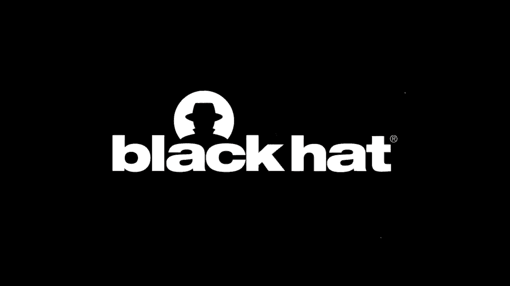
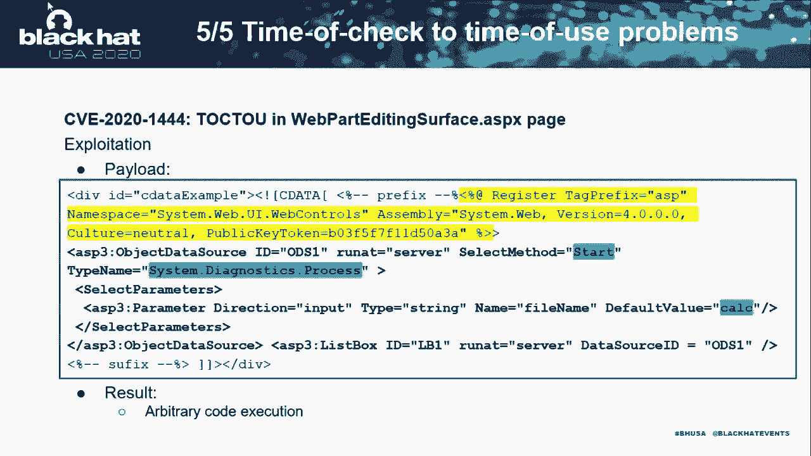
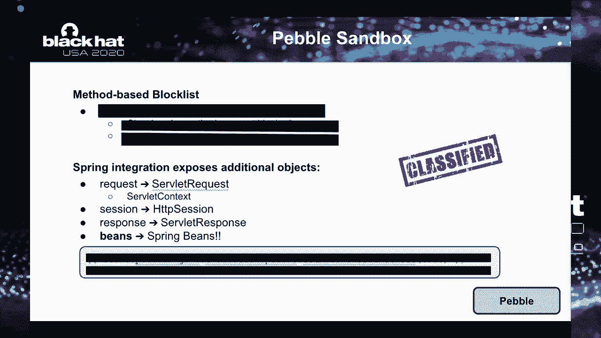

# 【转载】Black Hat USA 2020 会议视频 - P48：49 - Room for Escape - Scribbling Outside the Lines of Template Security - 坤坤武特 - BV1g5411K7fe

 [MUSIC]。

 >> Hi， thank you for attending our talk。 This is Room for Escape。

 it's clearly outside the lines of template security。 My name is Alvaro Munoz。

 also known as Pontester in the social media。 I'm a staff security researcher with。

 the GitHub Security Lab team。 I'm my colleague， Olek Sander-Miroz， or Olek Miroz in Twitter and。

 social media which is a security researcher， with the micro focus of 45 team。

 So today we will be talking about， content management systems or CMSs， and in particular。

 they template systems that they use to render dynamic content。

 So a CMS is an application that is used to， manage different web content and it basically allows。

 multiple users and contributors to， create edit and pull this content on these systems。

 So what is important to us is that， this content is normally rendered based on。

 a system of some documents called templates， and these templates are normally mixing。

 both static and dynamic content。 So for the evaluation of those dynamic parts in the templates。

 these systems are normally using， some subset of some programming language capabilities。

 which are powerful and normally are able to get a remote execution。

 So these systems are normally sandbox in order to prevent that。

 So our research will focus basically on 。NET and， Java based content management systems。

 because those are normally the languages that are more， used by enterprises。

 And our assumption is that the attacker can control， the contents of a template。

 So it doesn't matter if it gets control of， those templates through a server-side template injection。

 or maybe they can control it because they， have permission to do that because they are。

 out of some different systems or they have， for example。

 a user in a SharePoint or something like that。 So our goal here is to basically be able to escape。

 those sandboxes and run arbitrary system commands， on the underlying servers。

 So we will divide our talk into two different big blocks。 The first one will be around 。NET。

 although we will basically focus on SharePoint。 And we will show five different ways we were able to。

 break the SharePoint sandbox。 And then we will move into the Java part where we will be。

 reviewing 10 different content management systems and up to， four different template engines。

 including the most popular ones， free market and velocity。 So with that。

 we will wrap up with some takeaways and then we， will open the floor for some Q&A。 Thank you。

 Arguara。 In this part of our presentation， we will see examples of different types of security problems。

 in SharePoint server。 But before that， we need to explain some basics of， SharePoint security。

 SharePoint has two types of ASPx pages。 The first type is application page。 Actually。

 each of these pages is part of SharePoint server， and implements some application logic。

 They are stored in specific folders in the file system。 And of course。

 users are not able to change them。 They're regular ASPx pages and are processed by the server。

 without any restrictions。 In opposite to them， they're site pages。

 They are stored in databases and they can be customized， even by users。

 SharePoint parts of them in special mode， also known as safe mode。 Actually。

 they are more like some sort of templates， for dynamic content。 On this slide。

 we can see a diagram how server works， with this page。

 Virtual provider can fetch content from file system， or database。

 Based on the virtual path of the current page， ASP page parser filter will decide either。

 It is site page and safe mode should be applied， or it is application page and it will be processed。

 without any restriction。 So page filter is critical element。

 from security point of view in SharePoint。 Let's have a look at sample ASPx page。 For our talk。

 we are interesting only in server site， components like directives。

 There are special instructions on how server， should process this page。

 Often they have some numbers of tributes with values。 We can include server site code。

 either in special blocks or as embedded server site code。

 Server site controls should have the runout server attribute。

 Server site comments block will be ignored on the server。 And last element。

 server site include directives。 Allow us to include raw content of arbitrary files。

 Now we can better understand what safe mode means。 Site page will not become filed。

 So we cannot use server site code here。 We are not able to include files from file system。

 We can only use allowed controls。 This list is defined in safe control section， of web config file。

 Page filter also applies allow list for directives， and even for attributes of most of them。

 There are many other restrictions。 For example， event binding is blocked as well。

 This set of restriction looks quite impressive， but let's look possible type of attacks。

 that we can perform。 As we know， safe mode is enforced by page filter。

 So our first question was either any place， where SharePoint does not use it。 And answer yes。

 there are such places。 Page filter will not be applied。

 for the content argument of the parse control method。 If it's called only with one argument。

 or if the second one that actually is named， ignore parse filter is true。 In addition。

 page filter will be used at rendering time， but ignored in design time。

 But even if page filter is not applied， SharePoint uses another way to verify the input。

 It is verified control on safe list method， from editing page parse type。

 That aim to do the same task of the original page filter。 So what we can do？

 Let's imagine for one second， that we are able to bypass either this method， or page filter。

 By the way， each such bypass is separate from ability。 We will present them in a few minutes。

 So how could we get remote code execution， after escaping safe mode？

 Since parse control method never cause compilation， we are not able to use server-side code。

 or perform other attacks that require such compilation。 But if we escape safe mode。

 we can use unsafe controls or directives。 So let's review a few of them。

 One of the most interesting unsafe controls， is object data source。

 It allows us to invoke public methods， from our bad arbitrary public type。

 We can see an example of payload， that uses the start method from process type。

 to pop-up calculator。 So actually it is arbitrary code execution by definition。 Game over。

 But let's review a couple other unsafe controls。 XML data source and XML controls。

 allow us to get the content of arbitrary XML files。 The similar results can be can get。

 by server-side include directives， that return us a content of any text file。

 Let's see on the next slide， how we can escalate from arbitrary file read。

 to arbitrary code execution。 If we can accept the web config file。

 we will be able to get value of validation key， from machine key section。 By the way。

 this value may be present in other places， such as internal SharePoint properties。

 You can find this example in our white paper。 With validation key。

 we can generate a valid use state， that will be executed arbitrary code commands。

 on the target server。 You can use tools such as usos serial。net， to generate this payload。 Now。

 when we know what safe mode is， and how we can compromise SharePoint server， if it's bypassed。

 we can move to our next part。 Here we will present five different types。

 of security problems in content management system。 We will show examples of each type in SharePoint。

 We would like to stress here， that our target is SharePoint server， with default configuration。

 All vulnerability allowed us， to execute arbitrary code on the target。

 All attacks were performed by regular users， and no admin rights were needed。 Let's start。

 The first type of security problems is access， to resource with sensitive information。

 It can be configuration or business information， in various files， logs。

 database or even protest memory。 Of course， a proper sandbox should prevent this problem。

 but it's not always the case。 We already mentioned that page filter block。

 server setting with directives， and verify control on safely this method should do as well。

 And actually it does， but if it's called with false， in block server set includes argument。

 it will not block them。 We found such a huge issue of this method。 It was used for design mode。

 The next building block for our attack， how can we provide our markup to this mode？

 We can send it in the web path XML parameter， of the render web path for edit method。

 of the web path page services。 So we can try to include web config there。

 Here we can see the full payload， that will be sent in mentioned parameter。

 and address of relevant web service。 Server turned let us the entire web config。

 with validation key。 We used it for view state based， the civilization attack which lead us。

 to executing arbitrary OS command on the server。 Time for our next type of security problem。

 Allow dangerous element that can be used for attacks。

 We have found an example in SharePoint safe control list。

 Or should we call it not so safe control list in this case。 It is contact link suggestion。

 micro view control。 We can see snippet with interesting code， from its implementation。

 where request parameter is passed into data set， point read XML method。

 If we can control input for this method， we can get our data deserialized by XML serialized。

 and we able to control a destination type。 We already showed in our one of our previous research。

 that in this case we can get a bit record execution。 Unfortunately。

 this payload is too big for slides， but you can find it in our white paper。

 The last piece of our puzzle is site page， with this dangerous control。 We can see it on our slide。

 For attack， we need to place the payload into text box， and click on the submit button。

 And desired command will be executed on the SharePoint server。 For us。

 the next type of security problems， look quite interesting。

 So we will try to expand it with more details。 Dynamic content usually means。

 that we will have at least read access， to some properties or attributes of some objects。

 For some system like SharePoint， we can even have write access。 Sandbox should filter out。

 the access to dangerous properties or attributes。 Let's review basic types of such filtering。

 The first case is when only one level， of properties or attributes is allowed。

 We can see examples on the slide， name property of user object or selected value from menu。

 We can imagine the object and its property， like branch with only leaves。

 If an allow list is applied， it is relatively easy to review all elements。 And after such review。

 we can make sure that there is no dangerous element。 What if block list is used instead？

 We still need to verify our available objects， and it can be a bit difficult。 So in general。

 we do not consider block list a safe approach， because of potential gaps on them。

 We will see in Java part of our presentation， a couple examples of such by passes。

 The most interesting case for us， is when access to nested property or attributes is allowed。

 For example， request。outuser。name， or menu。selected。item。text。 Because of branch list。

 leaves analogy， many developers may imagine this case， as branch with branches and leaves。

 And they can apply filter only for the first level objects。 But it's not tree， it is network。

 And we may jump from one branch to another， or even to the trunk。 For example， on the slide。

 we can see how to access application instance， from menu control。

 Let's move to our example in SharePoint。 It has weak content web path control。

 It is allowed and will pass our markup， into the parse control method。 Please note。

 it is called this false value， in ignore parse filter argument。 So page filter will not be ignored。

 Therefore， low bank snippet show that in this case， the virtual path will be created。

 from a relative virtual path property。 And if you remember， page filter will apply restriction。

 based on this virtual path。 So if you're able to change it， we can fool the page filter。

 not to apply restriction at all to our markup。 Let's try to craft such payload。 First snippet fails。

 Because when ASPx parsers try to assign a new value， to our app relative virtual path。

 the page property of our control is not defined yet。

 So we need to delay this assignment a little bit。 This can be done using data binding。

 So by time the property is bound， the page property will be already defined。

 Here is our final payload。 We can notice that our new path points to settings page。

 It's application page。 It is assigned to tool T property。

 and later will be transferred to app relative virtual path。

 So the page filter will think that this is system page， and it will allow any unsafe markup。

 For example， we can use our object， object data source control to pop up calculator。

 Let's see how this attack looks on real SharePoint server。 Oh， here is our site page with payload。

 Here is path to the system page。 It will be transferred to a relative virtual path。

 Here is our unsafe markup with object data source。 Start method， process type and calculator。

 file name。 We， let's say it's here。 For our attack， we need to upload this to SharePoint server。

 Our target is SharePoint with default configuration。 In this configuration。

 regular users usually have access， to their own personal site。 So we can use it。 We are attacker。

 it's regular user， no admin rights。 So here is a personal site。 Let's upload our page。

 To trigger our attack， we just need to click on it。 But before that。

 let's pay attention on the other window， on the screen。 It is task manager。

 so we will on the SharePoint。 So we will see if a calculator starts。 Actually， it starts。

 Attack was successful。 (mouse clicking)， By the way， we were able to exploit。

 redoxcessed to nested properties in SharePoint。 But unfortunately， we do not have time。

 to present this vulnerability today。 You can find all details in our white paper。

 Now let's move to the next type of security problems。 It is connected with our previous work。

 on a safe deserialization。 Such kind of problem is relevant to when text。

 or binary data is converted to an object。 And the type or class of this object。

 is under attacker control。 Also， it is not properly limited。 Actually。

 it doesn't really matter what mechanism is used。 Classical deserializer， JSON on a marshaless。

 type converters， or even some custom approaches。 All of them are potentially dangerous。 Also。

 for successful exploitation， attackers may need to find proper gadget， on the target system。

 We have found an example of such problem in SharePoint server， and were able to perform a reboot。

 record execution attack using it。 Microsoft assign a CV number to this vulnerability。

 But because this problem affects a few other products， Microsoft was not able to release fixes。

 for all of them in time。 So we are going to publish all details， of this vulnerability a bit later。

 when all fixes are released。 The last type of security problems in this part。

 is the classical time of check to time of use problems。

 There occur when the server validates some input， but it can be later changed。 Before that。

 the server is used。 We found such problem in web part editing surface page。

 User input is validated by the already known for us， verify control on safely this method。

 But later， the server may modify the input， and remove some substring from it。

 Let's consider the next content。 For verify control on safe list。

 it is just one server-side comment block。 So it will pass validation。

 But SharePoint removes the yellow substring， and parse control will see two comments and some markup。

 Note， parse control has only one argument。 So page filter will be ignored。 Time for our payload。

 We can notice here our unsafe object data source control， and calculator。 Of course。

 in all our examples， we could change this comment to a more interesting one。

 and compromise SharePoint server。 But it would be another story。

 Now let's switch back to our bar， and he will present the Java part of our research。

 - Thank you Alexander。 Now we will be focusing on the Java part。 For that。

 we analyze four different sandbox， Java template engines， including the most popular ones。

 which are free market velocity and also gene Java and pebble。 And in order to test our bypasses。

 we will be testing them on different CMS-like systems， such as live ray， alphresco， confluence。

 or HapSpot just to mention a few。 So a brief introduction into what a content。

 or a template engine is basically。 We have a template which is mixing both static and dynamic content。

 and then the template engine is resolving and expanding， this dynamic content by using some objects。

 that are available in something that is known as the template context。 So in this example， the user。

name expression will be resolved， by accessing the user object and then invoking the getName property。

 the getName getter in this object。 Because this invocation is 10 years and can lead to bypasses。

 of arbitrary code execution， then these template engines。

 are normally sandbox in order to prevent further access of methods。

 through reflection that should not be allowed。 So apart from those objects like user that are directly used。

 in the template， these frameworks and this content management system。

 normally exposed a number of other objects to the template context。

 This is known as the template API and includes things， like the template request and response。

 the template context， just to mention a few。 So the first kind of bypass that we will be using。

 is trying to find objects in this context， which can be used to get remote code execution。

 So these are generic in the sense that no matter if it's， we are using GIN Java or FreeMarker。

 those should be working， regardless of the engine。 So first of all， we need to see and analyze。

 what is in the context。 So for that， if we get access to the Java runtime， we can instrument it。

 or debug it and then dump the context and analyze those objects。 If not。

 we have to read the documentation， maybe brute force。

 or guess some common names like request or rec or response res， for example。

 and then in some cases like FreeMarker， we are able to actually list all the objects in the context。

 through some special variables。 Apart from those objects that are directly exposed。

 we have some indirectly exposed objects。 Like for example， if the request is exposed。

 all of the request attributes are exposed as well。

 So same thing with the session and the selflet context。

 And we will be able to find very interesting objects in this set， of attributes。

 So let's see an example of how many objects we are able to find。

 in a regular content management system， like for example， a life ray。

 That's what we call object dumpster diving and you will see， why in a few minutes。

 So this is the template that we will be using。 First of all。

 we will be listing all the context objects， by using the dot data model variable。

 Then we will be listing all the attributes in the request， then the attributes in the session。

 and then the attributes， in the selflet context。 And because the selflet context give us access to the spring。

 application context， we will also be listing all of the spring， bins that are available to us。

 So if we render these templates， we will see all of the context， objects。

 Those are normally exposed by the framework or CMS and those， are kind of safe sometimes。

 But apart from that， we have access to our bunch of request， attributes。

 a bunch of session attributes， and a bunch of， selflet context attributes。

 including things like these。 Instance manager that we will be using to get remote， classification。

 We also have access to the spring web application context， as we mentioned。

 which will give us access to all of the spring， bins registered in this context。

 which are in the order of， hundreds。 So we get a total of almost 900 objects available to us。

 And those are objects that expose other objects。 So we normally get access to thousands of objects。

 So this is why we call it object dumpster diving， right？

 Because this is how we felt like looking for few interesting。

 objects in hundreds and thousands and thousands of objects that in。

 most cases should not even be exposed to the template in the， first case。

 So we will be reviewing the top three objects that lead to。

 remote classification that we were able to find。 And the number one will be the class loader。

 which was， available in 10 out of the 10 content management systems that， we analyzed。

 This is normally available through the class object。 But since that one is normally blocked。

 you can still get access， to it through either the protection domain or selflet， context。

 which are normally not nonblocked。 Once we get access to a class loader， we can obviously load。

 arbitrary classes or class path resources from that class， loader。

 But we can also read any arbitrary file from the file system by。

 accessing a URL object and then pointing the underlying URL to。

 our arbitrary file and then opening a connection and reading the， bytes from that connection。

 So because these content management systems are normally。

 deployed on top of an application server or selflet， containers。

 then those class loaders that we are going to get。

 access to are normally instances of web application class， loaders。

 which expose a number of features and capabilities on， top of the regular class loader ones。

 So we were able to abuse those additional methods to get。

 remote call execution in nine out of the ten CMS like systems， that we analyzed。

 And we don't have time， unfortunately， to cover them today。

 because they are sometimes complex and we don't have time in， this 40 minutes presentation。

 But they range from being able to upload a web cell to， instance。

 set arbitrary objects to perform J and D。I。 injection attacks or to initialize attacker control classes。

 leading to the execution of the static initializer of that class。

 So the number two object that leads to remote call。

 execution and that we found in nine out of the ten CMS like。

 systems that we analyzed is the instance manager。 So an instance manager is an object that is capable of。

 instantiating arbitrary types。 You normally find it either as part of the selflet context。

 attributes or through one of these web application class loaders， that we mentioned before。

 Once we get access to the instance managers， sometimes also， called object factory。

 you can instantiate arbitrary types。 In this case， we are instantiating the script engine manager。

 in order to evaluate arbitrary JavaScript and Java code。

 But once you can instantiate arbitrary types， you can get。

 a remote call execution through a number of different vectors。

 The number three object that we found in four hours of the ten。

 systems is the spring application context。 So we were able to access the spring application context。

 through the selflet context attributes， but also a spring。

 envycy if it's been used will inject a variable call a spring。

 micro request context into the template context。 And you can use that one to get access to the web application。

 context。 So from there， you can get access to the class。

 You can also use the template context to get access to the， class loader to the environment。

 including things like the， environment variables， but also the spring properties， which will。

 include things like encryption keys and other interesting stuff。

 But probably most interesting is the access to the spring， pins。 As we saw in life ray。

 we get access to hundreds and hundreds of， objects which are normally meant to control the application logic。

 Things like creating new users， deleting users， creating new， transactions and things like that。

 And because these are normally behind the layer of， authorization。

 they will give you access to those operations， without any further authentication or authorization checks。

 You can also do other interesting stuff like disabling the。

 template engine sandbox altogether and also instantiate。

 arbitrary objects through things like JSON and Mars， Alleur and XML， etc。

 So those were like the top three ones。 We found other objects leading to remote classification。

 plenty， of them， but we don't have time to cover them today。 Again。

 these will be explained and covered in the white paper， that we will be releasing。

 So those were generic in the sense that they were dependent on， finding objects in the context。

 no matter if that was the context， of the gene Java engine or the free marker one。

 Now we will be reviewing some of the specific bypasses that we。

 found for these four different template engines。 So we will start with free marker。

 It's probably the most popular one， also the one that got。

 more attention from the security community。 It's started by James Kettle who presented back in 2015。

 this presentation about server site template injection actually。

 introducing the whole category type。 And he found a way of bypassing the sandbox by using an add-on。

 that was part of the default configuration at that time。 So Todenitrolba found a different bypass。

 being able to， instantiate arbitrary objects， but this bypass is not universal。

 in the sense that it depends on one of these add-ons that is not。

 part of the default configuration and also being able to access。

 some special fields and some objects in third party libraries。

 which are not part of the free marker distribution。 Last but not least。

 Ryan Hansen at the same time that we were， performing this research published by PAS that works only in。

 Tunkat and that leads to remote execution by uploading a， website。

 So those were like the ones that we were aware of。

 And then we will be reviewing the sandbox in free marker。

 So this sandbox is based on blocking individual methods。 Like for example。

 the Jabba Land class get class loader method is， blocked。 You cannot invoke it。

 But as we mentioned before， we have different ways of getting， an instance of a class loader。

 like for example， using the， selflet context。 Then all the class loader methods are allowed。

 They are not blocked by this block list。 So if you find an instance of a web application class loader that。

 is already jackpot， you can get remote execution。 Otherwise， you can still get access to， well。

 get remote， execution by accessing public static fields which is also， allowed by the block list。

 So in order to do that， we found interesting public static， fields within the free marker library。

 So we use code quail for that。 If you are not familiar with code quail， it's a language that。

 allows you to query source code as you query a database， for， example， using SQL。

 And we don't have time to explain the query here。 But the idea， what we are asking for is， okay。

 find me all the， public static fields which contain or of a given type， which。

 contains a method that allows me to instantiate arbitrary types。

 So running this query on free marker code， we found four， different results。

 All of them are fields from different interfaces or classes。

 But what they have in common is that all of them extend from， their bins wrapper class。

 And this class contains a new instance method which will allow， us to instantiate arbitrary types。

 So without the universal bypass is basically based on getting an。

 instance of the class loader either through the protection domain。

 or through the self-led context and then loading the object， wrapper interface。 And from there。

 grabbing the default wrapper field。 Because this field contains the new instance method， we can。

 instantiate arbitrary types。 In this case， to keep the bypass self-contained in free marker。

 libraries， we are using the execute class which will allow us to， invoke arbitrary system commands。

 So this was fixed in free marker 230 back in March。

 And it's still vulnerable if the legacy access policy is， configured， but that's not the default。

 So as we mentioned before， if you get access to the spring， pins， you can also disable the sandbox。

 In this case， by accessing the free marker configuration and。

 then getting the default configuration that is non-sandboxed。

 and getting the class resolver from there and setting that。

 class resolver as the class resolver for the current and， sandboxed configuration。

 So effectively disabling the sandbox altogether and re-enabling。

 the old payload by James Kettle from five years ago。 So now switching to velocity。

 Velocity sandbox is also known as secure U。S。 specter and is pretty effective in the way that it's not based on。

 individual methods。 It's blocking whole name spaces and also classes。 So for example。

 the Java line reflect name space is blocked。 So you cannot use Java reflection。 API。

 you cannot use any method on class or on class loader， classes， for example。

 But we found a flow in implementation of these sandbox。

 because when they are checking these block lists， they are not。

 checking the whole hierarchy of the classes for the method being， invoked。 Like for example。

 when we invoke the load class from the class， loader， we are not checking the whole instance。

 the whole hierarchy， of this object。 We are just checking the current type， which in this case。

 because it was deployed on top of TunkApp， it's an instance of， parallel web app class loader。

 But what is important here is it won't be an instance of the， Java line class loader。

 That is the only one that is blocked by the block list。 So with that。

 we are able to basically bypass this limitation， and execute arbitrary methods from class loader and get remote。

 execution。 Now moving to the jinjava sandbox， this is based in a very short。

 method based block list， which is only blocking nine different， methods。

 But it contains a piece of code here at the right which will。

 basically improve the protection by preventing any method from。

 returning an instance of Java line class。 So if we cannot get an instance of Java line class。

 we cannot， instantiate arbitrary types。 That's normally the case。 However， there was a flow again。

 In this case， they are not blocking invocation of methods。

 which return a race of classes or map of classes。 So that was the first part of the bypass。

 The second part is that they are exposing this secret or hidden。

 keyword called interpreter in LITES pitch which will give you。

 access to a bunch of objects including all the objects in the。

 context but also the exposed functions， filters and some other， objects。

 So putting these two parts together， we were able to get the。

 context from the interpreter and then getting all the functions。

 exposed to the context and then getting the underlay in method， for one of these functions。

 And now we are able to get an instance of the Java line， reflect method type。

 From there we can use the get parameter types which will。

 return an array of classes and then access an individual。

 element of this array in order to get finally an instance of a， Java line class。

 From there you can get an instance of the class loader and， launch any class loader based attack。

 So this was fixed in version 254 and that got this CV。 So now we will move to pebble。

 Unfortunately we found a couple of bypasses。 We reported them to the maintainers but they were not。

 fixed on time so we decided not to release the bypasses so far。

 So with that we will switch back to Alexander to wrap up with some， takeaways。 Thank you， Olivero。

 First of all let's summarize our results of this research。

 Thirty new vulnerabilities were found and reported to the， vendors。

 Twenty different products are affected。 You can see their names on this slide。

 Based on these results we are able to make the next conclusion。

 Content management system should be on a radar of red teams。

 Template for dynamic content that can be managed by user is the， main target in such systems。

 There are specific areas with high risk from security point of view。

 It is a good idea to perform security review and testing for， such places。

 Always try to reduce attack surface as much as you can and stay， safe。

 Thank you very much for your attention and we hope we still。

 have a couple minutes for the answers on your questions。 Hello everybody。

 If you have questions we will be here in chat window for the next。

 twenty minutes and we will try to answer them。 Slides and white paper should be published today evening on。

 Black Hat server so we check it out later in the evening。

 Also we will be hosting a Q&A session of 30 minutes tomorrow at， 10。

30 am Pacific time at the deaf conversion of this chat of。

 this talk service so if you have any questions that we were not。

 able to answer today you are very welcome to join our Q&A session。

 tomorrow and we will be answering all the questions。

 I think we have a question but it is already answered。

 The white paper will be available in the Black Hat server in the。

 same page where the talk is announced， where the briefing is， announced。 Both the slides。

 PDF and the white paper PDFs will be， published。 I think that will be later today or maybe tomorrow。

 So with that I think there are no other questions so we can thank， you all for attending our talk。

 We really hope you liked it and again if you have any questions。

 I will be hosting this Q&A session tomorrow。 Thank you。 Thank you。 [BLANK_AUDIO]。

