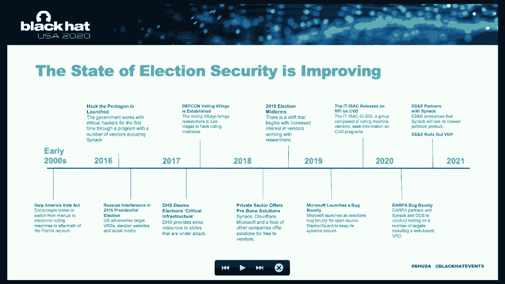

# P4：04 - Building a Vulnerability Disclosure Program that Works for Election Vendors - 坤坤武特 - BV1g5411K7fe

 [ Music ]。

 >> Hello everybody， my name is Chris Vilashin。 I'm the Vice President of the System Security and Chief Information Security Officer at。

 Election Systems and Software。 Welcome to Black Hat in our presentation on building a vulnerability disclosure program。

 that works for election vendors and hackers。 I am joined by Mark Kerr。

 who is the Chief Technology Officer at CINAC， ESNS and CINAC are working together to improve election security。

 And you're going to hear about our partnership and relationship with security researchers。

 to test election technology and improve public awareness and public trust of our elections。

 Quick information about me。 I used to work at the Department of Health and Human Services in Washington。

 D。C。 The VA， a couple other jobs， and then 20 plus years in the U。S。 Navy。

 All positions worried about security networking and improving the security of our infrastructure。

 >> Hi everybody， my name is Mark Kerr。 I'm the co-founder and Chief Technology Officer at CINAC。

 CINAC is a leader in the crowdsource security space。 What we do is recruit， retain。

 and vet a global community of security researchers。

 and bring them on to our software platform to find exploitable vulnerabilities in our， customers。

 applications， and infrastructure。 Prior to this， I was at the National Security Agency doing hands-on keyboard exploitation。

 operations and also worked as an analyst。 And what you realize doing that job is that it really matters the type of team you can bring。

 to bear on a problem and really focused on the mission。

 And this talk is meant to help improve public awareness of what we're doing to improve the。

 security of our election systems。 And as the most sacred aspect of our democracy。

 it's super important and I'm proud to present， with ESNS on this topic on what we can do to make this better。

 the relationship between， the security vendors， the security research community。

 the election vendors， and overall， the federal government。

 local and state governments to make our elections the most secure that they can be。 Prior to this。

 I also worked in the government at Defense Information Systems Agency。 And in that role。

 in a command and control capacity as a systems engineer， you start to realize that。

 everything is connected。 Everything is interconnected and intertwined and we must take a comprehensive approach to。

 securing our infrastructure。 Next slide。 The state of election security is definitely improving。

 especially in the relationship with， security researchers。

 If you take a look back at the early 2000s， we had the election in Florida in the 2000 presidential。

 election where we had some issues with hanging chats。

 And this led us to move from a physical ballot to more of an electronic method for counting。

 and tallying our votes。 This led to the establishment of the election assistance commission。

 And over the years， we have seen that more electronic voting is more prevalent。

 And you can vote online， you can vote by mail using online registration and voter registration。

 databases。 It's all moving into the internet era。 One of the things that this timeline is meant to show though is that this is all intertwined。

 The evolution of voting infrastructure and the relationship of the government with the security。

 research community is all intermingled。 And what we're looking at over the last 20 years。

 but specifically in 2016， is federal， government launches the Hack the Pentagon program to start working with security researchers on。

 critical infrastructure， on defense systems， leveraging that talent in a crowd-sourced way。

 to find vulnerabilities that an adversary could find， but we're trying to find them in advance。

 And if you apply this to our elections infrastructure。

 it's also designated as critical infrastructure， and DHS in response to Russian interference in the 2018 and 2016 elections。

 So what we're seeing is there is a match made in heaven here between the security research。

 community and the government bodies that manage our elections infrastructure。

 And what we're trying to do is advance that and improve that collaboration because it can。

 be quite valuable。 You're seeing that the security vendors are actually stepping up to offer pro bono services。

 to states as well。 Microsoft launches a bug bounty on this in 2019 on election guard。

 SINAC and CloudFlare offering pro bono services to states which we're going to get into more， later。

 ITISAC starts to recognize that this is such an important issue for the general public that。

 we must have an answer for how we're going to do vulnerability disclosure programs with。

 election security in mind and how we're going to integrate the vendor relationship and the。

 researchers that are out there doing great work into a more comprehensive solution。

 And this has led to DARPA getting involved and really advancing the state of the art and。

 computer security which we're going to touch on as well because it's highly integrated with。

 the voter registration systems and protecting that critical infrastructure。

 And then we're going to talk about the ESNS partnership and what ESNS is doing to really。

 improve their relationship with security researchers。

 Overall though this is dramatically improved given public pressure on election security and。

 the voting systems being a primary target for our adversaries。

 This is something that should not be overlooked and I'm glad to see it improving。

 Now with all that in mind I'd like to touch on what crowdsource security actually is。

 There's a lot of terms floating around and I want to make sure we level set before we。

 jump into what this can actually mean in practice。

 In general you start out with something called the vulnerability disclosure program and these。

 are basic policies and procedures for external security researchers to report vulnerabilities。

 to vendors， to the government and this is a see something say something equivalent。

 Your see an issue you report it。 Then we evolve that model to an open bug bounty model where researchers are compensated for。

 their findings。 They're given a payment for a finding and this is allowing us to incentivize that research。

 a little bit more but there's a lot less control and if you need a model that is very focused。

 on specific use cases or you have sensitive systems that you're not willing to put on。

 the external internet you might move to the next model which is an invite only bug bounty。

 which allows us to privately select a crowd of researchers with specific skills and incentivize。

 them to go after specific attack factors that are of particular interest。

 Maybe things that have come up in our threat modeling that we know the adversaries are focused on。

 This is primarily what has been used by the Pentagon and by other government agencies on。

 critical infrastructure。 Then this model evolves to a more comprehensive offering that I like to call managed crowd source。

 pen testing。 Pen testing has traditionally been an approach led by consultants where a consultant comes in。

 and runs through a checklist and compares that checklist to various compliance standards whether。

 it's NIST 853 or PCI。 That's great but this model also integrates open vulnerability discovery where we're able to。

 incentivize researchers to find vulnerabilities that are interesting and also exploitable。

 Then we also integrate into this model automated scanning。

 There's definitely a place for automated vulnerability scanning and the integration of the open。

 volume discovery， the automated scanning and the compliance driven checklist approach is。

 what makes this model quite different and more comprehensive。

 In addition you layer in analytics and auditability and trackability with firm controls over the。

 rules of engagement to get the most comprehensive matrix team approach to your pen test。

 Thanks Mark。 I am proud of the progress that ESNS has made to establish an internal vulnerability disclosure。

 program to communicate the availability of that program and to collaborate with researchers。

 That collaboration is working and I have four quick examples to share with you today about。

 how researchers are not waiting for a policy to put in place。

 They are actively working on election security issues and I'm proud to report that that collaboration。

 is working。 I'd also like to point out that crowdsource pen testing at the state level is in play。

 The state of Colorado is working with CINAC to use crowdsource pen testing specifically。

 as a crucial part of their cyber security program。

 I'm quoting the Colorado Secretary of State Chief Information Officer Trevor Timmons where。

 CINAC is making inroads and working with states specifically to improve the election security。

 posture of state election systems。 My first example is the Citrix Net Scaler。

 widely advertised back in December and January， of 2020。 A researcher by the name of Jack Cable。

 well known， well respected part of Hack the Pentagon。

 and other important initiatives reached out to ESNS to alert us to a Citrix Net Scaler。

 VPN potential vulnerability with malware。 We worked with Jack to identify the vulnerability。

 the device that was involved and to ensure， that a vulnerability。

 a patch of mitigation was in place and then tested。

 Jack was very effective and professional in communicating with ESNS。

 He helped us understand the vulnerability， the seriousness of it， explained the way that。

 he used to find that vulnerability and then work with us to mitigate it。

 Example two comes from two professional researchers Kevin Scogland and Tony Adams。

 Kevin and Tony worked for about a year scanning the internet using a methodology that you can。

 see on the slide here to scan for ports 22 and 443 that with specific responses could。

 fingerprint firewalls that may be used by election officials in the communication of。

 unofficial results because without proper security controls or misconfigurations these。

 devices could be vulnerable to abuse by external threat actors。

 We worked with Kevin and Tony who also reported these issues to the EII SAC， to customers。

 and to DHS。 We worked with this group to make sure and help our customers address this vulnerability。

 Example three also comes from Kevin Scogland and Tony Adams。

 They did a great job reviewing the documentation that election technology vendors submit to。

 the EAC in anticipation of a certification event。 Kevin and Tony reviewed this documentation。

 and discovered that a certain model of a Zebra QR code scanner out of the box， coming direct。

 from the factory could have a vulnerability when using configuration barcodes。

 These are special manufacturer divine barcodes which can be scanned by the scanner to perform。

 administrative functions。 Kevin and Tony alerted us to this and working together we reviewed。

 our implementation of the Zebra scanners to make sure that our implementation would not。

 be susceptible to this vulnerability and we actually used Kevin's suggestion about how to。

 navigate this recommendation。 So I thank Kevin and Tony for their proactive approach to working。

 with technology manufacturers to ensure that we're doing everything as securely as we can be。

 My final example comes from a high school kid named Hunter Osmera。 Hunter was reviewing。

 voter view application websites and found that if he put random characters into the。

 name fields of a voter lookup website that he could return names and voter information of。

 voters in that jurisdiction。 Kevin alerted us to this vulnerability and we worked with him。

 to make sure that special characters would be ignored and the search parameter tightened。

 up to make sure that only authentic characters input into these fields would return the。

 desired results。 Hunter as I mentioned a high school kid proactive professional willing to。

 work with the technology manufacturer to ensure that our systems are as secure as they can， be。

 Very important now but especially important as we move towards November。 Thank you Chris。

 As you can see there are a lot of vulnerabilities up and down the stack。

 here from everything from code readers to voter registration systems to voter registration。

 databases。 These are very complex systems that are interwoven and to tackle such a problem。

 is that we really need an aggressive approach that allows us to be as comprehensive as possible。

 and it is a united effort across the vendor community， the government community and the。

 researchers in order to do this。 In order to further this， SINAC is going to launch a。

 new initiative that is updated to include vulnerability disclosure programs as well as。

 a pro bono penetration test included in this package。 This is going to help us push for。

 the idea that states should be working with that external researcher community to find。

 these vulnerabilities ahead of the adversary and help make our elections the most secure。

 they can be。 This is not a new initiative but it is updated to include even more comprehensive。

 penetration testing with a crowd of researchers and incentivized discovery。 So this is a way。

 for us to help the states move into a modern era of pen testing and follow the lead that。

 Colorado is set by moving and making this part of their core security platform。 The end。

 result will hopefully be vulnerabilities found ahead of our adversaries and a more secure。

 elections infrastructure。 That said， I want to talk a little about the future。 Where do。

 we go to secure the future of our elections infrastructure beyond just better collaboration。

 between researchers and the vendors。 The Defense Advanced Research Projects Agency has。

 been working on a very interesting project to integrate formal methods， a formal validation。

 of program flow into hardware to start to prevent vulnerabilities in software with a hardware。

 approach。 This program is really on the cutting edge and is designed to help us eliminate。

 whole classes of vulnerabilities from the adversaries toolkit。

 This is especially relevant for voting， infrastructure and other critical systems。

 As a part of this and to validate that the， approach is effective。

 Sennak will be working with DARPA on a bug bounty focused on this。

 and a voter registration database use case that allows us to validate that this approach can。

 be used in that type of model in these types of systems that ESNS builds。 This is meant。

 to advance and further harden these systems against future attacks。 And just like we'd。

 expect from DARPA， they're way ahead of the curve here。 We're excited to work with them。

 To make sure that these hardware vulnerabilities can be implemented in a way that allows software。

 to be loaded on top of them and prevent whole classes of vulnerabilities。 Next， I want to。

 go into what those are。 This DARPA research has focused on eliminating things like buffer。

 overflows， information leaks， anything that can be done at the programmatic level， numeric， errors。

 code injection， even cryptographic errors that lead to code execution。 This is going to。

 hopefully allow us to focus on other vulnerability classes like business logic or functional abuse。

 that may be abused in a fraud type scenario。 Given our focus on these vulnerabilities and。

 DARPA's ability to bring a more hardware driven approach， we're hoping that in time for the。

 2020-2024 elections， we'll be able to have an even more secure infrastructure for this。 Thanks。

 Mark。 As Mark mentioned at the top of the presentation， the ITISAC has taken a special。

 interest in vulnerability disclosure programs and is leaning in， helped form an election。

 industry special interest group and has brought a number of election technology providers。

 together to develop a coordinated vulnerability disclosure program which will move the industry。

 forward towards a VDP。 I'm also excited to announce that ESNS is partnering with CINAC。

 to test our newest generation electronic poll book。 These poll books are in wide use across。

 the country。 They are the perimeter or the front line of election technology where voters enter。

 a polling place and are checked in using an electronic poll book。 We want to make sure。

 that everything that can be done to harden and protect these electronic poll books and。

 their communications methodology with the central voter registration database are as absolutely。

 secure as they can be。 Thanks， Chris。 We're excited to get to work on that project。

 As the next step， I'd like to talk about where we can go next in terms of the policies， especially。

 when it comes to the federal testing programs。 There certainly have been a lot of progress。

 made in the last five years on this。 We certainly have seen that researchers can get involved。

 with the vendors。 We've seen that researchers can get involved with the state and local governments。

 and work with them to make this more secure orchestrated voting election infrastructure。 However。

 there are more things we can do。 The testing timelines are just too elongated。

 We need to have the ability to do continuous testing on these products。 We need to be able。

 to push patches to the field very quickly。 The continuous testing model is being adopted。

 by a lot of people。 Critical infrastructure is a great place to start for this type of testing。

 because we know that it has ramifications if a vulnerability is found。

 We know that changes need to be controlled。 That makes sense， but we also need to be able。

 to validate those changes work and marry that with continuous security testing。

 The incorporation of federal standards on this type of product is also needed。 Right now。

 states do not have to buy voter registration systems that are rigorously， security tested。

 There are a lot of optional requirements。 I think we can move most of the。

 optional requirements to mandatory ones with little downside risk。 We ought to be able to。

 push the envelope here， especially on this type of system where the public demands that。

 we deliver a more secure voting infrastructure， they do not want to see adversaries' metal。

 with our elections。 We owe it to the general public to do a much better job。

 Public awareness is rising。 If the states and the vendors are more proactive， I think。

 we'll see some very positive results from the general public。 Thanks， Mark。

 Another topic that's closely related to discovering vulnerabilities before。

 adversaries do are supply chain security considerations。

 We want to take the last portion of our presentation。

 here to talk to you about all that's going on in supply chain security and what ESNS。

 is doing to make sure that the parts that we use in our equipment are absolutely secure。

 and trustworthy。 Our product lifecycle begins at the design phase when we develop requirements。

 in conjunction with what our customers， those state and local election officials are demanding。

 in terms of security。 We put that through a rigorous review。 We bid for the parts that。

 are used to develop these systems。 We make sure that the development and the quality。

 assurance is absolutely airtight using the highest federal and quality assurance standards。

 Every machine that we make， every piece of software that we develop goes through rigorous。

 federal testing and certification。 Then we sustain these pieces of equipment that have。

 generally a 10 or 15 year product lifecycle。 As is the case with many critical infrastructure。

 sectors， ESNS has a global supply chain。 We work very hard to make sure that each and。

 every part that goes into our equipment is absolutely safe， trustworthy， free of malware。

 or manipulation to make sure that when our election technology reaches the customers'。

 hands and voters use it， they can rest assured that all the controls that can be in place。

 to protect these parts and services are in fact in place and tested。 The things that we do at ESNS。

 I personally conduct a review of our supplier partners， supply chains。

 I have visited these sites where these components are made to ensure that。

 no malware is nephariously implanted on these devices， no rogue or counterfeit components。

 I take pictures， I review these， my surveys and supply chain reviews with our engineering。

 and management team to make sure number one that our suppliers are doing everything that they。

 are contractually required to do and two is there anything else that we can look at or。

 ask for that helps ensure the security of the supply chain。 The audits that I do are both。

 on site with the manufacturers' teams and through surveys and reviews that we conduct。

 remotely and then spot check to make sure that our manufacturers are providing pristine。

 malware-free components。 Once all these parts come together in Omaha， we have several teams。

 that review them and we do something extra that I think you'll find very interesting。

 We take a random sample of these parts and we extract any firmware and review it against。

 the Golden Standard to make sure that the firmware is not manipulated or somehow。

 nephariously changed to induce an undesired result。 We check our programmable logic devices。

 to make sure that they only contain the firmware that we authorize and nothing else。

 I would be remiss if I didn't mention that the DHS， CISA and the Election Task Force have。

 produced a number of guidelines for state and local officials to learn about and help。

 work through supply chain management issues。 I invite everybody on this presentation to take。

 a look at what DHS， CISA and the Election Task Force have produced when it comes to。

 ensuring that the supply chain of the technology provided by the vendors is absolutely trustworthy。

 There's a lot of good information that CISA and the Election Task Force has put out in the。

 last several months。 Of course related to COVID and managing elections during a pandemic。

 but they have a deep history， a deep experience in a number of critical infrastructure security。

 initiatives。 Please check out the DHS， CISA website and look at all the products that they。

 have produced regarding vulnerability disclosure and supply chain security。 And with that。

 Mark and I would like to take your questions。 I think we're on， Mark。 Do we have any questions？

 Tiffany， our moderator， could you please review for us any questions that may have been submitted。

 during the presentation and shoot them to Mark and I for response？ Chris。

 I think you've got a few in the queue here。 I am not seeing those。 I've got both screens up。

 Thank you。 I see the live discussion now and the questions。 I will go ahead first。 Michael asked。

 what is the SNS done to ensure that patches created from the disclosure program are。

 applied by local election officials。 Michael， when a vulnerability is disclosed to us and we。

 determined that it is valid and affects equipment in the field， we work hard with the product team。

 and apply it to if required to the voting system test lab so that they can test it to make sure。

 that it doesn't undo any functionality， any environmental controls， any accessibility controls。

 And then we package that together to the EAC for approval where appropriate。

 And then we shot gun it out to our customers in one of two ways。

 We deliver the patch to the customer via physical media or in some cases we will let that patch。

 We transmit that patch to customers who are able to do so through a secure file transfer and they can apply it on their own。

 And in either case， we don't send those patches over the internet or over the wire or anything。

 They are delivered via physical media or encapsulated in an SFT。

 a secure file transfer encrypted and then sent to customers。 I hope that answers your question。

 Next question for me looks like it comes from Harley asking will ESNS commit to supporting protections for security researchers under the DMCA。

 The answer to that is yes。 Today during our presentation the ESNS coordinated vulnerability disclosure program was posted to our website on the security page。

 If you go to esnsvote。com， go to the security page and scroll down。

 You'll see a website and a link to our CBDP policy。

 which does exempt security researchers and provide safe harbor for those provisions of the DMCA so that we can work together。

 Next question is from Joe。 Joe asks if ESNS currently has a VDP and is it available online？ Yes。

 We have posted that policy online。 We've been doing VDP with CINAC and others for some time and we expect this partnership to grow。

 Especially as it relates to CINAC， our partnership with them testing electronic poll books is the first step and what I hope is a continuing partnership to conduct election security testing。

 Scrolling down Joe asks again， where do you stand on an industry wide VDP Joe。

 our discussions with the ITI SAC and other vendors have have shown us that it's a lot harder to produce a VDP for the industry。

 And it is for the individual companies。 So， individual companies were encouraged to establish VDP to work with companies like CINAC if they choose to do so because they have access to a very good talent pool of security researchers。

 That's what ESNS is doing。 Over to you Joe。 I'm looking for other questions in the chat。

 I think that answers them。 The end goal here is to set up a full program testing and end-to-end system。

 This is starting with the electronic poll book but we're going to hopefully expand this over time to include a full end-to-end system of the ESNS stack。

 While it's a very complicated thing to set up， we're excited to get researchers involved and really make a difference in state of our election security。

 Thanks Joe。 I just see a new question from Eric。 Eric， apologize for the confusing comments。

 ESNS has been doing VDP for a while。 Going back 18 months or more。

 we have been in contact with security researchers who have posted or alerted us to vulnerabilities and we've been working on those and communicating with security researchers for more than 18 months。

 The partnership with CINAC is new。 Last month we signed a contract with CINAC to conduct security testing of our electronic poll books。

 We believe that is the first step in a partnership with CINAC。 I hope that helps。

 I apologize for the confusion。 I can take the next one here from Brian。

 The model definitely works for aviation vendors as well。

 We've done this with the Air Force and different aviation companies。

 The model is such that you want to get things set up。

 You want to have a simulation or emulation of the system to be able to get a full end-to-end test as close to the new production system as you can。

 That model can be applied to a variety of industries。 I see another question from Joe。

 Where do we stand on the industry-wide VDP？ Do I have an estimate on when that will come？

 I really don't， Joe。 The ITISAC is a coordinate in this effort for the industry and we meet regularly to discuss the methods in which we establish a VDP for the industry。

 We have a number of different members who are in different places of maturity。

 ESNS has had a vulnerability ingestion and processing evaluation workflow for some time。

 Other election technology providers are just getting to have that process in place。

 You must have the process in place to ingest， evaluate。

 and then act upon vulnerabilities before you open the door to allow those reports to come in。

 I want to re-emphasize something that Mark said， we still need the EAC to work with election officials and vendors and provide a path for the rapid ingestion and patching if it's needed。

 That has not come to fruition yet， but the EAC and their partners are working very hard on it。

 And once they do， we think that will be a gateway to allow for security researchers working under CBDP policy under the safe harbor rules and meeting our expectations and us theirs to be able to communicate vulnerabilities that can be acted upon quickly。

 Next question looks like it's from Kim。 She asks， Chris。

 how does ESNS do a spot check on firmware to make sure it hasn't changed？

 Can you describe that verification progress？ Yes。 So we work with our manufacturers to establish the Golden Build or the firmware Golden Edition to make sure that we check it line by line to make sure that any firmware has only what we place in there and nothing else。

 We deposit that firmware， we escrow it in a couple of different places。

 And then when hardware comes to Omaha for final assembly。

 we do a statistically random sample of equipment。 We take that equipment off of the truck after its final assembly。

 We have a third party security company extract the firmware from those components and compare it against the Golden Build。

 And then they tell us they give us reports of how complete。

 how accurate have there been any changes and so far， well。

 that program has been in place about 18 months。 And all of the equipment that we have checked have not had firmware manipulated or otherwise。

 otherwise changed from the Golden Build that we have established。 Hope that answers your question。

 Thank you。 Mark over to you for closing comments。 Yeah， I just want to recognize， you know。

 historically， I know there's been some， you know， some consternation， you know。

 with the research community on how this is tested， you know， how open it is。 And this is a。

 this is a process and this is a great first step for ES and S and we're excited to work with them on this。

 And， you know， we recognize this is an important problem for our country and we need to make sure that we get it as open as we can within the constraints that that makes sense for commercial entity and for such sensitive equipment。

 So I think we're on the right path。 We recognize we're not where we want to be yet。

 but we're making strides to make the process of working with researchers on such sensitive equipment。

 more streamlined， more scalable and more。 And so， like， you know。

 just just more mimicking what the adversary is going to do to us and that's that's the key to this whole thing。

 Just make sure we can find these vulnerabilities in advance and get confidence that our systems are completely secure。

 Thank you， Mark。 One quick question from Joe he's asking。

 when did we ES and S star accepting vulnerability reports。

 We put up that communication channel on our website more than 18 months ago。

 Hackers security researchers weren't waiting for a policy to use it。

 They have used it in the past 18 months。 We're publishing the policy today to formalize how we're going to work with security researchers to improve election security going forward。

 We want to thank everybody for attending today for a black hat accepting this presentation for our partnership with with CINAC for all the state and local election officials who are doing a great job on the front lines。

 And for ES and S and other election technology providers trying to do better。

 This is a good step in the right direction。 And we look forward to improving everywhere we can election security。

 Thank you。 [ Silence ]。