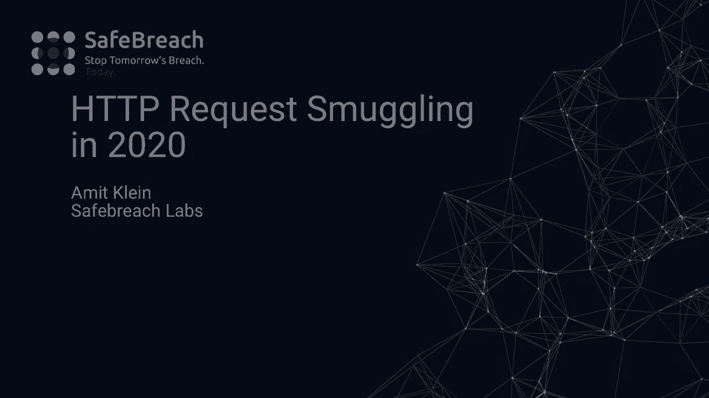
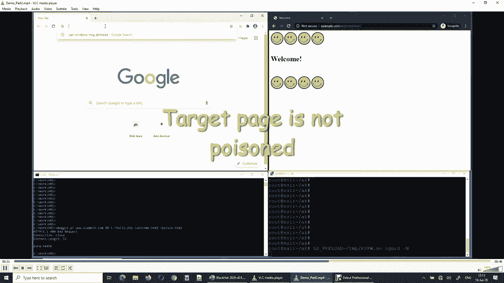
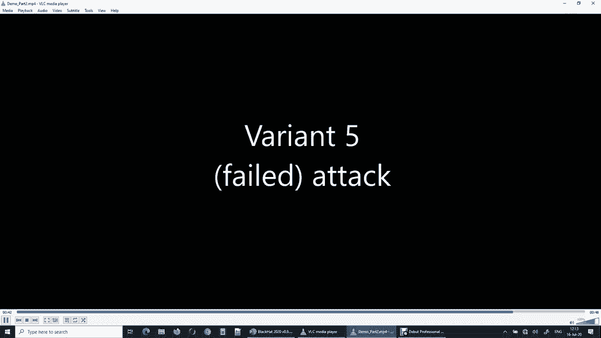
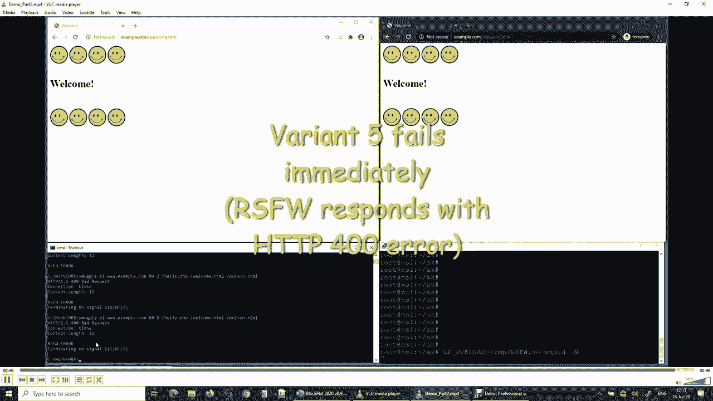

# P56：57 - HTTP Request Smuggling in 2020 – New Variants, New Defenses and New Challen - 坤坤武特 - BV1g5411K7fe

 [MUSIC]。

 >> Good morning， ladies and gentlemen。

 and welcome to my talk about， HTTP request smuggling in 2020。 My name is Amit Klein。

 you can read more about me in this slide。 Today we're going to talk about the HTTP request smuggling。

 which is an attack that involves three actors。 One is the attacker who is a practically a client。

 the other one is the proxy or firewall， and the third actor is a web server or it can be。

 a chain of proxies and firewalls leading to， finally to a web server。

 The attack involves the attacker connecting， over port AT or TCP to the proxy and sending。

 the proxy an HTTP stream consisting of three chunks or three parts。

 A followed by B followed by C and we designate， the A part in red。

 the B part in green and the C part in blue。 The proxy interprets this stream as。

 the first request being A followed by B and the second request is C。

 and it forwards those two requests to the web server。

 and the web server however interprets those two requests as the string， I'm sorry。

 as a first request A followed by， a second request B and C。

 and thus it responds with the responses for A and for BC。 The proxy then caches for AB the response。

 for the web server provided for A， and more importantly the proxy caches for C。

 the response that the web server generated for the messages BC。

 That latter part is exactly where HTTP request modeling takes。

 effect and ends up in web cache poisoning in this example。

 The HTTP request modeling attack is also called the HTTP distinct attack。

 per James Cattle's recent research。 Just to illustrate this in more detail。

 this is an example string where A， the red part is the first chunk that the proxy receives。

 In green we see the second chunk and in blue we see the third chunk。

 Let's say that the proxy interprets the or uses the last content length header。

 In such case the proxy will interpret this stream as two HTTP requests。

 one with 44 bytes by the consisting of the red part followed by the green part。

 The second one is the blue part which is entirely new HTTP request。

 From the proxy's perspective the proxy will see the first request for hello PHP。

 and the second request for target HTML。 Whereas say we have a web server that interprets the or that uses。

 the first content length header， in such case we'll see the first request being the red part which is a request with zero body lengths。

 followed by another request green and blue parts。 So from the web servers perspective the first request will be to hello PHP with zero bytes in the body。

 and the second request will be for the poison HTML resource with some extra headers in blue。

 As you can see the proxy will therefore cache for the target HTML URL。

 the data that the web server provided for the poison HTML URL。

 and thereby we achieve a web cache poisoning。 A short history of HTTP request smuggling as you can see in 2005 that's a decade and a half ago。

 the seminal paper HTTP request smuggling was published。

 it was followed by several research small papers。 And then for almost a decade there was no substantial research in HTTP request。

 smuggling in the HTTP request smuggling area， the way of course vulnerability is published。

 but no significant research as far as I know。 In 2015， 2016。

 Regis Leroy published his hiding book is in HTTP， reviving the interest in this area。

 and in 2019 James Kettle published his series of papers around HTTP distinct attacks in Blackett。

 USA and in Blackett， Europe。 So given all this， my question is。

 is HTTP request smuggling still a thing？ This is 2020 and we are after all aware of the attack for over a decade and a half。

 It was back to the limelight in recent years thanks to James Kettle and Regis Leroy。

 And so our mainstream web and proxy servers still vulnerable。

 The scope of my research is the usual suspects and you'd expect them to be all immune by now。

 But since I'm here in Blackett， answer is no。 Let's see some interesting variants。

 First is a header followed by space or curd you turn followed by some junk。 For example。

 content length header followed by the content length followed by space。

 followed by ABCD with a value of 20。 And as it happens。

 squid ignores this header completely but it forwards it as is。

 Whereas a BizX1 web server converts it into just the header part without the space or the junk。

 So cache， web cache poisoning attack with squid in front of abyss may be constructed as following。

 where the legitimate content length header with 41 bytes and followed by this not so legit content。

 length header with space and junk with the value of 3。

 Squid uses the valid content length header and ignores the invalid header。

 So from squid's perspective， we're talking about a body length for 41 bytes。

 Whereas abyss uses the second content length header which has the value of 3 from abyss's。

 point of view。 So abyss will see the second request for poison HTML and serve it。

 Whereas squid will see the second request as get welcome HTML so it will cache the content。

 of the poison URL served by abyss to the URL welcome HTML。

 Now what if we don't like this to feed abyss with two content length headers？

 What if we suspect that abyss will fix this soon？ So we discovered an interesting abyss behavior。

 something that is also exhibited by other web servers。

 which is if the request is partial it may still be fulfilled by the web server and by partial I mean。

 that the full body bytes were not yet received。 So abyss in such case will wait 30 seconds and then it will invoke the backend script。

 and provide the proxy or the client with the data that this script generated and after additional。

 bytes are received in the TCP connection they will be silently discarded until the full body is read。

 And then abyss will start parsing the next request。 So what would an attack look like？

 In this case we have just the invalid content length header in which case squid will interpret。

 this as a zero length body request and will only send the headers to abyss。 Abyss will wait 30。

 abyss expects 39 bytes in the body， it waits for 30 seconds then， invokes hello PHP。

 hello PHP generates some answer。 This is forwarded to squid and then squid sends the next request that for its point of view。

 this is get welcome and so forth and then abyss will silently discard the 39 bytes that belong。

 to the first request from its perspective and start serving the second request which is get。

 poison HTML so again web cache poison。 Some interesting variants I discovered relate to how。

 mod security plus CRS behave specifically this community rule set。

 Mod security plus CRS is actually a free and open source web application firewall。

 It provides some rudimentary direct protection against HTTP request smuggling。

 It has the parallel levels it runs by default in parallel level one。

 and it has some more strict rules in parallel level three or four but these generate a lot of。

 false positives so they practically cannot be used in production environments and our bypass works。

 for parallel levels one and two。 So let's look at it。

 Let's review what the challenges were and how we overcame them。

 So the problem with mod security plus CRS is that our HTTP request smuggling payloads got blocked。

 by the HTTP response splitting attack rules。 So for example we have two rules nine two one one thirty that looks for a pattern of HTTP slash。

 0 9 1 0 1 1 and we have another one that looks for Kerjutin and line feeding argument names both are。

 geared towards blocking HTTP response splitting。 Unfortunately for us they also work against our HTTP request smuggling payloads。

 Walking around the last one the 150 is trivial we just move the attack from the what。

 mod security considers as the argument name to the argument value by propending the。

 in argument bogus or fake argument name x y equals something and then we move away from being an。

 argument name。 As for the 130 the trick is to use HTTP 12 instead of HTTP 10 1 1 and as it happens。

 IIS Apache engines Node。js and the BIS respect HTTP 12 and they treat it as HTTP 11 and in their。

 in their proxy head squid HA proxy Kerjutin traffic respect HTTP 12 but converts them into HTTP 11。

 There's still a small problem through 150 which is triggered because the payload contains something。

 that looks like a Unix direct command execution the space followed by slash but that can be worked。

 around too by using the full proxy URL as you can see below。 And then we discover the much more。

 funny bypass which is to use content things text plain this one in paranoia levels one or two。

 simply makes the content rules comminter will set to disregard the body entirely and so we can get our。

 HTTP request smuggling attack nicely through through mod security plus series。

 And the fifth variant is actually is documented somewhere in burps HTTP request smuggling module。

 as a zero d wrap but I don't think I've seen any successful use of that until today。

 So we discovered that squid ignores a header prepended by a Kerjutin return it just for that。

 as is and a BIS respect is header and here's an example of an HTTP request smuggling attack。

 ending in web cache poisoning using the wait for it trick gain so we just feed this invalid。

 content length header squid ignores it and a BIS respects it。

 One last tip for overriding existing cache items so sometimes a page is cached and you want to。

 poison it you can use a cache control no cache for the request that involves this page and the。

 header may be moved around so you need to be careful about it when you calculate payload lengths。

 and offsets。 Let's see this those variants in action。

 We can see we can start with the abyss web server version as you can see it's pretty recent。

 followed by the squid version which you can see it's fully patched for the time of testing。

 and then let's see now variant one we first load the target page the original target page。

 which makes it also which makes squid cache it and then we run the smuggling script to see our options。

 we use now the first variant， and now we load the same target page in a different browser to avoid the browser caching issues。

 and we see indeed that it is poisoned， moving to variant to the second variant again we load the URL we see that the page is cached。

 correctly now we run the second variant， with the time fast forwards for 30 seconds。

 and we check the the page again from a different browser instance and we see that it's poisoned。

 finally we run the fifth variant again we load the your the target URL now it's cached in the。

 squid we run the fifth variant time is fast forwarding 30 seconds。

 and we load this URL again so this for the proxy and we see that it is cached if it is poisoned。

 so I reported all those variants to squid and abyss and and oaspe community rule set it was fixed in abyss。

 and in oaspe community rule set and hopefully by the time this presentation is is a screened。

 squid will also fix those issues in its product， and after seeing that the issue is still real I started considering what the possible solutions may be。

 first I want to discuss some float approaches for protection against hgpo quest smuggling。

 for example some people claim that normalization of outbound hgpo headers for proxy servers is a。

 solution and I think that obviously it's a solution for the htp devices behind the proxy but it's。

 completely ineffective for all attacks that take place between the proxy and the devices in front。

 of it so for example if you are a client and there is a proxy p1 and then you are proxy p2 in this。

 chain and finally there's a web server then and p1 uses say the first content length header and p2。

 uses the last content length header then the then you can mount an hgpo quest smuggling between p1。

 and p2 now if you ask whether this is a whether p2 used to be blamed or to to a shoulder part of。

 the blame think of the p2 to the web server connection as an obstruction for web server ws prime so now。

 the client is communicating through a single proxy p1 to web server ws prime and ws prime accepts。

 multiple content length headers and uses the last one now would you say in this case that ws prime。

 is vulnerable to htp request smuggling because if you say yes then obviously p2 is vulnerable to htp。

 request smuggling because ws the original ws can be a fully 100 percent RFC compliant and yet htp。

 p2 quest smuggling and web cache poisoning can take place so if you accept the premise that in such。

 case a web server is vulnerable to htp request smuggling then obviously a proxy is too。

 same argument applies to having a tcp connection per each outbound request again。

 something that proxy servers can do it's good for htp devices behind a proxy but it's not effective。

 for htp devices in front of the proxy so moving back to finding a solution some of us up was。

 obviously with mud security plus the crs it has some obvious pros like being a true web application。

 firewall being free and being up in source but it also has some some serious cons which is it only。

 supports a small subset of web servers and it only has a rudimentary defense against htp。

 request smuggling so from my perspective it's not good enough。

 so i started thinking about what an ideal solution would look like and my concept is something。

 lightweight and simple and easy not a fully fledged waf it should be it should focus on specific。

 protocol attacks like htp request smuggling and maybe additional attacks it should be secure。

 obviously and i want to develop a proof of concept that doesn't need to be production quality。

 it just need to demonstrate a concept that then vendors can take and implement in their products。

 or third party security providers can implement as a production。

 production solution production grade solution， and more specifically the architecture would be or or the the solution would revolve around。

 having a very strict validation of small subset of the htp standards so i'm talking about anything。

 that can affect the request length specifically the content length header and the transfer encoding。

 header and having unambiguous line ends and header block end and of course monitoring the request line。

 for verb names should should be unambiguous because the verb name sometimes dictates that。

 their request mustn't have a body or typically doesn't have a body and unambiguous protocol。

 designation as in order to avoid the htp 0 9 the htp 0 9 syndrome and maybe other headers that i。

 haven't thought about yet i want my solution to be generic so it doesn't tie to specific。

 technology or product or platform so specifically i don't want to rely on windows lsp or wflp。

 and it would be nice to have that it that it can be extended beyond htp like having。

 the crypto the htp s traffic and maybe other protocols and of course it should be secure so i。

 think that the only way to do that is with in-pass monitoring and not something based on sniffing。

 and architecture the solution i arrived to was is the good old function hooking for in this case。

 for for the socket layer functions so few words about function hooking while completely non-standard。

 it's the fact though used very commonly in major operating systems like windows and linux。

 and they are even cross-platform function hooking libraries like a fun hook that i use in my in。

 my project stability and robustness may be an issue but again this is a proof of concept。

 library it's not a full product and hook and hooking is just one piece of of the game and one needs。

 still to inject the code or at least an initial code in windows this can be done by using a standard。

 deal injection in linux you can use ld preload again problem of stability and again i don't care。

 about this at this for this project and the way i implemented my project is using two layers one。

 is the socket obstruction layer and the other one is the actual firewall and the socket obstruction。

 layer allows me to abstract a native socket into standard open read close view so i need to manage。

 the sockets from cradle to to death and i need of course to maintain a map from this socket file。

 descriptor to to a user object that handles each socket each socket gets its own instance of a user。

 object and i don't want to interfere with the system operation so there's no buffering at all。

 that i i'm allowed to introduce and i signal to the user object important actions by using a。

 contract the the constructor to signal socket open an on read invocation which signals a socket read。

 and the destructor signals a socket close i provide the user object with socket file descriptor so the。

 user object can interact with the socket and the user object signals back to me in the return value。

 whether i should forcibly close the socket so what do i need to hook you can see that in windows。

 i just need to hook seven functions to get to cover the full functionality of the。

 usual suspects and same goes for Linux tested in 64 bits again a nice area of web servers is。

 covered by hooking seven functions only while implementing the socket obstruction layer i learned。

 a lot about the internals of of web servers and and in sockets of course especially in Linux。

 worker processes and forking must be supported this is not a fully functional yet in my library i。

 just run a single process instance of the web server for testing locking of the socket management。

 table is also desired so far i haven't implemented it preserving the correct error state is mandatory。

 you can easily crash a system or or make the system malfunction if you do not preserve error。

 no last error and w say last error s td out and s td error are not always available so write your。

 own log file for some bizarre reason squared on Linux doesn't like f-close so i had to resort。

 using the direct IO functions and statistically linked executables with stripped symbols are a。

 serious problem for my approach so compiled go products like traffic and credit are not supported。

 at this time interestingly enough the Linux receive implementation actually invokes the。

 receive from Cisco this is a bit surprising except or except for are sometimes invoked with address。

 being null this is valid but also surprising and no JS uses a library called uvlib which。

 invokes the syscalls directly so you can't i can't hook there's no point in hooking the usual socket。

 functions i need to hook specifically the uv except for function in this case in order to get the。

 full functionality on top of the socket obstruction layer i implemented another class called the。

 request smuggling firewall that uses the socket obstruction layer to implement the request。

 smuggling firewall surprisingly and it enforces a strict RFC 2616 on the relevant parts of the。

 HTTP request like request line format head and aim format content sense transfer encoding。

 of line chunk body format it operates with the default denial policy it only buffers。

 a single partial line internally it always sends the data immediately to the application to the。

 web server but it buffers a single partially a partial single line and so that there's no。

 there's never a full line with violation transmitted to the web server so it stops immediately upon。

 the first violation and the violation can cause it to send a 400 response as we'll see in a moment。

 and to terminate the connection and let's see a demo， okay demo。

 so we run squid with the RSFW library and then we try the first we first load the target page。

 to squeeze cache as we usually do now we run the first variant。

 we can see that it fails with a 400 response and if we load the target page again this time。

 we can see that it's actually not poisoned。

 now we run the second variant if you remember it should run for 30 seconds but actually it just。

 exited immediately and same with the fifth variant。

 so during my HTTP request smuggling research I bumped into some interesting promising or suspicious。

 anomalies in some HTTP devices for which I can describe a matching behavior so if I found something。

 interesting in a web server I could describe a matching behavior in a proxy server that leads。

 to HTTP request smuggling however I could not find this matching behavior in my zoo of product so far。

 just to illustrate let's say we go back to 2005 and I noticed a web server which takes the first。

 header in a double content length request a matching behavior would be then a proxy server that takes。

 the last content length in such a request but keeps both headers but let's say that in my lab back then。

 I could only find proxy server that either take the first header or reject the request and then in 2005。

 this would have been a very interesting and and relevant example naturally in 2020 this isn't。

 there are probably no web server or proxy server that behaves so naively but you get the idea。

 so Kerjutan in a header name is interpreted as a hyphen so just like I mentioned one web server。

 treats this content Kerjutan length as the header content length I suspect this is due to a quick。

 and dirty upper casing using all with 0x20 so if it or 0x20 with a Kerjutan you get a hyphen。

 the matching proxy behavior is to simply ignore this header and forward it as is and the attack in。

 this case would be the having a web server expected body and using a get-to-quest the web server will。

 immediately forward request to the application without a body and this and on the other hand the。

 matching proxy will so the matching proxy will treat it as zero length body and the web server。

 expect a body of a certain length and therefore web cache poisoning ensues unfortunately for me。

 it's an attacker all proxy servers I have either rejected with 400 response or modified the request。

 this is this may be fixed by the time this presentation is aired so I urge you to get updates on my。

 for the white paper and I'll be able to hopefully I'll be able to update and to name the relevant。

 web server in the white paper signed content length talking about adding a plus sign in front of the。

 value obviously it's non-RFC behavior because content length only allowed digits some proxy。

 implementations use the API like a to I that does accept the sign the matching web server behavior is。

 to simply ignore this header and that attack is obvious the web server is the fact of content。

 length zero whereas the proxy server sees one two three four this doesn't work of course if the。

 proxy normalizes the content length header before forwarding it to the web server all the web servers。

 I have either reject or honor this request as is so no good here and the vendor that I reported。

 this to several proxy vendors it was fixed by squid abyss and go content length value with space。

 so I'm talking about content length one two space three four again it's non-RFC and jinx ignores this。

 header what I look what I want to find is a proxy that uses one of the values one two three four one。

 two or three four and for what the request header is is that attack is obvious all the proxy servers I。

 have either reject or remove this header I reported these two engines and they say they won't fix it。

 because it doesn't look like vulnerability in engines their quest question cannot be passed through a。

 compliant HTTP proxy with the header interpreted as a content length header so they say finally。

 there's one web server that simply ignores transfer encoding even in HTTP 11 obviously this is not an。

 RFC compliant behavior what I look for is a proxy server that prefers transfer encoding over content。

 length but does not modify their request and the attack would need to send a request with both。

 transfer coding and content length where the proxy would use the transfer encoding header and the。

 web server would use the content length header all the proxies I have normalized their quest either。

 per the content length header or per the transfer encoding header so this becomes a non-relative so。

 I cannot exploit it in my lab to conclude we see that HTTP request smuggling is still a thing in 2020。

 in common of the shelf software existing open source solutions are lacking there's there is a more robust。

 approach for defending against HTTP request smuggling and it is feasible I'm talking about。

 implementing a lightweight solutions specifically tailored for HTTP request smuggling in path。

 it can be applied by vendors or third party security software and there are still some interesting。

 challenges in this area thank you very much， right so thank you very much for attending my session right now I see there is one question but。

 what the question this is the question is let me read it for everyone are there good fuzzing frameworks。

 for testing for HTTP requests smuggling besides manual testing e。g。 through burp or zap so。

 to the best of my knowledge some web applications scanners have。

 HTTP requests smuggling testing and attacks incorporated in them having said that I think that。

 there are some obvious hurdles in automatically testing for HTTP request smuggling as some of the。

 people on the chat mentioned so in essence one needs to be very careful about the impact of the。

 attack which can be very tricky in the case of HTTP request smuggling including a long lasting。

 effect on the on the cache and in at large I think this attack is somewhat more difficult to control or。

 to predict the outcome of the exact attack or the variant compared to other application。

 vulnerabilities or application attacks I think James Kettle in his last year's Blackhead presentation。

 touched some of the issues about security and safely testing for HTTP request smuggling but。

 obviously it's it's non trivial so the net the net answer or the bottom line。

 respect to this question at least from what I know is that some automatic applications scanners。

 do test for it but there are some inherent problems in automatic and large-scale testing。

 that perhaps prevent large-scale and intensive fuzzing around this。

 around HTTP request smuggling okay and I see that there is now another question。

 right so okay I got an excellent question here when you showed the deposit page on the demo。

 it looked like an attacker injected it there I missed the beginning。

 says you can only use the HTTP request smuggling to access pages already on the web server right。

 not for an attacker to introduce new content absolutely or you're 100 correct。

 but think about it this way an attacker can still save on some sites there are。

 attacker-controlled content like comments or blogs or personal areas in the website which the attacker。

 has a lot of control over and also think about this about this say let's say that there's a。

 hot news about some I don't know COVID-19 vaccine being tested by by company XYZ。

 and then you you replace both and quote or make this a make the URL be cached with the content。

 about the same company having an earlier vaccine variant shown ineffective and that can。

 that can have impact on that company and on the on the share price of that company。

 and so what I'm saying is even if the attacker cannot have his or her own page on the website。

 so that the URL the cached URL is cached together with the content from the attacker's controlled。

 page the attacker can still incur a lot of damage by having one URL caching the。

 the content from another page which is not intended for that URL so yes but technically。

 you're absolutely right you can only do this attack with a page with a poison page that is。

 already on the website absolutely right， actually I don't see any further questions right now， okay。

 all right there's another question here but I think that we can just。

 now so there's a question here sorry there's a question here about the variants I demonstrated。

 the attack against the testing against proxies a was built in house no the attacks were against。

 a combination of common off the shelf two common off the shelf pieces of software one is a squid。

 proxy and another one is a abyss x one server could HTTP poisoning work in tandem with a。

 URL redirect attack to another side I guess the answer to that is no because the the attacker we。

 are talking about here about HTTP requests that are generated by the attacker if there's a redirect。

 in the website I don't think it affects their target it only redirect works at the browser level。

 and we are talking here about HTTP level so it's a bit a bit more raw if you forget my meaning。

 how do you see the light weight implementation of your suggested fixes with folks on large scale。

 proxy networks like cds excellent questions obviously cds are not going to incorporate my code。

 this was more like a wake-up call for vendors and security vendors to show them that HTTP。

 requests modeling protection is possible and I think the way to do it is by focusing on HTTP。

 requests modeling and providing excellent security specifically against this attack instead of trying。

 catch all solution like a web application firewall which which has its problems and has its drawbacks。

 now I'm not saying this is not a useful product but obviously it's more difficult to deploy than a。

 point solution against HTTP requests modeling let's see anything else okay where can you find。

 the content of your test scripts I shared the URL in the chatroom early in my presentation。

 and there's a little bit of course in a link in my white paper that will be published tonight。

 all right no I think I think we are done here and you can contact me directly for if you have。

 additional questions thank you very much it was a pleasure to give you this presentation。

 in in black hat and answering your questions thank you。

