# 【转载】Black Hat USA 2020 会议视频 - P57：58 - Demigod - The Art of Emulating Kernel Rootkits - 坤坤武特 - BV1g5411K7fe

 [MUSIC]。

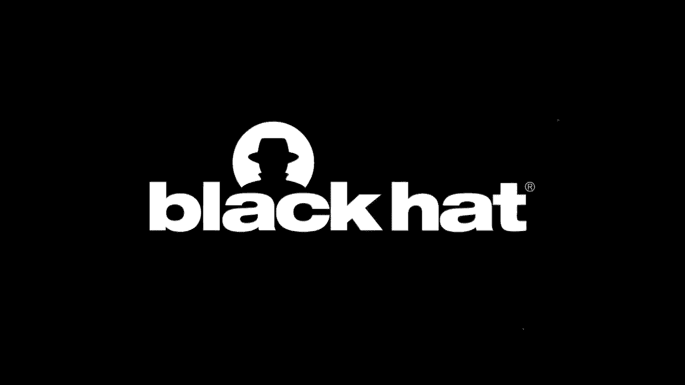

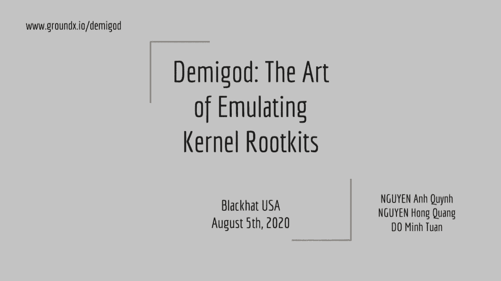

 >> So this talk is about the MIGOR， a new tool that allows you to analyze。

 kernel and root keys in show-by-emulators。 So this project was done by a team of three people。

 My name is Mignan Quinn。 I'm working in Nanyan Technological University of Singapore。

 I have many interests that include operating system， virtualization， and binary analysis。

 And I am the founder and maintainer of， few open-source reversing frameworks like capstone disassembler。

 in the call emulator and keystone assembler。 So next team member is Mignan Quinn。

 He's a researcher at Vattail Cybersecurity。 He has some interest in fuzzing and exploitation。

 So last team member is Domin Ton。 He's a security researcher of size stack。

 and he has interest in fuzzing and exploits。 Ton is a member of a CTF team named Baby PhD。

 and he made some presentation at Black Hat， USA， Asia， T2， and X-Con。 So in this talk。

 we look into the background， and we present the motivation of this MIGOR works。 After that。

 we introduce how we design， how we implement the MIGOR， and how the MIGOR can emulate。

 Conan Rookis for different platforms， which is Windows， Mac OS， and Linux。

 We have few demos in our talks。 And finally， we introduce some more exciting operations。

 that you can view on top of these frameworks。 Okay。

 first we look at the background and motivation of MIGOR。 Okay， Conan Rookis。

 we know that computer system consists， of two main areas with different privilege。

 First one is user land， which is ring tree in X86。 The second one is OS Conan， which is ring zero。

 So Conan function at the lowest level in the system， which has a full control on the whole system。

 And the MIGOR running inside the Conan is Conan Rookis。

 And because Conan Rookis function at the same level， is a Conan， it has a full power。

 So it can defeat all the monitoring， and defensive mechanism in the system。

 Conan Rookis are very hard to detect and queue， because it can have many tricks to evade detection。

 or it can even queue or phone and the anti-malware tones。 So when people view the Conan Rookis。

 they try to make it highly compatible， easy to build and easy to maintain。

 So that's why most Conan Rookis come in the form of Conan， Moroons or Conan drivers。

 which is docis files on Windows， docx files on Mac OS， or docio file on Linux。 Okay。

 so we want to analyze Conan Rookis， which is not easy at all。

 We set a target that we want to analyze， going to Rookis coming to some forms， binary forms。

 which means we need to analyze docis files， or docx files， or co files depending on the platforms。

 So there are two ways to analyze Conan Rookis， coming in the form of Conan drivers。

 First way is that we can use dynamic analysis techniques。

 But this way is pretty troublesome nowadays。 To analyze Conan Rookis。

 using dynamic analysis techniques， we need two machines， which can be physical machine。

 or virtual machines。 So we run one Rookis on one machine。

 and we run our analysis tool on another machine。 And on the second machine。

 you can run some debugger， to connect to the machine that runs in Rookis。

 The problem with this solution is that， when you analyze the Conan Rookis。

 the Conan Rookis can cross the machine。 And because Conan Rookis function。

 at a very low level in the system， we have very low visibility on the activities。

 of the Conan Rookis。 And finally， most of the analysis tool for malware， are viewed for user land。

 but not for the Conan quote。 So in fact， we have very few tools。

 that can analyze Conan Rookis nowadays。 The second approach is static analysis。

 which is that you put your Conan Rookis files， into some analysis tools like IDAPR。

 or binary needs or whatever。 However， analyzing Conan Rookit in static analysis。

 or you can analyze this， is also very trouble。 First of all， Conan Rookit can be packed。

 And in that case， analysis tool， static analysis tool cannot recognize them。 And actually。

 Conan Rookit function， depends on the Conan settings。 And most of the time。

 Conan drivers do not have the settings。 So， static analysis tool cannot decode。

 and recognize the Conan Rookit very well。 And in fact， we try many， many static analysis tool。

 on Conan Rookis。 And most of them have many issues with missing API。

 recognizing wrongly the Conan structure and so on。

 So we think that we need better tools for Conan Rookis。

 What if we can analyze Conan Rookit from user land？ In that case。

 we do not have a machine class issue anymore。 We do not need to set up a separate machine。

 for analyzing Conan Rookis， because everything is in Rinktree。

 And we do not have much risk with Conan level malware。 And if everything is in Rinktree。

 we have very good visibility in the Conan activities， in the activities of Conan Rookis。

 And we can reuse many existing tools， to analyze Conan Rookis in Rinktree。

 We also want to analyze Conan Rookis， in course， platform and course architecture， where sometimes。

 first of all， it would be very nice if you can analyze windows， Conan Rookis on Linux。

 and vice versa， we can analyze a Linux， Conan Rookit on Windows， that would be even better。

 And we also want to analyze the first-pone AM Conan Rookis， on acoustic machine。

 and if you can do that， it's very nice。 And finally， a better tune for Conan Rookis。

 would allow us to view more and better， advanced analysis tune。

 And would be nice if we can view our， next advanced analysis tune in high level language。

 like Python。 So， we consider many approach， and we choose emulator approach。 So。

 the idea is that we want to emulate a west， Conan is short wire。 So， we can run Conan drivers。

 Conan Rookis in emulator mode， in the emulator。 And because emulator run in Rinktree。 So。

 if we can emulate the Conan Rookis inside the emulator， we do not have a machine class anymore。

 We do not have issues setting up separate machine， or virtual machine to analyze Conan Rookis。

 And we do not have risk with analyzing Conan Rookis。

 because we emulate everything in the safety sandbox， and we can reuse many existing tunes。

 If you can analyze Conan Rookis inside emulators， you have excellent visibility。

 Because you can see on the execution code， and you can instrument at various levels。 Finally。

 you can use some cross platform， and cross architecture emulator。

 Then you can do cross platform architecture， analysis on the Conan Rookis。 And in the case。

 if the emulator is built， in high level language， like Python。

 then you can easily view our own tunes， to analyze many Conan Rookis easily and quickly。 Okay。

 in the next session， we introduce how we design and how we implement the MUGO。 So。

 let's look at an existing emulator， which is very close to what we are looking for。

 We are talking about Chilling Emulator， which is open source emulator。

 It supports multiple operating system。 So， Chilling can emulate Windows， macOS， Linux。

 It supports multiple CPU architectures。 So， we can handle binary code from x statistic， AM， AMC4。

 and MIPS。 It's built in Python， open source， and it allows you to instrument。

 perform instrumentation at various levels。 At basic block， at injection level。

 you can also instrument memory access and so on。 Chilling has one very good debugger viewing。

 which is compatible with GDB。 So， we can connect many debugger to the emulator。

 to debug emulator code running inside Chilling。 However， the issue with Chilling is that。

 we want to emulate Conan Rookis， but Chilling is not built to handle Conan code at all。

 It can only emulate EZLAN code。 So， because a lot for Conan。

 Mournon is very different from the load， for EZLAN binaries。

 Chilling cannot handle Conan drivers at all。 Chilling is not made to emulate Conan components。

 Conan APIs， and the scheme of Chilling is quite different。

 It's built to run the EZLAN code from beginning to end， but Conan Mournon function differently。

 We need to load the Conan Mournon into the emulator first， and let it initialize。 And after that。

 depending on the user input， Conan Rookit will run different code path， depending on the input。 So。

 the scheme of implementing the Conan driver， is quite different from the implementing the EZLAN code。

 So， the idea is that we fuck Chilling emulator， and we build them， we got onto a Chilling。

 Because of that， we can reuse many existing， nice feature of Chilling。 So。

 we can reuse a lot of Chilling， delete and modification。 You can reuse simple relocation。

 You can reuse the imported functionalities， inside the Chilling loaders。

 But you need to view many of our own tones， because Chilling do not have those features。

 First of all， we need to emulate， the Conan components， our shell。

 The Amigor also need to emulate Conan APIs， by hooking and emulating those。

 emulate on the Conan API semantics。 And we also had to do our own main instrumentation。

 for the Conan Rookit to work。 We need to hook and emulate system Conan API。 And for debugging。

 this is good， because we can reuse existing ZDB server viewing inside Chilling。 So。

 the Amigor can enable the ZDB server， when you emulate the Conan Rookit。 So。

 we can debug the Conan Rookit running inside the Chilling。 So， here I am to emphasize one thing。

 that makes the Amigor different from the Chilling。

 The EZLAN code is typically only one phase emulation。 Zit is what Chilling does。 But for the Amigor。

 we need to emulate the Conan Rookit， in two phase。 First， we need to load the Conan driver first。

 And after that， the Conan drivers or Conan Rookit， stay inside the Amigor emulator。

 and wait for the request from users， from the users。 So， we had to emulate the driver and cheese。

 For that， we need to locate and cheese to emulate。 So， for Windows。

 we need to locate the driver and cheese， inside the Tossys file。 For Mac OS。

 we need to locate real men， Shibon inside the 。x file。 For Linux。co file。

 we need to locate model in it。 So， after that， we can start emulation from the driver and cheese。

 But during the this phase， we need to monitor and extract on the code path。

 that you can see when the Conan Rookit was initialized。 So， first of all。

 you want to extract out the Rookit system calls， because Rookit can override some system calls。

 inside the system。 We need to retrieve the IO control contacts。

 and many other contacts that depend on the platforms。 And the next phase， the second phase。

 that once we get on the code path that we want to explore， we try to emulate the code path。

 that is a choose to explore。 So， as this phase user can decide which code path。

 they want to emulate。 And by doing that， they choose the input。

 and send input to the this code path。 And Timmy got can emulate this code path。

 with this input coming from users。 So， building a typical expressionism。

 because immediate kernels are very tough。 There are so many completed components inside the Conan。

 But we choose to limit our implementation。 We only emulate enough to make Rookit works。

 And building a lot of our Conan River is also very hard， because it's quite different from chilling。

 what chilling does。 And how to initialize driver is also not easy， not trivial。

 And during the driver initialization， we need to extract the code path to be implemented。

 And after that， how to trigger the code path， with properly formatted input from users。

 is also another task we need to consider。 So， in the next section， I hand over to Mr。 Kwang。

 who will introduce how we emulate windows emulator， for windows Conan Rookit。

 - Hello， my name is Kwang。 Today， I will introduce you about the Vuego framework。

 And it's the Vuego to emulate window driver。 There are many things in window kernel。

 that we should concern。 The morning mother saying if anti-awat kernel。

 the file is no longer a window。 Window can no contain many components。

 such as tech manager and morning manager as scheduler。 To emulate with the driver。

 we have to understand kernel structures， kernel API functions and write code to copy。

 or me mix the ideas of window kernel。 I love driver modeling into emulator and stuff。

 and then we'll think from the entry point。 I also in the German memory asset。

 and code execution by using help clean technique。 After initial horizon is complete。

 I use IO control code to communicate with driver。 Every driver is a P5 as a subsystem field。

 Also in the header， IO core one。 So that I have to read the header。

 I will session and write them into memory of emulator。 I also load dependent library。

 We saw import and write table。 After that， I check the location table， to relocate every address。

 The second step is setting up CPU contact。 We should set up stack pointer。

 we party to stack location。 RIP party to entry point and control register。

 Some driver will not work if CR4， register and CRF will not set。 The first step is in this way。

 using some important structures such as driver object， E。

 process and the last one I prepare for driver entry。 The first is the first driver come back。

 and it's due to initialize the driver。 Now I will introduce some internal structure。

 The first one is driver object， simply then the image of loaded driver。

 I initialize some things such as ties， side， drive， name and make the function fail。

 E% represents a process object。 There are many hidden fail。

 And just I look at a memory reason for this structure。 K user， say data， data structure is between。

 is a mode and kind of mode component。 IRP structure represent an IO request package。

 IO stack location is an NQ in IO stack， and associated with it， IRP。

 MDL is a structure that's within memory decor stories。 Driver entry is the first function。

 that you do in this align driver。 This is a method called an entry point。

 The first argument is a pointer to driver object structure。

 and the second one is a pointer to Unicode string structure。

 That specifies a path to driver parameter key in registry。

 I also write some hook API to mimic window API。 I implement hook function to emulate API and make everything work。

 For example， IO query by will create a fake object， in memory emulator to zp run by object。

 IO complete request do nothing but load on the parameter。 Some memory management concerns。

 such as it's a local pool， a free pool， more similar as my log and free。 After everything is ready。

 user's play program can communicate with driver， via IO control code， a read file and write file。

 I create structure IRP IO stack location in memory emulator。

 If I own structure with appropriate data set up， I will make a comeback function。

 and I start emulating from beginning function。 Where everything is complete。

 I did my return value and return data， by reading IRP structure from emulator memory。

 There are three methods to communicate with driver。 The first method is buffer IO。

 So I create a lag in that buffer in the cyan web， of z buffer to IRP system buffer。

 The second method is direct IO。 I create a buffer to store data。

 and create a MDL structure for this buffer。 And the last one， neither IO， I just set is a buffer。

 a IRP structure， a part of this buffer。 I also create two tools for the first tool。

 is a tool to attack the model packer。 And the second one is a tool to help。

 when working with IO control code。 Now we want some demonstration。

 The first demo I will debug with the driver。

 This is the here， I enable debug node， by adding the following line。

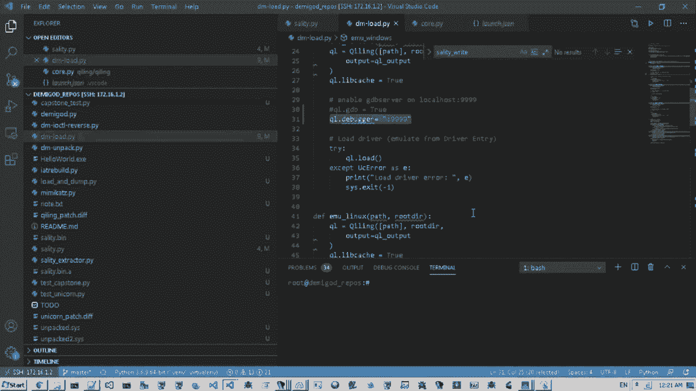

 And now I start to emulate driver。 There are driver objects， privacy， equal set， and user set data。

 When everything is done， the driver is ready。

 I use IDI roll to connect to the partner 999。 And after that， I can use IDI debugger。

 to J every instance。 (…sounds of car engine running)。

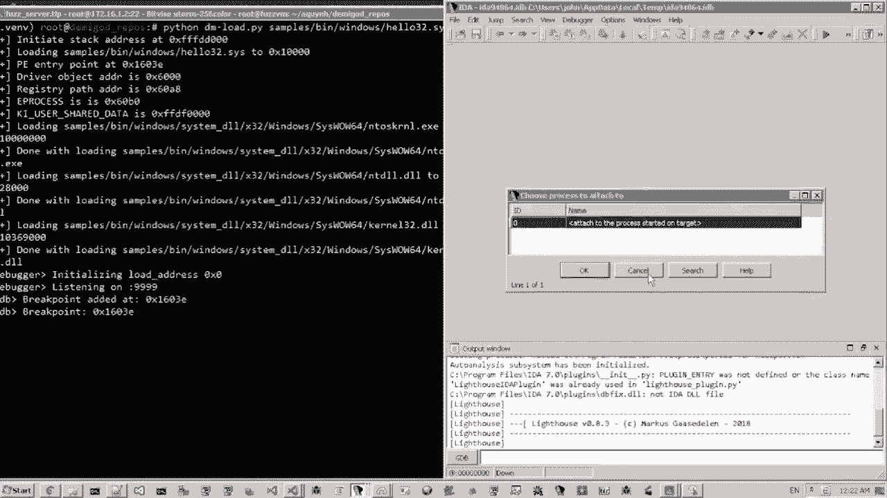

 (…sounds of skating)， (…sounds of skating)， (…sounds of skating)， (…。sounds of skating)。

 (…sounds of skating)， (…sounds of skating)， (…sounds of skating)， (…sounds of skating)。

 (…sounds of skating)， (…sounds of skating)， (…sounds of skating)， (…sounds of skating)。

 (…sounds of skating)， (…sounds of skating)， (…sounds of skating)， (…sounds of skating)。

 (…sounds of skating)， (…sounds of skating)， (…sounds of skating)， (…sounds of skating)。

 (…sounds of skating)， (…sounds of skating)， (…sounds of skating)， (…sounds of skating)。

 (…sounds of skating)， (…sounds of skating)， (…sounds of skating)， (…sounds of skating)。

 (…sounds of skating)， (…sounds of skating)， (…sounds of skating)， (…sounds of skating)。

 (…sounds of skating)， (…sounds of skating)， (…sounds of skating)， (…sounds of skating)。

 (…sounds of skating)， (…sounds of skating)， (…sounds of skating)， (…sounds of skating)。

 (…sounds of skating)， (…sounds of skating)， (…sounds of skating)， (…sounds of skating)。

 (…sounds of skating)， (…sounds of skating)， (…sounds of skating)， (…sounds of skating)。

 (…sounds of skating)。

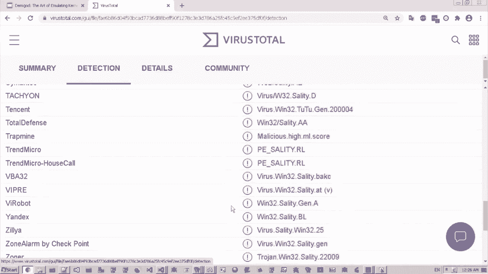

 (…sounds of skating)， (…sounds of skating)， (…sounds of skating)， (…sounds of skating)。

 (…sounds of skating)， (…sounds of skating)， (…sounds of skating)， (…sounds of skating)。

 (…sounds of skating)， (…sounds of skating)， (…sounds of skating)， (…sounds of skating)。

 (…sounds of skating)， (…sounds of skating)， (…sounds of skating)， (…sounds of skating)。

 (…sounds of skating)， (…sounds of skating)， (…sounds of skating)， (…sounds of skating)。

 (…sounds of skating)， (…sounds of skating)， (…sounds of skating)， (…sounds of skating)。

 (…sounds of skating)， (…sounds of skating)， (…sounds of skating)， (…sounds of skating)。

 (…sounds of skating)， (…sounds of skating)， (…sounds of skating)， (…sounds of skating)。

 (…sounds of skating)， (…sounds of skating)， (…sounds of skating)， (…sounds of skating)。

 (…sounds of skating)， (…sounds of skating)， (…sounds of skating)， (…sounds of skating)。

 (…sounds of skating)， (…sounds of skating)， (…sounds of skating)， (…sounds of skating)。

 (…sounds of skating)， (…sounds of skating)， (…sounds of skating)， (…sounds of skating)。

 (…sounds of skating)， (…sounds of skating)， (…sounds of skating)， (…sounds of skating)。

 (…sounds of skating)， (…sounds of skating)， (…sounds of skating)， (…sounds of skating)。

 (…sounds of skating)， (…sounds of skating)， (…sounds of skating)， (…sounds of skating)。

 (…sounds of skating)， (…sounds of skating)， (…sounds of skating)， (…sounds of skating)。

 (…sounds of skating)， (…sounds of skating)， (…sounds of skating)， (…sounds of skating)。

 And the rocket had to trap the first trap in block。 All A/V or anti-v-root relay connection。

 And the second one is 2K per cent。 I will separate by this trap to debug later。

 (…sounds of skating)， (…sounds of skating)， (…sounds of skating)， (…sounds of skating)。

 Side view will find anti-terminate per cent from user mode by using service。

 The grips of the table and send an array of events to the model。 (…sounds of skating)。

 (…sounds of skating)， (…sounds of skating)， (…sounds of skating)， (…sounds of skating)。

 (…sounds of skating)， (…sounds of skating)， (…sounds of skating)， (…sounds of skating)。

 Here you see the solid Q-output side with the number with our PID number。

 So， I will show you more about the demo。 I will talk about the demo。 Hello， I am done。

 I will talk about the mechanism of demo for macOS。

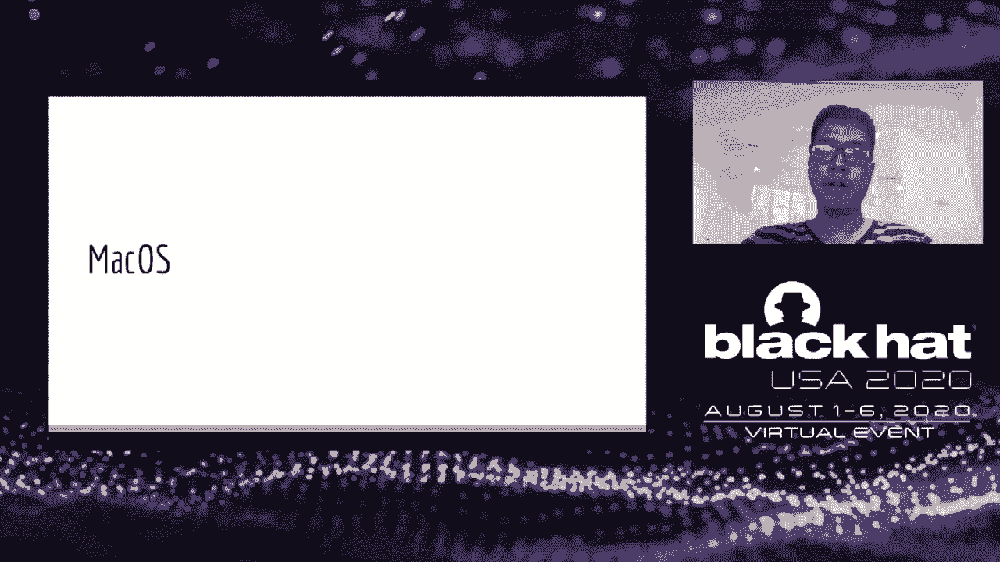

 The macOS kernel is officially known as XNU。 It is a hybrid kernel which is combined from a much kernel and a SSD kernel。

 It also brings a format of a much old executable file。 The kernel exposed its interface。

 As known as KPI， the let the user use its functionality。

 All of them are implemented inside the kernel code。 Like other OS。

 macOS needs drivers to control devices。 They are called as kernel extension or CX。

 The kernel extension is a bundle file and the kernel load it from external space。

 Some interesting information can be gathered from info。pls inside the bundle。

 Our goal is to emulate on-code pad from a roadkit in the CX。 So， in order to emulate driver。

 I decide to load both kernel and kernel extension together。

 Because the kernel is also much old executable binary as well as the main component of the CX。

 I can load all of the 764 to emulator and gene。 Now。

 I have implemented code of all KPIs from kernel。 Besides， like a normal application。

 I have to resolve local symbols and some other dynamic symbols of the CX。 However。

 the kernel release is KPIs through some dependencies。 So。

 it is necessary to create a jump code as a type in duration calling。 Next。

 a driver will run from its initial function。 And this entry address can be extracted from binary symbol。

 For IOK driver is that method and for generic driver is a address stored in real main symbol。

 Before emulating driver， I should initialize kernel environment。

 I set up MHC policy list by allocating new object in emulator and gene and fill that address in the target on kernel space。

 The same thing I will do for own prop symbol on kernel space。

 I also create some vnores and credentials。 Then， I run emulation for preprocess such as attack。

 prop or kmoot info。 Finally， I can go into the entry of driver。 Speaking about the instrumentation。

 I map own KPIs which was a spot from kernel to user-defined methods。

 It helps to simplify some features or we can pass through it and use native function。

 On the other hand， I also hope KPIs to disable multi-track functionality。

 And for some unrelated to host environment function。

 I give driver a chance to interact with a real machine。 For example。

 get a trivial list box is a function to retrieve every entry in the directory。 So。

 I just scan all the files and photos in the directory and pack them using VMS attribute pack function from the kernel。

 About the sys code emulation， I just file the sys and symbol on a lot of kernel space。

 assign the arguments to resistors and run the entry address。 In some cases。

 we want to call native KPI from a hook KPI。 Normally。

 we have to save the current state and run another emulator。

 but it may screw up in some complicated situations。 So。

 I construct a junk code and push its address to stack as a safe IP。

 This junk code has three main missions。 Prepare arguments to resistors or stack clear stack after cooling and jump to native KPI directly。

 Under the kernel， there are many events and combbacks need to be emulated。 So。

 I build an event management system to listen a resistor request from driver and embed the interaction from user。

 So， this will make macOS from asynchronous system to synchronous system。

 I use EMS for system CTL event and KE event， some network filter。

 MHC-positive combbacks and K-out features。 So， in order to show how our tool works。

 I will use demi-code to analyze one of the famous rocket on macOS ruble in。

 It was released for disclosure in 2012。 It can give root to a running process， high fire or folder。

 etc。 Also， it couldn't run on modern kernel due to some reason， such as memory arrangement。

 KPI change with only system table。 So， to upgrade this rocket。

 I use safe IP from initial function and step back to find kernel base。 Then。

 I scan all the memories to find the sequence of Cisco handler to determine the Cisco table。

 Moreover， I modify the CR0 resistor to override entries in Cisco table。

 So， here is the demo for running rootkit on the real machine。

 First， I load the driver and run an agent on user space。 From this UI。

 I can commence the ruble in easily， like a high running process。 High fire in current directory。

 Even remote code execution through an ICMP packet。 Here， I will start the calculator application。

 To emulate ruble in， I load it and run its initial function。 Then。

 it will automatically resist some callbacks to my EMS。

 I also use some default objects like a network， CCTR arguments and fake processes。 Here is the demo。

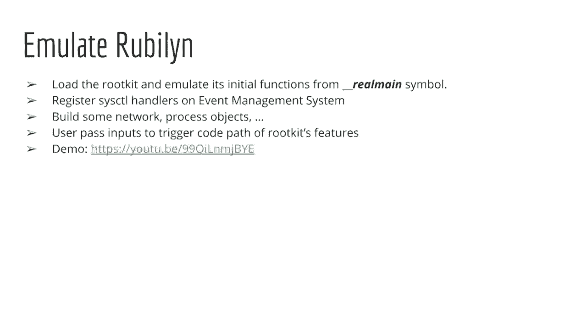

 Now， user can pass his input to some rootkit features， like a ground root permission to a process。

 High a process。 High a file whose name is to do and call an OS application。 Then。

 I can trigger the back door through pin command。

 Especially， we can also debug this rootkit by enabling GDB feature of a demigod。

 This video will demonstrate the debugger。

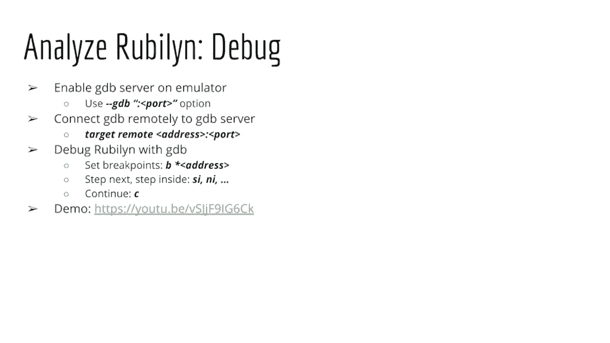

 First， I will disable all the instructions that the rootkit has went through to get address。 Then。

 I start the GDB server and connect to it from GDB client。

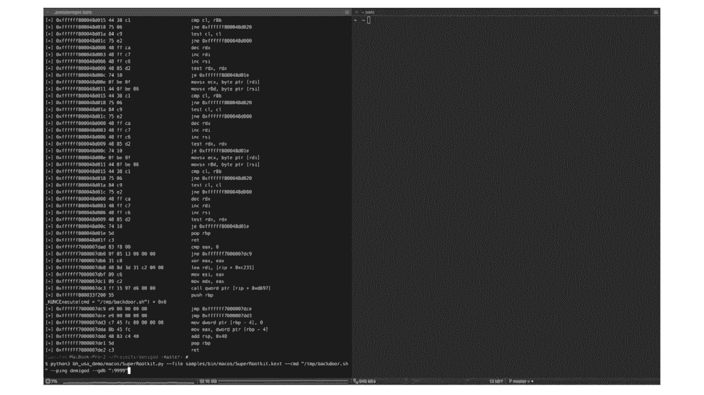

 Now， I can step in。 Set a breakpoint。 Continue。

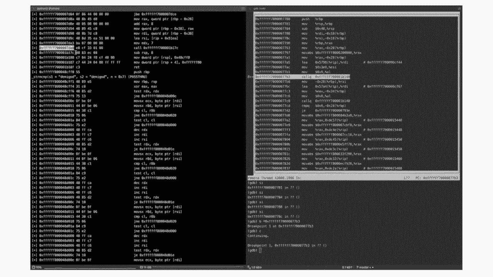

 Done register。 Continue。 Next。

 meet a queen。 In this session， I introduce how the network supports Linux。

 We can analyze the Linux kernel inside the network。

 Linux is a very complex system with many subsystems。 For the demigod。

 we only look at some relevant subsystems that are enough to make the rootkit。

 The first one is system code。 This system can play very important role to provide services。

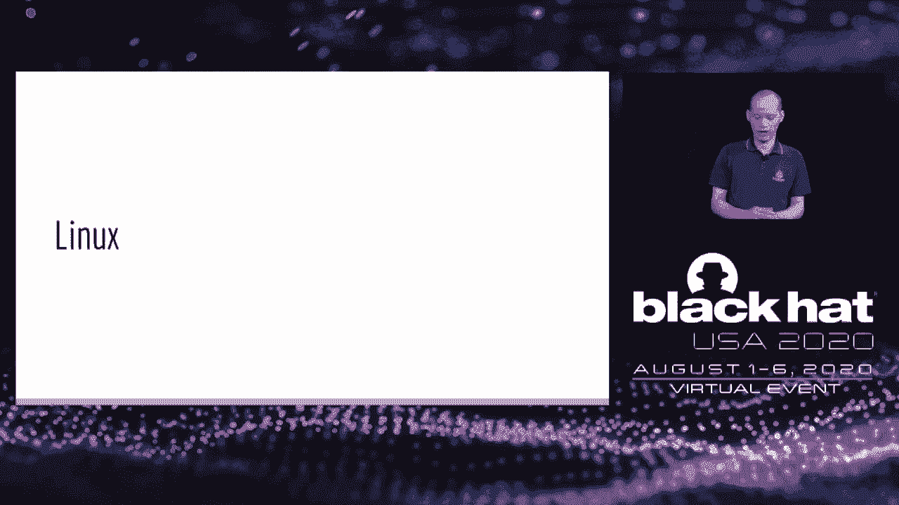

 Many kernel root keys provide its own functionalities。

 We also care about the IO control system code because the kernel root key can provide some functionality to the user land via this system code。

 Also， some other code bytes that can indirectly trigger by the user land that we also need to emulate the first upon five operations。

 Because kernel root key in Linux is built in the Linux kernel in 。co format。

 we need to support the 。co format， which is a 。co format， but a bit different from the user land。

 The goal is that we try to emulate kernel root key in 。co files。 For the load of demigod for the 。

co files， we need to view our own load， which is quite different from the load of chilling。

 We need to pass on the section of ef files and map the own session into the emulator memory。

 And demigod also needs to resolve on the external APIs so we can provide our own implementation in the emulator。

 And finally， we need to relocate the external function and simple data。

 The next thing demigod had to do is that we need to set up the CPA context so the kernel root key can function properly。

 And one of them is that we need to set up a 。js segment for current task because many kernel root key try to access to the current task。

 And they need 。js segment for this。 We also need to initialize system， system-contable。

 Linux kernel。 So the kernel root key can access， can read， can try to the system-contable。

 So for this part， we had to write the rest of our own system-contable into the system-contable。

 And we had to hope the system goes。 So when the root key access to the system-cont。

 we can execute our own system-cont implementation。 Finally， for the loader。

 we had to locate the initialized function of the 。co file， which is a init module symbol。

 To support Linux kernel root keys， we had to emulate many Linux structures like task chuck for the Israelan task file operation。

 Because the root key can modify the vibration。 So it can trigger the comeback to the vibration like read。

 write， open and close。 We had to support the module structures because the kernel root key can access to the list of modules inside the system。

 and modify something like a chip on the try to hide some kernel modules。

 So they had to write and write to the list of the modules and we had to support the ratio。

 The few other structures we had to support like user namespace。

 So the kernel root key can modify the user credential。

 We had to support five structures because kernel root key can modify the five structures。

 And some other structures like Linux， T-RAN。 So this is necessary because some kernel root can try to modify and hide some data。

 Okay， so we did not have to emulate the 。co file initialization。

 And because when the kernel root key， when the hacker loads the kernel root key into the system。

 they can specify some optional arguments。 So for the demi-gato work properly。

 we have to do the same thing。 So we also need to support option arguments for the 。co file。

 And okay， this file is a need to specify the input for the init module entries。 And after that。

 demi-gato can start to emulate from the init module symbols。 Okay。

 we had to hope many Linux kernel APIs for the root key to work properly。

 And here I list some of the most important APIs inside Linux kernel。

 So here's some API for function isolation for memory access。 For memory management。

 for device management， and some system cons， we have to hope and we need to emulate some system con- system con- as well。

 Okay， once we can extract all the code path we care about during the kernel root key in it file。

 we can emulate them。 So first of all， you can do the init file。

 Demi-gato can extract the system con because kernel root can override some system con- so we need to get the mail。

 And also we need to get all the codebacks that can be register by the kernel root keys。

 And after that， we need to trigger the code path。 The code path that is the one to emulate。 So。

 as this file is a child， is a can decide the input requirements for the code path that they decide to emulate。

 And here， here are some of the most popular code path that kernel root can set up and need to specify the input for all those code paths if you want to emulate them。

 Okay， next I have a little demo for Linux。 So you can see how we can use demi-gato analyze kernel root key in Linux。

 And in this case， it looks at the kernel root key name Mohamad。

 And this one is a very typical kernel root key with many typical behaviors。 First of all。

 Mohamad root key can try to hide kernel modems。 It can hide files。 It can hide network paths。

 It can run root access to current process。 And this root key actually overrides many system cons。

 And it can also interface it either via some customized files in /proq file system。

 And actually you can find the source code of this kernel root key on GitHub。 So in this demo。

 we try to emulate this kernel root key。 And to do that。

 demi-gato will load the root key into the memory， initialize it。

 And we try to extract the new system code made by the root key for the root key for the root key。

 And in the demo， we emulate this root key with some selected input。

 And we chase all the activities of this root key with a difficult idea。

 So here I have the video doing more。 Okay。 So here you can see that I have a kernel root key in the find name root key。

co。 And demi-gato is going to emulate this root key。co file。

 So you can see that on the screen you have two windows。

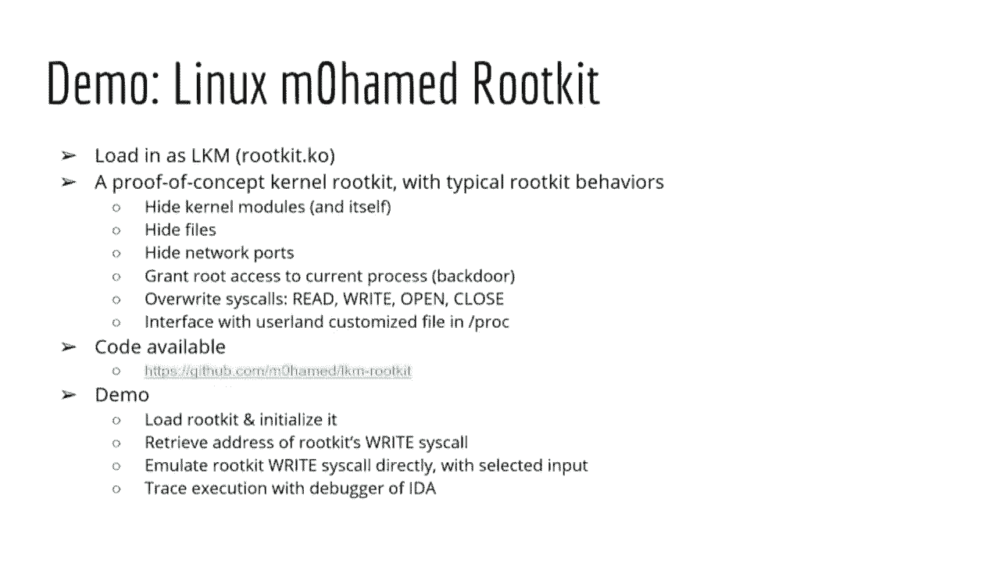

 The console on the left side in which demi-gato will emulate the kernel root key。 On the right side。

 you run idea pro。 And idea pro will be used as a debugger。

 And we connect this debugger to the kernel root key running on the left side on the console。 Okay。

 So here you can see that on the left side， when I run the kernel root key in the demi-gato emulator。

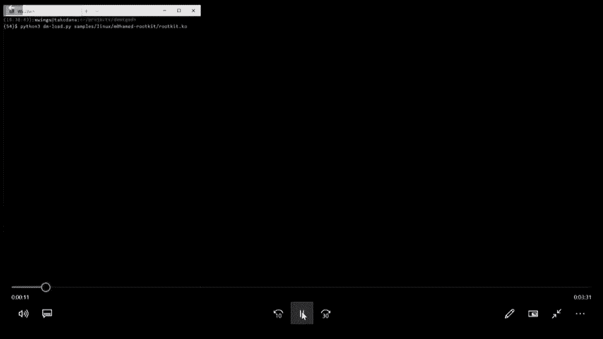

 the root key will stop and it will open a gdb interface at the local host address at the port 9999。

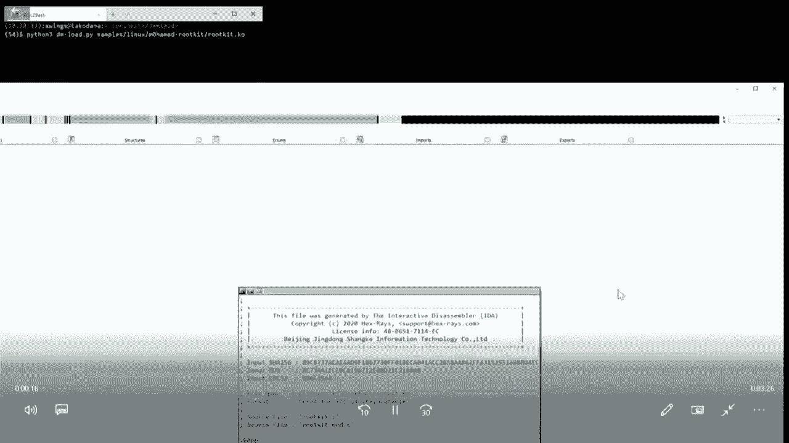

 And it is going to wait for the debugger to connect to。 So we run the idea pro。

 the debugger on the right side。 And we set up the idea pro to connect to local host at the port 9999。

 Okay， see here you can see that I try to attach idea pro to the gdb debugger inside the emulator on the left side。

 Okay。 You can see here that once we connect the debugger。

 idea pro will set input a break-point as the initial， live function of the kernel root key。

 And you can see that in the idea pro window， you can see the code of the debugger， it's。

 the code of the root key。 So now I will set a break-bar on the first instruction。

 which is a code instruction。 And you can see that we can use the debugger live-norm on the debugger instruction with the user end code。

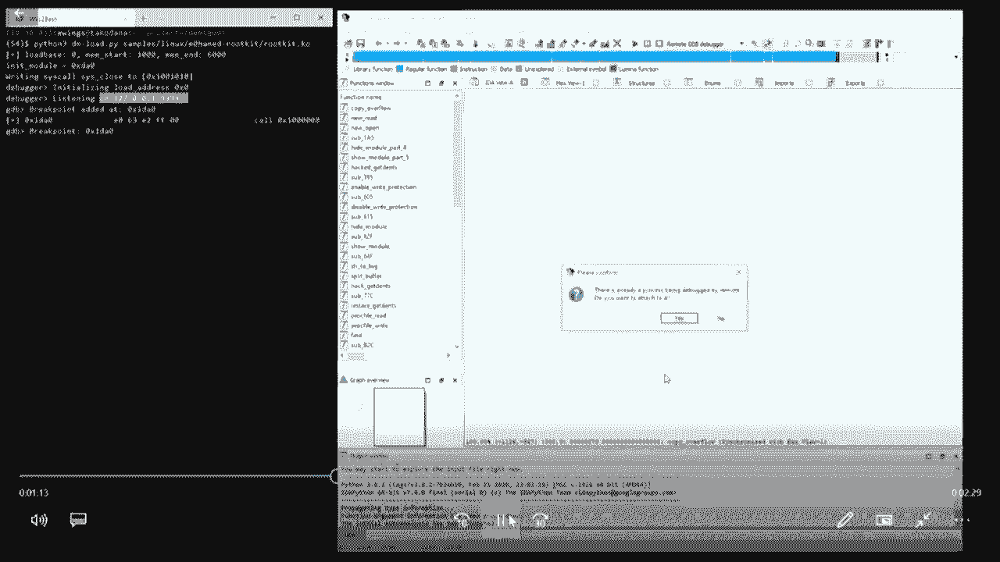

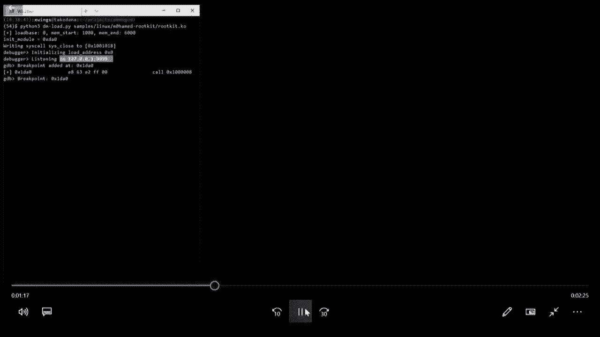

 But you can see that you can debug kernel code。 So here on the right side， I do some single step。

 And on the left side， you see that the kernel actually runs。 And you can compare the left side。

 the right side is actually the same thing。 The same instruction we executed。

 But you can see the difference is that on the right side， as this， or as， in the idea pro。

 you can only see the code， some unknown function。 But on the left side。

 because we actually emulate the kernel root key， you can see that this code actually is a pin-kai function。

 And as this plays， actually the kernel root key print out the message， which is modal-starting。

 So you see that on the right side， the idea pro doesn't see much， but on the left side。

 because we actually emulate the kernel， you can see a lot more information。

 So I continue to single step inside the debugger。 So you can see how the kernel root key executes。

 So here on the right side， I do a pro doesn't see much， but on the left side。

 you see many more information。 Life worship only see here that you can see on the left side that based on some message。

 You can see the root key already initialized some pro-5 system。 Okay。

 here you can see that the initial life phase of the root key is already done。

 And idea pro doesn't see much， but then we got can see that this root key modified for system codes。

 root， right， open and closed。 So the next phase that we decide that we want to explore the raw system code made by the root key to see what this one does。

 So we just continue to chase in the debugger。 So on the left side， actually for the demi-r-to-ok。

 we specify some special input for the raw system code。 And here you can see that on the left side。

 you can see that the root key already makes the current process root。

 And after this raw system code finish， the current process becomes root。

 Just what the root key does。 Okay， just how the root key works and you can see that very clearly inside the demo。

 Okay， so actually you can see that demi-r-to-ok can emulate the kernel root keys。

 But more than that you can view many more application on the demi-r framework。

 So you can debug kernel root keys inside the entry， like what I already showed。

 You can view auto and hacker for current code。 So in that you can chase code inside the kernel root key to detect the time the code is unpacked。

 Then you dump and you can also review the binaries。

 You can view IO-Canchone analyzer so you can automatically discover on the IO-Canchone code with different input。

 And you can actually check the code back-step IO-Canchone code。

 You can also view the auto-submarise root key behavior to produce high level repost。

 So this idea is that you can view， you can automatically discover different root key paths。

 with different random inputs。 And after that you can view the summarized report for the own behaviors you can see when the root key。

 is executed。 And the idea is that it's quite easy to do that because they've got enabled save execution on check-piles。

 You can text snapshot and reverse。 And there are many。

 many other exciting ideas that I would think for you to explore。 So。

 I'm figuring the status and future works for the Amigod。 The Amigod now already supported Windows。

 Mac OS and Linux kernel root keys。 But just still a lot more work in the future。

 We still need to test and to improve the Amigod to support more root keys。

 So we need to handle more kernel APIs， more system codes， more kernel subsystem。

 Maybe you can look forward to supporting more platforms beside Windows， Mac OS and Linux。

 kernel like iOS or Android。 And we plan to merge the Amigod into the cheating emulator very soon。

 Here come my conclusion。 The Amigod is a framework to emulate the kernel root keys。

 So we can analyze range zero code from ring tree in safety box of the emulator。 So you can monitor。

 you can chase， you can debug and you can do own cap dynamic analysis with Amigod。

 The Amigod was built on top of the excellent cheating emulator。 So we support multi-platforms。

 multi-acadatures。 The Amigod enables advanced binary analysis on top of the kernel code。

 And they allow you to use Python language to build your analysis tools。

 And it supports many cavering computations。 So we can easily analyze kernel root keys。

 run the inside Amigod。 So we plan to release the full source code of Amigod variation。

 And we plan to merge Amigod into the cheating emulator very soon。 Okay， now Q and A session。

 [ Pause ]。