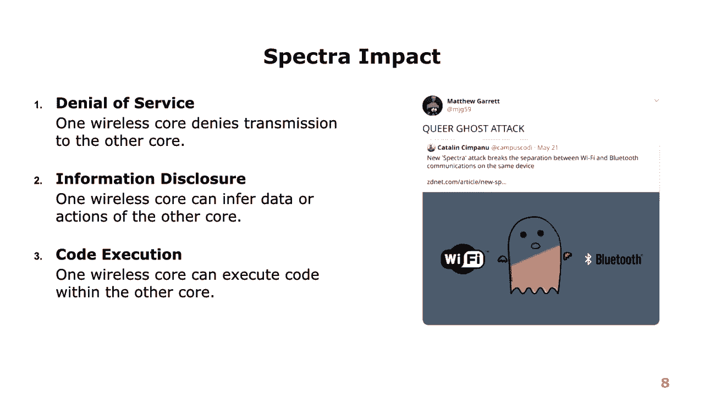
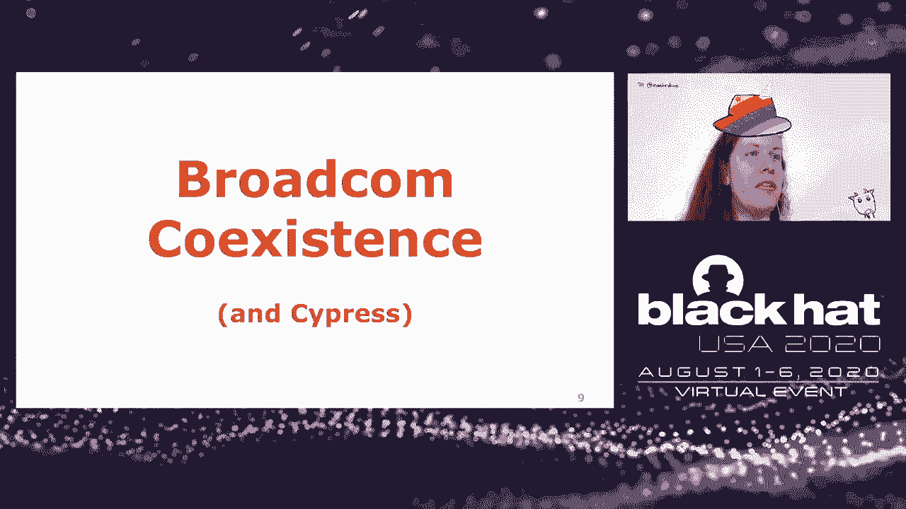
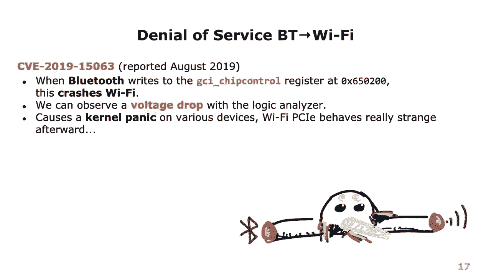
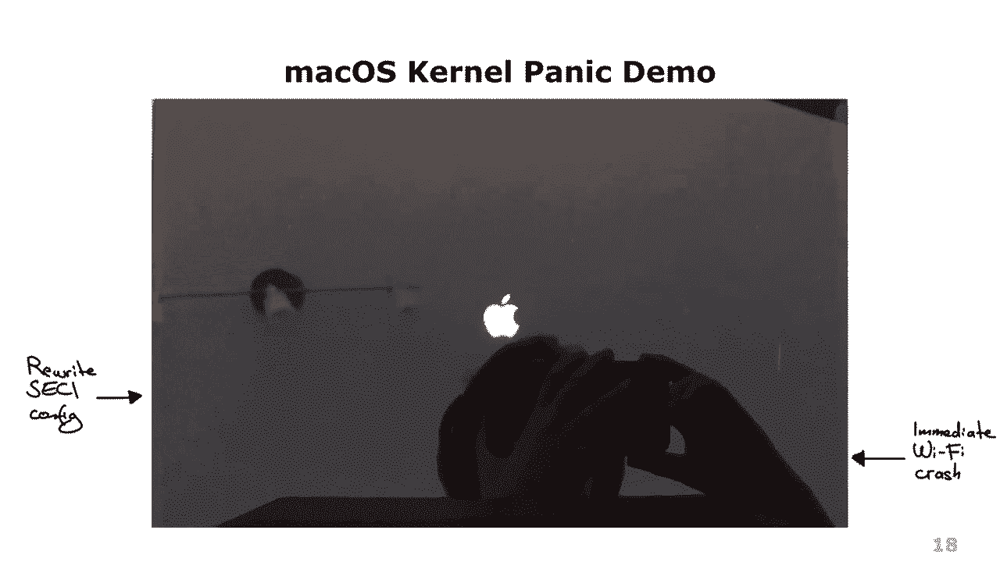
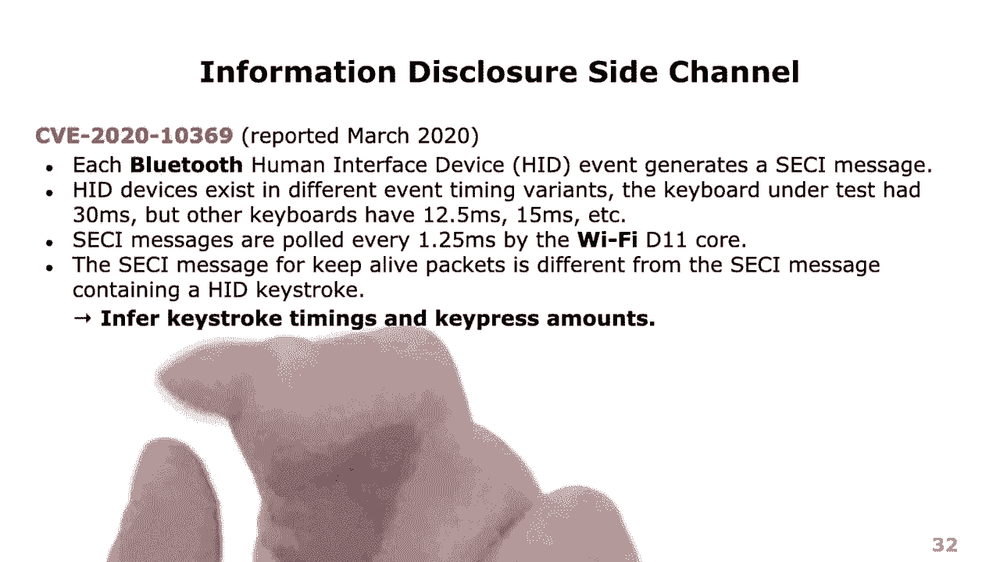
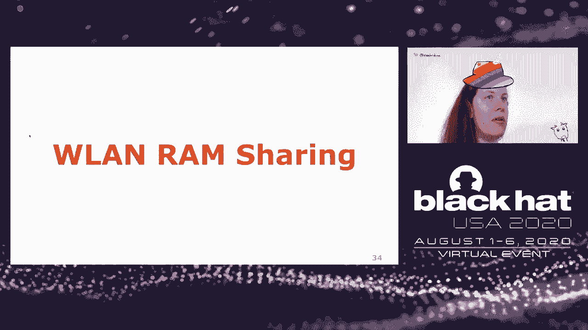
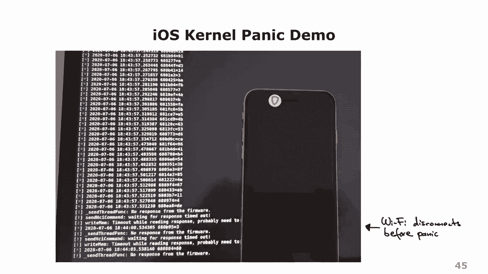
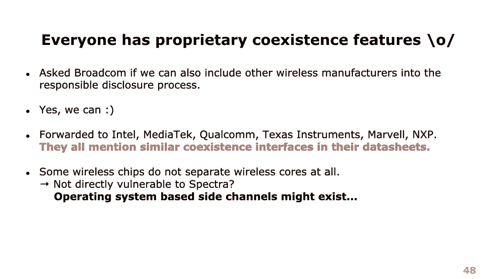
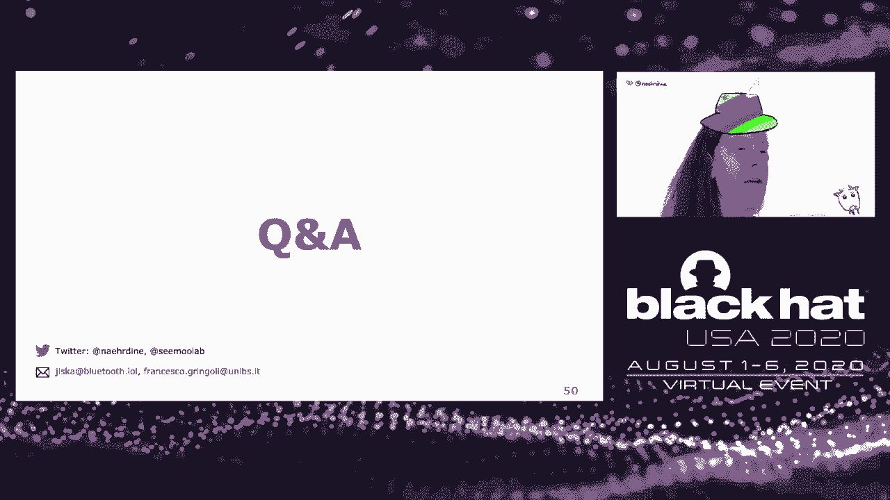

# P58：59 - Spectra - Breaking Separation Between Wireless Chips - 坤坤武特 - BV1g5411K7fe

 Hello everyone and welcome to OITalk Spectra， cracking separation between wireless chips。

 So this is a topic I've been working on together with Francesco and Francesco is an。

 expert for Wi-Fi and other wireless technologies while I have been working on mainly with Bluetooth。

 And in this talk we bring our abilities together and practice separation between different wireless。

 chips。 Let me first start with a motivation。 So a while ago I found a partial RCE within a broad comprutive chip and then later on a。

 student of mine， Jan， built Frank Nstein and with this he actually found even more full。

 RCEs within broad comprutive chips。 And now this is a cool thing and I said like， "Hey。

 let me take my unicorn and tour the， world and tell everyone like， 'Yeah。

 we have Bluetooth RCE and Bluetooth is insecure and， so on。'， And then people said like， 'Yeah。

 but you know Bluetooth， it's like 22 years of expensive。

 iterative development and it's indistinguishable from magic anyway and yeah， we know it's insecure。

 We live with that。'， And actually because of this we try to sandbox Bluetooth as much as possible。

 You know it's actually just connected with UI， it's not using PCI Express and also can。

 you pop kayak with a Bluetooth RCE？ So yeah， people said like， 'You know。

 you have the Bluetooth RCE but what would be really， cool is if you had a Wi-Fi RCE。

 And now one option would be of course to port the fuzzer and everything that we have to。

 Wi-Fi and do the same thing again。 But actually， Wi-Fi RCEs have been found in the past with different technologies and。

 so on。 So it would not have been something new and also a bit boring。 And then I thought like。

 'Yeah， maybe there's another thing that we can do which is actually， breaking the chip separation。'。

 So saying I have a Bluetooth RCE， can I attack Wi-Fi or even LTE instead of going all the。

 way up to the operating system？ And so I called Francesco and said like， 'Yeah， you know。

 let's build something called Speculator， Transmission。'， And so this was the initial attack。

 'Name or idea' because Wi-Fi， Bluetooth and LTE， they， all share frequencies in the 2。

4 gigahertz spectrum even if they don't share the same frequency。

 they still have harmonics that interfere and so on。

 And everything like in a modern smartphone is really built to this form factor and because。

 of this you somehow need to arbitrate channel access。 Well。

 and this is actually a performance optimization so because they share the spectrum during the。

 transmission， they somehow need to tell each other， 'I'm now using this and that frequency。

 I'm now sending a packet because they cannot do it at once without causing interference。'。

 And this is also called coexistence mechanism and the idea was to use this for a side channel。

 for example， to speculatively transmit a packet in Wi-Fi or Bluetooth and then tell what the。

 other one is doing。 It got a bit broader in the end so I would more call it like a spectrum transmission by。

 now but yeah， whatever。 The attack model overall is that an attacker has code execution which we have in Bluetooth。

 in this case with the technologies that we used to find vulnerabilities and now then with。

 this prerequisite somehow attack the other wireless cores。

 And while this is a pretty strong prerequisite it also is a strong attack primitive overall。

 because these chips have hard-valued connections and these connections can be used without passing。

 any checks by the operating system。 So to show you this here is an example for a modern iPhone。

 There you have the Bluetooth chip running and the Wi-Fi chip running and they run on。

 separate ARM cores so one is a Cortex M3 or M4 and the other one is a Cortex R4 for example。

 And they have this interface here， the serial enhanced coexistence interface which is a high。

 wired connection between the two and then between this Bluetooth Wi-Fi combo chip there。

 is also another connection to the RT chip which is MWS mobile wireless standards。

 And now we get some new attack paths on this。 So for example an attacker could start here at the Bluetooth core and then escalate from。

 the RC that is there like to the Wi-Fi core and then go all the way up and have the traditional。

 attack that we know like going into the operating system or we could also have apps that now。

 know that timings between the Bluetooth and Wi-Fi frames are somehow hard by it and not。

 random and maybe they can also use this hardwired timing to like escalate something here in between。

 and infer some information。 The impact can be varying a lot depending on the chip and the implementation of coexistence。

 so the obvious one is the line of service so that you say I have to transmit and block。

 the others or some information disclosure by this meta information about the packets。

 that you are going to send which could also be in the timing of the packet sent on and。

 maybe if the implementation is really screwed up an attacker might gain code execution。

 Now the attack name is a bit let's say complicated because it's hard to find on the internet as。

 Bactra is already a word and so you might also stick to this alternate name which is。

 the clear ghost attack whatever go for whatever name you prefer。

 And now let's try to exploit all of this。 So there is the Broadcom coexistence interface and actually the same coexistence interface。

 is used by Cypress because they acquired parts of Broadcom in 2016 and they used the。

 same code the same hardware so I might use those terms similarly。

 We really like Broadcom because they don't do any firmware check that means they don't。

 have secure boot or something you can just modify the firmware I mean just modify it's。

 still a thing because well the hardware itself well it's easy to get but then the firmware。

 you need to load it into IDA you don't have symbols and so on so it's still a complicated。

 thing but you don't have to bypass other security mechanisms。

 And well these chips are used in so many devices like really all iPhones all Macbooks， iMacs。

 and also the older Apple watches the newest Apple watches has a different chip。

 In Samsung Galaxy S series not series and so on in Europe also the older Google Nexus。

 phones all Raspberry Pi's a lot of IoT devices so there are many devices to pick from that。

 can now be used to test certain attacks for prototyping。

 And now the coexistence idea is that we escalate within the chip components and here you can。

 see a data sheet of a chip that's used in the Google Nexus 5。

 The reason why it took such an old data sheet is that the newer data sheets are often not。

 available or not as extensive because they are still like closed under NDA and so on but。

 Cyprus actually published a lot of data sheets of the older chips and they are now openly。

 available and you can look a few things up there。 So what you can see is in this detailed view like there's an uncoated XM3 there's the other。

 uncoated XR4 and in between there's a lot going on which we exploit in the following and。

 then there's also this shared antenna and it's shared for 2。4 and 5。 So this is our attack surface。

 If you look for data sheets that somehow mention the product what you can see here is one data。

 sheet about coexistence and it's by Cyprus and they state collaborative coexistence between。

 WLAN and Bluetooth is implemented according to IEEE 802。15 to packet arbitration。

 That's a scheme that defines different traffic priorities。

 So Wi-Fi acknowledgment has a high priority or SCO which is used for speech and Bluetooth。

 has a high priority and that's an old one。 So many chips use it。

 It's not a thing that Cyprus first thought of but then Cyprus continues with and through。

 Cyprus enhanced coexistence interface ECI。 It's the I-Ocman's PTA by signaling by enabling a change of additional information required。

 for implementing more advanced collaborative coexistence methods as a result overall quality。

 for simultaneous voice video and data transmission on an embedded system is achieved。

 And this is an important point because you cannot simply disable coexistence as is like。

 to ensure more security。 So if you disable coexistence you are no longer able to stream a video of a Wi-Fi and listen。

 to it with your Bluetooth headset so each of them like get stuck through the stream stops。

 and then the Bluetooth sound stops and so on。 So you cannot just disable coexistence。

 And now let's look into the serial enhanced coexistence interface。

 It's sometimes with the S for the serial sometimes without and then there's also the。

 GCI which probably means global coexistence interface or generic coexistence interface。

 and many other terms but they are like used in the same way。 So they all mean the same thing。

 So the serial enhanced coexistence interface that's used between the Bluetooth and the Wi-Fi。

 chip and now when we want to exclude any side effects for example by shared antennas we。

 really use those two separate boards， connect them with the serial interface and the nice。

 thing now is that we don't have any side effects and we can still observe everything。

 that's going on on this interface。 So we don't need this for the attacks later on but initially to understand what is going。

 on in the enhanced coexistence interface it really helps to look into it with logic and， the nicer。

 And if you look now into it in detail what you can see is first of all yeah well here。

 the first example has Bluetooth music stream and you can see it's sending a lot of data。

 and it's sending this data with 3 megabowt which is the same rate that it's using to send。

 data of the actual music stream to the host。 So this is a very high data rate。

 And at the same data rate Wi-Fi when you for example like scan for Wi-Fi indicates I'm。

 starting a scan then there are the scan results that are reported and then later on the end。

 of the scan。 And in the same way if you zoom in now you can see that there is data so you have these。

 bytes， these additional bytes that are sent here and there so there's something encoded。

 The last example is a different example so in this one I connected this tiny Bluetooth。

 keyboard and then you can see that there's a regular pattern every 30 milliseconds of， sending data。

 The first attack doesn't even need all this knowledge here but what it does is it reconfigures。

 this interface。 So there are configuration registers and initially I tried to find everything out like about。

 each and every register and reverse engineer all the functions but then Francesco said like。

 yeah you know just if you don't understand it first write garbage and see what happens。

 So I wrote garbage and saw what happened and well there is a register it's called GCI。

 control and it's at the GCI offset 200。 It might also be at 400 or 600 it depends on a bit on the chip and if you write just。

 FF to it that's it then it crashes Wi-Fi。 And in this setup with the logic analyzer you can even see a voltage drop on the sec。

 e-line and sometimes to recover Wi-Fi you need to reboot a device multiple times not。

 just once it's a bit strange at least what I observed and well it causes a kernel panic。

 quite often because Wi-Fi behaves so strange that it starts like spamming PCI express and。

 like if the device is not rebooting just the chip is crashing then the chip crash lock。

 still contains a lot of invalid characters and stuff so it really screws stuff up。

 Here is the demo of it it's a bit accelerated because it actually takes a minute on the left。

 hand side you can see that I write to the register at offset 400 and at the right hand。

 side you can see how Wi-Fi stops working immediately so the ping stops and then a bit。

 later it reboots and this is on an up-to-date macOS Catalina with a chip that was in the。

 2019-2020 models。 And you can see that many devices are affected of this so we reported this like a year ago。

 and it's still unfixed in most devices or most drivers so I don't even know if it's。

 like fixable on all of them and yeah I mean it's just in our service but it's a very nice。

 attack and very easy to test and the only thing that they fixed is like that now you。

 can no longer write over HCI to this register but probably remote code execution would still。

 be possible to write to those registers and because this was a very promising start with。

 all this coexistence stuff Francesco started to look a bit more on to the Wi-Fi side so。

 how the D11 core is actually parsing all of this so with this I'm handing over to Francesco。

 Francesco for introducing this part of the talk let's start describing the Wi-Fi chip。

 asset developed by Broadcom we see here it evolved within the last two decades from a。

 softmark to a full-mark implementation。 Operations previously performed on the Linux host at the top are offloaded today by an。

 intermediate arm core。 Interestingly real-time operations are still managed by the same low-level piece of hardware。

 that did not change much in 17 years。 The matter it is an 11b card from 2003 or a state of the R11AX chipset time critical。

 operations are managed by the same D11 microcontroller that coordinates all these small blocks like。

 PHY， radio frequency and DMA。 While they claim they switched to full-mark to handle high throughput features more efficiently。

 this switch also allowed the manufacturer to better hide driver internals inside the ARM。

 binary code。 Let's have a closer look to the low level。

 Here the D11 microcontroller runs a microcode that is a short piece of software made of 8。

 byte instructions dedicated to manipulating bits and testing hardware conditions。

 This is some code from the main loop that checks if the PHY started receiving a preamble。

 use a full-form analyzing a packet while buying a receive or if the current reception。

 is terminated for deciding whether or not to push the frame to the upper layers。

 This one is extracted from the code that schedules the transmission of an acknowledgement。

 We see the preparation of the reply frame that starts with before as usual。

 The toolchain for the new code was created by Michael Bewetch in 2007 and we incorporated。

 it inside our next-on project and we periodically updated by adding instructions when a chipset。

 is introduced if it comes with new specialized instructions。

 As spotting the new code in the ARM binary blob is easy we can modify it adding customized。

 parts as we will see later。 The D11 CPU coordinates several blocks。

 First of all it controls the transmission and reception engines， it manages channel access。

 by scheduling transmissions and decides which receive frames should be pushed to the ARM， code。

 It can configure the PHY and the radio and it does so by running the U code that is loaded。

 to U code memory by the ARM firmware at every initialization。

 The D11 has access to limited memory called shared memory up to 8 kilobytes where it keeps。

 its configuration and its state variables。 The D11 can also access indirectly the ARM memory where packets ready for transmission are。

 queued so that it decides which packets can be transmitted or aggregated。

 The D11 is equipped with several general purpose timers that can be used in modern platforms。

 for measuring time of light。 And with many different interfaces for talking to other parts of the chips at like the sake。

 interface。 During the years it turned out to be a pretty flexible architecture。

 We demonstrated the frequency hopping， time division multiplexing， LTE coexistence and so。

 on and so forth。 In general we use a data-to-research platform for anticipating features that were lately。

 added by the manufacturer on its own。 Let's now talk about the D11 coexistence interface。

 There are quite a number of registers dedicated to this interface。

 There is a 64-bit buffer that U code calls every 1。25ms， that is the minimum Bluetooth。

 connection interval， for checking whether new messages came from Bluetooth。

 Such messages include timing indications from Bluetooth that test Wi-Fi。 Hey。

 I'm doing something for this amount of time and I also include a type of event which。

 we use it for our attacks。 There are countdown timers where U code copies the timing received from Bluetooth for the。

 fairing Wi-Fi operations。 And there is a Bluetooth transmission control register in red that is used by Wi-Fi for。

 telling Bluetooth。 Hey， stop， I take control of the channel wait until I grant you access again。

 We also use a V-s register for our attacks。 According to our analysis。

 12% of the U code is dedicated to coexistence and we refer here， to the 43909B0 chipset by Cyprus。

 It's amazing because U code is doing so many other things which much less code like packet。

 aggregation。 Probably coexistence takes a lot of room because of its complexity。

 With the help of an external FPGA， we measure the jitter of the Wi-Fi to Bluetooth sake line。

 We modify the U code in a couple of boards and we program them to transmit sake messages。

 when receiving the same beacons。 Jitter tired out of the Gaussian with a 200 nanosecond deviation which makes it perfect。

 for Bluetooth coexistence。 So what about grant-reject scheme？

 For studying the sake protocol we focused at first on the grant-reject counters that are。

 kept by the Bluetooth firmware and that we can collect by using the vendor specific HCI， command。

 Every time the Bluetooth has something to transmit it checks the last grant indication。

 received from the Wi-Fi and if access is granted then Bluetooth transmits and increases the。

 grant counter。 Otherwise it increases the reject counter。

 In this scenario we are watching a movie that we download over Wi-Fi， listening audio over。

 Bluetooth headset。 At the beginning we see both grant and reject counters are increasing almost linearly。

 When we post a video the two counters freeze， this is expected because even if Wi-Fi keeps。

 downloading the movie Bluetooth is no more transmitting sound to the headset。

 When we restart playing the video counters are a start increasing。

 When the video download is interrupted by disconnecting from Wi-Fi we have no more rejects but。

 grants keep increasing because the movie is still being played。

 To prove that Wi-Fi can really hard Bluetooth and take control of the wireless channel in。

 a selfish manner we added to U-code a few lines that check if a magic UDP killer packet。

 is received。 When that happens the U-code stop transmitting grant messages to Bluetooth。

 You see this happens at 2。6 seconds when there are no more messages in the green diagram。

 From there on we cannot hear sound from headset that means Bluetooth keeps being rejected。

 And we also found that if the force at the pose is short then audio starts immediately。

 when we transmit the magic UDP bring to life packet otherwise Bluetooth needs to reconnect。

 the headset。 We tested this both on a NACHUS 5 and on development boards from Cyprus。

 This experiment clearly demonstrates that a denial of service attack from the Wi-Fi side。

 against Bluetooth is really possible。 Let's take a closer look now at the messages that Bluetooth sends to Wi-Fi and we frequent。

 use such information for an attack。 These are the psychic time diagrams when we have a keyboard connected over Bluetooth。

 Depending on the keyboard we can observe a sake messages transmitted every 15 or 30 milliseconds。

 Bluetooth sends these sake messages to inform Wi-Fi that it is going to pull the keyboard。

 so that Wi-Fi the first channel access means why。 In this diagram Wi-Fi is idle so there are no reject messages from Wi-Fi。

 This is what happens when somebody is actually typing on the keyboard。

 At the bottom we have the periodic sequence of sake messages we saw before。

 One pulled every 30 minutes second。 On top we have the key presses sneezed by wires shut when capturing from the Bluetooth。

 interface。 As we are typing with moderate speed each key press is separate from the others and we can。

 also see the Bluetooth message with clearly is following each key press。

 In between we can see the HID data captured by wire shark with the specific event ID that。

 represents a key press。 Below we see the second messages that we filter at the Wi-Fi chipset by selecting the same。

 message type。 This demonstrates that at the Wi-Fi side we can easily distinguish sake messages related。

 to key presses。 So the bottom line is that this clearly demonstrates that having access to the Wi-Fi chips is enough。

 for measuring key press timings with very accurate resolution。

 And we know that in some cases with the help of some artificial intelligence or classification。

 technique this is enough for guessing what a user is typing。

 We hence believe that without any further protection the sake interface can be used for。

 mounting side-channel attacks and we request the CV for reporting the associative vulnerability。

 So this category is yours again。 So as Francesco has shown it is possible to attack Bluetooth via Wi-Fi with some very。

 simple coexistence mechanisms that might be present in many other coexistence protocols。

 and just considering something like packet timing。 However。

 there is one thing in the data sheet called WLAN run sharing which we still didn't。

 talk about。 And I would call it the effect of when you spend too much time looking for side channels。

 like you dig everywhere like here and there and there and there but then you miss the one。

 big thing which is the WLAN run sharing。 So it is actually here so you can see like somewhere between Bluetooth and Wi-Fi there。

 is this connection and there are actually two errors for whatever reason and they only。

 go in one direction for another reason。 And well it's a bit weird and there is nothing else written than this。

 So I was like okay I want to find it。 Where is it？ Where is this shared run？ So where is it？

 Well then I started looking in the Wi-studio and the Wi-studio has like a few symbols for。

 the cypress boards that also include registers and nothing called WLAN， Wi-Fi whatever also。

 not and e-coexistence registers everything。 But then in the studio there is also one combo chip which is actually in a MacBook Pro as。

 well and this one has slightly different symbols so I didn't look into this one at first and。

 it has a couple of functions that are called WLAN buff something sometimes with one F sometimes。

 with two F so very consistent and then there is one function that actually is writing some。

 stuff into a register in an area starting here a bit higher 68000 and then it's writing。

 a word called "Caffybabe Hacks" and then afterward it reads and so on like doing this。

 in a certain manner。 If you don't do it exactly this way but just random so to say sometimes the Bluetooth crashes。

 while doing this but overall you can see some data so I had like the impression I might。

 be in as soon as I was seeing something called 80211 something in the strings that I got from。

 this area but that was on the Samsung Galaxy S8 and then I was like okay can I get it working。

 on more devices and so on so I continue testing。 So what you do is not just reading then but obviously you start writing garbage so this。

 method once again proved very successful and the best thing is that a couple of devices。

 actually produce a Wi-Fi crash lock so when they crash you would even get an image of。

 the RAM and this part even contains the shared RAM and then you might be able to infer some。

 packet pointers and through those packet or not function pointers and stuff and with the。

 function pointers you're actually able to set for example the program counter so you。

 can now write data， execute data， set a program counter and stuff like this so you have a。

 code execution and this even on the Samsung Galaxy S10 and by the way the newest Samsung。

 Galaxy S20 has the same chip so this should also work on them。

 Yeah so finally code execution within Wi-Fi via Bluetooth and well now you might say okay。

 on which devices does it work so here is a demo on the most recent MacBook Pro you can。

 see it's really it's a one-liner I just write this one branch instruction actually within。

 code so this time I'm not already writing function pointer but I really write code and。

 then you have a crash lock that actually indicates that the program counter is there and you。

 can even see Wi-Fi restarting on top and this video is in real time so this is super。

 fast super easy attack on the left hand side of Bluetooth on the right hand side on Wi-Fi。

 that's it so there is no separation and the devices on that it works are really a lot so。

 initially I found the symbols on a MacBook Pro 2016 sadly I don't have that one with me。

 so I only have a rom number of it so I couldn't test it so that's why there is still the dot。

 then there is the data sheet of the Nexus 5 which indicates that there is this sharing。

 even though I didn't find a shared run region on this one so this is a bit weird as well。

 but I mean maybe I just didn't find it and maybe it's still valuable I don't know but。

 then on the newer devices there's a thing so this memory region the 68 something that is。

 within this double-learn buffer function is no longer a refer it but still you can write。

 to it and still you get code execution and then there is the star on a couple of devices。

 because on some of them I was even able to observe kernel panics and that's a weird thing。

 so let's say the next stage is the PCI exploit and or it's called express but I think it's。

 more like exploit because it really seems to be broken and so when you read random stuff。

 to that shared memory what happens is that you get a lot of crashes so this one is on。

 another very recent MacBook Pro chip and you can see like all the crash logs that I just。

 generated by writing some garbage into the shared memory area and so on most of the time。

 you would get into those in a certain amount of function that for example like this 16。

 E0 931 because this is probably doing some memory check or something and then this check。

 fails but then you might even get the program counter under control again and then there。

 are a lot of other funny weird stuffs like failed to create the debugging this is I think。

 during firmware initialization when something breaks there and then even some kind of bit。

 flip stuff all broken within this PCI express communication probably and so you might even。

 get a bit more out of this so I would call this like the most stupid puzzle I ever wrote。

 because it is really not doing much all it does is randomly writing stuff to a shared memory。

 region I don't get any coverage or something whether these I get crashes and then well not。

 only by five crashes but actually kernel panics and those kernel panics were like on the Samsung。

 Galaxy S10E but only if I had Android 9 and then also on the iPhone 8 on iOS 13 the iPhone。

 6 on iOS 12 and so on then even another macOS issue but I think this one is just within。

 the put of driver so different one。 This is really fun so here you can see it on an iPhone 6 the first thing that happens。

 is again Wi-Fi disconnects and then you would see again the reboot and so on and definitely。

 a different type of kernel panic and it just proves how bad the strivers are even those。

 days so even after they have been exploited a couple of times there are very simple bugs。

 very easy to reproduce with this method that immediately kernel panic devices so there。

 is still room for improvement。 So you might wonder how the world looks like for other chips because probably other chips。

 might be vulnerable as well they also have coexistence interfaces and so on and well there。

 is one trick as a reverse engineer because as a reverse engineer you would read specifications。

 backwards of course and if you read a Bluetooth specification backwards so you go to the very。

 last page which only has the Bluetooth logo and then the second last page so this is the。

 second last page as you can see you can check it out and it's about the very last coexistence。

 interface tool which is MWS and so on so the mobile wireless standards which is coexistence。

 with LTE so this one is again just a very simple serial protocol for hardwired coexistence。

 as the stuff that Francesca was showing to you but this time for LTE yeah so there might。

 be even more chips affected and we even saw MWS being used on my phone so they are very。

 likely also attackable into the LTE direction and well I think almost everyone has proprietary。

 coexistence features and a couple of vendors also mentioned them briefly in the data sheets。

 so we asked proctor if we could also include other wireless manufacturers into the responsive。

 disclosure process and they said yes we can so this is actually a very nice thing because。

 usually they were like yeah let's do this like slow and stuff and so on right but this。

 time they were like yes include others because others might be vulnerable and that's very。

 nice of them and then a couple of manufacturers replied like yeah no we are not vulnerable to。

 this because they don't even separate wireless cores so the idea is they just have one core。

 and on that core they have like Wi-Fi Bluetooth or Bluetooth 6B whatever running at once so。

 you might say yeah by definition you cannot escalate between those because they are already。

 equivalent in terms of code execution but something that is still interesting are those。

 operating system based side channels so when suddenly timings between Wi-Fi and Bluetooth。

 both depend on the very same chip and not just on some random collisions over the air there。

 might still be predictable stuff there might still be stuff that you can influence from。

 higher layers so as a summary what we achieved with this Bectoral attack so far is that if。

 you have a Bluetooth RCE on a Broadcom chip you can actually cause Wi-Fi driver kernel。

 panics of different kinds you can also get some information about the shared run so you。

 have information disclosure and you have code execution and in the opposite direction if。

 you have a Wi-Fi RCE you can start attacking Bluetooth with denial of service and also get。

 information disclosure via key press timings。

 If you have further questions there will be a Q&A afterwards and of course you can also。

 write emails to us or ask me on Twitter。 Thanks for listening。

 Hi so thanks for tuning in I've already seen quite a lot of questions in the chat window。

 and what I want to add first is that I tested things again on the most recent iOS 13。6 and。

 also Catalina 10。15。6 and it's still unpatched so I guess it's like unfixable because it's。

 very low in the hardware。 The only thing that I fixed is that you can no longer send certain HCI commands to write。

 run from the operating system into the chip but this is something that you can bypass if。

 you are rude and it doesn't help anything against code execution。

 And there's another question that might also be for Francesco which is if we can explain。

 a little bit more how the side channel measurement works from the Wi-Fi side of the chip。

 Yeah I see the question and of course if you already have access to the Bluetooth chip。

 you can read the information directly there but the attack was felt differently。

 Basically here we imagine that you have access to the Wi-Fi but you don't have access to。

 Bluetooth and so you can use the information that are provided to Wi-Fi for inferring the。

 timings that are actually only available to Bluetooth。

 So in this case if you have this modified U code which would be absolutely not detectable。

 from the host so you can monitor these Bluetooth timings and you can actually transmit these。

 information directly from the U code into a Wi-Fi frames without nobody understanding。

 that you are doing this。 So I hope this explains better the kind of attack we were thinking about。

 Ah yeah then there's another question which is like if these attacks can be done remotely。

 and they need to be changed so we have changed so we have Frankenstein for example to do some。

 fuzzing and to find over the air remote code execution within Bluetooth and then we can。

 shame this and so Frankenstein is something that we are going to present next week at。

 Newsnext if you want to see it。 So this is kind of part one and part two of the research and another question in the chat。

 was if you have a different RF front end。 So let's say if you have a different RF front end for Wi-Fi and Bluetooth if that prevents。

 the attack and now the issue is that a smartphone is like really really small and it has nearby。

 antennas so even if you have like two antennas that are nearby they interfere and because。

 of the interference you actually have to make this so if you don't want to have performance。

 impact you still have to do some packet based decisions and that is something that you would。

 do over a serial line so that means even between different vendors with different RF front ends。

 there are serial enhanced voice systems protocols just under different names and so on。

 And yeah then someone asked like if the newest Android and so on would like help against those。

 issues and I don't think that you can do much from an operating system side so it's like。

 really something within the hardware and that needs to be rebuilt in the hardware design。

 Yeah so then there's question like how the collaboration with the hardware vendors for。

 us and stuff like this so I mean we talked to quite a lot of vendors and some of them。

 just said like we are not vulnerable because we already have a shared core so for example。

 I think Qualcomm has like a combined core for Wi-Fi and Bluetooth so they are kind of。

 not vulnerable because the code execution is already there so it depends a bit on the definition。

 and then other vendors to set like yeah we are like vulnerable to the kind of service。

 but not to the code execution and so on so it's something like you really need to build。

 the box the vendor would never say like oh no we are affected or something so you really。

 need to read the documentation build the park until they say oh we need to fix something。

 I guess but I mean at least they got the information quite a time before the talk and so they have。

 a chance to rebuild at least the newer chips。 Now someone asks which kind of other devices are vulnerable so I mean everything that has。

 like Bluetooth and Wi-Fi it really depends I mean for for Broadcom I can say that like。

 some smartwatches have it but it's it's a bit random I mean nobody really writes which。

 ships are in which devices I think that Apple has like 25% of the chips that that Broadcom。

 sell or something go to Apple but I mean there are other vendors other devices it's， height to tell。

 Yeah I don't really see any more questions so thanks for listening and there's also a。

 longer Q&A session tomorrow at DEF CON if you like come up with another question you。

 might also ask it there。 Okay thank you。