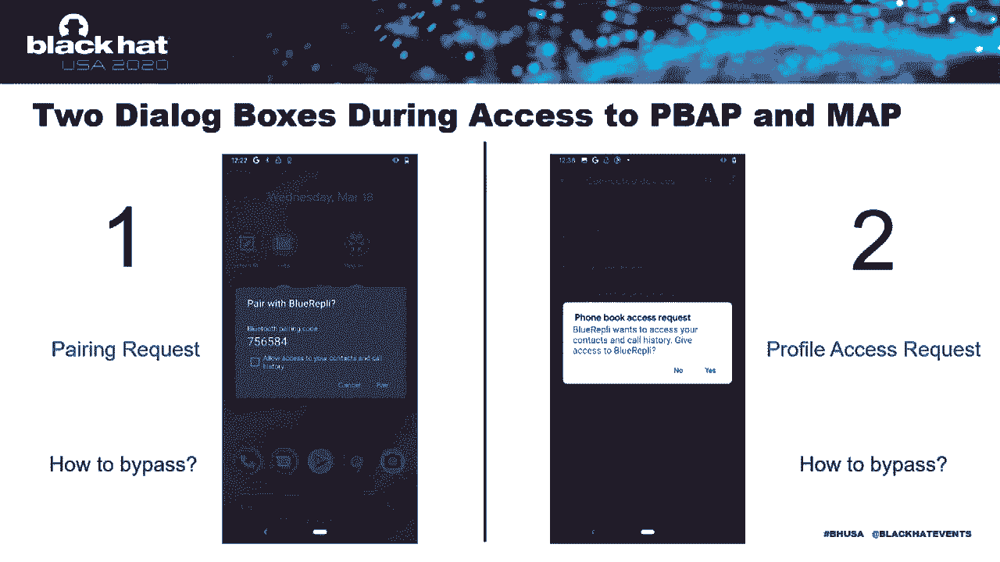
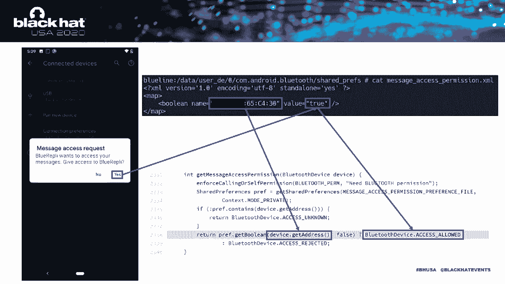
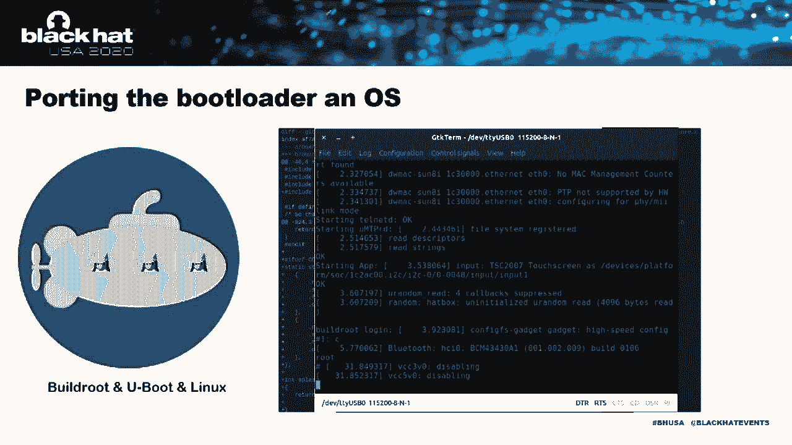
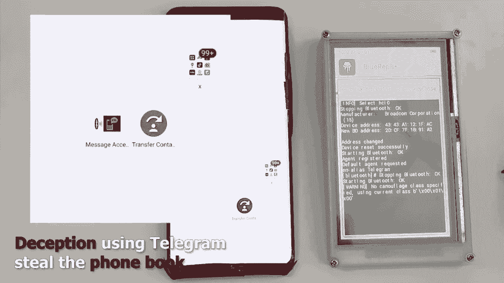

# 【转载】Black Hat USA 2020 会议视频 - P59：60 - Stealthily Access Your Android Phones - Bypass the Bluetooth Authentication - 坤坤武特 - BV1g5411K7fe

 [Music]。

 Hi， everyone。 Thanks for joining。 We are already excited here and it's our first time speaking in the Black Hat。

 After we shoot the bull rapidly to our boss， he said， "Maybe you can try the Black Hat。"， Now。

 it actually happened and it's a big honor to be here to share with you。 For some instructions。

 I'm Sosia Oshu， an IoT security researcher from DBA， Security Head Live。

 I'd really love to contribute to open source projects like P-WAP-LUZ and P-WAP-GAT。

 and also on the Blue Scan project， a powerful Bluetooth intelligence collector。

 Hope you guys will try it and I discovered the bull rapidly。 Here is my partner， Xinxin。 Hello。

 I'm Xinxin。 This name sounds a bit more useful in English， but it means confidence in Chinese。

 I work as a hardware development engineer in this project and contribute part of my work。

 mostly drivers， to the open source community。 Blue rapidly is an amazing discovery。

 My partner will explain the way to discover it and how it works。 So， in fact。

 stealthy accessing Android phones may happen to us everything。

 because it's difficult for us to figure out what the apps are doing behind。 For example。

 in June this year， CCTV， which is an authoritative Chinese media。

 reveals some shocking paralexing chaos in Android apps。

 is that some well-known apps start frequently in short periods。

 Then access user files and read the phone book。 Obviously， this is terrible。 As you can see。

 these perseal editions， like reading the phone book， are all based on the installed apps。 So。

 we'll eat get worse。 Such as if the app is not installed in advance。

 and the attacker doesn't touch a phone at all， convey also still the phone book。

 short messages and so on。 I try to start with the wireless system of the Android phone， like Wi-Fi。

 mobile network， and NFC。 And finally， Bluetooth press to profiles。 TBAT。

 the phone book access profile， and I'm A。T。 the message access profile。 As their name says。

 these two profiles press services for removed Bluetooth devices。

 to excise local phone book and short messages。 Let's see if you need these two profiles can achieve our goal。

 Let me talk about Bluetooth profile briefly。 So， what's a Bluetooth profile？

 There are many application scenarios of Bluetooth， and most of them are simple and small functions。

 such as a phone book synchronization， short messages synchronization。

 There are many ways to implement these functions， but in order to allow devices from different manufacturers to work together。

 in the same application scenario， we need a specification。

 And these specifications are called Bluetooth profiles。 For example。

 PBAP for synchronizing phone book， I'm A。P。 for manipulating short messages。 And more detail。

 PBAP defense tool roles， PIC and PCE。 This device that provides the phone book is PIC。

 such as Android phones， and the device that requires the phone book is PCE， like Bluetooth headset。

 smart variable devices， and car computers。 I'm A。P。 also defines two roles， MSE and MSE。

 which is similar to PSE and PCE， but for short messages。 Besides， devices with strong functions。

 such as Android phones， can simultaneously play as a server or a client。

 Here is a previous research about the Bluetooth profile implemented by Android。 The bad Bluetooth。

 It was discovered last year。 The idea is to be a malicious Bluetooth device。 First。

 connect the target phone with the incentive profile。 Then， when appropriate。

 we switch to a high authority profile to take over the target phone。 For example， first。

 discuss as a harmless Bluetooth headset。 Connect to the target phone using hands-free profile。 Then。

 we convert to a Bluetooth cable using the HRAE profile。 So， control the target phone。

 The bad Bluetooth attack model requires a pre-installed， malicious app。

 Because the kinetic direction of PPAP and MAP is opposite to the attack model。

 it can't achieve the effect I want。 Thus， getting a phone book and short messages with no malicious app installed。

 and make the target phone completely insensitive。 So， what can pre-replity？

 For almost all Android's phone， it can still contact call logs。

 and short messages with only one interaction with the switching。

 Another attacker can make this interaction very deceptive。 For a well-known manufacturer。

 maybe more than one， it can achieve the same function but totally stealthily。

 It can also use a target phone to send fake messages to others。 Okay， let's dive into details。

 For normal use， we will access the PPAP or MAP of a remote phone。 It will pop up two dialog boxes。

 The first dialog is a parent request。 After the user agrees to pair。

 the Android phone will pop up PPAP or MAP access request dialog。

 When both requests are approved by the user， we can access PPAP and MAP。 Therefore。

 using PPAP and MAP to steal the phone book and short messages。

 is essentially to bypass these two dialog boxes。 Let's talk about the parent request first。

 Where does a parent request pop up？ The first reason is that we don't have a valid link key。

 After we connect to the phone， since there is no valid link key， the secure simple parent， SSP。

 needs to be performed according to the protocol specification。 Once the SSP is complete。

 the link key is shared between the two devices。 It will be used for subsequent connection authentication and traffic encryption。

 Another reason is that the default L capability of Android phones is displayed yes/no。 Also。

 according to the Bluetooth specification， the devices at both ends should use LAMRIIC comparison。

 as an authentication method。 That is， both devices should display the six digital number for user comparison and verification。

 So， the parent request when the six digital number has appeared。 However。

 the Bluetooth specification also defines other authentication methods。

 like passkey entering or just works。 What if we use just works？ In order to use just works。

 we need to discuss our I/O capabilities as no input， no output。 This can be achieved using BT agent。

 On the traffic side， the transition from this plain yes to no input， no output。

 can be directly using RUSCHOCK。 Like this。 Then you are fine。

 The parent request dialogue just disappears。 No。 Only the profile access request left。

 As you can see， we can simply pretend to be the name of a well-known application。 So。

 this dialogue will become very deceptive。 Like we chat once to access your contacts。

 Skype wants to access your contacts， or 10 grams wants to access your messages。

 Before we talk about how to bypass the second dialogue， there is a little mention。

 It will be important later。 The no input， no output， calls just works。 And then just works。

 calls AOSP to use the temporary bound。 So， why does a profile access request pop up？ For normal use。

 when we request for accessing the PBAP or MAP of a removed phone。

 it will use our Bluetooth address in shell preference to check， if we already have the permission。

 If no corresponding record is found， the AOSP will pop up the dialogue box。 If user clicks yes。

 or address， and the permissions will be recorded in shell preference。 Therefore。

 the next time we request permission， the dialogue will no longer pop up。

 In simple terms， the problem with this permission verification mechanism is obvious。

 That we can forge Bluetooth address just use Bluetooth to achieve it。 But there is a problem。

 That's the side effect mentioned earlier。 We used no input， no output to bypass the first dialogue。

 This causes just works， which in turn causes AOSP to use temporary bound。

 Then the temporary bound will pass BT bound state long to the upper-system Bluetooth app。

 After the setting Bluetooth app receives this state。

 it clears permission obtained by the Bluetooth address。 In this case。

 we won't be able to inherit the permissions。 To prevent the setting Bluetooth app from clearing permission。

 we can similarly fix the class of device， and the HIB pointing device。

 According to the conditional statement on the left。

 the BT bound state long won't be passed to the certain Bluetooth app。 So。

 the permissions will not be cleaned， and we can successfully inherit the permissions。 At this point。

 we have bypassed the second dialogue。 The above method does allow us to inherit permissions。

 but there is another problem。 That's AOSP will also change from the temporary bound to persistent bound。

 and the persistent bound will not automatically accept pairing requests。 So。

 these two bypass methods are mutually exclusive。 In other words， if we bypass a parallel request。

 we won't be able to bypass a profile access request。 Or if we bypass a profile access request。

 we won't be able to bypass a parallel request。 This is very frustrating。

 But since it turned out to be good， for well-known and just un-formed manufacturers。

 maybe more than one， they have not successfully bypassed the BT bound state long to the certain Bluetooth app。

 So， the permissions we want to inherit will not be cleared。

 This makes the target never feel the attack。 At the same time。

 the media reported that the devices using the customers' Android system。

 reached 100 million in March this year。 So， this is the whole picture of the Blue Rabbit。

 Since Blue Rabbit is super for near-fuell attacks。

 it is better to have a protocol hardware tool than the command-lantor。 Next。

 I'll give the microphone to Xin Xing。 Here we'll introduce the hardware tool。 Yes。

 Blue Rabbit is a wonderful discovery。 We believe that the effect will be better on portable devices。

 We try to run Blue Rabbit on portable devices to verify the actual combat capabilities。 Generally。

 we will use the Raspberry Pi to achieve this goal。 But in this project。

 Raspberry Pi does have some shortcomings。 Compared to designing based on Raspberry Pi。

 I choose a more challenging solution， designing a brand new hardware platform for it。 If we do this。

 the device should have the following capabilities。

 With enough ROM and ROM to run the Linux kernel and Python interpreter。

 with a hackable BlueTooth radio baseband can be added to a battery-powered operation environment。

 has an easy-to-use HTML map。 Besides， it should be small enough。 Based on these needs。

 we need to choose a CPU， a BlueTooth spaceband， and some necessary， practical devices。 By chance。

 I found a very amazing shape。 It is called a winner S3， which is a highly integrated shape solution。

 Integrate a single core Cortex-A7 based SOC with 108 MB DDR3 ROM in a small BGA package。

 This shape will simplify the carry-hard design， and the carry-hard creators of integrated DDR will also make the final product much smaller。

 Most importantly， it has the ability to run the Linux kernel。

 The radio baseband uses a separate BCM 43438， which is a Wi-Fi and BlueTooth 2-in-1 shape。

 supported by both NxM and internal Blue。 This two amazing projects give the chip the ability to manipulate the physical layer data。

 which means it is suitable for this project。 Magdizan also equates with a power management chip and an EMMC memory chip。

 for Lion， battery， and data storage。 But how can we combine them？ Using this？ No， no， no， no。

 This can't work。 We need EDA tools。 Hard work debugging is more complex and time-confconsuming。

 Each version of the design will take two weeks to obtain a sample from the PCB-propotype fabric。

 And the worst thing is I release six versions of such magic and layout。 But in the end。

 I manage to incorporate a 2。5x5cm PCB。 Having a working board is just the first step。 It has no saw。

 The saw is a software。 For some reasons， a winner has not publicly released a BSP package for their chip。

 If we want to use this， we need to sign some NDA contracts， which is annoying for me。

 We are security researchers， and we， thinking this way， I download the corner sources。

 and some link to the batteries and open the decongular。

 I wrote some necessary drivers and fixed some bugs of the exciting open source drivers。

 including the display driver， LCD controller， Bluetooth， non-musical interrupt controller。 Finally。

 I ported U-boot to their 0。04 and Linux long-term 5。3 to this chip。 So far。

 we have an operation system that our res-ability researcher is where we familiar with。

 Thanks to the open source community and all the drivers mentioned above were published on Magidhar。

 The build route to change simplifies the task of cross-comparing necessary packages。 Soon。

 a route fails to become compatible with the original POC running environment was generated。

 It's time to focus on the POC itself。 We need a task screen based UI for it。

 It's no way that a chip like this is a 3 to run a heavy XOR server and the traditional D for it。

 QT embedded is a commercial license， so it is not the best choice。 Finally， I met LVGL。

 The demo of the LVGL is really cool。 You are the one， I think。

 but I didn't expect an admirer to be a person。 For a GUI framework without auto。

 what you see is what you get editor。 The development process was full of panic。

 Here are some lines of code when using it。 But fortunately， it becomes a real reality。

 We made a total box for it。 It is not beautiful， but it works。 Our PLA printer got this job done。

 Here is what I do to get。 And the showcase with the screw drill。

 Here is the video how blue-replie with your portable devices works。

 You can see the link in the description。 This video is not a big video。

 You can see the link in the description。 We have a video on how you can get the new model to the model。

 You can see the link in the description。 You can see the link in the description。

 Please subscribe to our channel。 Please subscribe to our channel。 Please subscribe to our channel。

 Please subscribe to our channel。 Please subscribe to our channel。 Please subscribe to our channel。

 Please subscribe to our channel。 Please subscribe to our channel。 Please subscribe to our channel。

 Please subscribe to our channel。 Please subscribe to our channel。 Please subscribe to our channel。

 Please subscribe to our channel。 Please subscribe to our channel。 Please subscribe to our channel。

 Please subscribe to our channel。 Please subscribe to our channel。

 Please subscribe to our channel。 Please subscribe to our channel。

 This video shows the effect of some Bluetooth profile being more closely used。 Next。

 Sosa will explain some other points that may be attacked。 Since the situation gives us a video demo。

 let me do some summary。 In addition to PPAP and MAP， as you can see， SAP has the same problem。

 However， it's pointing SAP， you already require the root of the Android form。

 So this is more difficult。

 At the same time， there are nearly 40 kinds of Bluetooth profiles。 So in the future。

 we still have a lot of scenes to play。 Thank you。 Any questions？ Hello， everyone。 I'm Xinxin。

 I'm here。 There is some S who may network connections。 Maybe you will see。

 I'm lagging in front of the camera。 I'm sorry for that。 In this project。

 I'm working for the hardware。 You can send it in the lab discussion。 I'm trying to answer it。

 Thank you。 Thank you。 Hey， it's also， you seems disconnected。 Can you hear me？ Yes。

 I am seeing the question type。 But the replay itself is designed by social。

 It's a type of connection problem because we are in here。 The network is not well for some reasons。

 I can't answer some of the questions about exploration itself。 I'm not sure。 I'm not sure。

 I'm not sure。 I'm not sure。 I'm not sure。 I'm not sure。 I'm not sure。 I'm not sure。 I'm not sure。

 I'm not sure。 I'm not sure。 I'm not sure。 I'm not sure。 I'm not sure。 I'm not sure。 I'm not sure。

 I'm not sure。 I'm not sure。 I'm not sure。 I'm not sure。 I'm not sure。 I'm not sure。 I'm not sure。

 I'm not sure。 I'm not sure。 I'm not sure。 I'm not sure。 I'm not sure。 I'm not sure。 I'm not sure。

 I'm not sure。 I'm not sure。 I'm not sure。

