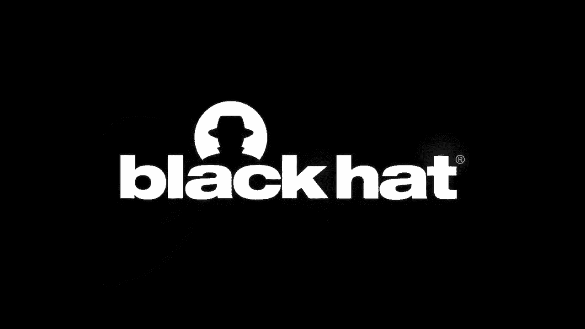
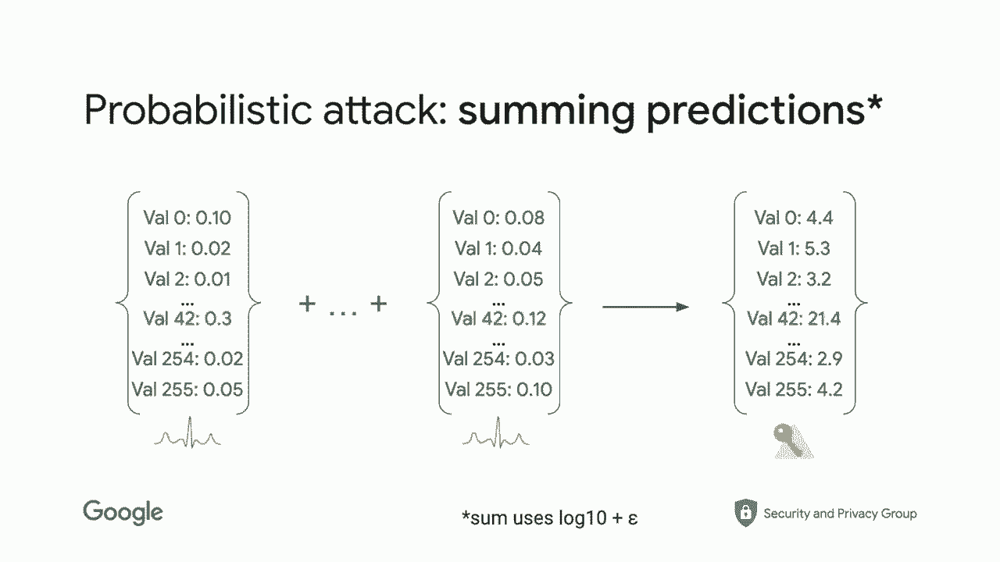
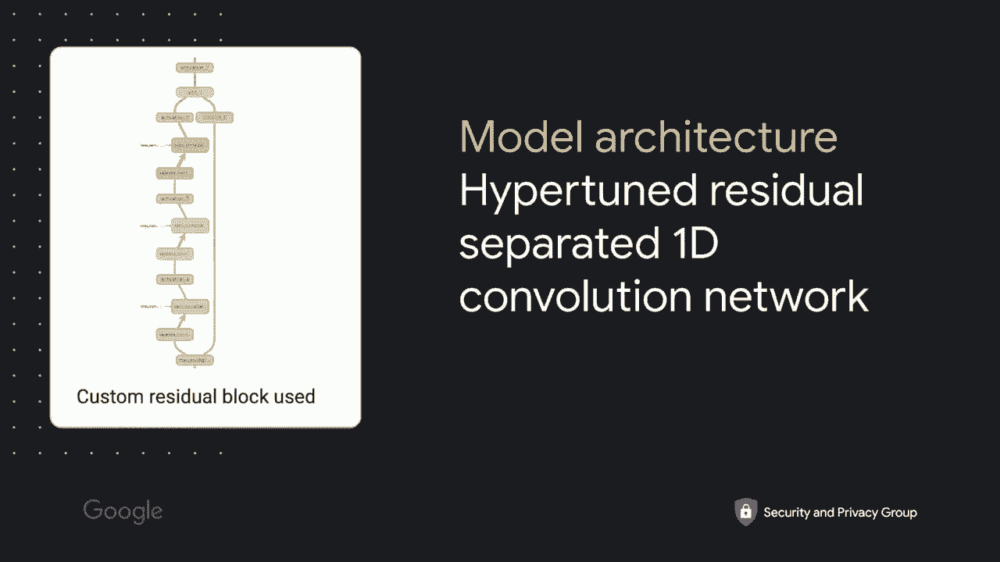
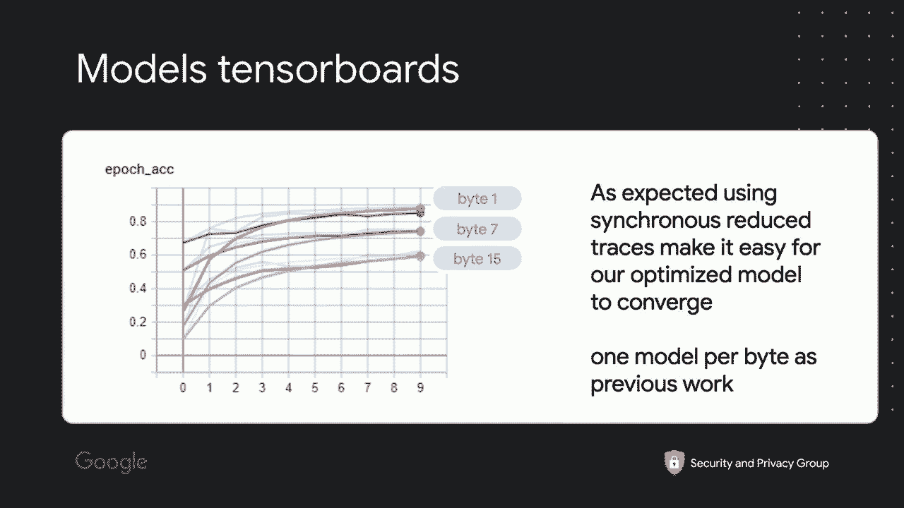
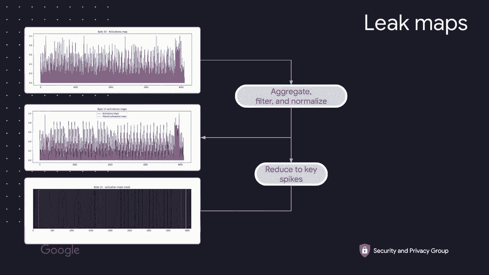
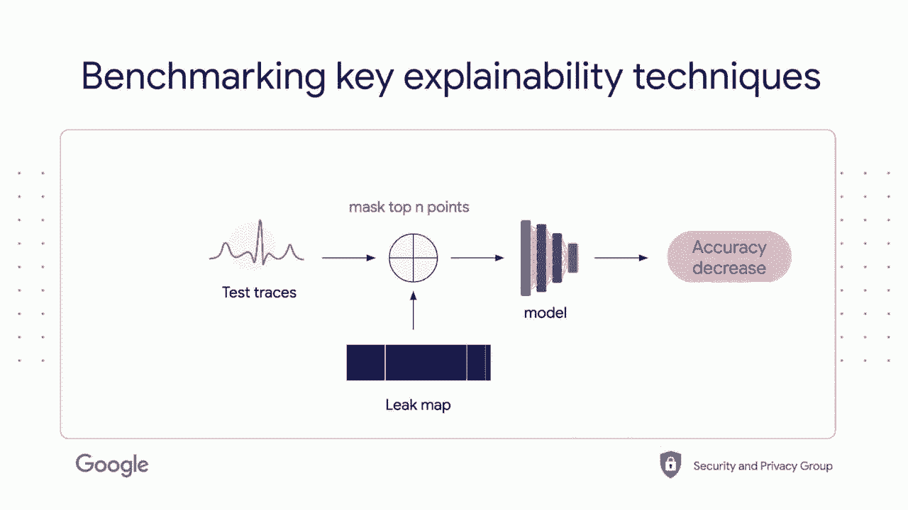

# P5：05 - A Hacker's Guide to Reducing Side-Channel Attack Surfaces Using Deep-Learni - 坤坤武特 - BV1g5411K7fe

 [MUSIC PLAYING]， My name is Lee。

 I work at Google where I leave the security， and on T-apeuse research team。 Today。

 we're going to talk about how， to use machine learning to reduce。

 side-channel attack at-track surface。 Before getting started， it is worth mentioning。

 that this talk is a joint collaboration， with many collaborators around the idea of how we can harden。

 hardware cryptography to create more secure devices。 As this time of recording， which is July 14。

 happy best of the day， the result， has still a little bit experimental。

 All you're going to see is working， but I expect by the time you will see this recording。

 at Blackout。 The result will be way better。 I hope we get a chance to discuss。

 about recent advance between the time， of the recording and the Blackout during our Q&A session。

 So side-channel is one of the most efficient way， to attack secure hardware because it does not attack。

 the algorithm， which is well vetted， but instead targets the implementation of it， which。

 is less vetted either because there are many of them， and also because some of them are kept secret。

 to ensure that they are compliant with certifications。

 An example of how powerful side-channel attack， might be is， for example， this attack。

 which occurred a few years back where people， were able to lift out from a treasure， which。

 is a hardware Bitcoin wallet， the private key of Bitcoin， wallets。

 This shows you how powerful it can be， and how devastating having a session attack。

 can be for secure hardware。 One of the problems when you develop software。

 and when you develop hardware compared to software， is that debugging it is harder because we。

 have to find where the session attack came from， which means where is the leak into the code。

 And this leak is usually due to the interplay， between the software and the hardware。

 And so you have to look at both of them， and send them to get an idea of what might be leaking。

 This is what makes it so hard。 So if we were to have a more secure or the most secure hardware。

 possible， we need to help reduce the cost of finding the attack。

 and being able to pinpoint them accurately。 This is why we asked the question。

 is there a way to create a debugger that， will help us to pinpoint accurately and quickly what。

 is the part of the code which is interacting in a way， with the hardware which makes it。

 different than both side-channel attacks。 And the answer is yes。

 We do believe that by combining deep learning and dynamic， analysis。

 we'll be able to quickly and efficiently， find the pinpoint and quickly find。

 the origin of the leakage， right？ The leakage being where is the implementation。

 is giving information that can be used to extract the key。 And of course。

 because I use what deep learning。

 it might be a little bit skeptical and say， well， yet another talk about deep learning machine learning。

 I'm going to sell you something。 So truth is， when not， we actually-- what I'm going to do。

 today is actually show you a early prototype of a concrete。

 software that we have developed called Cold， which， stands for site-channel attack leak detector。

 which is actually， is able in practice to help us find where the leakage come from。

 and help us debug site-channel attacks。 So to make it very concrete today， what we're going to do。

 is we're going to show you how we can use Cold to find where。

 a tiny iOS implementation running on an SMT32， F4， is leaking。

 And this is obviously a unprotected implementation， tiny iOS。

 which is running on a well-known ARM CPU。 And this combination of tiny iOS and SMT32。

 is what we call a target， because as I said， so site-channel attack is due to the interplay。

 between the implementation and the hardware。 So how we're going together？ First。

 I'm going to briefly recap what site-channel attack。

 or then I'm going to tell you how we very briefly， how we perform， site-channel attack。

 which I was using an AI deep running， which is what we presented last year。

 Then we're going to talk about AI explainability， which。

 is a core of the technique we are leveraging to do the debugger。 And finally。

 I'm going to show you how in practice we use it， to find a leakage into our target。

 So if you want to follow along at home， and you want to look at where the code and the stylers。

 we go through the presentation， you， can get them at ilay。net/code。

 A quick disclaimer about this talk。 The goal of this talk is to provide a high level of a view。

 of how the whole thing works and provide you， a nantu and view of how the process works。

 If you're interested in more technical detail， like the exact machine learning architecture we use。

 or how we do the code mapping and everything， we should have by the time of Black。

 add a technical paper out that you can download。 And you can read and we'll provide you all the detail。

 as well as code who enable reproducibility。 So with that in mind， they start by voila。

 site-channel attacks， so everyone is on the same page。 A site-channel attack is basically。

 an indirect measurement of a computational result， which， is done through a auxiliary mechanism。

 So what do we mean by that？ Well， sorry， before getting there， but why is it useful？ Well。

 a site-channel attack is used， as I mentioned， and it's the intro to recover on cripe-friendly。

 It is also used in the world of web security， to perform blindest transaction， where you cannot see。

 the result of the injection， so you， have to guess what is the result。

 It's also used to tilt password and pins。 And finally， it can also be used for extract。

 that we showed in the example earlier。 Extra crypto wallet private keys。 So basically。

 everything which is secret that you cannot， observe directly， but you wish to guess or to recover。

 can usually be targeted by a session， and attack one another。 So in the case we are interested in。

 which is hardware crypto， the idea， is when you perform a computation on a CPU using an algorithm。

 you feed in your data， which is your plain text， and your secret key。 And then as a result。

 you obviously get the encrypted text， but you also get a bunch of leakage。

 So leakage basically are this kind of side effect， an entire side effect。

 which are due to the algorithm running， on your target。 So for example。

 the algorithm will take some times， and unless your algorithm is protected against timing。

 and is cost on time， you will see different timing， execution time based on the input。 Similarly。

 and that's the one we're going to focus on， during this talk， you might have leakage。

 which are due to power consumption。 So depending on what operation is done。

 you get different type of power consumption， and you can actually extract that。 Similarly。

 depending on how powerful some part of the CPU， may eat differently， this is not really used。

 for recovering hardware crypto in our case， but this is something which do happen。 And finally。

 last but not least， sorry， the you have EM， electronic magnetic emission。

 which is also very powerful， and it is the other way to one of the other way。

 you can extract and recover a key。 So here's an example for power trays。

 because that is the goal of our talk。 As you can see， this is a power trays。

 which was captured during the creation of AS。 And if you look closely in the middle。

 you'll see that you have 10 spikes。 It turns out that each of those spikes。

 is actually describing or is actually representing， a AS round， there is 10 rounds for AS 128。

 And we can see very clearly on the trays， that those round are visible。 If they are visible。

 then they might contain information。 If they contain information。

 we may be able to exploit it to recover the key。 So that is what a such an attack is。

 So to familiar that a little bit more， what happened is the CPU， the CPU compute the encryption。

 And what we do is we measure the current， with a no-siloscope。

 And then in the traditional setting of such an attack， you perform something like a template attack。

 which is you take all the traces collected， you collect a few of them。

 actually you don't collect one。 And then you combine them statically。

 to try to pinpoint what is the key value， and then you recover the key。 There is an internet share。

 where the such an attack is。 In our research， because we got the question asked a lot。

 what do we use？ We use a new A， cheap Whisper Pro， and we sometimes use a BicoSCOP 6000。

 when we need faster sampling rate， depending on the target。 In this talk， I've been saying。

 we only used the cheap Whisper Pro to do the capture of the trace。

 because we are going to use synchronous traces， for only the first few rounds。

 When we do as previous work， the whole traces for the whole implementation。

 and we want to do it in the attacker settings， where we don't have the clock。

 We use also the PicoSCOP。 Again， this is not an endorsement for a project or another。

 It is just that this is what we use in our lab。 So if you would like to reproduce our result from the ground lab。

 this is what you could use。 So， let me now describe a little bit more。

 of how we wave in deep learning， because we're going to need。

 a machine learning model generated during the attack， for the debugging。 So deep learning。

 such an attack， we call them such an attack automated with machine learning。

 And the idea is you're going to replace， the template attack with something else。

 with a neural network。 And this is something we have covered in detail before。 However。

 I'm going to briefly recap today， how you can do those attack in practice。

 So you are able to figure out， to get a gist of what is happening。

 If you would like to have a more in depth explanation， of how the whole thing works。

 we had the talk last year at DEF CON， where we actually get into greater detail。

 for 40 minutes on exactly how that works， and all the nitty-greet and bits。

 And you also have the code associated with it。 So if you want to go there， you can just get a slide。

 and the recording of last year video at that address。 All right。

 One thing which is different from last year， and which is different from our threat model。

 where we try to do a black box attack， which is the strongest thing we can do。

 when we try to revise the security of a chip。 In that specific case， we are building a debugger。

 So we are building a tool， which is for the people who built the hardware。

 or are not necessarily building the hardware， but are creating the secure token。

 So we are taking a white box attack model， which is we have access to the source code。

 we have access to the clock， and we have access to knowledge， about implementation。 As a result。

 we are simplifying the attack， by using synchronous capture。

 which means we are using the internal clock of the target， to capture the trace。

 It's make it easier because we have traces， which are perfectly aligned。

 which you don't have in the black box settings。 We also are reducing the amount of point in the trace。

 that we are capturing， because well， we know that we only need。

 the first round and a half or something like that。 So let's make it easier for us to try the model。

 because of course the trace is slower， is smaller， and we are aligned。

 So the model has to do less work， so we can use smaller models， and also we can reverse faster。

 It's easier， you could do it with the full-scammer model， if you wish。

 although it's going to create a lot of a dead space。

 which is not necessarily useful for this type of stuff。

 as we want to have as quick of an interaction as we can。 This is white box model。

 but this is why we did choose the white box model。 Okay， so how does camera process differs。

 from the SCH processes that we saw earlier？ Well， we start with the template。

 which is you perform--， - Let's press the flag。 - Second。

 my Google Assistant decided to care about it。 Sorry about that， unexpected during。

 but given the condition， the phonitional stress here。 All right， so let's go back to where we were。

 So we have the encryption， and then the encryption is basically what happened。

 is the encryption is performed as usual， and then we capture the signal with a chip whisper。

 and then we get a bunch of traces， and then instead of doing the template attack。

 what we do is we feed those to a deep neural network， which is the form of AI。

 and then the machine learning is going to make a prediction。

 and we're going to combine them to recover the key， and that's what it does。

 The advantage of this technique is it's fairly automated， doesn't require too much domain expertise。

 and also can take over， can work on very complicated target quite efficiently。 As I said。

 it works really well in black box settings， on the full traces， which is something。

 that all the type of a full struggle with。 When you do target， by the way。

 when you do target an implementation， you might try to target directly recovering the key。

 but more often than not， we try to target what we call intermediate， which are part of the AS。

 part of the AS where there is some sort of memory loading， or memory unloading。

 because this is where the power is changing， because you are setting some bytes to one。

 some bytes you are putting to zero， so the power is changing， so we want to have this kind of point。

 Those points are called intermediate point， there are quite a few of them。

 The trick and the nickel one that most people use， including us， are the first initial tree。

 which are part of the initial round of AS， because they are easily invertible。

 which means you can directly recover the key from them。 Today。

 we're going to only focus on one of them， which is sub-byte in。

 which is basically the intermediate point， which happens as you can see on diagram。

 after we have explored the key with the plain text。 You could target also sub-byte out if you wish。

 As we explained earlier in the previous talk， trying to target the key doesn't work really well。

 This is not even a point for a tiny AS， so your model will probably not get as good of an accuracy。

 and given that we are trying to get， for the most obvious leakage for now。

 sub-byte in is perfectly fine。 Okay， last thing I want to mention before we move on。

 to how to do the debugging is， what do you do with a prediction？

 Because that's one of the nice thing about machine learning， when you do deep learning based SCA。

 is that you get your traces， and then the model， instead of telling you。

 one value would give you a probability， a probability， but a probability to a self-max。

 will tell you for each value of the intermediate， what is the probability。

 or how strongly he believe each of them， is a correct prediction。

 So what you can do is that gives rise， to a very natural probability get-that。

 where basically you take all the output of the model。 So the model will tell you for each value。

 potential value， what is the probability， so you can actually sum them using a log 10 plus epsilon。

 and then you get a distribution， and that helps you to accumulate probability very easily。

 and value which is the first guess， which is the second guess。

 so guess and you can actually rank your guess， and so it makes。

 it's a very nice probability get-that， only deep learning provides。

 So that's also one of the benefit， of using deep learning based SCA， is Kamo。

 All right。 In this current to make things， to give you a little bit more detail。

 the model we're going to use in this talk， is something called a simple。

 high-pertune residual separated 1D convolution network。

 Basically what it means is we use 1D convolution， we use separated one because they are faster。

 and have less parameters， and in our experience over the last three years。

 it feels that it's good enough， it's actually give us performances， it is able to work and converge。

 so we don't need the full convolutions。 We also have high-pertune them before。

 so we basically use one of our best model， and then it's a convolution network。

 which means mostly based on convolution， and the residual part means that we tend to do something。

 like the breast net implementation， which is basically， we do a bunch of convolution。

 and then we keep the signal by having a second pass， they can see on the right side of the diagram。

 which helps us to keep the direct， to maintain the flow of the gradient。

 and avoid vanishing gradient problems。 So again， it's very standard， if you do machine learning。

 it's just adapted to work well for 1D traces， and you can construct your block differently。

 it seems that this block is the one which works best for us。

 and basically we stack a lot of them like pancakes。

 which is why it's called deep learning。 Here is an example of what you might get。

 if you try this model， we have three models we should train。

 because we train three models for this talk， in the real setting you will train 16 of those。

 obviously， and what happened is basically， you can see those three bytes converging very well。

 after only 10 epochs， who could have keep going to increase their accuracy， but at that point。

 each model have reach above 60%， which is plenty for what we try to do。

 which is get a bunch of traces， where the model is able to predict the correct value。

 and then use that to debug， so that's plenty enough， so we stop there。

 because obviously we want to have to be as efficient， as possible， as you can see。

 the important part here is， you can see that the validation， so there is two。

 two curve for each of the point， is actually tracking very closely the training set。

 and that's really good， which means the model has generalized perfectly。

 because both are tracking each other， so we have a model which generates well。

 so that's a good model。 Again， that is expected because we made it very easy。

 for ourselves by having an unprotected implementation， 10 years， and making synchronous。

 and shrinking down those traces， to only the first 4，000 points， so that's what it is。

 Last but not least， as I mentioned on the side， if you're not familiar with how session attack works。

 we do tend to recover one byte at a time， so you need to recover the whole key 16 models。

 and then combine the prediction， to recover the whole key。 For the rest of the talk。

 I'm going to only focus on one byte at the time， because you basically repeat the same thing 16 times。

 I'll actually use some example of how the debugging looks。

 like different from both traces for different bytes。

 so keep in mind that we have multiple models。 Okay， so now we have a model。

 and we know our model is efficiently breaking 10 years， so the implementation is broken very。

 very badly， so okay， can we use that node to figure out， where the leakage is coming from？ Well。

 yes， to that we're going to leverage， a non-technic， non-set of technique， actually。

 which is deep-learning explainability。 Deep-learning explainability actually was developed。

 for a vision， as you already said， at least stages， so they had a bunch of data sets， and the model。

 for example， will accurately predict， in this image that it contained a boxer and a tiger cat。

 The question is， why？ What is the policy image as a machine-learning is using。

 to decide whether there is a boxer， or whether there is a tiger cat？

 You want to use that to make sure there is no biases。

 or errors into your data set that are giving him， to the machine-learning that it should not pick up。

 and it degenerates correctly， right？ You want the machine-learning to not only detect a cat。

 in that image， but also detect it in any wide range， of images， so you want to make sure it focuses。

 its attention to the right place of the image。 So the way you do this is， as I said。

 to answer that question， the way you do this， is you use an explainer technique。

 There are a few of them。 I'm going to highlight a few of them after that。 And so basically。

 what you do is you feed， to the explainer of the model， you also feed the image。

 and then you ask it， why this class was predicted？ You can ask the main classes。

 or you can ask your class， which is not the main one。 You can decide which one you want。

 But basically， what you're doing is you are conditioning， the explanation based of the prediction。

 you want to explain， right？ So you basically provide the input and your output。 In a way。

 you can think of an explainer， as something in which reverse the model。 Right。

 it's not really what it does， but what happens is you basically the output becomes。

 the output of your choice becomes the input， and the output becomes the image itself。

 And if you do that correctly， you get something nice like this， which as well。

 if you are trying to predict， the boxer from this image using that model。

 and that's a true example from a resonant model， then you get this nice heat map。

 which we call leakage map later on for traces， that basically highlighted， well。

 it mostly focuses its attention， on the face of the boxer。 So we have some confidence at least that。

 the model is looking at the right part of the image， is to make its decision。

 We can confirm that by doing the same thing， for the cat， right， which we would say， "Hey。

 explainer， take the same image， take the same model。

 but no tell me why you came up with the other cat。"。

 And this time it's looking at the body of the cat， and because it says the tiger cat。

 is looking at the stripe。 So far so good， that seems okay。 So we are very confident that the model。

 is actually working as intended， right？ Here's an example where actually this type of technique。

 were used to find biases。 Very， very long there was this very famous data set。

 for images called the Pascal vocabulary， right？ VOC data set。

 And early on this data set has this interesting feature， that for horses。

 I think one in five had a text box， as on the lower left。

 And what happened was that the machine learning， was predicting there is a horse。

 not because there was a horse in the image， but just because there was a box。

 And so that was very interesting。 It was a biases which were due to the fact。

 that the image had a statistical discriminator， which was easier to learn。 There is a box or not。

 rather than learning the shape of the horse。 This was basically the initial major success。

 I believe， for this type of explanation。 It was done into a paper called unmasking clever hands。

 predictors and assessing what machine learning really learns， which was published in nature。

 You can， I believe the paper is widely available， not even without the paper。

 So you can check it out if you're interested， into the origin of explainability。

 So that tell you how we do explainability， but of course now if the question become， okay。

 how do we use that and how we combine it？ We then can do this to do what we wanted to do。

 which is find where the look gets come from。 Well， this is where it's called coming into play。

 This is how we， this is our debugging tool， which is written in Python。

 And so the game plan we have for the code is well， so I'll do this in explainer， of course。

 And we're going to do very similarly， we're going to fit it in the model。

 which is our train model we see earlier。 And the traces and the prediction for the traces。

 So we only keep the traces and prediction， what's correct because we're interested in。

 why is the model correctly predicted， given the output of the byte in。

 And then that's going to give us a leakage map。 Of course it's 1D this time because it's a trace。

 It's not 4D like the images。 So that's what the leakage map is。

 And so basically our hope is that the silent point。

 into the leakage map will correlate with the code of that。 But if you have a leakage map。

 you just know， temporarily where it is， it's an iteration instruction it is。

 So we need a different second piece of code， which is where dynamic execution come in。

 which is a target emulator。 So if you remember， the target is the code， running on a given hardware。

 So for it is tiny areas running on an SMT， sorry， F4， an SMT， F4。

 And so what happened is it's going to take the leakage map。

 and then it's going to execute the target。 And basically base of that。

 and we're going to get the execution timing。 And we'll be able to correlate to know。

 what the execution was， execute it in which part of the traces。

 we're going to glue everything together， and use debug symbol。

 And you should be able to get annotated code， with a leakage map and say。

 this is the code line which is the most likely to leak。 Okay， so how we get there？

 The first thing we had to choose， is what type of a training technique we should use。

 So we started by that， right？ We need some explanation。 So there are a ton of them。

 Here is some of them which were developed。 And you can see you get more or less。

 a defined images or a defined output。 So one we do use out of those is the one in the middle。

 which is a guided gradient grad cam， which is actually we use grad cam plus plus。

 which is a improved version， because it's one of the most well defined。

 We do also use something which is not displayed here， that I will cover later on。

 which is the activation map， which is literally just looking， at the output of the first layer。

 So now that we know that a ton of techniques， the question is how do we choose the best one for our job。

 right？

 And the answer is we have to benchmark them。 So the way we benchmark them is we track。

 every explanation we get for all those choices we get。 So we use， I don't know， four， five。

 six thousand traces。 And for each of them we apply， we explain them。

 So we create a collection of them， as you can see on the top left of the slide。

 And then we combine them by either averaging them， or summing them it depend。

 And then we filter them to only keep the spike。 This is the orange part of the second boxes on the left。

 And then we normalize between 0 and 1， because we want to affect probability。

 of what is the most important spike， right？ And then when you have done that。

 and we have eliminated everything， which is below the average plus one standard deviation。

 you get what we call the leakage map。 And you can see the leakage map generated here。

 seems to have one initial spike at the beginning， and then one larger spike at the end of the traces。

 Again， another trace is probably the end of the first round。 Actually， we think that for this demo。

 I cut it a little bit too early。 I should probably have taken 6，000 or 8，000 points。

 So we might miss the end of it。 But suffice to say that for this byte。

 it seems that we have one input and one output， right？

 So the thing we can do is we can generate those hit map， for a virus technique。

 So the first technique we use is the SNR， right？ The Cignale to North's ratio。

 This is not the deep learning technique。 This is the very old technique which was developed。

 actually， to do traditional size channel attack， which is actually built in， which people。

 experiment with， we use that as a control。 We want to make sure that we use-- we might also use it。

 by the way。 But the idea is this is SNR to North's ratio。

 This is a standard technique where you look at， given some assumption， where are some spikes based。

 on this notion of where is the most， this cumulative part of the trace。 And as you can see。

 it seems to be-- this is for byte zero。 Something has a beginning and something in the middle。

 and then nothing。 Then we have the grad camp plus plus。 As I said， the gradient camp is this idea。

 that we use the integrated gradient。 And we compute some sort of an inverted model。

 where we use the gradient to see how it's， flow from the input。

 the output back to some of the layers。 In our case， the initial layer， because we。

 want to look at each point individually。 And you get a very， very different map。

 So we already know that one of them， will be more correct than the other one。

 And then a third technique we use is called the activation map。

 So the activation map is basically you do your prediction。

 And then you look at what were the value of each of the different--， how much each neuron did fire。

 And so because we use the lowest bottom layers， and these layers is the size of the trace。

 we can get for each of them how much it did fire。 And what you can see here is it's mostly identical when filtered。

 to the grad camp plus plus。 So both of them are somewhat identical。

 We expect them to be performing roughly the same。 So how do we evaluate the quality of this？ Well。

 the idea is very simple。 We have our test traces， and we have our leak map。

 So what we can do is we can decide to suppress， which is basically， putting the point to minus one。

 See， machine learning normally is between minus one and one。 And then we remove them。

 So what we can do is we can take what， are the four， six， seven， eight， 20 point--。

 after that it's becoming less。 But the first top point that are reported by the leak map。

 surprised them from the traces， feed them again， to the machine learning model， and look。

 at how much the accuracy decrease。 So basically what we'll tell us is if those points are。

 important to the machine learning to the prediction， the accuracy must go down。

 Either point are in a dead zone， so machine learning might not care as much。

 You do care about everything， so you'll see always a decrease， but it might not be as drastic。

 So now the question becomes， if you fix the number of points， how much of a sharp decrease we do？

 The ones who decrease the most， the accuracy， will be the technique which is the most predictive。

 of the leakage。

 That's the technique we're using， and that's， how we do benchmark。

 Or it's going to be the technique。 So baseline， as I mentioned， is 100%， because we only kept。

 as I said， correct predictions， and then we can look at each of them。

 So first thing we can look at is， as I said， it's neural to noise ratio， and in that case。

 on byte zero， the drop of accuracy for four points is， dropped to 57%。

 which means we have a 43% prediction。 So almost half。 So in four points， there are four points。

 The SNF top four points are responsible for about 50%， of the accuracy of the model。

 So it gives you an idea that these are really， where the leak are coming from。 Similarly。

 fairly consistent with byte seven， where it's even deeper， 44%。 Now， if we look at activation map。

 that's where we start to be really sad， if we were very sad。

 The activation map performed with you more than that。 So about the same for byte zero。

 but then for byte seven， what the leakage， the execution map return。

 is not predictive at all of where the leakage comes from。 Or at least not， given our benchmark。

 So we're hoping that Grad can++， which came as one， of the non-sillators， but one of the most。

 where you use one， then it's supposed to be really good。

 At least work really well for images who work well for us。 So the thing is， if you remember。

 I showed you， that I want most of the same in leakage map， so you get the same result。 I mean。

 that's consistent， that's good， but the number I really， really bad。 We see it again。

 don't know it get as much as just an R， which I told you is a simple statistical test。

 which use hypothesis which we know are not， as accurate as machine learning one。

 because they use other hamming model， if you want to be precise。 So we were really sad because。

 and it took us a while to figure out what to do， because actually the explain technique we wanted to do。

 not work， and just an R， then just an R， and also， as you have seen， we could have said， well。

 but they are cleaner， they're not， they also have a ton of stride。

 so they're not very informative either。 So， it took us quite a bit of iteration back and forth。

 and then we ended up deciding that we need to create， something which is a little bit more tailored。

 to what we wanted to do。 So reason why is that my work？

 And I know you might be skeptical that we can come up with。

 yet another technique and why it will be better。 So reason why it might be working better is because usually。

 there's a machine learning technique used for explainability， focuses on the highest level features。

 so the upper part of the neural network。 To get more of this understanding。

 and what they do is a stretch， because the neural network is like a pyramid， right？ So。

 the upper layer has our smaller in widths， so you have to， if you want to put it back to trace。

 you have to stretch them out。 We don't want to do that because it basically creates， inaccuracy。

 so we try to do the explanation， as a lowest layer， it doesn't work， right， as we saw。

 So we were hoping to go back to the roots of the idea， and actually use one of the oldest technique。

 but revisit them to make it a little bit more precise， which is using occlusion。

 So the problem with occlusion is that， an occlusion is basically。

 you are removing part of the trace， and you're scanning that way。 The problem with that is。

 of course it doesn't take into account nonlinearity。 So to combat that。

 we can map with a novel version， like which is basically combining this type of occlusion。

 by block with a convolative occlusion， which is basically using a windows。

 and then convolving those cores to get some sort of， back of nonlinearity over a large region。

 or a small region， like a set of small region。 And so what you end up with are the maps you can see here。

 So the first thing about those maps， just visually is they look very clean， right？

 They are only very， very few spikes， so that's good。 If they work。

 it's very clear where the leakage can form。 The other thing which is very encouraging is。

 the bi-zero leak map clearly show leakage before the bi-7。 Of course。

 the algorithm process one after each other， it's not using any kind of simmed or vectorized operation。

 So that's what we expect， we expect it to do one， then the next， then the next， then the next。

 So we're pretty good confident that actually makes sense。

 It's also interesting that you show you that， product bi-7 actually is really close to the end of the traces。

 which explain why， as I told you earlier， I might have to try to do it too short for bi-15。

 or even bi-13 and so forth， because we already have the limit for bi-7。 That's why we did cut here。

 And so， yeah， this looks good。 So now we can benchmark it， and the answer is how good it is。

 Since it is pretty good， it's way better for bi-zero， 17%。 So way。

 way significantly better than anything else。 And for bi-7， it is better than SNR。 Not by much。

 but it is better to be honest， and to predict that that's for four points。 When you look at five。

 six， seven， eight points， sometimes one goes above the other， but overall。

 it's called perform better。 So we have a technique now which works really good， really well。

 and if you compare the quality of the traces， the first thing you will notice is actually the scroll traces。

 is very similar to the SNR one for bi-zero， except it's way more defined。

 Most of the noise that were plaguing the SNR is gone， so now we have two very clean。

 part of the traces that we know， is responsible for most of the leakage， which is good。 Also。

 the scroll believes the， it might not be very visible on the slide。

 but there is a right bar in the middle。 So the scroll believes the second spike。

 is more important than the first one， whereas for the SNR， that's the reverse。

 So interesting differences between the two， and in the middle， I put grad camp plus plus。

 and you can see this trace is non-informative。 So we are finding almost the same places。

 so we are confident it actually makes sense。 At least it actually makes sense。

 from even a statistical analysis， so that gives us a lot of confidence。

 that it's the right technique for the job。 So now we back on track。

 we have a technique which decreases the accuracy the most， and have very， very low noise。

 so when we use it to explain the code， the developer only have a few places to look at。

 which is really good。 So now how do we go from the leakage map to the code？

 And this is where I'm going to be a little bit hand wavy， because this is a part of the code。

 we are still actually working on， and I don't have a slide to show you the end result。

 but I will explain you where we are at， and I can show you where we are。 So the idea is how we go。

 the first thing we need to do go is I say， you go from the traces to CPU instruction。

 So CPU instruction is going to depend on two things。

 The first thing is what type of CPU you're using， so we use an ARM。

 so we need to know for each instruction， how many cycles it takes。 Then we need a firmware。

 which is basically the compile version of the code， which data tuition instruction are executed。

 We need to feed the leak map， which are at which point are important for us。

 and we also need to have a state automaton， who instrument the emulator。

 to be able to reproduce the encryption， and so we can basically reconstruct。

 what instruction were executed at which time， and then map it back to the trace。

 which will tell you what point in time is important。 So with all those things。

 what you get is you get a heat map， of which CPU instructions are the most important。

 This is the part we are still actively developing。

 because we need to refine a little bit how our clock， and program content are implemented。

 to be as accurate as possible， but it is what it does。

 Then what we need is now we have assembly code， so we can probably end up there， worst case。

 but we want to go one step further， which is can we go back from assembly code to C。

 and this is something which is well known， in the security community。

 That's what is the bread and butter， of reverse engineering， so sort of product to do that。

 so essentially what you do is you take your ASM， and then our firmware was compiled with debug code。

 again， we end the debugger setting while box， so we know what a debug code。

 and then the debugger can easily go back， from instruction to line of code。

 thanks to those debug symbol。 So from there， it's very trivial to go back to the leak code。

 so now we have the code alongside the heat map， and hopefully， well， then now， you know。

 which line of code is causing the most leakage， according to machine learning， and because。

 as I showed you earlier， the machine learning explanation is very well-cove-related， with the SNR。

 we believe it's also going， to surprise the template attack， which uses kind of a statistical ratio。

 so everything should fit together。 I wish I would show you for 10 years the exact line。

 but as I said， at the time of recording， to refer to it， we are not there yet。

 we are still refining it， so hopefully， we'll get that by blackhead。 All right， so。

 the idea of code is that， we can build this tool， which is going to hopefully empower the developer。

 to quickly figure out what to patch， and focus on developing stronger crypto。

 more than how to do the session and attack， and everything， and bring up more time。

 to focus on design and experimenting， with new machine technique or protection， or things like this。

 We already excited to test it more， and have a little bit more use cases for it。

 and show how we're generalised， so far we are very hopeful it's going to do that。

 and it's going to help us。 So main benefit and takeaway from this talk， should be that A。

 as we mentioned， also last year， machine learning is a new way to perform。

 state-of-the-art SCA attack automatically。 It actually is changing how we approach。

 a session and attack because it's all， to automate a lot of things and also taking。

 to account the narrative that we were not able to do before。 However， they also have。

 as I showed you， with the how the link map actually aligned。

 that they're also finding the same type of stuff， that you would find with SNR plus more。

 so it's literally eight upgrade。 The second thing is we showed you。

 in the two-meter talk how we can actually combine， these AI capability with dynamic execution。

 to try to find leakage almost automatically， and then helping reduce the development cost。

 of secure hardware and hopefully it will help us， to have more secure hardware through the world。

 And finally， there is a lot to be done。 While this talk shows you A way to do it。

 we don't claim this is the best way， just A first stepped over that idea。

 There was other research by the way I need to mention， who were exploring the same idea。

 Some of them from the ANSI did some of these type， of research as well on how to use explainability。

 I don't think they went out for others， but this idea is a community and it's a very active community。

 So there's a lot of work to be done in the idea， of applying AI for fashion now。

 whether it's for improving attacks or improving defenses。

 And so we really excited to see how this is going to turn out。

 and have collaboration with as many people as we can。

 so we can be able to most secure hardware we can。 Thank you so much for attending this talk。

 Virtually， I hope you're safe at home， and then if you'd like to keep up with our research。

 and figure out how we make progress， and be aware of new release。

 you can always check out the website， and you can also follow us on Twitter。

 where we try to post our update。 Thank you so much for attending。 (upbeat music)， (upbeat music)。

 (upbeat music)， (upbeat music)， (upbeat music)， (upbeat music)， (upbeat music)， - Oh， I'm sorry。

 Yes， it was。 I told you that I was saying thank you so much for you guys， for attending the video。

 I hope you can hear me now。 And， can you guys hear me？ Yes， no。 There should be water， hear me？

 - Okay。 - Thank you。 - Okay， sorry， there was a problem with the audio。

 So I said thank you so much for attending。 As you have seen， (mumbles)， (mumbles)。

 So about three weeks ago， so we didn't get all the results in。 I did add them to the slide deck。

 and it should take the latest slide deck。 You'll see that we actually did in the end。

 using our tools code。 The question was， which will we use？ Well， that's our own tool。

 and we're going to make it available on GitHub， and you will be able to play with it。

 and reproduce the research yourself。 And then you will be able to retest。

 where we found them actually。 And in the end， we are able to find， and to see that yes， it's called。

 which is our own tool。 Actually find the leakage exactly， which is to the exact line of 10 AIS。

 which is the one we should do so by 10。 So we have confidence that it works at least in that case。

 Now that I was saying answering the question， it is very， very difficult to get it to work。

 because you have to emulate perfectly the cycles， of the CPU。 So we have to be cycle precise。

 and we have the equation have to be to the exact point。 So the research paper that I was mentioning。

 is going to appear a little bit later。 We are trying on different implementation。

 because we don't know what we can do or can do。 So I hope you have a clear question。

 - Thank you very much for listening。 I'll take more questions during the Q&A， I guess。

 in the minimum and then really appreciate you bear with me。

 and with a good incident and hope you find it， interesting and inspiring and unusual。

 Always have a chance of question on Twitter or by email。 Thank you so much for attending。

