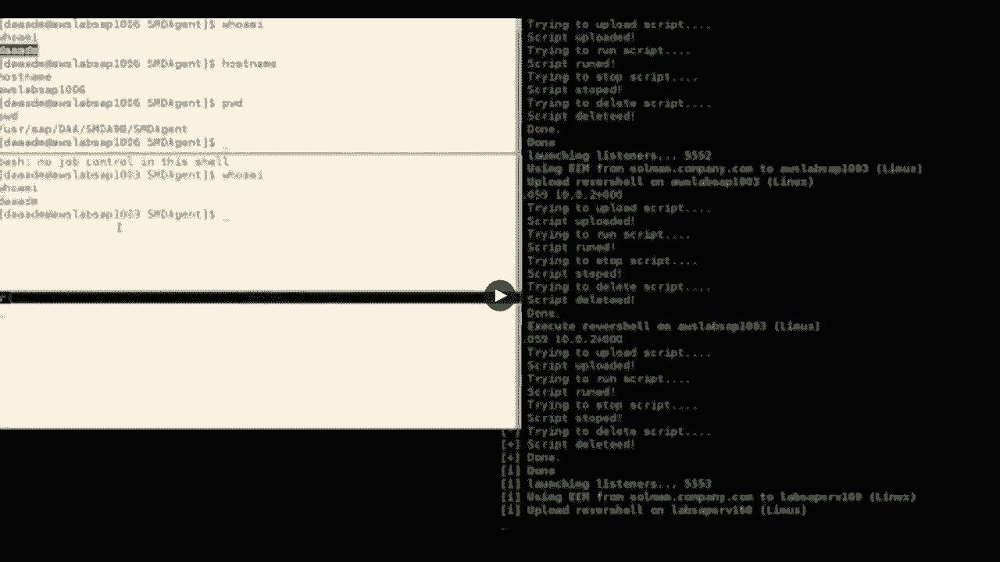
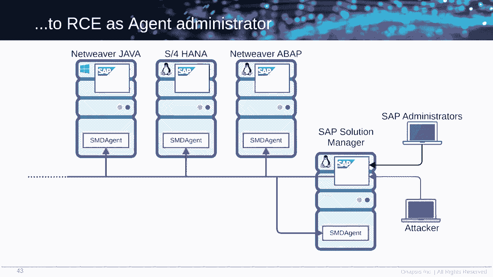
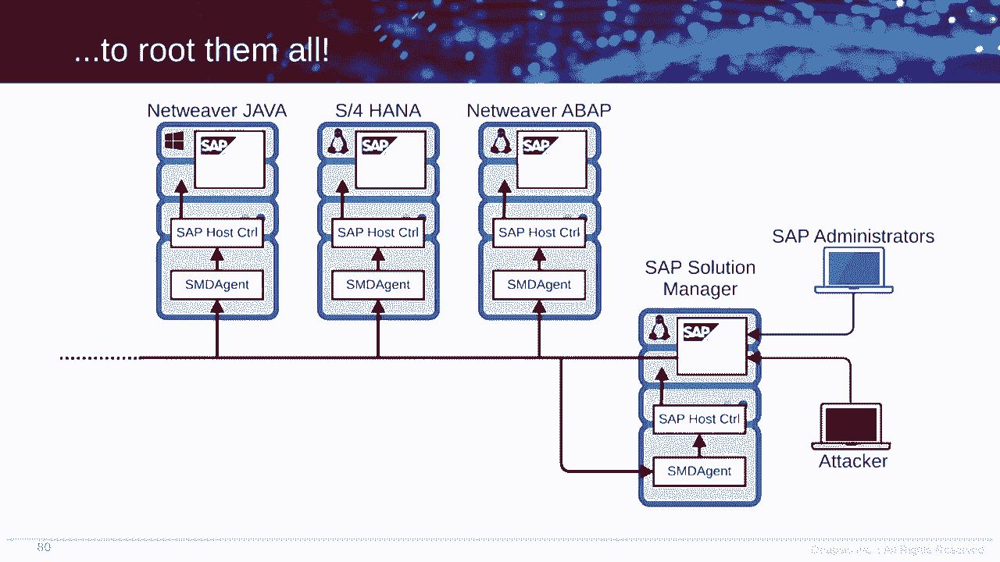
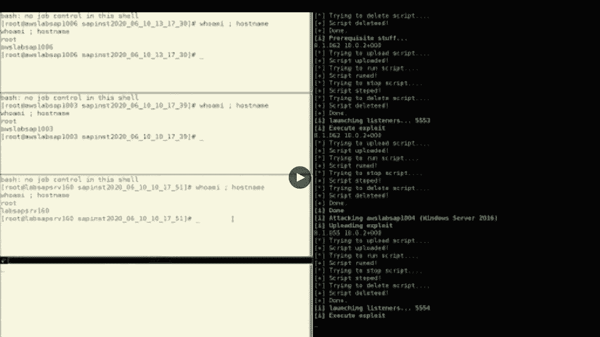
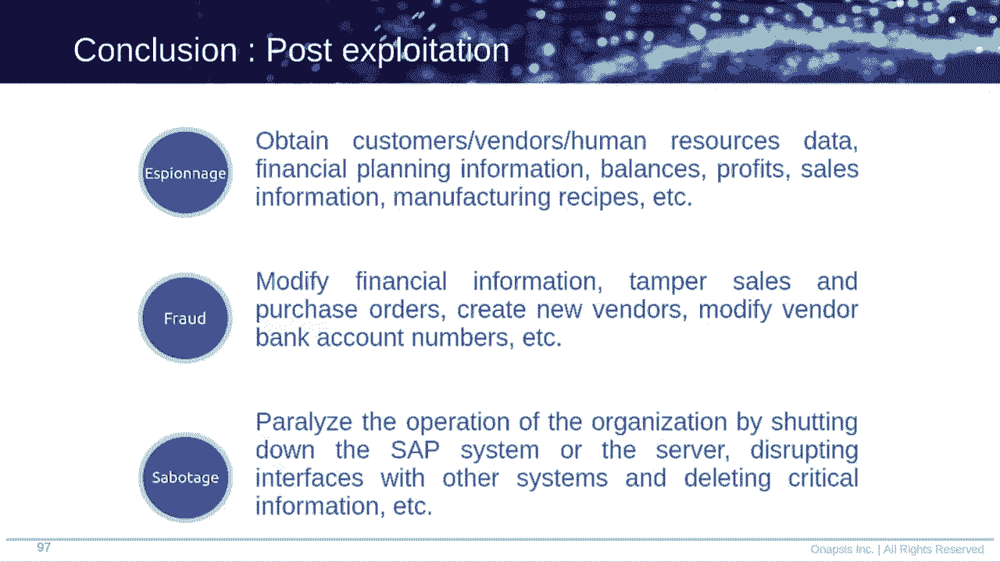
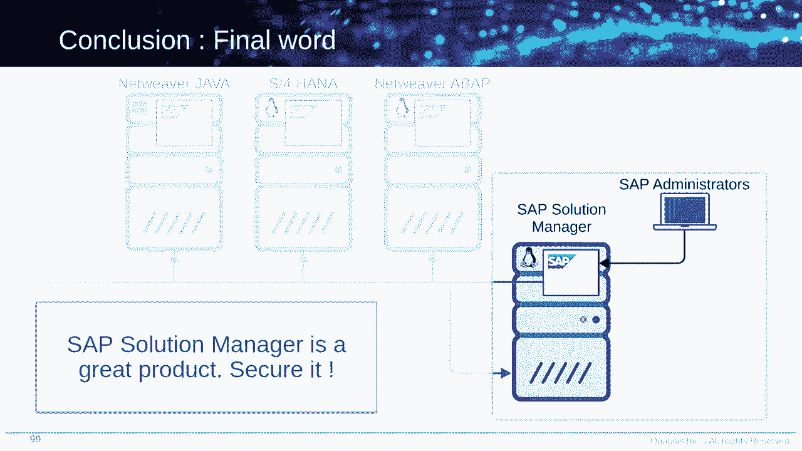

# P60：61 - An Unauthenticated Journey to Root - Pwning Your Company's Enterprise Softw - 坤坤武特 - BV1g5411K7fe

 [MUSIC]。

 >> So thank you very， very for joining to this presentation。

 Welcome to our talk about how attackers， may gain root access in enterprise software service。

 But first of all， I would really like to introduce ourselves。 My name is Pablo Artuso。

 I'm from Argentina。 I'm today with my teammate Ivan Genore， who is from France。

 And we both work as security researchers， at the NAPSI security research labs。

 For those who are not aware about NAPSI， NAPSI is a company which is focused on。

 providing security for mission critical applications。

 We have been in this field for the last 10 years， raising awareness， doing research。

 particularly for SAP analytical products。 This is our agenda for today。 First of all。

 we're going to start with a brief introduction。 Then afterwards， we will have some viewers。

 about the main component of analysis of today， which is the solution manager。

 Then we have three different chapters， talking about our research and the vulnerabilities。

 that we found and finally some conclusions， and some recommendations。

 So let's begin with our interaction。 What's SAP？ So for sure， if you have ever discussed or talk。

 about enterprise software， you already mentioned SAP once， in your life。

 The reason to believe this is because SAP， is one of the largest vendors， if not the largest one。

 in the world of enterprise software。 On the left side of the slide。

 you can see some of the products， of SAP and you may recognize some of them。

 On the right side of the slide， there are some numbers， about this company that I want you to know。

 For example， 77% of the whole transaction revenue， in of the world go through an SAP system。

 All other numbers， all Fortune 500 Olegas companies， are using SAP for the daily business。

 So I hope these numbers may help you， to measure how critical and how widely， SAP is being used。

 In this slide， we have an example of a setup， that we are going to use all along the talk。

 So we can better explain what we are discussing， in some different topics。

 So it's really important that you understand how， SAP is built this setup。 First of all。

 we have three different servers。 Each of these servers is running SAP application。

 As almost every application， SAP application， they are running top of a layer that is called SAP Netweaver。

 And we have two different flavors of Netweaver， Java or ABAP。 As you can see in the screen。

 some of them are running Java， some of them are running ABAP。 Just for the information。

 S/4HANA is a sub-network ABAP。 And also， as you can see， there are some of them running。

 Linux and some of their running Windows。 Why do we have such a diverse setup？ Because basically。

 we want to show you， that the attack that 100% today， it will work no matter， operating system。

 no matter Netweaver flavor。 Also， in our custom setup， any other setup。

 it will have a solution manager。 And now， I will hand out the presentation to Ivan。

 who will explain a little more about this component。 Thank you， Patu。 Hello， everyone。

 My name is Ivan Zhenler。 And I will continue to introduce how， TIGAT was destroyed。

 the sub-source of manager。 The sub-source of manager is what we call a technical SAP， system。

 because there are no business data into it。 And this is kind of system used only by SAP administrator。

 to perform a mini-search task on whole-user SAP system。

 So this is a highly connected system on the landscape。

 And the big advantage of the sub-source of manager， is you can only use one system， this one。

 to manage whole of them。 And it's independent of the SAP version OS version， OS type， et cetera。

 et cetera。 So we can represent it like that in this picture。

 And to fully understand the sub-source of manager。

 you can compare it to a domain controller in Microsoft 4。 This is basically the sense things。

 Why we took a look on it？ It's a bit abused。 We took a look on it， because we think。

 this is the technical hurt of the sub-source of the SAP， landscape。

 If we compromise a sub-source of manager， you can jump on every other SAP system very， very weird。

 To continue to introduce the sub-source of manager， we need to speak about one of these agents。

 It's called SMD agents for sub-source of manager， and diagnostic agents。 This agent。

 it's a little component。 It's installed on every single SAP OS。 And the purpose of this agent is。

 to manage a communication between the SAP system manager， and the sub-source of manager。

 So you can represent it like that in the picture。 And it's very important for this talk。

 because we will talk about things in the future。 The last thing， because the sub-source of manager。

 it's a subnet river。 You can use the SAP GID， the normal SAP client， to connect into it。

 But actually， you can access directly using HTTP request， because they are basically a web server。

 hosted in the sub-source of manager。 And this is where we start。

 So the next part is when we start looking， on this kind of product， this is a huge product。

 with a lot of on-trip runs。 The first question is where to start。 In this case， we were interesting。

 about how the sub-source of manager， entered the communication with this agent。

 How does this communication work？ And how the sub-source of manager manage it， basically。

 So what we did is to search on the whole application。

 provided by the sub-source of manager for a pattern， like SMD agent， SMD agent， something like that。

 We highlight our own 60 application。 And in this 60 application， we found that a bit more than 20。

 it's reachable directly using HTTP request。 So it could be so post， get， et cetera。

 And this is a sample of what we found as web services， accessible remotely。 So we test all of them。

 Basically， all of them are autofocated。 And some of them is not very interesting。 Some yes。

 et cetera。 Eventually， we found this one， EM-Savisamin。 And the truth to me was something。

 like I provide the URL to part two and say， hey， look， what I found is very， very powerful web。

 services， but unfortunately， this is autofocated。 And part two send me quickly back something like a noise。

 not。 And so we do a check。 And yes， it's not a notification need for access， to this web service。

 So this is how a whole trip went in this talk。 So I'll let part two explain what we found exactly here。

 So yes， basically， the application， that I was talking about is called EM。

 We stand for End-User Enterprise Monitoring。 Sorry， End-User Experience Monitoring。

 And what is this EM about？ Basically， it allows the SAP administrators。

 to create scripts that will mimic user actions。 So once the script is created， you。

 can upload it to this so-called application， EM。 And then this EM will--。

 these scripts will get deployed to a different component， which。

 is called EM robots that can be running in different servers。 And there are the ones that are going。

 to final execute those scripts。 Turns out that SMD agents are， by default， could act as EEM robots。

 So if you connect to the solution manager， you upload a script。 Then afterwards。

 you can deploy to one of your SMD agents。 But what is the final objective of this application？

 Basically， it allows SAP administrators， to ensure that everything is working。

 and avoid final users to experience some kind of error。 So let's explain it with a follow example。

 Let's suppose that your company， users， are really used to query some particular table of the database。

 So what an SAP administrator could do， is develop a script that will basically query that table。

 and deploy to an SMD agent。 Once it's deployed， the SMD agent。

 will start executing that script in a current fashion。 And in case it gets an error， it will。

 be immediately notificate the SAP administrator。 So doing this action， users will not--。

 potentially will not receive that error， because let me straight up will get notice before happening。

 But if you think for a little， I even， told you that this application wasn't。

 requiring for authentication。 So this means that basically an attacker could perform the same。

 could create a script， and then get deployed。 So that was our first question。

 And in order to answer it， in order， to have a POC of something that is actually working。

 we needed to be involved more in the application， and how the application works。

 So that's the topic about our next chapter， which is basically。

 a more in-depth technical analysis of the application。 First of all， in order to analyze it。

 we start with pointing to the endpoint。 It was a soap endpoint。 So as you can see in the left。

 we have all the methods， that allow it to be executed。 One of them was called RunScript。

 So what we decided is， OK， let's go for this one， because it has a good name。

 Good RunScript will ask for two different parameters。 First of all。

 the host of the assyndiation or the EEM robot， where you want to run the script。

 and also the script name。 Whenever when we first run this test。

 we receive another that was not very happy， because it's basically the EEM was disabled。

 So we start looking how we can circumvent this issue。 All along the different methods， we。

 found one that was called getAllAscentInfo。 That was really helpful。

 because it was a getter function。 This means that usually they don't ask for parameters。

 and they provide really good information。 And this case was not the exception。

 Once we get the answer of getAllAscentInfo， we saw that there was one particular property that was。

 called EEMEnable， and was set to false。 So we start thinking。

 maybe we can modify this and put it to true， and maybe that works。 I don't know。 It's just an idea。

 So we tried， again， looking for the different methods。

 and we found one that was called setHletProperties。 We went through that one。

 and we tried to use it。 Parameters were really easy to use。

 because we're asking just the key and the value， so EEMEnable and True。 And once we execute that。

 we went back and tried to execute， again， the getAllAscentInfo。 And this time。

 the property that was in EEMEnable， was set to true。 And also， we retest the run script。

 The first step we made on the error was totally different。 And right now， made much more sense。

 The error was basically saying， hey， this name that you provide， I don't find it。

 It's not a valid script， which makes sense， because we were using some random script。 Sorry， sorry。

 random name for the script。 And at this point， we realized that， OK， we know how to run scripts now。

 The point is that we should try to upload our custom script。 So how do we do that？ We start going。

 again， through the methods， and we found one that was called a plot resource。 So a plot resource。

 again， as for two parameters， testing the host， again， and also the content of the script。

 So this means， basically， that we， have to upload what we wanted to be executed。

 The content was V64 encoded。 That was not an issue。 So we just encode some random string。

 And the error was really， really interesting。 It was basically a really common error for an XML parser。

 So at this point， we realized that maybe we， are dealing with an XML protocol script。

 So we tried to code the V64 of the just the XML product。 And the answer was really good also。

 That was basically that the XML parser was， expected for more information。

 but it found the end of the file。 So at this point， we realized that we， were with， again。

 with some protocol， some screening protocol that was totally related with XML。

 We started looking for more information， about the context of the application in the web。

 And we found in the way that there， was one particular example provided by SAP。

 to perform an HTTP script。 So we grabbed that script。 We tried to modify。

 And based on the errors that we were receiving from executing， the upload resource method。

 we were finally， able to craft a particular script that。

 was able to give us a server-style request for sharing。 So at this point， we realized， OK， we。

 had a nice talk for demonstrating that an authenticated attacker， could perform some bad things。

 But if you think for a while， having an SSRF in an application。

 that allows you to perform HTTP scripts is not something really。 I mean。

 it's the nature of the application to do that。 So we wanted to go beyond that and to try to find if there。

 was a remote code execution over there。 So we lost at a good time from our part of you。

 to shift from Blackflow， Stets into Whitebox。 Try to analyze the law， try to analyze more fights。

 about the application。 In these fights of the application。

 we found the grammar of the scripting language。 And it was really a game changer。

 because we could understand more or less how， was the scripting language composed。

 Each message-- I mean， it was a message-type based scripting， language。

 and each message had a different type。 There are four different types that can be used。

 And one of those was command。 So with that name， of course， we go through there。

 and we try to analyze why was a command there？ Why do we have a type called command？

 So we start trying to understand which， are the available commands for this scripting language。

 And we found that we're at least six or seven。 At this point， we ask for ourselves。

 why do we have commands？ Why this feature we have commands？ And if you think it totally makes sense。

 and the reason behind that is because you， can execute a request to some place。

 And you won afterwards to store maybe the answer， is some place， for example。

 persistently in a file。 So in that case， you will use or you， could use a command like BriteToFile。

 We start analyzing each of these commands， in order to understand if we can abuse one of them。 Yeah。

 in order to understand if we can abuse one of them。

 And we finally got one that was vulnerable to a remote code， execution。

 This command was allowing you to evaluate any JavaScript code， that you want。

 So we believe that something like what， is shown in the story in this slide。

 is happening beyond the application。 There is a really common mistake from Java application。

 importing a script engine from JavaScript， and then passing all the string， let's say。

 that we want to evaluate that is basically a JavaScript code。 With that vulnerability， this means。

 that an authentic and any person who， is able to perform or to write their own custom script。

 will basically be able to abuse this command， and execute a remote code execution。

 The standardization of the script string that， was finally into the script engine of JavaScript。

 was not there。 I mean， there was not any kind of standardization。 So as a summary。

 this means that any person who， is able to perform to write scripts。

 is able to perform remote code execution。 But let's split this into part。

 Every person who is able to perform scripts， as we told you， this application is， not indicated。

 so it means any person。 And on the right side， which means。

 that you can execute remote code execution in the SMD， agents。

 which are the final executor of the scripts， this application is running at the ADM， which。

 is a user for the simulations。 So as a summary， basically this means。

 that any un-auditedicated user will， be able to perform a remote code execution。

 with the privileges of the ADM。 So here we have quickly the four steps。

 that the attacker may perform in order to achieve this attack。 First of all。

 you will gather all the information， from the SMD agents executing it on agent info。

 Then afterwards， you will choose the target， and will modify the EM-enable property from false to true。

 basically turning on the EM feature。 Then afterwards， this attacker will。

 upload a script which has a remote code execution embedded。

 into it。 And finally， the SMD agent will execute that code that， was provided by the attacker。

 Here we have a quick demo of the attacker。 On the right screen。

 you can see the screen of the attacker， basically that is executing an exploit that。

 was built by Heron。 And you can see， he's pointed at the solution manager。 And you can see there。

 just right now， that there are some agents over there。 There are four different agents。

 So if you recall our setup that we， use as an example in the whole presentation。

 we have four different system， because we are trying， to put the same thing as you can--。

 so what you can understand here。 We are dealing with the same setup。 On the left side。

 you will see how the different shells， are starting to pop in up。 Basically。

 the attacker here is getting root--， not root， sorry--。

 T-A-A-D-M shells from each of the SDG agents which， are connected to the solution manager。

 And even in the last one， as you can see， is a Windows machine。 So no matter if it's running Linux。

 Windows， the attacker is able to get a reverse shell， from all the SMV agents that are connected。

 to the sub-solution manager。 So just as a summary， right now， the attacker。

 is able to compromise all SMV agents connected， to a solution manager just having network access。

 to a solution manager。

 There is no need for authentication。 There is no need for authorization。

 This is just a step one of our whole attack， how we let Ivan to continue with the second phase。 OK。

 so to understand the next step， how we work the mode， we need to introduce a new agent again。

 The call is agent is sub-host agent。

 So again， this is a kind of component instead， on every single SAP host and it's always independent。

 and data-based and dependent。 The purpose of this agent this time。

 is to provide some live SQL tasks to an administrator， so like monitoring， start instances。

 prepare for SAP upgrade， or general upgrade， something like that。 So this is a very powerful agent。

 Why we took a look at it？ Basically， for free reasons。

 The first one is there are a couple of services of this agent， brought us root privilege。

 root privilege。 So of course， this is always a good interesting thing。

 to take a look at these kind of services。 The second one is you can access to the services。

 We mostly use it using the port 1128。 And the last one， the most important one。

 it's we found how the ADM user is least somewhere， in the configuration file of the supposed agent。

 So these three things are convinced us， that we need to go deeper on it。

 So the next step is to try to understand， how we can communicate with the supposed agent using。

 how access the ADM user access。 OK， normally locally， administrator。

 can use the binary supports control， to cool the function of the SMD agents。

 When we speak about function provided by the SMD， the supports agents， sorry。

 we speak about all this function。 There are a lot of functions， a lot of administration function。

 So next step is to-- we focus on the configuration file， where we find the ADM user， for sure。

 We find a couple of various departments。 The first one is this one， this service admin user。

 Looking on the documentation， we understand， that this is a list of users who are able to communicate。

 with the supposed agent。 So we are very happy because the ADM， are in the value of this parameter。

 But unfortunately， after a few tests， we understand that even if we are， logged as the ADM user。

 locally on the system， we need to provide again the password when， we call the supposed control。

 So we are a bit disappointed because in how it， cares， because we use the SAP SWEOSO manager。

 to execute the ADM OS command， we， haven't the password， of course。

 So we can't communicate directly like that。 OK， the next parameter， until we still。

 need the configuration file， it's this one， the service port， type。

 The documentation says this is a list of web service， size exports by the OS target。

 So we take a look at the binary。 And yes， there are a lot of web service size available。

 And we look on the plot 128。 So the 1。1。2。18 is an HTTP port。

 where we can find a lot of all the web， service size provided by the support station。

 And you can call the support station function directly， using this web service size。 And of course。

 everything is autotelligated。 One day， we decided to sniff the local network。

 interfaces during how test。 So we performed some tests we use in the support control， binary。

 And we understand that behind all the process， it's only a lot of HTTP requests on localos on the。

 Power 1。2。8。 So we get all the content of the web services， the SOAP， requests， et cetera。

 et cetera， like that。 The next， the second thing we find during this operation。

 we find this very cool use credential。 The username， the pattern between brackets。

 it's always the same。 But the password， the list of the number， change at every single request。

 And we are very interesting about that， because we don't know where this password conform and。

 et cetera。 So what we did is we decided to analyze the SOAP， OS as an channel。

 And we start with-- as an entry point， we start with the user name， the article the user name。

 And very quickly， we understand that there are a feature， named a trusted internal connection。

 So what we understand about this feature？ For whole user， the list in the service user handling。

 for， example， the add-in， they can call for a login file， request a login file to the support agent。

 the support agent， send back the path， a local path to a file， for example， a login 42。

 Then the day-adm reads the content of this file。 And the content of this file is the password。

 The top-array password you can use to perform one request。

 So it's meanwhile-- so this is very simple like that。 One request on localhost， which will the path。

 get the content and the content in the top-array password， you can use。 So it's been what？

 It's been， at this time， we never， provided the add-in password。 So now。

 if we take back the global picture from the SMD， agent as the add-in user。

 you can call all the function， provided by the supposed agent。 And remember。

 when we speak about whole function， we speak about whole this function。

 So the next step was to find out how it's possible to。

 execute root command directly using one of this function。 And we found a way using， for example。

 this function， execute operation。 This function tried to execute， suppose， exact binary。

 But the path could be tweaked by attacker。 So attacker can execute command as what they want as。

 what they're using this function。 Another example is this function， the executor， style processor。

 It tried to execute several command as root。 And the last command， it tried to execute the。

 sub-pants binary。 But again， the path to the sub-pants could be， tweaked by an attacker。

 So you can execute what you want again。 Another one is this one。

 This one is a little bit more tricky， because it tried to， mount a file system as root。

 But we found a way to tweak the path to the file system。

 And we can provide a mighty shoe spy system with only one。

 reverse challenge to it and get a root reverse， challenge at the hand。 You get the point。

 We find several way to use several availability on the。

 support station to execute arbitrary OS command as root， for Unix and Linux or system for Windows。

 So let me show you。 This is basically the same demo versions I'm， previously。

 So we provide the sub-suisseur manager， OS name， the port， and this whole the SAP OS。

 connected to the sub-suisseur manager。 And this time， instead of only get the reverse shell from。

 the day-adm user， we try to export the vulnerability of the。

 support's agent to directly get the root shell。 And this is what appears on the left。

 The first pop-up is a root shell of the first system。

 The second pop-up is a root shell again on the second， system。

 The third one is a root shell on the sub-suisseur， manager itself， because sub-suisseur manager。

 have SMD agent and the support's agent。 And the last one is the same from a Windows system。

 So as you can see， this is a very quick attack and very， valuable。

 because basically we use the same， vulnerability。

 The only thing changes， the payload changes， but the， vulnerability is the same。 And now。

 our lead parts will explain how you can protect， about this。

 So we have embedded some time talking about the， vulnerabilities and basically our research。

 Let's invest some time also in recommendations。 So we are going to divide this part in two。 First。

 we are going to talk about prevention， and then， we are going to go for detection。

 So starting for prevention， for the EM application， there is， some real estate that you can do。

 which is really manually。 You just go to the solution manager to the configuration。

 of your application， and you are able to add authentication， to this application。 Of course。

 this is not the full patch。 This is just a half patch。 If you have--， I mean， if you are able to。

 and you should do it， you should， go for the full patch that was released by SAP on March。

 For the whole station attack， it's almost the same。

 We don't have an luckily kind of safe of half patch。 We just have to go and install both patch。

gov we released。 And once you start， you will see that the DA/DM user is not。

 longer available to execute host control functions。

 These previous recommendations were about application layer。 But if we go to the network layer。

 there are still things， that we can do。 For example， one of the best things we can do is to try to。

 avoid everyone to access the solution manager and just let。

 your SAP administrators to go through a network and only， access the solution manager。

 Featuring these will guarantee you two things。 First of all。

 you will be reducing the attack surface， which is really important。 And second of all。

 you will be able to be protected against， future vulnerabilities that will remain also in the。

 solution manager， as only your SAP， administrators will have access。 And remember。

 the solution manager is the heart of the， SAP implementation。 So therefore。

 keeping us updated as possible and as， secure as possible is really a mandatory thing to perform。

 On this slide， you have some versions。 I mean， the safe versions of the effective components by the。

 vulnerability that we present today。 So what you should do with this slide is grab these， versions。

 go to your company's SAP systems， and compare it。 If you are under these versions。

 you are vulnerable。 If you are at least in these versions， you are secure to。

 the vulnerabilities that we discussed today。 And why I'm telling you at least in these versions？

 Because the vulnerabilities that we present today were not。

 the only outcomes from the reach that we performed。

 We have reported several vulnerabilities during this year。

 And we have here a complete list or same complete list of。

 all the vulnerabilities that were affected to the solution， manager that we reported。

 So you should also go through these lists and try to， install those patches。 In terms of detection。

 what we can do。 For the EM application， there is an easy way to go and。

 turn it on a log from the web， from the solution manager。

 that will allow you to allow all the actions that this， vulnerable application is doing。

 So afterwards， you can go to that log， you can monitor it， you can read it。

 and you can try to understand if something， happened or something is happening right now。

 For the host agent， we have almost the same theme。 And luckily。

 it's a little bit more difficult to turn it on， but anyways。

 there is a guide of SAP telling you step by step， how to configure it， so it's finally really easy。

 And after configuring， you will have two different logs that。

 they are going to have a lot of information， very verbose。

 It will be a little bit difficult to parse it， but at least。

 you will have a source of information where you can get。

 the actions that are happening on this host agent。 And right now。

 I will hand out again the presentation to， Ivan so he can close our presentation。 OK。

 as a conclusion， we'd like to share three things。 The first thing we'd like to summarize the attacks。

 So we're more clear an attacker can access to the， subsequent manager。

 but this is just a deteristic access。 But using this access without autotification， using this。

 access， it can execute command as the AI， the M on， every single host on the sub-linscape。

 And with this connection as the idea， they can exploit some。

 vulnerability and the support control to execute a， root command or system command as a hand。 So OK。

 this is very dangerous threat。 And the second thing we'd like to share is about。

 post-test protection。 This is a classical slide we provide about post-test。

 protection on SAP system because it covers the free big， path， SPONage， fraud， and sabotage。

 We would like to show you directly what is possible to do。

 So this demonstration starts at the， end of the previous one。

 So now an attacker has a full access to the system。 He can retrieve information of the SAP system。

 And he can try to log with a malicious user， for example， professor Moriarty in this case。

 It's not work， but because he has a full access， he can， don't know the script， execute the script。

 and what the， scripts could do is to create the user on the data byte to。

 create the SAP user directly。

 And of course， this new user is actually a lot of， army-sorter user。 Now， it can do a lot of things。

 For example， this plays a shared data of everyone in the， company。 So like， yeah， bonk account。

 salary， et cetera， et cetera。 So this is horrible。 We call it SPONage。 About fraud。

 what is possible to do very quickly is to， for， example， change an I-BAN of a company。

 So the attacker selects the target company， for example， DIPL， very well-known French company。

 And there are an I-BAN resistance in the system。 And again。

 it can execute a script to change this I-BAN， very quickly。

 and now the I-BAN change to the attacker one。 It's meanwhile。

 it's meant the next time a monet transfer is， done to this company。

 the monet code on the wrong side。 So this is horrible fraud。 The last is a sabotaging， of course。

 because the attacker， has full access to the system。

 It can stop the SAP system， delete file， delete backup， delete everything。

 So this is everything about post-exportation。 Why it's very dangerous？

 So the last thing we'd like to share， the most important。

 thing is the substitutional manager is a great product， and a powerful product。 But it's very， very。

 very important to secure it。 So take the substitutional manager in your SAP security， process。

 acceptable access。 There are no business data into it， but the power of the substitutional manager。

 could be very darn driverless。 So secure it， patch it， do everything you want。

 You can。 So also we put hold the references of the patch related， to hold reliability with fine。

 Also， thanks for everyone involved in this talk， to perform this talk。 And that's all for now。

 And we wait for your question。 Thank you。

 So thank you， everybody， for joining this presentation。 I hope you enjoy all our research。

 We have been reading the questions that you have asked。 We have only two。

 So I would answer quickly the first one， Sofia， that she asked if they want to have the slides available。

 Yes， the answer is yes。 We will know when， maybe late today or during this week。

 but we are not very sure about that。 And the other questions I will leave it to Agon。 Yeah。

 there was a question about the--， since the variability within the agents。

 does this issue impact all SAP systems， not just the Solman？

 Not sure why we are calling this Solman-specific vulnerability。 So this is a question。 Yes。

 it's impact whole SAP system with the S&D agent， installed into it。

 And we call it Solman-vulnerability， because the S&D agent comes with the Subsolutional Manager。

 solution。 So if you have a Subsolutional Manager， you have S&D agent。 But if you have an S&D agent。

 it's very unlikely。 Will you have an S&D agent？ So the answer is yes。 Whoa。

 SAP system with the S&D agent， is impacted by this vulnerability。 I hope it surrounds the question。

 Yes， I'm sorry， but we have one question more from Patrick。 We'll ask。

 will you share your scripts too？ Unfortunately， we are not going to share the scripts。

 We don't share any kind of exploitation scripts。 So the answer for that question will be no。 Sorry。

 We get a question about how long did this process take？

 We stopped looking on Subsolutional Manager in December， last December， if I remember。

 And we work on December， January， and February on it。 And so for--， yeah。

 this is like two or three months， two wishes， you're doing two months， maybe three months。

 But we also find--， not only is this vulnerability， we also find a stop-conting。

 But we find 15 vulnerability or something like that。

 on Subsolutional Manager and the SAP S/2 controller as well。 Yeah。

 and we have one more question from Pedro asking， if are they similar vulnerabilities with Oracle？

 Well， particularly myself， I'm not really into Oracle Word。

 But there are some critical vulnerabilities， that the ONAPSYS team has reported。

 So the only thing that I can tell you， is maybe you can find those vulnerabilities。

 and try to read from them。 But it's really difficult to make--。

 basically to tell if there is some similarity like this， in Oracle。 So yeah。

 maybe you can go and go off of the resources of ONAPSYS。

 and see one more thing that is called Big David。 Maybe that will help you。 And I think that's all。

 So we have a last question。 Maybe-- I don't know if we have the time。

 So what was your experiences with the way， of SAP responds to your disclosure？

 I don't feel I get the question about disclosure。 Basically。

 we share how it works with SAP Response team。 And so we never disclose POC or full exploits。

 And that's it。 I don't know if you're part of you or something， too hard to this question。 But--。

 No， I think it's OK。 The answer， what I would add is whenever we disclose or whenever。

 we report one vulnerability to SAP， they were really， really quick in patching this。 So yeah。

 so close to them that they really do it really fast。 And I want the response thing。

 I would like to say that we have a very good communication， with the response team。

 They answer very quickly。 And we work together with teams。 Near now， it's everything good。

 So that's it for us。 Thank you， everyone。 I hope you enjoyed the talk。

 And if we have questions or everything， don't hesitate to reach us using the platform or on Twitter。

 or something like that。 [no audio]。