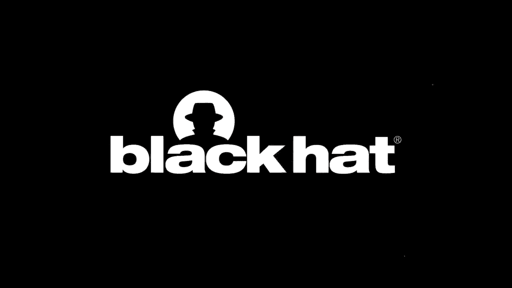

# P61：62 - You have No Idea Who Sent that Email - 18 Attacks on Email Sender Authentic - 坤坤武特 - BV1g5411K7fe

 Hello everyone， I'm Jai Jun Ten。

 Welcome to this talk。 Today， I'm going to share our latest work about email spoofing attacks。

 Email is widely used in our day life and is a frequently used attack vector or various attacks。

 In the past years， we have seen numerous attacks using email spoofing and phishing attacks。

 to compromise enterprise networks or government official accounts。 To address this problem。

 modern email services and websites， deploy sender authentication， protocols like SPF。

 DKM and DMARC to prevent email forgery。 In this talk。

 we will present a number of new techniques to defeat those defense。

 This is a joint work by three authors。 I'm a postdoc at the UPC focusing on HTTP and email security。

 Vern Paxson is my supervisor， he is a professor at the UC Berkeley and the original author。

 of the BRAW ideas。 Based on the BRAW system， he created a standard， cornet。

 which provides high-performance network， traffic and LSA solutions。

 Jai Jun is the senior director of engineering at F5。

 He has done some influential work in DNS and web security。 Okay， first， a quick question。

 When you receive an email， how do you tell whether it's a phishing email？ Normally。

 we would check the firm address displayed in the email client。

 If the firm address is legitimate or may believe it's not a phishing email。

 If we use email services like Gmail， we can also check additional security indicators。

 like mail-by or sign-by to verify the sender。 In this talk。

 we are going to present a number of new techniques to spoof those security fields。

 There is a spoofing test I did several months ago。

 Gmail shows that this email is sent from security@facebook。com。

 And it verifies that Gmail is signed by Facebook。com。 But in fact， it was spoofed by me。

 How could it happen？ Why Gmail didn't reject this message？

 We will answer these questions in this talk。 To understand this talk。

 we need to load two important concepts in the email protocol。 Sender and authentication。

 Let's look at the first one。 Here is an email example we often see in our day life。

 Who is the email sender？ The firm address we often see only represents the user who composed the message。

 There is another invaderable part called SMTP envelope。

 The hello and mail-from address in the SMTP envelope represents the user who transmitted。

 the message。 This design is similar to the mail in our real life。

 The address in the envelope and address in the message data can be different。

 This picture shows how a email is transmitted on the network。 First。

 Alice log in presenting service to send an email。 Then the email is sent to Bob's receiving service。

 Then Bob retrieves the email using his email client。 When SMTP's original design。

 it has a low building authentication mechanism。 Anyone on the internet can claim another address in hello。

 mail-from or from field。 For example， an attacker can claim he is Alice at 8。

com and send a spoofing email to Bob's， receiving service directly。

 The receiving service cannot tell whether the email sender is really Alice at 8。com。

 To address this problem， various email authentication mechanisms have been proposed。 SPF， DKAM。

 and DMARC are three most widely adopted protocols。 SPF verify the sender IP address。

 DKAM verify the email's signature。 DMARC is designed to fix the alignment problem in SPF and DKAM。

 We will talk about the alignment problem later。 Let's look at how those three protocols work。 First。

 SPF use IP address to authenticate the sender。 It works in three steps。 First。

 the sending service publish DNS record to specify which server IP are alone to send。

 the email for this domain。 When receiving the email。

 the receiving service will acquire this domain in hello and mail-from， field to obtain the IP list。

 Then the receiving service will check whether the sender's IP matches with the obtained， IP list。

 if yes， SPF pass。 So SPF insurance is at only authorized IP can send the email for this domain。

 DKAM use public key cryptography to authenticate the sender。 It works in four steps。 First。

 the sending service publish their public key in DNS record。 When sending an email。

 the sending service will use the corresponding private key to sign。

 the message to generate the DKAM signature header and attach it to the message。

 In the DKAM signature header， two tags are very important。 DKAM represents the sender's domain。

 S tag can be any character， it's used for sub domain。 When receiving the email。

 the receiving service will acquire S。 domain key。d to obtain the， public key。

 S and D are extracted from the DKAM signature header。 The key is a constant。 For example。

 in this case， the receiving service will acquire any data domain key。 8。

com to obtain the public key。 Then the receiving service will validate the DKAM signature with the obtained public key。

 If the signature is valid， the email pass DKAM authentication。

 So DKAM ensures that only the person who knows the private key can send the email for the， domain。

 Unfortunately， Liza's SPF nor DKAM provides a complete solution to prevent email spoofing。

 because SPF verifies the hello and mer from identify。

 DKAM verify the dick failed in the DKAM signature header。

 Liza of them verify the from address that is displayed to the end user， which means。

 even if a email pass both SPF and DKAM validation， the from address can still be spoofed。

 DMAK is designed to fix this problem。 First， when the sending service publish DMAK policy。

 the receiving service must perform， identifier alignment test to check if the from header domain matches SPF or DKAM verify。

 domain。 Match means exactly match or have the same rejected domain。

 Another important point is that DKAM only require either SPF or DKAM shoe a positive result。

 This design is intended to provide more robust list。 For example。

 for 40 the email SPF may fail but DKAM will survive。 If both SPF and DKAM fail， DKAM fail。

 then the receiving service will enforce the policy， specified by the domain owner。

 Such as rejecting the email or sending failure reports。 Here is a email authentication flow。

 When the receiving service receives a email， SPF components will check hello and mer from， identify。

 DKAM component will check the DKAM signature header。

 DKAM component will check alignment with the from header。

 If the email pass either SPF or DKAM authentication and the from header pass the alignment test。

 the email pass DMAK authentication and then it is denivered to the end users anyway。

 So the flow sounds good。 What could possibly go wrong？ We found 18 attacks to bypass authentication。

 The key idea of our attacks is to exploit inconsitencies between different components。

 as shown in the picture。 A email sent by the sender's MUA need to be processed at least 6 different components。

 before reaching the recipient。 Those components are often viewed by different developers or different companies and have。

 a wide range of imaging consensus which can be exploited by attackers。

 An attacker can craft an ambiguous message with multiple identifiers。

 Completing A may take one identifier but component B may take another identifier。

 This can cause semantic ambiguity and lead to authentication bypass。 In the following talk。

 we will talk about several examples to illustrate the problem in detail。

 The first example exploits inconsitencies between SPF and DMAK。

 SPF or SMTP defines two different identifiers。 Hello and welcome to represent the user who transmitted the message。

 SPF standard requires SPF verifers to check both of them if either fails， SPF fails。

 DMAK standard requires DMAK verifers to use a MUAF run for alignment test。 If MUAF run is empty。

 then use a halo。 The problem is that if SPF verifers halo and DMAK use MUAF run to check alignment test。

 it can cause ambiguity to bypass the authentication。 Here is one case we found。

 An attacker sets a MUAF run to be a line exist subdomain。

 SPF component cannot verify the MUAF run address and can only verify the halo identifier。

 because the nixis subdomain doesn't have any SPF policy。

 Then the SPF component will afford the halo authentication results to DMAK。

 DMAK components however still use a MUAF run domain to perform alignment test because MUAF。

 run is not empty。 So in this case， SPF verifers pass because halo domain is under attacker's control。

 DMAK verifers pass because MUAF run and firm header has a similar adjusted domain。

 The second example exploits inconsitencies between DKM and DNS。

 This is the bug we demonstrated at the beginning of this talk。 Here is how the attack works。 First。

 an attacker constructs a SPF message and assigns a message with his own private。

 key to generate DKM signature header。 In the DKM signature header。

 he specifies the DTAC value as bank。com and the S tag to include， a neural character。

 When the receiving service receives the email， the DKM component will acquire S。domain key。d。

 to obtain the public key。 But when the DNS component resolves this domain。

 it passes the neural character as a screen， terminate。

 So the public key is actually obtained from attack。com。 So in this case。

 DKM will pass because DKM components use attacker's public key to verify， attacker's signed message。

 DKM will pass because the DTAC domain is equal to the firm header domain。

 The third example exploits how SPF and DKM forward authentication results to DKM for the。

 alignment test。 The privacy defines authentication results header for communicating those results。

 Here is an example of the authentication results header。 In the header， SMTP。

mil from and the header。d represents the SPF and DKM verify domain。

 So the demand component will extract those two values to check alignment with the firm， header。

 Another important information in the header is the parenthesis。

 The content in the parenthesis means a comment which should be ignored by a demark。

 Here is an example we found to exploit this forwarding process。 First。

 an attacker construct a SPF message and assign the message with his own private。

 key to generate the DKM signature header。 In the DKM signature header。

 he sets the DTAC value with an open parenthesis embedded in， it。 When receiving this message。

 the DKM component queries s。domain key。d which is attacker's domain， to obtain the private key。

 And it generates the following authentication results header。

 When receiving the authentication results header， the demand component pass the content。

 after the parenthesis as a comment and take bank。com as the DKM verify domain。 So in this case。

 DKM will pass because DKM component uses attackers public key to verify， attackers message。

 DKM will pass because DKM component uses the first part of the DTAC domain to check alignment。

 with the firm header。 Similarly， an attacker can also set the parenthesis in the Merphraum field to bypass the SPF and。

 demand authentication。 SPF verify the entire domain。

 but a demark only takes the first part for the alignment， test。 In addition to the parenthesis。

 an attacker can also use single code or double code to， replace the parenthesis。 Okay。

 in the previous slides， I pressed the three attacks that exploits inconsistencies。

 in a single implementation。 In the following talk。

 we will show attacks exploiting inconsistencies across different， vendors。

 which are more diverse and hard to be fixed。 Now， I will hand it over to Jen to show how those attacks works。

 Thank you， Jengri。 Next I'm going to present a number of attacks we categorize as UAM mismatch attacks。

 In this attack， the attackers will craft email messages that are containing two identifiers。

 One is the attacker's identifier， another is the SPF identifier。

 In the way that receiving service will recognize the attacker's identifier and the。

 for verification and the pass the verification。 However， the recipients， MUA。

 will pick up the SPF identifier and display it to the recipient。

 So the first example of the attacker was just simply send an email with two firm headers。

 The first is the attacker's email address。 Another is the SPF。

 The receiving service is a DMACC component。 In some of the implementations。

 they were just to pick up the first header and verify， that and that will pass， of course。

 But some of the mail user agent will pick up the second one to display。

 That causes the phishing effects。 Some of those combinations are not vulnerable to the simple format but we find other variations。

 that are able to attack those。 So one of those variations is that you could use a nine-folding format in the first header。

 and some of those DMACC implementations will recognize the nine-folding format and still。

 verify that。 For some of those mail user agents， well even they are programmed to pick up the first。

 firm header but in this case， they consider this nine-folding from header is independent。

 So they pick up the actually the spoofing identifier to cause the attacks。

 Another variation is to utilize the normalization behaviors。 In this case。

 the attacker sent still two firm headers。 The second one is containing a space in the header name。

 The receiving service will recognize the first one and verify it actually won't be able to。

 recognize the second one as a valid header but when it forward to the MUA， it actually。

 normalize the header and to remove the space and the MUA will pick up the second one to， display。

 The previous examples use multiple firm headers。 Finally。

 there is another technique you could use some other headers。 In the email protocol。

 it defines three types of headers that you could send the identifiers， in。

 This is from sender and recent from。 So for some of those MUA's。

 you have this kind of implementation behavior that if they， cannot find a from header。

 they will display sender or recent from。 So in this example。

 we show that the attacker proft a two headers message when it's from。

 with a nine-folding format and as a sender。 And the demark implementation will be able to recognize the from in that format and verify。

 that。 However， the MUA won't be able to recognize the from so it will sync this email does not。

 have a from header， then it will display the sender header。

 There are some other variations of this type of things of multi headers but not only just。

 you could send the multi headers to queries or some securities。

 Even you only allowed to send one from header。 It's still possible to create this type of ambiguities because of the processing complexities。

 Take a close look of the from header syntax。 It is actually a surprisingly complex。

 So the from header is defined with four portions and each portion you could put some kind of。

 identifiers in different places and the parser needs to be correctly picking in this case， a at a。

com as a real address but many parses behave differently。 In addition to that。

 there are a number of string related kind of traps that could mix， things even more complicated。

 For example， you could have Unicode characters。 You could have like encoding。

 You would have this kind of special characters put in those from header values to complicate。

 the parser。 We actually find many cases that you can craft to create this type of inconsistencies between。

 the mail server and the email client to launch the UMS match attacks。

 The first example of one of the show is just simply put two identifiers in the from header。

 and some of the implementations will pick the first one and some of those will pick the， second one。

 Next example is you could craft a from header with the route portion and some of those implementations。

 they will practically recognize this is a route portion so they won't pick up the first。

 one as the identifier but some of those implementations that don't support about portion。

 they will just sync this is the second one as the actual identifier。

 And you can also use big 6 base 64 encoding to send multiple identifiers and some of the。

 implementations they will try to do the big 64 decoding so that they could recognize the。

 encoded identifier but some of those implementations won't so that they can only recognize the。

 now encoded identifiers that also creates a inconsistency spaces。

 There are some other kind of format to create this type of inconsistencies like using special。

 characters would and so on so I'm going to skip those details actually we find this UMS。

 match attacks is prevalent among the combinations of those implementations and we find 43 out。

 of 82 different combinations that can be exploited in certain ways and and our test is。

 actually not compressed efforts that that are likely in more cases of those things。

 Please read our papers for more details about this attack。

 The previous attacks is actually not perfect in that if a user is careful enough they will。

 check the indicators they will say although it is displayed as a spoofing identifier but。

 it will show that it is either signed or sent by the attackers to man。 However。

 there are certain other kind of attacks we found that could have the spoofing identifier。

 and the attackers identifier share the same domain。 For example if some attacker at gmail。

com can spoof email from admin@gmail。com that could。

 cause same amount of damage as the spoofing a different domain。

 The house those attacks can be launched。 Of course you could think about you might be able to simply log into like email provided。

 like a gmail and try to send the email using the admin@gmail。com but that simple attack。

 won't work most of cases because the sending service were likely to perform some kind of。

 verifications on the claim they are from header so that it matches the actual user account。

 But since we have presented the processing and the extracting of the identity is actually。

 a complex process that the sending service can also make mistakes。

 So using the previous techniques is that when a attacker could create a situation that the。

 sending service will sync it verifies as the attacker@gmail。com as the sender identity but。

 however the MUA will pick up another one。 For example admin@gmail。

com as the displayed sender and in this case because of the attacker's。

 domain and the spoofing target is domain is the same so even you check those security。

 indicators you won't be able to recognize any kind of suspicious evidences。

 And we actually found using the previous techniques to craft the email seven out of eight email。

 providers are vulnerable to this type of attack。 And one exception email provider is actually not vulnerable because it will always try to。

 reset the from header no matter how you craft from an sender those type of headers they were。

 just reset the from header as the actual user account which in this case the attacker's account。

 With that kind of defense forces us to think more about how we can actually attack that。

 particular email providers and we come out with a more complex format of attack。

 So this attack combined two steps the first step is that the attacker will log in to this。

 email provider and send to himself an email crafted using this format and the from is。

 a tiger at gmail。com and the tool is victim at victim。com but since in the envelope the。

 received to is a tiger at gmail。com so this mail is actually going to be delivered to the。

 attacker himself。 And in addition this email provider will actually provide a valid DKM signature by signing the。

 from the to and the content。 So in the next step the attacker will using his own email server to send a the signed email。

 with the smart to it。 The smart to it is to add another from header so it actually goes back to our previous attack。

 techniques is this additional from our header creates a ambiguity between the receiving。

 service and the MUA of the victim in that the receiving service will verify the DKM。

 signature using the attackers identifier which is the original assigned identifier so that。

 is a DKM verification will pass and is the MUA will display the admin at gmail。com in。

 this case and then that will becoming a spoofing email to the victim。

 With all of this attacks we consider this why this could happen as soon as the ultimate。

 problem is the complexity so in the email protocol we think there are three sources of。

 complexities one is that you have multiple identifiers in the email protocol and it is。

 easy to have discrepancies in consistencies of which identifier to use。

 The second is the syntax of the identifiers can be complex that the processing is not。

 easy to make it right。 The third one is that in the email systems why email messages processed by multiple components。

 and all of those components need to have some kind of agreement on the identifiers they。

 recognize so that the whole some of the assertions security assertions could be hold。

 Those are the sources of those inconsistencies come from and from a different perspective。

 you should just make it simple to remove those complexities。

 What we think is that when you design a protocol not only you want to make the protocol to。

 be correct but also want to make the protocol to be implementation friendly make it simple。

 make all these messages well typed and easy to parse and you also should try to reduce。

 or avoid multiparty processing that you need a multiparty to have some agreement。

 Two parties is good enough if you have three party four party needs to agree on something。

 that likely to have some issues and generally when you do the parsing it should be strict。

 on what you accept and reject any kind of suspicious format you would like to avoid this。

 kind of parsing issues。 The second point we wanted to bring up is that we found the user interface of email is not。

 sufficient to have some kind of security assurance so even for a security professional it's not。

 easy for them to use any kind of security indicators to show this if this email is trustable or。

 not I think there are plenty of spaces to improve in that direction。

 Finally for the end users we would like to remind that don't blindly trust the email displayed。

 in your web mail or email clients try as much as you can to verify why the email is trustable。

 and also we wanted to advocate using a PGP as a secure email mechanism because PGP is。

 the authentication in PGP is much simpler in that it provides an end to end authentication。

 only involving two parties and also the identifiers more likely more robust from those inconsistencies。

 It can have its own problems but hopefully better than the standard email protocols。

 We have connected all of the test cases and put it together into a tool we publish on GitHub。

 for those interested to play around please check this link。

 That's our presentation thank you very much。 The response for our disclosure yes we have disclosed all the attacks to the active vendors。

 and we actually tested 20 mail services and 19 email clients and most of them recently。

 respond our report positively and or accept Microsoft and a Yahoo said they are fixing。

 them or they have fixed them and Microsoft said he doesn't consider this report as a。

 valid security report because they don't consider the social engineering attacks as a secure vulnerability。

 because this email movement often uses the first phishing attacks。

 Yahoo didn't consider this attacks because they think our attacks later on DNS is a configuration。

 so they just the e-glorum I report。 The second the question is has this report been discussed in ITF？

 We didn't report this paper to the ITF but I searched our paper on the internet and found。

 there is a discussion in the TMAK working group and this is an implementation issue rather。

 than a specific issue so probably they have discussed this。

 Gender of course the discussion link in the chat box。

 Related to that JUNJIN there's a question about if DKIM SPF DMARC are all properly implemented。

 and if the MUA has strict for all RFC compliance can email still be spooked。

 Yeah it depends on what do you mean by properly implemented。

 Our attacks exploit inconsistencies between two different components in the email processing， chain。

 So some messages are actually valid messages for example a message with a from header with。

 two address in the from header and this is actually an RFC compatible message and that's。

 different components may recognize a different identifier in the message。

 For example you may recognize the first one MUA may recognize the second one。

 Let me answer another question which is has there been any effort to make zik or snort。

 detection for these techniques。 I can't speak to snort。

 Z of course is near and dear to what I do in the carlight and the from correlates perspective。

 and no not yet and the main reason is we rarely have visibility into clear text as email on。

 the wire it's usually inside TLS and so there's not an opportunity to look for these things。

 In environments where that changes it would be interesting certainly to set up such techniques。

 Okay。 Yeah we have so many questions and so little time。

 Yeah yeah but we will answer the question in the in the channel after this video in the。

 chat box one by one and feel free to follow the Twitter on call at or my Twitter to ask。

 me and questions and we will also provide all the materials such as the papers our tours。

 and slides if they use the blackhead and slides in the channel box and so make a switch about。

 those materials。 Great。 Thank you very much folks。 Yeah thank you。 [SOUND]。

