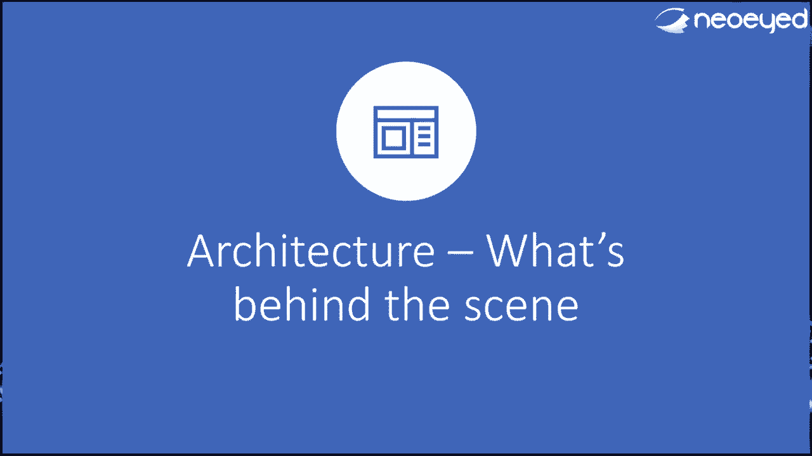
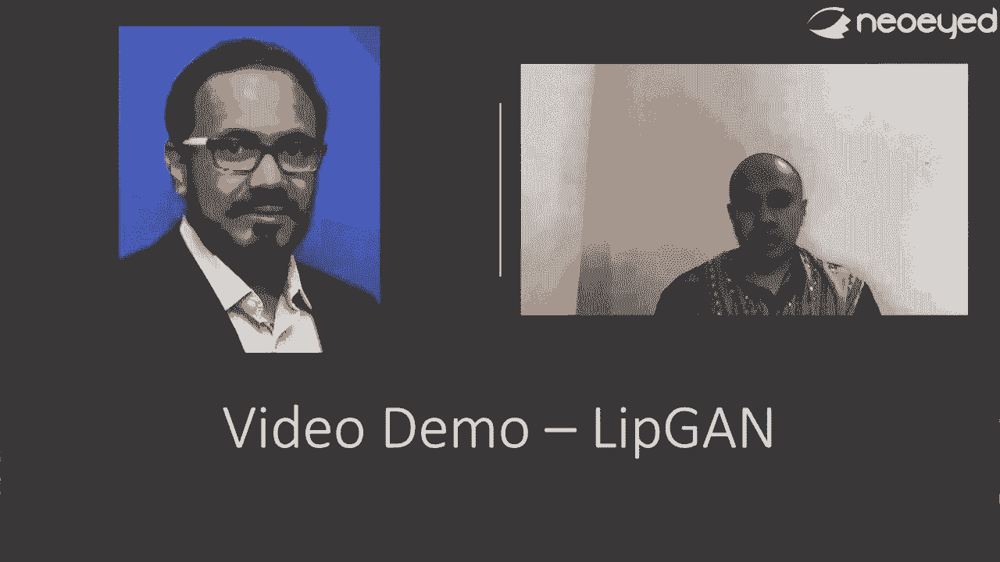

# 【转载】Black Hat USA 2020 会议视频 - P63：64 - How I Created My Clone Using AI - Next-Gen Social Engineering - 坤坤武特 - BV1g5411K7fe

 Hello everyone。 My name is Tamagna Basun and I am here to talk about how I use AI to。

 clone myself in the digital chat。 So let's get started。 So briefly about me， I am the。

 CTO and co-founder for new and my prelectricates of experience in this industry。 Currently。

 I work on new ad as a CTO and apart from that， obviously， I kind of advise a couple of startups。

 and our mentor first-hand force cybersecurity course as well。 In terms of domain， I do work。

 in cybersecurity， machine learning and I have been working in various domain like finance。

 insurance， gaming， e-commerce， etc。 And I am a frequent speaker of all multiple conferences。

 I have done it in past and primarily I did it because of obviously as part of my community。

 activities so that we learn from community and we also try to give back to the community。

 So moving on， as part of our current company， what I do is we actually work on a science called。

 behavioral science or behavioral analytics as few of you might be aware of that subject。

 But what I do is we actually try to profile a person based on the behavior they do。

 they acquire over the time the habits they acquire on devices。 For example， how you type。

 how you pull the phone， how you walk。 All these are unique for each individual。 So together。

 we capture all these kind of parameters and try to build a profile of a person， a behavioral。

 person and use it for protecting your identity so that if someone tries to impersonate you。

 we can identify based on the behavior saying that is that you or is somebody else who is trying to。

 impersonate you。 And why this is important？ Because that's what also sets the background of this。

 this talk。 So today's agenda is this we'll be talking about obviously the background， the demo。

 the architecture and as I mentioned， now I'm releasing the code。 So I'll be showing。

 you know the code base and obviously the next steps， what are the next things can be done。

 and see if any of you would be interested to contribute to this or not。 I'll be more than happy。

 to collaborate and I know secure support of this。 Great。 Moving on。 So the inspiration was two part。

 One was as I was mentioning while working in new art， where we're trying to do behavioral analysis。

 So one said we were trying to use behaviors to protect your identity， to prevent identity fraud。

 So our objective was can I use AI to identify if there is any fraud or impersonation happening or。

 not。 Now while doing it， we got this other idea also more from an adversarial aspect saying that。

 okay， what if we use it to replicate an identity？ What if we can use it to clone someone？ Right。

 So that is the kind of idea we had and you know， obviously the， it got kicked by this episode of。

 Black Mirror， which was that she says into first episode called Be Right Back， where the story goes。

 like this lady Martha， she lost a boyfriend Ash on a car accident and she was very upset and。

 obviously she was trying to get back to life but could cope up with depression。 Now there was a。

 futuristic company which kind of an approach to her saying that I could bring， we could bring back。

 Ash to you via chats， via social media， via video or audio and stuff like that。 So she registered。

 and the first interface became a chat interface where she could chat with Ash over the same。

 some sort of messenger and moving from there it became a phone call where they upgrade to。

 an ex-plan where you know you can actually have a phone call with Ash， with Ash's voice and then。

 obviously finally there was a 3D kind of model that's actually a person comes。 So that's how the。

 story goes。 So definitely this is actually a kind of a hit me and I thought okay。

 why don't you start， like the same way and see if it's possible or not。

 So I started like a small experiment， that's how， it started。

 So here is a quick chat about I created and I just want to show some of the sample chats。

 which a conversation happened between a human and the bot。 So where it goes this is the first one。

 So here the left side of the screen was bought and the right side was a human and this human is。

 a co-founder of mine， LSCO。 So this is a discussion how it unfolds。

 So LSCO asked something start and， then this is start work。 Then the bot says， LSCO is bought。

 this is a guy when nice to meet you， bot， nice to meet you too。 So what can I do be a better bot？

 So I'm not a bot。 This guy become， like you know say I'm a long person。

 So you can see it is able to handle some sort of chat chats。

 a little bit of sarcasm as well and then the human says really then it emphasizes， I say yes。

 I'm not a bot。 So nice to meet you。 And then comes and he seems like an intelligent guy。

 I says I'm glad you noticed。 So where are you？ I'm at Kevin。 No， where are you？ Outside。

 So it looks like a very general conversation。 Now what LSCO tries to do， it tried to get into。

 little more knowledge aspects of the bot。 So what he asked that you know are you an intelligent guy。

 can you tell me about something？ I was a security person。 Bot says no。 Then this is a。

 quantum physics。 The bot says yes。 I'm a quantum physicist。 Then he asked， okay can you explain。

 particle and time？ Bot says I have no idea what that means。 So yeah， and then says you are not。

 a quantum physicist。 So you're a bot then。 Yes， I've been told so。 So this， this， there is a funny。

 aspect。 There is a sarcasm。 There is a normal kind of chat chat is happening。 Now there are further。

 conversations happened on the similar line with other people。 This is another person， a discussion。

 happened between bot and another person。 And this guy asks， how old are you？ Bot says。

 some sort of funny joke is just a number。 He also has those。 But how old are you？ What do you think。

 how old I am？ I say 18 and then it cracks a joke。 It says， you know， it sounds like， you know。

 I can crack a joke for you。 This is another person and this guy tries to become little more。

 philosophical。 So he says， you know， okay， fine。 Is that a philosophical question？ But there is a。

 no， it's an interesting question。 And I'll do the， and there's some random， discussion。

 So that's again， a behavior at which I have， let's say， when I talk to my friends， you know。

 randomly， you know， switch the topic， show some sort of sarcasm and be funny at times。

 So definitely it looks like， you know， those kind of flavour of behaviors is。

 is able to replicate here。

 Right。 And here is a small social proof of that。 The idea was， when I built this sort of beta。

 testing， I tried with a close group of friends。 And when I said friends， they are all working。

 professionals， interpreters， as well as cybersecurity experts who are friends in my network。

 I've just， given them this， bought over a WhatsApp or Telegram， and asked them to chat with it。 And。

 and in our common friends group， this is the view of the friend has responded back saying that。

 you know， they feels like it looks like， you know， it's， it's not a part， but they thought it's me。

 actually， is chatting with them。 Right。 So， so although， I'm not saying that I have passed。

 that here in this， but but definitely this gives me a two-sum extent of satisfactory。

 result of feelings saying that， okay， fine， you know what it looks like， you know， it's， it's try。

 I'm trying to achieve a part of the objective which I have。 Right。 Now。

 now here is a small video demonstration taking it to the further。 So， let me show you the further。

 now what kind of final outcome we're looking at。 And this is actually a part which is actually。

 talking about video。 Hey， how's it good？ Good。 How are you？ I'm doing very well。 Thanks。

 How are you？ Good。 Okay。 Hey， need some help if you don't mind。 Tell me。 Well。

 it's a bit awkward to ask you this really sorry。 Right。 So。

 we will see this demo further more details， but you can see that， you know， it's quite。

 quite achievable and it's something， you know， I'm able to do with with with the video and audio。

 So that's that's that's the ultimate goal I had。 So， my ultimate objective was， can I build。

 an avatar of mine， let's say， which can be used to actually have a conversation over text voice。

 and video as a channel。 Right。 So， that's what an alternative。 So。

 so let's dive into the architecture and see how this has been played。 Right。 So。

 at the entire project， I've kind of， you know， split it in three parts。 I call it the brain。

 the voice and the face。 Right。 The brain is the engine， the NLP engine。

 which is the crux of this entire project where it knows a sort of， you know， what kind of。

 discussion， what kind of questions and what kind of answers I should give， how we should。

 generate answers in what can take such a general chances and when I'm generating or I'm responding。

 to somebody or， you know， creating an answer， it should resemble some sort of some part of my。

 behavior， right。 So， this is this is something， this is the crux of the， the entire thing。

 And in the next part is the voice and the face。 Right。 So， the voice comes， which is about the。

 voice cloning where I can try to then clone my voice and see that we can talk like in an audio。

 which sounds like me and finally the face where， you know， can it be in my face， you know。

 my appearance。 Right。 Now， just to mention here， we guys already know about， you know， defects。

 right， or defect or voice， defect on face and audio。 So。

 there are a lot of videos like that has been there。 So， as I said。

 I'm not here to make another solution which is better than what is there， in the industry。 So。

 I'm pretty sure defects or， you know， voice cloning the different neural network。

 but it was there is fine， which is much better and， you know， perfectly fine。 The point here。

 I'm trying to make is， is can I make it interesting？ Can I make it more lively？ Now。

 in the chatbot domain， this kind of concept is called open domain chatbot。 Now。

 this is one of the most difficult area of research where can I build a chatbot where， you， know。

 best one with an LNP and neural network where I can have a free flow discussion， right。 So。

 that's what is the part which 80% of the time I've spent doing this research， right。 So。

 let's dive into this part and see what exactly I've done。 So， the brain， when I talk about the。

 brain， right， it is an engine which learns from my past behavior。 Now， it's a past behavior。

 It's just my past conversation。 So， what I did is in terms of in a nutshell， is basically。

 I've kind of extracted out all my possible， let's say， chat histories， which I have used， you know。

 I've kind of spoken to different people in Facebook， WhatsApp， LinkedIn， or email， and I've kind of。

 collected all this data。 I have processed this data， created in a meaningful manner saying， okay。

 you know what， this is， this is kind of a disemple data which you should betray。 And with this data。

 you should understand that my way of saying things， right， is so that， you know。

 somebody who has already spoken to me in past and the person again tries to talk to me。

 the person should get the similar feeling， right， in terms of your discussion。 Now。

 then I fade into various kind of model。 And this part was a tricky part because， honestly speaking。

 there was not much good model I was getting。 So， basically， I tried multiple model。

 sequential model neural machine， an empty model， and then rule an intent-based model。

 This is a model of various kind of ways of， you know， generating text， right， in NLP for family。

 with NLP， these are these are various ways you do it。 But overall， the idea was actually。

 we use a sequential model。 We tried to feed in some context to that and then generate an output。

 Now， the output， as I said， wasn't always good。 So， what I tried to do is basically。

 I created multiple model， feeding the data whenever there's an input comes， it generates an output。

 which is a response。 And then looking at the confidence score， find out what is the best possible。

 answer which I could get and then give them back to the system。 So， that's a very basic。

 explanation of how it works。 So， this is the training part。 One of the training is done。 We。

 generate the model and we do it。 Now， the problem with this is all this model are good in terms of。

 it is able to get the， let's say the utterances， the words， kind of words are used and stuff like。

 that。 However， most of the time it is not able to generate a sentence which makes sense。 So。

 it generates a collection of words but those words together doesn't form many full standard。

 sentence in that context。 That was one of the challenges I had。 And that then made me。

 take a different route for this approach。 And this is where the next category of approach。

 which I'll be spending time on。 So， what I tried to do first is I tried to look into this data and。

 categories them into multiple branches saying that， okay， when I'm having some conversation。

 what kind of conversation mostly I had or I'm kind of， you know， I can feed this into。

 in different buckets。 So， there are four categories。 Possibly I could identify one is， chit chat。

 Chit chat is nothing but simply hi， hello， how are you， those kind of discussion。

 Second is historical data。 Historical data means this is something I have spoken or I have told。

 Or I kind of had this conversation on this context。

 And the same kind of question was asked to me again。 Right。 So， so maybe， you know。

 something which somebody were， you know， can I come to your house， today and， you know。

 or shall we meet tomorrow？ Right。 So， something like that， which is， which。

 is already been discussed or probably， you know， on a specific context， I don't care fine。

 I'm going to this hackathon。 Are you coming to me， coming to join me？ Something like that。

 Now comes， that's called category two。 Now the category three was topical factual， something。

 like basically how is the weather today or what is SQL injection or probably it could be， let's say。

 okay， how long it will take for you to come from Bangalore， something like that。 Right。 So。

 there is some part of knowledge is required for that。 That is category three。 And category four。

 was pure generative， philosophical， anything which is not the category one to go through。

 which is which is a free flow chat。 Right。 It could be， you know， what is the purpose of like。

 what is love， you know， define life， something like that， something， you know， generic。

 So these are all the four categories。 And what I， I try to do is， I realize that， you know， when I。

 I try to create two different treatment for this different category。 And that's how we can actually。

 you know， I try to get a better response or better result of this， this engine。 Right。

 Now how do I handle it？ This is how I handled it。 So Rasa is an open source chat。

 chat board framework， using which you can actually create a chat board。 This is most we use for。

 let's say， not open domain， but close domain chat board where actually you have some specifically。

 say， a hotel booking board or some business solider board to blast it。 Now how it works， it has。

 basically there are four， three， four properties。 First is called intent。

 Intent is nothing but okay。 What the user is want to know or want to do？ What is the intent of the。

 user？ So for example， if an user is saying， hey， hi， how are you？ Good morning， some stall there。

 intent wants to greet me。 All right。 If a user says goodbye， good night， see。

 then which means intent means user wants to say goodbye。 Right。 So this is called intent。

 Now then you define， okay， if this is the intent， what is the response， I would， I should， I should。

 I should say， right。 If someone says bye， I should say bye。 If someone says great。

 I should say hello or how are you， or hi， just like that， right。 So this is the response you。

 define。 And then you club this， stitch them together。 So this is why you actually。

 this is called stories， this is called intent， this is called utterances and this is called stories。

 And this story is， nothing but you say， this is why you say， okay， this is the， if there is a grid。

 you should， to respond to it。 I don't do it。 If there is a thank。

 you'll play with utter no risk like that， right。 So that's why you club it together and say， okay。

 if users is by， what says by， users is， thanks， bots is no worries like that。

 So this is where the category one， the chit chat can be handled， because when it's chit chat， hi。

 hello， how are you， the， the majorly， the， the response will not， change， right。

 It will be the similar kind of response。 So I used Rasa for the category one， kind of records。

 Now comes the category two， which is history grid data。

 So this is where a lot of data processing comes。 So what I did is we， as I said， no， we used。

 multiple data sources like remind what's sub chat history， Facebook chat history， LinkedIn。

 no discussions or messages。 And we kind of pass all this together and， an annoying， I created this。

 this format， say， okay， this is the message and this is the response， which essentially means that。

 okay， this is what I was asked to me in past by somebody。 And this was。

 the response I have given in return。 So， so for example， someone says， thanks， boss。 Then I said。

 okay， why thanks？ This is a little bit of Hindi， but since sorry for not getting much involved。

 stuff like that， right。 So， yes， can we make late everything， I said， sure， come over。

 This is Hindi， right。 So， so this is what the format or the structure， I did the structure。

 we created。 Now， what I use this for now， there is another open source chat board framework called。

 chat bot。 I use this for handling this because what it does is this is where you can actually。

 give a connection of user a free flow question answer and get it right。 And what happens is。

 so that next time， if someone asks any of this， the first one， then the response will be second one。

 If someone says third one， response will be the fourth one。 So， like that， chat bot works。 So。

 this is where I handled historical data and the conversations。 We use chat bot for that。

 Now， third is the， if you remember， third one was the topic， asking the questions， right。 You。

 know how far Bangalore is from Delhi or how far less than you， is from California。 But what is。

 the time right now in in San Jose， something like that。 So， for that， we again use Rasa， but Rasa。

 has a different component called custom actions。 What is that means， this is where you define a。

 structure in terms of， you can call a third party API， right。 You can call a third party。

 service to gather data and using that data， you can actually identify the response and do it。 So。

 for example， this is one kind of action created， which goes in Wikipedia and get to get the result。

 out of Wikipedia。 So， if you ask something which is， let's say， what is， I don't know， maybe。

 same thing。 What is particle， quantum physics or particle entanglement。 It will probably go to。

 wiki and it will get the response and it will send it back to me， right。 So， this is called custom。

 actions。 That's what I used。 Now comes the fourth flow， fourth category， which is free flow。

 Now free flow is very interesting， as I say， this is where， you know， it can be any discussions。

 Now， for that， already there are two interesting， you know， model I found。 One is Pard AI。 Pard AI。

 is created by Facebook。 It's an open source free flow open domain chat world。 And these are some。

 examples given。 So， if you go to the website， you can actually see that， you know， this。

 this actually， talks in engineering。 So， this is not much other thing， but when basically， I say。

 can I have a dinner， and so it's a tough one。 Okay， interesting choice。 So。

 what question do you ask him？ Okay， I would， like to know how he came up with the idea for the iPod。

 Or to the iPod change the way of your， listeners。 So， you can actually have a discussion like that。

 Why did the mushroom go to the party？ I'm not sure， but I'm glad it did。 Like， no。

 it was supposed to be a joke。 Oh， sorry， I didn't get， it。 What kind of joke it was？ I like jokes。

 So， this is how it was。 So， basically， the blue ones are the。

 model and the the gray one is the human。 Right。 So， you can have a normal conversation here。 So。

 that is what you do。 However， there is another model I found which is called DialogPT， which is。

 created by Microsoft。 And this game also does the same thing。 And you can have， so， this is some。

 examples where you know you can actually see how it works。 So， you just， my money buy happiness。

 What just depends how much money you spent on it。 Right。

 This is what is the best way to buy happiness。 See。

 we just have to get a millionaire buy your early 20s and then be happy。 So， you can see that。

 Don't they just， there's two some extra and intellectual conversation you can have。

 And this is the two model we found。 Now， GPT has multiple version GPT and GPT two。

 And most recently， now， OpenAI has kind of about released， I think the GPT three also。 And that's。

 this much more bigger and better。 So， GPT is a model which allows you to generate text。 And what。

 they're saying now， the GPT three can generate any kind of articles， statements， poetry and stuff。

 like that。 So， it's， it's very interesting things are happening there。 Now， for free flow。

 I had these two choices。 And out of these two choices， I personally favored Microsoft DialogPT。

 Because Parley was good。 It has more， but it sounds more formal。 However， like when I'm talking。

 to my friends， this I don't want to be very formal。 I want to be more like in WhatsApp to。

 kind of a conversation。 Right。 So， DialogPT has that kind of an。

 intimacy in terms of a conversation。 So， overall， I kind of created this as an architecture。 So。

 the way it works is， we first is this interface。 So。

 I have exposed it towards WhatsApp and Telegram。 What's the white value on Telegram via flash？

 Because Python plus server， my book， we created。 So， we created an API gateway where this comes。

 And this is when the user identification happens。 So， based on the number or the user name。

 I recognize which is the user。 Because based on， that user， you can actually sell some context。

 Right。 The previous history， chat history of that， person that defines the context of our behavior。

 the data， which can put and then we do some logging， in store。

 Then it goes to Rasa and it first gets checked。 You know， is it a category one or category， three？

 And based on that， it responds back from here。 But it says， no， it's not cat one or cat three。

 then it goes to chat and bot for the category two。 You get the data back from here and then。

 it responds back。 And then for category four， it can use either one of this。 So， right now。

 I'm showing per day， the one， but this one also I've cut off， you know。

 in the process of integrating。 So both of these two guys can do it。 Now。

 what happens here is there's a scoring mechanism also。 So。

 what happens is it gets a response from here。 Every time I get a response from one engine。

 I check the confidence score。 If you're gonna set it's ratio there。 So， let's say the threshold。

 is 80 or higher， then only I'll get that acceptor response and send it back。

 Because if it may happen， that， you know， I'm able to get a response from one model。

 but the problem is， you know， it may， get a response which doesn't make sense。

 And the way to define is an obviously the confidence it， has on the response。 So。

 that's how the structure works。 Now， this was almost near real time。 So。

 we can actually have a conversation。 We could have a conversation over this interfaces and do it。

 So， that's what that's how it works。 Now， moving on， one thing was missing so far was context。

 So， if you see the data structure， so far， I've been just a Q and A kind of option。 This is。

 the question。 This was the answer。 This was the question。 This was the answer。 So。

 there was no way I could actually establish a context。 Now， this was another model I tried。

 and this was actually already there。 It's a transformer model where the idea is， let's say。

 there is a discussion happening。 You had a chat。 Now， whatever response you have given。

 the previous four or five or six defining， you can define what is the number of context。

 statements you want to do， those statements become the context for to get this as a response。 So。

 essentially， the idea here is saying that， you know what， I will only say this when I have。

 this as a context。 So， there is a discussion。 This is a history I'm talking about。 So。

 there could be references of something which are five-stick-and-back， and also you spoke about。 So。

 this context， this can actually give you a sense of conversation。 So。

 this is one concept which takes your chat from a Q and A perspective to a conversation perspective。

 So， this is what， again， another thing has been tried。 And unfortunately。

 I did not get good results。 However， it was okay。 So， this part can be fine-tuned and improved。

 which can be done。 So， overall， this is what generates the engine， the context， the chat engine。

 Now， moving on， the voice。 The voice part is there are primarily three models which I've tried。

 which is one is， TACOTRUN2， which is， again， you know。

 it's a Google publish this model for voice cloning。 This requires a lot of data。 So， I tried with。

 let's say， around 500 samples of my， talk I've recorded with， let's say。

 a speech with five to 15 seconds each， and then I tried， to feed in。 With TACOTRUN。

 I didn't get much good results because they say that I need at least， I don't know。

 maybe 10 hours of recordings， which is pretty tiresome for me。 So， I couldn't do that。

 Real-time voice cloning， the third one was a very interesting thing。 This is， which works at。

 a very less data。 And it actually can generate a voice which sounds like a cloned voice of yours。

 However， the problem is this， the pre-driven model was on the US accent， unfortunately。

 being an Indian， I have an accent problem。 So， my accent doesn't fit well there。 Now。

 that's why right now， as we speak， there's a training going on on the middle model， which。

 is called CycleGAN。 CycleGAN is actually a transformer。 So， GAN is actually a category of。

 known neural network， which is a generative adversarial network， which is basically what they do is。

 they actually transfer your properties of your voice to a pre-recorded voice。 And。

 and it's supposed to work with much lesser data。 So， this training is going on。 Although。

 there is too much of a error。 So， here is a small sample I could get。

 This is what I'm going to play， for you guys。 So， hear it out。 Please， original one。

 Printing in the only sense with which we are， at present concern differs from most。

 if not from all the arts and crafts represented in the exhibition。 All right。

 And this is the generated one， as of now。 So， as you see。

 there is too much of loss and it was actually not。 So， I could， I could make， I mean。

 figure out the wordings。 Sounds， sound， the voice for sounding is slowly getting towards。

 mile way of swaying。 However， you know， the clarity is missing and it's still getting trained。 So。

 I hope， you know， it will improve over the time。 So， so over the time， what， so this is the second。

 level of architecture on voice with it。 So， assuming this tackle， I have enough data， I can run。

 I'm pretty confident that this works。 Now， people have tried it。 And as I said， you know。

 my job is not to prove that voice cloning work because there's already a model。 It's a matter of。

 data and time and GPU and cost。 My objective was to build this chat engine or the conversation engine。

 which can actually have a conversation with you。 So， now， what I did， I club this thing together。

 and create this as an architecture where what you do is you can actually talk， say something。

 and it can do a speech to text conversion using Google's， Google's API， a speech to text。

 Then the text goes to this engine and this engine generates the response。 This response then goes。

 to that voice model and the voice will actually， you know， will take the text and generate a voice。

 out of output of that saying that send text， can that gets a reply impact。 So， while this is。

 happening， this training is going on。 Just for the demo， what I did is I used Google。

 this another hack I did， which is I used Google text to speech as a service。 And I try to take the。

 so， text to speech Google as multiple person。 You can actually figure out， get， define that。

 you know， you can， you want an Indian speaker， you want an Indian speaker with， let's say， a big。

 noley accent or let's say a south Indian accent。 So， I experiment with them and try to get one。

 which actually as a probably a similar accent or similar voice。 So， together with this， it can。

 actually， you know， create a voice engine which works perfectly fine。 Now comes the face。 This is。

 really interesting。 Now again， I say， the fake and those kind of things already there。 That was。

 not my objective。 My objective here was to， can I generate a face in the real， near real time。

 so that I can simulate a call， say a zoom call or hang out call。 And it should be able to say。

 whatever I know I want them to say in terms of lip syncing， in terms of， you know， generating the。

 voice and， you know， syncing the lips as if it looks like， you know， I'm saying that。 So， I have。

 used two， two lights， a project， there's a lip， kind of an audio driven talking to it。 Now， out of。

 this two， the， the lip gun was actually a project which gave some more， more realistic result。 So。

 so here is some demo。 So， initial first one is the audio driven talking， get post the first one。

 Hello， how is life， whether it's good today， when told so today， I am not a robot， who I am。

 where is your house？ As you can see， the face is a little bit shaky。 So， it is not actually giving。

 me a good result。 So， this is a second word。 Whether it's good today， when told so today。

 I am not a robot， who I am where is your house。 So， this was much better， but still， you know。

 I could see that， you know， there is a little bit of shake and it was， it was not very， very。

 convincing。 So， then the lip gun was more convincing。 So， these are the two demo。 First one was on。

 best generated from a picture。 So， let's show you how is it。 The environment's fact provides。

 it is one of the most interesting that I've been working before。 Okay， as you can see， the。

 lip movement was， you know， kind of realistic。 Now， putting it together on a video。

 this is how it looks。 The examination and testimony of the experts enabled the commission to conclude that five。

 shots may have been fired。 So， here you can clearly see the lip syncing was much better and it was very。

 convincing to some extent。 Right？ So， so definitely this overall， between these two model lip can。

 give us the much better result。 So， now， now I club this thing together。 Right？ So， let's teach。

 it together。 So， the winter flow， the way it works is first it is a set of brain which generates。

 the response。 Then it should go to the voice engine which will generate the voice and then it will。

 shoot， feed this voice into the to the face engine where it should take the face video and impose this。

 voice and it will do a lip syncing so that if finally I will get a video which looks like in real。

 time， you know， it's saying what I'm saying。 Now， how do I club it together for let's say。

 take it further？ This is where， you know， the next component comes which is the video streamer。

 cam twist with this。 What you do is I create an app which stream between two videos。 So。

 there's one video which is a silent video listening as if the time just， you know。

 staring at the camera and listening to what other person is saying。 That's a listening video and。

 what it does， you know， it keeps listening and saying， you know， that video gets played and。

 using cam two is time made it as a virtual camera to， to let's say hang out so that you know， hang。

 out to whenever switches on the camera somebody will see that this video streaming video。 Now。

 the other thing was this clone engine which is has a speech to text recognition and stuff。 So。

 the way it works is let's say I'm talking to you。 So， in hang out， you will say， hi， Basu。 So。

 my speech recognition module will take that。 It will generate the text。 It will go to the， engine。

 Engine will generate the response that will go to the video。 Video will generate the video。

 saying the response and then my streamer will switch from the silent video to the talking video。

 as if that， you know， I'm just talking it。 So， this is how this entire model work and let's see it live。

 in action how it works。 So， this is a call between LCO and me and instead of me， it was my。

 bot who is talking to LCO。

 Hello。 Hi， Basu。 Hey， how are you？ I'm doing very well。 Thanks。 How are you？ Good。 Yeah， tell me。

 Tell me。 Okay。 Okay。 So， how do you don't find it？ Okay， no problem。 Well。

 it's a bit awkward to ask you this feeling sorry。 Okay。 Sorry to ask this to you。

 I have no other options for now。 I am asking few， close friends。 Can you help me on this？ Okay。

 I just made it for this month to send me to view my approval。 I will pay back in 10 days once I get。

 from 4 to 2 for me。 Okay。 Can you please transfer me now？ I'll be doing it。 Use 4B also。

 Please say screenshot him on 7/1 set。 Okay。 Thanks again。 So， I want to see you in your life。

 I want to be once you are free。 Good job。 All right。 Bye。 Yo。

 you are the funniest person I have ever seen。 Right。 So， yeah。 So。

 this is what is a prototype which I've created。 Now， as you can clearly see， here， there's a gap。

 However， this gap was in terms of making the voice more convincing， making the facial expressions。

 probably adding some more emotions to the voice。 So。

 those are the things which is in the road map which definitely has to be done。 Now。

 if you really want to try it， this is the source code and this is in my JITAB。 Now。

 if you go to this JITAB， Titan Lambda， identity cloning， you get all the documentation。

 and the steps to set it up and run it on your own。 Right。

 Road ahead， as I said， you know， expression， you know， probably bypassing some biometrics。

 Those are the things we can try it out。 And as I said， I'll be happy to。

 hear your suggestions on this。 Now， last but not the list， obviously our vision was。

 create futuristic technology。 That's what is new ideas for。 And we are doing behavioral。

 biometrics and also prevention mechanism to switch kind of adverse reality。 So， we definitely need。

 support。 So， we're looking for， obviously， angels and other people who can support us。

 to build this kind of technologies。 Right。 These are various references and the community support。

 I got， you know， in terms of this idea to prototype and building and all this。 And last but not the。

 list， as I said， you know， I with my knowledge and understanding whatever I have。

 I would definitely， try to， you know， correct build it as a course， as a workshop， which I give。

 conduct and various times。 So， thank you so much。 I appreciate your time。 And yeah。

 please check out the repository。 Thank you。 Okay。 Hi guys。 So， thank you for watching。

 And I think I've already answered your questions， over the chat。 So。

 in case you have any further questions， you can reach out to me over email。

 or you can shoot me an invitation in LinkedIn。 So， I'm happy to connect and probably talk further。

 And if you have any quick question， I can answer。 Thank you。

