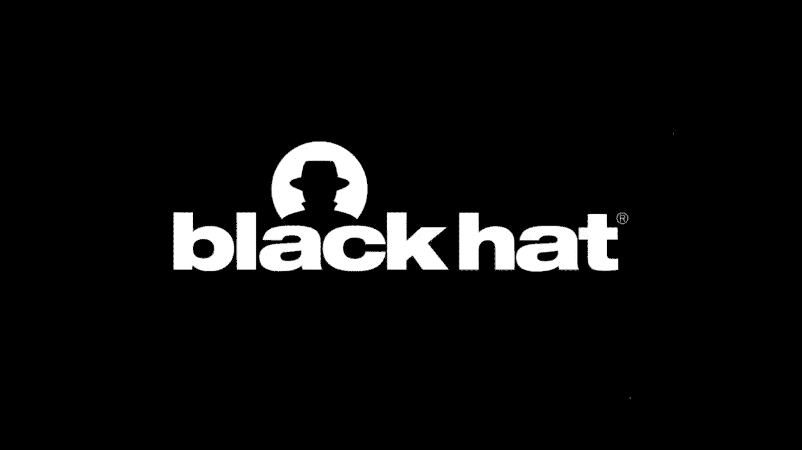
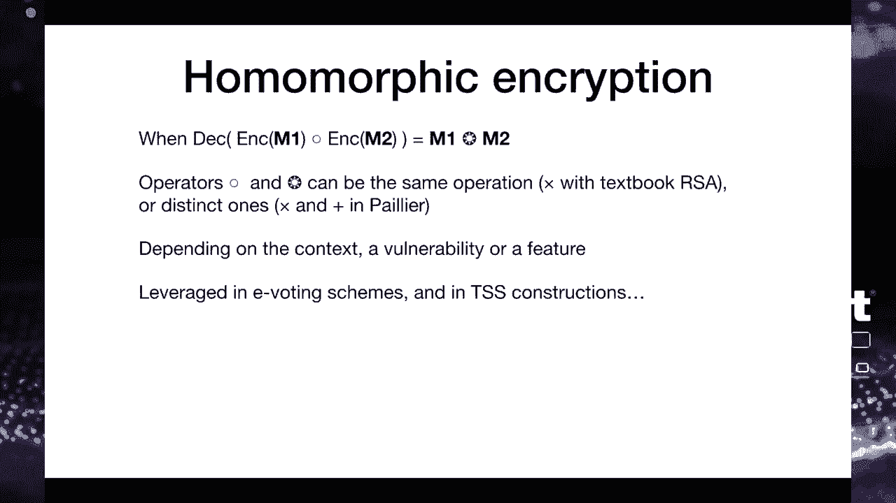
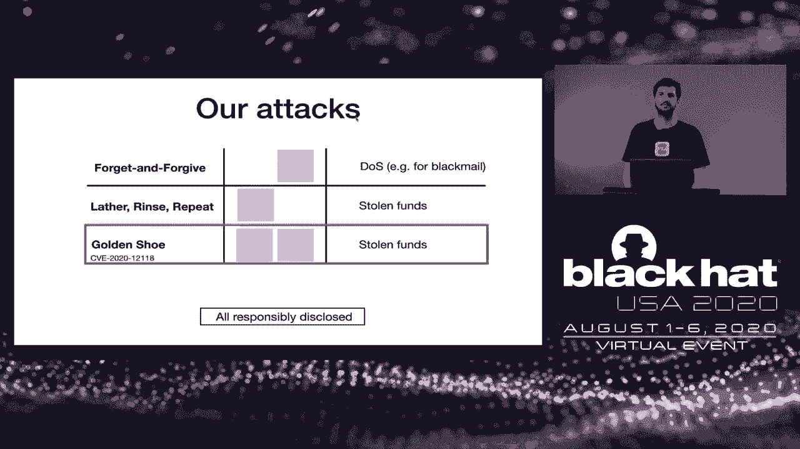
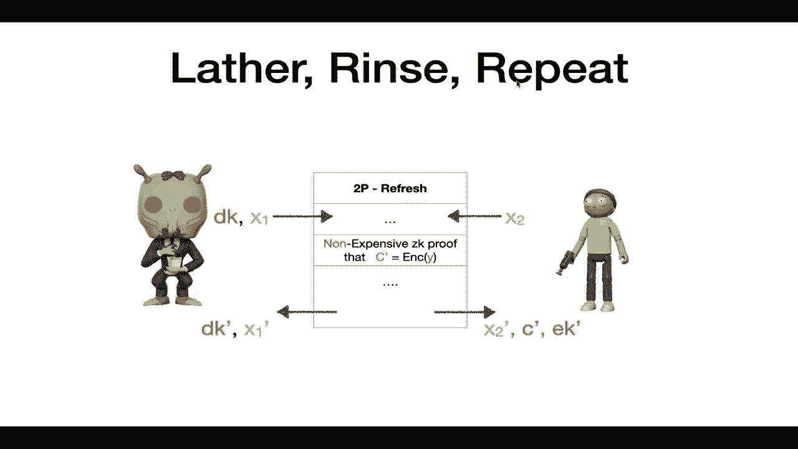
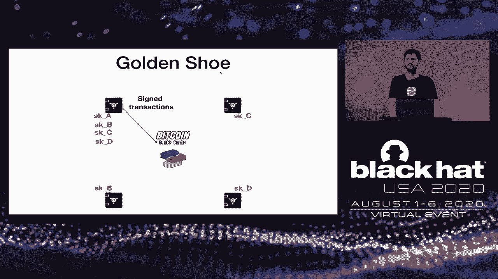

# 【转载】Black Hat USA 2020 会议视频 - P64：65 - Multiple Bugs in Multi-Party Computation - Breaking Cryptocurrency's Strong - 坤坤武特 - BV1g5411K7fe

 Welcome to our talk where we are going to present new attacks on cryptocurrency OS。

 So that is a joint presentation with Olga Shoma， a school discovered most of the attacks。

 that we are going to present today。 So we both have experience with enterprise OS and we are both interested by auditing。

 the security of social security crypto and VC product。

 So let's start with the basic notion that we only have so much time。 So first of all。

 what is a wallet？ So wallet is the way to protect your digital assets， your cryptocurrency。

 anything that， runs on a blockchain。 So as you may know。

 you do not literally store bitcoins as it is later。

 Instead you store the private keys that you will use to issue a transaction。

 So if you lose access to this private key， you will access your money and if someone。

 says you are a private key， then they can spend your money。 So you want to protect this private key。

 There are different types of wallets you might be familiar with。

 Mobile wallets that run on mobile phones， online wallets which are essentially with。

 notifications on the hardware wallets such as ledger or threads or devices which provide。

 you quite high security and with paperwells when you print out your key and you put it。

 in the safe somewhere。 So enterprise wallets specifically was used by banks and financial institutions。

 They have slightly different needs that we describe on this slide。

 Maybe the biggest one is the security and privacy requirement because if you are a bank and。

 you store hundreds of millions of data and you regulate it by some regulatory body in。

 your country and you are audited by auditors and you want to protect your privacy of your。

 customers， this makes things more complicated and slightly more interesting。

 So one of the things you have to do is distribute trust。

 So for example in Switzerland there is a regulation called 4i-CTRL which means that when you do。

 soil type of transaction you need at least two or three people to participate to give。

 their approval。 So in the context of cryptocurrency it means that you have different parties with different。

 credentials， different access rights to address a transaction and more generally you want to。

 distribute trust between different software hardware components in order to avoid a single。

 point of failure。 So one common way to do it is if you are familiar with Bitcoin it is multi-stinct。

 shares but it is sometimes complicated because it will require multiple keys， sometimes you。

 have a universal key and it works differently for different blockchain platforms。

 So ideally you want to have something that will work on different for different blockchains。

 Bitcoin， Ethereum and all the others。 So what we are going to present today is about MPC and TSS which are texting to distribute。

 trust not using hardware， not using procedures but using fundamentally cryptographic techniques。

 which is one of different approaches。 So what is MPC multipartic computation？

 So from a potential perspective it is a protocol， a system whereby you will receive the inputs。

 but in a way that is kind of encrypted in such a way you don't really know the input。

 values however you will be able to contribute the output the result of some function。

 So in this example we received the encrypted version of X and of Y and we compute the result。

 X plus Y for the addition。 Maybe you can guess how to adapt this for the context of what applications。

 So one way to use MPC for enterprise as well as is to split the key in different shares。

 in different values such as no single share of the key will give you the full key value。

 and the MPC protocol where we see the encrypted key share what different key shares and we。

 receive a kind of encrypted form of transaction and we will compute the sign of share without。

 seeing the key。 So it is not about decrypting the values and comparing them and computing the result。

 It is really about computing the result directly from the encrypted values without every decrypting。

 them so to speak。 Now the question is how do you adapt MPC？

 How do you do something that is really optimized for a system for the case when you want to。

 split the secret between let's say end participants but you only want to authorize a subset of。

 this participant to issue a signature。 That's what threshold signatures on TSS is about and you can see that it's a special。

 type of multi-party competition。 So here we usually use the notation T and M whereby N is the number of potential signers。

 and T is the minimal number of signers you need to issue a transaction。

 So in this example we have three individuals and one is potentially malicious where this。

 they look not retraspathy。 So we don't want to authorize one single person to say transaction。

 So we have a system whereby we need two parties to go over right together to issue a transaction。

 And here you can see that the two persons with the shares share two interest in blue。

 can walk together to sign a message without the approval of the pink guy on the left hand。

 So from a more prospective in TSS you will have for example these two signers each of。

 these two signers they will have a different share of the key which means that will not。

 have access to the full key。 They will receive the message to be signed and they will run a protocol。

 they will follow， a list of operations to walk together and compute a valid signature。

 Now you might ask okay but how do you generate these key shares？ How do you distribute them？

 The native approach is to do kind of ceremony whereby a centralized operator will generate。

 the private key and will split this key in different shares and distribute the key to。

 the signers but you can actually do a more decentralized， more distributed way to split， the key。

 It's called distributed key generation of an abbreviated DKG。

 So here the participants will walk together with full of cryptographic protocol to obtain。

 shares of a private key but in such a way that the private key， the master key so to。

 speak is never exposed to anyone。 So it's quite convenient because it really minimizes the exposure of the key so you don't。

 have to trust a single point and you don't have to write a recipe security because the。

 key is nowhere。 It kind of sounds like magic but as what Adven Scripto is about most of the time。

 So MPC and TSS is not just something that people write with such papers about， it's something。

 actually used in the real systems， in real cryptocurrency exchanges and a typical use。

 case is called storage systems where you have sometimes a single key， a single account。

 that stores really tons of money， typically tens of hundreds of minutes。

 So in this case you want to make sure that the access to these funds， the access to the。

 key is distributed among multiple parties， locations in front of the sharing case， at， an Oscar。

 a fire somewhere， you want to make sure that you will always write about your。

 funds and you want to avoid trusting only one or two people with your money。

 And you can combine this with different technology with smart cars， HSM， cloud HSM， even mobile。

 phones to have different type of platforms。 Now what about the crypto use in the other world？

 What do we need to build TSS？ So to be the source of signatures。

 of course you must have signatures somewhere。 So in the blockchain space there are two main types of signatures being used to ECSL。

 the， core DSA， which is using BitCointerium。 And now you find the EDSA and ED25-5-19 which are signature based on the Schnau–Sannin-Bradheim。

 which is slightly different and has the benefit of not using a non-snut using a unique number。

 of signatures which avoids some classic attacks。 And it also makes a great issue of keys and signatures easier which is quite convenient。

 when you do sources of signatures。 Another type of signature that we can decide is the BIA signature which works very differently。

 which are quite complicated because of the transcriptographic bearings。

 But they make the aggregation of different keys into a master key and the aggregation of different。

 signatures into one single signature much easier than classical signatures。

 So you may have heard about fully homomorphic encryption。 So here we don't do fully homomorphic。

 we are only interested in homomorphic encryption， with respect to one single operation。

 So the first line really defines what homomorphic encryption is about。

 You combine two separate texts， the encryption of M1 and M2。

 And when you decrypt the result you get a value that is the combination of M1 and M2。

 So you see that we use different signs， different operands on the left hand and right hand up。

 the equation because sometimes it's not the same operation。

 So if you consider textbook RSA which is quite insecure but which happens to be homomorphic。

 with respect to the nulls application then you multiply to ciphertext and what you then。

 is a valid ciphertext of the product of the two plaintext。

 But in biased encryption it's slightly different because you have multipleation on the one hand。

 and addition on the other hand which is very interesting features in many cases。

 So homomorphic encryption is also used in e-boting to combine values of voters and it's also used。

 in some TSS constructions。 Commitment switch is not just that this probably is familiar to many of you。

 So I know if you want Twitter but sometimes you will see people mischievous posting hash。

 values and they will suggest that it's because they have found some zero day but they don't。

 know the zero days so they post a hash that later on they can show you the stuff they。

 hash to demonstrate that they found the zero day themselves。

 So it's a kind of commitment in the context of crypto commitment is slightly more involved。

 technique with more formal definitions and security properties but ultimately it's the， same。

 So initially the setup is about the rules of the game which function you're going to use。

 The commit phase is when you commit to some value X here and you also use a value R to。

 randomize the process and the opening phase the real phase is when you really in these。

 two values thereby allowing the verifier to check that the value that you committed to。

 see matches the X and R to just publish it。 To this one is not going to surprise you with talking about social signatures and of course。

 we use somewhere a threshold secret sharing and specifically shami scheme which is maybe。

 the most common and the most non-construction which relies on polyurenta pollution。

 So here would be a reminder you have a secret you have a strain and from this secret you。

 are going to generate a list of for example five different values and in such a way that。

 for example you need three of these values to reconeter the secret but such that one or。

 two values will not leak any information on the secret value。

 When violent that is often used in a TSS construction is verifiable security sharing。

 So just move by and where the owners of the shares can verify when they reconstrict the。

 secret that the correct secret has been reconstructed and particularly the other participants have。

 used a valid share of the secret and not any random value。

 So come on VSS game is by film man it was a designer thinking the less in the later 80s。

 and it's actually based on homomorphic encryption。

 So last but not least zero knowledge proof and modulate zero knowledge protocols。

 So you might be familiar with intuition of a zero knowledge proof which is approved that。

 listen and information on the stuff that you're proving is for example used in privacy oriented。

 protocols such as Z-Galsha moneroom。 In this case you want to hide the money being transferred at the address of the sender and。

 recipient yet in such a way that participants can verify that this money has been sent somewhere。

 and that everything is correct in sound。 So journey is a lot of proof is about proving a mathematical statement such as a result of。

 any question without leaking literally any bit of information yet in such a way that the。

 proor cannot cheat but that they can prove any correct value to be correct and that any。

 incorrect value cannot convince a very fire that is correct。

 In the context of blockchain you would often encounter NIZK non-interactive zero knowledge。

 proof which is just a block of data instead of being a protocol with multiple rounds you。

 will just send one piece of data which would be your proof。

 So you don't have to run multiple round tricks you just have to send one piece of data。

 Okay so now based on this preliminary I will let America present the attacks on the VSS。

 I would like to start with describing the general setup in which our attacks take place。

 Starting from the left we have a user communicating with an exchange。

 The user in the exchange run a two-party key generation resulting with the user getting。

 a secret key share SK1 and the exchange getting a secret key share SK2。

 The user deposit funds to his address and from that point can initiate orders。

 Each order comes with a signature generated by running a two-party signing between the。

 user and the exchange。 On the other side the crypto exchange runs an infrastructure to manage access to its liquidity。

 As part of this setup there are several sites that together can authorize the transfer of。

 large amounts by the requirements of the exchange。

 We are using a hot wallet and cold wallet to express the frequency of the use and mention。

 it since this is the terminology used in the industry but it is not a trail event to our， attacks。

 Therefore we are actually looking at two subsystems。

 The hot subsystem on the left is usually based on two-party protocols where we need to protect。

 from a failure of one of the parties。 The cold subsystem on the right is spreading security to multiple sites。

 The number of sites or parties can vary as well as the robustness。

 The guaranteed security for this setup using TSS is that even if a single key holder is。

 compromised the attacker gains no advantage。 In our attacks we demonstrate our attacker with full control over only a single party can。

 break the security of the TSS。 For simplicity we assume that the exchange is compromised modeling either an outside attacker。

 or some insider threat。 We can describe our attacks in the context of the hot and cold subsystems。

 In this talk we will describe three attacks。 The first one walks in the multiparty setting。

 It will result in private key division which means the exchange funds will be permanently， locked。

 The second attack named Latherin's repeat walks best for the two-party setting。

 It allows the exchange to extract the key of the user and steal its funds。

 The last attack Gordon Shoe fits well in both settings and walks by sending a women jenneled。

 message which gets all counter-pathies to send the attacker their secrets。

 We conducted a responsible disclosure of all three attacks。

 The first attack was found in an open source library of one of the biggest crypto exchanges。

 However， it was found around a week after the library became public so we assume no one。

 was using it。 The second vulnerability was found in an open source code by a big MPC company。

 We were told that the code used in their product is different and therefore no one was actually。

 affected。 The last attack was again found in an open source library of a big crypto exchange。

 You can check out the CV for details。

 Before diving into the concrete attacks we want to give another eye level analysis of。

 the root cause for that tax。 Here the rows describe different characteristics common to most threshold cryptography or TSS。

 based protocols。 At first TSS protocols are interactive。

 They progress in rounds of communication between the parties。

 While in modern cryptography we usually get a single party to generate a key and sign locally。

 here we must have interaction。 This is essentially all that was needed to mount the first attack。

 TSS often makes use in some cryptographic primitives which are not common and not used by many。

 This makes them hard to understand or to nail properly how they work。 Finally。

 it is important to note that in the real world where an attacker can attack any。

 one of the participating parties， a party cannot assume anything about the correctness of the。

 messages it receives。 This means that for any message sent the sender needs to attach a proof that the message。

 was computed according to the protocol。 One common way of doing it is using zero knowledge proofs。

 Some of which are tailored to proof statements on particular messages in the protocol。

 The first attack， as we mentioned before， works best for the call setting。

 In fact we want to focus on a protocol for curotation。 This is a common industry practice。

 If every safe holds a secret chair SK we want the protocol for all safes to change their。

 secret key shares but still maintain access to the funds locked under the joint public， key。

 Putting it simply we want to move from the red set of secret keys at time t to the blue。

 set of secret key shares in time t prime。 This is a basic requirement for such a system because otherwise a single attacker will be。

 able to systematically compromise side by side until uncovering the full private key。

 We call this attack forget and forgive since parties are forced to forget the keys。

 Ending up in a situation where the actual distributed key is lost。

 Now let's move on to describe the low level details。 A morti in our scheme is an honest party。

 We use a setup with three parties， A， B and C。 Instead of secret key share SK let's say that each morti holds some personal number。

 XA， XB and XC。 We have invariant which is the sum of XA， XB and XC。 Here equal to Y。

 Our task is to replace or in other words refresh each of XA， XB， XC with a new XA prime， XB prime。

 XC prime while keeping the invariant on the sum of X primes to be equal to Y。

 For that we use a cryptographic primitive we mentioned before called VSS which stands for。

 Vifibras Secret Sharing。 We let each morti distribute secret shares such that their additive value is equal to。

 zero。 In the figure we are only demonstrating it for the multi holding XC。

 This multi will generate RCA and RCB sum to zero。 Such that when we sum all secret shares the contribution will cancel out in the total sum。

 Each morti will collect all the secret shares he received and will add them to a secret， XI。

 As can be seen while XA prime and XB prime have changed， summing now all X primes we get。

 that Y prime is equal to Y as required。 So are we done yet？ Not exactly。

 We still need to delete the old secret shares。 Now this is where it gets interesting。

 Delitting is a step that cannot be reversed。 We ask how does a morti knows that it is safe to delete the old secret share。

 The answer should be that each morti needs to make sure all other mortis also think it。

 is safe to delete。 So in fact we have an extra round of communication that is hidden in。

 In the system that we attacked this step was missing。 Let's see the attack。

 We start the same as before with establishing the secret shares XA XB XC。 However。

 now a malicious party represented here by Conville is Daniel on top， taking。

 over the multi that holds XC and can send different messages to different parties。

 In the figure the left side multi gets a correct message and therefore deletes his old share。

 However， the multi on the right gets a corrupted message and decides to abort the protocol。

 Keeping is old history。 While not visible in the figure it is important to say that a multi detection of a corrupted。

 message is enabled due to the check done as part of the VSS primitive。

 As a result the invariant is now broken。 Y prime is no longer equal to Y and the key is effectively deleted。

 The outcome in practice is that by trying to refresh the private key shares we end up with。

 a situation where it is impossible to recover the private key or to put it into any use。

 such as to sign transactions spending the amount looked under the original private key。

 A smart attacker can leverage this situation to mount a ransom attack。

 Attacking enough parties such that all honest parties cannot reach the required threshold。

 to execute a signature without the involvement of the attacker。

 For example the attacker can require half the locked amount to publish its secret key。

 So we now move on to describe the next attack。 We are now focusing on the hot wallet scheme with the exchange and the user both hold secret。

 shares of a private key used to sign transactions on the blockchain。

 This example the exchange really is the sign transactions to the blockchain。

 Here again it is important for the parties to refresh their secret shares every once， in a while。

 It could be after every transaction for example。 Conceptually this is the same as what we saw before。

 Concretely though we are looking at a different protocol。

 Earlier we assumed that the key material needed to be refreshed is a single random number。

 But sometimes there are some extra artifacts that must be refreshed as well。

 This is the case with this attack。 Let's look at the concrete details。

 So here multi on the right and RIC on the left are two parties playing the exchange and the。

 user in an honest execution。 We start with a two-party key generation。

 We treat a protocol as black box as the specific details are not relevant to the attack。

 What is important to note is that as part of the output we introduce another crypto system。

 multi on green which is a momorphic crypto system。

 In particular RIC generates a private key and multi learns the corresponding public key together。

 with a ciphertext C。 This ciphertext is an encryption of RIC secret X1。

 For completeness let's imagine how a two-party signing protocol would look like。

 Again treating the protocol itself as a black box。

 Multi inputs a message to be signed M and both inputs are outputs from the key generation。

 As a result both get a signature。 However we want to focus on the refresh protocol。

 This can be seen。 If we want to fully refresh we need to also refresh the momorphic crypto system parts。

 Otherwise the signing protocol will simply not walk or another option is that an attacker。

 will be able to attack one party after the other。 Breaking the cryptographic guarantees of the rotation。

 While clicking on the refresh protocol we see that as part of generating the new state RIC。

 must prove to multi that the encryption was done in a proper manner。

 That is proving C prime is an encryption of X1 prime without revealing X1 prime or the。

 decryption key DK prime。 The problem is this zero knowledge proof is highly expensive。

 In the code we examined a shortcut was suggested。 The idea is really cool and is using the momorphic properties of the encryption scheme。

 In short instead of proving C new C prime structure from scratch we can just prove a relation。

 between C new and C old。 Unfortunately they use the wrong proof。

 What they achieve is that the attacker can now convince the other party really efficiently。

 that the ciphertext is an encryption of anything。

 So this is how the exploit works at a high level。 We require multi to allow us to call two party rotation and two party signing multiple times。

 Each time we will change the encrypted value and try to obtain a signature。

 We get some information from each such query， hopefully one bit until eventually we are able。

 to extract large parts of the private key。 To summarize this attack we started with a system that distributes the signing between。

 the user and the exchange。 When we allow to rotate the private keys the exchange hijacks the user secret key。

 Which means it now can sign transactions without the user involvement at all。

 Effectively an attacker that attacks the exchange will be able to extract all the keys。

 of all the users given enough time， breaking the distributed trust guaranteed from the cryptography。

 We named this attack latherines repeat since to mount it we required to run two protocols。

 Therefore lather and rinse and repeat them many times。 We now move on to describe the last attack。

 If you recall this attack works in multiple scenarios。

 However we chose to demonstrate it in the specific case of four parties running TSS。

 among themselves whenever one of the parties needs to sign a message and send it to the， blockchain。

 To explain the attack we recall that in our kind of free life protocols it is required。

 that every participant must prove each run each computation according to the protocol。

 In the first attack this was part of the VSS where each party sent a proof together with。

 a random value。 In the second attack it was the zero knowledge proof。

 In the current attack we describe a step like this was missing。

 It is not all the time that the concrete vulnerability can be derived directly from a。

 missing zero knowledge proof。 But here we show one such example。 Let's look at the details。

 So here Rick's play honest parties。 There is first a setup phase。

 This happens during the distributed key generation。

 Each party generates parameters NH1 and H2 and share them with the other parties。

 In the figure we show it only for the Rick on top。

 These parameters will later be used by the receiver to generate some proofs in the distributed。

 signing。 During signing each party takes the NH1 and H2 received from each counterparty， probably。

 now saved in memory and sends some proofs using these parameters。

 In the figure we use F31 to abstract the exact data sent from the left trick to the Rick on， top。

 What is important to our attack is that this is a function that depends on NH1 and H2。

 Therefore the attack goes in two steps。 At first， during key generation at the beginning of time。

 the attacker sends NH1 and H2 to the， rest of the parties。

 There can be anything because there is no check in the implementation。

 The second step is to receive proofs from all the parties during a single threshold signature。

 From each such proof the attacker will extract the secret key share。

 To summarize this attack we start with a key distributed between the different parties。

 After the attack all key shares will be copied into a single location which means the attacker。

 will be able to sign transactions ignoring all other parties。

 We derive the name of this attack because a simple one time message at the game time lets。

 one party with it all。

 Next up is JP with some recommendations。 To conclude we would like to share some general advice to help you avoid the kind of security。

 problem that only I've just described。 First of all minimize complexity which quite common place in security and it's easier said。

 than done but it's still important to assist the source of a lot of headaches and wasted。

 time at this perspective as a security auditor。 Another descriptor is by definition quite complex as you've seen but you can still minimize。

 sometimes the complexity by avoiding implementing useless stuff。 For example。

 only implementing what you need and also by avoiding useless levels of abstraction。

 by not introducing new terminology or new notation。 For example。

 by using the same symbols as in the paper it makes things a lot easier。

 The second point here is about languages about cutting。

 I completely agree with Moxys point where he says that culture should be optimized for。

 readability instead of writeability。 What it means is that instead of aiming to have the most elegant or the most conscious。

 code you want to prioritize called clarity as it will make it much easier for the auditors。

 for anyone to understand what your code is doing and also to find bugs there。

 So be it purely logical bugs or bugs specific to the language being used。

 This part is about a class of bugs that we found and which are related to the understanding。

 of the academic paper。 Sometimes the academic paper that you implement is very correct in terms of academic correctness。

 but nonetheless ends up in something completely unsafe。 So how can it happen？

 So there are three main classes of problems here。 The first one is the fact that the papers will usually not describe how you encode data。

 how you pass the sterilize data and that's also where a lot of security problems happen。

 Also some papers describe a protocol in terms of generic security level but without giving。

 you a concrete instance without giving you concrete parameters。

 It's your role to find the good parameters， the choice of primitives for example which。

 a ticker of two years which has function two years which key size to use。

 So you want to make sure that you pick parameters that end up in a skin that is secure enough。

 For example if you aim for one to one bit security level you want to make sure that all。

 your components will guarantee this security level。

 And the third bullet here in computer confusing definition is illustrated by this example of。

 a zero knowledge proof of factorization whereby a proof to verify that they know the factorization。

 of some RSC models。 So which means without leaking the factors。

 The problem here is as you can see in the small screencap there's a common input capital。

 and the problem is that the authors of the paper had one understanding of common input。

 but they did not describe it in the paper。 So what they understood is that common input was a value magically given to both the prover。

 and verifier beforehand and not controlled by the prover。 However。

 the implementer the understood that common input was just a random value， potentially。

 chosen by the prover。 The problem is that issue doing this way it becomes completely insecure and completely。

 broken because anyone can forge a proof。 So that's a very good example of something that is safe on paper and completely insecure。

 in practice。 So to conclude this part maybe a disclaimer we don't mean to recommend against NPC and。

 TSS。 These are really great technologies that can sometimes provide you with much higher security。

 level but at the same time they are also relatively recent in terms of real world applications。

 and we are still learning a lot about how to improve their security in terms of procedures。

 and in terms of court safety。 So if you have questions about this talk feel free to contact us directly you will also。

 find more details in the paper and I would like to thank you for following this talk。

 in this unusual setting。 Thank you very much。 Hello everyone。

 I don't know how many is watching here。 We have few minutes left to take questions。

 I'm looking at the swap-gart thing。 I don't see many questions。

 Maybe what we can say after this presentation is if you are using this kind of solution or。

 if you are using different solutions from our experience in practice what is very important。

 even if you use NPC or TSS if you are this kind of distributed decentralized setup is。

 still very important to make backups and to have VCP DRP plans because you always have。

 some key to product and it might still happen that some of these devices go offline or that。

 you do not accept these devices。 So you always need to have backups where you use TSS or some of this。

 It's not a trick to avoid making backups and having a proper recovery system。 No， not questions。

 comments。 And also what may be obvious but that we want to say if you follow the news recently there。

 has been some 51% attacks on Ethereum+ PC， so of course you can throw crypto at the actual。

 wallet with some TSS NPC， you name it but if you have an attack on the blockchain behind。

 if the blockchain sucks then no amount of crypto in your wallet will save you。

 So you also want to be careful with which asset with which cryptocurrency you walk and also。

 if you have some privacy， if you have some currency that is not an only message just。

 Bitcoin then NPC will not protect you against it。 That's quite obvious but where can we find a link to the paper？

 A good question， it should appear on the Black Hat website in the next hour or so maybe tomorrow。

 usually they'll usually put it online the day after or two hours later。

 We just put the slides online， there's the link on my Twitter and in the swap counter， interface。

 So you can look for it and then again if you have questions everything feel free to contact， us。

 I would be happy to talk about it， you see we like talking about crypto but blockchain can。

 stop us so。 And so we have the paper online， we have documentation on GitHub as we can see on the。

 chat。 So yeah， hope it was useful to you and hope to see online or in person next year on Black。

 Hat。 Is this looking for questions？ Oh， have you seen any of these attacks in the wide？ I have not。

 I don't know if Omer has a different perspective。 the parameters can be avoided by creating stories and HSNs。

 Yeah， if you put keys and HSNs， you need to use dedicated， you got to use hardware and， HSNs。

 which can get you quite a high level of security and you。

 also combine special secret thresholds and issues with HSNs。 So you can。

 it depends on your use case or you're on your model， on what you need， in terms of hot wallet。

 cold wallet。 So， all the broken code open source， to most of it。

 we did not do reverse engineering from binaries to look at this code。

 Any cryptocurrency more than variable？ Not really， so in this case these attacks。

 they are specific to the wallet technology， they are not directly tied to an specific blockchain。

 they are related to one's tiny screen， so they might apply to a CSA， the 25-19。 So。

 motoring about cryptocurrency security， no specific comment， it's hard to tell。

 I want to say that about the question of how many cryptographers are involved in。

 development of such libraries， so it's really good question because to find， cryptographers。

 the particular photographers， they are there。 So usually the structure of such companies that you have one cryptographer that actually。

 is doing the work and then one or two that is doing formal auditing。

 and you probably also have your code reviewed by some other， like the theoretical cryptographer。 So。

 it mostly comes down to battle testing your code， so this is where I think most of it。

 most of the stuff gets exposed。 So， someone asked if we've looked at another custody cloud-based wallet solution that I made up。

 the name， we have not， I don't know if it's open source， and I don't know much about it。

 We are close source。 Nothing to it。 Such attacks。 Well， mitigation， good security as a process。

 maybe do some updates， and hire good people in test your code， understand what you're。

 and hope for the best。