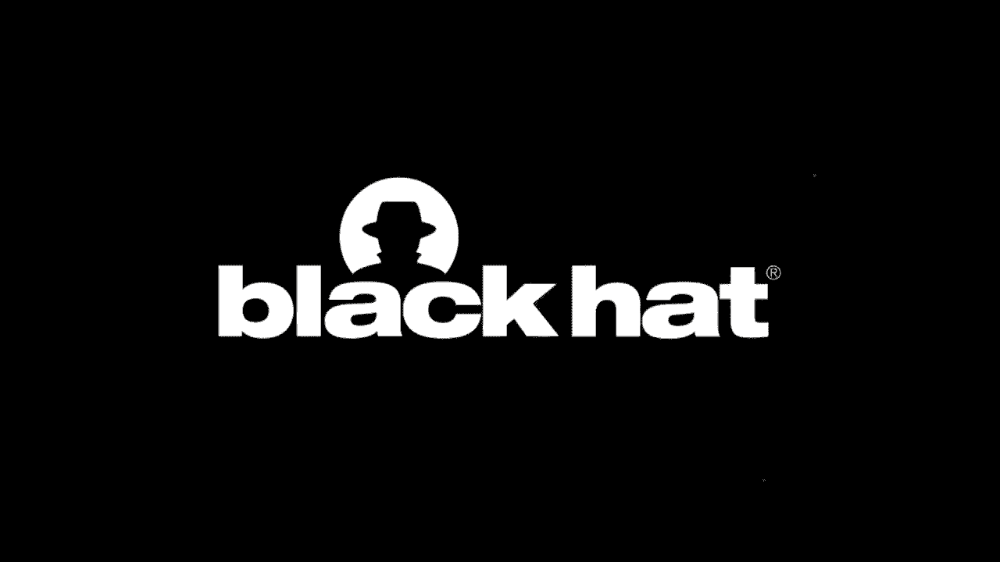
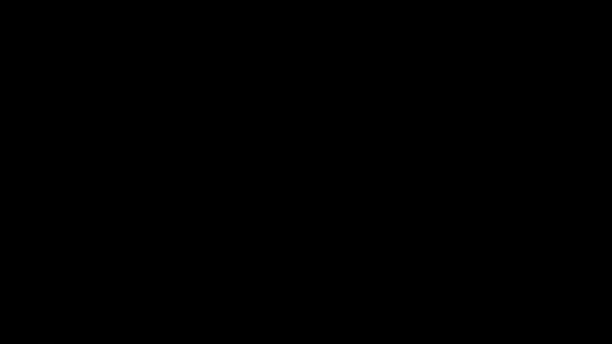

# 【转载】Black Hat USA 2020 会议视频 - P65：66 - Detecting Fake 4G Base Stations in Real Time - 坤坤武特 - BV1g5411K7fe

 [ Music ]。

 >> Hi， thank you for coming to this Black Hat virtual event。 Today。

 I'm going to be talking to you about detecting 4G， base stations in real time。

 My name is Cooper Quintin。 I'm a senior security researcher with the EFF threat lab。

 I have a toddler which should explain the amount of dad jokes， you'll hear in this presentation。

 And I'm a former teenage phone freak。 I spent a lot of time making multicolored boxes back in the day。

 which might explain why I got into this work， that I'm doing right now。 If you haven't heard of EFF。

 we are a member supported nonprofit。 About half of our funding each year comes。

 from individual donations from our members。 And we defend civil liberties as they intersect with technology。

 So we think that things like your right to privacy， and freedom of speech come with you online。

 and exist in technology as well as in the real world。

 And we've been doing this work for 30 years ever since 1990。

 So we have quite a lot of experience under our belt。 Although， of course。

 I haven't been there that long。 I work in the EFF threat lab， which I'll get into in a moment。

 But first， I want to talk about my colleague Yomna。 And I want to thank her profusely。

 None of this research would have been possible， without her hard work and dedication。

 This is as much her project as it is mine。 And unfortunately。

 she couldn't be here on the stage with me， today。 But if you see her in the virtual halls of virtual Black Hat。

 please buy her a virtual beer or a follower on Twitter， @rivalelf。

 And this is an actual photo of her。 She is indeed a very excited sentient radish。

 So what is threat lab do？ Threat lab looks at technology that targets at risk people。

 This is activists， human rights defenders， journalists， domestic abuse victims， immigrants。

 sex workers， minority， groups， basically anybody who is at risk of oppression just。

 for simply being who they are or having the beliefs， that they have。

 The goals of the technology that oppresses these people。

 are typically to gather intelligence on them or spy on them。

 especially if they've left the borders of the country。

 making it harder to spy on them through traditional kinetic， means， locating， storing， harassing。

 basically stifling， freedom of expression and human rights of people， that you don't like。

 And why do we do this work？ Well， cybersecurity and antivirus companies。

 mostly care about the types of malware， that affect their customers。

 And this is usually enterprise customers， things like ransomware or banking， Trojans。

 financial attacks。 These are the sorts of things that affect their customers。

 And while these things are important， we get to care about the types of technology。

 that infringes on civil liberties of human rights， of at risk people。

 We like to think of ourselves as the security team。

 for the people who need it the most and yet can afford it， the least。

 And we get to do this by virtue of working for a nonprofit。

 We don't have to worry about keeping and growing， our paying customer base。 What are our goals？

 Well， first and foremost， we want to protect people。 We want to make sure that people are。

 able to express themselves freely， make sure that people are not having their human rights。

 violated， and make sure that people feel safe and secure。

 in their computers and in their technological lives， and in their real lives。

 We want to broaden our communities'， understandings of the threats and defenses， that they face。

 We want our communities to know what the capabilities are， of the threat actors targeting them。

 who those threat actors might be， and what they can feasibly do to defend themselves。

 We want to expose bad actors。 We want to make sure that the types of people that。

 are using technology to violate human rights and freedom， of expression get exposed。

 Whether they be cyber mercenaries， or whether they be governments that， are violating human rights。

 we want， to make sure that they're named and shamed and not allowed， to do their work with impunity。

 And of course， because we're legal nonprofit， we want to make better laws and better norms in civil society。

 so that this sort of thing doesn't keep happening。 In the past。

 we've worked on a couple of projects previously。 One is by my colleague， Eva Galpren。

 and this is the coalition against Stockawear。 So Stockawear or Spassware is a type of malware。

 that specifically is targeted against that you， would install on a family member or a spouse。

 or a significant other to spy on them， to control them。

 This type of malware wasn't previously classified， as malicious by most antivirus vendors。

 It was classified as a potentially unwanted program。

 and we saw a problem with that because it's clearly malicious。

 Eva did a lot of lobbying along with the coalition， against Stockawear and got antivirus companies。

 to start marking Stockawear as malicious as they should。 In 2018。

 we spoke at Black Hat about Dark Caracal。 This was a threat actor that was operating spying。

 on civilians in Lebanon and was also， linked to a threat actor that was spying on civilians。

 and human rights defenders and journalists in Kazakhstan。 We were able to track this actor down。

 to operating out of the headquarters of Lebanon's general， directorate of general security。

 And we think that it was a freelancer， moonlighting， for Lebanon， Kazakhstan。

 as well as doing criminal work。 So there's a lot more detail about that in the report。

 which you can find on the EFF website。 But that's not what I'm here to talk about today。 Today。

 we're going to talk about cell site simulators， also， known as stingrays or MC catchers。

 We're going to talk about how they work， what the previous efforts have been to detect them。

 We're going to talk about a new method that EFF， has come up with to detect them。

 And we're going to talk finally about some ways， that we think we can fix the problem once and for all。

 Before we get into it， I want to give you a little bit， of terminology。 First， we have the UE。

 which is just the phone。 It stands for the user equipment， but every time I say UE。

 just know that I mean your phone。 The MC， which is the International Mobile subscriber ID。

 This is the ID for the SIM card。 It's burned into the SIM card。 It's unique to each SIM card。

 The IMEI， which is the International Mobile Equipment， ID， this is the ID for the hardware。

 the ID for the phone that's again burned into the phone， and doesn't change。

 And it's unique to each phone。 The E-node B or the base station。

 this is what the UE is actually communicating with。 This is what's attached to the antennas。

 This is the first line in the cell network。 The ERPSEN or EARFCN is a frequency。

 that the UE and the E-node B are communicating on。

 And a sector is a specific antenna attached to a base station。

 And each base station can have multiple sectors。 The MIB is the master information block。

 It's broadcast by the E-node B and tells the phone。

 where to find the SIB or system information block， which contains details about the E-node B。

 such as the cell ID， the MCC， the MNC， and the tech， which stand for the mobile country code。

 the mobile network， code， and the tracking area code respectively。

 And then these are identifiers that let the phone or the UE。

 know what carrier owns this base station， what country it's in。

 what and what geographical location it's in。 And then the PL/MN is the public land mobile network。

 This is just a concatenation of the MCC and the MNC。 I'm also going to use the terms MC Catcher。

 Stingray， Hailstorm， Fake Base Station， and Cell Site Simulator， interchangeably。

 These don't exactly mean the same thing。 Stingray and Hailstorm are brands of Fake Base Station。

 or Cell Site Simulator。 And MC Catcher is one of the things that a cell site simulator， does。

 but not all MC Catchers are full on fake base stations。

 Some of them operate passively and don't ever transmit。 But I'm going to use these interchangeably。

 and I think for the purposes of this talk， that's fine。 Also， I apologize for this acronym soup。

 that I've just thrown you into。 It was just painful for me to learn about it as it may be for you。

 to listen to this talk。 But I think you'll pick it up pretty quickly。

 So this is a quick diagram of the LTE network topography。 We have the user equipment or the phone。

 which connects， to the E-node B， using the LTE protocol。

 The E-node Bs exist in a part of the network called the EU Tran。

 And then the E-node Bs talk to the back end， which， is the Enhanced Packet Core or EPC。

 The Enhanced Packet Core contains the Mobility Management， Engine。

 which is responsible for the authentication， and some of the protocol messages。

 And the EPC also contains things for billing， authenticating the user。

 routing back to the IP network， or back to the phone network， and the data gateways。

 We're not going to talk about the EPC at all in this talk。 Really。

 our focus in this talk is specifically， about the communications between the user equipment。

 and the E-node B。 And that's really where we're going to focus。

 So we started this project because we， were curious about 4G MC catchers。

 We had a pretty good idea about how the previous generation， of MC catchers。

 as characterized by the Stingray， worked。 They worked natively on 2G。

 and they exploited some of the really， well-known vulnerabilities in the 2G stack。

 But there was this new generation of STINK of MC catchers， coming up。

 as characters by the Hailstorm， which， claimed to be able to operate natively on 4G。

 And we simply had no idea how they worked。 So I started researching。

 And the first thing to look at is what actually changed， between 2G and 4G。 Well。

 there were a few changes， which are pretty significant。

 One is that the E-node B and the user equipment， mutually authenticate， whereas in 2G， the UE。

 authenticated itself to the base station， which， is what the E-node B was in 2G。

 But the base station never had to authenticate itself， or prove itself to the user equipment。

 Now that's changed， and the E-node B， has to authenticate itself as an authentic tower being。

 owned by a phone company。 There's also better encryption in 4G。

 Not only are the encryption ciphers better， unless easily broken， but in 4G， as opposed to 2G。

 the E-node B and the UE must mutually agree on a cipher， as opposed to in 2G。

 where the base station would tell the UE， what cipher to use。

 and could tell it to use a null cipher， if it wished to。 Also， in 4G， we no longer naively connect。

 to the strongest tower。 Instead， we connect to a tower that。

 is chosen through a set of parameters that we have。 So that being the case， how do 4G cell sites。

 and visitors work？ Well， we had no idea。 So Yomna and I decided to turn to the literature。

 and see what we could find。 After about a year and a half of studying all。

 of the relevant academic literature， Yomna wrote a really amazing paper。

 called "God of Catch 'Em All-- Understanding， How MC Catchers Exploit Cell Networks。"。

 And she titled that because she's obsessed with Pokemon。

 We learned a lot about what vulnerabilities might， be being targeted by next-gen CSSes。

 and what vulnerabilities they're taking advantage of。 And Yomna did a really excellent job。

 of summarizing all of these vulnerabilities， in a really high-level， easy-to-read framework。

 and really explained how 4GMC catchers most likely， work。 I'm not going to get too in-depth on this。

 because Yomna has already done the research。 And it's a really excellent paper。

 And if this is exciting to you， I suggest you read it。 But to talk at a high level， we found。

 that 4G has a bit of a glass job。 And this glass job exists in pre-authentication， vulnerabilities。

 So even though the user equipment authenticates the tower。

 there are still several messages that the UE and the E&OB， send， receive。

 and trust before authentication ever happens， or without authentication ever happening。

 This is the weak spot in which the vast majority of 4G， attacks happen。

 And this is also the spot in which your phone's connection， can be downgraded from 4G to 2G。

 allowing， all sorts of other nefarious attacks to happen， that we already well know about。

 This is just a brief diagram of the protocol， by which the user equipment connects to the base station。

 We have-- the base station is sending out the frame synchronization， signals。

 And the UE looks on every frequency， that it knows about for these synchronization signals。

 Once it finds one， it gets the master information block， and the system information block。

 And decodes those to see if this is a tower that belongs。

 to its carrier and should it connect to it。 If it is。

 the phone sends a radio resource control connection， request or RRC connection request。

 It gets some information back。 And then it sets up the attach request。

 which is where the authentication finally starts。 The authentication finally starts in step 7。

 But between steps 1 and 6， there's a lot going on。

 And there are messages that the phone can send out， which， can contain its MZ， its IMSI。

 or its exact GPS coordinates。 It can be convinced to downgrade to its UG network。

 or it can be convinced to hop off the cellular network entirely。 And this is where the dragons live。

 This is where the entirety of the attacks that we found are。 And this is the part that we're going。

 to concern ourselves with。 So now that we had a good idea about how 4G MC， catchers might work。

 we wanted to know how often they're， being used。 And to do this， we started looking。

 at freedom of information requests。 These are requests that you can send to the US government。

 to get documents from them。 And sometimes they're censored。

 But sometimes you get really interesting things。 ACLU earlier this year published a batch of documents。

 which showed that the US Immigration and Customs， Enforcement， or ICE， between 2017 and 2019。

 used their cell site simulator 466 times。 This is hundreds of times per year。 DHS。

 not to be the Department of Homeland Security， not to be outdone， used their cell site simulator， 1。

885 times between 2013 and 2017。 Customs and Border Patrol， we found， owns 33 cell site simulators。

 And we have no idea how many times they've used those。 But we can assume it's quite a lot。

 at least comparable， with DHS and ICE。 On the other hand， Oakland， the local police department。

 for the city of Oakland， in 2017， used their cell site simulator only three times。 In 2018。

 it was used four times。 And in 2019， it was used just once。 And this is according to public reports。

 that Oakland PD has to put out each year。 The Santa Barbara PD， on the other hand。

 according to FOIA documents that EFF received， used their cell site simulator 231 times in 2017 alone。

 This is comparable to how many times ICE， uses their cell site simulator。

 But not everybody that's using cell site simulators， is subject to freedom of information requests。

 We have good evidence that four in spies， are using MC catchers or cell site simulators。

 DHS put out a report a couple of years ago， that showed that they had found cell site simulators。

 around the White House and around Washington， DC。 And it makes sense that four in spies would want to use these。

 There's a lot of information you can gather from a cell phone。

 and we pretty much live our lives on cell phones。 So it's a perfect spot for a four in spy to be in。

 We also suspect that cyber mercenaries， are using these devices。

 Groups such as NSO Group have been accused， of using these by Amnesty International。

 to spy on a Moroccan journalist using a cell site， simulator to listen into his calls。

 And it's even possible that criminals are using these。 There's several rumors that drug cartels。

 are using MC catchers to spy on federal police that， are going after them。 And again。

 it makes sense。 Cell site simulators at this point are pretty cheap。

 and pretty easy to build and not too difficult to operate。

 And they're certainly within the budget and capabilities， of an organization like a cartel。

 as well as， an organization like a cyber mercenary， such as NSO Group。

 So since we can't FOIA these groups， and since even Freedom of Information Act。

 Freedom of Information Act has its limits， and we're not always going to get the data we want。

 we turn to detection。 And we think， OK， so can we detect cell site simulators。

 being used in the what？ So there's a couple of schools of thought about ways。

 to detect cell site simulators。 The first one I'll call app based。

 And this is characterized by Android MC catcher detector， or AMESQD， Snoop Snitch， or Dar Shark。

 which， was released on the Black Hat stage。 The strengths of these apps-- so these。

 are apps that run on your mobile phone， usually， an Android phone。

 The strengths of these are that they are cheap。 All you have to have is the app。 The app is free。

 You've got to have a phone that supports it。 But pretty much everyone has an Android phone。

 lying around somewhere。 They're easy to use。 Once you get a phone that will support it。

 you just start the app and it runs and it， tells you what it finds。

 The weaknesses of these are that they have limited data。 With AMESQD， you only get the MCC， the MNC。

 the TAC， the signal strength， and a couple of other things， which。

 is not really enough to positively determine， whether or not something is an MC catcher。

 With Snoop Snitch and Dar Shark， you get a little bit more。

 because they have access to base band debugging capabilities。

 but you still aren't getting all of the things you'd need。 For example。

 you're only getting the information， about the towers that your phone is connecting to。

 and not all of the towers in an area。 And what if you aren't the target of the MC catcher？

 So you also get lots of false positives。 The problem is that a lot of the things that MC catchers do。

 a lot of the heuristics that we might look for， are also things that happen naturally in the cell phone。

 network because the network is， for lack of a better term， janky and prone to weird errors。

 And there's no way to determine whether these， are false positives and parts， you know。

 regular features， of the cell phone network or whether this is somebody actually。

 acting maliciously。 And for the same reason， we can't really。

 figure out whether something is a false negative。 The other school of thought on detecting cell site simulators。

 is SDR based or radio based， software defined radio。 This is characterized by projects。

 like seaglass out of University of Washington， the Sitch project by Ashwilsen or Overwatch。

 which is a proprietary project being sold to the US government。

 The strengths of these are that you can get better data。 First of all。

 you can get data from all of the towers around you。

 not just the towers that your phone is connecting to。 You can also get lower level information。

 Really the amount of information you can get， is only limited by your programming ability。

 and how much you can emulate the software stack， of the user equipment。

 The weaknesses of these are that they're harder to set up， and use。 You have to have hardware。

 You have to maybe have some programming skills。 And the data isn't interpreted for you。

 Usually the data goes into a database， and you have to kind of interpret it yourself。 Also。

 you have to buy hardware and it costs money， which， you know， as opposed to an app which is free。

 you may have to spend a few bucks to get one of these running， possibly up to a few hundred bucks。

 And you can't transmit because the hardware used in these， usually isn't licensed for transmitting。

 over the cell network。 So we took a few of these methods， and we started getting some information。

 that from people who were at the Dakota Access Pipeline， protest in Standing Rock in North Dakota。

 and they were concerned that MC catchers were being， used at their protests。

 So we took what we knew about detecting MC catchers。

 which at the time was let's install Snoop Snitch on a phone， let's bring out a RTL-SDR。

 which maybe I'll do some frequency， analysis with and let's go out there。

 And we didn't really find anything。 And that's because there weren't actually any 2G towers。

 legitimate or illegitimate， anywhere， in the area of the protests。

 And I really didn't have any idea， what I was doing with Snoop Snitch。

 I didn't have any idea what I was doing with the SDR。 But what we figured out was that if there。

 were cell site simulators being used at Standing Rock。

 they would have to be operating natively on 4G， since there was no 2G presence whatsoever。

 So this forced us to ask the question， can we detect 4G MC catchers？ Well。

 none of the previous projects， were set up to do this。 Sea Gloss。

 which I find to be the best project， is looking specifically for heuristics of 2G MC catchers。

 and only looking at the 2G spectrum， similar with Sitch。 And of course。

 the same with AIM-60 and Snoop Snitch。 So how can we improve on the previous attempts？ Well。

 we like the radio-based method， because it gets you lower level data。 You can see all the towers。

 not just the ones， that your phone is connecting to， and you can compare that data over time。

 So let's improve that by first looking at 4G antennas， and looking for native MC catchers on 4G。

 And let's also verify the results。 When we see a cell that's suspicious。

 let's go physically track that down。 Is it on a tower where it should be？ Great。

 it's just a cell acting weird。 Is it on top of a building？ That's probably fine。

 it's probably a small cell。 Is that building an embassy？ Well， that's a little more suspicious。

 Is that not a building at all， but in fact an unmarked van？ Well， that's extremely suspicious。

 So without further ado， I introduce to you Crocodile Hunter。 And I'll take a sip of water。

 Crocodile Hunter is an open source project， that EFF has been working on with me and Yamna。

 have been working on for the past couple of years。 But it's a software and a hardware stack。

 The back end is based on SRS LTE， which is an open source LTE software stack。

 It emulates not only the E node B and the user equipment， but also the back end。

 the MME and some other parts， of the back end。 It's written in C++。

 And we use it to scan all of the towers， and communicate with our front end over a local socket。

 The front end is written in Python， and we use it to get data from the socket。

 save it to a database， run some heuristics， and display tower locations， and of course。

 present the user interface。 And we also have an API for sharing data。

 if you have multiple devices in the field， or multiple researchers that you want to gather data from。

 This is a screenshot of the user interface， for Crocodile Hunter。

 This is from a scan that me and my colleague， Dave Moss， did in downtown San Francisco。

 Each of these red points and each of these skulls， is the probable location for a cell that。

 is transmitting in downtown San Francisco。 Now， each of the skulls is the probable location。

 for a cell that we think is suspicious。 It's important that I point out that just because a cell。

 is suspicious doesn't mean it's a cell site simulator。 And in fact。

 we think the vast majorities are probably， all of these， most likely all of these。

 are not cell site simulators。 But they are suspicious and they need further looking at。

 But each one of these is a different cell， attached， to an E-node B。 And many of these。

 are probably attached to the same E-node B， just different sectors of that E-node B。

 For the hardware stack for Crocodile Hunter， we use a laptop or a Raspberry Pi and a battery。

 for the laptop or a Raspberry Pi， the USB， GPS， dongle， some LTE antennas。

 and a software-defined radio， compatible with SRS LTE。 This， in this case， means that it。

 needs to be a software-defined radio that's， capable of full duplex communication， transmitting。

 and receiving。 And it needs to be able to access the entire bandwidth， available to LTE。

 We've tested it on a Blade RF and an Edis B200。 The Blade RF， which is the cheaper of these。

 will set you back about $500。 So unfortunately， it's not a cheap hardware stack。

 but if you already have the equipment， or if you can afford to get it。

 it's as cheap as we could make it。 This is a picture of the hardware sitting on my kitchen counter。

 with Crocodile Hunter running。 As you can see， it's fairly compact。 I have it spread out here。

 but it easily fits into a backpack， or it easily fits into a car if you。

 want to drive around your town and do some more driving， for LTE networks。 For the workflow。

 we start by decoding the master information， block and the system information block。

 for all the cells that we can see。 And we get a list of frequencies to search， for from Wiggle。

 from a database called Wiggle。 And I'll talk more in detail about each of these in a minute。

 We map the probable location of cells。 We look for anomalies， and then we locate suspicious cells。

 and confirm our results。 So as our SLT starts by scanning a list of ERFsins， or frequencies。

 and it gets this list of ERFsins， from an open cell database called Wiggle， which。

 is run by a couple of guys as a hobby project， but it's a really great little war driving app that also。

 collects cell tower information。 And we use the API to query a list of all the cells ever seen。

 in the general geographic area that we're scanning in。

 And we get the list of unique frequencies from that。 And we only scan those frequencies。

 This is for two reasons。 One， there are way too many frequencies in LTE。

 for us to scan all of them all the time。 And two， we think that cell site simulators。

 are going to be operating on the same frequencies， as legitimate cell towers in the area。

 to increase the likelihood that a phone will actually， connect to them。

 So we're scanning these ERFsins。 And once we find a primary sync resolution signal。

 we connect to it。 We find the MIB， and we decode that。 We find the SIB， we decode that。

 And we send the MIB and the SIB information over a socket， where the Python front end picks it up。

 and stores it in a database。 In the MySQL database that we stored in， we have the ID， the MCC。

 the MNC， the TAC， which is the tracking area code， the cell ID， the physical ID of the base station。

 the ERF sim， which is the frequency， the latitude and longitude。

 which we get from our GPS of where we are at when we see， the cell。

 the time stamp when we see the cell， the signal strength， the E-node BID， the sector ID。

 and a bunch of other information。 And of course， the raw SIB one for later analysis。

 We then use that data to map out the cells， or the things that are transmitting in real time。

 And we do this using trilatoration， which I'll explain， in a minute。

 and distance estimates that we get， from the combination of the frequency。

 that it's being transmitted on and the signal strength。 And using these。

 we can figure out where the towers are， or where the cells are。

 And we compare those two-week round truth， such as Wiggle or OpenCell ID or FCC database。

 to see if this is an actual location for a known cell， that other people have seen。

 A brief side note about trilatoration versus triangulation。 These are not the same thing。

 So for trilatoration， we have three measurements， where we know the distance of that measurement。

 We know how far away the transmitter is， but we don't know what direction it is。

 So we have a radius， and the transmitter has to be somewhere， along the edge of that radius。

 Once we have three measurements， we can plot those three radii， on a map， three circles。

 essentially on a map。 And wherever those three circles intersect。

 is the probable location for the transmitter。 The thing about trilatoration that's nice。

 is that you can do it with only one omnidirectional antenna。

 and you can do it just from knowing the distance away， from the thing。

 which can be calculated with the frequency， and the signal strength that you're receiving it at。

 Trangulation， on the other hand， uses two measurements。

 And both of these measurements are of a bearing， which is to say what direction is the signal coming from。

 You can say the signal is coming from 10 degrees， to the northeast， and in another reading。

 the signal was coming from 360 degrees， to the 360 degrees to the northwest。

 But we don't know how far away that reading is coming， from only the direction。

 But we can plot those lines on a map， and using those two lines of bearing and the distance away。

 from each other that the two readings are， we can figure out where the two lines intersect。

 and thus where the location of the transmitter is。 For triangulation， though。

 you either need a directional， antenna that's constantly circling。

 so that you can figure out what the bearing is based， on the signal strength at a certain point。

 or you need three antennas that all have their clocks， synced to each other。

 so that you can do what's called， time difference of arrival analysis and figure out。

 what angle the signal is coming in from。 Both of these are harder to achieve technically。

 as far as the hardware is concerned。 It's much easier to just have one omnidirectional antenna。

 and estimate the distance， and that's why we chose， tri-lateral instead of triangulation。

 So once we've mapped out the cells， we start by looking for anomalies。

 And what do I mean when I say we're looking for anomalies？

 We're looking for things like cells that move。 Usually a cell shouldn't be driving around town。

 Cells that change signal strength， or cells that aren't， where they should be。

 if there's a cell here， and also that same cell is on the other side of town。 That's suspicious。

 Cells that change parameters over time， or cells that are missing parameters。

 or new cells that are popping up。 These are all suspicious cells。 And again。

 I need to point out that an anomaly， doesn't necessarily mean that we found a cell。

 side seem to be there。 There are legitimate reasons why cells might be doing any， of these things。

 and that's why we really have to go， track a cell down and verify it。

 So there are a few ideas we came up with for anomalies， that would require transmitting。

 If we could only connect the cell tower， we could do some things like connect to the cell tower。

 request some of the more esoteric parts of LTE， and see if it's response correctly。

 We could do a better fingerprint of the turrets， of the cell itself。

 We could see how many paging messages it's transmitting。

 or see how many other people are connected to the cell。 But we don't do any of that。

 And why don't we do any of that？ Well， because as the EFF lawyers helpfully pointed out。

 that would be illegal。 It turns out that the software-defined radio。

 is not licensed to communicate on the frequencies used by LTE， whereas your cell phone。

 and specifically the modem， in your cell phone， is licensed to communicate， on those frequencies。

 Since we're using an SDR， which is only licensed test， equipment， we would need our own license。

 to transmit on those frequencies。 And we think that those would be difficult for most researchers。

 to get。 So we didn't include any of that in our code， in the interest of not going to jail。

 and not violating FCC regulations。 So what have we found so far？ Well， the first test。

 me and my colleague， as I mentioned for， me and my colleague Dave Moss， went out to the Dreamforce。

 Conference in downtown San Francisco in late 2019。

 This is a conference that takes place in downtown San Francisco。

 and it takes place in basically all of downtown San Francisco。

 Me and Dave wandered around San Francisco， wandered around the park where Dreamforce was taking place。

 and noticed that there was a little cluster of suspicious。

 cells down on the third street next to the park。 We decided to go investigate it and see what we could find。

 And we started walking down the street， looking at our phones， trying to figure out。

 where the cells might be。 When suddenly we looked up and saw this big black truck parked。

 on the street with a giant satellite on top of it， pointing at a building about a block away。

 Because the truck was so obvious and also had a logo on the side。

 we figured that it was probably not a cell site simulator， but in fact a cell on wheels or a cow。

 This is a type of cell that is mobile and is brought out， to an event， usually a larger event。

 to increase the capacity of the cell network in the area， temporarily。

 We knocked on the door of the truck， and talked to the guys operating it for a bit。

 and confirmed that in fact it was a cell on wheels。 Now。

 you might say this isn't an MC-CATRICK Cooper， this is just a cell on wheels。

 this is legit cell tower。 And that is true， but we still consider this a success。

 Because in my opinion， a cell on wheels， is not actually that much different from a CSS。

 as far as the heuristics that we're looking for。 It's a cell that shows up all of a sudden。

 is broadcasting new parameters or echoing parameters， of other cell towers。

 And it's a small cell of maybe lower power， than a typical cell。

 Really the main difference between a cell on wheels， and a cell site simulator is A， whether it's。

 exploiting the vulnerabilities of the network。 And B， who's operating it and for what reason？

 So we considered this an excellent proof of concept。 We located a anomalous cell and we。

 were able to physically track it down。 For our next test， I brought Crocodile Hunter to Schmukon。

 in Washington DC in January of 2020， right before everything， went terribly。 And in Washington DC。

 we found a couple of interesting things。 In two different cases， we found Enode Bs。

 that were broadcasting the same ID， but a completely different PL/Mn。 That is to say。

 a completely different country code， and network code， even though they had the same ID。

 This is highly unusual and hasn't happened anywhere else。

 that I've seen until actually a couple of weeks ago。 For one of these。

 for one of these suspicious Enode Bs， well， most of the time it was broadcasting MCC of 310。

 and an MNC of 410， which belonged to the US and AT&T， respectively。 At one point。

 it broadcast an MCC of 350， which belongs to the country of Bermuda。 It broadcast an MNC of 490。

 which isn't used by Bermuda， but which is in fact used in the US by Sprint or T-Mobile。

 but never for AT&T。 We find this to be highly suspicious。

 What's even more suspicious is that it is broadcasting， on the same E-arfson or the same frequency。

 as the legitimate tower， and it's using the same physical ID， as the legitimate tower。

 It also has a different sector ID， meaning a different antenna ID， that never shows up again。

 And a different tracking area code。 This is， again， the geographical location。

 This tracking area code also never shows up again。 Well in DC， we saw another suspicious tower。

 This one broadcasting the MCC of St。 Pierre and Mickelon， which， if you need a point of reference。

 this is a tiny island off the coast of Nova Scotia。 And yeah。

 I had to look that up when I wrote this talk， 'cause I had no idea where it was。

 And it's broadcasting the MNC or network code of 451， which isn't used by any network anywhere ever。

 So we think that these two antennas are highly suspicious。 Unfortunately。

 I was running around in Schmukon， with Crocodile Hunter running off a Raspberry Pi。

 in my backpack and didn't actually get around， to looking at the data until after the fact。

 when it was already too late to go track down the networks。 So unfortunately。

 I wasn't able to verify these， but we do think that this is another great example。

 of how Crocodile Hunter can ferret out suspicious cells。 We do have ongoing tests。

 We're working with a group of researchers， called the Fake Intenna Detection Project。

 or Fade Project in Latin America。 They've already done some really excellent work。

 using seaglass to detect suspicious 2G cells， in Mexico City and in other places around Latin America。

 And we're also working with researchers， in Washington， DC in New York City。

 And we hope that you'll start deploying Crocodile Hunter， in your hometown because it's open source。

 and we're happy to help。 In the future， we want to create better heuristics。 Right now。

 the heuristics that we have are okay， but we think that they can be improved on。

 as we find more towers。 And we can also improve on these heuristics。

 by getting more data that we can feed， into machine learning models。

 to better detect anomalies automatically， to maybe detect things that we wouldn't think about。

 So that's a future goal。 We also want to have better location finding。 Right now。

 my distance estimates are a bit off。 And when I do find a tower。

 it does seem to be about 50 meters off or so， from the place where I mapped it out。

 And we want to port it to cheaper hardware。 Like I said。

 the Blade RF is an excellent piece of hardware， but it's not cheap， it costs about 500 bucks。

 So I'd love to be able to run this on something cheaper， like an RTLSDR， but that's not gonna work。

 as long as we're using the software stack we currently are。 And finally， what's with the name？ Well。

 we named it Crocodile Hunter， because as you may remember， the Stingray is a brand name。

 for a particular cell site simulator。 The Stingray is also the animal， that killed Steve Irwin。

 the Crocodile Hunter。 And we simply wanted to pay our respects to Steve。 Finally。

 how can we stop cell site simulators？ Well， we can end 2G support on iOS and Android right now。

 2G is still used by some people in some countries， as their main communication method。

 And we don't want to stop that， but Apple， Google and Samsung are in a position。

 where they could offer the ability， to toggle off the 2G modem for their phones。

 And anybody who's concerned about a cell site simulator， could turn off 2G entirely。 In the US。

 this is a no-brainer， as most networks have ended their 2G support， and 4G is pretty ubiquitous。

 We think that this could be done fairly easily， with a little bit of engineering effort by these companies。

 and we've written a blog post encouraging them to do so。 This would stop the worst abuses。

 such as downgrading phones to 2G to listen to content， and force more cell site simulators。

 to operate natively on 4G， only being able to get what they can get from there。

 which as far as we know is limited， to location tracking and presence verification。

 We also need to eliminate or secure， the pre-authentication messages。 As I said。

 the pre-authentication， is really where all of the attacks happen。

 And this is true for 4G as well as 5G。 One interesting proposal is that we have TLS。

 for all of the messages coming from a tower。 This would be the same as the way that。

 HTTPS communication happens。 This is an interesting proposal。 It's still only in its infancy。

 but there's a really interesting paper about it， that I've linked here in the slides。

 and that'll probably be in the notes。 There， we need to also create more incentives。

 for standards organizations like 3GPP， carriers， manufacturers， and OEMs。

 to care about user privacy。 Because right now user privacy seems to be。

 just about the last thing on the remind， after connectivity and after accessibility。

 None of these are full proof， and none of these will stop cell-side simulators entirely。

 But we aren't even doing the bare minimum yet， and I think we should at least do that。

 The key takeaways here， the things I want you to go home with， we have a pretty good understanding。

 of the vulnerabilities in 4G， and the commercial cell-side simulators might be exploiting。

 thanks to YAMLIS paper。 None of the previous MC catcher detector apps， really do the job anymore。

 and even the ones that are good operate only on 2G。

 We've come up with a method similar to established methods， but targeting 4G towers natively。

 And we think that with a little bit of elbow grease， and a lot of political effort。

 the worst problems of cell-side simulator abuse can be solved。 Before I go。

 I want to say thanks to the following people。 Of course， huge thanks to YAMNA again。

 None of this project could have been done without her。 Definitely check her out on Twitter。

 She's one of the smartest people about this stuff， that I know and she does great work。 Also。

 huge thanks to the whole EFF crew， and especially Threat Lab。

 Couldn't have done this without them as well。 And it's a great place to work。

 I want to thank Andy and Bob at Wiggle， for giving me unfettered access to their API。

 and a lot of programming advice。 Thanks to Roger Piqueres-Jovare， who is， again。

 one of the smartest people that I know about， cell-side simulators and about the cell network in general。

 I want to thank Nima Fatemi with Candu and Surya Matu， and Simon Teitler with the markup。

 who did a lot of testing， for me。 I want to thank Carlos and the Fade Project， of course。

 for their ongoing testing。 I want to thank Carl Kosher and Peter Ney and others。

 at the University of Washington for Seaglass。 I want to thank Ash Wilson with Sitch and Eric Escobar。

 Def Con Justice Beaver， and of course， last but not least， I want to thank Kristen Padgett， who。

 has been a huge inspiration。 She did the first talks about cell-side simulators。

 in the hacker community， and she has also given me， a lot of amazing advice。

 And thank you for listening to the talk。 Again， my name is Cooper Quintin。

 I'm a senior security researcher with the EFF Threat Lab。 You can find me on email， cooperq@ef。org。

 or Twitter， @Cupercue。 And you can find the project at github。com/eforg/crocodilehunter。 Hi。

 everybody。

 I hope you enjoyed the talk。 Thanks for all the great questions in chat。

 I can't stick around too long here on the video， for any questions。 But if you do have questions。

 please message me on the platform， or on Twitter， I'm @Cupercue。

 And you can find crocodilehunter on EFF's GitHub， which， is github。org/efforg。

 And you can find our website on EFF。org。 And if you'd like the work we do， please donate。

 Because most of our yearly budget comes from individual， members like yourselves。

 So thank you very much。 And I'll see you around the halls of virtual Black Hat。

 much and I'll see you around the halls of virtual black hat。 [BLANK_AUDIO]。

