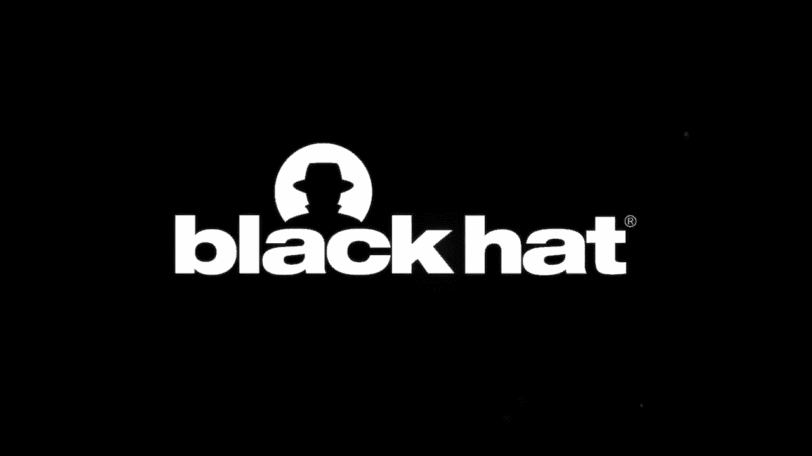
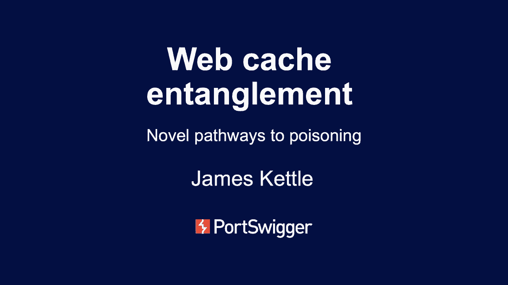
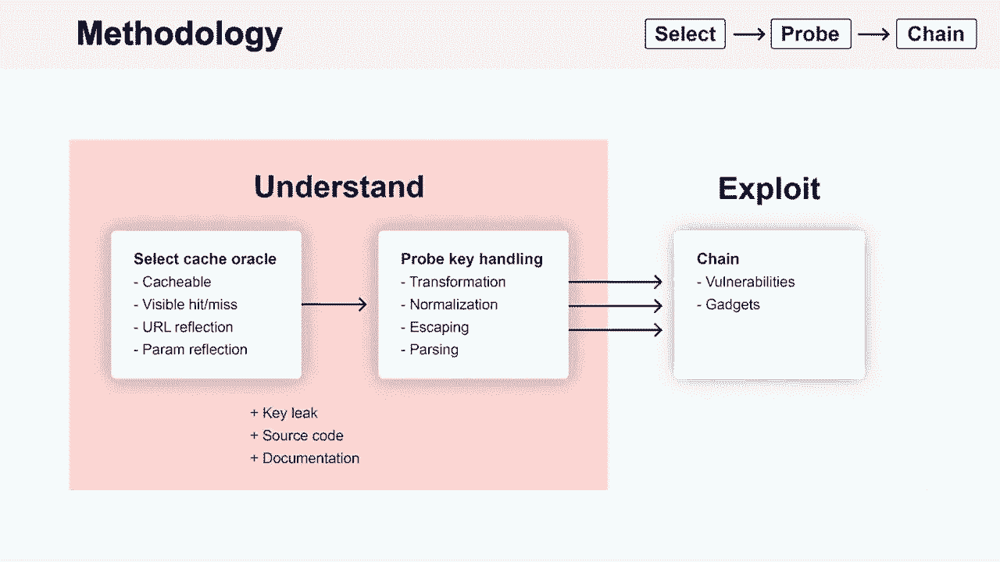
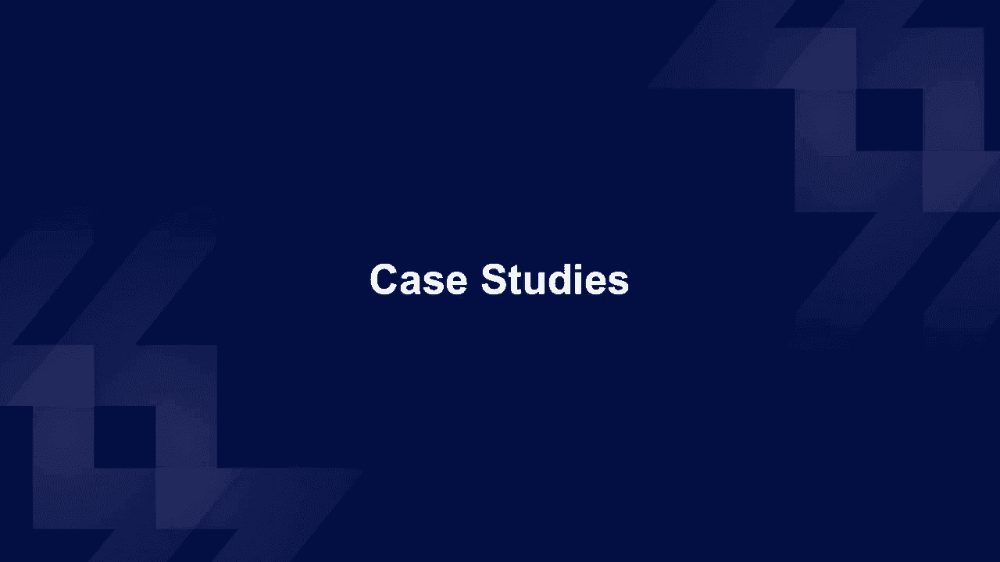
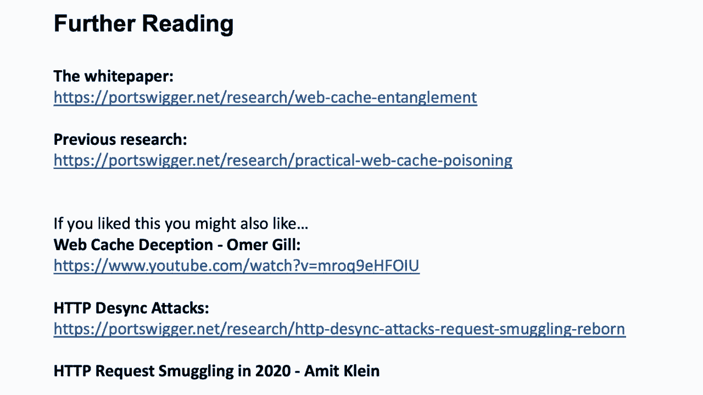

# P67：68 - Web Cache Entanglement - Novel Pathways to Poisoning - 坤坤武特 - BV1g5411K7fe

 Good afternoon and welcome to WebCash in Tanglement， Novel Pathways to Poisoning。

 If you ever thought you understood something and then realised that what you understand。

 is actually only 1% of the total。 Or have you ever found a vulnerability that wasn't。

 quite exploitable， an exploit chain with a missing link？ In this session I'm going。

 to share with you some advanced techniques to find some seriously esoteric cache behaviours。

 and combine them into glorious exploit chains to turn junk vulnerabilities into criticals。

 I used to think that I understood most of what I used to know about how caches work。

 and how to poison them until I stumbled on a small information link。 On systems running， Akamai。

 if you send a certain pride in my value then they will come back at you with。

 their cache key in their response heads。 And the value of this key is a bit different。

 from what I expected。 But more concerningly， they don't just come back at you with that， one head。

 they actually give you two cache keys which don't quite match。 And if you。

 add another prime of value， you get a third cache key。 But you know， I'm sure things。

 are simple right？ We just need to identify which of these cache keys is actually accurate。

 Well is it the humble cache key？ Is it the extended cache key for internal use only or。

 is it the true cache key？ After extensive research， I can tell you that the answer is， none of them。

 Not one of these keys is entirely accurate。 But if we assume that there is some。

 kind of element of truth in them， then they still leave us with some quite serious questions。

 Like where did my parameter go？ It's in my request but it's not in any of the keys。 Where。

 did this Akamai transfer on parameter that I didn't send come from？ And why is it in。

 some keys but not other keys？ What's this double underscore thing about that looks kind of shady。

 and are other caching systems this quirky？ Following up on each of those questions led。

 me to an exploitable scenario which I'm going to share with you today。 First。

 I'm just going to recap the basic cache poisoning concept and show how this research。

 diverges from classical cache poisoning techniques。 Then I'll share a methodology for finding these。

 new types of issues， share a whole bunch of case studies where I've applied the methodology。

 to find real vulnerabilities in sites that have bug bounty programs and share some tooling to。

 make your life easier。 Then I'll talk about how to prevent these attacks， wrap up and take roughly。

 five minutes of questions。 Cache is worked by saving copies of web pages in order to reduce load。

 on the backend system and web cache poisoning is just a general term for when you trick a cache。

 into saving a harmful page and serving it up to other users。 How do you poison a cache？ Well。

 cache is mapped requests to responses using something called the cache key which is the subset of the。

 request that they think is actually important。 Generally， this includes the host header and the。

 request slide but it doesn't include random other headers like the ones that I've highlighted。

 in orange on this slide。 So in a classic cache poisoning attack， as you simply put your payload。

 in one of the orange headers and hope that that makes the application send something harmful back。

 and the cache will save it and serve it up to other users。 But there's a bit of a problem with this。

 approach to cache poisoning which is that most applications take most of their input from the。

 query string and from the path and we can't directly edit those with this style of attack。 However。

 this understanding of cache keys is actually a bit simplified。 The request line， yeah。

 it is unexplainable because it's in the key unless someone decides that analytics parameters。

 are hurting performance and they need to rewrite the query string or the cache decides it's going。

 to normalize the request line because you know normalization is great or the cache key components。

 are stored next to each other as an escape strings or there simply is no cache key。

 Any of these can， cause trouble for your application as we'll see shortly。

 Because this approach to cache poisoning， is built around exploiting specific unique quirks in the target system。

 the first step to an exploit， is to get an understanding of how the target cache works。

 If you can't do that， you don't， stand a chance with any of these techniques。

 And to gain that understanding， we need the help， of a cache oracle。

 This is just a term I've made up for a page on the site that we're going to ask。

 a series of questions to in order to understand how the cache works。

 This page needs to be cacheable， and it needs to tell us somehow whether it got a cache hit or a cache missed。

 This could be， headers or it could just be the speed with which the response comes back。

 And in theory， those two conditions are sufficient but it will also make life easier and let us find some more。

 advanced attacks if this cache oracle page also reflects the whole URL and reflects at least one。

 specific parameter。 Having chosen this page and got hold of any documentation or source code that。

 you might be able to find， the next step is to ask a series of questions to the so-called to。

 understand what's happening。 The thing to focus on is look for transformations that are happening。

 on your request in order to create the key。 Things like is your request being normalised when it's。

 stored in the key？ How are the components being stored in the key next to each other？ Is there。

 some kind of URL parsing that's happening before the key is generated and so on？ We'll see some。

 example of where these go wrong shortly。 Having found hopefully a few quirks in the target's cache。

 the final step is to find a gadget to change this with to create a powerful export。

 This could be an， existing vulnerability on the target where we can just increase the severity of it by combining。

 it with cache poisoning or it could be something that's completely harmless by itself。 And that's。

 a theory。 So now I'm going to show you the kinds of things that you might run into when you apply。

 that methodology to real life systems starting out with some really simple scenarios and then。

 things will get progressively crazier towards the end of the presentation。

 Here's a nice simple example of how to apply the methodology based on a real target that I found。

 For Oracle， which is going to use their homepage because they've got this header that tells us。

 whether we got a cache hit or a cache miss that makes life easy and they're also reflecting the。

 host header which is where we're going to put our payload。 What we're going to do is we're going to。

 ask the question， "Is the port in the host header included in the cache？" So we're going to send。

 a port one。 We see it get reflected back to us and then we're going to replay that request。

 byte for byte identical but without the port specification。 And sure enough， as you can see。

 we have a cache hit。 So that tells us the port is not included in the cache key and in fact with。

 that one request we've just taken down the homepage of that website because whenever anyone tries。

 to fetch that page they're going to get a redirect to port one at their browser or just timer。

 Who does this technique work on？ Quite a few companies。 There's just one thing to mention。

 before you go charging off bounty hunting with this if that's the kind of thing。 Be warned that。

 as a denial of service issue you may get a mixed reception。 Using this sort of finding on different。

 companies that have bounty programs， I've had some of them saying， "We do not care that you can。

 take our site down with one request。" And I've had other sites pay me 10k for it。 So as with any。

 kind of bug bounties it's a bit of a lucky dip。 Now one of the most common transformations that。

 people do on the cache key is they simply eliminate the entire query stream。

 And you might think that， such a major transformation would be really obvious， right？

 But it's actually incredibly， easy to miss because what it does is it makes dynamic pages look as though they're static。

 On a normal page if you change any parameter you'll have some kind of visible change in the response。

 But if the page has a cache which excludes the query stream from the cache key。

 you can change any parameters you like。 You can even specify a cache buster。 And you'll think。

 you're talking to the back end but actually you'll be talking to the cache and therefore your。

 parameters will make no difference to the response。 In order to find these pages we need to take。

 extra measures。 One thing you can do is try and put a cache busters in HD to be headers that are。

 likely to be included in the cache key。 And a brand minor will do this by default as of today's update。

 This approach works really well on some systems。 For example on CloudFlare by default the origin。

 is in the cache key and so this will pierce through their cache and tell you whether that page。

 actually is dynamic or not。 But it doesn't work on all systems because some of them basically。

 ignore all the HD to be headers or all the ones that we can change without just breaking the application。

 anyway。 However there is a kind of a cheat you can do。 On fastly and systems running varnish and。

 various others you can use the purge or fastly purge HTTP methods to directly delete entries from。

 the target websites cache with no authentication。 This feature is fantastic for launching cache。

 poisoning attacks but it's also great for simply piercing through the cache to find out what's。

 really going on with the page behind it。 If that doesn't work well there is an option of last result。

 it kind of sucks but you can take advantage of the fact that a lot of caches do only really。

 lightweight normalization on request parts whereas servers and frameworks especially tend to do。

 much heavier weight stuff。 So that means you can send requests that the cache regardless being。

 different。 They generate a different cache key because the path is different but once the back end。

 servers finish processing then they end up hitting exactly the same endpoint。

 I've thought about putting， this technique in the parameter and by the time you watch this it may have happened but it is a bit。

 unreliable so we'll have to see。 What happens when you try this technique out？ Well you're going to。

 find some really obvious vulnerabilities。 For example on this online newspaper I found the。

 fletted xSS on every single page including the home page and this is a site that has a bug bounty。

 program。 Normally a vulnerability that obvious wouldn't last five minutes right but because of the cache。

 no one had found that vulnerability they just talked to the cache and probably concluded that this site。

 was static but there's a second effect because our payload here isn't part of the cache key so that。

 means having sent that request myself shown there from that point onwards as long as I time that。

 right so it hits the back end。 Anyone else who fetches that page is going to get my payload coming back。

 at them。 So in effect with this reflected cross-site scripting I've gained persistent control over every。

 single page on this website。 Now at this point some of you are probably thinking well that company is。

 just stupid。 They're playing with caching but they've got no idea what they're doing。

 There's no way， that could happen to anyone who knows what they're doing。

 And to go on to that point I'm going to use， the same technique on the main website of a caching vendor called CloudFlare。

 So here the， gadget that we're using this time looks pretty much harmless right。

 All they're doing is they're， taking the request and query string that we give them and they put in a slash on the end of the path。

 and just like the previous target they've excluded the whole query string from the cache key。

 What we're going to do is we're going to take advantage of that extra fort slash that they're。

 sticking on。 So we're going to send a request that uses a really long query string to mean that the。

 resulting request line is the maximum length that their server will allow and then they're going to。

 give me a redirect that takes that maximum length and puts one extra character in it。

 So then having， done that if I timed that right then from that point onwards if anyone else is browsing CloudFlare's。

 site and they and they press that login link they're going to get this cached redirect that。

 includes my really long query string and when they follow that redirect they're going to get。

 blocked by the server because their request is too long。 So with one request we've persistently。

 taken down CloudFlare's login page。 It's worth mentioning that you couldn't send that last request。

 by itself directly as a cache poisoning attack because CloudFlare would refuse to cache it because。

 of the HTTP error status code。 It's the layer of indirection that the redirect adds that makes this。

 issue exploitable。 So I reported this to CloudFlare and they could have obviously patched it on their。

 site really easily but they acknowledged that this was probably going to affect most of their。

 customers as well and so they deployed a kind of more general mitigation。 They said in the cache。

 if the query string is on keyed and the query string in the responses location header matches the。

 query string in the request just refused to cache that response。

 The concept behind this is completely， sound but I was able to bypass it by encoding a single character in the request because the server。

 would decode it and therefore it wouldn't match and CloudFlare has now fixed this but obviously if。

 you have any other transformations happening in between the query string of the request and the。

 location header you'll once again be able to bypass this mitigation and take down a whole bunch of。

 pages。 So far we've seen how simple transformations can have quite major unexpected effects and on。

 some sites you'll find even the transformations themselves get quite messy because they've decided。

 to exclude specific parameters from the cache key。 I've seen this happen with UTM content。

 quite a few times because it's an analytics parameter it changes a lot and it's not really。

 relevant to the back end so for performance reasons they just exclude it from the key and。

 obviously this makes full URL based full URL reflection based vulnerabilities really easy to。

 exploit but what happens if they've got this behavior and you find a vulnerability in how the。

 parameter term is handled can you combine that with this cache poisoning issue to escalate the。

 severity？ Well in theory you can't because the term parameter is meant to be included in the key。

 but actually it depends on the implementation this is where cache parameter cloaking comes in。

 Some people are going to implement these things by Googling them landing on stack overflow。

 and then implementing a regex that's how I would implement it at least and if you if someone's。

 using a regex like this well this one's meant to replace eliminate any parameters called underscore。

 from the cache key。 Given that behavior how can we place a payload in the parameter queue well just。

 like so。 So here the interesting thing is that they've eliminated this parameter from the key but。

 they've substituted it with a question mark so although we can append arbitrary things to arbitrary。

 values， arbitrary parameters on the site we can only successfully poison parameters used by the。

 site that already have a question mark in them。 These kinds of complications can arise fairly。

 often with this type of issue and they generally just make life more interesting。 Here I've here。

 fairly humble target right it's just a stack overflow post but this also works on some more。

 serious companies remember how we got Akamai to show us a few cache keys and some of them have。

 this Akamai transform parameter and some of them did it that means maybe they're excluding this。

 from the key and if we send a request with that parameter we'll see it doesn't appear in the true。

 cache key and if we change the value of that parameter then we'll get a cache hit which confirms it is。

 genuinely not in the key and the cool thing here is that their parsing of the URL is not quite。

 optimal so as well as being able to add this value to the query string we can also append arbitrary。

 payloads to arbitrary parameters of our choice using this technique here so here well the。

 back end sees is one parameter called x containing our payload but Akamai will eliminate the question。

 mark and everything after it from the cache key。 This would be extremely serious if it wasn't for。

 one small catch which is that there's actually an invisible but not mentioned in any of the cache。

 keys that says did this request contain the parameter Akamai transform。

 What that means is that you can， only use this technique to exploit sites that are already using the Akamai transform functionality。

 you can't hit arbitrary Akamai targets with this。 On a different target something was weird and I。

 couldn't find an oracle that was any ghost so I looked at the code in order to figure out how to。

 exploit it and we can see they were splitting the query string on semicolons as well as ampersands。

 so that meant that in principle I could use a payload like this to smuggle a malicious bit of code。

 into the callback parameter that will be excluded from the cache and I thought great I'm going to。

 set up my demo using this because the vulnerable cache here is rack cache which is something I can。

 easily set up myself。 I set it up I tried it and it didn't work and it didn't work because Ruby on。

 rails itself also splits parameters on semicolons as well as ampersands and that is good news for。

 rack cache although we're going to hack it in a different way shortly later but it's bad use for。

 Ruby on rails because it means if you use a application built on rails behind any normal cache like。

 varnish or Akamai or whatever and you eliminate any parameter from the cache key then an attacker。

 can exploit that to make arbitrary unkeyed changes to arbitrary parameters on cacheable pages on your。

 site。 For example in this request here from Akamai's point of view from the cache keys point of view。

 there's one parameter called callback and the value is legit or whatever value the application。

 happens to be using but when rails passes this it sees three parameters the callback。

 UTM content and a second callback parameter and it prioritizes the last parameter which is。

 something as an attacker we have full control over so we can just change that to whatever harmful。

 code we like and then any page on that website that uses that JSONP will end up being exploited。

 So say you found parameter cloaking using any of those techniques the next step is to combine。

 that with a gadget right and as we've seen traditional XSS works great but if it's a hard and target then。

 you might not have that but the good news is you there's a whole bunch of other things that are。

 harmless by themselves and therefore less likely to be patched that still become harmful in the。

 presence of cache of cache poisoning and JSONP as we've seen is one of them but also any kind of。

 dynamic content in JavaScript files or CSS files typically this stuff is harmless but with cache。

 poisoning we can poison these resource files so that anyone that any pages that reference that。

 resource file end up being exploited。 For example I found a CSS file on one target that was。

 they reflected the query string in an import statement in that CSS file and by changing the。

 query string you could break out of the import statement and import and arbitrary malicious CSS。

 file from your own site in order to steal sensitive information from any pages that referenced that CSS。

 file。 In fact if a page that uses a CSS loads a CSS document doesn't have a doc type then you can。

 even persuade the browser to load HTML responses as CSS which can enable exploitation of normally。

 static CSS files and there's also major implications of this issue that make relative path overwrite。

 issues substantially easier to exploit however unfortunately it takes about 20 minutes to explain。

 so I'm just going to leave that one for the whitepaper。 Now another way of hiding parameters。

 from the cache is simply to send a post request this is unbelievably simple I was quite surprised。

 to find this worked but on this Chinese mapping site I found reflected xss on every page if you。

 use post you had to tweak the payload slightly to bypass their waft that's why that looks weird。

 and the cool thing was they weren't including the request method in the cache key so having sent。

 that payload if someone sent a get to that site just browsing the site as they normally would be。

 then they ended up being exploited by the poison cache and just like the earlier xss issues we saw。

 this one was present on every page of the site so I could take persistent control over the entire。

 website。 I actually had a research collision with someone else with that they were using the same。

 technique around the same time so they've just published the blog post coming up today hopefully。

 and if you check that out you'll find some more examples of this technique。

 Now that there was a collision there right but with a small tweak we can make that approach work。

 on a lot more systems。 For inspiration let's look at the varnish documentation they say。

 if a request has a body this will be sent to the back end the default varnish config removes the。

 body for get requests because it is questionable if these requests are valid but some applications use。

 them。 So what happens if you're using a varnish config file that doesn't have this snippet well。

 unfortunately gihub didn't have this snippet and they were using Ruby on rails which does accept。

 parameters in the body of get requests。 That meant that on cacheable on cacheable pages I could make。

 arbitrary changes to arbitrary parameters。 For example with this request here I've put in their。

 report abuse page so if you try and report abuse on my profile it ends up reporting somebody else。

 You could also apply arbitrary filters to hide issues in people's projects and such like and also。

 just block access to the majority of project content using this technique so I reported this to get。

 hub and go a 7。5k bounty for that which was pretty cool。

 In addition to working on some varnish systems， this technique also works in exactly the same way on quite a few people using CloudFlare and on one。

 of those I had a really hard time finding a gadget to combine this behavior with。

 In the end I used a， local redirect on their login page so that if you went to their login page entered your creds and。

 logged in then you would get redirected to the logout page which would then redirect you to the。

 login bounce and log you back into my account using my authentication token and then eventually。

 put you on a page of my choice。 So from your point of view you enter your creds you press login and。

 you end up logged in but you're actually in my account and unfortunately I can't describe the。

 nature of the site but if you were to then proceed to do something on the site I would have。

 full knowledge of what you've done there which could be quite interesting。 I reported this。

 sorry that makes it sound like it's a certain kind of site， not that kind of site。

 you know what I mean。 I reported this to CloudFlare and they said that they're not going to change。

 this behavior but I've completely lost my thread now but they did update their documentation to say。

 don't trust get request bodies which basically means don't use rails。 There's an interesting kind。

 of side point here which is that both is that this gadget that we've seen that we've used on this。

 site and on GitHub is an incredibly powerful gadget that can make arbitrary changes to arbitrary。

 parameters but neither of the exploits were that harmful and that's because neither of those sites。

 had the right kind of gadget that you could use to make a high impact exploit。 So how hard these。

 cash poisoning issues hit you is massively dependent on whether you've got these kind of。

 almost exploitable vulnerabilities present on your site。

 So I use Firefox for most of my testing and， every year I'm doing my research and I accidentally find a vulnerability in Firefox's update infrastructure。

 And this year is no different。 This one is going to show us how something even as simple and common。

 as normalization can be really quite harmful。 If you look at the engine x config on download。

mazilla。org， it looks fine。 If you look at the proxy cache key documentation you'll see there key is very similar。

 to the default engine x1 but if you look at the proxy pass documentation there's a kind of a clue。

 that something might be wrong here。 It says if you use proxy pass without a URI like mazilla have done。

 then the request jry is passed to the server in the same form as sent by a client when the original。

 request is processed。 What that's hinting at is the fact that this proxy cache key value is being。

 normalized but the value that gets passed to the upstream system is not being normalized。

 What does that mean？ Well whenever you open a Firefox and periodically thereafter it checks for。

 important security updates that need to be installed to keep you safe。

 But and it does that with a URL， like this and if there's a security update present it'll give you a redirect to the installer。

 But what happens if I send a request that looks like this it's byte for byte the same。

 but I've URL encoded the question mark。 Well engine x is going to URL decode that question mark when。

 it saves its cache key so from engine x point of view this is a completely valid check for updates。

 but when the backend server sees the unnormalized version of this request they interpret the whole。

 thing as being the path so there's no parameters and it breaks the redirect and in practice the update。

 fails。 So if I send that request and time it right then whenever anyone else checks for updates for。

 Firefox they get this broken redirect and I've just disabled Firefox security updates globally。

 I think this is my favorite denial of service issue that I've ever found。

 What else can you do with normalization？ Well there's a classic issue that I'm sure many of you have。

 run into where you find some excess maybe it's in the path or more recently maybe even in the。

 query string and it looks great in burp but when you try and exploit a browser with it it doesn't work。

 because the browser isn't coding your payload and the server is not decoding it。

 But with normalization， this issue once again becomes exploitable because you can send your request shortly before the。

 victim loads the URL you give them and you they'll just get a cache hit from your request。

 They'll get， your poison response and they'll get exploited。

 On the topic of issues that are normally unexplitable。

 what do you do if you get cross-site scripting in a HTTP header that's in the cache key？ Normally。

 that's useless but on Akamai they stick both query parameters and headers into the same chunk of。

 the cache key they separate them using underscores and underscores aren't escaped so that means these。

 two requests have exactly the same cache key。 So as an attacker I can send the first one with the。

 poisoned origin which is something no browser would ever agree to send and then I can hand the URL。

 of the second request to my victim they'll hit that they'll get my poison response and get exploited。

 After seeing how easy that was in Akamai I thought I'd try it on CloudFlare。

 According to their documentation the cache key looks like this so these two requests should have。

 the same key。 However when practice it doesn't work and I tried a few things ran low on options and。

 eventually sent an email to CloudFlare to complain that their documentation is incorrect and say。

 could they fix it please。 Unfortunately one thing led to another and I had to explain the attack。

 and then I got a response from their security team saying well the documentation is wrong。

 the attack you're describing is possible but you're doing it wrong and we're not going to tell you how。

 and then they have not patched it but they did send me a t-shirt so it was possible to use some。

 variation of this on CloudFlare but unfortunately I can't tell you how to do it。

 On the opposite end， of the spectrum some attacks are so practical that it's not possible to do them safely。

 On Adobe I was testing for a classic cache poisoning issue on a particular blog page on their blog。

 and I suddenly got a flood of loads and loads and loads of traffic to my server and it turns out。

 unfortunately for well me and Adobe they were using an internal application based cache that。

 was integrated into their application and had no concept of a cache key。 So I poisoned the。

 header of my page and that header was then being used on every page on the entire website including。

 their home page。 All the resource loads went to my site and all the links on their home page also。

 sent people to my website。 This was not a great experience for either of us I reported it very。

 quickly they fixed it very quickly luckily they were quite understanding but you can see this。

 kind of issue makes the distinction between a legitimate ish researcher and an attacker really。

 quite blurry and not only is internal cache poisoning uncontrollable it can also be invisible。

 on a different time。 I had an idea for denial of service detection technique sent it to a bunch。

 of sites and got loads of traffic from the Department of Defence internet。

 Eventually I think I figured， out what happened which is there's this site it's meant to be internal to the DoD。

 Any attempt， access it from external redirects to their internet which I can't access。

 The denial of service， technique breaks the redirect it only lets you access the error page though but hitting the error。

 page with a certain payload poisons their internal cache and thereby poisons all the resource loads。

 in their internet administration interface。 So I can't tell you how to find internal cache。

 poisoning issues safely but I can't tell you how to recognise it to avoid wasting your time。

 If you see both old and new values coming back in that one response that's a good clue。

 or reflection of your input on different pages or things just don't make sense。

 And having a year figured out how to do it completely safely but if you're doing any technique of any。

 type then this might happen by accident and all that means is whenever you use a domain whenever。

 you give a domain to the target that's not the real target domain please use a domain you control。

 you do not want to be sending all of your target websites traffic to evil。com unless you are the。

 lucky owner of evil。com。 So I was going to release a standard loan tool for this research but instead。

 I've done an update to Parram Miner which is the open source burp suite extension that I originally。

 wrote for my prior cache poisoning research it can find almost all the techniques mentioned in。

 this presentation and there's a demo of me using it to exploit a fat get vulnerability in rack cache。

 on the github page please check it out。 As far as the prince goes the key thing is if you want to。

 make these optimizations just rewrite the request not the cache key this is vastly safer also don't。

 accept fat get requests don't use rails I guess or see if you can patch it and if you're using。

 caching it's really important to patch unexplainable vulnerabilities。 Now there's a whole bunch of。

 more information on this check out of the white paper which I've just published which has some。

 couple of extra techniques also the prior research is well worth reading if you haven't already seen。

 it and if you're watching this at blackout check out and the client's presentation on a HTTP。

 request muggling because he invented it back in the day so I'm sure that's a good talk。

 This is not the end of novel cache poisoning issues coming out I've got loads of leads。

 and I'm sure other people do too so please don't think this is a comprehensive presentation。

 and that basically means the most important thing to take away is that caching introduces。

 unique hazards and these may be well-written and not documented by anyone anywhere ever。

 and as such if you're using caching unexplainable vulnerabilities are really worth patching。

 I'm going to take five minutes of questions now if you have any more after that feel free。

 to chat me an email don't forget to follow me on Twitter and thank you for listening。

 Cool thank you for listening how do you enjoy that does anyone have any questions if you're。

 posting a chat box then I'll be able to see and answer them the one thing that I need to add is。

 that Akamai would likely to tell you that they're working on a fix for the Akamai issues mentioned。

 in this presentation。 So doesn't look like you've got any questions。

 Great thank you for listening don't forget to check out the Academy Labs and the White Paper。

 which has some extra techniques stuck in there。 Ah you've got one question。 When I'm testing。

 also the question is when I'm testing on live sites and I accidentally get persistent XSS。

 how much die disrupt the business well when you're testing for most of these issues you can just。

 use a cache cluster and what that means is that low your cause low disruption for anyone because。

 you're only poisoning a specific URL that other people aren't visiting。 The only exception to that。

 is the internal cache poisoning。 Internal cache poisoning as I mentioned is really dangerous and。

 you can't be much about it really so it's only happened to me twice and the site was basically。

 defaced until there to run it fixed it I think which is one of the reasons that I didn't talk。

 very much about internal cache poisoning because I can't properly research it until I figured out。

 how to do it without causing business disruption but most of the techniques in this presentation。

 are completely safe as long as you use a cache cluster。

 The other question is do I have LinkedIn and if I don't have LinkedIn but I am on Twitter。

 that's my version of LinkedIn。 And I think if you notice everything cool quick thanks for listening。

 [BLANK_AUDIO]。