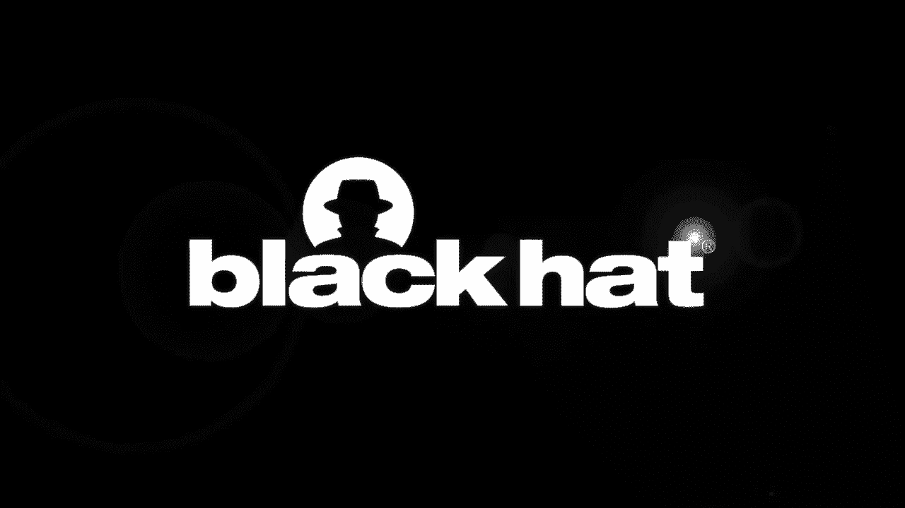
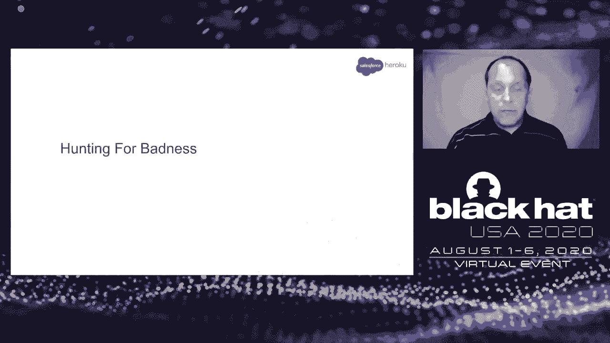
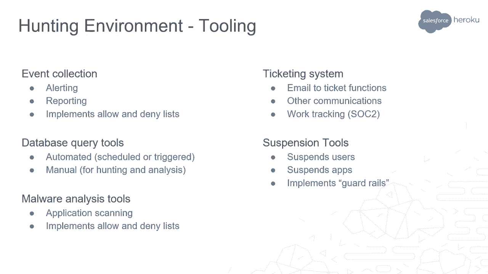
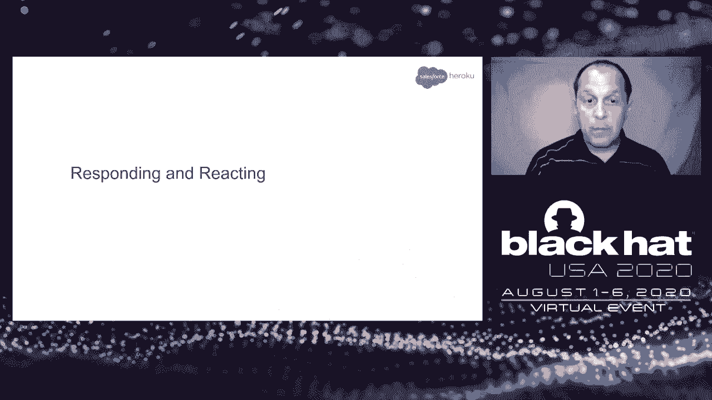
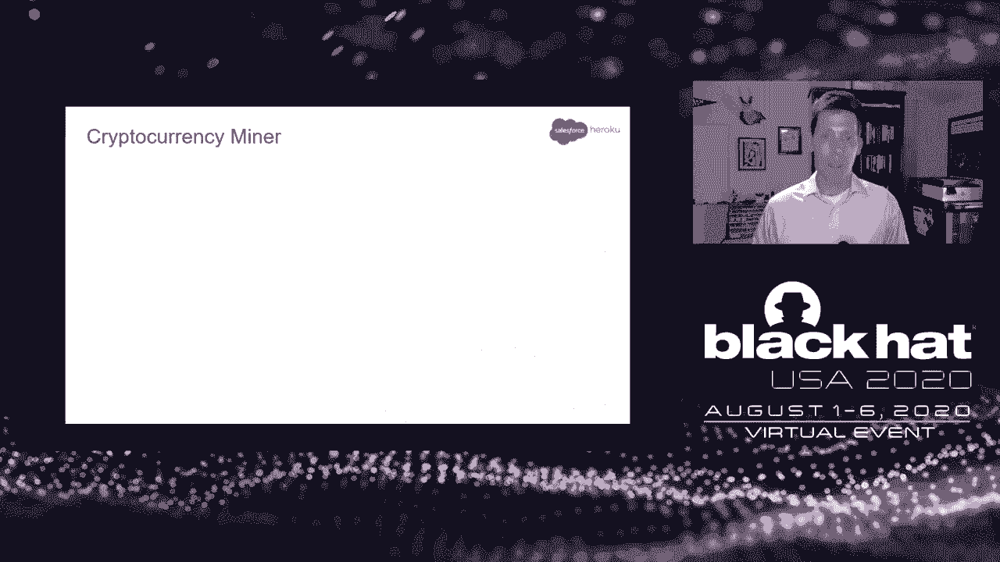
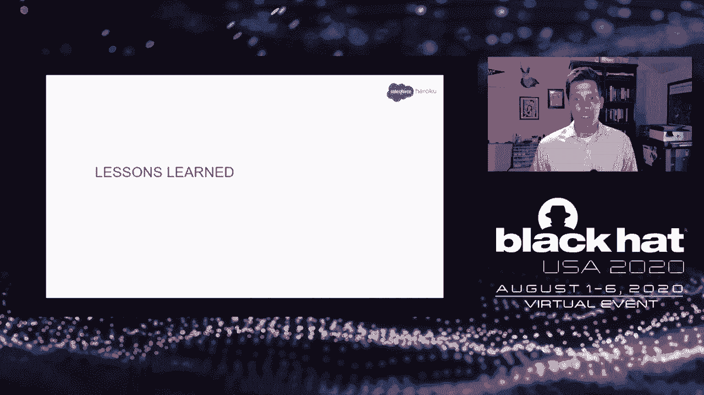

# 【转载】Black Hat USA 2020 会议视频 - P68：69 - Heroku Abuse Operations - Hunting Wolves in Sheep's Clothing - 坤坤武特 - BV1g5411K7fe

 Before we begin， I need to mention this forward-looking statement。

 I'm not a lawyer， I don't play one on TV or on the internet， but this slide states。

 that the following presentation is not talking about any future products， services， strategies。

 or commitments of Salesforce。 If you're not trying to use the following content for purchasing or trading decisions。

 it probably won't go well。 Thank you for tuning into our talk。 I'm Spencer Kirten。

 and with me is Allen Stajanovic。 We are on the abuse operations team at Heroku。

 where we keep users from doing bad things， on， to， and from the platform。

 This talk focuses on abuse and how we hunt for it on Heroku。

 Heroku was purchased by Salesforce about 10 years ago。

 It's a platform as a service that offers an easy interface to quickly go from idea to。

 online application without having to manage and configure the underlying infrastructure。

 So developers are free to focus on code and deploying it to the internet with very little， effort。

 It supports multiple languages and provides features like scalability， backups， continuous。

 integration， same default configurations， and much， much more。

 And all you need is an email address to create an account。

 To give you an idea about the size of the platform， over 9 million apps have been created。

 over 2 million databases are managed， and the infrastructure handles billions of requests， a day。

 And Heroku runs on Heroku。 Alright， so Heroku is a platform as a service， right？

 We run anyone's code on the internet as directed from unknown sources millions of times a day。 Okay。

 we are our CE as a service。 To be fair， the part of the platform we are talking about is referred to as the free tier。

 or the common runtime。 Heroku has other offerings that are not like this。

 but we won't be talking about them today。 Our focus will be on how we defend the common runtime from abusive bad actors。

 We define abuse as the unintended monetization of anything。 So if you have a free service。

 a free trial， or any offering that has an angle to extract， value。

 somebody is already trying to figure out a way to make money off of it。

 It's a very fine line between a business trying to get off the ground and an abuser。

 trying to take advantage of your services。 Sometimes it's obvious， like that's the resources。

 Other times it's not so clear。 For example， think about a social media poll。

 It's intended for honest input， but it's gameable because it's not one person， one vote。

 It's one account， one vote。 So the person in control of the most accounts wins。

 The problem isn't new， the scams aren't new， but we see them leveraging more and more of， the cloud。

 Now， is there a single view that captures the full picture of the entire operation？

 Across the industry， we may have that full picture， but not today。 From our limited view。

 we've identified a number of puzzle pieces that we feel have， been underreported。

 Now in a more practical layer， we see a portion of that picture realized through misuse， malice。

 and crime on our platform。 Legal documents like the Acceptable Use Policy， the AUP。

 provide a list of prohibited content， and actions。

 So it's like the list of don'ts for users to follow。

 And it also serves as a set of guidelines for our team to uphold。 Obviously。

 this can't cover every type of abuse activity。 And even if it did。

 it could act like a laundry list for an abuser to know what kind of badness。

 could be performed from the platform。 So let's look at how we group violations of the AUP。

 There are unintentional violations， and there are intentional violations。

 To determine if intentional or unintentional or good or bad， we establish intent。

 And we do that by collecting and connecting as many indicators of abuse as necessary。

 So unintentional could be a customer that deploys a poorly written app that consumes more than。

 its share of resources。 And now they've become a noisy neighbor。 So not malicious。

 but kind of like they were accidentally jerks。 Totally unaware that there was an issue with their code until we suspend their app and open。

 up a support ticket so they can fix it。 The intentional abusers are what make this job really interesting。

 These users have skills that range from ScriptKitty all the way to Rogue Advanced Developer， which。

 we call our Apex Actors。 Skids will be skids and deploy code found on GitHub， YouTube。

 or whatever their buddy， gave them to run。 At times we'll get what feels like a swarm of abuse centered around a particular app。

 like a proxy kit or peer-to-peer app。 Then there are the quick and loud abusers。

 They could care less about being detected and will attempt to stand up a DDoS farm and。

 attack a target as quickly as possible。 The actors that are patient。

 skilled and criminal are the more dangerous group。

 These actors attempt to iterate past our detection capabilities。

 They may try to social engineer support staff to gain insight into how they were detected。

 after being suspended and will try anything to maximize their use of our platform。

 Now these users are not exploiting technical vulnerabilities within the platform itself。

 They take advantage of gaps in business logic。 The majority are not too advanced but are very persistent。

 If you like to think about APT， small lowercase a and a big capital P and again financially。

 motivated。 When we say persistent， we mean that after an account has been suspended， the same actor。

 will use a different email address or a sub-inbox of the original email address to create a new。

 account。 We'll cover a couple campaigns during the show and tell section of the talk。

 Here's a fun one。 How do we define ourselves？ Where do we fit within the company？

 Well maybe we can start by listing the things that were not。

 We're not red team but we learn a lot from them。 We're not blue team but we borrow from them。

 We're not purple team but we talk to more groups across the organization。

 We're not C-cert but we conduct investigations。 We're not security but we monitor for outbound attacks。

 We're not GRC but we write up risks around business rules。

 We're not anti-fraud but we use the same data。 We're not service reliability but we help keep the platform stable。

 We're not encompassed by any one of these groups but we overlap in so many ways。

 We are abuse operations。 We exist because the business understands that there is risk of having unwanted activity。

 given an environment that's RCE as a service。 Overall we define abuse operations as a specialized DFIR team that requires a wide view across。

 the business as shown。 Our goal is to push bad actors from the platform and put a spotlight on abuse patterns so that。

 engineering teams and the business can address them。 Heroku is exceptionally collaborative。

 Teams openly share views and metrics and just ping us when things look out on their end。

 This enables us to move very fast。 Now pack your bags because Alan's going to walk you through how we hunt。

 Alan？ Thank you Spencer。 Hi， I'm Alan Stojanovic。 We hunt。

 We don't want to wait for the badness to have to hurt us。

 We're looking for wolves and sheeps clothing after all。

 Most of our hunting starts with suspicious indicators。

 Suspicious indicators derive from a combination of internal user data and external information。

 about that data。 For example， an app with an abnormally high CPU which generated an event based alarm and。

 on the slide is a short list of some of the sources of these indicators。

 Just understand that the indicators we're getting are considered low value。

 By themselves they rarely have enough context to make a decision。

 Now given a starting suspicious indicator we form a hypothesis about the intent of the， actor。

 We start looking for related indicators to try and prove or disprove that hypothesis。 For instance。

 it just so happens that given a high CPU with high network usage， a match。

 for a popular file download program and the substring torrents in the app name is probably。

 a peer to peer app。 True story。 Now each of these indicators is not proof of intent individually but you can see that collectively。

 they make a really strong case。 A collection of low value indicators does become a very good footprint of malicious activity。

 To increase the confidence， we keep asking the question what else you got。

 And as more indicators are discovered we try and think about why they are the way that， they are。

 For instance， a face roll email address like shown is a pretty good indicator that the。

 user doesn't really value the account。 It's likely a throwaway account but this is not necessarily by itself bad。

 A face roll app name similarly is not necessarily bad。 It could be something for a quick test。

 something to be discarded。 However， a face roll email address with a collection of face roll app names and multiple。

 failed attempts to verify different credit cards and finally landing on a working credit。

 card that has been previously used by a previously identified malicious actor is worthy of further。

 scrutiny。 I'm sure you will agree。 By the way， in case it's not clear the difference between a face roll app。

 a face roll string， and a random string is whether it's created by hand or by computer。

 Think keyboard mashing。 Now， establishing intent is as one would expect the art of figuring out what the actor is trying。

 to do。 Now， we have two goals here。 Goal number one is determining what the actor is trying to do while goal number two is determining。

 what the actor is trying to do before they do it。 Now we usually reserve goal number two for actors that we've seen before so that we can。

 avoid that whole pre-crime scenario。 We really try not to kick someone off the platform before they've actually done anything。

 bad。 Taking a decision and taking an action is of course the correct case of the matter。

 At this point， we have collected a bunch of indicators and that should give us a reasonably。

 good idea of the intent of the activity。 It's time to take action。 If the intent is bad。

 then suspensions， evidence collections， deletions， all that kind of stuff， comes into play。

 If the intent is not bad， then watch lists or allow lists or adjustments for false positives。

 or opening of support tickets are among some of the things we can do。

 Analyst discretion is kind of necessary here。 Is it good or just not bad yet？

 Sometimes undetermined intent really just means there's not enough indicators to establish。

 intent to make an action。 In which case it goes back into the pool。

 no other actions could be taken and it'll， be reassessed when it percolates to the top again due to a new alert。

 Now we have a bunch of indicators。 We have enough to establish intent。

 We've made our decision and we've taken the corresponding action。

 Now we look to see how widespread this activity is。

 We gather all the accounts associated with the indicators we have and we look for other。

 common indicators that we may have missed。 We then add those indicators to our collection and see if any accounts match that we may。

 also have missed。 This strengthens the footprint and makes it suitable for automation。

 Automation is how we reduce toil。 We never want to see the same abuse again so we automate the collection。

 detection and， actioning of the footprint， the one we just actioned。

 Our automation can also be set up to run the new footprint retroactively so that older。

 implementations of badness will also be detected in action as well。 This cleans up any stragglers。

 We log the action that is taken so that we can use that information next time we run。

 through the loop。 This is how we get that "have we seen this before？" question answered。

 There is of course trade-offs。 Automation will result in some loss of visibility。

 The investigation performed in the previous step helps build robustness so that there is。

 longevity in the automation of this action。 Interned tooatively taking this extra step helps reduce toil in the long run。

 Why do we use the term footprint？ Simply because fingerprint or profile implies something a little too unique。

 A footprint as a collection of indicators helps us remember that an actor can be more。

 than one person， can be a bot， can be multiple， specialized actor groups or some combination。

 thereof。 And then of course we do it all over again。 Let's recap。

 Suspicious indicators come to us as high watermark alarms， abuse complaints or as the results。

 of artifact exploration， including previous historic events。

 We add context and more indicators from both internal and external sources so that we can。

 increase the confidence when we're trying to establish intent so that we can make a。

 decision and take an action。 We then investigate often retroactively to find more indicators that collectively are。

 suitable for automation。 And then we rinse and repeat。 Let's talk about some tools。

 We have an event collector that acts like a classic Sam。

 It handles our alerting and reporting and can send info to other tools as well as receive， them。

 We have database query tools that can run queries automatically and we also run them。

 manually when we need to test hypotheses or check to confirm that the results of automatic。

 suspensions is still working properly。 We have malware analysis tools that can scan app statically or dynamically and they send the。

 results to other tools as well。

 We have a ticket system。 Now most places don't consider ticket systems as part of the tooling but we do if for no。

 other reason that it is just we need to be able to reduce the toil there as well。

 And we have our suspension tools that suspend users and apps。

 This encompasses a complex rule set that is implemented as guardrail so that we don't。

 accidentally you know suspend the entire world。 We track two general types of activities campaigns and prohibited software campaigns。

 track actors and victims and custom software that they may have written prohibited software。

 on the other hand looks for known malware tracks see to communications and similar artifacts。

 and and known abusive software that anyone can install including those with that deployed。

 a heroku button。 Let's put that together。 Any tool can talk to any other tool even if it is the machine equivalent of I see bad。

 Any tool can tell the suspension tools that a user and app needs to be suspended。

 Suspension tools have their own allowing denialists and internal business logic to help identify。

 and stop mistakes before they become costly and everything that these tools do is recorded。

 Now this may sound complex but this is what gets us the flexibility we need without taxing。

 any singular system。 Now after the jump cut we're going to continue with section 5。

 Let's talk about responding and reacting。

 We align with the business。 They of course set the task and the priority but it's up to us to be able to interpret them。

 The business wants us to remove abuse faster。 Fair enough but this means that we need faster and more accurate detection logic。

 The business also wants less abuse or at least less costly abuse。

 Fine but that requires us to study the actors and what they are doing and how they affect。

 the platform and the business。 Now what the business really wants is they want the problem to just go away。

 Now this does seem simplistic but after giving it some thought we realize that there actually。

 is a path here。 It's via platform hardening and demotivating actors。

 If we make the entire thing less hospitable to abuse maybe we can get close。

 Now we can abuse ourselves or selfish。 We want all of this。

 First toy items in the list on that previous slide they kind of have competing requirements。

 The first requires us to respond quicker and the second to study the actor in their actions。

 and hence respond slower。 There are pros and cons to each of these strategies。

 The big ones being that quicker is usually easier but prone to false positives。

 While slower produces better situational awareness but since the actor may still be active it。

 could be more damaging。 We have found that it's sometimes worth switching back and forth depending on what we're seeing。

 at that moment in time。 And we've also found that going slow first does allow us to act quicker later with more。

 accuracy。 Now moving quicker requires invisibility。

 Situational awareness not only requires visibility but also requires studying the actors and hence。

 going slower。 So overall we end up going slower to ultimately go faster but with accuracy。

 But when we first started out we had to go fast just to get our heads above water。

 So between visibility and situational awareness just understand that there's a little bit。

 of hidden complexity here。 Now tracking actors is hard。

 Tracking persistent returning actors is hard。 Okay not quite。

 But there does not seem to be a well defined way to track actors by footprint as we defined。

 it and that gives us the flexibility that we desire。

 We want to know if an actor changes behavior and want to know in an automatic way。

 And when they do we want to be able to add the new indicator to the footprint in as few。

 steps as possible。 We want to be able to split and merge footprints as we track multiple actors and we want this。

 to be a tool just like the rest。 Remember the requirements back in the tool slides。

 Now we want a lot。 Today we track actors mostly manually。 This is a lot of toil。

 We are looking to build a system that enables us to spot returning actors that have changed。

 a TTP pivot or spot when a footprint is covering multiple actors like a splash or fingers crossed。

 spot an actor that returns and starts from scratch retools。 Let's look at those definitions。

 A pivot is what we call a change to a TTP of a returning actor different from a pen， test or pivot。

 If a footprint is a collection of indicators then given enough of them a partial match usually。

 indicates a change in behavior by the same actor。 Actors are people too。

 When they are suspended they will test how by isolating for variables and making small。

 changes one at a time until they get it working again。

 So a form of threshold detection like shown works really well as an accurate way to detect。

 their return and still take some action。 Then updating the footprint with the new indicators reflecting the change that just made keeps。

 the footprint accurate。 This is designed to make it difficult for a persistent actor to regain a foothold on。

 the platform and it frustrates the heck out of them。

 Especially if we cut them off at each pivot and before they make a profit。

 Sometimes instead of seeing a singular pivot we see multiple pivots but with different。

 partial footprints we call this a splash。 Ever slap a mud puddle？

 This seems to mean that there are multiple actors operating under the same set of TTPs。

 We have found great value in looking for how they are sharing their tactics。

 Are they reading all the same forms or are they using the same YouTube instructional videos？

 We find that the source that we find that if we find the source that we can have even， more fun。

 Imagine knowing what they are going to do before they are implemented especially if it is a。

 code change and adding those as indicators to the footprint before the changes even deployed。

 Frustrate them as well。 Now shout out to our fantastic threat intel team to help us find this stuff out there。

 When we have all the tooling in place when pivot detection is designed and when we manage。

 to stop actors before they have even begun then they have only two choices。

 Go somewhere else or retool。 When they retool they change significant portions of their apps to code their infrastructure。

 and their behaviors。 That makes them indistinguishable from a new actor。

 This used to bother us quite a bit but then it occurred to us。 So what？

 The only reason that we could think of that we needed to tie two actors together was for。

 law enforcement purposes anyway so that we could collect more evidence。

 But this doesn't apply to all the actors and is actually kind of rare。

 So retooled actors end up being identified as new actors just by the nature of how our， hunt works。

 And because we are pretty thorough in our indicator of collection sometimes we find。

 evidence that the new actors in fact the returning actor retooled after all。

 Actor reactions are fun。 Some actors， at right call us names。

 Others open tickets and try to social engineer support to get their loot or their infrastructure。

 back。 Others， maybe seeing the writing on the wall， realize they have squeezed out what they can。

 do。 And go about convincing others to run their kits， sometimes for pay。 Look what I did。

 You could do it too。 It's like they have found their own replacement for that actor's footprint。

 That last business category though， wanting the problem to go away。

 It can be achieved by devaluing loot。 If we devalue the actors loot by making it worthless after the fact like getting。

 like， reporting stolen credentials to get them reset or making it not worth the effort by。

 like limiting CPU usage so that an actor can't crypto mine anything of value， then it's。

 more likely they won't return。 Now we have done this， but so far with mixed success。

 Now this is where hardening the platform comes into play。

 Since we are already studying how the actors act and how the platform reacts， we recommend。

 fixes to make the platform less hospitable to abuse。 We push left to use the classic。

 I'll tell you a fun story from a previous job about devaluing a fisher's loot。

 On top of devaluation of loot， of killing off ROI， there's an even wider goal of demotivation。

 If we really want to keep the actor away， we should work towards making it so that they。

 don't want to come back。 All of the things we've talked about adds friction to abusive actions。

 the monetization， of free。 And since our ultimate goals are to make abuse less valuable and less desirable without。

 affecting legit customers， we need to break the spirits of the bad actors。 Break spirits， not code。

 Now these last two sections contain a lot of information。

 There's a lot of notes in the slides and when the slides become available feel free。

 to download them and read them。 I hope that there's things in these two sections that resonate with you and maybe help you define。

 what you want or need to do。 But enough of all this philosophy。

 Let's go back to Spencer for a little bit of show and tell。 Thanks Alan。

 Let's look at a couple campaigns that have touched our hearts。 Well。

 we'd like to think we've touched theirs too。 The first actor is a huge fan of decentralized currency。

 loves blockchains and hates electric， bills。 They first appeared on our radar by spinning up 100 apps per user account across multiple。

 accounts all from free email providers。 So a user account is limited to running 5 apps until they verify their account by adding。

 a payment method like a credit card。 After that 100 apps is the new max。

 So new accounts immediately adding a payment method and spinning up 100 apps。 That's not normal。

 I'm not exposing any detection logic here or giving anything away。 Normal users don't do that。

 That activity gets on our radar really quickly。 And to top things off fraudulent credit cards per use to verify each account。

 And all 100 apps were identical。 So we inspected one of the apps and saw that they were running a Tor hidden service accessible。

 through SSH。 Here's a screenshot of the script that would run once their app was deployed。

 We suspended the accounts and very soon the actor was back and the cat and mouse began。

 Now one clear sign that it's on with a bad actor is when they start getting cute with。

 their app names。 Obviously this is the G rated end of the spectrum。

 After a short while the code changed and we saw what they were really after。 Mining Monero。

 The apps were mining with libxmr and sending all traffic through Tor。

 To maximize profit each app was pegging CPU resources。 Fantastic。

 Now after seeing this we believe that the initial wave of apps was part of some capabilities。

 testing。 Some real live bad actor devops。 We suspended the accounts and the actor would pivot。

 This time each time trying to minimize their footprint to avoid detection。

 So the top image in this slide is from an app that packed the Tor and the mining binaries。

 in a zip file which would then be unzipped with a unique passphrase at the time of deployment。

 The bottom image is from a later pivot。 This time using gpg encrypted payloads with unique names and unique passphrases。

 So decrypt， unpack and mine sending everything through Tor。

 This type of activity at this scale threatened the performance of some of the shared resources。

 Other customers were impacted due to these noisy neighbor situations。

 We had to stay on top of this actor but they were automating their operations and getting。

 faster mostly during our off hours。 So playing never ending whack-a-mole like this was unsustainable and it was a path toward。

 team burnout。 So we took a step back。 And we looked at all of the data provided by this actor as they used the platform。

 We were able to identify five unique indicators to form a TTP footprint。

 This included indicators observed before code was even deployed。

 Like at the point of sign up they came from a Tor exit node from a particular free email。

 provider and used an email address that matched the naming pattern。

 It's three right there and no code has even been deployed。

 So a system was developed to gather these indicators as well as a few others and compare。

 them against the overall TTP footprint。 If 5 out of 5 were present automatically suspend。

 If 3 or 4 out of 5 it was likely a pivot and will be manually reviewed to see if a footprint。

 needed to be updated。 This worked extremely well。 We were now able to detect the actor early in their campaign。

 And soon after this we stopped seeing them for a while。

 We did return a few times with totally different kits but we were on top of them right away。

 and impacted their success mining。 Now an important note here。

 From the more recent attempts the apps checked to see what kind of an environment they were， on。

 Specifically it looked to see if GPUs were available for mining。 That's not our platform。

 This kit appeared to be tooled for multiple platforms so they may be someone else's problem， now。

 Something to consider。 Let's look at another persistent actor。

 It's clear that fighting fishing campaigns is a challenge on a platform like Heroku。

 Fishing infrastructure gets reported to us either directly by wonderful people on the。

 internet or through third party services we subscribe to。

 The infrastructure may be landing pages or just back in functionality or artifacts that。

 point toward a full kit that includes message distribution。

 Most of the time we'll perform a quick investigation to confirm fishing to suspend the user from。

 the platform and get back to our queue。 However if the same fish gets identified again the actor will be tracked as a campaign like。

 Allen mentioned earlier。 So this particular actor was targeting customers of an insurance provider。

 When inspecting the app we see the following directory structure within their code which。

 contains message sending capabilities through third party messaging add-ons。

 Now this may be for distribution or just for how they handle the loot。

 We suspended the accounts and hunted for more and found an entirely different app used in。

 the same campaign。 This time it was a JavaScript React app which had some added functionality like now they。

 were after credit card information as well as credentials。

 So this image shows the collection of credit card number， expiration date and CVV in French。

 We developed a TTP footprint for this actor and continued to update the rules to apply， friction。

 They were very persistent and continued to pivot。 This one pivot started using a search engine add-on to handle loot from their campaign as。

 well as still having the option to mail it out。 Here's a look at information that they were after。

 We also noticed that they were distributing their efforts across a few other service providers。

 The next big shift was another kit although it does not appear to have been created by。

 this actor but used in the same campaign。 The root of that app looks like this with some very obvious indicators that stand out。

 Droven003， Antibots and in the index。js file they really didn't try to hide what they， were doing。

 As the cat mouse continued we noticed that this actor was further spreading out across。

 other service providers。 The front end would be on one。

 the back end on ours and the distribution would be on another。

 We want to break this bad actor's spirit。 That helped them improve their coding skills as we go back and forth。

 Typically being in proximity to sensitive information like what this campaign was gathering is like。

 playing hot potato with toxic waste。 Unless you're the bad actor。 Then it has value。

 But it's only valuable if the information's valid。

 So considering this we did our best to get that information into the appropriate hands so。

 that passwords， payment information can all be reset and nullified。 Strip the value out of it。

 So we found ways to notify the other service providers that were used in this campaign。

 This put even more pressure on the actor。 These two things disrupted their operations enough that it appears to have pushed them。

 from our platform。 But now there's someone else's problem。

 I wish we had time to share more but for now consider these cases as we go into the lessons。

 learned section。 So during my time working on the abuse operations team we've gone for being underwater。

 to treading。

 surfacing high enough to sea land in set direction。

 We'll still get hit by some big waves now and then but we've learned some lessons that。

 have helped us stay afloat。 We've identified three guiding philosophies for our team。 The first。

 relentless incrementalism。 Break complex problems and manageable tasks so that each is a step toward the final solution。

 Move fast and fix things。 So think agile framework right？ The non repetition。

 We never want to see the same abuse pattern twice。 Everybody wants to be a button pushing drone。

 This keeps the job interesting。 Although as you may imagine， this is much easier said than done。

 And this is the closest we get to prevention。 And third， hyper automation。

 Every click counts toward toil。 Having tools that talk to tools including the ticketing system enables hyper automation。

 and reduces toil without losing accuracy。 Everyone can be quickly putting the right information in front of an analyst。

 The idea is to create more than just detection rules。 But imagine entire detection chains。

 Know the business you are serving。 It's said a lot but we're not here for the sake of technology or security or playing whack-a-mole。

 even though it's a lot of fun。 We are here to serve the business。

 So learning about the different teams across the organization， their data， their language。

 people kind of alerts they have enabled， what keeps them up at night。

 As we understand the priorities of other teams， we can help remove some of their pain points。

 caused by abuse。 It gives us increased situational awareness and that in turn allows us to spot abuse much。

 earlier。 This helps all of us succeed。 Most importantly though。

 our collaboration provides a channel to let the right people， know about the gaps in business logic。

 This results in a platform that's too much trouble to abuse by the bad actors because。

 now we can take that information and push left and harden the platform。

 This works for us but does that really solve abuse？

 Bad actors try to use Heroku for a variety of abuse scenarios。

 This is only one view of a much wider problem。 Have you ever had a scam phone call during dinner or have you purchased a product based。

 on what turned out to be phony reviews or were you unable to get a grocery store pickup。

 time because somebody reserved all of the slots to resell？

 We've listed what we don't allow in our AUP but that's a limited list especially when。

 you consider that abuse is the unintended monetization of anything。

 Now we are barely scratching the surface and this definition is just an initial attempt。

 Maybe there's a more accurate definition， a more encompassing one， a more appropriate， one。

 Think about your free services or any service that your company offers。 How are those being abused？

 How do they fit into the larger picture of abuse？ What are you doing about that？

 We want to take what we've discussed to the greater internet。

 Right now abuse feels like a zero sum game。 We push bad actors from our platform and they take the path of least resistance to the next。

 or distribute their workflow across other service providers。 Abuse is a people problem。

 Removing the actors motivation will be much more effective than continuously actioning。

 what gets reported but it requires more。 There are some challenging questions to work through like these loaded questions。

 How do you define abuse？ What do you do with malicious customers？

 How do you protect the good customers while sanctioning the bad？

 How do you devalue loot when it's treated as a customer's private data？

 Is the internet worth saving？ We are co-founding a cloud abuse ISAC with the cloud security alliance to have these。

 difficult conversations more than just sharing TTPs and stolen credentials。

 If you're already a member， you're already invited。

 The sharing groups of back channels that exist today， although excelling in their own regard。

 are hobbled by politics， procedures and business policy。

 Let's take a deeper look and see if we can make this better。 How can we help？ We should talk。

 Thank you again for attending our talk and thank you to Black Hat for having us。 Hi everyone。

 Thanks for tuning into our talk。 Thank you。 Thank you for being here。

 This is an experience for sure。 Anybody have any questions？ Sorry。 The quick things。

 just to mention before Q&A， I think it might be worthwhile to know that。

 we do do a little bit more coverage of some of the technical aspects in a Blue Team Village。

 talk on Saturday if you're there and interested。 It'll be on their Twitch stream。 That one。

 we actually look at a third case for show and tell。 Third campaign， that's a little bit different。

 Oh， actually it hasn't quite stopped playing。 Okay。 Yes。 Now let's see if there's any questions。

 Well， we did have a question earlier about detection or response tooling and just how we。

 divide that。 Alan， do you want to go into any of that as far as how we have our tooling and our development。

 or I guess engineering kind of separated where we have ops tooling that we may be responsible。

 for that helps us in our day-to-day workflow and we have stuff that gets productionized。

 which we have an engineering team that we can work together and set those requirements。

 We do a lot of abuse ride-alongs where we show them what we're doing， where those pain。

 points are and they will be， you know， they focus on getting something productionized。

 and ready for the world。 I think you just said it all quite honestly。

 The turnaround of that is kind of the big piece there。

 Being able to turn that loop around as fast as possible in kind of that standard agile environment。

 especially if that's what you're into or whatever other development system that you're， using。

 Is he Jamie's question？ Did you see Trace？ Yeah。 I guess I would actually I think that that is a。

 the Jamie's question is fantastic for， the SEO stuff。 Yeah。

 Because that took a little while to unravel。 I was thinking about that。

 We had DMCA take down requests where it was， the report was that there was a book， Somebody's。

 Copyrighted Material was available for download and when we looked at it it was just kind of。

 like the cover art and the book title and inside were just links to go download it elsewhere。

 or go sign up for another account to go download it somewhere else。

 And it really seemed like one of those low value things that you could just write off。

 you could action and then go on。 But it seemed very persistent。

 It started to get reported every so often。 And so when we really looked and picked this app apart we found out that this was spread。

 out across thousands of accounts。 And each app was running， oh， hey。

 Each app was running a blackhead SEO app where it would take thousands of book titles， hundreds。

 of thousands of titles， break those into links， flood the SEOs， the different search engines。

 all of them and make it appear that those books were available for download。

 And this was just one of those low and slow operations where you can't even imagine that。

 they were making money off of it but it had to have been only profitable because they had。

 thousands of accounts all under control。 And that was a lot of fun to turn over a stone and actually figure out that there were a lot。

 of bugs under there and sort of putting rules in place， suspending those accounts and pushing。

 them from the platform and making it much more difficult for them to come back。 Dave asks。

 do you use any data science techniques for machine learning to analyze your data。

 and track and tracking of bad actors over time？ We've had a couple of brief arrays into that。

 Haven't done the level that one would expect at this time and it's mostly simply because。

 we're still trying to tackle kind of the simpler stuff。

 If we can do most of the stuff that we need to do there first and then turn on some of。

 the more scientific stuff for what's left， I think that we're going to ultimately have。

 a better offering in the long run。 Yeah， that was one thing we were thinking about sharing as well as how far you can get。

 with just descriptive analytics or descriptive statistics where you， you know， just using。

 sort in a command line and some really basic SQL can show you some of these patterns and。

 you see how it really helps expose those indicators that you can use to form your footprint。

 Fernando asks about homegrown versus open source versus commercial。

 So a lot of our code is homegrown but most of that is the integration code to make stuff。

 talk to each other on top of commercial offerings。 Yeah。

 and you can imagine that that does bring about that complexity that we're talking， about briefly。

 Let's see， got a question from Jason about how the organization was born and that's funny。

 because it's not really clear exactly how it was born。 I think it was definitely more of a。

 it was security that was tied to a Heroku itself， and as the company grew and as Salesforce grew and you'd have reorgs and shifts of focus。

 it was funny to try to find a home for ourselves because we don't really fit。

 It's like Alan has said a lot is abuse is kind of like the in the Twilight Zone of information。

 security。 It doesn't really fit in one particular place and you look at other companies and they'll。

 have abuse as a function of fraud because if you offer a lot of times fraud will be an。

 enabler to abuse。 And so we've kind of had to work with that and find our own place and carve it out where。

 we can， which really does lead to a lot of collaboration。 Actually， before we run the， oh darn。

 I'm going to answer in chat Thomas。 Thank you for your time。 Thank you for coming。 Thanks everybody。

 [BLANK_AUDIO]。