# 【转载】Black Hat USA 2020 会议视频 - P6：06 - Demystifying Modern Windows Rootkits - 坤坤武特 - BV1g5411K7fe

 Thanks for coming out to my talk。

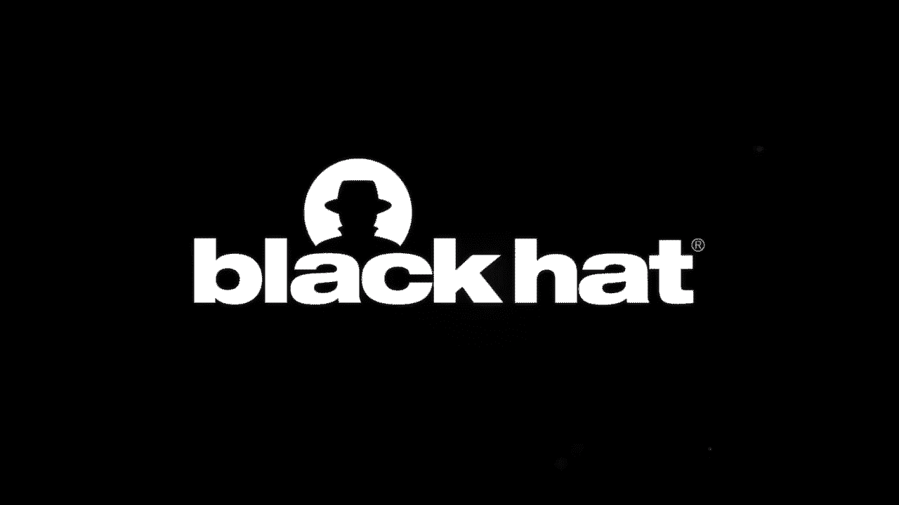

 Let's start with who am I？ Well， I'm 18 years old。

 I'm a sophomore at the Rochester Institute of Technology。 I love Windows internals。

 I'm mostly self-taught with a strong mentor group helping me along the way。

 And I have a strong game hacking background， which is why I'm involved with Windows internals。

 So let's begin with what is this talk about？ Well。

 in this talk we're going to be going over loading a Rookit， communicating with， a Rookit。

 abusing legitimate network communications， an example Rookit I wrote called a Spectre， Rookit。

 and the design choice is behind it。 Using commands from kernel and tricks to cover up the file system trace of your Rookit。

 So let's begin with Windows Rookit overview。 Well， when I say Rookit in this presentation。

 I'm going to be referring to kernel level， Rookits on Windows。

 So why would you want to use a Rookit？ Well， kernel drivers have significant access to the machine。

 Unlike in user mode， you pretty much have access to anything and everything。

 Kernel drivers run at the same privilege level as a typical kernel antivirus。

 So this means that generally speaking， you have the same access to the same resources。

 There are less mitigations and security solutions targeting kernel malware。

 If you can load kernel code， chances are you can do a lot to cover up your tracks。

 Antivirus often have less visibility and city operations performed by kernel drivers。

 This is because antivirus often depend on using user mode hooks to gain visibility into。

 certain suspicious operations。 But in the kernel， you can't directly hook an task kernel because of patch guard。

 Finally， kernel drivers are often ignored by antivirus。 Let's take a look at an example of that。

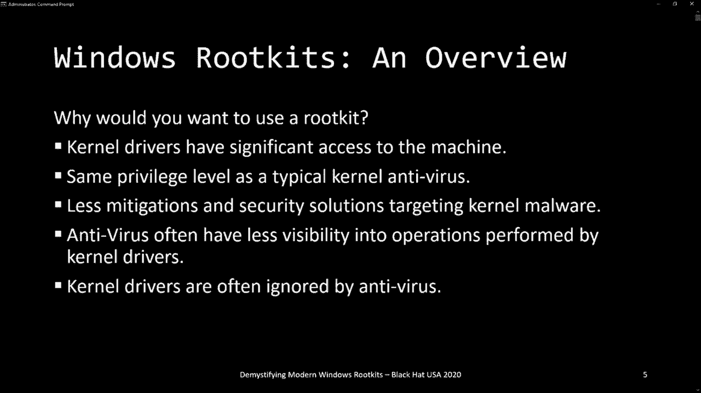

 So whether you're running a consumer antivirus or a corporate EDR， chances are that the application。

 you use will treat kernel drivers with a significant amount of trust。 For example。

 here we have the pre-process thread callbacks from both malware bytes and carbon， black。

 So these functions are called whenever a handle is created or duplicated to a processor or。

 a thread。 Starting with malware bytes， what they do in their callback is check to see if the process。

 ID is less than 8。 And if the kernel handle is for a kernel handle。

 then it will just go ahead and return zero， and stop processing there。 For carbon black。

 they take a little bit of a different perspective。 If the handle is for a kernel handle。

 or if the previous mode is not user mode， then it， will not process that handle creation。

 So let's talk a little bit about loading a rootkit。 Well， there are a lot of vulnerable drivers。

 With some reversing knowledge， finding a zero day in a driver can also be trivial。

 Some examples include Capcom's anti-cheat driver and tells now driver and even Microsoft。

 themselves。 Now， the reason I put vulnerable in zero day in quotes is because oftentimes drivers require。

 administrative privileges to communicate with them。 Following Microsoft standards。

 ring 3 with administrator to ring zero is not a valid security， boundary。 So technically。

 it isn't even a vulnerability。

 But this doesn't mean we can't abuse it either。 So using legitimate drivers has quite a few benefits too because you only need a few primitives。

 to escalate privileges and finding a vulnerable driver is relatively trivial。

 Great place to start is OEM drivers。 And it's very difficult to detect some operations due to compatibility reasons。

 For example， let's say that a driver exposes some suspicious operations over its I-Octal， interface。

 Especially if the legitimate application uses that suspicious functionality， it can be very。

 difficult for an antivirus to discern whether or not an operation is from a legitimate application。

 and this is just intended use or if a malicious application is abusing that driver functionality。

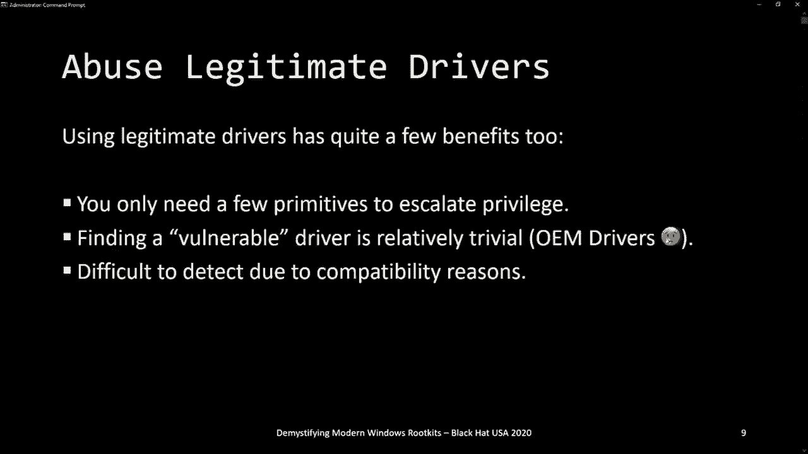

 Now abusing legitimate drivers does have some strong drawbacks as well。

 One of the only reasons I don't really like this method is because let's say you use a。

 legitimate driver to load your own driver。 The problem with this is that you can often run into compatibility issues。

 especially cross， operating system versions。 But even if you， you know。

 we're trying to get rid of all the bugs， you're going to probably。

 run into some edge cases that can cause blue screens。

 And the last thing I want to do is blue screen a victim。 For some Rad Teamers。

 an option is just buy your own certificate for your company。 Now this is great for targeted attacks。

 You're not going to have stability concerns， but it potentially reveals your identity and。

 it can be blacklisted。 Now this blacklisting doesn't really happen so much these days。

 It's something that's being worked on by AV vendors， but it's very possible that a Rad。

 Team company might have their certificate blacklisted because it's strictly associated。

 with kernel malware。

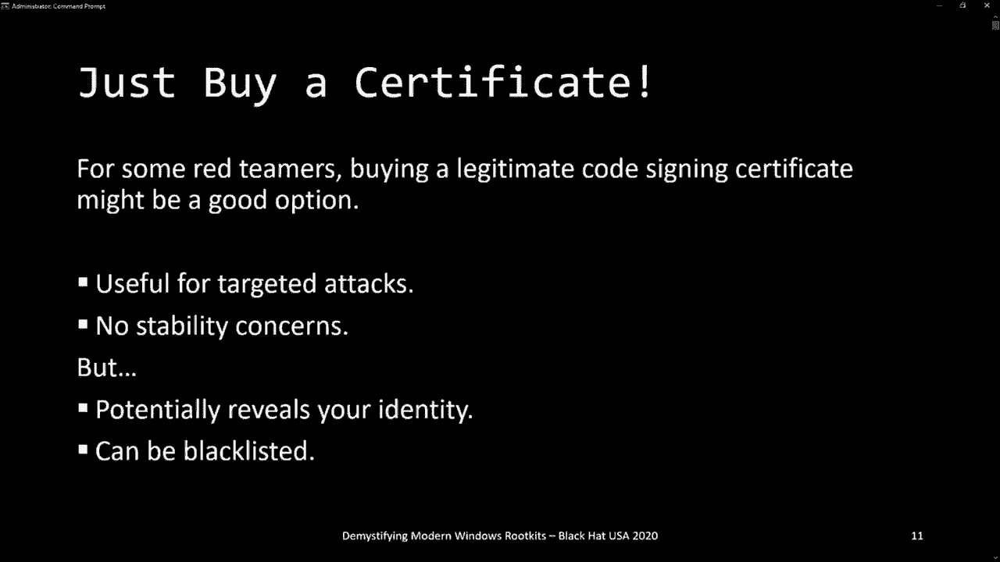

 Another option is just use someone else's certificate。

 And there's actually quite a few publicly leaked certificates available to download。

 If you're looking for one， a good place to start is cheating forms， which have quite， a few posted。

 There's almost all of the benefits of using your own certificate， except without de-anonymizing。

 yourself。 But leak certificate you use can be detected in the future， especially if it's a very。

 public one。 If the leak certificate was issued after July 29， 2015。

 it won't work for kernel drivers， on Windows machines over version 1607 that have security enabled。

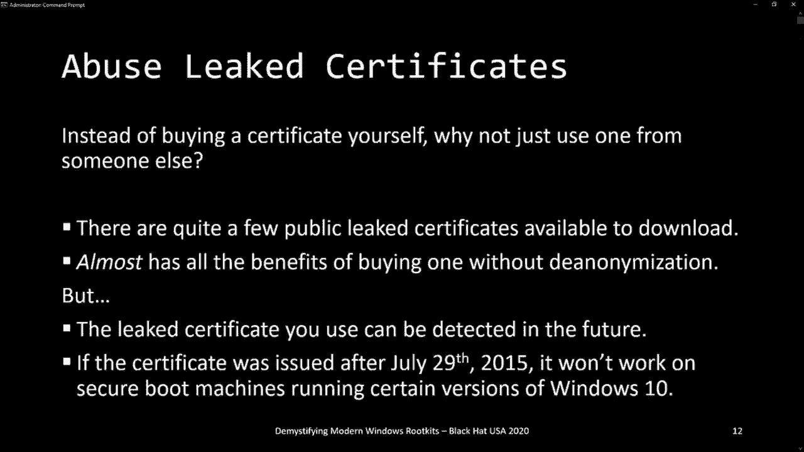

 So in most cases， Windows doesn't actually care if your driver has been expired or revoked。

 So what you see in digital signatures is not what the kernel code signing policy is。

 So even if you see this certificate has been revoked or the certificate has been expired。

 I'd still give it a try because chances are it's going to work for kernel drivers。

 So several leak certificates are already publicly posted， but it's not impossible to find your。

 own either。 For example， this website called Grey Hat Warfare allows me to search open S3 buckets。

 for files。 When I search for PFX and P12 files， common extensions for private keys， I found over 6。

000。

 results。 And the best part about this method is that at this time， the bulk of antivirus don't even。

 come near detecting this method。 This is because I guess they haven't been working on blacklisting as much。

 but I have， not seen any antivirus yet detect most leak certificates I've come across。

 So let's talk about communicating with Herukin。

 Well， a try and true method is just to beacon out to a C2。

 Now firewalls can block or flag outgoing requests that are to suspicious IPs or ports。

 And even for the more advanced techniques， there's new features such as advanced network。

 inspection that try to combat them。

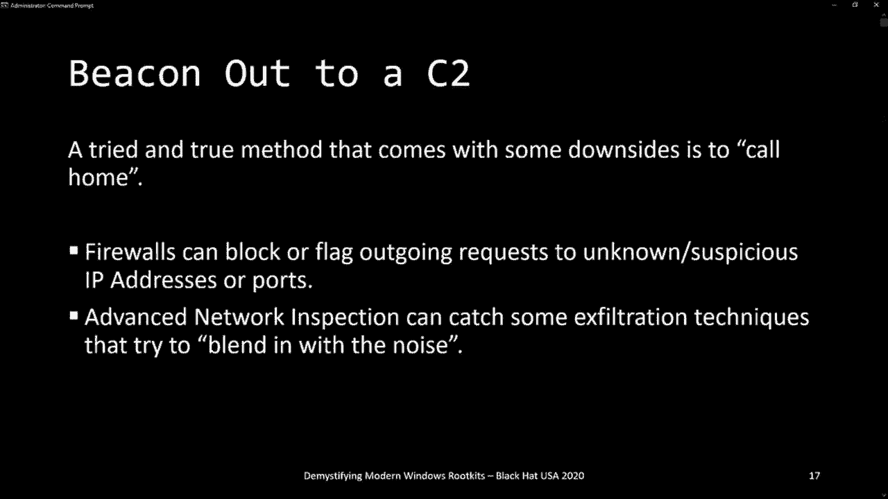

 Another option is just to open a port onto your victim machine and have the C2 connect。

 to the victim。 Now the problem with this is that even though it's relatively simple to set up。

 it can be， blocked by a firewall and it can be difficult to blend in with the noise。

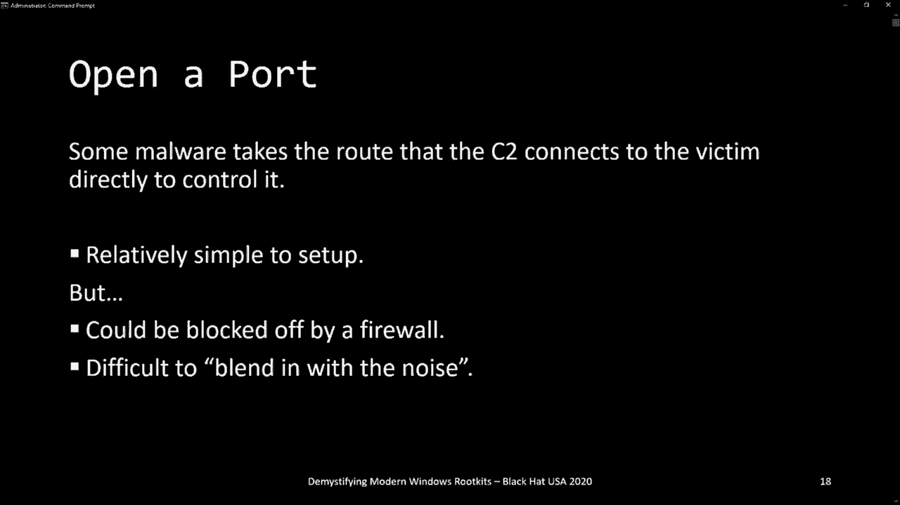

 So another option for more advanced actors I've seen is application specific cooking。

 This is where you piggyback on one application specific communication channel to receive。

 communications directly from the C2。 Now this is incredibly difficult to detect。

 especially if it's using a legitimate protocol。 But it's not very flexible because if the machine you're infecting doesn't have that。

 one service exposed， then you're going to be out of luck unless you have backup communication。

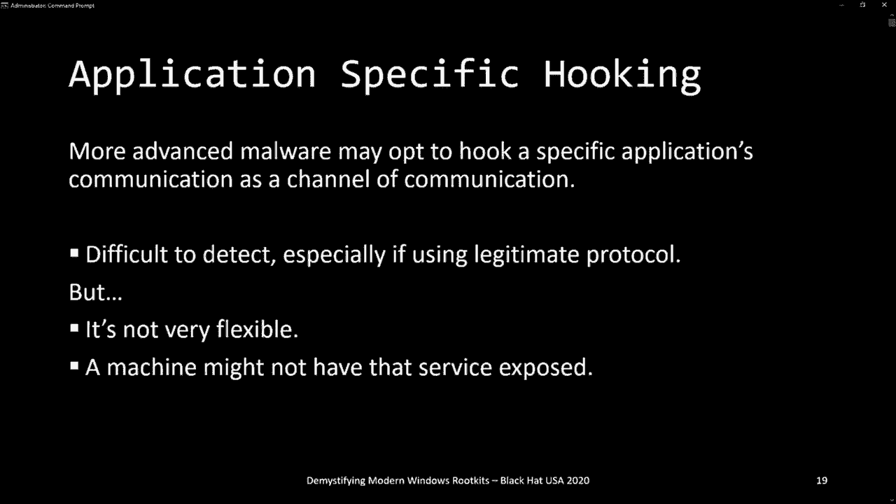

 methods exposed as well。 So what I wanted was a method that had limited detection vectors。

 flexibility for a variety， of environments。 In my assumptions were that victim machines will have some services exposed。

 which is especially， true for corporate environments。

 And inbound and outbound access may be monitored as well。

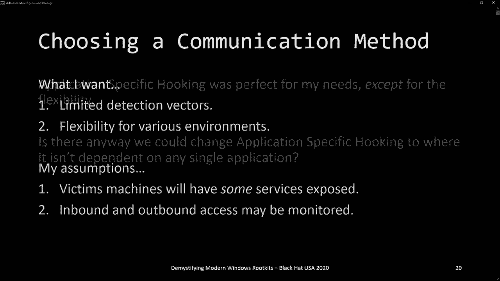

 So application specific cooking was perfect for my needs， except for the flexibility。

 Is there any way we can change application specific cooking to where it isn't dependent。

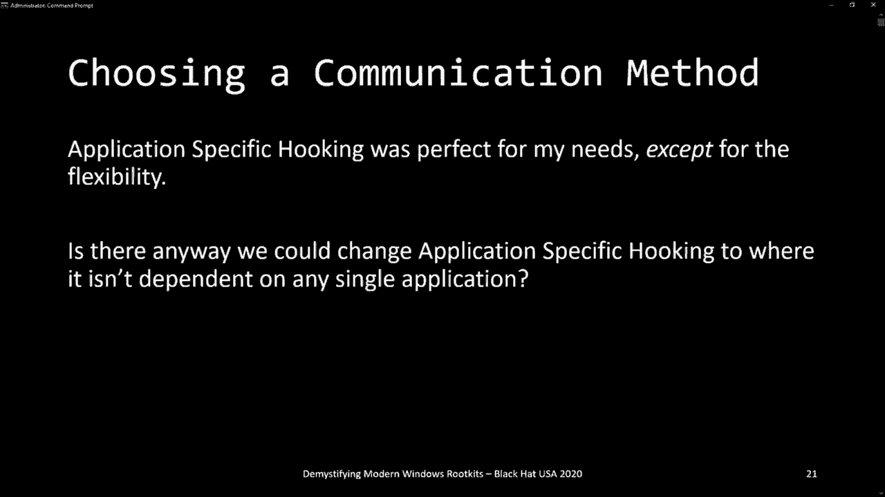

 on any single application？ Well， what if instead of hooking an application directly we hooked network communication similar。

 to tools such as Wireshark， then what we would do is we create these malicious packets。

 in our C2 and insert a magic constant value that the malware is aware of as well。

 Then we send this malicious packet over to any legitimate port on the victim machine。

 Since our malware is intercepting all packets being received， it also constantly searches。

 these packets for the magic constant that the C2 inserted。

 The way we can do is we can piggyback off of all legitimate communication channels by simply。

 abusing the fact of intercepting all packets。 Because what we can do is again。

 from the C2 to the victim， any open port， and with that， magic constant。

 the malware then knows that packet is from the C2 and it can process out。

 other data from it。 So let's talk about how we would hook the user mode network stack。

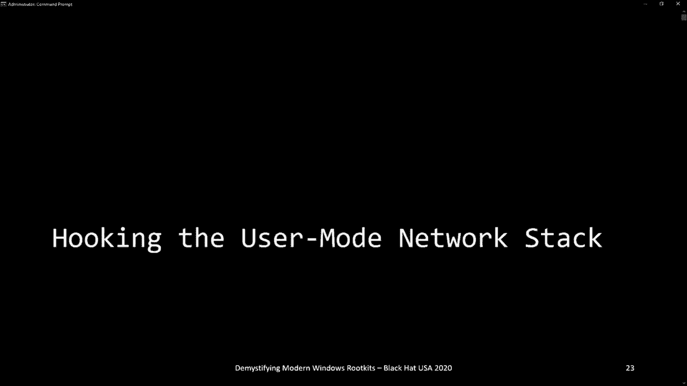

 So a significant amount of services on Windows can be found in user mode。

 But how can we globally intercept this traffic？ Well。

 networking relating to wind socket is handled by AFD。sys， otherwise known as the。

 ancillary function driver for wind socket。 Reversing a few functions inside MSW socket that DLL revealed that they are using an。

 IOC tool interface by the AFD driver to communicate。 Now if you can intercept these requests。

 we can snoop in on the data being received。

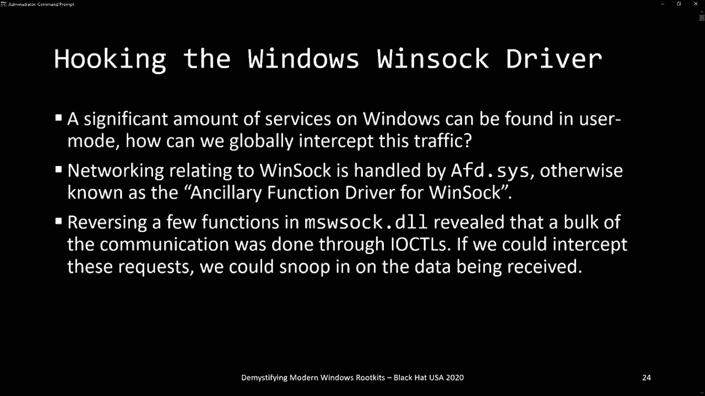

 So when you call anti-device IO control file， how does it actually know， how does it kernel。

 know what function to call？ Well， first it gets the device object associated with the file object by calling IO get related。

 device object。 This is for our purposes just going to be retrieving the device object member of the file。

 object。 If the driver supports fast IO， it'll dispatch the request using the fast IO dispatch table。

 of the driver object。 If it doesn't support fast IO。

 then what it'll do is allocate and fill out an IRP and then， use IO call driver to dispatch the IRP。

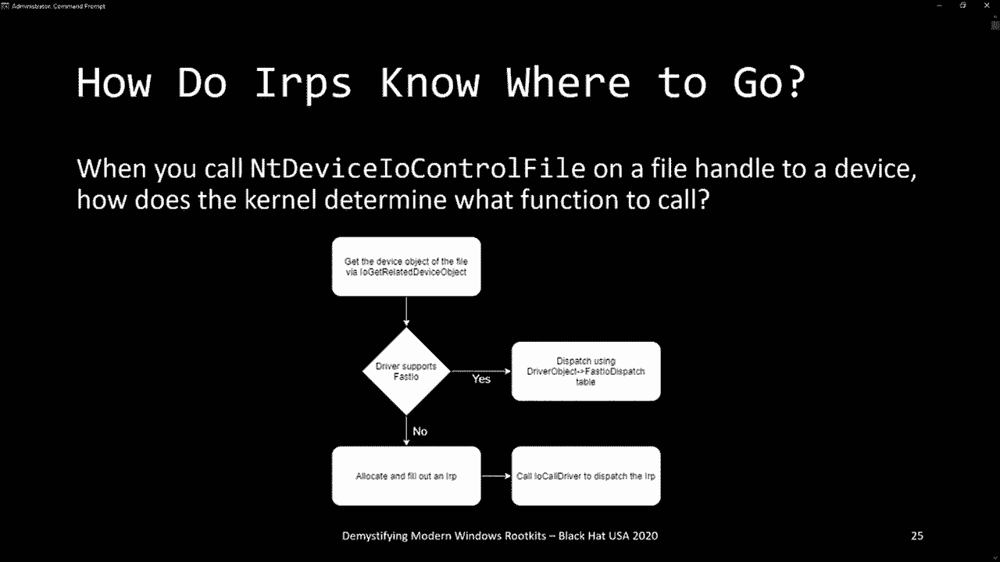

 So let's talk about standard methods of intercepting IRPs。 So the few common methods include。

 so in the driver object， there is this major function， array。 Now this major function array。

 it contains pointers to dispatch functions。 And the index for this array corresponds to the major function code。

 So let's say we want to hook a specific major function code， what we would do is we would。

 go into the major function array and for that index， replace the dispatch function pointer。

 to our own dispatch function。 Another option is to just perform a code hook directly onto dispatch handler。

 So for picking a method， there are a few common questions you should ask yourself。

 How many detection vectors are you potentially exposed to？

 How usable is the method from a stability and compatibility perspective？

 And how expensive would it be to detect that method？

 So for hooking a driver object's major function table， you're going to be exposing yourself。

 to memory artifacts。 From a user-related perspective。

 it's going to be quite stable because driver objects are， well documented and easy to find。 Finally。

 for how expensive is it to detect， well， it's not going to be that expensive because。

 if you think about it， all antivirus would need to do is enumerate the loaded drivers。

 and check their major function table for any patches。

 So for code hooking， you're going to be exposing yourself to memory artifacts。

 And unless the function is exported， you're going to need to find a function yourself。 Now。

 the problem with this is present especially if the driver file changes between operating。

 system versions。 And also， not all drivers are going to be compatible with this code hook because of patchcard。

 And if HVC-I is enabled， this method won't be viable at all。 For how expensive is it to detect？

 Well， it's potentially inexpensive because there are so many different ways to detect， hooking。

 For example， if an antivirus implemented a generic detection functionality where they would enumerate。

 the executable sections for loaded drivers with what's on disk， now that's quite expensive。

 But if they know that you're hooking a specific function of a specific driver， then checking。

 the first few bytes isn't going to be very expensive at all。

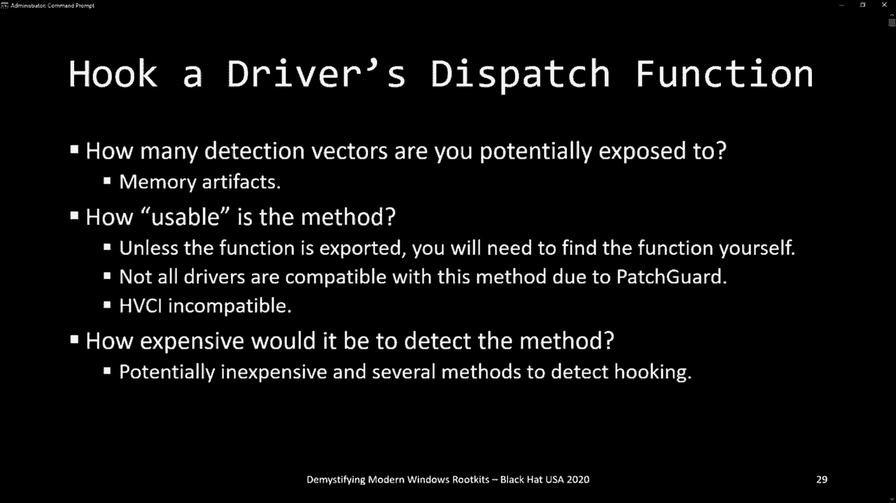

 So I wanted a method that was undocumented， stable， and relatively expensive to detect。 Well。

 what if instead of hooking the original driver object， we hooked the file object instead？

 So what I'm talking about is， well， the device retrieved for a file object is going。

 to end up being the device object pointer inside of that file object。

 So what is actually stopping us from overriding this pointer of that one file object with， our own？

 Well， it turns out absolutely nothing。

 So what we can do is create our own device and driver object， patch our copy of the driver， object。

 So this is not the same thing as patching the original driver object， which can be easily， found。

 This is patching our own copy。 Then we can replace the device object pointer of the file object we're hooking with our own。

 device。 The neat thing with this method is that instead of hooking globally for every different herb。

 from any process， we specifically hook the specific handle we'd like to hook。

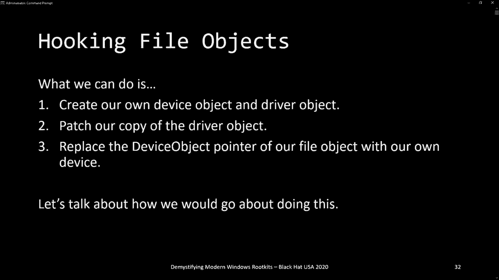

 Let's talk about how we would actually do this。 Well， we need to first find file objects to hook。

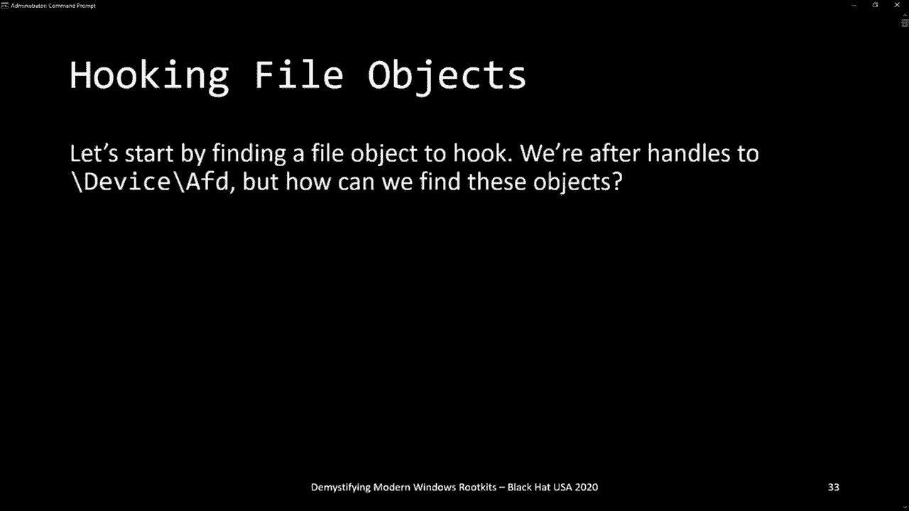

 And the way we can do this is through a great API called， CW Query System Information， which。

 exposes a variety of information about your system。

 Now， one of the classes you can request is the system handle information class， which。

 will allow you to query all handles on a system， including the process ID behind that。

 handle and the kernel pointer for the object that that handle points to。 Now。

 if we open the AFT device ourselves before scanning for these file objects， we can easily。

 determine if a file object is for the AFT device by comparing the device object member of the。

 file object with the AFT device we already retrieved。

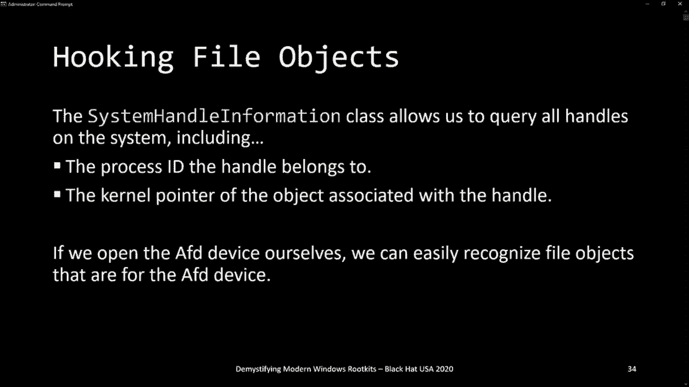

 So before we can overwrite the device object member， we need to actually create our fake， objects。

 And fortunately， the kernel actually exports the function it uses to create these objects， itself。

 So all we need to do is call OBCreateObject， the I/O device object type， an I/O driver object。

 type depending on what object you're creating。 Once you've created the objects。

 you can just simply copy over the existing values。

 With our fake objects created， we're almost ready to set the device object of our file， object。

 But first， we need to hook our driver object。 Now。

 the way we're going to do this is again by using that standard hook a driver object， method。

 But except we are not performing it on the original driver object， this is our own copy。

 which an antivirus cannot easily retrieve。

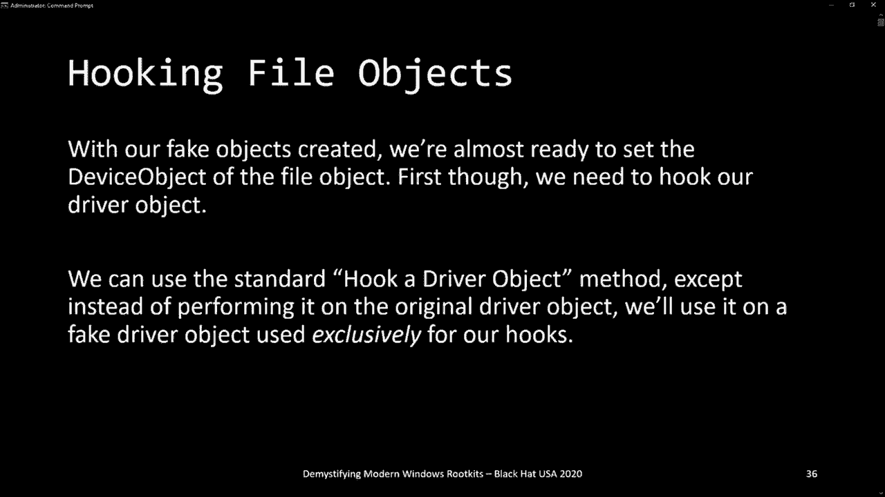

 So to prevent race conditions while replacing the device object member， the original device。

 object we use inside of our hooked dispatch function needs to be set at the same time。

 that we replaced the device object of the file object。

 So the way I did this is by simply using interlocked exchange。

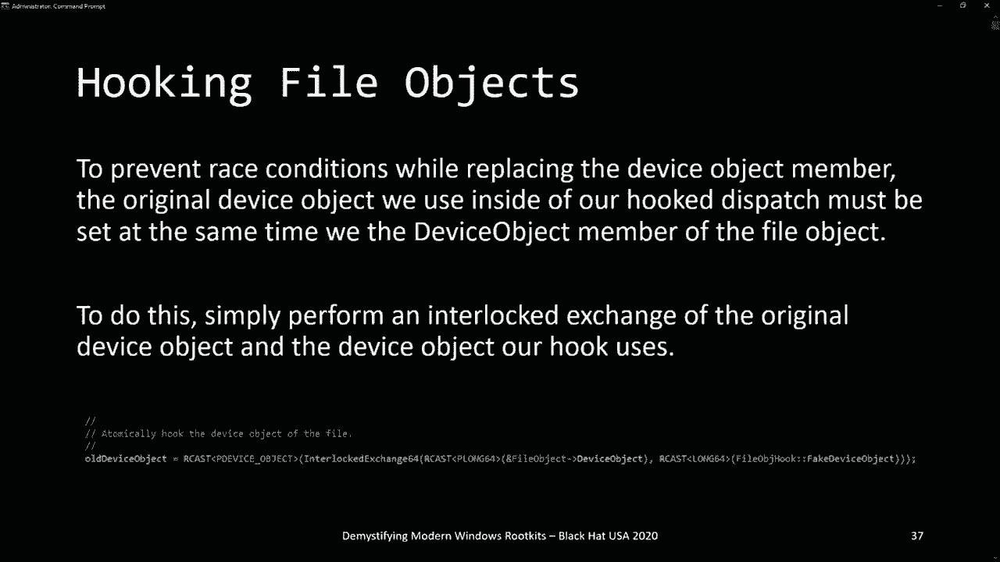

 So now that we've hooked our file object， there's not much work left。 So in our dispatch hook。

 if the major function code that is being called is hooked， then。

 we should pass the original dispatch function， the original device object， and the ERP to。

 the hooked function。 Then， if the major function code ERP， major function cleanup， is requested。

 then we need， to replace the device object member of the file object with the original device。

 This is to prevent any issues during tear down。

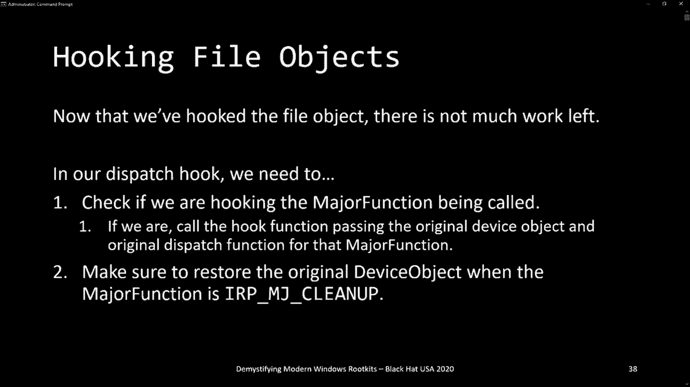

 So how many detection vectors are you potentially exposed to？ Well。

 it's going to be memory artifacts。 And how usable is the method？ Well。

 since most of the functions you use are at least semi-documented， they're probably。

 not going to change too much。 How expensive would it be to detect the method？ Well。

 it's also going to be pretty expensive because an antivirus would have to replicate。

 our hooking process and scan each file object to see if its device object has been patched。

 Let's talk about how the spectra-ruket abuses the user mode network stack。

 So using the file object hook， we can now intercept ERPs to the AFD driver。

 This allows us to intercept all user mode networking traffic and send and receive our。

 own data over any socket。 So to review our existing plan is to hook network communication in our malware that is。

 on the victim machine。 Similar to tool such a large shark。

 and then we place a special indicator in the packets， we create in our C2。

 And when this packet is sent， the malware scans for that magic constant and then recognizes。

 that magic constant。 And it parses out any extra data that that packet might have。

 But how can we actually retrieve the content of packets that are received？

 Just because we intercept AFD communication doesn't mean we have immediate access to those。

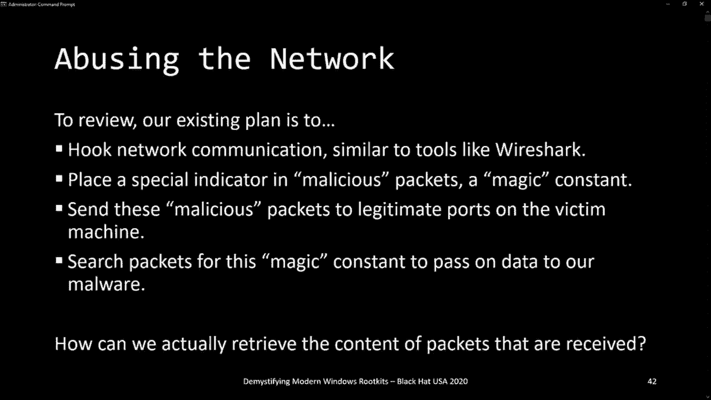

 buffers。

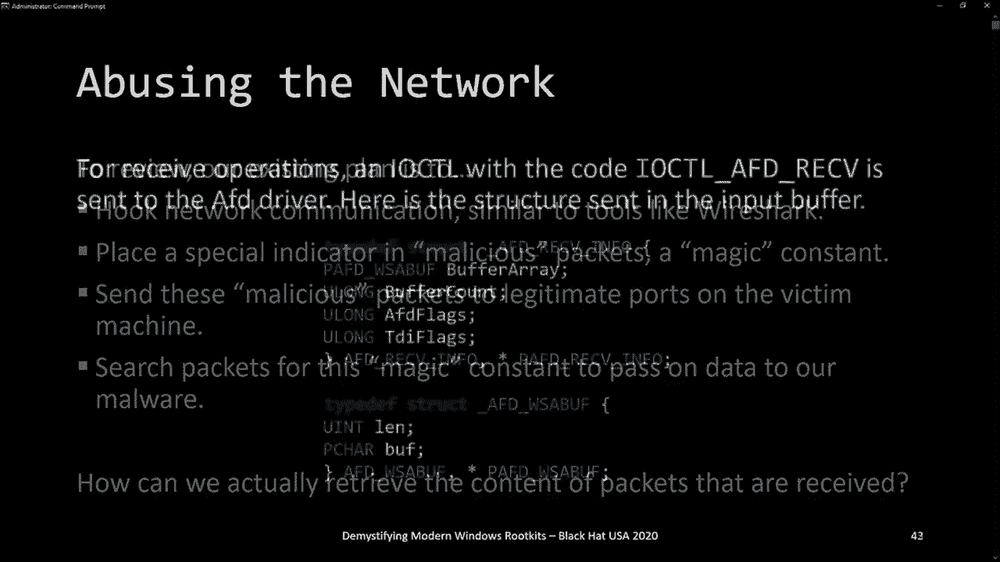

 So for receive operations， an I-octal to code I-octal AFD receive is sent to the AFD， driver。

 Here's the structures that are sent to the input buffer。

 Now the AFD receive info structure is the one that's actually sent。

 And it has some flags and an array of buffers。 This array of buffers is what actually contains the content of the data that was received。

 Let's talk about how the Spectre Rookit was designed， specifically the packet structure。

 that you get sent from the C2 to any legitimate port。 Well。

 the packet structure allows you to prepend any data you want， as long as it isn't the， magic value。

 And you can have your magic constant。 And what you can do is this magic constant will act as a reference point for the rest。

 of the structures。 After the magic constant， you can have a base packet structure。

 which is seen on the right， as well。 And all it contains is the packet length and the packet operation being requested。

 After the base packet structure is an optional custom structure。

 Now this custom structure will vary or may not even exist， depending on the type of operation。

 being requested。 The custom structure you can append any data you'd like。

 The idea is that with this packet structure is that you can send any packets you'd like。

 before the malicious packet or after the malicious packet。 And even in the malicious packet itself。

 you can prepend or append any data you'd like besides。

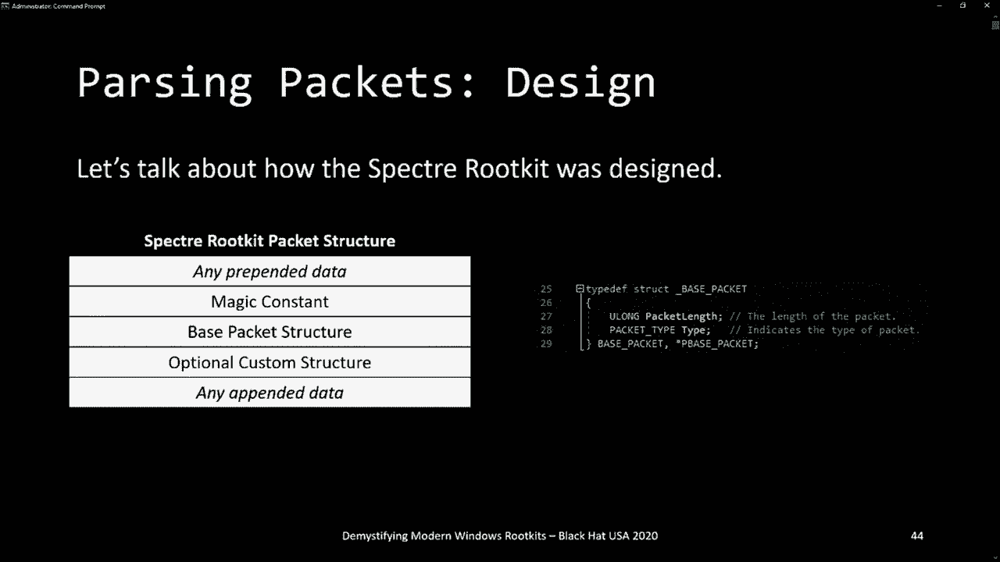

 the magic value。 So once a packet is received by the malware， what it does is it'll search a buffer。

 search， the buffer received for the magic value。 And if the buffer contains the magic。

 it'll go ahead and pass along for processing。

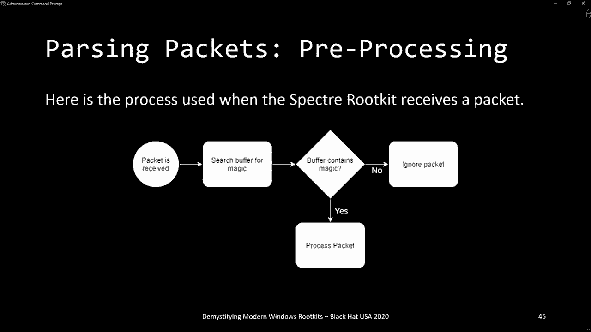

 If it does not， it'll simply ignore the packet。 For processing。

 it'll check to see if there's enough bytes to fill out a base packet structure。

 in the already received data。 If there is enough bytes。

 it'll check to see if there's enough bytes for the custom， structure if there is one。

 Only when both of these base packet and the optional custom structure is fulfilled will。

 a dispatch packet。 If in any case it needs to get extra bytes。

 it'll go ahead and receive it using the socket， handle。

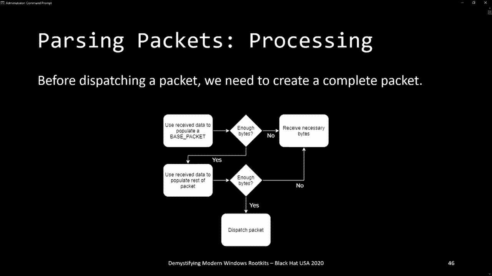

 So before we go any further， let's also talk about packet handlers in the spectrauket。

 So the spectrauket contains a general packet handler class that exposes a virtual process。

 packet function。 Now this base packet handler class has a default constructor that accepts a pointer to the current。

 packet dispatcher instance。 And the process packet function below it accepts a pointer to the current packet。

 We'll talk about the dispatcher and later slide。

 So an example of a packet handler included with the spectrauket is the ping packet handler。

 Now this handler is used specifically to determine if a machine or a port is infected。

 Now the incoming packet has no actual data other than indicating that its type is a ping。

 and the handler responds to the client or the C2 with just another empty base packet。

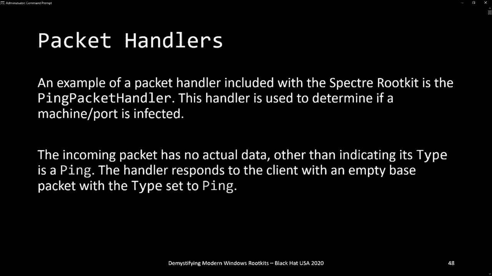

 with this type set to ping。

 So once packet is completely populated during dispatching， the packet dispatch will allocate。

 a packet handler depending on the type of operation being requested。

 It'll call the packet handlers process packet function and then it'll free the packet handler。

 once it's done。 Now the reason the packet dispatcher is really awesome is because since it passes a pointer。

 to itself to packet handlers， what can happen is that the packet handler can re-dispatch。

 recursively a brand new packet。

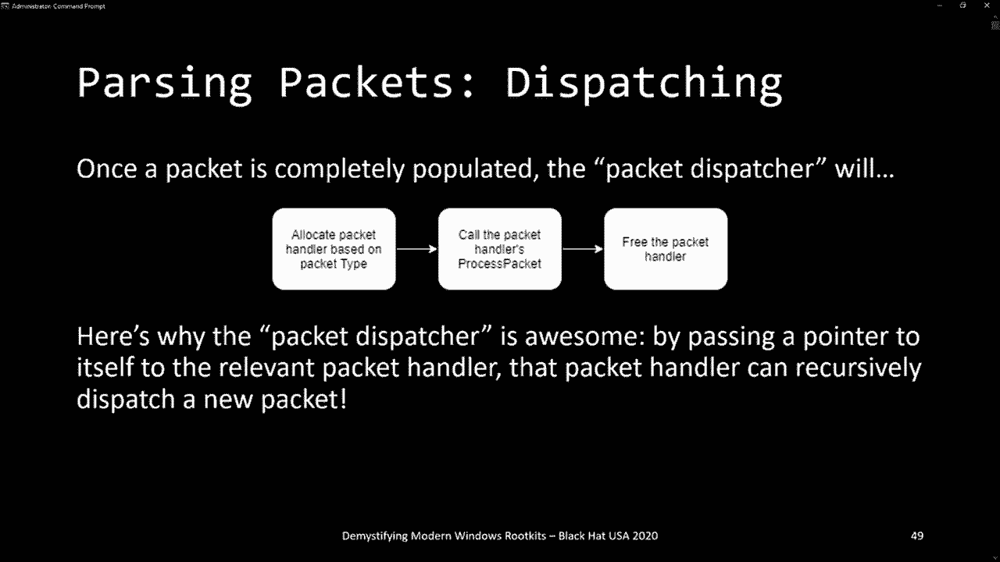

 So the best way I can explain this is through an example。

 So let's talk about the Zor packet handler included with the spectrauket。

 Zor packet handler takes in a Zor packet structure and this structure contains a Zor。

 key and a Zor content。 So what the C2 does is let's say it wants to request some operation。

 It'll take the bytes of that base packet and optional custom structure and stick it。

 into the Zor content array。 Then it'll generate a random byte in place of the Zor key and use this random byte to。

 perform a Zor operation on each byte of the Zor content。

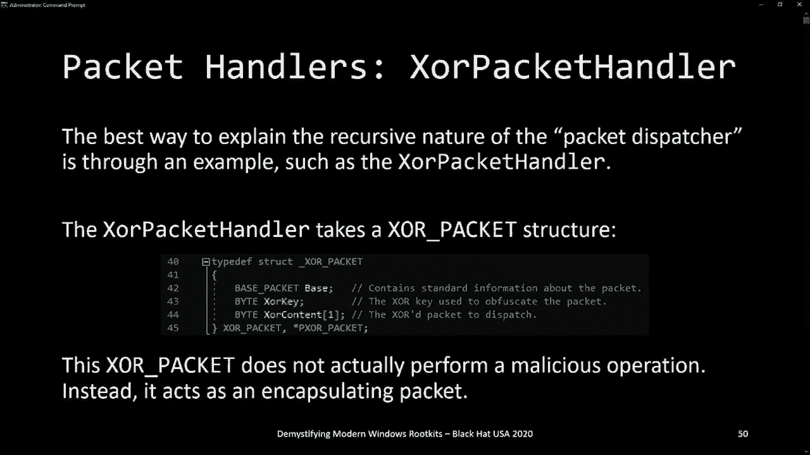

 When the Zor packet is received by the malware， it'll use a Zor key to deopuse the Zor content。

 and then what it'll do is call the dispatch function again， except it'll pass the Zor。

 content as the new packet to the dispatch。 So to explain this is pretty simple。

 the spectrauket allows you to create infinite layers of encapsulation。

 Now this is great because for example， if you create a few different type of packet。

 handlers such as Zor packet handler， you can create layers of obfuscation and change the。

 bytes of packets randomly and allowing you to add entropy even if you're requesting the。

 same operation。 Your common future seen in kernel malware， sorry。

 malware in general is executing commands。 But before we can actually execute commands in the kernel。

 we need to understand how do， you execute commands in user mode？ Well to follow a basic example。

 first you need to create pipes for your output。

 Now this is going to have a read and write handle to this new pipe and you can use to。

 create pipe function for this。 Then you're going to create a startup info structure and in the structure you're going。

 to set the standard error and standard output handles to the on-nades pipe you just created。

 And you can， here you can also set window flags such as hide the window so that the。

 victim doesn't see the command prompt window being created。 Once you set those structures。

 you just can call create process and you can wait for the， exit using wait for a single object。

 Once the process is exited， you can retrieve the output of the process by calling read file。

 on the on-nades pipe。

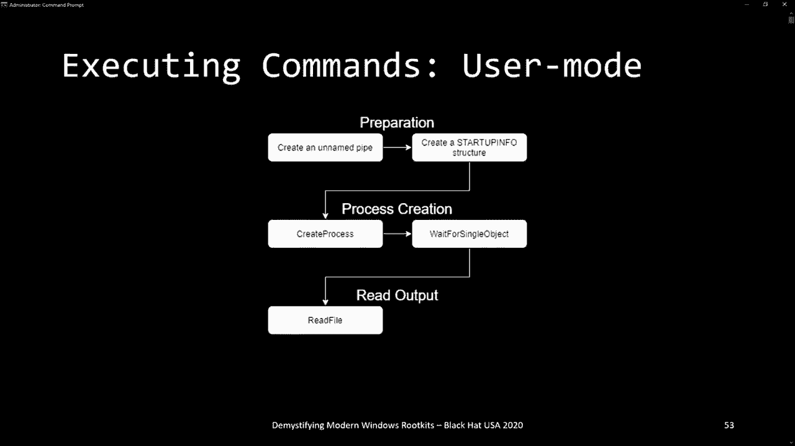

 So first let's begin by reimplementing the create pipe function。

 So what the create pipe function does in the background is name if it will check if the。

 device named pipe is already opened， if it is not it will go ahead and open it。

 Then it will set the root directory for the object attributes for the brand new pipe to。

 this named pipe device。 When it calls anti-create named pipe file。

 it will use the access rights generic read， because this function creates both a read handle and a write handle。

 Once the pipe is created， it will call anti-open file with the root directory set to this brand。

 new pipe。 This is used to obtain a write handle for that pipe。

 So once we have the pipes， we just need to create the actual process and we will be using。

 zwcreate user process because that is what the kernel 32 API uses itself。

 The first thing you need to do is generate an attribute list。

 Now the attribute we are going to set is just a ps attribute image name which represents。

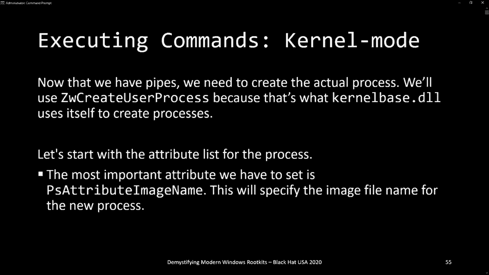

 the image file name for the new process。 Next， we have to set an rtl user process parameter structure for the new process and。

 in this it is very similar to the start of infrastructure we saw in user mode except。

 we have to specify a little bit more information。 So besides the window flags and the output handles to our pipes。

 we need to specify the， current directory， the command line arguments。

 the process image path and the default desktop。

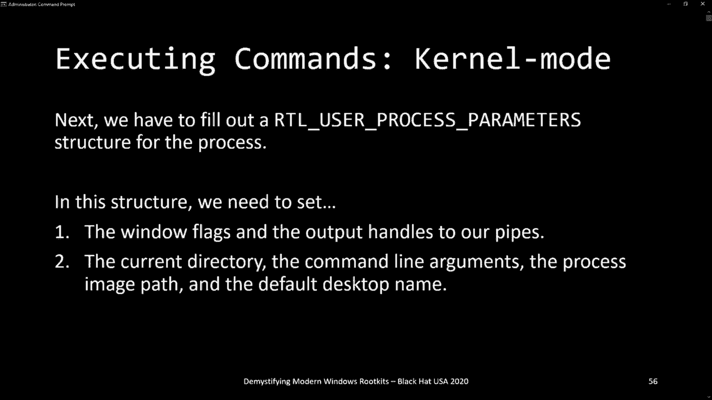

 name。 From there， all it takes is a call to zwcreate user process to start a process。

 And once the process has exited， similar to what we do in user mode， we can just call。

 zwread file to read the output of the process。

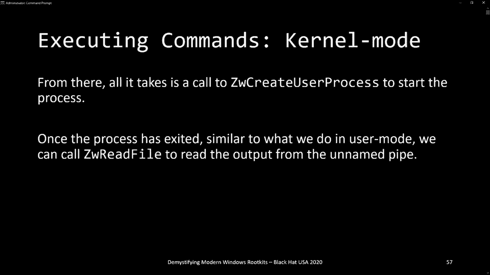

 So let's talk a little bit about hiding a rootkit。

 I'd like to introduce you to many filters。 So what many filter drivers allow you to do is attach the volumes and intercept certain。

 file I/O。 This is performed by registering with the filter manager driver。

 So to give an example from Microsoft， when a user calls file I/O when it is sent to the。

 file system， the filter manager driver will actually intercept their search quest and then。

 it will pass it along to the many filters that have registered with it。

 These many filters have a lot of control and they can even edit or modify the file request。

 Once it's been edited or just passed through all the many filters， it's then sent to the。

 file system。

 So many filters can be useful to master presence of our rootkit。 For example。

 a mini filter can redirect all file access for a certain file to another， one。

 So we can use this to redirect access from our rootkit file to a legitimate driver file。

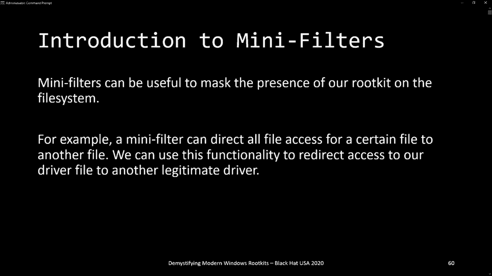

 So again， going back to the previous picking a method slide， you were concerned about detection。

 vectors， how usable is the method and how expensive is it to detect。

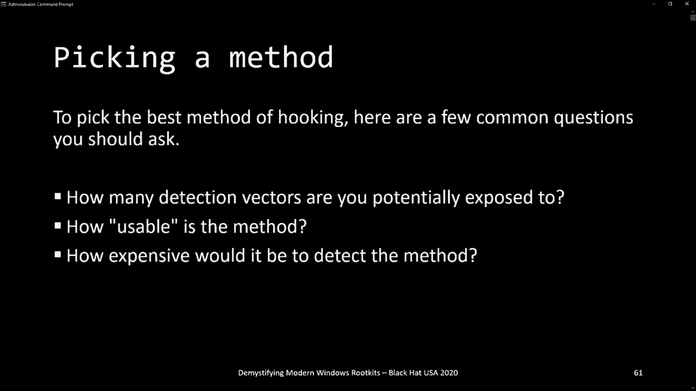

 The easiest way to abuse functionality of a mini filter is to become one yourself。

 Here's the minimum requirements for FLT register filter。 First。

 you create an instances key under the service key。 Then under the instances key。

 you create an instance name key。 This can be any name you'd like。

 You'll use this name for step three when you create a default instance value under the instances。

 key and you set this name to the string value to the name you used in step two。 And finally。

 in step four， under the instance name key， we'll add the altitude and flags， values。

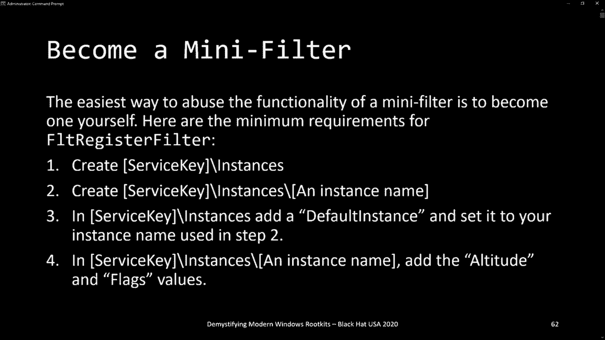

 How many detection vectors are you potentially exposed to？ Well。

 you're going to be exposing yourself to registry and memory artifacts。 How usable is the method？

 There's no concerns from a stability or usability perspective because this is how legitimate。

 drivers register as a mini filter。 How expensive is it to detect？ Well。

 besides the registry artifacts， you're going to be easily innumerable through functions。

 such as FLT enumerate filters。 And also， filters can be enumerated from user mode with administrator privileges。

 So really， it's not that expensive to detect。

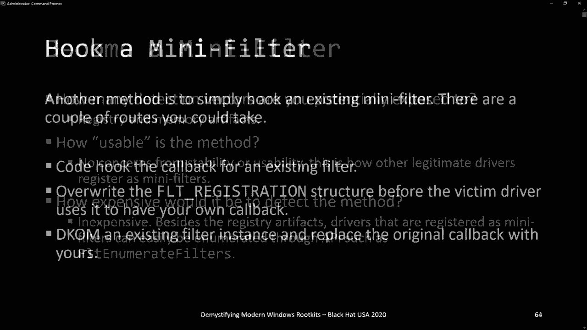

 So another method is to just simply hook an existing mini filter。

 And there's a couple of routes you can take。 You can code hook an existing callback or you can overwrite the FLT registration structure。

 that is used in the call to FLT register filter before that function is actually called。

 Or you can decal them in existing filter instance and replace the original callback with yours。

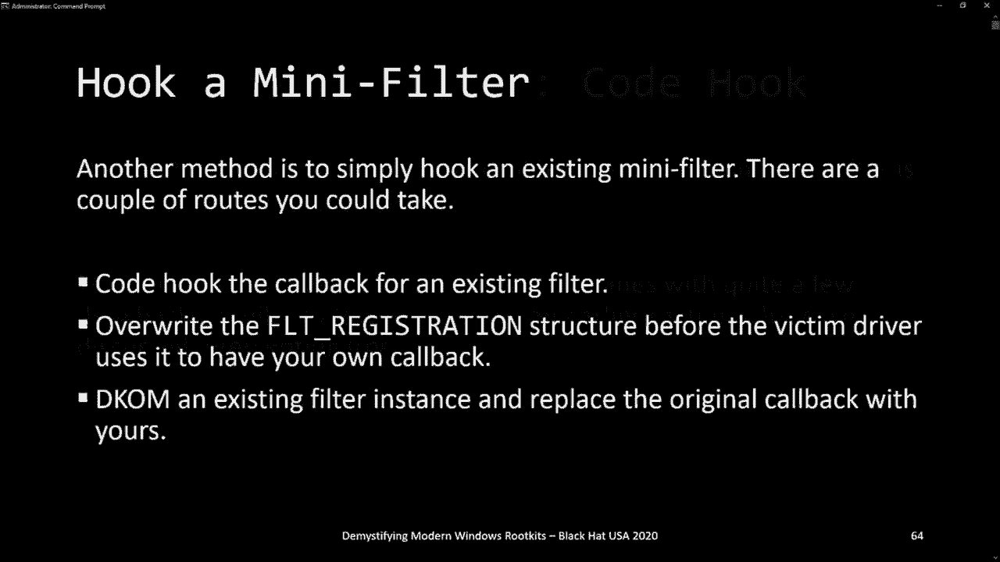

 So again， one of the easiest ways of intercepting callbacks is just to perform a code hook。

 There's going to be quite a few drawbacks， even if you did something as simple as a jump。

 hook。 You're going to be exposing yourself to memory artifacts。

 You're going to need to find a function yourself。 It's not compatible with patch guard or HVCI。

 And it's going to be pretty easy to detect to you because there's just so many different。

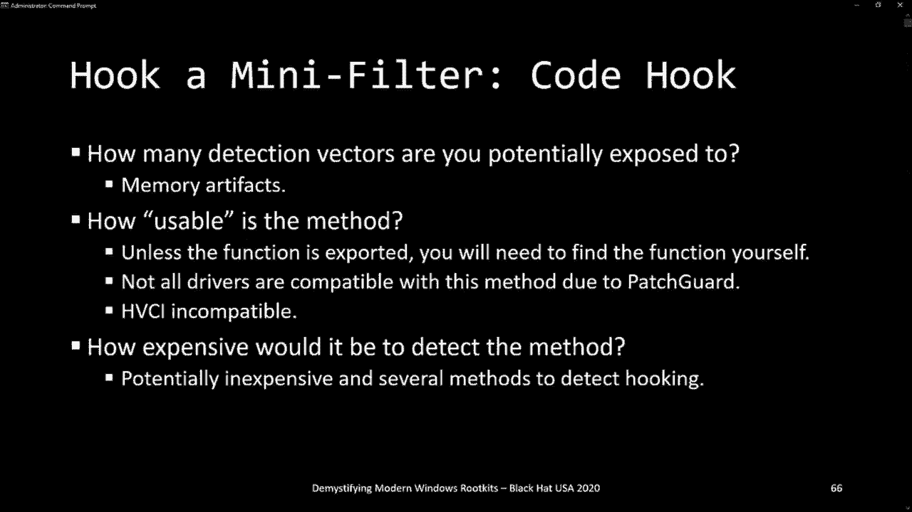

 ways of detecting hooking。 So another semi-document method of hooking is using an existing mini filter。

 So what you can do is you can enumerate filters in their instances using FLT enumerate filters。

 and FLT enumerate instances。 The function that gets called for a certain operation is specified in the FLT instance。

 structure。 So this FLT instance structure has this callback nodes array。

 And what this array contains is the free operation and post operation， depending on the array。

 index， which is associated with the major function。

 So what you can do is you can find the FLT instance by first enumerating filters and then。

 enumerating instances for that filter。 If there's a callback node you'd like to replace。

 you just simply set the pre operation or post， operation function to your own。

 Now a note with this is that you're going to also want to patch the FLT filter structure， as well。

 which contains an FLT registration structure。 This is because you don't want to leave any traces of your hooking。

 So what you're going to want to do is inside of that registration structure inside of the。

 filter structure is replace the pre operation or post operation there as well。

 Now this doesn't have any actual impact other than making sure that the values align with。

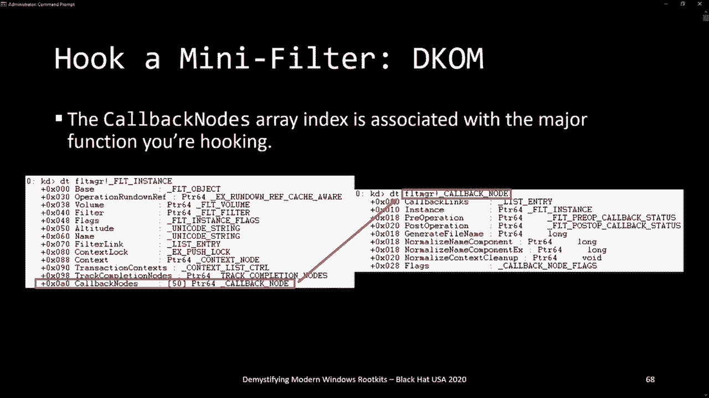

 the function that you're hooking。 So how many detection vectors are you potentially exposed to？

 Or are you going to be potentially exposed to memory artifacts？ How usable is the method？

 Now since finding an FLT instance is semi documented， it's going to be pretty stable， but the FLT。

 instance structure itself is undocumented。 So that can change randomly as well。

 How expensive is it to detect？ It's going to be still relatively inexpensive because an antivirus can enumerate these filters。

 and their instances and then check to see if any of the functions are outside of the。

 bounds of the driver。 So let's say you have a mini filter and you like to abuse it。

 What's an example of that？ Well what you can do is inside of the pre create callback。

 you can use FLT， get name information， to get the path of a file being accessed。

 If a path contains a protected file， you can replace that file name using IO replaced file。

 object name。 Then if you return status reparse， what will happen is that file access will be redirected。

 to that brand new file。 And so what we can do is then when a person accesses our root get on the file system。

 we can then redirect it to another legitimate driver so that it appears to be legitimate。

 Alright so wrapping up， I'd like to give thanks to Alex Ainescu who has been a long time。

 mentor and is very experienced with Windows internals。

 React OS because their documentation and source code is fantastic when reversing Windows， itself。

 And Amanda Malismijic and Volad Ainescu who helped review this presentation。

 So thank you so much for coming to my talk during these hard times and I appreciate you， coming out。

 If you'd like to follow me on Twitter， that's my Twitter handle， check out my blog and if。

 you'd like to check out the specteruket， there's a link available。 Hopefully it'll work。

 Hi there guys and thanks for coming out to my talk。

 I'll be answering questions in chat now and if you ever want to reach out with anymore。

 feel free to contact me over Twitter or by email。 Go for it。

