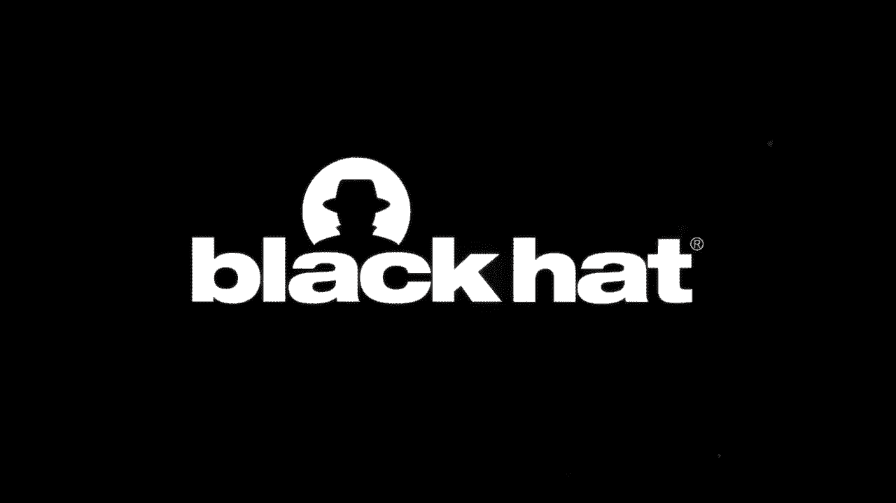
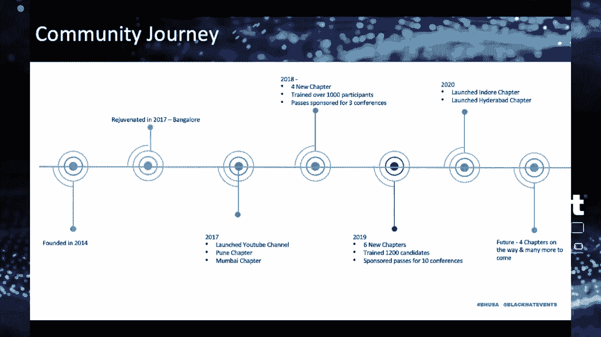

# 【转载】Black Hat USA 2020 会议视频 - P70：71 - Making an Impact from India to the Rest of the World by Building & Nurturin - 坤坤武特 - BV1g5411K7fe

 [Music]。

 Hi everyone， today's talk is about making an impact from India to the rest of the world by building and nurturing women in social community。

 We all know that women are underrepresented in the information security sector。

 The world average female literacy rate is 79。7%。 While in India the average female literacy rate is just 65。

46% as per women's web。 In India a million engineers graduate a year but there are only 10% of them are women in it。

 Now after the 10% we will only find 0。5% in N-46。 That's how the stats are more or less。

 The ratio in the cyber security tools are really dim。

 Everyone knows about it and it's widely recognized。

 Now I have some questions for the women in the audience。

 Have you ever felt that you are one among like thousand people？

 Have you ever felt that you needed a mentor but couldn't find one？

 You wanted to talk to somebody what was hesitant in speaking。

 Thinking that they might judge me or I wouldn't be able to articulate the things where。

 Everybody knows that this feels like women role models。

 And how many infotech women champions are there especially when we talk about India？

 Handful of them。 There are so many unconscious bias we all have。

 Whether I'm inadequate to be part of IT or infotech， whether I'm good at it or not。

 We are hesitant in speaking with the people who are not like us。

 We always look for safe space to speak without feeling being judged。

 We as women always want to be 10 on 10。 We family， we workplace， we're anywhere else。

 Everything should be well at home。 Husband to be best in space。

 Childs to have the best of life which leaves very less space for our own aspirations。

 These days are hectic。 We can't even move hectic。 Especially to think about anything else than family。

 Now according to one of the surveys women represent only a quarter of the overall workforce in cyber security。

 This is significant to a higher number than 2017 which was just 11%。

 But we still have a long way to go。 I also felt all of that and that's what motivated me to take up a community which can help bringing more women in cyber security。

 Now， men in the audience， if you want to bring more women in and for sex and your area of work。

 I have given a talk at Global Apps at DC on bringing diversity and inclusion。

 You can take a look at it。 Now what this talk is about。

 this talk is about in for sex girls community。 The community we have built in India。

 What the community means to us。 How we started the community。

 And along the journey of the presentation I'll share the framework on how to start a community and join the community of your interest。

 We've been getting trainings across the years。 So we will be also releasing the trainings with this talk。

 Now， before we deep dive into the presentation， I would like to introduce myself。

 I'm Vandana Vermaas-Soleons。 My big job is with one of the multinational companies as a security team。

 She's Aftertish。 And I'm also the president for in for sex girls。

 I also want to work and keep on spending my free time with various initiatives with all of us with in particular who's techno and many other initiatives。

 Apart from that， I regularly host speech and be part of multiple local and international conferences。

 Now， I wanted to portray in for sex girls in one of the pictures。 Now。

 when I tried to search and when I tried to visualize this one just does the job brilliantly than anything else。

 It sums up in for sex girls really well。 What is in for sex girls？

 It's a community which is always thriving and working hard to support women and students to be part of in for sex girls and part of in for sex。

 Now， the core aim of in for sex girls is to encourage them。

 make sure they don't lose the in for sex space。 These father in for sex girls with the idea of giving the safe space to women。

 but then we expanded it to the students。 In a short span of four years。

 we have been able to leverage our own community and bring together many people。

 We have provided one to one mentoring to more than 200 women。

 There have been multiple career counseling sessions。

 which then resulted in more than 20 final job offers。

 We have built a thriving community of speakers more than a dozen out of them have gone out and spoken at global conferences。

 In for sex girls started in 2014。 We had a down call for some time。

 but then we rejuvenated back the community in 2017。 Since then every year。

 we are trying to outgrow the number from past year。

 We started the community with only Bangalore chapters as there were multiple questions in mind。

 How many participants and speakers would be coming and with our regular jobs and families？

 How are we going to manage all of this？ Some of us， including myself。

 had more than a fair share of family responsibilities， including in fence。

 So hence we started the humble goals to begin with and placards flow and steady growth。

 We are trying to achieve few numbers every year。 Now we have over 15 chapter leaders around the world covering multiple cities in India。

 We have trained over 3000 women across the globe。 Everything was not a rosy picture along the journey。

 We did face a fair share of struggle。 We did have our own dumb calls and issues along the journey。

 And when we talk about building a community or running a community。

 the biggest challenges that when it starts and where it will go。 Unlike an exam。

 we study the courseware and we know whether it will pass。

 we will fail or we will get the distinction。 But with the communities。

 anything better than yesterday is good enough。 But how to keep that going？

 Now the first challenge was gathering the people， sparking the initial interest。

 making sure that we are trying to gather more people， we are trying to spread the awareness。

 So another big challenge was how they are going to balance the families。

 how we are going to balance the families， especially to come to the means。

 And when we talk about less number of women in security。

 so how we can actually bring all of them together。 Another big challenge was the venue。

 How are we going to find a space to collaborate and come and meet with each other？

 So when we started hosting each first time， we had a lot of concerns。

 especially from the venue providers。 There were a lot of trust concerns that what this community is about。

 how it's going to cater to the goals that they have。

 And especially there were a lot of people who asked the money for much and we didn't have money。

 Another thing came into picture wherein how we will find a venue which is like centrally located and people can come there because reaching a venue is one important thing。

 Another big challenge was now we had figured out， okay。

 this is how we are going to gather the people。 This is the venue that we will be wasting our meetup。

 but finding the speakers who can actually have confidence in our own goals and vision that we had。

 So there were so many people who had preconceived notions， especially women。

 I would like to mention that the disparity traces back into the schools。

 I've often heard that people preaching that women are not meant for tech and that they are not for infosec。

 It has nothing to do with gender。 Another big question was that people didn't know about that there can be a women community or actually women can support each other。

 Another most important factor was apprehension。 If we were rude or bullied for speaking something which was not right and everyone has it。

 even I did have it。 Not just women， men also have the same thing。 Time management。

 how will I be able to manage the time with the family。

 We had very low participation due to the less outreach and less people knowing about the cause。

 We did not realize that spreading awareness was very important。

 We were not following multiple mediums to reach the audience。

 In the beginning it was difficult to bring in more than three or four people。

 We had a bunch of people coming into the meeting but we never lost hope。

 We never stopped crying hard。 Now two of the founders started the infosec girls。

 They tried something。 They did a few things。 They had an idea but could not take it forward due to personal and professional reasons。

 At some point in the same girl stopped。 We did not get it but after that we were worried how to stop the same。

 not happening the same again。 Hence the sustainability plan had to be there。

 How to make it run for a longer period。 Another point how to stay motivated。

 We did receive acceptance after a while where people started showing interest in the community。

 They started reaching out to us。 They started asking how I can be part of it。

 Then you provided us trusting us and supporting us with sponsorships and telling you， "Okay。

 you can use my venue。"， We do have four to five venues available in most cities that we have our infosec girls and we host meetups。

 They were saying， "Keep doing the good work。 Don't wait for the reward。

 Things will automatically turn out to be positive and that's what happened to us。"。

 You can see on the screen。 Now we as part of the infosec girls do contribute in some other way。

 The things that we do I would like to share with you all。 So what do we do？

 We do host regular meetups and as part of the regular meetups we try and meet and connect with each other to share the technical knowledge。

 We also connect over informal lunches so that we have a human touch。

 We get to know each other and bond with each other。 We also do meet over ideas and we share ideas。

 I have some ideas but you might have a better idea。 So we just talk about it。

 How we can actually bring something new。 So that's all we do it at our meetups。

 And it is COVID time。 It's really not possible to meet in person。

 We felt the same way back in 2017 that not all of us would be able to join in person meetups。

 So we started the virtual meet wherein we started our own YouTube channel and we started hosting all those global meet wherein women around the world can chime in and connect with the Indian women。

 So at every meet there is one Indian women for sure。

 And out of those all the sessions that we had there are 80% of them are like first time speakers。

 We started collaborating with schools， universities and many such places。

 So not much has been done in educating the students， especially about cybersecurity。

 We do have a lot of things going on。 Okay， let's do this。 Let's do a hackathon。

 Let's develop something but how about imparting cybersecurity knowledge。

 And I believe there has to be a separate program for bringing up cybersecurity awareness amongst the kids and students or especially college students。

 The pros and cons of cybersecurity needs to be assimilated deep down into the roots。

 Right from the start from the school。 This is how we can make a change and make our nation cyber space。

 One more approach other than the awareness program would be giving them the exposure to unmediated scenarios in the form of games or challenges。

 This will catch their attention and make them brainstorm about the importance of cybersecurity。

 We started bringing cybersecurity to the college students and giving them opportunities before even moving out of the college。

 And hence， entire team of imposy girls spanning across India and outside is trying to bridge that gap。

 We collaborate with international institutions。 When we talk about cybersecurity。

 it's all about ideas and I really rules the world。 Learning is a lifelong process。

 The earlier it starts the better。 So how about providing scholarships and partnerships to the students and women。

 As part of imposy girls， we provide scholarships for various forums and conferences。

 We collaborate with many conferences and colleges to make sure that students and women go out and be part of the bigger conferences。

 bigger community and experience。 How the world looks like when we talk about it for the girls。

 It's not just a cocoon。 Come out of your cocoon and talk with people。 Share your ideas。

 So now the gap has been identified。 Our mission is to bridge that gap and educate more and more women passionate towards security by providing them the training via meets and workshops。

 We are giving workshops and trainings at different cities， colleges and other conferences。

 We have given many workshops at global conferences as well。

 So these are some of the trainings that we have given around the world。 In India， outside India。

 like US， Egypt， Israel， South Africa and many more countries。

 Now the tech industry is actually grappling with two by challenges。

 But it's struggling to make sure that we have the right set of people in information security。

 How we can have diverse set of people。 So we started giving our free training at the conferences and colleges。

 So today I want to share what this train was all about。

 So here is a link to our web application security for the people to get started。

 And you can actually see there's a flow step by step process to start off。

 What is web application security？ What is a proxy？ What is an attack look like？

 What is a sequel injection？ What is a cross-site scripting？ What is an IDOR？ What is an X6？

 So everything is documented step by step。 How you can replicate it？

 You've used multiple vulnerable web applications to train people。

 So we have outsourced everything here。 You can take a look at it。 And if you have any confusion。

 you can reach out to us anytime。 So this is a link for our training which we wanted to release。

 And so today we're making our core content public to the wider community and world so that they can get benefit from it and train other people。

 And certainly for college students， if you want to pick start your career in an application theory。

 you can actually take a look at it。 We've also helped some of the organizations and colleges to perform CTF。

 capture the flags。 So we've done partnerships with them for what？

 To encourage the diverse candidates including students around Infosec。 These challenges really。

 really help and especially bring curiosity in them。 When we talk about the Infosec skill gap。

 people really talk about it。 Especially from past few years we've been talking about the skill gap for how to address that。

 That's the number one problem。 Now another problem is how to fix that gap。

 Both of the problems are even more acute when it comes to cyber security。

 There are more than one million cyber security jobs that need to be filled， which is like projected。

 And now when we have such a huge gap to fill those one million cyber security jobs。

 the industry must look at cross train people。 Bring people from diverse groups。 Fresh ideas。

 So how do we actually bring them to increase the number？

 First step is like we have to approach the people who are there to make them active。 Okay， yes。

 you can be part of Infosec。 Now once you have active people。

 how about converting inactive people to the active people？ Branting out。

 reaching out to the people who don't know about Infosec。

 I have trained myself in the QA to bring them to security。 Developers to bring them to security。

 People who are part of sister admins to be part of network security。 So it's like crushing people。

 There's nothing more beautiful than that。 Now， what better way to show you the impact from the ideas and thoughts of people who have been impacted by us？

 So about Jasmine， she started coming to Infosec girls and she felt that yes。

 she can actually overcome her stage fear。 She had a huge stage fear。 But we held her in dry runs。

 demo runs before she actually gave her first stock at Infosec girls。

 Karen learned from other speakers and she's spoken for the first time at Infosec girls online meet。

 Manisha cannot forget the warmth and the vibe of the community。

 She's one of the director for a company， but she did not feel that there is an age gap。

 Irrespective of any age group， this community supports each other。

 Community has abrised her with the latest and greatest things that are happening in the Infosec。

 About Shippa， she has got a place to learn， grow herself and share her knowledge。

 As she is the start of unired。 Now about Hina， she got the place to learn。

 grow and share her knowledge and learn from the workshop that we have been giving。

 She wanted what to know about Infosec girls from her friends。

 And when she joined for the first time， she first formed and welcomed。

 Then there was no looking back for her。 She has been helping us， refining， doing multiple things。

 multiple initiatives， and Infosec girls。 Now， what did we achieve so far？

 We have actually multiple chapters and chapter leaders around the world。

 We have been encouraging the talents， especially the fresh ones。 So we have 80% voice sign speakers。

 We have been upskilling people and we have trained over 3000 plus women around the globe。

 starting with India。 Now， we are open and accessible。 Sometimes in person needs are not possible。

 As I mentioned， so we do host online sessions at our YouTube channel。

 And all the sessions are recorded and available there。

 And we have over like 1000 subscribers now and we have the community support for that。

 Now we also train over 500 school students on the area of attend and cyber security。

 We have we host 10 to 15 meetups every month considering the different states。

 But during the time of COVID， we do the meetups every two weeks so that we can connect with the global audience。

 We've also won a program of the year award at RSA by intelligent。

 This was like we should say thank you to the award owners。

 We've also tried and connected and tying up with multiple colleges across India and abroad to spread the knowledge to train students。

 And we try and help the colleges refine their curriculum specially when it comes to cyber security。

 United we stand。 If I'm managing alone， I will fail。

 I would never be able to perform what I really want to especially when it comes to a community。

 So with unity as in wonder have been any mis happening or any。

 Criticization we always have been there for each other。

 We always have been there and stood for each other。 Whenever any later felt low。

 We always try and talk to each other。 Whenever we are trying to coordinate a session。

 we make sure we learn from the session not just coordinate。

 We all work together and we all respect each other。 Whenever there's a leader who's stepping down。

 we respect them。 We help them look for the future in the others。 Whenever they want to come back。

 the place is theirs。 Now the recipe for a strong community is their passionate people。

 Leaders and compassion we create grooming the new speakers during the dry runs with them before the even talk happens to help them gain confidence because that's very。

 very important。 When I gave my first talk， I couldn't even look at the audience。 I was dead nervous。

 Now we try to make sure we bring the confidence in them。 Now people who are hesitant in speaking。

 we help them in understanding this is how the first time a speaker is doing this。

 Now you can actually give your presentation。 So we help them in the talks。 We keep experimenting。

 We keep experimenting with our own formats like create banners。 We find new speakers every time。

 We keep grooming them。 And now we experiment with the new avenues。 Like right now。

 in the COVID times， we've been experimenting with different platforms that how to stream live on a channel。

 How to do the live training。 How to perform the means。 How to connect with a wider audience。 Now。

 when we talk about in for say good chapters， we have over like as I said。

 15 chapters and these are some of the leaders。 Around the globe that we have without them。

 Infusite girls wouldn't have been possible and would have been existing or sustaining。

 So what we really do with the community， we always ask for feedback。

 We ask that what we can do better。 What can be important。 What all things can be done。

 Especially when we what new we can bring。 Now， after the feedback from the relevant feedback。

 we embed in our own journey。 We all have we all take a tab on the feedback and keep enhancing on that。

 Now， we all have a question when we talk about community。

 Should I start a community of my own or should I contribute to an existing one。 Now。

 I have something to tell you or you should ask these questions to yourself。

 Why would you create a new community？ If there is no community around， if there is a community。

 then that matches your vision and goal of what you want to do。

 Does the goal of the community matches the core values of myself？ If no。

 then do we have the bandwidth to start a new community？ However。

 building a community is a giant expert。 So if you start a community， and sure， you keep it running。

 Now， if the goal matches， we can join the community。

 So we started taking the steps in building the community a few years ago。 We had a lot of questions。

 a lot of challenges along the journey which we'd like to solve。 With this particular framework。

 we're trying to help you with your journey of emphasizing。

 So the first thing is there are four pillars which make this framework building， managing。

 improving， and before that， sustenance。 Now， when we talk about building。

 naming the community is the most important thing。 I mean the right name for it。

 which can match the goal and the vision that you have in your mind。 Finding a venue。

 Plan the main topic。 Creating a mailing list， creating the social media handles so that you people get to know that you are going to start a new community。

 There's a community that they can resonate to。 Announce the meetup。

 Partner with the venue providers so that the meetups can be keep on going。 Find coins。

 Community is not a one-man show or not one women show。

 It has to be with multiple leads so that it keeps on running。

 Planning the frequency of the meet is very， very important。

 whether it's going to happen every month， every two months， every three months。

 What platform we would be using？ Announcing the meets on the website on all the social media handles。

 Now， when you have on the social media handles， you should have a code of conduct that yes。

 this is how we all are going to behave when we talk about the meetup。

 We are going to have meetups every now and then， but how about sustaining it？

 We had our down points， but we came up with a plan so that we can actually keep the community running。

 So we have to discuss with all the leads that how should we keep it running for long time。

 We can have shorter goals。 Okay， let's keep it running for one year。

 Let's keep it running for two years now。 Now， what knew we can bring in the community？

 Then how we can improve on the feedback from the community。

 that's what feels the interest of the people。 The yes， the community is actually my community。

 People are listening， the leads are listening and I can be a lead one day。 It's very。

 very important to take the feedback and work on that。

 These are some of the ethos that we have built for our own community and which can resonate with any of the community。

 We should always give back to the community in some form or the other that we have learned from the community。

 Now， let's give it back。 Now， community is inclusive of everyone。

 Right from a common college student to an old age person。 It can include anyone。

 There's no age for learning something new。 The enthusiasm of the community members。

 we have to keep it running。 We have created a future roadmap for us， a goal for us。

 a vision for us so that we don't have a downfall again。 Or we don't see the downfall again。 So。

 we have a plan for the next 10 years。 Okay， let's keep these many chapter leaders going。

 We have 15 chapter leaders。 How about reaching every part of the country。

 especially that's from India and every part of the globe。

 There are a few unsung areas where people don't think of going。 How about reaching those areas。

 close free conferences for the community to learn and share knowledge。

 Encourage more and more participants and let them speak at the conference at the means。

 Give them a space to speak。 Focus on educating underprivileged people。 There are some key takeaways。

 Now， we've heard all the things that enforce that girls have been doing or what we should be doing。

 How about we pay it forward， showcase the positive differentiation by making security much more secure。

 And if not， let's take help from different organizations。 How about partnering with them。

 We are making good progress， but we do have a long way to go。

 There is a lot of work that needs to go in。 There is a mantra that we consider。 Good， better， best。

 Never let it rest。 Good becomes better and better becomes the best。

 There is a beautiful quote by Mr。 Obama， which we live by every day。

 A great test comes when we appreciate each other's strength。 When we learn from each other。

 when we lean on each other and not to forget， support each other。

 If you can reach us anytime on these social media handles， you have mailing address。

 You can email us anytime for any queries， questions or feedback。 Namaste。

 Namaste is a common greeting and just to send a message of people and spirituality。

 And it's a form of thank you。 Thank you。 Till the next time we meet。 Hi everyone。

 Thanks for listening to me。 If you have any questions， please do ask me。

 I can see some questions in the chat box that I do a lot of help to my organization or my。

 organization。 I would like to say， yes， there are a lot of challenges。 First of all。

 a lot of women are not aware that this is the field where they can experiment。

 That's what we are trying to do。 We are trying to make them aware about that there is a field that exists。

 And we need to take a step forward and be part of this industry because this industry need creative mindset。

 which we have。 And people are so supportive in this industry that if you want to come forward and be part of InfoSec。

 everyone supports。 There is no gender bias。 There are few things which we hear。

 but then the community that I have been with， they are all supportive。

 And we all need to work towards bringing people from college and telling them that yes。

 you can be part of information security。 There is a domain that exists。

 There are colleges who have courses on information security。

 but then we still have a long way to go so that we can have more and more diverse candidates in information security。

 While we are getting more questions， I would like to say that if you want to know more about the framework。

 which I have shared， I would love to discuss about it。 And especially。

 I would say please look at the training that we released because if you are getting into application security。

 that is a good training to kickstart your career in application security。

 And I have a few other resources which can help you getting started in application security。

 There are a few resources I have for Docker container security。 So I can share it with you。

 And even though we do have leaders in India and few other parts of the world。

 we still have less hands。 So we would love to get you on board， take your feedback。

 And if you want to volunteer， you want to be part of it， it's everyone's community。

 Even though we started in India， but we wanted to go global， we want people to know， okay。

 there are some resources which are available which we can leverage。

 And it's not that we are not joining hands with other communities。

 It's always good to have collaboration with other communities， as I mentioned。

 that it's always good to have multiple hands， multiple eyes supporting each other。 And so。

 absolutely， we are anticipating and we are releasing more trainings in the coming up sessions so that people can take help from it。

 If you want to have virtual machines that we have created， we would love to share that as well。

 So how will you be sharing these trainings？ So by this presentation， we have shared one training。

 Probably after the session， you will have the presentation access。

 You can take the URL of the training from there and you can get started with it。

 And if you have any confusion questions around the training。

 I would love to connect with you and share more resources。 And if you want to share this training。

 train more people， I would love to support you anytime。 Thank you。 [silence]。

 So the presentation will be there on the blackhead side so that you can take help from that。

 take input from it， or even around the training， the resources that we have。

 we have made all of these things public so that it can help other people。

 Like we have trained over 4000 women now around the world， even when we were remote。

 we have trained a lot of college students。 We have trained a lot of people at the conferences and we have a target that we can keep training people。

 We would love to collaborate with the colleges and institutions so that we can impart knowledge for free because that's very important。

 So how do we get involved with the community as and how to start？

 You can just drop a note to hello@infosecgirls。in and I can share all the resources that we have and the people。

 the leaders who are part of it。 They are ready to help you at any given point of time。

 So all the leaders which are currently there， they train the new people who want to get onboarded。

 [silence]， [silence]， [silence]， If you have missed to ask questions。

 please feel free to reach out to me anytime and I would be glad to have a conversation with you。

 I absolutely do have resources around what hiring managers can do to make sure that they are doing their part or we all are doing as a hiring manager。

 So I can share it with you。 (silence)。