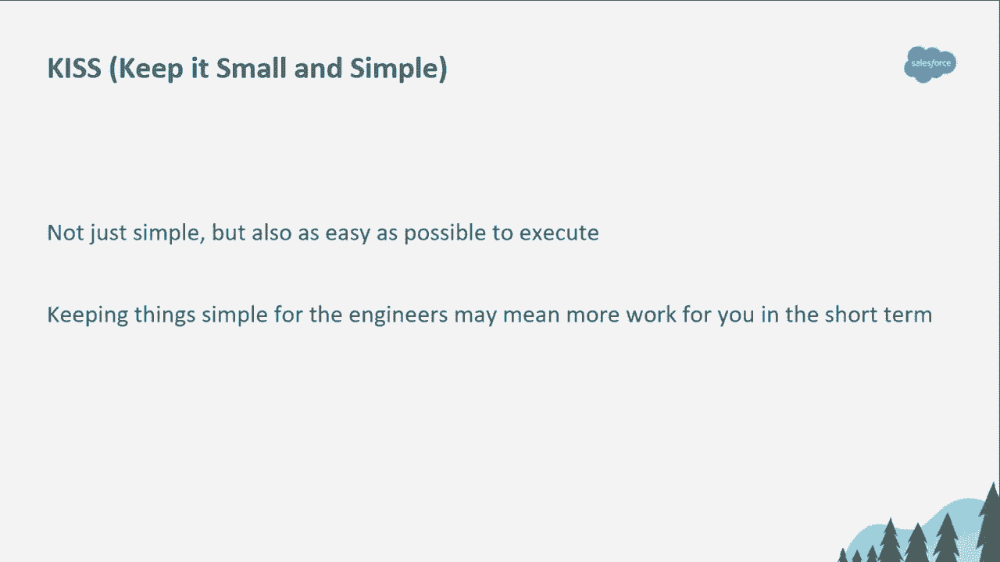
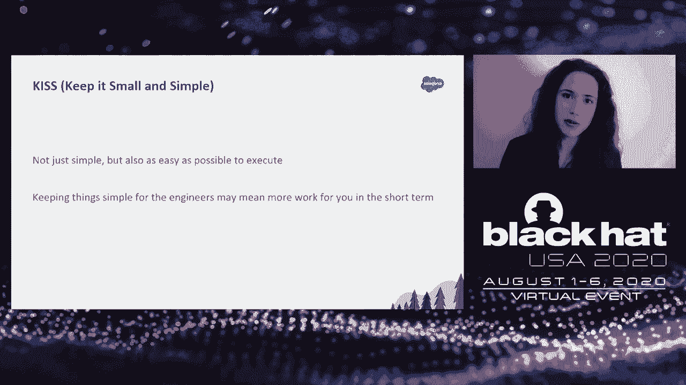
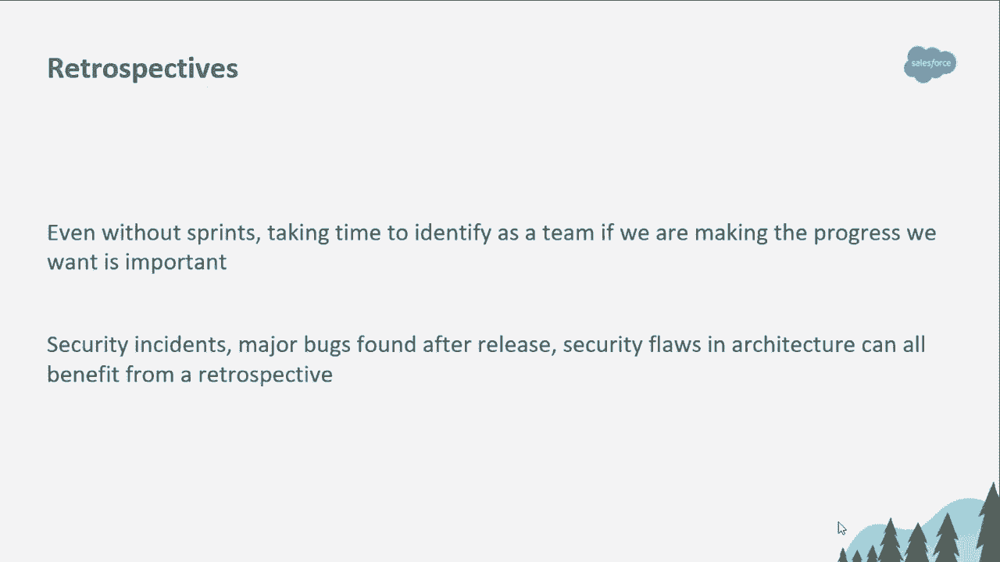
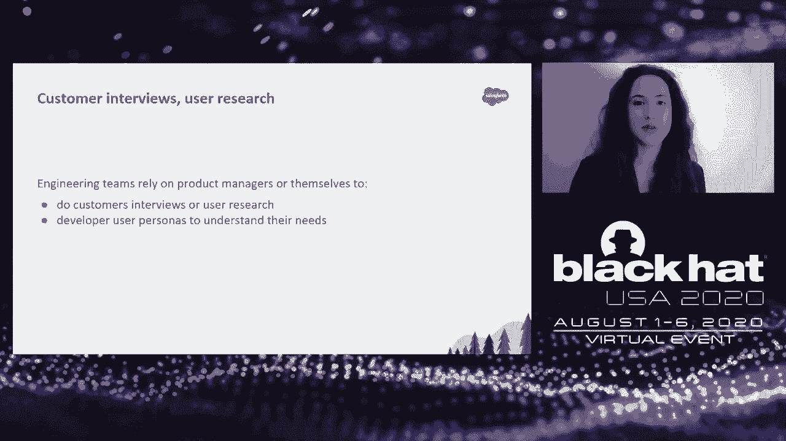
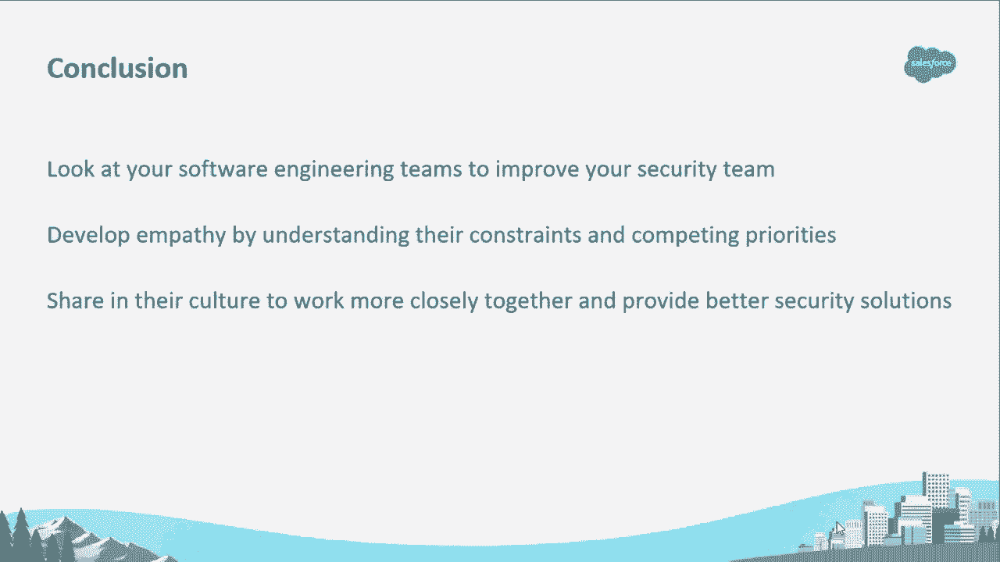

# 【转载】Black Hat USA 2020 会议视频 - P71：72 - Engineering Empathy - Adapting Software Engineering Principles and Process - 坤坤武特 - BV1g5411K7fe

 [MUSIC]。

 >> Hello and welcome to Engineering Empathy， a talk about adapting software engineering principles and processes to security。

 Let me first introduce ourselves。 I'm Camille McKinnon。

 I'm joining you from Los Angeles and I am a Principal Infrastructure Engineer at Salesforce。

 My background is in software engineering， although I am now working on a security team。

 I am joined from the Boston area by my colleague Craig Ingram， who is a Principal Security Engineer。

 His background is in security， although he has spent a year working on。

 the runtime infrastructure team at， Heroku as a software engineer。

 So we bring different backgrounds and perspectives on how we can help， security team scale。

 mature and improve。 We currently provide security assurance for the Heroku platform。

 which means that we work in constant collaboration with the engineering teams at Heroku。

 doing everything from providing security assessments， building threat models。

 performing penetration tests， and generally helping maintaining positive control over the Heroku platform。

 In his 2019 keynote at Black Hat， Dino Dizovi sounded the call for。

 security teams acting more like software engineering teams。

 Now that is something that is fairly new at many organizations。

 including ones at which we have worked out in the past。 At Heroku。

 the security team model that is closely integrated with the engineering teams。

 has worked fairly well for us， and we wanted to help carry the torch forward。

 and give you concrete processes and concrete tools。

 that you can use as a security team to act more like software engineering teams。

 We're going to start on a fairly low level on what you can do as a security。

 individual contributor to act more like a software engineer。

 and follow the everyday principles that they use behind writing good code。

 We're then going to take one step up and look at how as a team。

 we can adapt software engineering principles and processes。

 and how engineers plan their work and use that as security engineers。

 and see how engineers ask themselves how they are working on the right thing。

 and see what that means for us as security people。 We're then going to take a 10。

000 feet view at what DevOps culture adoption， on software engineering teams means for us as security engineers。

 Now let's get started with everyday principles。 The everyday principles behind writing good code that we have chosen to talk about today。

 and welcome to your first acronyms of today's presentation， are kiss， keep it small and simple， dry。

 don't repeat yourself， and TDD test driven development。 So let's start with kiss。

 keep it small and simple。 What that means is that as a security engineer。

 you should strive that your recommendations should be simple and straightforward。

 and understandable， clear and actionable by your engineers。 What does that even mean？

 Let me give you an example。 At Salesforce we have a fairly complex cryptographic policy。

 It is this multi-page document， it is technically complex， and it needs to be。

 It has to cover every single cryptographic use case。

 out of fairly large company with fairly complicated systems。

 Now when an engineer comes to us with a question about cryptographic use cases。

 it is super tempting to just send the policy because it covers everything， right？

 We have found it a lot more effective to have language specific guides for example。

 and we have picked the most commonly used languages at Heroku。

 the most common cryptographic use cases and prepared libraries and snippets。

 that engineers can just take and use as it's。 Now absolutely you can link back to a complex policy。

 or really in-depth white paper that explains the rationale behind your， security recommendation。

 If the engineer wants to dig deeper and， understand all those things that's wonderful but don't make that the only。

 thing you give your software engineers， give them a way to have a very。

 actionable and clear answer to the problem that they have， and get them shipping faster。

 What we also mean by keep it small and simple， is not just the recommendation itself is nice small and simple and short。

 and let me give you an example of that。 In my past life as a software engineer。

 I once had a security engineer file a bug against a system I owned that wasn't。

 using MTLS to communicate with other systems。 His recommendation was to use MTLS that's really simple and short。

 recommendation。 I completely understood what that security engineer was asking of。

 me but no one else at my company was using MTLS。 We had none of the PKI infrastructure that I would have needed。

 to put that in place so I estimated that as an extra large put it on all long-term。

 projects for my team and by the way if you work a lot with。

 software engineering that means it's never going to happen。

 We have a lot of competing priorities very large projects that are on long-term。

 backlogs not very likely to make it to production anytime soon。

 Now a year passed nothing happened and then another security engineer came back。

 a year later but this time it wasn't just with a bug this time it was with。

 10 other engineers who he had contacted across the company who had similar。

 MTLS bugs filed against their systems。 He got us all together and then together。

 we designed and built a proper PKI infrastructure which became my。

 company's MTLS infrastructure and we could solve all our security bugs， together。

 That meant because there were multiple of us， and because we were getting so much guidance to build it we knew what we。

 were building we were getting help it wasn't all on one team so it was doable。

 for us to invest our time to actually build it and we got it done。

 Now that's a whole lot more work for security。 Yes it is。 Keeping things simple。

 for engineers may absolutely mean more work for you in the short term。

 What it does mean though is that your recommendation is more likely to be。

 followed and what it does mean is that it can help。

 your company or organization's security posture improve。

 so it's probably worth it in a lot of cases to invest at the beginning on。

 keeping things simple for your engineers to help them secure whatever systems， they are working on。

 I'm going to hand it over now to Craig to talk to you about。

 Dry。 Over to you Craig。 All right thank you Camille。

 So the next principle we're going to talk about is dry or don't repeat yourself。

 Dry is the opposite of wet which stands for we enjoy typing or wasting， everyone's time。

 The concept here is that we are reducing， duplication of code and this is a common cause for engineers to do a refactor。

 You can see in the screenshot we have an engineer that was doing some code。

 changes and implementing dry and they took out a whole bunch of code that was。

 you know spread out through the code base and there's the same sort of code and。

 they reduced it to a single function。 The result of using dry。

 is that you'll have code that's more readable more testable。

 That's easier to add to in the future or make changes to。

 because it's not littered throughout and it's only in one place。

 So as security engineers how can we implement dry？

 Well one way might be thinking about all the findings that we see that are。

 repeated throughout a code base or they keep coming up throughout an。

 organization and you might think dry here would be。

 creating a template for cross-site scripting bugs that you can。

 copy and paste and reuse every time you come across one。

 While that might make you feel productive as an engineer。

 it's not really solving the problem of these bugs repeating themselves， at your organization。

 So there's better ways to do that and we can take a。

 step back and start thinking and asking ourselves， why are these bugs showing up？

 Maybe this is a good opportunity， for security engineering to start providing better patterns to avoid them。

 Like Camille was talking about with the encryption standards。

 that we added other things in those language security guides for how to。

 avoid cross-site scripting and other common， vulnerabilities in language-specific guides for engineers。

 Another way to think about this is outside of documentation providing。

 actual reusable code and libraries that engineers could use。

 Good candidates for this are things that are used absolutely everywhere， like authentication。

 things that are complex and easy to make common little。

 mistakes like encryption or not logging sensitive data。

 When you want to contribute to efforts like this look for where they're already。

 being done because chances are the engineers in your company。

 are already sharing code like this and it might already have a library。

 I think a perfect example of dry in Heroku， is the Heroku/X repository。

 This is an open source project that any Heroku engineer who's developing a。

 Go application can use and it has all kinds of， projects packages in this project that range from。

 simple things like a health check to things like the basis for a GRPC client。

 and server and there's also security related things here。

 A common thing that we would see in doing early stage design reviews and threat。

 models is we'd see two components and they needed to talk to each other。

 and we would recommend that to avoid， you know that information being intercepted if it's sensitive。

 use TLS to encrypt that data in transit。 Our TLS recommendation would also come。

 with specific guidance on which version of TLS to use and which。

 cipher suites to use for that configuration。 This could give repetitive if every engineering team was implementing this。

 configuration themselves and all their code base。 So our colleagues that are working on this project。

 added a TLS configuration package。 So now any project that needs to use TLS。

 to communicate with another system can include this package。

 and out of the box have the proper TLS configuration。

 If that guidance changes we update it in one place。

 and now all the other projects that are using it pull in the newer version。

 and have the latest configuration without everybody having to make their own。

 changes without security having to open bugs all over the place to。

 to make changes based on you know some new TLS bug that comes out。

 There are other packages in this repository for things like。

 how to encrypt things with libsodium or how to scrub sensitive， data fields from HTTP requests。

 The next thing we're going to talk about is test driven development， or TDD。

 This is the idea that software engineers， figure you know determine that their code is working and functional。

 by writing tests。 Security is part of the functionality of software。

 and we can contribute back by helping them write security focused tests。

 Test driven development specifically is a concept of software engineering。

 where engineers when they're writing new functionality。

 the first thing they write is a test that fails。 When they've gotten to the point where the test is passing。

 there's a reasonably good idea that the functionality is now working。

 A great candidate for a failing test is a security vulnerability you find， in an assessment。

 Now the engineer has a great idea， that the functionality you know the bug has been fixed if the test is passing。

 and that test continues to live in the code base in their testing framework。

 so they know if there's a regression because the test is going to start failing。

 Similarly if you're using fuzz testing in your assessments。

 like our colleague Chris Leroy he was using the GoFuzz package and found a。

 denial of service vulnerability。 He contributed that testing framework。

 that testing harness back to the team that was implementing the software。

 so they not only know when the bug is fixed because the fuzzer's not finding。

 that denial of service anymore。 They also have the opportunity to continue。

 to look for similar findings since the fuzzer will now run。

 every time they're running through their test suite。

 So we've talked about a few different software engineering principles that。

 you can use as a security engineer to scale up and be more effective。

 Now we're going to talk about how software engineers work at a team level， in a few different areas。

 The first is how software engineers prioritize and plan， projects。

 how they use retrospectives to talk about， the results of those projects or results of incidents。

 and how they gather customer feedback through user research。

 When I was working on our runtime team at Heroku， planning was a really important big part of our week。

 This is the time we looked at all of our competing priorities that we had。

 and decided what we were going to work on as a team and at the individual level。

 We had a lot of different priorities from new features that we were being asked， to implement。

 bug fixes to improve performance and， scalability of our platform。

 And of course we had security coming around， telling us about things that needed to be patched or bugs that needed to be fixed。

 As someone who thought I was pretty empathetic to the balance that engineers needed to have。

 between ongoing engineering work and interrupts or other projects from security。

 it was another thing entirely to actually live through it。 We couldn't get everything done at once。

 We had to break things down into small， manageable pieces and we're going to talk about how engineering teams do that。

 And it was a weird position to be in that security wasn't always the most important thing to get done。

 It was still very important but we had other things to work on too。

 Of course security engineers know we have our own competing priorities。

 We have security assessments that need to get done so that we're not blocking a security team。

 on our software engineering team on an important milestone。

 We want to develop tools and automation to improve our effectiveness as a team and coverage of。

 code changes and you might have deeper research you want to do or you might want to put together。

 Black Hat Talk。 How do you balance that with all the other things that you already have planned or。

 that need to get done？ Well engineering teams scale through breaking projects down。

 into manageable pieces and a lot of them will use things like OKRs or objectives and key results。

 This is how engineering teams can look at what you want to get done and very clearly define what。

 the results of that are going to be and this is a measurable way to ensure whether or not a project。

 was successful。 This also helps with scope creep because it defines what's not going to happen。

 because if it's not a result maybe that's something that needs to go in a new OKR or that isn't going。

 to happen right now。 This is the time for ruthless prioritization。 This is the time for security。

 engineers to say no and we're not saying no to our software engineering partners who want to do。

 something。 We're saying no to things that don't have the highest impact or don't move us further。

 to our organizational goals。 Maybe implementing the latest tool that you saw and you want to start。

 using that and roll that out to your team isn't as important as a broader thing like a supply chain。

 security tool that can start testing every code change for vulnerabilities in open source packages。

 that your engineers are using。 That's something that has a really a lot of impact and improves coverage。

 and doesn't require work from engineers。 So that's something you can break down into OKR。

 and then look at as a team to decide whether or not it moves you closer to your goals。

 So let's talk about retrospectives。 Retrospective is something that an engineering team might run for a couple of reasons。

 On the runtime， team we ran them every week and this was a great opportunity for me as an engineer to not feel stuck。

 This was the time to have a safe conversation about what's going well， what's not going well。

 what we want to keep doing and what we want to improve。

 You will also run a retrospective usually after an incident like downtime or security problem。

 This is a time to develop a timeline of all the things that happen and what we can learn from it。

 and improve for next time。 The most important aspect of these retrospectives is that they're。

 blameless。 Root cause analysis of a problem doesn't mean figuring out who did something wrong。

 It's not necessarily the fault of an individual if a production database fails or a secret gets。

 committed to source code。 This is the time in the retrospective to look at what controls were。

 missing that allowed this to happen in the first place。

 Security engineers can have retrospectives as， well。 Schedule one every couple of weeks。

 You don't need to be an agile team and do it every sprint。

 Look at how your team works and what makes sense。 This is the time to start looking。

 take a step back and ask questions like are we having an impact？ Are we falling behind？

 Are we meeting expectations of our customers？ If the same sorts of things keep coming up again。

 and again in a retro， maybe that's the time to re-prioritize another project that you put off or。

 create a new OKR to get something done。 If an OKR was finished or project was finished。

 this is the time that we would celebrate it and look for what the next thing should be。

 But I want to bring up the importance of blameless retrospectives again。

 It's easy to schedule another meeting。 I'm sure we all have plenty。

 But if you don't first develop trust on your team and psychological safety。

 retrospectives are not going to work as well。 If people don't feel safe to talk about something。

 going wrong or think that they're going to be blamed or attacked for something that they did。

 retrospectives are not only going to be not helpful。 They can be actually harmful。

 Psychological safety and trust on a team is critically important for a lot of reasons。

 And it's something that takes a lot of work and is far outside the scope of this talk。

 But before you think about scheduling retrospectives。

 think about whether or not you have that trust， and that safety on your team so that you can give folks on your team a voice to share their。

 concerns and feel safe doing so。 So now I'm going to pass it back over to Los Angeles where。

 Camille is going to talk about gathering customer feedback and through user research。 Thanks， Greg。

 I'm excited to talk to you about what was one of the favorite parts of the job。

 when I was a software engineer， which is asking myself， am I building the right thing？

 And I don't mean that just from the point of view that Craig just explained， which is。

 am I working on the highest priority item for my team？ But also at a high level， am I working on。

 something that my organizations， users or customers need or want？ Now， this is a very。

 important question for a business。 It can make or break a business to be shipping the wrong things。

 that customers don't use or care about。 This is where engineering teams rely on product managers。

 or professional user researchers and themselves to do customer interviews， do user research。

 help develop user personas to understand their users needs。 Now。

 I'm not asking you to become an actual user researcher and put to your engineers in a lab。

 and study them。 Please don't do that。 What I'm asking you to do is to listen to your engineers。

 and understand what they are asking。 And like a user researcher， don't just ask a question and。

 expect the answer to be exactly what you want。 Listen to your engineers and actually observe。

 what they're doing and what that can tell you about their needs。 They might not be telling you。

 everything that they need。 And that's okay。 It is your job to observe them and understand where you。

 can add value in their process and make their systems more secure。 Let me give you an example。

 of the types of things that I wanted to observe。 I want you to observe desire paths when it comes。

 to your engineers。 I want you to observe when an engineer goes from this corner of the path。

 to the other corner and has cut through the grass， not walking on the official paved way that would。

 have taken them longer。 And I want you to be able to observe that and say， ah。

 now I understand that， my engineers' needs are to go much faster than the situation that they currently have to get to that。

 corner。 Is there a way that I can help them？ Let me give you an example of what happens when you don't。

 Back in my previous life as a software engineer， I was working on a department system and we had。

 to talk to another department system。 Our systems needed to talk to each other。

 so we wanted to share， code between those two systems and we were using entirely different code repositories。

 And there was， this multi-month system to basically be able to get access to a snapshot of the code from another。

 department。 Multi-month doesn't help when you're an engineer。

 But we found this shared CI infrastructure， that we had and we realized that instead of going through the multi-month process。

 what we could do is， create CI builds that took our source code。

 packaged it up as a lovely zip file and made it an artifact， of that CI build。

 And the other departments could access that artifact and just get our code very， regularly。

 So we did that。 It worked。 It wasn't as secure as the other option。 There was no， epigation。

 There was mediocre access control， but it solved our problem。 A security engineer then。

 came along and asked why haven't you be using the cumbersome process？ They imagined something。

 was going wrong and they were right。 We explained how we were doing。 And the next day。

 there's shared CI infrastructure was shut down。 Now， what happened next？ We actually need CI。

 as engineers。 We need to test our code。 We need to build artifacts。 We need to build new versions。

 of our applications。 So what happened is that a few days later， some mystery machine。

 happened to appear under an engineer's desk and that was our CI for a while。 Now， that machine was。

 not being scanned by the department's official security scanning systems。 It was not using a。

 secure image。 We definitely would not doing security in a good way。 Eventually， what happened。

 in that team is that it became so difficult to ship code that engineers got frustrated and there。

 was a massive engineering team exodus。 Now， there are a lot less dramatic examples that can happen。

 in your organization when you can spot a desired path for engineers。 And it is not your job to say。

 "Wrong！ Walk on the paved path。" It is your job to say， "The paved path is more secure。"。

 I see that you need something that is faster。 How can we get to a compromise of you get to your path。

 faster， but you are respecting a higher level of security than what you're currently doing？

 It is very difficult and I still encourage you to try to understand your engineering team's needs。

 because what it means is that your recommendations are more likely to be followed。 Even if you have。

 to say no in some cases， having an engineer actually understand that you have looked at their need。

 you have looked and understand why they need to get there faster and have tried to work around。

 their problems and help them build something more secure will go a long way to make sure that。

 your recommendations are likely to be followed。 Now， let's take a step back and take a 10，000。

 feet view of our organizations and see how DevOps culture has been adopted by our software。

 engineers and what that means for us as security engineers。 We're going to be talking today about。

 measures and here's some new acronyms， SLOs and SLIs， service level objectives and service level。

 indicators。 We're going to also talk about the maniacal focus that engineers have on removing。

 toyle through automation and finally we're going to talk about what shifting left means for your。

 security organization。 So let's get started with SLOs and SLIs。 Those acronyms have been made。

 extremely popular through things like the Google SRE handbook。 Let's just start with an example。

 A service level objective that is fairly common in engineering teams is my service needs to be， 99。

9% of the time and available。 A service level indicator that goes with that is your uptime。 Now。

 what makes SLOs and SLIs so effective in engineering teams that we have seen use them。

 are that actions， specific actions are taken when indicators reach certain levels。 For example。

 if your uptime has not been 99。9% for the last 30 days according to your SLI。

 then work stops for that team on that service。 No new features are shipped until something has。

 been done about that service availability and fixes for whatever is the root cause behind。

 the drop in service level indicator under the objective is fixed。 Now， in security things are。

 slightly more murky。 We don't have clear uptime or performance things where we can say。

 we do this under 100 milliseconds。 But there are still things that we can use as service level。

 indicators。 So examples of things that work well for our organization is when was the last time。

 a team asked for a security review？ If it's been more than 30 days， it is possible that two things。

 might be happening。 Either they are just working on things that they think have absolutely no。

 security impact， in which case it would be great to check in and see if you feel that is true。

 in which case fantastic。 They might be just swamped with other security work and not need。

 an other raft of bugs to work on， in which case you can help that team prioritize and engage with。

 them and see what is actually important to fix and what can you do about those recommendations。

 to make them easier to action for them。 Other things to keep in mind the service level indicators could。

 be when was the last time your threat models have been updated？ If it's over a year， which could be。

 an example of a service level objective， you probably want to look at those threat models and。

 update them because your teams have been working and adding features to them。

 What is the pull request， failure rate due to your automated security tools？

 If the failure rate is very high， then you're， having a lot of false positives in all likelihood and your engineers are going to get alert fatigue。

 and start ignoring them。 You need to act on that really quickly to make sure that doesn't happen。

 and that security alerts are taken seriously。 On the other hand， if it's zero for a while。

 maybe your tools aren't working and maybe you should take a look at that and make sure that。

 you're not missing things that your automated tools could be finding。 Another thing that we。

 have seen work really well when software engineering teams adopted is a focus on removing toil through。

 automation。 By toil， what we mean is any manual， repetitive work， something that is easily。

 automatable， something that you do as a reactive thing rather than a proactive thing。

 anything that lacks really enduring value for the company， anything that you do that grows at least。

 as fast as the source of the problem。 Instead of just saying， "Okay， great。

 let's automate a million， things。" What we are actually inviting you to do is to look at your engineer's own efforts to automate。

 and see what tools they are using and how to leverage that to automate security work as well。

 Let me give you an example of things that have worked at Salesforce。 Two colleagues of us in。

 security assurance， Konbaiens and Kinen McQuaid have worked in particular on open policy agent use。

 across security at Salesforce。 That's open policy agent OPA and they have put in place things like。

 right now when you do an ACL request at Salesforce， a lot of those things are completely automated。

 through OPA usage。 That means that security engineers are spending less time manually reviewing。

 everything and can focus on higher value things that they can do to help our engineering teams。

 We also have OPA directly integrated into the engineering build systems， looking at Terraform。

 configs， looking at whether any of the configuration may be insecure and warning engineers about those。

 insecure choices right there in the continuous integration system that they use。 This means。

 that engineers don't have to integrate with yet another security system and you're right there。

 in the systems you understand how they work and you're part of their process。 Engineering。

 engineers are just great at removing toil through automation a lot of the time。 Let's just get。

 ourselves in their systems and integrate with very low effort for them and help us understand how。

 they work and shift things。 Now we're going to go one step back and talk about shifting left。

 with you Craig over to you Boston。 Thanks Camille。 So we're going to talk about shifting left and。

 what that means really is moving your security engineering process to be integrated better in。

 the earlier stages of the software development lifecycle and the software process。 It's not。

 controversial or new to think that fixing a vulnerability in the design phase of a project is going to be。

 easier and less expensive than fixing it after the code shipped out the door or even after the code's。

 been written。 So we want to look at the software engineering process that is being used at the。

 organization you're working with and find ways to get involved earlier。

 And this doesn't mean causing， pain for engineers earlier or making them jump through more hoops throughout their phase and making。

 it harder for them to ship software。 This means figuring out how to integrate with the software。

 process that they're using like building tools that integrate with their specific CI and not making。

 them use an additional build pipeline that's you know security specific。

 This means we need to adapt， to the environment you're a part of。

 Don't look at necessarily how we do things or how another。

 company like Netflix or Google does things。 Look at how your company does things。 Start having。

 conversations earlier with with folks。 Figure out how software is being built if you don't know how。

 it's working now and how you can support that。 Start showing up the scrum meetings and getting。

 involved early in design discussions。 This is the this is how we're going to be successful in shifting。

 left by being a better partner with the teams that we're working with。

 So wrapping things up we hope you've shown that how mature software engineering processes can。

 improve your security engineering team。 Look at what engineering teams are doing well。

 learn from it and integrate with them。 Start changes small， start changing how you do things。

 start using software engineering principles， start changing how your team does planning。

 try retrospectives， start collecting user feedback and through from your customers。

 When you work and act like the teams you're partnered with， it's going to be a much better。

 process for everyone。 You're going to develop empathy because for the constraints that they're。

 working with， because you're working under the same workflows and similar constraints and you're。

 going to have a better understanding of how they work and operate and where you can be helpful。

 in that process。 There's a lot more engineers and software than there are in security in most places。

 and you have an opportunity to learn from them and work with them in order to be more successful。

 as a security engineering team。 Thank you very much for coming to our talk。 I hope you enjoyed it。

 and hope you have a great rest of your day。 All right， thanks everyone for joining our talk。 I。

 hope you enjoyed it。 We did have one question come in in our experience。 How long did successful。

 retrospective stakeholders accomplish？ We had a perfect answer in the chat。 I just echo that。

 on our runtime team。 It took us a few two or three cycles of finding the right format for a retro。

 There's lots of different ways to run a retro， ways to have the format so how to add ask questions。

 or do boards and stickies and that takes some time to figure out what makes sense for your specific team。

 I think in the spirit of the rest of the talk， we're also going to encourage you to look at how。

 the rest of your software engineering teams are doing。

 The retro's you probably can just borrow from， them quite heavily。 Cool。

 We're going to wait for a few more minutes to see if there's any additional questions。 All right。

 we have something coming in。 You talked about a little about sizing earlier。 How do you。

 recommend sizing security efforts？ That's a really excellent question。 We've actually tried a few。

 things on our team and so we have things that worked and didn't work。 One of the things that has。

 medium work in my experience on security teams have been using point-ish systems。 In software。

 engineering， you can have point systems of a one point is a very small task。 A five point is big。

 and if you see something as 10 points is probably too big to be its own thing and so you have to。

 divide it up。 It depends on what kind of security team you are。

 If you're working on lots of security， assessments using story points。

 it starts making sense because you're like a security assessment is。

 going to be a large or small or medium and you can use points or t-shirt sizes to do that。

 If you're on the type of security team that does more long-term projects。

 that's where it gets harder。 You develop your ARK-R of the major project that you're helping the engineering team ship。

 but then you can use story points and individual tasks within that project。

 but estimating an overall project as we all know is unbelievably difficult。 What I would look in。

 those cases is how do you report to your executives about how you're supposed to deliver those projects？

 Are you the kind of company that needs tight timelines， tight deadlines？ Do you need to。

 report on those things on a weekly basis？ It's so dependent on how you're reporting up on success of。

 your company。 Ultimately on a weekly planning， you can use story points like engineering teams to。

 understand how much work you're getting through， but when it comes to large scale efforts。

 look at how you're reporting as a company and how you can make sure that your work is visible and。

 understood to the rest of your co-workers。 Cool， we've had a few more questions come in。

 The next one， how do you build that trust and safety for blameless retrospectives？

 That could be its own talk subject or training session for sure。 I think it's。

 that to reuse the word empathy。 I think as a more senior person on the team， it's being open。

 and honest and being okay with being vulnerable in conversations to help show other people on the。

 team that it's okay to be vulnerable in your team and set that example in standard is really。

 important。 There's lots of good resources I think that can be linked in the chat。

 Courtney Eckert's talks and the Etsy guides as well around blameless retrospectives， but it's a。

 process and that could extend things out past that two to three cycle for getting meaningful。

 retrospectives if you don't already have that in place on your team。

 We have another question coming in which is how early in the CICD process are you inserting your。

 security-focused static analysis？ Depends on your tool from experience。 If your static analysis。

 doesn't take absolutely ages to run， it works absolutely great as literally something that。

 runs on every commit as part of a GitHub pull request or whatever it is that you're using on the。

 Soresco repository in your company。 If it is something that takes ages to build and look at。

 inserting it into your CICD pipeline。 Basically， the general principle is as early as possible as。

 you can make it without being a complete pain for your engineers。 If your engineers grow to hit it。

 then you're losing that battle。 As early as possible， as long as it's not impeding software。

 engineers work。 Great。 We have， I think there's one more。

 How do you handle scan results as technical， debt？ Yeah， this is tricky too。

 but I think it's the way that we look at it is any scan results。

 first not just taking them for a face value and spending time and using your expertise as a。

 security engineer to validate those scan results that they're actually， you know， it's， you know。

 are you getting an alert about a missing Bluetooth patch on your AWS servers？ Maybe that isn't the。

 highest risk that says it is in the scan format。 Look at that and look at how your engineering。

 teams are handling priorities for any other bug and align that to those priorities。 If a P0。

 means X number of days， you know， maybe that's where your critical bugs align and see if you can。

 use their bug filing software to speak their language and treat security bugs like any other。

 production breaking bug or， you know， this is kind of a nuisance sort of issue and align those things。

 All right。 We have 30 seconds left， so I'm going to quickly do how do you recommend handling。

 scenarios when security is having to be over-valued or existing product applications？

 That's unbelievably difficult。 I think I'm going to try answering that one in chat。

 but I don't think I can do this in 15 seconds live unless， Craig， you want to give it a shot？ Yeah。

 I think， yeah， we'll be happy to stick around and chat and answer questions or reach out to us on。

 Twitter。 Happy to extend the conversation。 Thank you all very much。 Thank you so much。

 [BLANK_AUDIO]。