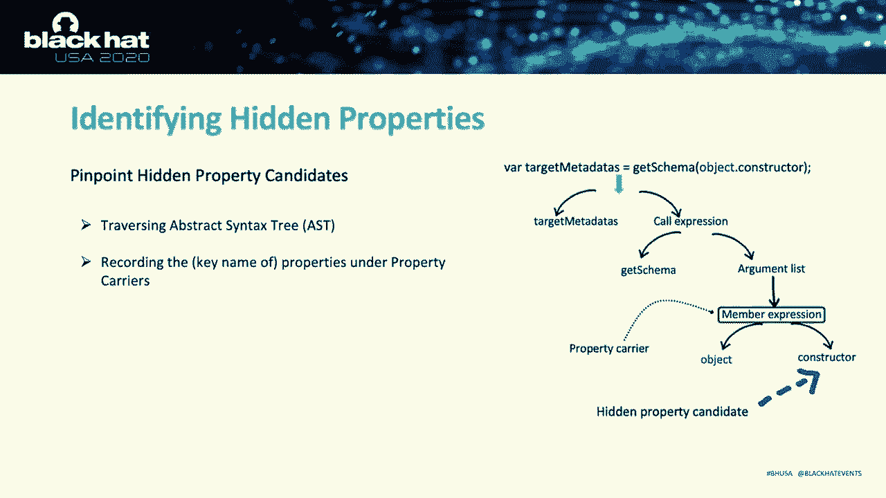
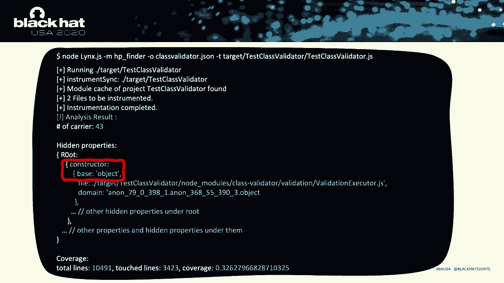
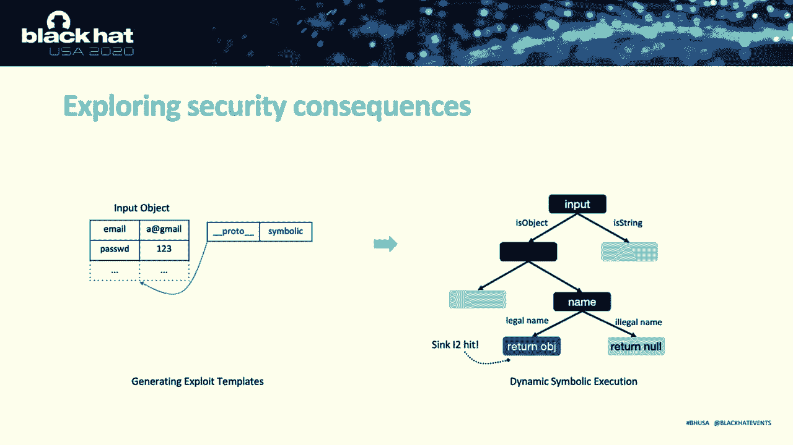
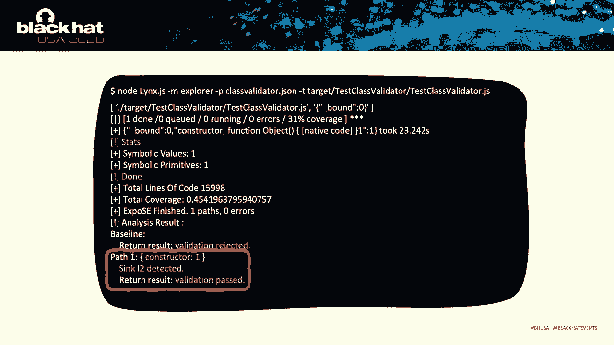
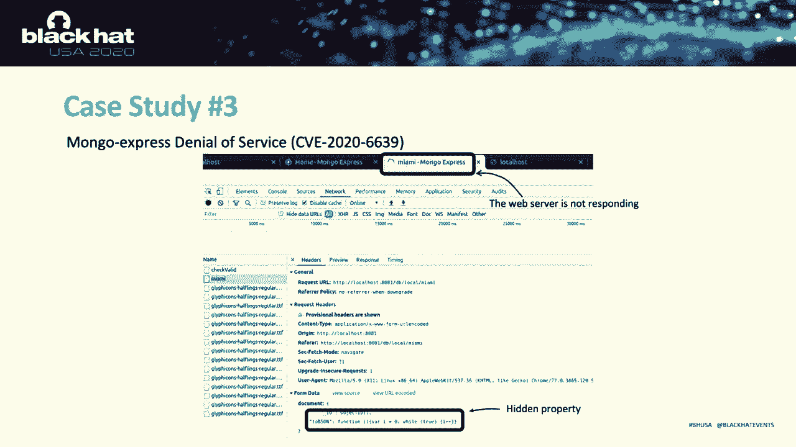

# 【转载】Black Hat USA 2020 会议视频 - P74：75 - Discovering Hidden Properties to Attack the Node.js Ecosystem - 坤坤武特 - BV1g5411K7fe

 Hi everyone， my name is Feng Xiao from Georgia Tech。

 So this is not only my work but also the work of my wonderful co-authors from Georgia Tech。

 and Texas A&M。 So today I'm going to talk about some interesting new attack in Node。js ecosystems。

 Before the talk normally begins， please let me introduce myself a little more。

 So I'm a CSE PhD student at Georgia Tech and I'm a vulnerability researcher。

 My research is about building tools to automatically detect and exploit zero days so that people。

 can be aware of both the existence and the consequence of their security bugs。

 So I do research in web application security but I'm also enjoying researching security。

 problems in other areas such as software defining networks and x86 virtualizations。 Okay。

 so these are the topics I'm going to cover today。 The talk will be divided into three parts。 First。

 I will introduce the technical details of the new security risks we discovered and。

 discuss how to exploit it。 And then we will talk more about the bug finding part which is about the lessons and insights。

 from building such JavaScript security analysis tools。 And in the end。

 we will give up impact analysis of our discovered vulnerabilities and have。

 some evaluation data on our new tools。 So first of all。

 please let's take a quick look at the newer abilities we found。 In total。

 we found 13 zero day vulnerabilities from widely used programs。

 Many of them have more than one million of downloads such as MongoDB official drivers。

 class validators and so on。 So these bugs can be exploited to launch serious attack effects such as leaking credential。

 user data by passing security checks and denial of services。 Yeah。

 so this is pretty much the big picture of our research。 Okay。

 So before we touch the technical detail， let's have some little background about the Node。js。 Node。

js is used for executing JavaScript outside of browsers。

 The picture on the right is the overall system design of the Node。js。

 To interpret and execute JavaScript， the Node。js implement a runtime execution engine on top。

 of Chrome E8 to satisfy the needs of server-side civilian scenarios。

 The runtime also provides a set of APIs to let JavaScript interact with the host environment。

 With the provided APIs， the JavaScript code can access the host environments like any。

 other server-side languages。 For example， they can read and write file systems or excuse system command。

 So Node。js is pretty powerful。 Nowadays， many websites are deployed in Node。js。 For example， Node。

js are intensively used in companies like Linkin and PayPal。 And also。

 we are using a lot of electron apps。 And such electron apps are also powered by Node。js runtimes。

 Web-based applications are the most common types of Node。js programs。

 For these web-based applications， packing the communication data into object representation。

 is really common。 So this feature is convenient and very powerful。 With the help of this feature。

 Node。js applications can send or receive very complex data structures。 From monthly downloads。

 statistics on the right， we can have a sense of how object sharing。

 is being supported and used by the Node。js ecosystems。

 So the diagram demonstrates how the object sharing is being used。 In Node。js ecosystem。

 there are two major methods of serializing communication objects。

 which is the query-stream-based sharing and the JSON-based sharing。 As shown in the picture。

 if the user wants to update the age information in his website， he may do this in two ways。 First。

 it can send his data data through the standard query-stream in the URL。 And also。

 he can send a JSON-stream to the server in some websites， such as the PostBody。

 Upon receiving the request， the Node。js server will pass the request and pass the data into。

 an object， so the object can further propagate into the corresponding logics in the program。 Okay。

 so this is basically how Node。js object sharing is carried out。 Usually。

 if we want to evaluate the security of such a program， we may inject the different。

 payloads into the age field to trigger potential vulnerabilities， such as cycle injection or。

 cross-site scripts。 But what if we choose not to test the existing data fields？

 Since we can pass an object into the server。 What will happen if we inject additional properties into the program。

 which is not expected by， the server program？ In particular。

 if an attacker can send properties that forge or override certain internal states。

 the attacker may easily obtain dangerous abilities， such as manipulating the key logics of the。

 program。 So what we are going to introduce is the hidden property abusing， which we call HPA。

 HPA leveraged the object sharing in Node。js to forge or tamper critical program states， in the Node。

js applications。 We caught these additional properties we injected as hidden property。

 because these properties， are kind of like some hidden parameters valid to the endpoint user API。

 These parameters are associated with certain internal states。 However。

 nobody knows their existence until an attacker finds it and exploits it to temporary。

 internal states。 In this talk， we mainly focus on the server-side scenarios。

 where a remote attacker wants to， hack a Node。js web application or some microservices。 Thus。

 to exploit vulnerabilities， the attacker access the legitimate interface such as the。

 web endpoint to send his payload。 In most cases， the payload should be in the planned object。

 which is the simplest object， representations， which only support primitive types。

 We have these restrictions because the planned object types is the most widely-supposed object。

 types in Node。js object sharing。 Okay， so during our research。

 we discovered two types of attack vectors。 We caught the first one as App-specific Attribute Manipulation。

 This one is for manipulating certain internal properties defined by the application themselves。

 Such internal properties are supposed to be initialized and managed by some internal functions。

 and they usually represent certain internal states of the programs。 As shown in the picture。

 the INIT role is an internal function that are responsible for。

 managing the access right of the user object。 However， with HBA。

 attackers can propagate a conflicting name properly into the user object。

 and thus control the internal states。 As shown in the program。

 the program also provided an API called update in external usage。

 If a malicious user inject his payload， which is an additional key value peer into his request。

 then the additional key value peer probably will override the existing data on the user， object。

 So this attack vector is really useful when we want to abuse certain concrete logics in。

 large programs， such as older states or user privilege management。

 Also HBA can also talk it as some unique JavaScript schemes， such as prototyping。

 We call it the second attack scenario as prototype inheritance hijacking。 In JavaScript。

 every object has a link to a prototype object。 When the JavaScript code wants to access a property of an object。

 the property will not， only be searched within the object itself。

 but also the prototype of the object and even， the prototype of the prototype。

 until a property with a matching name is found。 As shown in the picture。

 when the JavaScript code wants to access the constructor properly， from the input object。

 it will first search locally within the input object。

 Since there is no properly named constructor there， the code will continue its search to。

 its prototype， where the constructor is really located。 With HPA。

 we can hijack the inheritance chains and forge our own payload as our internal property。

 is on the chain。 As shown in the picture， if we inject a property named constructor。

 the searching process will， be really different。 Since there is already a property named constructor within the input object。

 the search will immediately， stop and return a user controlled value。

 As demonstrated by the red circle here， the value of the constructor will become the string。

 rig and body rather than a normal JavaScript prototype function。

 So the second attack vector is very useful because we found many JavaScript developers。

 tend to trust properties inherited from prototypes， and they also make many security sensitive。

 decisions based on them。 Also we should be aware of the differences between the prototype pollution and the prototype。

 inheritance hijacking。 So prototype pollution， as the name suggested。

 is about attacking and tempering the prototype， objects。 However。

 our attack vectors does not modify the prototype object。 So the root cause of HPA is that the node。

js fails to isolate the unsafe objects such as， user input from critical internal states to make a clear demonstration。

 The HPA can be seen as a new security risk under the weakness category 915， whose child。

 variants are all about improper modification of dynamic objects。

 As shown in the hierarchy tree on the right， there are some similar issues on the other。

 language platforms such as Ruby Master Assignment and PHP Object Injections。

 Although these variants share the same behavior feature dominated by 915， they all have。

 their own patterns due to the language differences。 For example。

 the Ruby Master Assignment is a set of vulnerabilities discussed and invited。

 to use the Ruby web framework called Ruby on Rails。 Unlike HPA。

 the attacker does not pass objects into the Ruby program。 Instead。

 the attacker abused a framework-specific assignment feature to temper the existing。

 object that associates with the assignment。 So the payload are also different。

 The mass assigned payloads are literal values。 However。

 HPA can introduce both hidden properties with either literal values or nested objects。

 More importantly， Ruby is strongly typed， so the mass assignment vulnerabilities cannot。

 introduce new properties into the victim object。 However。

 HPA can inject arbitrary properties which make HPA very flexible and powerful。 Okay。

 with several pages of concept introduction， I think it's time we can hack some real targets。

 In this example， we talk it as a popular web framework named Routing Controller。

 We will hack its official code to demonstrate an end-to-end attack from security check by。

 passing to data-paste injection。 The figure on the right can give you a brief idea on how our example works。

 In this example， a server program is deployed using Routing controllers。

 If a remote user wants to authenticate with the server， his data will flow into the following。

 state components。 First， he will send his serialized data into the web API endpoint。

 Upon receiving the request， the authentication module will instantiate an object according。

 to his JSON string and send it to the para-handler。

 We use the green box to demonstrate the user input object and we use。

 The handler will first collect the internal format specifications which is the blue box， here。

 And he will merge the internal format specification with the input object and invoke the input validation。

 API。 So the input validation components will centenize the user input data according to the format。

 specification。 In this case， it will check if the email failed is legitimate or not。

 If the check pass， the user object will flow into the database。 Okay， so this is overall data flow。

 Let's analyze how we can attack the logic step-by-steps。

 The first step is the hidden probability injections where the malicious user includes。

 additional properties into the request which is the constructor in this case。

 As shown in the picture， when the server program instantiate the user input， there will be。

 additional properties within the para-handler object which is the constructor。

 And in the second step， the program will prepare the parameters needed by the input validation， API。

 The server program will merge the user input with the para-handler which is the para-handler。

 with an object named the scammer。 So the merging operation is performed by putting every properties of the para-object into the。

 scammer object。 So this is a process very much like object assign。 To simplify the demonstration。

 here we let's just use object assign in this example。 By performing the merging operations。

 the hidden probability constructor also transformed into， the scammer。

 So by performing such a transformation， we now can hijack the inheritance chains of the。

 constructor on the scammer object like we have that demonstrate in the second attack vectors。

 Actually the constructor scammer plays a very important role in the routing controller。

 As shown in the picture， the scammer object follows an object oriented program style which。

 uses the constructor of his prototype to store important format restrictions。 So as a result。

 the merging operation enables us to hijack the inheritance of these important， format restrictions。

 As shown in the picture， when the constructor is read by the get scammer function， our hidden。

 property will immediately match and return to the code。 To bypass input validation。

 we just need to set the format specification as a invalid， value。

 So our cycle injection payload can escape the check。 The last step is much more straightforward。

 The validated payload then flows into the sensitive database API to finish the entire attack。

 So this is how the entire HPA exploit can work。 Actually。

 the code logic behind vulnerabilities is much more complex than the simplified graph， here。

 For example， the input validation module itself contains more than 30 thousand lines of code。

 So it would be really helpful if we can have a tool to help us automatically track all。

 these data structures and automatically detect all these hidden properties and even automatically。

 exploit them。 So what is the challenge of building such a tool？ First of all， this is JavaScript。

 Analyzing JavaScript is known to be hard due to the dynamic feature。 The fact is。

 even if we have chosen a reliable analyze framework as our underlying platform。

 and we designed smart methods and we test a large number of programs， we still occasionally。

 encounter crashes and incompabilities issues when trying to analyze in large and very complex。

 programs。 The second challenge is the HPA actually creates new data dependencies but the program analyzes。

 is good at digging the existing data flows rather than creating new ones。 Third。

 from our running examples， we can observe that HPA actually exploits internal program， states。

 So the attack effect highly depends on the code context。 This makes the detection more challenging。

 So to over over count these challenges， we design and implement links。

 A hybrid JavaScript program analyzes tool to detect and exploit HPA vulnerabilities。

 The links is a type of wildcat and in Greek myths， it is believed that the links can see。

 other people's can't and his role is for revealing the hidden truths。 So in our system。

 it is for revealing the hidden properties。 The picture below gives a high level workflow of links。

 The tall meaning consists of two parts。 The left part is for discovering the potential hidden properties。

 which is the core components， in our system。 It will first leverage data dynamic flow analyzes to track the user input data flows。

 And then it uses static syntax analyzes to infer potential hidden properties。

 The right part is about how we can detect the harmful hidden properties from all those。

 potential candidates and generate it， exploit for them。 So to help future Node。js security research。

 we will open source our links project on the， GitHub link at the bottom。

 So the very first thing links will do is dynamic flow tracking。 First of all。

 links will generate a label object， which is a unique key and value pair。

 Links will inject the label into the input data of the program。

 Different properties from the input objects may flow into the different program logics。

 So to track all the potential propagations， our label injection is performed recursively。

 In the routing controller cases as an example， as shown in the left part of the picture， links。

 will first generate three different input objects by labeling inject in the original one。

 In each time， link will inject the label into a different property， such as the gmail， I'm， sorry。

 such as the email and the password and also he will inject the label into the root。

 of the input object。 And then we execute the mutated test input in our instrument framework。

 To observe the program execution， we leverage a JavaScript analyzed framework called jalenki。

 to instrument our test program。 Since we are studying the data flows。

 we instrument only the variable read and write and object。

 probability indexing and the function course。 Then we execute the program。 During the execution。

 links will examine every object within the data flow。

 If an object carrier carries our property labels， we will record it for further analysis。

 and we will record the objects that carry the labels as a property carrier。

 So now we have a list of property carriers。 We need that an object is flagged as a property carrier because we detected our injected label。

 under his body。 So if we can propagate our label here。

 is it possible we also propagate other properties， here？ More specifically。

 if we propagate it on property with a conflicting name of with certain internal， properties。

 we may be able to override the original states。 So we need to extract all the original properties under the carrier。

 So now we want to extract all the shells from the property carrier and flag them as hidden。

 property candidates。 To achieve this goal， we need static syntax analyzed to extract necessary syntactic information。

 from the code。 So the picture on the right demonstrates how we parse a statement from our running example。

 So to parse this statement， links will traverse the syntax tree until reaching the property。

 carrier， which is circled by the red line in our graph。

 Then it records all the properties under the carrier。 In our case。

 the hidden property candidate is the constructor。

 Okay， so this is the output screenshot of the first component。 As you can observe。

 the links will first instrument the code based。 And in total。

 you can observe that we tracked 43 different carriers。 And as indicated by the red circle。

 links successfully detected a hidden property named。

 constructor。 So in the previous components， we discovered the key name of the potential hidden properties。

 which is the constructor。 By injecting a property with such a key。

 we may override the certain internal states。 However。

 we still don't know whether the candidates can be override or not。

 And we also don't know how to introduce attack effects with these candidates。 So apparently。

 links should do more。 Let's revisit our run example to see if there's any insights to guide us design such exploitation。

 components。 So the feature on the right， on the left， is the vulnerable code from our run example。

 As we have discussed many times， HPA exploit internal program states， which means its exploitation。

 highly rely on the code context。 So this is， it is important that we can conclude it as a set of sensitive behaviors。

 These behaviors should clearly indicate certain security consequences by themselves， so that。

 we can decouple the harmfulness detection from the code context。 Also， from this run example。

 the exploitation is mainly about manipulating the return result。 For example。

 there are two possible paths in this picture。 If the execution entered the branch on 919。

 we will get validation failed， which is what， we don't want to see。 But if we go into line 21。

 we can successfully pass the check。 So the exploitation point and the override point may not be the same place。

 which means， we should not stop our analyz at line 11。

 And we should continue exploring all the possible paths that can trigger by manipulating the。

 hidden property。 We study and concluded six general types of sensitive sinks。

 The first type is keyword based sinks， such as C1， C2， and I1。 Based on our observations。

 certain parameters of sensitive methods are really a common attack， targets for HPA。 Hence。

 we collect widely used API that are frequently involved in handling user input。

 such as file system operations， database queries， APIs like that。

 But we made our best effort to collect as many sensitive APIs possible。

 While we know that it is not complete， but it can be easily extended over time。

 The second thing belongs to the behavior based sink。 For example， in the sink， I2。

 we are monitoring that whether our hidden property can change， the return value of the module。

 Such sinks are killing weapons for security related modules like input validators。 Okay。

 after defining our sensitive behaviors， we want the hidden property to trigger as many。

 as possible branches and monitor whether we can hit a certain sink。 To achieve this goal。

 we will use symbolic execution to explore the hidden property value， space。

 So the links first generate an exploit template that can reach the potential vulnerable properties。

 We denote such structure as a template because links actually does not inject concrete value， here。

 He will inject a placeholder which is used by the symbolic execution。

 Then we will run the test program with our constructed templates。

 And the symbolically executing the hidden property。 So as shown in the picture。

 with the symbolic execution， we will explore all the paths constrained， on the path。

 And if the exploration hits a certain sink， we will fetch the corresponding payloads that。

 can trick the sink。

 So this is the output of our find the exploit module。 From the circled area。

 we can observe that the key value paid， peer， constructor and one， trigger the sink I2。

 And in the last line， we can find that links automatically generate exploits that can successfully。

 lead to the input validation bypass。

 So here， let's have some evaluation data and have more insights about the impact of our， research。

 So during our research， we choose 60 widely used programs from MPM。

 They are 55 modules and 5 web applications。 With the help of links。

 we tracked more than 1030 carriers and detected 300 hidden properties。

 candidates associated with them。 In the end， we confirmed 13 zero-day vulnerabilities。

 And with the help of symbolic execution， links even synthesized 10 exploits。

 So how is the impact of the detected vulnerabilities？

 We found that the HPA can introduce various attack effects， such as leaking the credential。

 data by passing security checks and denial of services。 Based on the impact analysis。

 we can observe that HPA compromised previously unreachable， program state。

 which effectively enlarged attack service。 Also， we could notice that HPA is not a simple input validation problem。

 And also many input validators themselves are vulnerable to HPA。 Okay， so in the following slides。

 I will pick up some interesting vulnerabilities from。

 our result and case study how we leverage HPA to compromise them。

 And note that all the vulnerabilities here have been reported to the one vendors。

 So the first case comes from MongoDB official driver。

 We found that we can tamper an internal state named bison type。

 So a background here is that the MongoDB leveraged this B bison type to indicate the data type。

 of the query object。 However， when serializing the query object。

 MongoDB will ignore the object with an unknown， bison type。

 So what if we abuse the logic in a query condition object？

 The code on the right is an open source unlike game。

 The unlike game use the vulnerable MongoDB API to implement his user management logics。

 As shown in the picture， there are two APIs implemented by the unlike games。

 The first one is about loading the user and the second one is about deleting the user。

 So by injecting an unknown bison type such as black hat into the user input， the attacker。

 can force the MongoDB not serializing the query condition。

 So the MongoDB will always return the first user on the MongoDB database。 With this ability。

 the attacker can lock in or delete arbitrary users in the database。

 And so the second case is for another widely used in memory JavaScript database。

 The hidden property is more like a backdoor which helps the attacker access the sensitive， data。

 So in TuffyDB， we discover a hidden property named id， which is an internal index for。

 the database items。 Once we specify our own id in the query。

 TuffyDB will ignore other query conditions and directly。

 return the results associated with the index。 Moreover。

 since the internal index is in an easily guessable format such as T0002R。

 So that attacker can use this vulnerabilities to access arbitrary data in the database。

 So as shown in the picture， even though we specify a wrong password and username， we can。

 still leak the correct user data with the craft hidden properties。

 So here is our last case in this talk。 Before we can introduce this case。

 we would like to give a brief introduction to the event， handler skin of Node。js。 So in Node。js。

 there's only one thread handling all the incoming requests。 In the third， as a result。

 the availability of the event handler is really critical。 In the third case。

 we want to demonstrate how HPA can attack the event handler and thus。

 freeze the entire server programs。 So in Mongo Express。

 we found a hidden property which allows us to pass a function definition。

 This function will be executed in an isolated safe sandbox。

 Even though we cannot execute the commands using these hidden properties， we can still。

 block the event handler by passing an infinite loop。 So as shown in the bottom of the picture。

 if we pass an hidden property through the web， API， which is an infinite loop。

 then upon receiving the request， the whole site will， immediately get blocked。 Yeah。

 So thanks for attending our talk。 This is pretty much about our research。

 You are also welcome to follow me at Twitter on the bottom of the slides。 Thank you。 Hi， everyone。

 So I'm here to taking questions。 Okay， so I noticed that there's already some questions in the chat box。

 So I'll answer this question first。 Okay， so for the links called release plan。

 so actually we are cleaning up the project， and prepare the documentation。 As you guys may notice。

 we have several modules and from the HCI part， the interface is not， so user friendly。

 So we are trying our best to prepare the documentation and also clean out the code in case some researchers。

 may want to read our codes。 And yeah， so that's why we and our plan is to release it no later than the end of August。

 So this is the first question。 And so for the second question。

 is there any paper or blocks from you on this topic？

 I'm sorry that actually we are only maintaining our internal technical documents。

 And so in short-term， we haven't had a plan to release it publicly。 Yeah。

 so but we will probably release a complete write-up， a white paper， along with the project。

 sometimes。 But yeah， but we will give out our source code first。 Yeah。

 So as for the Twitter ID question， okay， I can， I will send you the Twitter link soon。

 So is there any other questions？ [BLANK_AUDIO]， >> Okay。 [BLANK_AUDIO]， Okay， yeah。

 So we are having about four minutes。 If there's any question， feel free to ask me。 Okay。

 so I noticed there's two more questions。 Let's take a look。 Okay， so for the question from Jason。

 thanks for the question。 So Jason is asking about does this means both the expected and。

 unexpected parameters need to be sentinized or there is a more elegant solution？ Okay。

 so in our research， we mainly focus on the hidden part， which is the unexpected parameters。

 And we believe that it is actually not， we believe that the sanitization is not the server bullet。

 Because some sanitization or validator modules are also directly vulnerable to our attacks。

 So we believe a more elegant method is to let programmers developers。

 to be aware of those hidden properties。 So that's why we developed and want to open source our code。

 Yeah， and it seems that we still have time， so， maybe we can take another one question。

 So the question is， you mentioned that the most， traditional payload validation tools are not able to deal with HPA vulnerabilities。

 Because they're also vulnerable to it。 J-O-I。 Okay， yeah， so I kind of， so， we test 16 modules。

 I kind of remember that I choose that one， but， unfortunately we didn't find exploitable hidden properties if I remember correctly。

 Yes。 So I would check if we still have time for taking more questions。 Okay， cool。 Yeah。

 so I just share my， my Twitter through the chat。 And if we are about to release our tools and the whitepapers。

 I will also make a tweet about it。 Yes。 And okay， so if we have time， we can take other questions。

 It seems， okay， yeah。 Okay， so it seems like it's still many questions。

 So and we don't have that much time。 So probably we can。

 I will take the questions through the chat box。 Then yeah。

 thanks for all you guys attending my talk。 Yes。