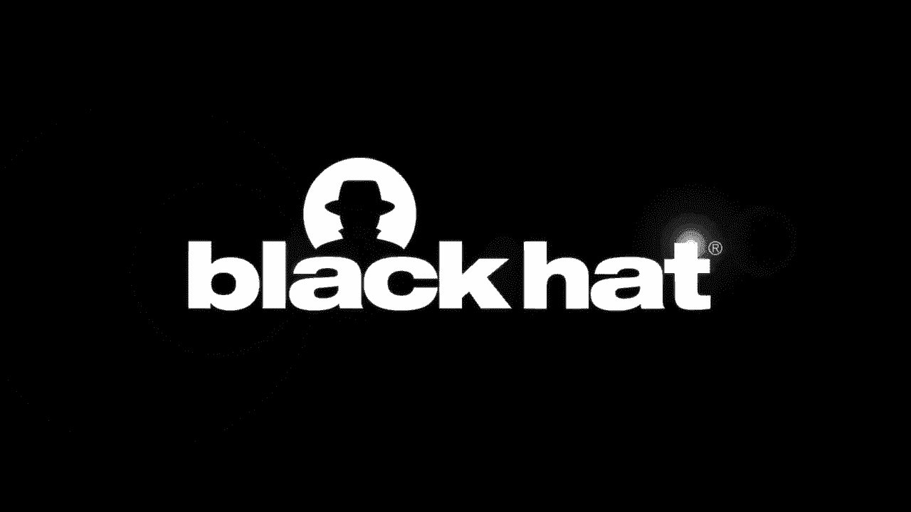
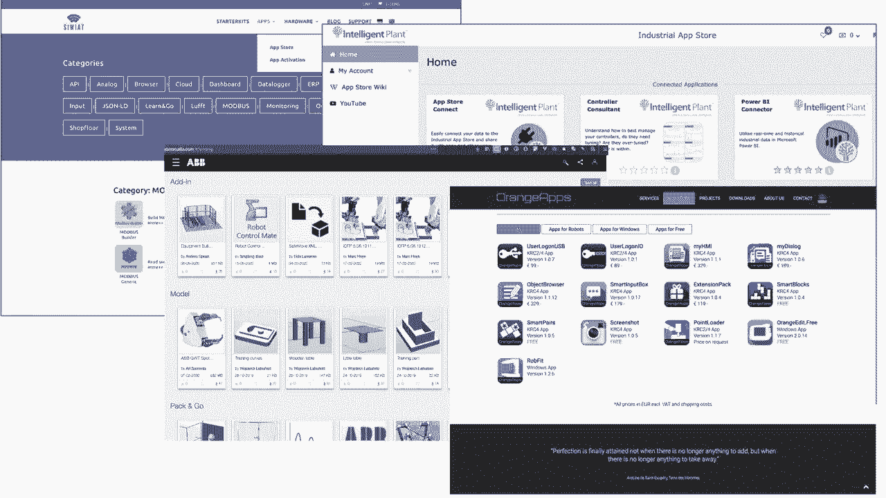
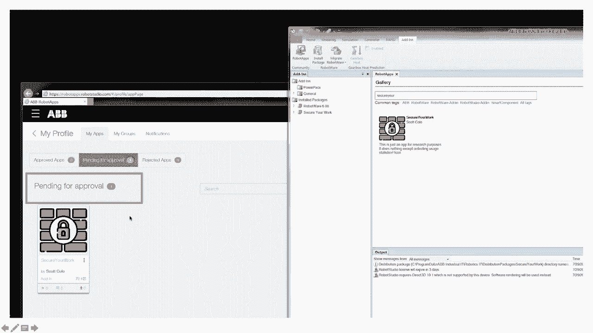
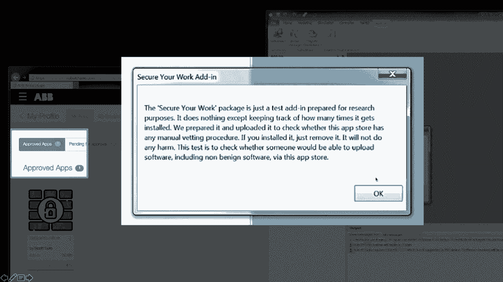
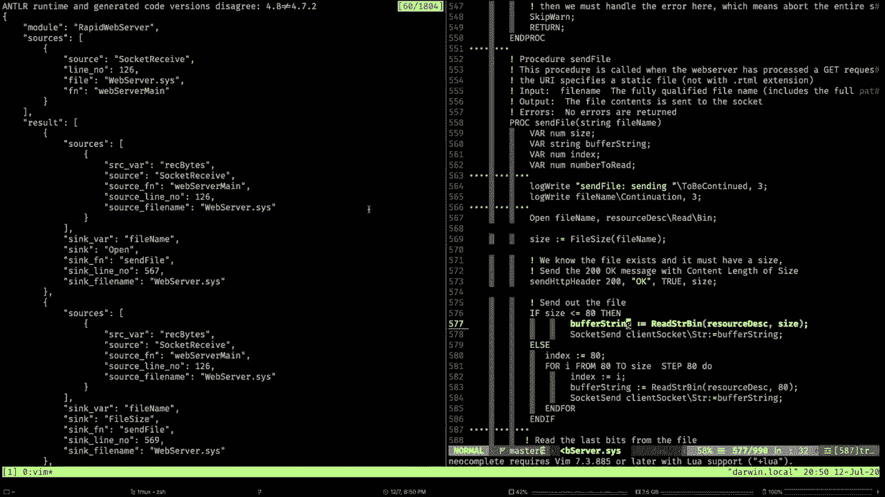
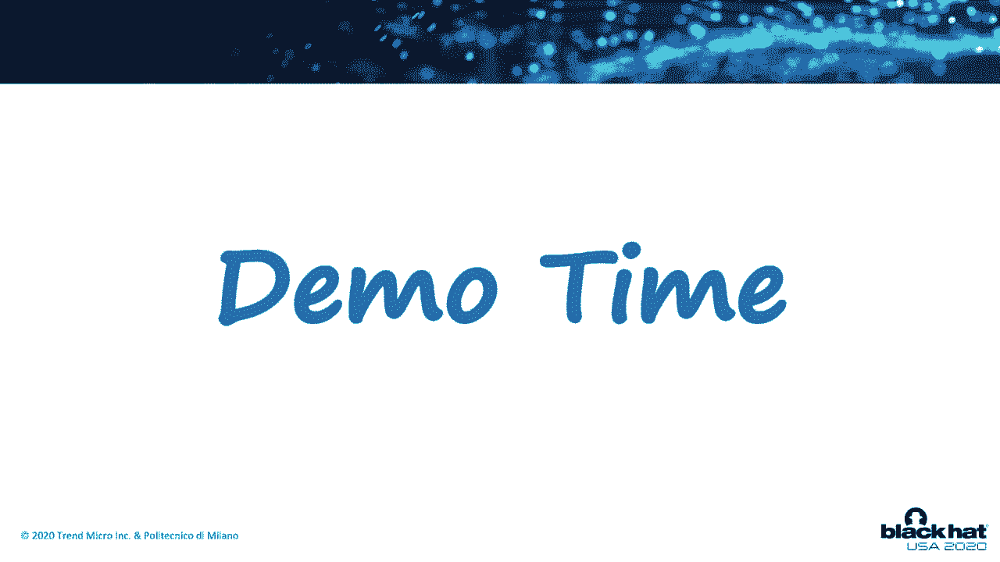

# 【转载】Black Hat USA 2020 会议视频 - P77：78 - OTRazor - Static Code Analysis for Vulnerability Discovery in Industrial Au - 坤坤武特 - BV1g5411K7fe

 Hello everyone， thanks for following our talk。

 My name is Federico Madji， I'm a researcher with Planet Micro， and I'm here today with。

 my collaborator， Machalo Poliani， who just received a PhD from Polytechnical Demilano。

 This research is based on a joint work between Polytechnical Demilano and Tern Micro Research。

 Three years ago we were here on the Blackhead stage where actually we were in Vegas， but。

 still we were on Blackhead， explaining to you what were the risks of having an industrial。

 robot connected to the factory network。 We showed you several ways that an attacker can abuse a connected robot and we showed。

 you the impact of real attacks。 For example， they can introduce micro defects into the production。

 Three years later we are here once again， but this time we talked to you about programming。

 of industrial robots。 We examined eight of the leading industrial robot platforms and we found some design issues。

 that can have an impact in terms of vulnerabilities that could be introduced by a mistake from。

 a developer and on the other hand we showed you how a malicious actor can use these languages。

 these custom languages to create new strains of malware。 Last， we will conclude our presentation。

 telling you how we can prevent vulnerabilities and， in case we cannot prevent。

 we show you a technique that we have developed to detect vulnerabilities， and malicious code。

 So let me now hand it over to Marcello， who will explain to you how industrial robots are。

 programmed。 There are two different ways of programming industrial robots。

 The first is called "Teachy Me Showing" and is about programming a robot while not。

 yet using the teach pattern。 That device you can find on this slide。

 This is a very interactive and online way of programming robots。 On the other hand。

 for more complex tasks you want to use a full-fledged programming language。

 to program a robot offline。 As this talk is about programming languages。

 let's see how they look like。 Here you can find a simple task program implemented for a BBS programming language。

 This program moves a robot between 2 points， 0。0 and 0。1， repeatedly in a loop， 4 times。

 As you can see from the source code， it's like having a general purpose programming language。

 with addition of robot specific instructions and data types。

 The same concept can be applied to different languages。

 Here is the same program implemented for another language。 You can see how it works。 As you can see。

 this structure is very similar。 I'm using the terms "language" and "vendor" in a pretty much interchangeable way because。

 in robot space languages are mostly proprietary。 To program a robot of a certain vendor。

 you must use the proprietary language as the， property domain-specific language of that vendor。

 so to say to a problem in a B robot， you must use a RAP。

 The reason any cross-platform language or lingo-franca that can be used to program robots by different。

 vendors。 Back to the topic of our talk， we analyzed the languages of 8 different vendors in order。

 to see if they had security-sensitive primitives， so to say primitives that they can be used。

 to bypass security models。 The first primitive that we analyzed is the ability of reading or writing from the file。

 system of a robot， the RATI-frontus problem。 This capability is present in 5 out of 8 programming languages and it's not surprisingly surprising。

 because there are a lot of use cases for this， such as writing log files or reading coordinates。

 from a file。 The more advanced file systems have also the capability of performing directly listing。

 because they are high-end architects， not just a flat list of files。 More surprisingly。

 we found that in 4 cases it was possible to load new code through runtime。

 so language is exposing primitives to load a module to load a code module from a file。

 and to dynamically resolve a function name at runtime and call it and call the function。

 with that name。 This capability， combined with the fact that it is possible to write on a file system。

 makes， it possible if the language is interpreted and not compiled to write programs that write。

 a program， load it and cause it， so to say having some sort of writeable and executable。

 memory error。 Plus， but not the least， we found that all the languages that we analyzed have the capability。

 of performing natural communication， so to say to use natural science。 Before going forward。

 I would like to give a short look at runtime environment if we consider。

 modern platforms with dependencies as to have third priority application to be isolated。

 to be sandboxed。 If an application is to access resources from the operating system or from the hardware。

 that access is mediated。 It is mediated by an access control mechanism that is fine-grained and application specific。

 so I can have an application that doesn't have the permission of access device system。

 or I can have an application that has the permission only of accessing some subset of。

 the file system。 In case of industrial robot， it is not so。

 There isn't any access control mechanism for task programs。 Prognums run in a restricted way。

 If there exists an instruction or an API to access a certain hardware resource， that resource。

 can be accessed by all the programs。 It turns out that the features that Marcello just explained to you are actually used。

 We talked to about 20 experts， including developers， control process engineers， as well。

 as some academics working in the field of robotics。 And they all told us that in one way or another。

 when they develop code to automate a robot， or an industrial machine。

 they need to use network features such as network socket， they， need to use file operations。

 they need to use dynamic code loading， and some of them told， us that their software。

 the automation scripts that they come up with are complex enough。

 to need subroutines in order to structure them in an elegant and usable way。

 We also wanted to understand how much awareness there is in this community， how much security。

 awareness there is in these communities。 The percentages that you see on the right-hand side of the screen indicate the fraction of。

 conversations going on in the major online communities for industrial automation engineers。

 which contain security-related terms。 We search about 12 of the most active forums looking for conversations containing keywords。

 such as hack， security， vulnerability， fixes， patches and stuff like that。

 And we found that only a minority of the conversation are about security。 In some cases。

 there is even almost nothing about security in the forum as well。

 So to summarize what we have so far， we have fairly scarce security awareness， at least。

 according to the data that we have collected and to the interviews that we have conducted。

 We have industrial machines that are programmable using this legacy programming languages， which。

 are makes it fairly difficult to switch away from because every vendor has their own technology。

 And these programming languages include security sensitive features， which may impact the security。

 of any produced automation program。 And last， very important。

 we found out that there is almost no security isolation。

 There is no resource isolation that is fine-grained enough to avoid， for example， that if a program。

 contains a security-sensitive operation， the operating system may or may not be able to。

 block the execution or at least ask for confirmation upfront to the operator。

 There is no such features that we have found。 So you may ask what could possibly go wrong。 Well。

 on the one end， developers may introduce vulnerabilities by mistake because they are。

 not aware of the security implication of using those security-sensitive features。

 And on the other hand， threat actors may develop， may use these powerful features to develop。

 new strains of malware。 And we found evidence of both cases。 On the one end。

 we found public code containing vulnerabilities。 We found industrial automation code in GitHub and GitLab and other repositories。

 And we found vulnerabilities in there。 And on the other hand。

 we were able to prove that these languages are powerful enough to。

 allow malicious actors to develop fairly advanced malware。 For example。

 we develop a malware with self-spreading capabilities and file-dropping capabilities。

 So remote updates essentially。 Let me now switch over to Marcello again。

 who will explain to you the first part vulnerabilities。 Vuna bethas。

 industrial-robed programs happen because of two ingredients。

 The first ingredient is related to the fact that the programming languages used for industrial。

 robotics have security-sensitive features， just like the ones that I showed you before。

 The second ingredient is related with the fact that sometimes tensed programs lack a property。

 input validation， which is partially related by the lack of security awareness among who。

 programs industrial robots。 That's where the deco showed before。 So overall。

 it's possible to have vulnerabilities because the combination of those two ingredients。

 makes it possible to have vulnerabilities in task programs。 And actually。

 we found vulnerabilities is some of the real-class programs that we found， out in the wild。

 We found various instances of vulnerabilities when a victim movement commands to tackle the。

 system and on a stick that function goes。 So let's start with the first class of vulnerabilities on a stick that movement commands。

 This vulnerability is mostly found in emotional servers。

 So emotional server is basically a program that allows the robot， it allows the emotional。

 robot to be controlled externally from the network when extended and extended a party。

 So it's basically a program that receives the movement command of the network and translates。

 it in one or more movement instruction and issues them down to a robot。

 This pattern is mostly found whenever we want to integrate a robot with an external system。

 and we want that external system to directly control the emotional robot and the reason。

 any supported official way of doing so。 So we build a emotional server and we control the robot through that。

 And then we found emotional servers among adapters for Ross Industrial。

 Ross Industrial is a project aimed to bring compatibility between Ross and in the robots。

 Ross EF's the robot's operating system is the most widespread and well known open source。

 middleware for robotics。 Not just robotics， but robotics in China。

 In this slide you can find the main get a project page for QK experimental which is the adapter。

 for Ross Industrial for QK robots。 This adapter is basically emotional server。

 It's working in K or R， which is the QK language and it's written as a test program。

 So what is big deal with honest with the movement command。

 So if we don't have input validation in the test program that implements the emotional。

 server and if we don't have any form authentication and this is the case of basically all the。

 emotional servers that we found in the wide。 In this case an attacker that has access to the same network of the robot can basically。

 control the robot avatar with which is not necessarily a big deal from a safety perspective。

 because there is the safety system。 And indeed even if there is the safety system it's never a good idea to bring their robot。

 close to the safety limits。 Just to give an example。

 when we're working on these research we were controlling the robot。

 with the Ross Industrial Adapter and by doing so we ended up hitting the safety limit quite。

 fast and our colleagues had to send the robot for maintenance so basically we broke down， the robot。

 The best thing here would be to perform input validation。

 Input validation by restricting commands that are for sure for the knowledge that it is possible。

 to have and to embed in the test program not allowed for that specific work by the robot。

 It would be also nice to add authentication for how the robot languages work。

 It's not straightforward to add authentication。 For example it is not possible to have cryptographic primitives in most cases。

 This is a vulnerable emotional server so let's go to some code and this is a vulnerable。

 emotional server。 The function EKI gets real is taking in the K or R language is taking a real value。

 a floating， point value for a network and saving it in a variable we do the same for all the six components。

 of the coordinate。 We end up with a coordinate jump position command and we move the robot to that coordinate。

 PTP is basically a move the robot is point to point。 And we do this in a loop。

 So it is basically a bare-bourn emotional server implemented in K or R that you can language。

 The second class of vulnerability is directed traversal。

 So directed traversal works just like directed traversal works in other cases。

 We have a program that opens a file was file name is controlled by data received from the。

 network without any form of validation。 So for a network we send a file name the robot controller opens that file for its air。

 transcends back over net or writes it or does something in that file。

 If there isn't a form of validation an attacker can send a finding with the user parent dot。

 slash and traverse the hierarchy of the file system and it up reading for example， the。

 secret information。 This is a bare-bourn example of a server that is vulnerable to pass traversal。

 With the socket received function we receive some data。

 We pass from that data a file name we open a file with that file name and then we read。

 it and send it back over to the same socket。 This example is in the rapid programming language is the ABB programming language。

 This might seem like a toy example just for sake of making an example。

 Actually we found the same pattern implemented into the real world。

 So some years ago we found in the robot app store by ABB this web server implemented in。

 rapid which was intended to serve static and dynamic page from the robot directly。

 You could have example dynamic page including variables from the rapid variables you could。

 find you could have a very nice status page server directly from the robot which is a good。

 use case。 The point is that this server had a straightforward pass traversal verminity that allowed to traverse。

 the hierarchy on the file system and exit from the web server so from the web server root。

 it was possible to exit from there and read files on the file system on their own。 So for example。

 the secret。txt just to make an example but it was possible to read sensitive。

 configuration files or anything else that was found on their own。

 Last but not least input validation on function codes。

 So let's suppose that we have a program that allows to perform different operations according。

 to data received from the network。 So， stop cycle， stop cycle operation A， operation B， operation C。

 Instead of using a switch statement we can implement this as doing it late binding or。

 called by name function by calling a function that corresponds to the functionalities received。

 from the network and that name composing that name of that function with the data received。

 from the network。 So if we want to call the operation stop cycle the network we send of the network we send。

 function stop cycle。 The problem is that it is possible for an attack cap to call any arbitrary function to。

 call any arbitrary function defined in the file scope or in the in the system scope well。

 that this depends upon upon the language but basically the attacker can send can make the。

 robot call any arbitrary function。 But of course the remediation here it's pretty simple it's just to implement an allow list。

 of the functions that are being read。 This was all for vulnerabilities so let me now hand over to Federico who will talk about。

 using languages for malicious purposes。 What do we need to write malware？

 First of all we need network capabilities and we showed you much I'll just explain。

 to you that we have in all of the languages communication capabilities over the network。

 and we also need some file exchange file handling capabilities and for example if we combine。

 this to we can create a malware that I don't know exfiltrates files right so we have the。

 features there。 Secondly we need the ability if we want to develop some advanced malware we need the ability。

 to load code that is only available at runtime and we have seen that we have in most of the。

 languages we have the capability to load code in memory in the robot's memory and then jump， to it。

 Third we need to be able to scan potential new targets over the network so we need a port。

 scanner essentially and at least on paper we have all the features that we need as well。

 And last we need a Turing complete language which means that we need to have conditional。

 statements such as if the mls or and also we need loop statements such as while or for。

 and in all of the languages that we have analyzed we have those features。

 For example here is a network scanner a port scanner that we have developed using the ABB。

 rapid language we use ABB only because we had all the programming environments available。

 not because ABB has some specific features all of the languages that have the same features。

 according to our tables can be used in the same way to develop the same malicious capabilities。

 essentially。 We also attempted to develop and we succeeded to develop a file harvesting routine you see。

 here that the code is going down the file system tree and is exfiltrating the full path of。

 the files but we could even exfiltrate the entire file content over a network socket。

 And what you see here is a simplified structure of a malware dropper that receives data from。

 the network writes that data onto a file and then loads that file into the robot's memory。

 and last points the program pointer to the main routine of that loaded code。

 I want to show you a little demo of what will happen when we put all of these things together。

 What we have here is a three-station robot all of them are vulnerable they run a vulnerable。

 server but only the first one is exposed to the network to the external network and is。

 running an infected version of that server because the attacker has already compromised。

 As you can see the other two controller two and controller three are not running a vulnerable。

 version so it's not I mean it's vulnerable but it's not infected sorry。

 So now we start the for example we can do a port scanning routine using the first robot。

 to scan the internal network so maybe we find the other two robots。

 There it is first robot found second robot found and now the attacker can start the propagation。

 routine which will attempt to use the open port on the second and third robot to propagate。

 and try to infect their files as well。 Notice that we can have the robots doing normal tasks and you will notice anything in their。

 motions I mean the underlying server is running in parallel it is not affecting the execution。

 of their movements。 Meanwhile you can see on the console on the black console on the right that the propagation。

 is continuing now it's finished so now we can go and check what happened to the other， two robots。

 Next for confirmation robot number two now the file is infected notice that the IP address。

 has been retained and the third one is also infected retaining the IP address。

 Okay so this was just to show you that it is possible。

 Good so in addition to having a remote code execution vulnerability as we have in the first。

 robot on the left that you just saw in order to bootstrap the infection the attacker may。

 also be a little bit more creative and I want to spend a few slides explaining to you this。

 We found out that some of the robot vendors provide a ecosystem that is very similar to。

 our app stores that we have for mobile phones and they use these app stores to deliver software。

 that will either run directly on the robot or on the machine or that will be used to enrich。

 the functionalities of the development environment。

 So you download for example plugins and stuff but interesting thing is that for some vendors。

 this is integrated into the development environment so you can go and have a true app store experience。

 find the apps that you want one click install and those will be downloaded either on the。

 robot or on directly on the development machine on the engineering workstation so to speak。

 Among all the stores we think that ABB is the most advanced one because it really has all。

 of the features of an app store you can go and register and upload software。

 For our security analysis what was important is that we reported a vulnerability that ABB。

 has fixed but we would like to use this vulnerability to show what could have happened if that vulnerability。

 wouldn't be fixed。 The vulnerability is on the back end so you don't have to do anything if you're using。

 ABB software because ABB has already patched the vulnerability on the back end of their， app store。

 So according to that vulnerability an attacker will be able to upload a malicious application。

 malicious code and have it immediately available for download you can see on the right hand。

 side of the screen that on the development environment that extension that we have uploaded。

 as a test was already available whereas if you notice on the left the application is。

 still pending for approval。 So due to this bug it was possible for an attacker to completely bypass the approval procedure。

 We also wanted to see if there was any human approving the extensions so we uploaded a。

 test extension a test application containing a very clear banner saying that such extension。

 such application shouldn't be considered because it was simply for research purposes。

 And so we wanted to see if there was anyone there reading the content of our pop up that。

 will appear immediately after you execute the application。

 And as you can see on the left hand side the application got approved despite this warning。

 We found a variation over the same issue but I don't have time to go through it in the。

 KUKA platform。 This time we had to we release an alert through the ICS cert because there is a fix that must。

 be applied on the client side。 So if you're using the KUKA platform for developing a robotics application make sure。

 that you run the last version because it contained the patch。 Let's go back to GONA BELLA。

 The vulnerabilities that we have considered so far depend upon the fact that there is some。

 input which might be untrusted and untrusted in a test program。

 This input will end up influencing some operation on a robot with a concrete input such as moving。

 the robot。 So basically what we're talking about is things on GONA BELLA。

 Generally speaking we have a things type on ability whenever we have an unsanitized data。

 for between a sensitive source and a sensitive sync。

 The advantages that we have considered are multiple functions or instructions that can。

 be considered sensitive sources because they allow external data to reach the product。

 Those functions are "foil handling" "inbound network communication" and functions that。

 allow to get data from the user interface of the teach panel。

 All the languages also have other functions or instructions that can be considered sensitive。

 things such as functions to move the robot， function to handle twice， function to write。

 a configuration， and function to perform changes in the document in the counterflow of the。

 product such as full-banging and late binding functionalities。

 Given these contexts we implemented the prototype of a steady source code analyzer for programs。

 between industrial robot programming languages。 Our analyzer is able to analyze the source code with a test program and to find potential。

 things that are available in other areas or potentially abuse features that can be expressed。

 as a data for between a source and sync。 Our analyzer works in this way to start with the test program source code。

 We pause it with the appropriate module for the language that the program is written into。

 We have implemented rapid and clear all processes。

 We build the abstract syntax 3 and the counterflow graphs。

 We build the counterflow graph in a way that is language agnostic and from the language agnostic。

 counterflow graph we link them together with the inter-counterflow graph of every function。

 together into the inter-procedular graph and we run the analyzer's the data for analyzers。

 on the inter-procedular graph。 Data for analyzers is configurable with respect to which functions and instructions to consider。

 the sources to consider a sync and to consider a sanitizer。

 In this way it is possible to find potential things that are available by configuring the。

 data for analyzers and the engines with the source and the sync that we have seen on the。

 previous slide。 As well as to find potential abuse features。 Okay， that's enough talking for now。

 Let's now switch over to a very short demo of our tool。

 I would like to start with the analysis of a very simple program we can get you out。

 So the program works in this way。 Here on the line 7273 you can see that the line 773 we are moving the rubble with a PTP。

 and a PTP and a PTP and a PTP and a PTP。 So what we can do is we can see that we can see that we can see that this function is the。

 EKI get real function to get data from the net or can write it into this joint position。

 command which is given as an output form。 So basically this is an emotional serve。

 Let's see what our analysis tool has to say。 So our analysis tool outputs a JSON file with the results of the analysis which is basically。

 a list of source sync pairs that correspond to the data flow to the found patterns。

 In this case we have found just one pattern with one sync which is this sync here the PTP。

 at the line 773 where the tainted variable is joint position target。

 This sync is tainted by multiple functions because all these six EKI get real or tainting。

 the variable joint position command。 So we are finding that now our sourcing pair will have multiple sources and one sync。

 Okay， at this point we can analyze more complex case which in this case is written on a repeat。

 and it's basically the web server that we found some years ago on the robot studio， robot studio。

 robot app store。 The one that was vulnerable to a part of us a little bit。

 In this case there are five patterns， five different patterns and if we consider if we。

 go and see the first pattern which is this one here we have that this is a pattern between。

 the source at line 126。 Right socket which is available right bytes and the sync is this open here at line 567。

 which is in the function send 5。 Let's take a sneak peek at the source code of this program and we can see that the function。

 at line 126 is this one。 So here we are doing a socket received and believe me this is receiving the data of the。

 HTTP or equals from the client saving it in the right bytes variable passing it and doing。

 stuff with that and line 677 6 567 we have this opening the function send 5 which is taking。

 a file name which comes from the password or equals from the client opening the file and。

 sending it back to the network cell。 So basically we have a part of us a little bit as we expect。

 We have other patterns that are related for example to the function that does the same。

 thing but for dynamic files not to not to sacrifice any help。

 Now that we have this tool now we that we have the ability of analyzing programs what。

 we do with that。 Well what we do is to take the dataset of programs of real test programs analyze them。

 and see if there are vulnerabilities in them and how much how much vulnerabilities are， wiped。

 Unfortunately this is very difficult to do with test programs because Robert programs are highly。

 sensitive in the lack of property and it's very hard if not impossible to find public， code。

 So as a proxy for real test programs we found about 100 files or everything here are files。

 on public repository on GitHub and GitHub and we analyze such files。

 So such 100 files are only files that have at least one sensitive source so that they。

 at least take some input from next-tenor source because otherwise there is no vulnerability。

 of this kind。 And we analyze that so it's 100 files。

 They are mostly educational files teaching files or demonstration projects and we use。

 them as a proxy for real test programs。 So what we found we found two projects where we have a vulnerability that allowed to execute。

 arbitrary functions。 We found one project with a path of essence and we found 13 projects that allowed to specify。

 arbitrary movement from data and see it from the socket。 Of course our tool is not perfect。

 far from perfect， we found some detection errors particularly。

 we found a force negative in the analysis of the RAS industrial adapter for a rapid。

 It was implemented as two different test programs that were on concurrency and that took together。

 by means of interrupts and share maps。 Our analyzer is able to analyze a concept of a graph and is not able to detect implicit。

 data flow between different programs that communicate via other ones。

 In addition to using the detection tools that NACHA explained to you another important thing。

 to consider is to prevent vulnerabilities in the automation code。

 This means that we need to implement secure communication at the application level。

 In terms this means that the OEMs should consider having strong implementation of cryptographic。

 primitives right into the languages。 Not all of the languages implement them now。

 Maybe it's not needed right away but in the future it will be needed because robots will。

 be more and more connected。 Secondly another important thing is to consider input validation。

 It is challenging when an automation program receives invalid input because we have a moving。

 object。 A robot is a moving physical object。 So if the robot is already in motion for example it is not automatic to decide what to。

 do if we receive a coordinate that is off the safety zone for example。

 That's why it's very important if we cannot implement input validation to have a safety。

 system configured properly because the safety system will essentially implement input validation。

 in the physical world。 Privileged separation implementation of primitive separation I think will be a true game changer。

 because it will change the way developers create these automation programs。

 It will force the developers to declare when they have to use security sensitive primitives。

 such as network file or using dynamic code loading。

 Pretty much like we do when we develop an application for a mobile phone we have to declare。

 all of the permissions。 And at deployment time an operator will have to go through the checklist and decide whether。

 or not that application is good for the setup that the network or whatever is running onto。

 Last to mitigate the spread of malicious code I think that in the future we will see code。

 signing it will take probably 5 to 10 years I think we will see code signing implemented。

 also on this platform。 To conclude working on this project was like brought me back like 20。

 25 years ago when， the first vulnerabilities in web applications started to come up and people started to exploit。

 them。 And as you have seen I mean the classic example of the path traversal is really an example。

 of a vulnerability that is classically found in web applications。

 And I think that in this space there are more and more vulnerabilities to uncover it simply。

 that we are not looking on that on that language is now。

 Secondly the most important point is resource isolation。 I want to stress this one。

 It is important that the future languages include some ways to differentiate between security。

 sensitive and non-security sensitive instructions so that the runtime can decide what to do at。

 the execution time。 Last sorry third we ask automation engineers to please read through the security guidelines。

 that we are going to release as part of our research paper。

 And last security officers please start to think including these weird and custom languages。

 as part of your code reviews activities。 To conclude please stay tuned because in a few weeks we will have we will release a paper。

 with the full details of the detection system that much I know has explained to you of。

 which we have a prototype。 So if you have ABB or CUKA code running on your systems and you would like to have that。

 code checked please reach out。 And thanks for following our talk。 And last security officers please。

 Hi everyone just wanted to say greetings from Italy。

 I don't see any questions unfortunately but I can understand why we are competing with。

 some great talks on the other tracks。 I just wanted to say that it's still very cool to attend and talk to Blackett even if。

 it's a bit different。 So I really hope to see you all next year in Real Vegas。

 Thank you very much everyone。 If you have questions we are going to stay here for the entire Q&A time。

 If much I know there is something to add。 No I don't have anything to add in the month。

 We have put on the chatroom some links to our papers。

 Alex is asking did you ask any vendors/publishers for example code to analyze。

 Using code is hard and I don't think that asking vendors we tried we cannot disclose。

 whom we asked to but I think the best to ask is system integrators because they produce。

 most of the code but unfortunately it is highly sensitive intellectual property。

 So the answer that you get is in the best case let me find out and then they will never get。

 back to you。 So if of course any of the people who have attended have any contacts with system integrators。

 or producers of industrial automation code especially if written in ABB or CUKA language。

 because we have the analyzer ready we will be very happy to connect with this。 Yeah thank you Jake。

 Okay no more questions make sure that you check out the paper at the link that we provided。

 [ amount of red glare ]。