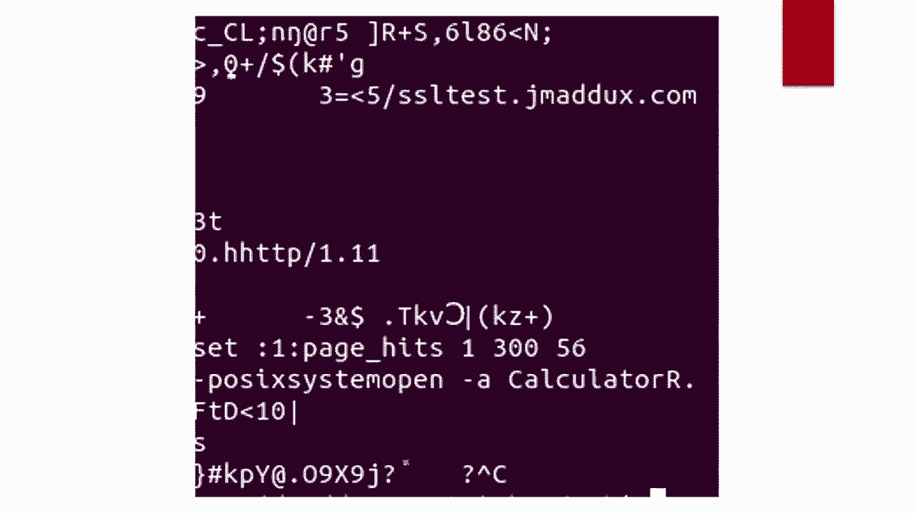
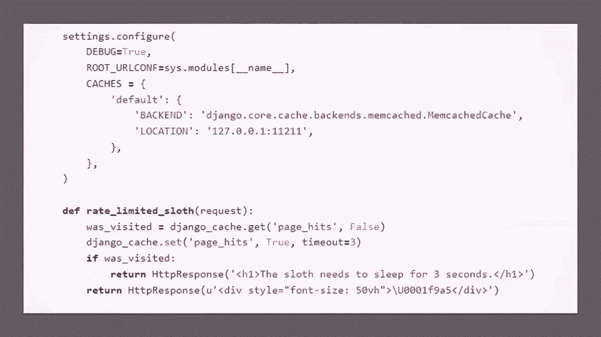
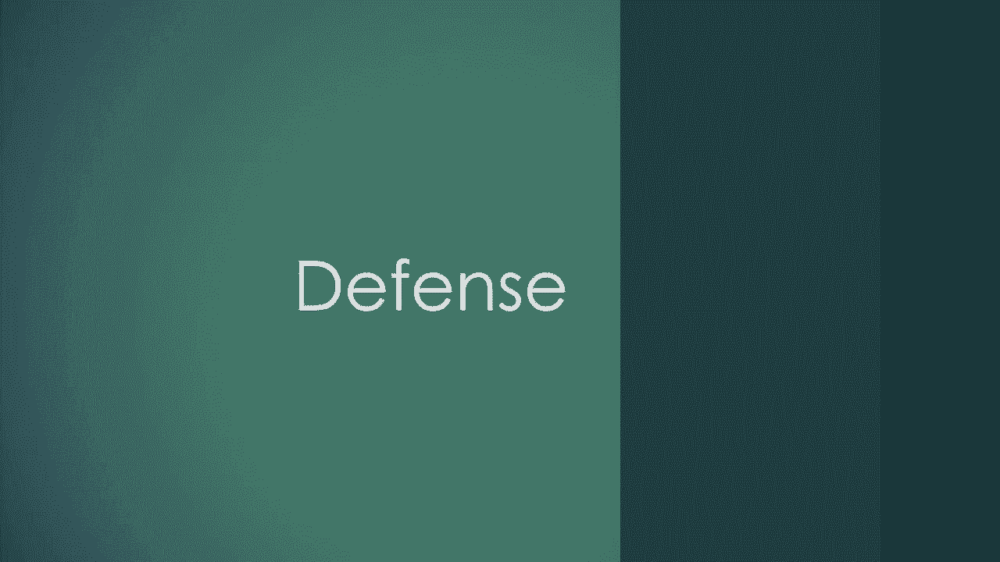

# P79：80 - When TLS Hacks You - 坤坤武特 - BV1g5411K7fe

 Welcome to this talk， when TLS hacks you。

 I'm actually going to start off with it， this is going to be weird。

 This isn't a concrete attack scenario， but hopefully it should make everyone curious。

 about what's going on。 For those familiar with SSRF， the implications will be fairly clear。

 but I'll explain them， right after the demo for everyone else。 After that。

 the attack scenario examples are going to gradually move towards real stuff。

 but I find it's easiest to first look at the simplest cases and then start expanding。

 to look at real world stuff。 For now though， let's see the essence of the dangerous property of TLS that this talk。

 is about。 Here's memcached， a popular cache that commonly runs on port 1121。

 I have it installed here， so you can see that for the key named Z， there is currently no， entry。

 If you're not familiar with memcached， this is how stuff communicates with it， a new line。

 to limited TCP protocol。 Now I'll do something that you might not expect to affect memcached。

 I'll make a request， to an HTTPS URL。 The dash L enables redirects and the dash V lets us see everything that's going on。

 So you can see that the endpoint after a bit is redirecting to itself。

 I sped this up because this is a lightning talk and the string of redirects takes a couple。

 of minutes。 But the redirects don't go on forever。 After a bit， we get an error。

 And now for the magic。 Going back to memcached， if we rerun the same get command。

 we see an entry up here。 The odd thing is that text never showed up in the curl command or in any of the redirects。

 So somehow the server we were talking to had to do something with TLS to trick curl and。

 to putting it in there。 So even though I didn't just do anything aside from hacking myself。

 what happened was weird， and potentially useful。

 But here's where I'm going with this。 Because not everyone is into these sorts of attacks。

 I'm going to start off with exactly， what makes this useful as an attacker。

 I'll then move on to some stuff that shows just how widely these attacks can be applied。

 and then get to some recommendations for what to do about them。 So to start off with。

 there's an existing category of vulnerability called SSRF。

 It stands for server side request forgery。 It's where you effectively fish a server into doing something by sending it a URL。

 Last year at Blackout， I demonstrated a bunch of these vulnerabilities in Apple Pay and。

 in Web Book receivers。 I'm not going to go into these as much here， but if you're curious。

 you can download these， slides later and take a look at this YouTube link right here。

 SSRF has a ton of different approaches， but it was actually pretty easy in some cases。 WebKit。

org had a live sample implementation of Apple Pay and it even was on ABWS with。

 the old NSS metadata service。 So all I had to do was pass this IP and I could book around an internal API and get some。

 tokens。 But not everything was so simple。 I had a lot of SSRF vulnerabilities that were out there that were almost there but。

 weren't quite vulnerable to this easy approach。 Sometimes I'd have a webhook where I could hand it a URL and the server would even fetch。

 the URL but not give me a response。 This is called blind SSRF。

 Other times the requests in question would be a put request which restricted what endpoints。

 I could hit。 Sometimes you can mess with the request method by setting up an endpoint that redirects the。

 server around but that's hit or mess。 Other times you might get some data back but it's validated against a specific content。

 type or you only get back certain fields。 Or even worse it will only accept HTTPS URLs。

 So what we really want here in order to exploit this stuff is a generic blind SSRF approach。

 In other words we'd like to send the server a URL， have it fire a payload at something。

 internal like SMTP or Redis and get a security compromise just from that exchange alone。

 And without needing to see a response。 So here are the comments。

 some of the comment approaches to that。 The issue is these are extremely platform specific to the point that I have never had。

 any luck with these。 But there are some useful ideas in here particularly in S9 injection。

 You wouldn't think TLS would be particularly useful because its packets are mostly just。

 encrypted data， binary flags and other stuff that an attacker doesn't have much control， over。

 But it's not all that limited。 As Orange noticed the S and I which is basically just the domain name is part of the URL。

 So if you can trick the victim into accepting a weird domain name and parsing it in correctly。

 You can include arbitrary bytes in there and smuggle stuff like SMTP commands。

 This approach is dependent on a platform specific URL parsing bug but what if we had。

 something that was inherent to the TLS protocol。 This is where my work starts。

 Let's look at a TLS packet and see what's there for us to use。

 As is often helpful when looking at protocols we can open up wire shark and see what happens。

 in a TLS connection。 Here's the S and I or server name indication that was previously explored in Orange's talk。

 His work involves putting new lines and SMTP commands into the section pointed to by the。

 arrow here。 If you poke around you'll see stuff like random strings。

 key shares and other stuff that isn't， all that useful for SSRF。 Why？

 Because the only part of a server that or the only part of this that we can typically。

 feed a server is a URL and the only part of the URL that will make it into this client。

 hello packet is a domain name that we provide the victim machine。

 But there's a different way that we as an attacker can get payloads into client hello， messages。

 It involves a couple of steps and is the main focus of this talk。

 First we send over a link to our own server。 In this case jmatics。com。 Then jmatics。

com responds with a valid server hello that it contains our payload。

 Now it would be an ideal if we as an attacker could get that payload the jmatics。com sent。

 the victim and get the victim to send it somewhere internal。 But that raises a question。

 Is there such a field that we can use to deliver these payloads？

 It might seem too good to be true but TLS actually provides us with exactly that in the。

 form of a session ID。 Most clients even persist this field。

 Session IDs are limited to 32 bytes as you see here but depending on the implementation。

 you might have session tickets。 This one is about 200 bytes but these can be up to around 65 kilobytes。

 Both session IDs and session tickets are mechanisms for TLS client to go。

 Hey remember that cryptographic key exchange we did earlier？

 Let's just keep using that in this new exchange or in this new connection。 TLS 1。

3 includes a slightly more complicated mechanism called a pre shared key identity。

 which does pretty much the same thing for our purpose。

 All of these are about optimization since key exchanges can be time consuming。

 But they provide a way for a server to tell whatever is connecting to it to persist some。

 data for later use。 So it's almost like a cookie that loves and plain text。

 So it's perfect for the SSR app to attack that we're trying to do。

 Now you might anticipate a problem here。 Obviously if you go to google。com and then to apple。

com those TLS sessions are going to， have distinct data from each other。

 The same applies between google。com and localhost。

 So we have a bit of a problem getting the target server to reuse the session when communicating。

 with something internal。 But when I looked at both the TLS spec and popular session cache implementations I saw。

 this wasn't quite the case。 I first went to the curl source code since lib curl is used by a lot of PHP stuff。

 Sessions are keyed by the four key properties here which belong to this struct。

 As you can see none of these are the IP address。 This means that no matter what IP address Jmatics。

com resolves to， curl will attempt to， reuse the session。

 This also happens to be how just about everything else caches TLS sessions。

 So if you establish a TLS session with Jmatics。com whether it resolves to something on the internet。

 or your own machine your HTTPS client will not know the difference。

 Since I as the attacker own Jmatics。com I can combine all of this TLS stuff with a concept。

 I called DNS rebinding。 So I resolve the first request to 35。x。x。 Some server I control。

 Then the server target server picks up the payload from 35。x。x。x in the form of a session， ticket。

 After some time I send the exact same URL except the DNS entry has expired。

 Then since I control the DNS server this time around I resolve Jmatics。com to something。

 internal that I wouldn't normally have access to from the outside。

 To simplify things I'll just use localhost。 Once the DNS query finishes the target server then makes an internal request with that payload。

 So like what I did in the opening demo you can manipulate whatever you're attacking to。

 send a TLS session ID ticket or PSK identity to itself。

 Here I'm showing a PSK identity that does a memcache insert。

 So here's the same TCP stream but just displayed raw。

 This view shows the really important property of my approach to combining TLS with DNS rebinding。

 You can get arbitrary characters to be sent which includes new lines。

 This is what allows you to interact with a bunch of local services like memcache just。

 like people did in the past with go for URLs。 And here's an exchange more typical of what you'd use to do real damage。

 This is a value that in most Python memcache libraries will execute a shell command immediately。

 once it's retrieved from the cache。 This is because it's quite common in Python and other languages to use built in serialization。

 methods like pickle to convert values to something that can be stored。

 Unfortunately built in serialization methods are also common RCE targets。

 We'll get to exploitation later。 But since this is pretty common I ended up testing a fair amount of sites。

 I'll get some specific ones in a second but first I'll go over some testing infrastructure。

 I set up along with some tips for actually performing these exploits。

 So here are all the VMs I have on the internet。 Save for maybe some IP white listing。

 They need to be on the open internet so that the target boxes can reach them。

 I've got a name server record pointing to the ssltest。jmass。com queries to the DNS server。

 on the top left which is just a Python script running on port 53。

 It alternates between answering with the IP address of the custom TLS server and local， host。

 Then on the over there on the right I have my custom TLS server which is there to deliver。

 my payloads via session tickets。 I can figure those by just updating values in RDS。

 So when testing it it proved difficult to go straight to local host。

 Since depending on what library is making the requests I didn't know if ssl sessions。

 were being cached。 To address this sometimes I ended up adding another box just to see if the payload was。

 being persisted。 If you're not familiar Netcat can be set up to just listen for TCP connections and log。

 the results。 If I saw my payload making it into the logs I knew the general approach could work and。

 then go back to the setup from the previous slide to get the server to start delivering。

 the payload to itself on different ports。 And here are the links to what I actually used。

 A big chunk of the work was saved by just messing around with a pure rust implementation。

 of TLS which is linked to here。 A big thanks goes out to everyone in this slide。

 I wouldn't have had the time to do any of this work if not for the code they had put out， there。

 But I know if everything I just claimed I need to back things up by showing what actual。

 real world attacks can happen with this。 I'll start off conceptually and then get to some examples along with another demo。

 But here's the model I've got。 If you're in the middle of this diagram you're generally vulnerable。

 And then this top part refers to when you can send something a URL and it will fetch。

 that URL but you don't know of a way to exploit that behavior just like in the first few， slides。

 It's interesting because you would hope by now people try to eliminate anything remotely。

 looking like SSRF。 But this pattern is in fact required by a few popular specs。

 It's even common enough that I've seen bug bounties mention SSRF with no proven security。

 impact as an excluded category。 Understandably so。

 But that's what this exactly what this talk is about。

 Adding the security impact even when you have something that it's just almost SSRF。

 And then this one on the left sounds weird but it's getting bigger。

 It's just a matter of whatever the SSRF is going through to make requests as implemented。

 this feature according to latest spec。 Unfortunately there are quite a few HTTPS client libraries out there that sport full blown。

 TLS session caching。 I reported this as a vulnerability to a few but not all of the entries with the S。

 I haven't， seen much traction。 Understandably since fixing this requires diverging from the TLS spec not a whole lot。

 of people are eager to do so。 This thing you run into the most trouble with is this last circle because you have to first。

 do some recon to see what ports might be internally exposed on the server。

 And then you need to see if what's on those ports is permissive enough to keep the connection。

 open past the opening bytes of the TLS client hello。

 But here are some examples of what you might be looking for。

 It's far from complete but here are some of the most notable entries I've had success， with。

 So now we'll go through a couple of exploitable examples of these TLS session based SSRF vulnerabilities。

 that I reported and got fixed。 Here's one from Utrack。

 It's rated low because all I had was local SMTP and I didn't try poking around to see if。

 I could exploit the SMTP server further。 The rate is generated from Utrack's import feature which normally wouldn't be easy to。

 exploit being blind to SSRF。 But with my rebinding code here's a section from the TLS packet I got Utrack to send itself。

 This works because SSRF is a new line-delimited TCP protocol just like memcache so you can embed。

 working commands within a TLS checkout。 And here's what came of that packet。

 This alone wasn't super severe because it's not signed quite right and I didn't dig too。

 deeply because I wanted to just report it as a B。 But it did get initiated by a TCP stream。

 I got Utrack to send itself so it's still pretty bad。 Just conceptually。

 And here's one I reported in NextCloud。 The idea behind NextCloud is a cool one。

 You can set up a server and host files and even share them with other people's servers。

 using a share URL like this。 But as it turns out， you can include port numbers in the share URL。

 Now since NextCloud automatically puts HTTPS in there， normally there wouldn't be as much。

 SSRF potential and it would have to be blind SSRF。 But luckily I was able to do just that。

 So as a non-admin user， I could use my TLS for binding Utrack infrastructure to perform。

 arbitrary rights on memcache。 After reporting this and working through the options。

 there weren't any great ones because， not all request libraries allow you to disable TLS sessions。

 In this case， libcurl has the option but isn't exposed by a PHP request library such as Guzzle。

 In any case， adding a request to timeout made the attack pretty much infeasible assuming。

 people don't turn their DNS time to live values super low on their servers。

 NextCloud was even generous enough to give me a bounty even though in my opinion this is。

 libcurl's fault。 So since the last couple were just text slides。

 let's see a real demo now from the perspective， of a Django web developer getting fished。

 The DNS rebinding part has been done in the past but what's new here is combining DNS。

 rebinding with TLS session persistence to make it even more powerful。

 In the past you had to get people to visit a fully malicious page to get anywhere with。

 DNS rebinding but with my work you can do the same with just an image tag。

 Because of that you can fish people into RCE， even if they just view an email but don't click。

 any links。 Let's see it now。 And now for the actual demo。

 So as you can see we're pretending I'm a Django developer running a typical app but if。

 we look at the app it's pretty simple。 We can view a sloth emoji but if we refresh too fast the sloth needs to go to sleep。

 And now for what happens when I get fished。 As you can see I've received some perfectly legitimate emails and then viewing them。

 Usually these image tags would be benign but after viewing them my sloth now opens up a。

 calculator via shell command。 That's because the image tags pointed to the domain with my rebinding setup and a simple。

 Python pickle payload。 And here's most of the source code used in the example app I created。

 You can pretty easily find apps that call Django。core。cache around GitHub。

 I didn't want a demo against a specific one because that seems a little mean and I don't。

 want people launching actual phishing campaigns against such products。

 It's a little tough to assign blame here。 Nothing is really breaking from established practices but it's clear that there's a potential。

 to compromise real world developer laptops。

 On that note there's a lot more to do here that I couldn't possibly do on my own。

 These slides will be available online if you want to return to this。

 And if you do anything interesting I'd love to hear about it。

 There's certainly a lot more potential vulnerabilities to explore。

 So all of that is bad but what can be done about it？

 Let's start from the root of the problem TLS clients。

 So here's something I recommended to the Chromium team a while back。

 We still aren't in agreement about whether this should be fixed and my report was pretty。

 hastily written which probably didn't help things。

 I'd like to remove the ability for sessions to be resumed between different servers。

 While the Chromium team has marked this as a "won't fix" they did suggest an alternative。

 that maintains support for resuming sessions across servers。

 They probably care a lot more about that than I do but we can have the best of both worlds。

 This last option of just partitioning based upon whether the address is something local。

 is a good compromise。 It wouldn't affect performance but would protect against most of the attack scenarios。

 I can think of。 But based on my experience so far I'm not hopeful that there's going to be much proactive。

 effort on the part of software packages that make HTTPS requests。

 So for most of the audience it's more useful to know what's susceptible and what layers。

 of defense can be applied。 However， with all of this we're thinking a setback to consider。

 The CL assumption， session resumption even worth it。 There are other issues with it。

 some of which are shown here。 I'm not going to make the case that the industry as a whole should give up on this optimization。

 but we should take a step back and see if this is a worthwhile trade off。

 We may just like in the previous slide find that the costs can be eliminated。

 But if we find that we can't tackle these problems we need to weigh them against the， benefits。

 And here's the main benefit。 You get a sizable performance improvement on the small subset of packets that are TLS。

 handshakes。 You probably care about this whenever you're in the position of serving up a lot of TLS。

 connections。 Whatever percentage of CPU usage is due to TLS handshakes。

 You probably want to keep that low to minimize costs。 But if you're like me you don't care。

 I'm taking on all the security and privacy risk as just a regular internet user。

 Taking on all of the security and privacy risk of session resumption but the amount that。

 it actually saves on my power ball is probably pretty minimal。

 Additionally if you're running a web application that you might care about session resumption。

 on incoming connections but when you are making an external request it's probably not in your。

 interests。 You're placing a lot of trust on random websites not to redirect you and own your local services。

 So how might you turn this off？ Here's what I found。

 It's kind of sad when stuff forces you into this but at least as an internet user you。

 can pick Firefox and disable session identifiers if you're really paranoid about this stuff。

 If you're running a web application you're a bit stuck though。 What should you do？

 First off it's a good idea in general to run your outbound requests through a proxy especially。

 if you're supporting webhooks or some other SRF prone feature but also reconsider your。

 and first ref for decisions。 You'd be surprised just how much stuff is still set up in a way that is just one locally。

 initiated TCP stream away from compromise。 And here are the general takeaways。

 The thing I'd like to highlight is if you're just starting out on the offensive side of。

 security I'd encourage you to look at random standards and browser features that come out。

 Even if you don't fully understand them at first find something that seems interesting。

 and start hacking around in Wireshark。 I know I didn't understand TLS and I still don't really understand it but as an attacker。

 you only really need to understand the worst parts and that's what this is all about。 And thank you。

 Here's my Twitter and a link to Lata Quora where I work。

 They're a great place to work and have been amazingly supportive of random research directions。

 I take。 Definitely take a look。 Thanks everyone for watching and for all the comments。

 I don't see any questions quite yet。 Oh actually I do see one。

 Would you think an image proxy in your email protects against this？ That's a good question。

 You'll notice if you rewatched in the demo I used Microsoft Outlook and not Gmail。

 That's actually due to the fact that you're correct。

 Using when an email provider uses an image proxy that does to some extent protect end。

 users against this all within the catch of courses email providers have to put some work。

 into interpreting estimates themselves which of course Gmail being as big as it is。

 They put that work in。 I think I might not be correct to all of this in all cases but Outlook does not use an image。

 proxy and that's why the demo work and Outlook。 Do you have a white paper on this？

 I didn't get around to writing a white paper but there is something close to it。

 The GitHub link has， I wrote up the readme that has at least some explanation of the attacks。

 as well as a little diagram and instructions on how to set up the infrastructure for yourself。

 The next question is this work on all versions of TLS。 It works on。

 with TLS implementations you get the gets of it fuzzy。

 I think the features that this relies on have been present since TLS 1。2。

 I think most stuff is on 1。2 or 1。3 at least。 You run into more as if the actual request making the HTTPS client library if that implementation。

 like has a cache on its own。 If you use the built-in Java HTTPS request library method that will automatically cache。

 sessions for you which will make an S-ref issue in the website this is a valid approach。

 to it in the Java application。 I will re-share the GitHub link here。

 What versions of TLS is the same as the previous one？ Yes， another question。

 What kind of payload can be set in a TLS ticket？ Is binary data possible like XOO？

 I believe no bytes are possible。 I believe it's a length prefix field。

 The particular thing that you run into or that gets you a lot of the S-ref vulnerabilities。

 in practice is the new lines because that gets you like memcache， that gets you S and， DPP。

 although it would be interesting to attack non-new line-delimited protocols like random。

 binary debugging protocols which I haven't had any success with yet but I imagine might。

 be possible。 Do you have an example of the code used for the CalP。exe payload？

 That's buried within the GitHub link of it。 I'm going to try to find the app here。

 It's in quite hell poisoning/minimal Django。 And there I have a payload。

memcache file which has a DCRalization payload for attacking specifically。

 Django users and it's specific to this application because in order to load the payload you do。

 need to know what the name of the cache entry is。 So there is in terms of practical exploitation of this。

 it does depend on some recon and， some knowledge of what application you're attacking。

 Of course if it's open source which some of the apps I found are then that's a lot easier。

 Here's another question I'm seeing in the chat。 If a deep inspection firewall was able to block external DNS replies that had internal。

 answers including locales would that mitigate the DNS refining impact？

 I think there's an angle I haven't thought about as much。

 I want to say there is in terms of generic DNS/ase binding defenses。 I have seen some stuff。

 I don't know what's actually been implemented。 I'm a home network。 I have a pihold。

 I think I've seen a plug-in for pihold or something like that that does try to mitigate。

 DNS/rebinding。 I don't remember if it's by just keeping DNS/TTL values really， really high。

 That's a good question。 It may be a little bit more on the general DNS/rebinding attack category。

 I think that's all the questions。 Thank you everyone for watching and for all the kind words in the chat。

 [ Pause ]。