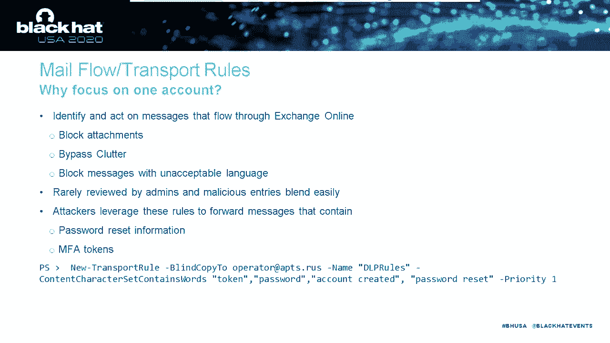

# P7：07 - My Cloud is APT's Cloud - Investigating and Defending Office 365 - 坤坤武特 - BV1g5411K7fe

 [MUSIC]。

 All right， welcome everyone to our talk。 My Cloud is APT's Cloud。

 Attacking and Defending Office 365。 My name is Doug Beanstalk and I am。

 a Incident Response Manager at Mandiant。 So I spend most of my time leading。

 Incident Response Engagements out of， our New York City office for our clients there。

 But I also do a little bit of dabbling， and red teaming and some research as well。

 And I've developed a pretty strong， love-hate relationship with， Office 365 over the past few years。

 And I hope that after this talk， you'll understand a little bit why。 Outside of InfoSec。

 I'm a huge Green Bay Packers fan。 So if during the QA you want to ask me anything about Aaron Rodgers。

 I might not be the best use of our time， but I say go for it。

 Now I'm going to turn it over to my co-speaker Josh。

 who will introduce himself and get us started with some content。 Josh。 Thanks， Doug。

 My name is Josh Madeley。 I'm an Incident Response Manager at Mandiant。

 based out of our Boston office。 And I've been with the company for about four and a half years。

 I like to think of myself as a bit of a Cloud connoisseur。 Since I do love all things Cloud。

 I genuinely believe that it is the solution， to many modern IT problems。

 But with that comes the realization that it， has its own unique security implications。

 Outside of InfoSec， I'm a die-hard rugby fan。 And you know， based out of Boston。

 I've had to adopt the New England Patriots， as my American football team of choice。

 So today we're going to be talking about how targeted threat actors attack Office 365。 To do that。

 we're going to give you a crash course overview of Office 365。

 then talk about how attackers gain their initial access to a tenant。

 and finally how they complete their mission and steal data。

 We want all of you to walk away from this presentation with the understanding。

 that targeted threat groups are investing a lot of time and money into。

 understanding Office 365 and understanding how to attack it。

 And that means that you need to as well。 Now， one of the major misconceptions about Office 365。

 is that it is just email。 Well， that may be true for some small organizations。 For many。

 it is their entire authentication and collaboration platform。 This includes Exchange Online。

 Active Directory Online， Microsoft Teams， SharePoint Online， Word Online。 You get the point。

 Microsoft has moved their traditionally on-premise applications。

 into the cloud and provided them as a software as a service model。 Now。

 one of the important features of Office 365， is that it is accessible from anywhere in the world。

 There are no access restrictions unless your organization intentionally implements them。

 This means that identity and its corresponding metadata are used to determine。

 if a user has rights to access their email or a word document， from a hotel Wi-Fi or an airplane。

 No VPN required。 With that though， we want to spend a few minutes talking about authentication。

 and the two common hybrid identity models that we see organizations using。

 And it is very likely that your organization is using one of these。 Now， first。

 there's managed authentication。 And this is when Azure AD handles the authentication process。

 by using a cloud stored， hashed version of your password， known as a password hash synchronization。

 or it will send the credentials to an on-premise software agent。

 to authenticate against your local Active Directory server。 It's called pass-through authentication。

 It's model simple， easy to use and maintain。 And it is Microsoft's preferred mechanism for authentication。

 They would prefer you to use password hash synchronization。

 because it gives you access to advanced Azure AD security features， such as identity protection。

 The second model is federated authentication。 And this is where authentication is passed off to a trusted third party。

 such as ADFS， Octa， Ping Identity。 And we're going to spend a little bit of time talking today。

 about what that trusted third party actually means in practice。 Now， when a user logs in。

 they're redirected to a login page， for that particular organization。

 This is often an ADFS proxy server sitting in a DMZ in your network。

 The user presents their credentials， which are validated against the internal AD database。

 A successful authentication results in a signed SAML token， being sent to the cloud。

 To assert that the user has provided the appropriate username， password， and if configured。

 satisfied the MFA requirements。 Now， as you can imagine。

 this is a little harder to manage and maintain， but it does give some organizations added flexibility。

 Federated authentication is generally used by large enterprises。

 Now that we understand the basics of how authentication is handled。

 we need to discuss the two types of authentication。 There's modern authentication。

 which is the default and recommended sign-in method， and effectively behind the scenes， it is OAuth。

 This with this comes support for some advanced security features。

 such as multi-factor authentication and conditional access policies。

 You can even use metadata about the device or location。

 or the location of the user to determine if additional verification is required。

 such as a mobile push。 Legacy authentication is used by， you guessed it， legacy protocols。

 such as pop， iMap， older versions of PowerShell， and autodiscover。

 It does not support multi-factor authentication， because it is essentially HTTP basic auth。

 And the reason we have to talk about this is that it is enabled by default。

 And you as administrators and defenders need to proactively turn it off。

 Attackers know this and they extensively target it。 Now Microsoft will eventually disable this。

 but they've already extended the deadline once， so your guess is as good as mine when that will actually occur。

 Now once the user has successfully authenticated， you as defenders need to know where this authentication is recorded。

 and where the subsequent actions are recorded。 Now you're going to be given three core logs。

 You've got the unified mailbox and admin audit logs， along with Azure AD logs， mail trace logs。

 and the security and compliance reports。 The unified log is the centralized solution for various Office 365 applications。

 It records， it's sorry， the data it records varies by application。

 And in most cases it will record a timestamp， username， operation， source IP address。

 and the associated parameters for that request。 The data is stored for 90 days by default。

 and can be accessed via PowerShell or a web UI。 We strongly recommend that you have this data forwarded to some sort of log aggregation tool。

 so that you're not limited by the PowerShell interface。 And if you have an E5 license。

 you can extend the retention period。 The native search capabilities are pretty limited。

 so if you want to have some robust interactions and robust detection。

 you're going to have to forward it to a sim。 The mailbox audit logs record certain data that occur by owners。

 delegates， and administrators within a specific mailbox。 This is not centrally indexed。

 and these would include logons， message binds， folder binds， and mail item access to events。

 Whether the event is logged depends entirely on the license level。

 and the type of access to the object， whether it was done with valid credentials。

 or the user was delegated access to the object。 Now。

 defenders need to be familiar with this type of auditing。

 We're not going to go over the details of it today。

 but unless you're paying money for advanced auditing， if an attacker logs in with valid credentials。

 you will not know what objects they interacted with， what emails they viewed。

 Another important point is that the data is stored in the individual mailboxes themselves。

 So if you want to search the data that is not， if you want to search the data within the mailbox audit logs。

 you're going to have to do it on a per mailbox basis。

 And you have to think that this is likely going to be an unfortunate loop。

 with a PowerShell script unless you forward it to a SIM proactively。 Finally。

 there's the admin audit log， and this is going to record the execution and。

 the corresponding parameters of administrative commandlets within the tenant。

 Majority of these are searchable within the unified audit log。

 so you don't generally need to interact with it。 If you are an E5 license subscriber。

 you're going to have access to the， Azure AD audit logs， and they'll be stored for 30 days。

 and they contain additional data about the authentications， such as the MFA type used。

 a little bit more detail about the applications， etc。 Mailflow logs are going to give you access to。

 which individual mail items are transiting the tenant。

 so who's receiving which message is and who's sending them。

 Then you can also use the security and compliance reports to search for。

 content of the messages to see what they contain。 Now that we're all experts on how Office 365 works。

 let's briefly talk about the attack lifecycle and how it relates to Office 365。

 As we mentioned earlier， identity is the most important access control within Office 365。

 So when we think about the attack lifecycle， we need to keep it tightly coupled to the compromise credentials and the authentication providers。

 Each request to an object needs to be authenticated。 Today。

 we're going to focus on how attackers initially compromise an environment， using valid credentials。

 how they maintain their persistence by modifying or。

 circumventing the federated authentication providers。

 and how they use the built-in administrative and security tooling to steal mass amounts of data。

 All of the techniques today that Doug and I are going to talk about。

 we've observed attackers using through investigating real-live incidents。

 We are not going to be talking about penetration testing techniques。

 but instead focus on the TTPs we have observed advanced adversaries using in the real world。

 Alright， thanks Josh。 So our first case studies are going to talk about initial access。

 What are the ways that targeted threat actors are finding their way into Office 365？ After that。

 we'll talk a little bit about some of the ways that they're maintaining their access。

 How are they establishing persistence so they can access a tenant for days， weeks， months。

 maybe even years if they're lucky？ Our first case study is going to walk us through an MFA bypass using PowerShell。

 So Josh has talked about conditional access and I'm going to talk about it even more。

 It's a really strong way to ensure that you are securing your tenant。

 And these clients that we were assisting， they were all using conditional access to enforce MFA。

 for all logons。 But somehow the attacker was actually managing to get around this。

 and through some initial testing we couldn't exactly figure out how。

 until we started looking at the， Azure AD audit logs and the unified audit log。

 We found that the attacker was using a PowerShell。

 module called Azure Active Directory PowerShell or Azure AD。

 Now this module is going to give us programmatic access to Azure Active Directory。

 And as Josh just finished telling us， it has a lot of sensitive information in there。

 So obviously our users， but also groups that they're in and other overarching information about the。

 organization。 And what's interesting about this particular PowerShell module for Office 365。

 is that any user， even an unlicensed user can access it and you actually can't disable it。

 So with Exchange Online PowerShell， there's a setting you can use to disable it。

 That setting does not apply to this PowerShell module。 It wants even more interesting to us。

 but also to the attacker at the time， was that this module did not go through conditional access。

 So it would completely bypass conditional， access policies。

 The attacker found this out and they used it to access a number of organizations， that we assisted。

 Now Microsoft has recently fixed this bug。 You can no longer bypass conditional。

 access using this PowerShell module。 We're just not exactly sure when they put the fix in because。

 there were no release notes or patch notes that we could find。 So the first investigation that we。

 were working involved to Citrix NetScaler Compromise。 The attacker had access to the。

 SNET scaler using the vulnerability that I'm sure we all know about。 And that NetScaler device。

 contained the username and password for what the client was calling an LDAP connector account。

 Now this account was an AD account and so it was also being synced into Azure Active Directory。

 which meant the attacker could use it to connect to Azure Active Directory using the PowerShell。

 module。 They did that and then they exported the full list of users， so about 50，000 users。

 and conducted a massive password spray attack。 Now inevitably they got some more credentials out of。

 that and then further access to this victim organization's environment。

 Now in some other case studies， we were also investigating password sprays。

 These were much smaller in scope， so likely the attacker。

 had conducted some OSINT or had bought some lists and was using that to try and authenticate to。

 Azure AD PowerShell。 Now once they successfully got in。

 they exported as much information as they could， turned that information around and used it to extort all of these organizations。

 So threatening， to sell this information to criminals if the organization didn't buy it from them first。

 Now our next case study， our next TTP also involves PowerShell， also involves a conditional access。

 bypass。 So this organization was using conditional access to enforce MFA for all sign-ins。 But the。

 attacker also found a way around conditional access using a different technique。 In this case。

 we could see in the Azure AD audit logs that the attacker was using an application called the。

 Microsoft Online Syndication Partner Portal or the MOS PP。 And the user agent contained a。

 Windows binary called the MSOID SVC。 Now we had never heard of this before， neither had the client。

 and furthermore the client was not using a partner to manage their tenant。

 So the partner portal thing， just didn't make sense to us。 After some digging。

 we found that the MSOID SVC， excuse me， was the， Microsoft Online Services Sign-In Assistant。

 which is basically an authentication broker that helps， other desktop apps connect to Office 365。

 And this was actually a requirement for some applications。

 and even PowerShell modules in the earlier days of Office 365。 And that MOS PP， that partner portal。

 not a partner portal， it was actually a very early version of the Microsoft Exchange Online。

 PowerShell module， a version from I think 2016 that you can actually no longer download from。

 an official Microsoft website。 And for context， we were conducting this investigation very early 2020。

 And now it turns out this combination of tools， the sign-in assistant and this old version of。

 PowerShell completely bypassed conditional access。 So the attacker somehow figured this out and was。

 using it to access the tenant。 Now this has also been fixed。 Again， we're not sure exactly when。

 because there are no release notes。 But sometime in the last few months， this was closed and you。

 can no longer use these tools to bypass conditional access。 Now the last technique I want to talk。

 about for initial access is OAuth Abuse。 I've already talked about this at some other conferences。

 as well as a pretty good FireEye blog post and a tool that I've created。 And some of my peers in。

 the InfoSec industry have blogged about this and created their own tools。 But what it's boiling。

 down to is the fact that Office 365， just like any cloud platform， is going to give third-party。

 developers the ability to create applications that then access data on a user's behalf。 So think。

 about your calendar plugins， your sales source integration， maybe boomerang for email。 All of。

 these are OAuth applications。 And they're attractive to attackers for a few reasons。 The first is。

 they're using a legitimate Microsoft framework。 So you can see the image here is the only thing。

 that a user really sees。 And it's a pretty simple yes or no prompt for them to allow an app。

 Now these， applications are designed to bypass MFA because I don't want my calendar plugin to prompt me for。

 MFA every day or every week or whatever。 They also can access the user's data for 90 days。

 if not longer。 So very attractive to attackers。 And in fact。

 we've seen a number of campaigns since around 2018， of varying levels of sophistication。

 And Microsoft actually just recently took down a number of。

 domains that were hosting OAuth abuse applications that attackers were using to conduct BEC attacks。

 So how can we stop this from happening？ Well， first off， we should remove the ability for。

 users to consent to apps。 Right？ Just like we're not allowing our end users or shouldn't be。

 allowing our end users to install applications on their laptops， we should not be allowing them。

 to consent to applications in Office 365。 Just doesn't make sense。 Now， if you have an E5 license。

 or cloud app security， you can go a little further or you can have a little more control。

 You can do some hunting。 You can look for prevalence。

 You just basically have some more options available。 Now that we understand initial access。

 let's move into persistence。 How are attackers， ensuring they have long-term access to Office 365？

 And it's important to note that all of these， techniques require global admin privileges。

 So the attacker has already somehow escalated their， privileges。 That's out of scope for now。

 Our first technique is a conditional access policy， modification。

 So we've talked a lot about conditional access and it's very important， obviously。

 And attackers know that and they spend a lot of time understanding how conditional access， works。

 And so in this case， we had an attacker that was accessing Office 365 from the VPN。

 This VPN did not require MFA。 Now， however， the victim organization was still using conditional。

 access to enforce MFA as long as you are coming from somewhere else， from a Starbucks， for example。

 And to kind of set up this level of configuration。

 conditional access has a couple of tools available， to us， right？

 So what the attacker was using and what this client was using is a IP-based exclusion， list。

 So the client was calling it their MFA trusted IPs。 The list of IP addresses that don't need， MFA。

 The attacker found this list and they added an additional IP address to it。 That IP address。

 was actually a Microsoft IP address because the attacker's plan was to proxy all of their network。

 traffic through an Azure VM。 This had the added benefit that when an investigator， when an analyst。

 is looking through the logs， they'll just see Microsoft IPs and they'll probably think it's the。

 legitimate。 And the other thing for us to think about is monitoring and alerting， right？ When。

 you're monitoring or alerting， you probably want to know about configuration changes to your environment。

 You probably have SCOM alerts for when a new domain administrator gets created， for example。

 There's nothing out of the box that we can really do here though in Office 365。 We can't receive an。

 alert anytime a new MFA trusted IP is added。 You need some additional logging or monitoring to do that。

 Now moving on in sophistication， we had another victim organization where the attacker was。

 managing to access Office 365 even though the attacker had， didn't have MFA obviously。

 And even though the victim was enforcing password resets and enforcing。

 MFA and we didn't see any of the other hallmarks of those conditional access bypasses that we have。

 just finished talking about。 It turns out what was happening is the attacker was using a bug。

 in Office 365 as well as some very particular knowledge about how federated authentication works。

 So that bug was that you could add a new domain to a tenant and use it for federated off even if。

 you don't own that domain。 So I could add google。com for example。

 And the knowledge was the attacker， new specifically that Azure Active Directory is really only checking two pieces of information。

 with those federated authentication tokens。 The first one is obvious。 They're checking that the。

 digital signature is valid。 And the second one is looking for a piece of information in those。

 tokens called an immutable ID。 The mutable ID is basically just a grid which can map back to a。

 user in the Azure Active Directory or in the Office 365 tenant。

 And so what the attacker was doing is， they were creating authentication tokens for valid users in that tenant and then authenticating。

 regardless of the fact that they have just added this new federated domain called evil。com。 But。

 they were trying to authenticate to users called victim。org。 That doesn't matter because those two。

 domains were within the same tenant。 So by setting a new additional unverified domain as a federated。

 authentication provider， the attacker was basically telling Azure Active Directory， hey。

 I'm going to send you authentication tokens from this domain and you can trust them for any user。

 in the tenant regardless of their domain。 And because the attacker already had access to Office 365。

 to Azure Active Directory， they could export the full list of immutable IDs for all of the users。

 which now meant that they had all of the information they needed to create an authentication token for。

 any user in the entire tenant。 And this is going to bypass MFA because the attacker can add something。

 to those authentication tokens that say， hey， this is a trusted authentication from a trusted。

 location。 Don't worry about MFA。 Now this bug has somewhat been fixed， so you can no longer set up。

 an unverified domain， a domain you don't own as a federated authentication provider。

 But if we think， about it， it would be fairly trivial for an attacker to create a type of squatted domain。

 validate that， they own it because they're going to register it。

 and then add it as a new federated authentication， provider and conduct the same attack。

 And just like with modifying conditional access， there are。

 no alerts set up out of the box to tell us when a new domain gets added， when a new federated。

 authentication provider gets added。 And actually this technique has been blogged about as far back。

 as 2018 as a way for IT administrators to back door their own tenant in case they're worried that。

 some cloud multi-factor provider may be Azure MFA fails and locks them out。 So the last technique。

 I'm going to talk about is Golden Sandal。 And I've talked about this a lot at my troopers talk back。

 last year in 2019 and some tools that I released。 But what it's boiling down to is the fact that。

 the digital signature that ADFS servers create is relying on a signing key that sits in a database。

 on that server。 Now it isn't encrypted， but that encryption key sits within Active Directory and can。

 easily be exported by a domain administrator。 So what we now have is a way for an attacker to。

 export a valid signing key and then create their own valid authentication tokens from anywhere in。

 the world and just feed those to Azure Active Directory。 And in fact， we've seen this in the， wild。

 We've seen a case where a attacker was on premise， so they were domain admin running around。

 the network。 They connected to an ADFS server。 And from SMB flow logs that were available to us。

 we could see that they copied off the entire ADFS database back to their C2 server。

 presumably with the goal of conducting a Golden Sandal attack。 So how can we make sure Golden。

 Sandal doesn't happen？ Well， we need to protect ADFS as a tier zero device。 So just like we're。

 protecting our domain controllers， we're hardening them。 We are enforcing least privilege。

 we're segmenting them the same must be done for our ADFS servers。 We also need to be prepared to。

 reset that ADFS signing key。 So just like when we think an attacker accesses a domain controller。

 we're going to reset the krbtgt twice。 When we think an attacker accesses the ADFS server。

 we're going to reset that certificate only once though。 So we need to make sure that's in our IRP。

 our incident response plan， we need to make sure our IT teams have practiced that and that they。

 recognize how to do it。 So that's it for persistence and initial access。

 I'm now going to turn it over， to Josh and he's going to talk about what we see targeted threat actors do to actually achieve their。

 message， achieve their mission。 Attackers don't compromise Office 365 for the fun of it。 There is。

 purpose。 They're there to complete a mission。 It may be reconnaissance and maybe trying to gain。

 access to your partner networks。 They may be trying to steal data that is contained within your tenant。

 And the simplest mechanism that we see both targeted and opportunistic attackers employ。

 are mail forwarding rules。 The two most common ways we see attackers configure this is through。

 the use of SMTP forwarding rules or inbox rules。 The SMTP rules forward all received messages。

 to the specified mailbox。 They're easy to detect both retroactively and real time by monitoring。

 the unified audit log for the set mailbox commandlet。 Or by reviewing the forwarding address and。

 forwarding SMTP address attribute of the mailbox configuration。

 We often see attackers configure this， these forwarding rules so that when they lose access。

 when the user resets their password， they continue to get the data out of the mailbox。

 Inbox rules are more versatile and a bit harder to， retroactively detect。

 They allow the attacker to configure rules that target messages with specific。

 keywords or between key personnel。 We've seen targeted attackers ensure that all password。

 reset emails were forwarded to an attacker controlled email address。 This allowed the attacker to。

 reset the password for services that relied on the corporate email address as the username but。

 weren't integrated into Active Directory。 And because a lot of users legitimately configure inbox rules。

 they're challenging to detect and monitor as SMTP can be a challenge。 You're going to be。

 facing a lot of false positives on a fairly regular basis and you tend to become numb to those。

 types of alerts。 They're also difficult to hunt within the environment because they are configured。

 within the mailbox itself which means you need to interrogate each individual mailbox as opposed。

 to just looking at the metadata of the mailbox。 Now in addition to forwarding and inbox rules。

 we have seen on a handful of occasions attackers configure flow rules。 And this way they can use。

 the Microsoft automation framework to take action on particular messages generally fording them to。

 an external address。 These are much harder to detect because none of the configurations are。

 contained within the mailbox itself。 You have to be looking in the unified audit log for suspicious。

 flow entries being created。 Rights delegation is another tactic that attackers use。 And we're。

 going to stick with the boring but effective category for this one。 We've seen attackers delegate。

 rights to the compromised accounts for content within mailboxes that they're interested in。

 The attacker will gain access to a service account， possibly a directory sync account。

 or a maintenance account that never changes its password and assign it privileges to read the。

 content of over 100 mailboxes that they're targeting。 Well it's not uncommon， well this is。

 not an uncommon practice in organizations。 There's legitimate reasons for delegation。

 Your security monitoring team should be looking out for the ad mailbox permission event。

 Following that up with some sort of change request or positive affirmation from the users that they。

 did configure it。 Now we want to get into a little bit more complicated mechanisms that attackers use。

 And these can be mail flow or transport rules。 These rules identify and act on all messages。

 that flow through exchange online。 They're commonly used by organizations to block attachments。

 bypass clutter or block messages with unacceptable language。 Attackers can use these。

 same rules to inspect messages for content that they're interested in that's relevant to their。

 mission and send it outside of the tenant via a BCC rule。 Now we've seen Fin7 employ this technique。

 to target gift card processing in an organization。

 Each time that a legitimate gift card was created， within the organization。

 Fin7 received a copy of that gift card and this resulted in thousands of。

 gift cards being cashed out prior to the legitimate users receiving them。

 Now because organizations can have a lot of mail flow rules。

 malicious entries are difficult to find。 So the new transport rule event needs to be monitored in your buyer security operations team。

 and I'd recommend having some sort of change process to go along with this so you can again。

 positively affirm that administrators are making these changes and that it's not an attacker。

 Now attackers like to automate things as well。 So we have seen attackers leverage the graph API。

 and this is a RESTful web API that enables you or administrators to access the Microsoft Cloud。

 services and its resources。 You can read emails， create events， administer users， effectively do。

 everything。 Advanced attackers have registered OAuth applications like Doug talked about earlier。

 and convince those users to consent to access。 We've also seen them consent to tenant-wide admin access。

 Now because password changes don't remove the OAuth application， the attackers can maintain。

 their persistence in the environment and make these API requests to read your mailbox。

 to search your， documents and download your one note files or your updated contracts or your secret project。

 development information all through a web API that's proxy through anywhere in the world。

 with no need for multi-factor authentication。 And finally， I want to talk about e-discovery abuse。

 This is where attackers have access to all the things。 It's a gold mine for them。

 It lets them search， and download content in exchange online， Microsoft Teams， SharePoint online。

 OneDrive for Business， Skype for the three of you that are still using Skype and Yammer。

 I guess if you're Microsoft， you use Yammer。 And the corresponding event log entries are missing some critical data like。

 a session ID or IP addresses。 So when you search the unified audit log for evidence of an attacker。

 accessing or making a malicious search based on the indicators of compromise you've developed。

 namely an IP address， you will miss these events and you will potentially miss hundreds of gigabytes。

 of data theft。 And we've seen APT 35 leverage this capability with great success。 They will log in。

 gain administrative access to a network。 They will create an e-discovery search， find all the data。

 that they were interested in。 In most cases， it's the RSA seed files for soft tokens that are mailed。

 to users or emailed to users during provisioning。 They will download the data and they will then。

 delete the results。 And this all happens in the span of a couple of hours。 And once they delete。

 the results when a legitimate e-discovery user logs into the console， all evidence of it has。

 disappeared。 So it's a particularly insidious way to gain access to your entire tenant。 And it's。

 critical that you as defenders micromanage the searches and exports of data that occur within。

 e-discovery。 So on that happy note， I wanted to leave you guys with some closing thoughts。 One。

 enforce MFA for everyone。 Just do it now。 There's no reason to wait。 Ensure that you're sending。

 your Office 365 logs to a SIM and you have alerts configured that detect what attackers are actually。

 doing。 And you need to understand the types of information that is in your 0365 tenant。 It's not。

 just email。 Your developers are sharing API keys within Teams chats， whether you like it or not。

 And using e-discovery， they can find those API keys and gain access to a variety of other services。

 and use this data as an easy hot point。 And finally， it's important to understand that the。

 APT groups are aware of how Office 365 works and they're investing considerable effort into learning。

 how to use it。 So much so that they're not even afraid to make tenant-wide modifications like。

 mail flow rules or modifying conditional access policies for your entire cloud infrastructure。 Well。

 you might have a change control process。 The attacker is not going to respect that。

 Thanks for listening。 We appreciate you guys tuning in。 Okay， we're live。 All right， guys。

 Thanks for and girls。 Thanks for listening to our talk。

 I think most of the questions that were in the chat we answered， so I really know。

 how this is supposed to work。 But I guess if there are any other questions。

 we'll answer them as they come in。 Should the SIM be outside of the AD tenant， it's monitoring。

 I don't really think it matters。 I assume this is a question of alluding to like Sentinel and the other stuff inside。

 Azure Active Directory inside Office 365。 I don't think it really matters。

 There's probably not really a question of like a DOS attack or anything like that if you're trying to。

 get a， and I think Sentinel is a pretty good platform。 [silence]。

 In regards to the MITRE attack framework question， I'll confess I'm not an expert on the。

 MITRE attack framework and I don't know how any of these techniques map to it。

 I don't know Doug if you have any thoughts on that。 [silence]， Nope。 The question， let's see。

 Office 365 has built in alerts。 Are those adequate？ I think those are a really great start。

 but part of what Josh and I have talked about here are a lot。

 of ways that attackers are using legitimate features within Office 365 to their benefit。

 There certainly are some alerts for like new e-discovery cases being launched， new forwarding。

 rules being put in。 Those are certainly good。 Something an organization wants to be monitoring。

 but some of the more nuanced things like someone modifying a conditional access policy， for example。

 or someone adding a new authentication provider。 Those I don't believe have any sort of default。

 alerts and it's something you really want to be monitoring， right？ It's something that probably。

 happens infrequently enough that it's okay to generate an alert for your SOC or for your。

 C-13 and that to my knowledge does not have any default within Office 365。

 Microsoft does have Sentinel， which I've a limited experience with it。

 but anybody that I've talked to that's worth it has come away with a fairly positive。

 impression of the tool。 You can also build in these custom alerts into your existing。

 SAM if you integrate the two。 Like Doug said， when attackers are leveraging existing functionality。

 or legitimate functionality， you need to pay close attention to how your alerts are being。

 configured and how you're following up on them like the playbooks are for each of the alerts。

 You don't want to end up generating an alert for every e-discovery search that's done in your tenant。

 when you have a fairly active legal team。 It's just going to you're going to become numb to those。

 alerts very quickly。 It's just a matter of building or developing solid workflows inside and outside。

 of Office 365 to make your alerts more effective。 Josh。

 there's a question about the Graph API because， the video is chopping in and out。

 Do you want to briefly go over what attackers I've used the， Graph API for？ Yeah。

 so at a really simple level， the attackers are using it to read mailbox or。

 message content for mailbox that they're interested in。 The case that we've worked on。

 the attacker had granted themselves or made an OAuth consent for an individual user's mailbox。

 This wasn't a tenant-wide access that is possible， but that's not what we saw。 The attacker then。

 made repeated API requests to access content within the mailbox。

 I think it was close to 90 days before， we were able to detect it and identify it。 Okay， let's see。

 Yeah， are there any PowerShell services allowing abuse similar to what we described？ No。

 I think that's kind of a we'll have to see question。 You know， from my understanding of how。

 these all work， it's they all were using legacy authentication， right， which doesn't support MFA。

 However， our victim organizations that we were working with were using conditional access policies。

 to block legacy authentication， but I guess under the hood， the way it worked， it was。

 trying to block it based on the specific application service principle and。

 these service principles， Azure AD PowerShell and then the older version， the MOSPP PowerShell。

 weren't included in that block list。 That now has been fixed， but what I don't know， because I。

 don't know the code， right， is has the model shifted to use some sort of different metadata。

 or could there be other service principle grids out there that may bypass the kind of logic and。

 the conditional access？ There's a question about， okay， perfect。

 There's a couple good questions I want to get to。 All right。 Yeah。 Thanks guys。

 We'll answer in the chat。