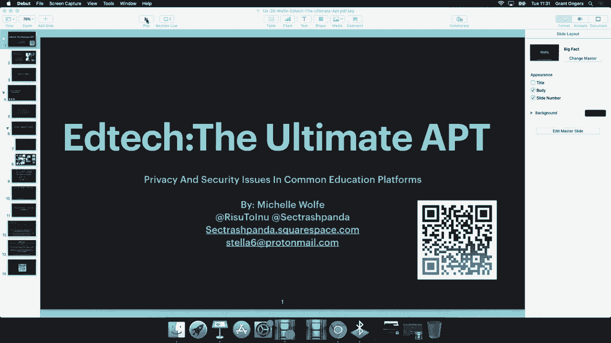
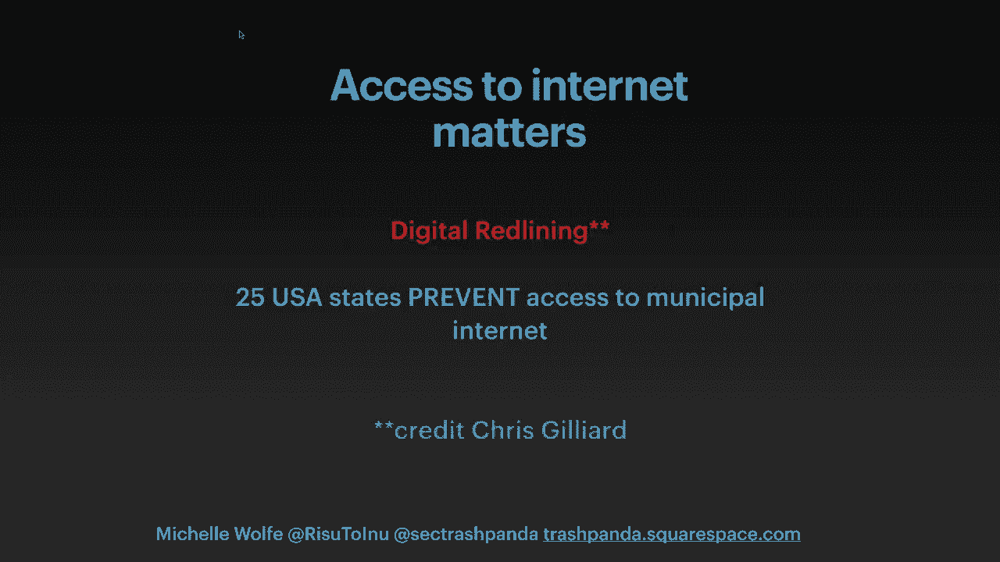
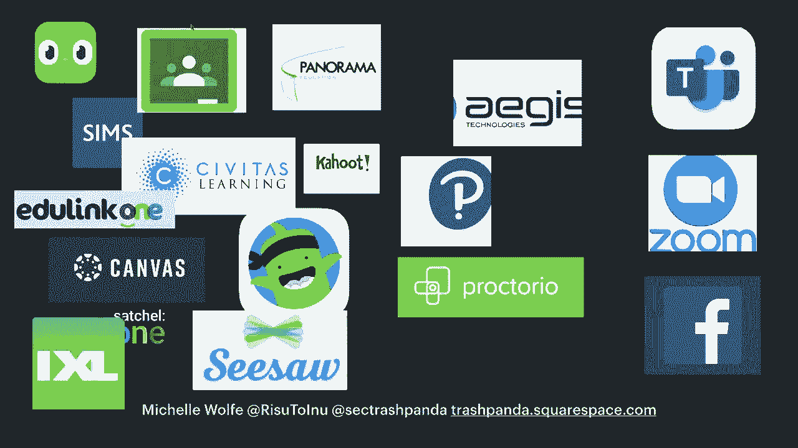
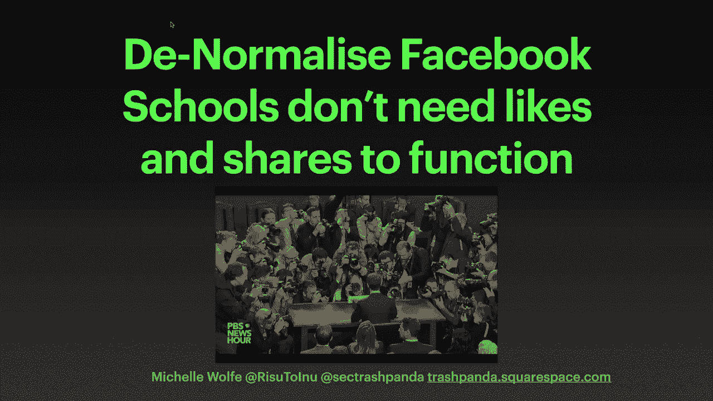
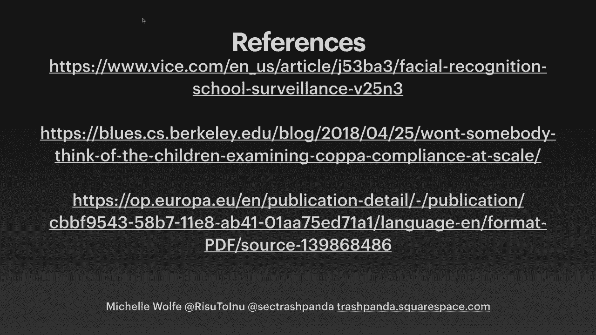
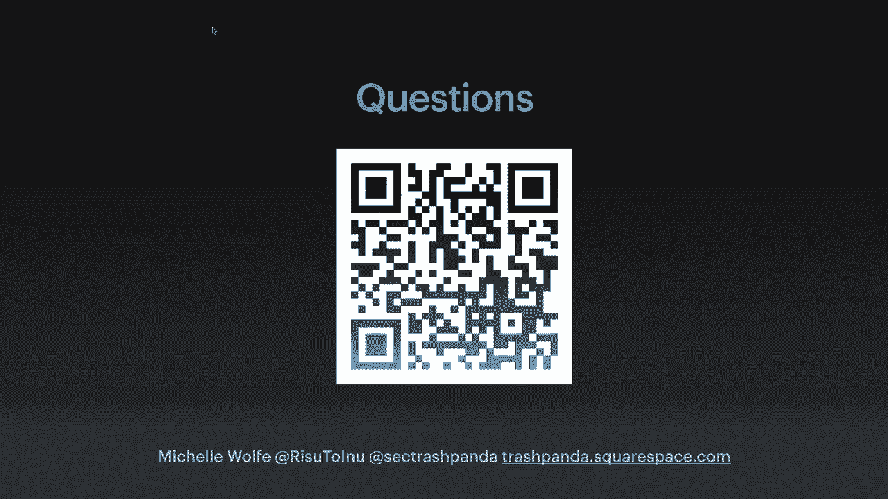

# P83：84 - EdTech - The Ultimate APT - 坤坤武特 - BV1g5411K7fe

 Good afternoon。 I'm Michelle and I'm really delighted to have this opportunity to talk to you about EDTech。

 the ultimate APT。 If during the talk you have any questions or you wish to offer any collaboration because we do really。

 really want people to come and help us work on the security and privacy issues that we're going to talk about now。

 please do a message or email me and we're really happy to talk to you and collaborate。

 The main aim of this talk， hopefully for the audience， whoever you are。

 whether you're working on or with EDTech platforms or whether you're an interested party as a parent or a student or somebody who knows what somebody who is。

 then hopefully this talk will give you the information that you need to understand what the key privacy and security issues are around EDTech and there are quite a few。

 And how you can help， how you can ask the right questions and how you can。

 when you're in the rooms where things are being， on boarded or planned or developed。

 how you can ask those key questions and it's really important to do so。 Also。

 what I really want to say before I start is that I'm not at any point saying that technology is bad。

 I love it。 As somebody who's worked in education for a long time。

 we have seen how EDTech has really increased our accessibility and our inclusion and particularly now with the pandemic we've seen the need for remote learning and online education。

 online learning。 When I did this CFP， I didn't quite realise how relevant it would become。

 So I'm glad for that， it's made this talk a little bit more relevant， hopefully and useful for you。

 but it is a really pressing issue。 We do have a number of issues that we need to resolve and we need to be aware of and I don't feel like we're having those conversations。

 So， just a little bit， one minute on me briefly is I have had around about 20 years on and off in and out of education within school。

 public sector and outside in security awareness， working with corporate organisations。

 I now work on digital resilience， specifically with young people and parents offering them privacy advice and how to stay safe online and set up their home networks。

 that kind of thing。 I'm a really strong harm reduction advocate and I really。

 really feel strongly about privacy。 I love privacy。

 I love the compliance side of things and I love technology as well as I've said。

 I think the blend of those， especially with an education is really something special and as long as we respect that and we act responsibly。

 I think they're really， really good things that we can do。 So。

 the first thing that I want to say is that data we say often that it's like gold or it's like oil。

 but those aren't really tangible things。 Most of us will never really touch data or gold。

 oil or gold， sorry。 When we say that it's like plasma or like blood。

 I think a lot of us can imagine it being extracted and we see how infinitely renewable that source is and it really is personal。

 it touches home。 The average student might start around the world in education around the age of three。

 they might go into preschool， they might start being tested。

 data is going to be taken on them and they're going to be profiled。 And there is a really。

 really rich resource in education of data and it's valuable and at any point it can be。

 there's constantly new people coming in and new ways that we can measure them and look at them and profile them。

 And I think we really need to be aware that when you have data it's like throwing a pebble into a pond。

 that's the way I think of it， that the ripples go out。

 And one of the key issues and the key harms that I think we need to really be aware of is looking at when something happens。

 so when a child goes in and their homework is put online or their achievement in class or their behaviour is put online or even something as simple as their home。

 or their own。 It's as simple as their home address or their special educational needs data。 Very。

 very simple things that you might not think are very important or very valuable。

 Those form a picture and it ripples out。 So a child who is in。

 who's given some homework who may not do it， who maybe gets some detention points。

 whose parents may not be engaged。 And we're measuring all of this by the apps that the schools might be using。

 This is what an appearance of that student。 And so we can measure from the individuals through to their family。

 down to their street， down to their town and even down to their geographical area。

 So at state level， at national level， at global level。

 we are making decisions just like decisions have been made and we know about this in insurance and things like that。

 And so， upon whether you should invest in certain areas or whether you should open a youth centre in there or whether your tutoring company is going to be able to earn a lot of money or whether it's going to be worth opening that summer camp in that area。

 And these are all things that really， really matter。 And they also matter to their individual。

 it's going to matter once they get to 16 or 18。 They'll probably have around a million data points on them。

 which will affect whether or not they're sent targeted mailings from certain colleges or whether or not even certain places might send them out information about internships。

 And I think people do really care about privacy。 I don't believe that privacy is ever dead。

 I do think consumers care about it， but I think it's extremely difficult to care about something that you don't know is being taken。

 And I think when people know that their data is being taken， they start to care a lot more。

 And leading on from this is the accountability and transparency that myself as somebody who works within an educational setting has to have。

 I have to be 100% transparent and accountable for every single thing that I do with the students within the rooms and with their data。

 I'm not even allowed to come in and talk to other schools or go and speak to the Girl Scouts or any other group of students anywhere else unless they've seen my criminal record check。

 And then as I can prove exactly what I want to do。

 why I want to do it and what the reason is that I want to do that for。

 And yet pretty much every week I speak to schools or parents who are just downloading or paying for or even getting apps and other software and things like that free even because they're nice and blinky and shiny and they come through the door and there is no accountability and transparency。

 Often there is once you start asking the questions。

 but you have to know whether or not you're going to ask the right questions。

 I was looking for some really， really nice information for your certain statistics and last week a really lovely study came out of Barclays。

 part of the Pet Symposium and it was done by some really wonderful scholars such as I meet Elizari and Joel Riddham。

 And they have found that I won't read the slide here but nearly 20% of apps that they studied within the US context that were targeted at children and these aren't just general apps。

 These are apps that are targeted at parents and schools had an SDK that wasn't copper compliant。

 So even though the SDK itself had a set up where privacy could be done by default and by design。

 those defaults and that design was not used。 And so very。

 very important things like location and things like that or contact details were being shared even just by downloading the app before you can even actually create an account or consent or opt in or opt out of anything。

 And that is wrong。 There is no accountability and there is no transparency there。

 And so when you're asking about these apps and when somebody comes in and says， "Hey。

 we'd like to work with you。 Hey， this is a really nice platform。 Hey， this is free。

" The question is to ask， "Well， what happens to my data？ Why do you need this？

" But we'll come back to this。 And again， the trust is really important。 I think this is a really。

 really critical thing that we need to understand and we need to accept that we are there as educators。

 as people who look after the children within educational context or even within clubs or anything that works with youth in loco parentes。

 So when they put their children as soon as they cross the school gates， they are us。

 They are our responsibility。 And if we say to a parent， download this， use this， they will trust it。

 If we say to colleagues， this is now the platform that you are going to use for your registration。

 for your behaviour， for your class seating plans。 For marking。

 we're going to use this to make sure all our students are going to be registered via this software。

 All of this， we assume that it's going to be trusted。 And let's remember as well that teachers。

 educators， nobody's stupid， but it's not like if you work at Netflix or Google where maybe you get your first week is onboarding and you get infinite power points and infinite training。

 And there's lots and lots of kind of compliance things and really the level of understanding that you're expected to have might be fairly high。

 We get things thrown into schools where quite a lot of schools， you know。

 you're barely even using email。 Or they're still using paper to do a lot of things。

 And yet you have these apps which are doing other things in which are very， very complex。

 And maybe people are assuming that they've been checked and they're completely safe。

 I was going to print this out for you and do a really nice graphic。

 But unfortunately because of the pandemic， ink and paper are quite hard to come by。

 So you'll just have to take my word for it。 The average terms and conditions for education apps。

 And that's whether you're a parent or whether you're a school looking through is around five pages。

 And nobody's going to read that。 Even I don't read all through it。

 So it's just not fair to be taking things into schools and kind of having them shared out when they're really。

 really not when they're very opaque， when they're not transparent and they're not responsibly done。

 It's a really， really big responsibility。 And me， myself and my role。

 I feel very responsible if I suggest if I endorse an app or some software or a company。

 I do that having thought about it very， very carefully and ask the right questions。

 Schools are catalysts for inequality as well。 I have just said that we are very accountable and transparent。

 But let's not lie。 Let's not pretend， especially within the current context of everything else that's going on in 2020。

 that everybody within schools is aware of their own bias， that everybody is anti-racist。

 that everybody is completely fair。 I've heard it said that high school days are the best days of your life。

 I think sometimes that's a little bit rose tinted。 But I think most of us。

 if we're really honest with ourselves， we'll say， well， remember that school is quite unfair。

 We'll remember maybe things that happen to us。 And I know that from speaking from parents。

 especially parents of marginalized groups， that they feel this inequality today， right now。

 they're injustices going on。 And so within any organisation where there is power。

 be it the police or anything， and teaching is the same。

 There are going to be opportunities for people to kind of abuse that power。

 I'm not trying to suggest that teachers and schools are evil， or that edtech is evil。

 But what I'm saying is we have to be aware that we're not unbe mindful。

 that we're not compounding layers of inequality and injustice via technology。

 The other thing we need to be aware of， and this is something that Chris Gilliard has。

 or hyper-visible on Twitter， has done quite a lot of work on。

 He coined the phrase "digital redlining"， which is we're aware of what redlining is within the financial services。

 But redlining， particularly， and especially in the USA。

 there are around 25 states where you cannot get municipal internet because of laws that were passed to prevent that。

 And those are to do that entirely to do with corporate interests。

 And if you listen to podcasts like the 1619 podcast and others。

 you'll find out just the history of that and where it comes from。

 And so when we are talking about the ripple effects of an individual's data being used and interpreted。

 let's not forget that just before measuring engagement or whether or not homework was done。

 not only does that assume that the platform itself was working。

 and will come to this later on as well， when they don't always work。

 it also assumes that everybody has a fair access to that technology。

 If the student is sharing a device and often just one mobile device and it's often Android and a lot of platforms only work with iOS or it's a little bit。

 it's not always equal and level， they might be doing the work。 They might be super engaged。

 they might be super determined and really， really wants to get on。 That family might really。

 really care about the education of their child。 But if they can't get on to the internet。

 they don't have Wi-Fi， these are all other issues。 And we'll come on。

 we'll mention this again when we come on to talk about exam proctoring。

 So， here's the main part， now this is not an exhaustive list because it would probably run if I put every single edtech or education linked platform up here。

 we'd run to around 5 or 6 slides。 And certainly if I was to show you the third parties who some of these platforms work with。

 regardless of consent of users， we'd probably run into an hour talk and about 50 slides because often there are around 60 slides。

 And then there are around 200 third parties that these apps are sharing your information with。 Now。

 on the left hand side of the slide I've put the platforms which are pretty much all aimed at young people and schools。

 Not exclusively but pretty much， when they were designed they were designed with young people in mind。

 So perhaps they're a little bit more structured， a little bit， I'll say an inverted comma is safer。

 In the middle we are looking at the platforms which work with schools but also outside and notably often some of them with prisons。

 And on the right hand side we have the platforms where there was absolutely no desire or designed to go into education but particularly with the pandemic they have moved into education and there are issues with that too。

 So let me explain to you why particularly on the right hand side there are some problems we'll start there。

 So when you have， and I'm not going to bash Zoom， we're all aware of issues and things that are transpired。

 But the problem comes again with the accountability and the transparency and also you have to ask yourself why are people in education？

 Why are there so many of these platforms and these organisations？ Why are they in education？

 Because when I say I'm a teacher I've spent 20 or years in education。

 I'm sure there are two things you might have been thinking， wow。

 that her holidays are great and that's true but also， wow， she probably doesn't earn very much。

 If I say I work in software development or I'm an attorney you're probably going to think about stock vests and bonuses and high salaries。

 When you think about education we know that we don't go into it for the money。

 There is no money to be made if you are working within education。

 So I could earn a lot more if I went to work probably for one of these platforms。

 And so this is the key point here as well。 Where are they getting their money from？

 And it's the third party's a lot of the time。 Or it's from just demanding extra amounts of money from different institutions but I don't think they're getting that from the schools because even if you had a contract with every school in America which is highly unlikely。

 but even if you did you're not going to get hundreds of thousands out of those schools。

 So we need to ask why are you in here？ What's your motivation？

 And if you're giving us something for free in a year's time， in six months time。

 are you going to expect us to pay for that？ And I know this because I've worked outside of education but parallel and with nonprofits and other companies with America and within the UK。

 And I have seen how they will put things in for free and then after a year there will be a payment expected。

 I have also seen how we then， and this comes back to the trust again。

 I've walked into schools as a representative of a nonprofit or an organization that's working with a school and asked to speak to the principal because the paperwork hasn't been done properly and the principal hasn't even been aware that we were working with those students。

 And often we've worked across schools without the principal ever knowing that we had actual hardware in schools and that their students were talking often or working with outside people in other companies。

 Now happily， none of that's ever meant that anything really。

 really bad has happened but again with the trust。 If you go in and you say to teachers or education boards or local authorities "I'm coming in。

 I can do this for you"， there's a real responsibility there。

 You have to be really open and to do the best you can and I'm afraid that you leave educators and students and parents open to harm when you don't do it。

 when you just go in and think that you can walk in and do things。

 So for instance with teams or Zoom we've seen because they weren't originally specifically designed for schools that there were loopholes。

 there were issues and because it's kids， people will， it attracts the worst type of people。

 people will do whatever they can to try and do sure or call。 Or harm。

 And little things like teams for instance， if you set up teams and you work up， I don't know。

 soft bank or somewhere and you want to share your staff meeting just with your community or whatever else。

 that's fine。 But that doesn't work like that for schools。

 If a group of teachers save their minutes of their video of their meeting at the moment and they're not careful。

 that means the students and the students are not there。

 And the parents who have access to that portal can also see that meeting recorded。

 So there are little things that just don't work in the education world that do work for your corporate world。

 In the middle， I really， really want us to talk about this because this is one of the ways that you can help when we will look at this at the end of the talk shortly。

 Is the Proctoring software and the Surveillance software？

 We have a number of issues with biometrics in schools and biometrics basically have no legitimate place。

 It's not proportional。 It's not legitimate。 And that's the same for copper or GCPO or any of these other regulations or guidelines that we have or legislation。

 There is absolutely no reason why a child needs to have their biometrics taken。

 So whether it's your thumbprint or fingerprint to pay for your food in the canteen or whether it's now with a pandemic。

 your face scan to see if you belong in the building or your temperature or anything else like that。

 it doesn't belong。 I can understand why if you work for the FBI you might need to have your face scanned or your biometrics taken。

 To go into schools， no， it doesn't belong。 And again we have that position of trust that in low-coberentes schools and exams as well are rights of passage。

 We can't escape them even if you're homeschooled and we may well have a large amount of people who are homeschooled to avoid this kind of harm。

 When you need to go for Proctored exams you're still going to come up against this biometric or AI as well which is used and it's really harmful and again it compounds like I said with school being a catalyst for you。

 If you are marked as being somebody constantly who doesn't belong。

 if the facial recognition software and the temperature scan can't recognise your skin or it considers you when you're taking a Proctored exam to be doing something that's out of the ordinary。

 it will fail you。 And that's fine if you're an affluent family in Connecticut or California and you have an education system behind you or money behind you and you can and they say you failed this exam you have to appeal and you appeal that。

 You're probably going to be successful and you can probably do it again but I know myself and I think a lot of us are going to find this when we're going through Proctored exams。

 I had one very recently where the software started。

 I don't believe it was even Proctored and then it crashed and it took me two and a half hours to successfully log out and it's only because I had a personal connection of one of the companies that I was able to get a voucher to redo that exam within about three hours。

 Whereas if I'm somewhere where has it again with the red lining。

 if I'm somewhere that doesn't have reliable access to the internet。

 if I had to go to extreme lengths to get a quiet room and good internet。

 even if I paid to get that really solid internet to do that two hour exam or whatever else。

 That's really going to affect me， especially if I was supposed to take it to then get the internship to get the visa to get the scholarship or whatever else or to get the job。

 It really really affects people。 These are high stakes games。

 This isn't just a case of all I couldn't submit my homework， never mind or the platform didn't work。

 I will come to that。 Really one of the biggest things I would say is this is a real issue for us within education。

 The other side of things as well， I mentioned briefly with the red lining as well about how often these platforms don't work。

 We've had issues with Pearson and other lots of these other apps which are out where there's incorrect content。

 where things don't work， where you will set work for a group and actually half of them can't see it。

 That's probably okay if you're dealing with people in person。

 but when you're dealing with a massive course where you might have thousands of people。

 they might not all be able to reach you or you might not believe them。 Because for me。

 often as somebody who works with an education， I'll think that something has been said。

 that something is available， but I'll be told by parents and students that it's not the case。

 And again in tech we have this issue where we've pushed people away and people won't complain to us。

 I often say to parents and students， well did you complain， did you raise a ticket。

 did you flag it and they'll say， no I just bought a new device or I just don't use it。

 So people will feel stupid or they will replace a device rather than report a complaint or report an issue and that has really。

 really big ramifications further down the line。 Because no other developers aren't aware that there's the problem even if they are altruistic and want to help。

 Sorry， that's gone。

 Okay， very very quickly as well， I would like us to denormalise the use of Facebook。

 I really like this photo because it shows if you think of a student here instead of Mark。

 that's kind of like the student in front of all the data brokers and they're not even aware that they're watching。

 They're being watched。 But I'm not against as a harm reduction advocate having a Facebook presence as a landing page because it means people can find you and navigate to you。

 But we should not be pushing students and parents towards private Facebook groups or even towards creating an account on harmful platforms。

 So that's just to be honest， which also share their data。

 If you want a Facebook site for your school or the school that you work with， fine。

 but then make sure that the information is available free and that people can interact anonymously and confidentially rather than having to create an account just to access information that's really important。

 It's not equal。 And also it's not right because my daughter was told to create an account several times by her school so that she on Facebook so that she could access information for her year group。

 And she's only 12。 So that's below the terms and conditions of the age in the terms and conditions that Facebook suggests。

 How can I make a difference？ You ask why you ask how and you ask what for you say why do you need to why do we need this platform you say how are they going to be operating and you ask them what for what's it going to do for us and how long for。

 Where is the data going to go？ No is also a complete sentence。

 I want to opt out or I don't want to use this or we shouldn't be using biometrics。

 The use of biometrics in schools for instance for the like I've said for the cantines there should be other options as well。

 Nobody I've been all around man to view and I haven't ever。

 I think I've ever actually seen could be corrected on this but I think I've ever seen anybody even in Google use a biometric to pay for their to use their food。

 But we are schools to do it。 That's not fair for those people who are working outside of care banking who maybe have an immigration status that means that they're not able to access that。

 So if you're going to do that then you should have another system。

 I understand the need for cashless within the pandemic but really biometrics。

 proctoring all of these kind of things。 No， we need to say no and we need to do it now。

 We also need to involve educators in every single decision and every single development。

 That's just not happening。 It's really really surprising to me when I hear Pete and it's lovely when I hear people say we're going to work with educators。

 We're going to talk to people but that shouldn't just mean people who've gone through the Apple or Google educator badge system which actually doesn't talk about privacy or security at all。

 All it does is ask you if you can use Google slides and things like that。

 Not denigrating it is a level or a badge but I'm saying that they don't talk about the things or address the things that we really need to be looking at。

 And for the children I get very suspicious and worried when I hear this because I've heard even in the UK the NSPCC say this and then they start talking about end to end encryption being really bad。

 It's not spelled surveillance。 We should not put police style software or platforms or anything into education。

 It just doesn't belong。 For the children means we care for them， we look after them。

 we look after their data and we educate them and one of the biggest things we can do is the digital resilience staff is teaching them about their rights。

 It's teaching them about what's known about them and how they can opt in or opt out。

 And it's teaching them that kind of resilience。 It's not teaching them to go into schools where they're going to be bullied and surveyed in buildings that basically look a lot like prisons and。

 how they might have facial recognition， biometrics to get in the building or pay for something as basic human writers food or water and where they then might have to take exams where they will have to wait five to seven days for AI to go through that recording of that exam and decide whether or not they behaved adequately。

 And let's not forget as well， looking around a room with a prop during software isn't just to see if you've got note cards or anything else it's also to see the kind of things you've got on your walls。

 It's to see who else might be in that room with you。

 There's a lot of information that you can get on somebody's bedroom or lounge or the room that they're in and that's just something we need to protect everybody from and I really。

 really feel strongly about this。 These are just a few references as well that I hope you'll find useful。

 The QR code that was on the front slide is here as well where there'll be a transcript of the talk and also links to further resources that I also update fairly regularly。

 Thank you and if you have any questions I'd love to answer them。

