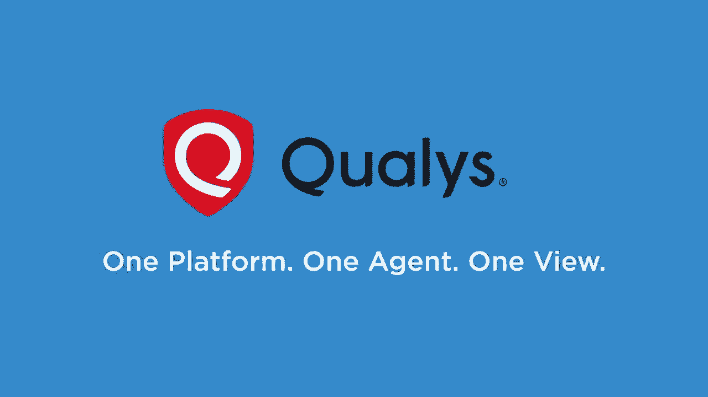
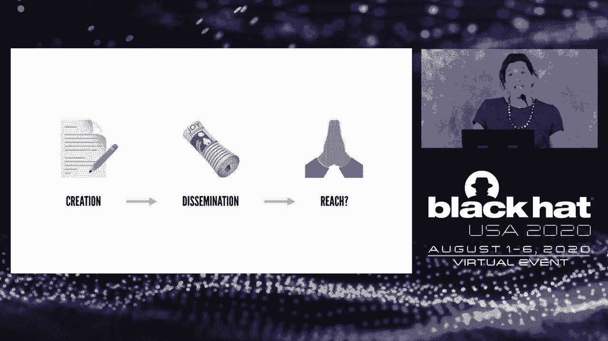
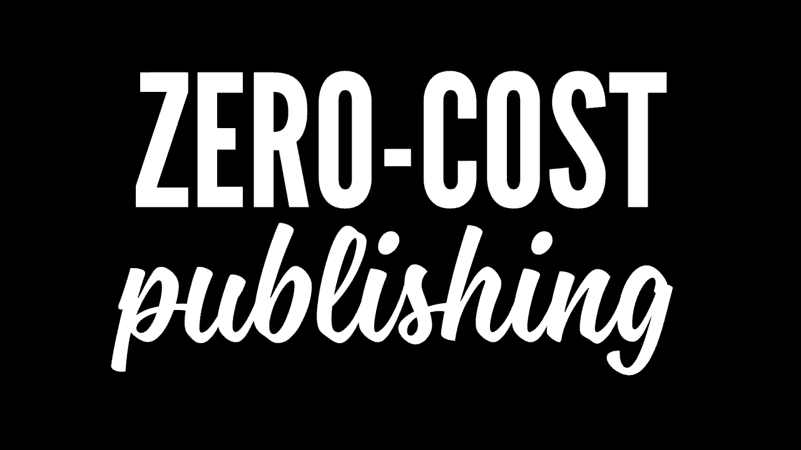
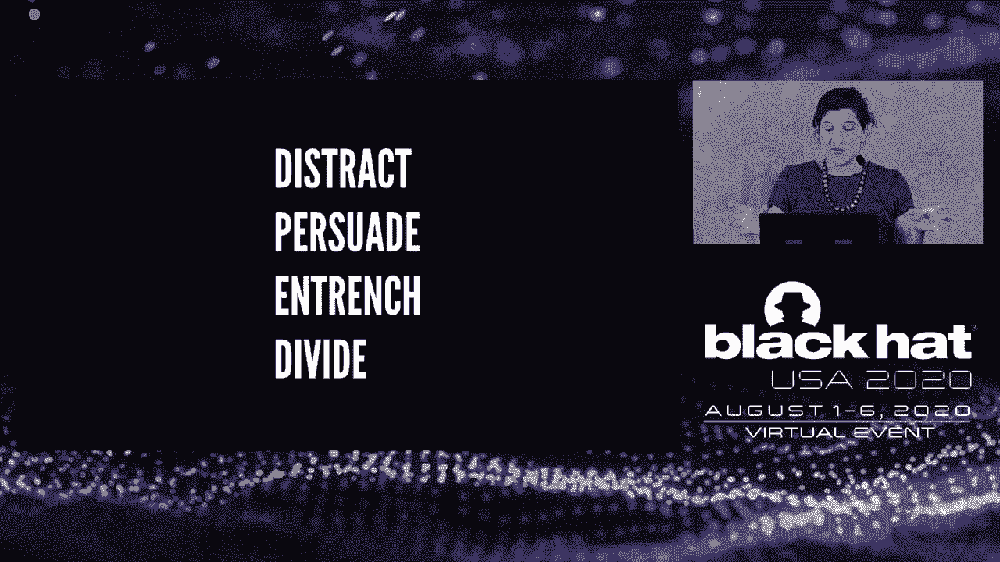
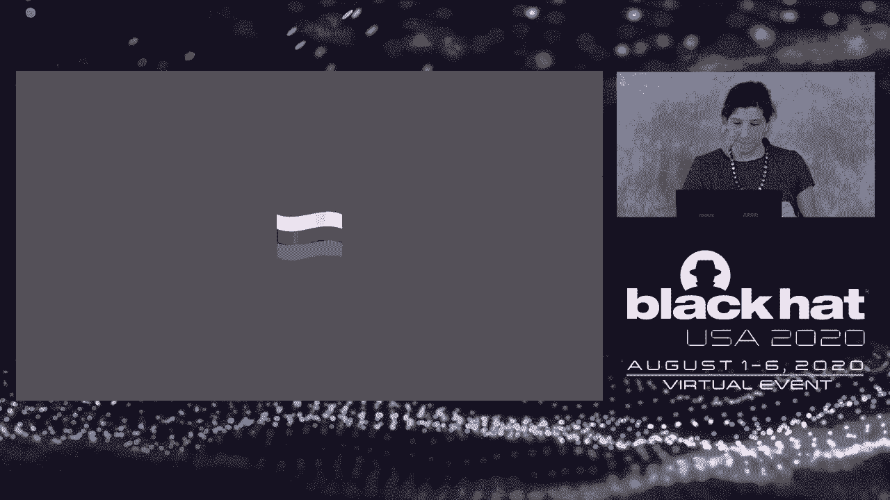
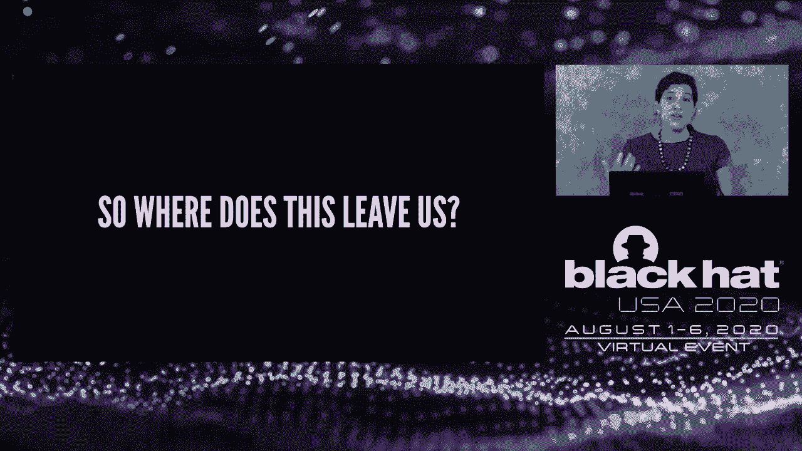

# 【转载】Black Hat USA 2020 会议视频 - P86：87 - Hacking Public Opinion - 坤坤武特 - BV1g5411K7fe

 In 1999， we launched the first-ever SAS security solution。 Since then。

 we've been diligently expanding our cloud platform， one IT， security， and compliance app at a time。

 The result。 One integrated cloud-based platform for IT， security， and operations。 Today。

 we extend the unifying power of our cloud platform to EDR。 We hope you'll give us a look。 [MUSIC]。

 Welcome back to Black Hat。 Our program will commence shortly with some opening remarks from Jeff Moss。

 followed by our keynote speaker， Renee Derista。 Black Hat would not be possible without the support of so many people。

 especially this year as we have all been impacted by this global pandemic。

 and have had to rethink our entire event in a virtual format。

 To our sponsors who have followed us into the virtual realm， we thank you for your support。

 To our Black Hat review boards for our trainings， briefings， arsenal， and CISO Summit programs。

 we thank you for your tireless effort in building this program。 To all of our speakers。

 for their eagerness to embrace the online format， we thank you。 To our partners。

 and of course to my own Black Hat team who have worked some very long days these past few months。

 I offer my sincere appreciation。 So I'm housekeeping before we begin。

 Be sure to download your copy of Cyber Threats in Turbulent Times。

 a report we just published from the annual Black Hat Attendee Survey。

 The survey and report were developed by our colleagues at Dark Reading。

 and is available for download in the Dark Reading booth in the Business Hall。

 If you would like more market research， I invite you to visit Omnia。

 our newly branded research and consulting business who are also available in the Business Hall。

 As we kick off today's program， I would like to thank all of you for attending Black Hat this year。

 and remind you that the same content will be available to you on demand for 30 days in the virtual event platform。

 We encourage you to come back and visit the content often and at your own pace。

 It's now my pleasure to welcome back the Dark Tangent， Jeff Moss。 Welcome back。

 It's day two of Black Hat Briefings， USA Virtual Event。 Okay， yesterday we heard from Matt Blaise。

 keynote around election integrity。 Today it's going to be hearing about misinformation with Renee de Resta。

 So everybody has a different opinion on what disinformation is。

 Some people refer to it as information operations。 Some people it's cognitive warfare。

 But whatever it is， there's not enough actual research being developed and studied to inform policymakers to tell us what to do about it。

 So this one social media company thinks they found a solution。

 Another one thinks they'll label fake news。 Another one thinks they'll ignore fake news and let the wisdom of the crowd tag the news and fix it for us。

 Everybody has a different approach。 And that's exciting because we can test a lot of different hypotheses。

 but we don't actually have enough academic rigorous work being done。

 That's why for me it's pretty exciting to introduce Renee de Resta。

 who is doing that work at Stanford， is part of the internet observatory trying to determine what works and what doesn't。

 how social media platforms are influenced and by what kind of narratives。

 And so I'm going to introduce you to her impressive resume and then we're going to kick it off with a day two keynote。

 All right。 Renee de Resta is the research manager at the Stanford internet observatory。

 A cross disciplinary program of research， teaching and policy engagement in the study of abuse of current information technologies。

 Renee investigates the spread of narratives across social and media networks with an interest in understanding how platform design and economic incentives intersect and user behaviors with crowd dynamics。

 Renee is advised Congress， state department， other academic civic and business organizations on these matters。

 She contributes to both Wired and the Atlantic。 And in 2019 she was the Truman National Security Project Senior Fellow。

 A 2019 Mozilla Fellow in media misinformation and trust。

 In 2017 the Presidential Leader Scholar and also at the Council on Foreign Relations as a term member。

 So with that， I'd like to introduce you to Renee。 Hi。

 I am honored to be joining you virtually today。

 My name is Renee de Resta。 I am the research manager at Stanford internet observatory。

 At SIO we study the abuse of current information technologies with a focus on social media。

 And today I'm going to talk about the evolution of modern day information operations。

 So influence activities executed by state actors in service to geopolitical goals。

 And I'm going to discuss the systems and the tactics involved because information operations increasingly involve the full spectrum of overt to covert propaganda。

 mass media as well as social media， age and influence activities and at times network infiltration。

 So I'm going to start off with a few definitions。 First we'll go with misinformation。

 So this is something that's in the news a lot lately， particularly in the context of COVID-19。

 It's information that's inadvertently wrong。 And people are usually sharing it because they want to inform their communities。

 They see it as kind of altruistic。 They're helping people understand what's going on in the world。

 even if the information is inadvertently wrong。 But disinformation is information that's deliberately misleading。

 So the person who's sharing it has the intent to influence and the intent to deceive。

 They know the information is wrong。 They know the information is misleading or malign or not coming from the source they're claiming it comes from。

 but they're sharing it anyway。 And then there's propaganda。

 So this is a term that carries a lot of weight。 It's very loaded。 Originally when it was first。

 kind of first incarnations of the term， it was not a pejorative。 It's come to be seen that way。

 But I'm going to use it to describe information with an agenda。

 Information where the specifics of the agenda varies。

 but the intent of the communication is to persuade someone or to distract them or to make them take an action or feel a certain way。

 Propaganda is not always factually inaccurate。 It's not always deceptive。

 And we're going to discuss that a little bit in this talk。 And then finally， agents of influence。

 So this is somebody who works to influence an audience and unbeknownst to that audience。

 they're beholden to somebody else。 So they're operating in service to a powerful figure。

 an intelligence agency， a state government。 And so this is information and persuasion in service to an agenda。

 And then the last thing that we're going to talk about is network infiltration。

 which I don't think I need to define for this audience。

 So propaganda disinformation using false identities to influence communities。

 These are all very old phenomenon。 One popular term describing their strategic use， active measures。

 comes from the Cold War。 But the process of shaping public opinion by creating propaganda。

 distributing it in the media， spreading it via peer-to-peer transmission can actually be traced back to the emergence of the printing press。

 So we can think of how information reaches audiences as kind of a staged process。

 There is the creation phase。 Somebody produces the content。 There is the dissemination phase。

 Somebody kind of puts the content out into the world。 In our olden days era of the printing press。

 the last kind of stage was really hope。 Hope that it reached somebody。

 The dissemination phase during the printing press era was literally handing off pamphlets to people in bars and pubs。

 So this is where you start to see that dissemination piece being absolutely critical to actually getting a message to propagate and spread。

 So the process was very slow back in the era of print media。 With the era of broadcast media。

 like television and radio， what you start to see is increases in the size of the audience。

 You can reach a lot more people with a lot less effort。 But ultimately the process was the same。

 There were significant gatekeepers both financially and in terms of editorial control。

 But then we skip ahead to the era of the internet。

 In the early 2000s we get to the dawn of the blogosphere， maybe late 1990s actually。

 So we get to the emergence of a technological system designed for the effortless creation of content。

 So blogs offer zero cost publishing。 Anybody can set one up。

 There is basically no hosting costs if you are using a service like GeoCities or Blogger。

 Everybody writes what they want to。 But ultimately the blogosphere is still very decentralized。

 And if you had one， like I did， you probably know that almost nobody ever writes your stuff。

 But a few years after that we hit the era of the social networks， the social platforms。

 And these sites start out as ways for people to just kind of connect with their immediate friends。

 their immediate social circle。 But in a way they begin to kind of solve distribution。

 So all of a sudden I have platforms that are inviting me to share my thoughts and there is a built in audience。

 Instead of me writing a blog post and emailing it out to people。

 instead what happens is I write a really short snippet， "How are you feeling today？

 What are you thinking about？ These are the prompts。"。

 And then the platform automatically pushes it out to the people who follow me or who are in my friend circle。

 So the feeds are designed for engagement。 The platforms want to keep people online。

 And so they built in these tools gradually， but over the first few years of social platform development。

 you start to see content creation get even easier， the barriers to entry reducing even more。

 and they begin to solve that dissemination piece。 People become an integral part of the process of pushing content along。

 We begin to see the idea of virality。 I hit the share button。

 And all of a sudden all of the tens of thousands of people potentially in various kind of cascades through my social network see the stuff that I care about。

 So we wind up at this point with a glut of material。 We've eliminated the editorial gatekeepers。

 eliminated the cost barriers to entry。 And so what we begin to have is algorithmic curation。

 Algorithms surface and recommend and rate content， they rank it。

 and then they help amplify and disseminate it。 So this becomes a very kind of tech mediated process that ensures that information hits large numbers of people。

 So in summary， we have individual platforms， each with a large standing audience。

 precision targeting， and then algorithms that play a significant role in deciding what we see。

 And those algorithms of course are gameable， which we're going to talk about as this talk progresses。

 So each individual platform kind of has those three criteria。 And then in aggregate。

 the platforms comprise a social media communication ecosystem。

 So each of the platforms up here on my slide has some variation in what kind of content it specializes in。

 how it's disseminated。 But ultimately this collection of apps and platforms together comprises a very low cost convenient way to reach massive numbers of people at a global scale。

 And it's the structure of this system。 The features， the policies。

 the design that set the rules of engagement for modern influence。 So anyone， politicians， marketers。

 activists can use this system。 The ways that we exert influence。

 the forms that propaganda takes are determined by the information environment of the day。

 That's been true for centuries。 But as we move from just the idea of influence to the idea of information operations specifically。

 again， operations conducted by state actors in service to geopolitical goals。

 what you start to see is it goes from shaping public opinion to what we're going to call hacking public opinion。

 Using manipulative misleading tactics to kind of commandeer that ecosystem that I've described。

 those technological processes I've described， and put to use kind of achieving the information aims of a particular state actor。

 So as early as 2004， state actors begin to realize that this infrastructure is at their disposal as well。

 and that they can turn the social web into a vast propaganda and disinformation machine。

 They can use fake accounts。 So fake accounts are the kind of modern incarnation of agents of influence。

 They can game the algorithms。 They can create front media properties that actively mislead the public。

 which is another very， very old tactic that suddenly become effortless to execute。

 And they can do all of this quickly and cheaply because they're ultimately using the system as it was designed to be used。

 So the campaigns that state actors run generally take one of four forms。 We see distraction。

 which is trying to make a target audience pay attention to something else。 We see persuasion。

 which is trying to convince people to believe a certain fact or feel a certain way。

 We see entrenchment。 This is where there's the creation of groups dedicated to particular types of identities in particular。

 where what you start to see is entrenching people in a position， entrenching people in an identity。

 and then divide using that entrenchment to kind of cast。

 to kind of highlight divisions between different groups of people。

 amplifying existing social fishers。

 So if we were to go back to our creation dissemination kind of hope model from the era of the printing press and update it for the modern era of the Internet。

 now what we see in information operations is state actors that create personas。 They create content。

 They seed that content to social media。 They seed it to an initial standing target audience。

 They coordinate amplification usually through something like algorithmic manipulation or kind of mass posting in a variety of different groups at one time。

 But then what happens is they get organic shares。 So this is where as much as early conversations about Russia focused on the ads。

 only $100，000 of ads， the real lift there didn't come from the ads at all。

 It came from creating content that was compelling to people and then people serving as the transmission vector。

 So this peer-to-peer kind of participatory propaganda model that pushes this content out because it resonates with people。

 And then after a certain kind of critical mass of people is talking about a topic。

 you'll often see mass media pickup。 And so we're going to talk about that as well。

 One of the things that we do at Stanford Internet Observatory is we try to understand processes like this almost in a kind of like a staged path that certain actors follow consistently。

 So we can think about it almost like a kill chain。

 Like where could you intervene at the various steps in this process？

 If you wanted to stop people from creating personas。

 how would you think about what that creation process looks like or what those personas look like and think about ways to intercede at that point？

 But ultimately there is a lot more than simply social media at work here。 So that last hop。

 that hop from organic shares to broadcast media to mass media pickup is actually critically important。

 The relationship between broadcast media and I'm including print in that。

 There's no good term for everything but social。 But in a way there probably shouldn't be， right？

 So mass media does include social media。 And so what we want to think about as we talk about full spectrum influence operations or full spectrum information operations is the way in which the broadcast portion of a state's propaganda apparatus feeds into the social media operation。

 And then the ways that social media offers significant kind of options for agents of influence and persona based persuasion。

 So we're going to switch here from theory to case studies and just kind of walk through what that looks like。

 So let's start with China。 China is emerging as a powerful player in the information operations arena。

 It's a lot of conversation about what China is doing with information operations right now。

 Those of you in the audience are already familiar with their network infiltration capabilities。

 which again they split between the PLA's and military entities and private contractors。

 There are some similar splits in how they think about their propaganda apparatus。

 So when we talk about that broadcast or mass media capability。

 China has decades of experience in both overt and covert narrative management。

 The government has prioritized it for decades， particularly inward looking。

 So a lot of China's capabilities were developed for the purpose of controlling information within China。

 And so what we're seeing now is how they're taking those inward facing capabilities and beginning to expand outward。

 beginning to kind of deploy those same tactics in areas and regions where they want to have influence outside of their borders。

 So when we talk about media based propaganda， there's a metaphor that researchers like to use of a monochromatic spectrum。

 And that monochromatic spectrum corresponds to how attributable the content is。

 So on the left over here we have overt content like China daily or the people's daily。

 The CCP spends billions of dollars on dozens and dozens of these newspapers and broadcast channels。

 They are regionalized for areas of interest。 They are language localized， but they are very。

 very obviously attributable to the Chinese Communist Party。

 So there's no concealment of where that information is coming from or what it is。

 So this is what we call white propaganda sometimes。

 But then we get into that gray area in the middle。

 And for China this takes the form of things like content farms。

 which are websites that echo CCP talking points， with kind of uncanny frequency。

 or they push out fake political stories about rivals。 Rival government ministers。

 people who have in some way Taiwanese politicians who have displeased Beijing。

 But it's really hard to tell whether they're actually attributable as mouthpieces of the state。

 Sometimes digging shows that there's a financial relationship or ties between the owner of the site and the government minister。

 But the attributability of the message remains concealed and that's our kind of gray area。

 And then finally there's the wholly unattributable dark part of the spectrum。

 which usually involves very active misdirection。 So this is where you hear the word "inauthentic" being tossed around。

 So the example I picked here it says "dream news" that site doesn't appear to exist。

 It existed largely as a Twitter property to talk about the Hong Kong protesters and ultimately Twitter attributed it to the CCP and took down the account。

 The overall goal of that entire broadcast apparatus is to tell China story well。

 So referring back to the distract， persuade and trench divide framework。

 China's primarily concerned with persuasion， sometimes distraction。

 And when we think about the intersection of that overt broadcast propaganda ecosystem。

 and then even the kind of more subversive gray and black media kind of properties on the far side of that monochromatic spectrum。

 there's an intersection with social media。 So the overt propaganda properties。

 even though Facebook is banned in China， all have absolutely massive Facebook pages。

 So CGTN for example has 106。7 million followers。 So since these platforms are banned in China。

 this is quite clearly intended for audiences outside of China。

 So this is how we think about full spectrum information operations in the form of using these powerful broadcast tools on social media。

 And they persist in trying to grow their follower accounts， trying to amass influence globally。

 And you can go and you can look at the ads that they run and you can see where they're targeting the ads and so you can see the amassing of audiences beyond the borders using the ad tools that Facebook makes available to them。

 So they're running ads to kind of boost their content to the rest of the world。

 But beyond the expansion into over social media， there's also the kind of dark spectrum of social media as well。

 So CCP has expanded to beginning to incorporate troll accounts and fake cutout media properties。

 So this is in a way an outgrowth of a strategy that they've deployed inwardly since 2004。

 There's the 50 cent party or the willmow， the kind of fake commenter army used to distract within China。

 And we see that tactic being ported to Facebook and Twitter。 So the Hong Kong protests。

 these are all， this is the images on the slide are collateral from Twitter takedown and Facebook takedown in August and September of 2019。

 So this is a attributable subversive kind of black propaganda from deployed on social media in the form of these fake accounts。

 So Hong Kong protests were the first topic on which Western social media platforms concretely attributed activity to the CCP。

 The Hong Kong protests attracted worldwide attention。

 And what you began to see was as Western media and others began to talk about them。

 these Twitter accounts would kind of come out of the woodwork to respond to the journalists to tell them no they had it wrong。

 Or regular people who expressed sympathy or solidarity with the Hong Kong protesters would be del used by these accounts telling them that high profile incidents。

 you know， kind of clashes between protesters and police were being misreported by Western media pretending to be local people on the ground in Hong Kong who just wanted to set the record straight。

 So after the first Twitter takedown in August and September of 2019。

 those of us who researched the operations looked at the accounts were given a second data set in June of 2020。

 so just about a month ago。 And the image on screen here is something that we produced where we looked at the topics that the accounts were talking about when the accounts were created。

 So what you started to see was the immediate reconstituting of the accounts。

 So they lost their Hong Kong bots， so to speak， Hong Kong personas in the early takedown。

 And immediately the creation dates of the accounts that came down in June 2020 date back to 2019。

 a lot of them were created in 2019。 So what we start to see is again。

 the pink accounts are talking about Hong Kong。 The green accounts are attacking a dissonant。

 a glowing way。 The kind of dark blue and yellow， as you see appear off to the side。

 that's around the time of the Taiwan election。

 And then the last group of accounts that are created and kind of turned on to talk about topics of interest to China。

 talk about COVID-19。 So again， what we see here is a commitment to turning on these accounts。

 They're not developed over kind of a long time horizon with a lot of forethought。

 They're very much a reaction to a precipitating crisis that the government feels it has to respond to or a topic of interest that it feels that it needs to address。

 And so the COVID crisis， these accounts are created in January of 2020。

 The pandemic has been a domestic and international crisis for China。

 It was accused of cover-ups domestically， of mishandling the pandemic。

 both domestically and internationally。 And there were， of course。

 claims that it was culpable for a global disaster。

 So it began this full-court press to kind of hack public opinion with regard to COVID-19 narratives。

 And what we see is the entirety of the broadcast ecosystem， the social ecosystem。

 all of the overt and covert means at its disposal， put to use。

 pushing out a particular narrative about coronavirus。 So we see entrenched， persuade， distract。

 divide。 You know， all of the methods kind of put to work across the entire spectrum here。

 So we have within China -- whoops -- within China。

 we have the sort of censorship of individuals and information channels to control the domestic perception。

 So in the center there， you see one of the whistleblower doctors who then， unfortunately。

 went on to pass away from the virus。 You see massive English-language state media pages writing posts about the World Health Organization praising China's response。

 Those posts were then boosted on Facebook using Facebook's ad tools to ensure that they reached large global audiences。

 There were overt attributable social media accounts belonging to Chinese diplomats。

 Minister of Foreign Affairs down there。 You see -- you know。

 they're using kind of -- they flip back and forth between funny things that are likely to be retweeted because they're engaging。

 There's -- they're tweeting conspiracy theories there。

 linking to kind of media sites like global research or a kind of known conspiracy theory site。

 They're being a lot more aggressive in their communications。

 And then what you'll see a lot of the time is when these prominent figures tweet。

 the kind of bot accounts kind of come out of the woodwork， to retweet and amplify。

 So that's an interesting dynamic that happens。 Where does the lift come from？ Again。

 if you make -- if you create a sufficient amount of lift using inauthentic accounts。

 it will oftentimes create this indication that a lot of people have been talking about or retweeting this -- you know。

 retweeting this content that makes real people begin to pay attention。

 And then real people begin to retweet。 And that's how you kind of cross that chasm from inauthentic into authentic and get additional lift。

 And then， of course， from the prior slide， covert Twitter accounts were revealed to have praised China's pandemic response。

 But now I want to caveat something。 So the June data set， June 2020 takedown， consisted of 23。

800 followers -- sorry， 23，800 accounts。 But 92% of those accounts had less than 10 followers。

 That's -- that's pretty terrible。 The accounts tweeted about 350，000 times。

 And the average engagement per tweet was 。81。 So most of the tweets didn't even have a single like。

 retweet or favorite。 The max tweet engagement was 3，700。 So across the entirety of this， you know。

 kind of almost six to nine month operation， they really didn't do a very good job at actually getting real people to pick up their content and amplify it。

 This is relatively terrible engagement。 So one of the reasons for that。

 the graph I've got up here is a retweet ring。 So the six accounts in the center are kind of irrelevant to the point of this。

 But what you see around there are the names of the accounts that are retweeting them。

 And as we look at the dynamics around the retweets。

 you see accounts that were all created on the same day at the same time。

 They use blocks of related user names， stock profile photos。

 primitive biographies if they even have a biography。 So these are barely agents of influence。

 This is actually kind of shockingly poor。 And the point is， while China excels in certain areas。

 you know， the broadcast propaganda audiences are massive。

 the engagement is actually not as significant as you would think。

 So press frequently compares Chinese activities to the Russia activities。

 But this kind of sloppy social media activity actually more closely mirrors Saudi Arabia。

 which kind of pumps out low quality bot content when it needs to distract somebody。

 like around the time of the murder of Jamal Khashoggi。

 So how do we think about this as we develop our understanding of modern information operations？

 China is a well-resourced state adversary。 It has developed significant capabilities in certain parts of the ecosystem。

 The respawn of the accounts indicates that this is a strategy that it is now committed to。

 and will likely be trying to get better at。 They're updating their capabilities。

 They're modernizing tactics that they've used for decades to fit the modern information environment。

 But at the same time， we shouldn't overstate the impact of the efforts。

 A lot of times you'll see kind of breathless press coverage talking up。

 some metric from the operation。 300，000 accounts or 30，000 tweets， you know， millions of tweets。

 That kind of breathless kind of pumping up elevating it to something it wasn't。

 really in some ways helps the adversary。 It makes them seem a lot more powerful than they actually are。

 So what we want to do as we think about this is info sec professionals and information operations researchers。

 is recognize that we expect China to improve。 We should study the content。

 We should work on identifying the kind of TTPs that indicate that an operation is coming from China。

 But we have to remain clear headed about how impactful the activity actually was。

 And in the context of the Chinese operations that I've been discussing。

 the social media component really was in large part a failure。

 The press compares China to Russia though because Russia is at the moment kind of best in class for information operations。

 They've also demonstrated not only a commitment to full spectrum propaganda。

 but to far more sophisticated activities related to agents of influence to medium manipulation。

 And then ultimately to network infiltration as well。

 And so I want to talk about the ways in which Russia has managed not only to hack public opinion by kind of working the social ecosystem。

 but to hack public opinion by hacking public officials and institutions and using the information it obtains in information operations deployed on broadcast and social media。

 So we can go through that same process of looking at our kind of monochromatic spectrum and examining what Russia has in this regard。

 So they spend a fraction of the budget that China does on their state media properties。

 but they do have a full spectrum of narrative capabilities for outwardly focused communications。

 So over there on the left in the broadly attributable space we've got RT。 In the middle。

 this is a blog called OffGuardian or MicroPublication called OffGuardian。

 What's interesting about this is it's an astonishingly sympathetic publication。

 And the article that I've got up here terrorists are equipped with Western weapons in Syria is written by a journalist。

 purported journalist named Anna Junger from Inside Syria Media Center。 And as it turns out。

 Inside Syria Media Center is a GRU front on a Junger does not exist。

 but numerous of these properties would take and run content from Inside Syria Media Center kind of serving as a conduit for the information from this fake front operation to be laundered through to kind of real media properties with。

 you know， undissernable ties。 And then finally on the right we have the complete misdirection。

 This is a site called Black Matters US。 It was purportedly run by Black Lives Matters activists in the US。

 In reality， it was later attributed to internet trolls operating out of the internet research agency in St。

 Petersburg。 So again， the kind of dark side of that broadcast propaganda spectrum。

 This website that theoretically looks like it's run by American activists in reality run by a Russian contractor。

 Here again， here's our state media outlets as they appear on Facebook。 The top one is RT Arabic。

 The second is RTS Banyol。 Third is RT English， just the kind of main property。 Interestingly。

 you do see， you know， you can kind of， first you'll notice it's a fraction of the size of the hundred and。

 you know， hundred and something million that we see from the Chinese pages。 But interestingly。

 actually the engagement on the Russian sites is an order of magnitude higher than the engagement on the Chinese sites。

 And so， sorry， on the Chinese Facebook pages。 What we see from RT is they have far more engaged audiences。

 particularly on YouTube。 And there's this range of subsidiaries that are really dedicated to using social media to reach very specific regional。

 ideological and demographic subsets。 So in the now， for example。

 the fourth one on that list really prioritizes video creation for young millennials。

 particularly on the left。 And so they produce content that regularly goes viral within those targeted audiences。

 So this is the idea of you don't want to look at a metric just like follower count and assume that it's having significant impact。

 You really have to do a lot more research into understanding is the content resonating within the targets fear and is the targets fear。

 then in turn sharing out to their own communities。

 Because that's how the information is actually effectively spread。

 So on the covert side of social media， there's the Internet Research Agency。

 So Russia uses the plausible deniability of contractor agencies， organizations like the IRA。

 which are not directly connected to the Russian government。

 They afford a kind of plausible deniability。 Well， we didn't tell them to do that。

 They're just patriotic trolls who go out and do it。 The IRA is a fascinating organization。

 So this is purely social first content。 The social media environment lends itself to certain formats of information。

 And one of the things that we kind of divide， you know。

 divide research along is narrative propaganda versus mimetic propaganda。 Is it a。

 is it information that requires someone to sit and read， which is less frequently shared？

 Or is it something like a meme where you can kind of capture the essence in about， you know。

 six words？ It makes somebody feel a certain way and they share it along because they think it's funny or ironic。

 Or it really kind of summarizes how they feel about a particular issue。 So here we see， again， 900。

000 engagements， 180，000 engagements on the Yosemite Sand meme。 And we see 720。

000 engagements on the meme of the veteran。 And what's interesting about this is as you look at the content。

 you see that it's very identity focused。 So it's really trying to entrench people into a particular。

 you know， they have a particular political opinion that they hold as a kind of deeply held belief。

 And this really kind of， the content is consistently reinforcing that identity。

 reinforcing that belief。 And so when you share it。

 you're sort of signaling membership in that group。

 And one of the ways that the IRA operated was by segmenting American society into these groups and creating content both on the left and on the right。

 So with the Chinese content， you see persuasion， you know。

 trying to tell the story of China and how good China is for the world。

 You don't see that happening in the Russians' subversive propaganda。 Or in the Russian memes。

 what you see instead is simply dividing the society of the adversary through this process of entrenchment and exploiting existing social fissures。

 So there's very different motivations， very different ways of carrying it out。 But ultimately。

 still using the social ecosystem to try to achieve this particular aim。

 But I want to get into beyond just the memes and the propaganda。

 the agent of influence model that we see happening here as well。

 So when you follow an internet research agency page， and maybe you leave a comment， you know。

 like this meme， comment on the meme， what you've just done there is you've given the person operating the page an indication that you're sympathetic to that point of view。

 And so what we saw as we did the research， you know。

 I led one of the teams doing the Senate Intelligence Committee research into the operation。

 targeting the US from 2014 to 2016。 What we saw over and over and over again were these kind of attempts to recruit。

 So how can they turn their audience into active participants on winning participants in the operation？

 And so you see this constant outreach， ways， you know。

 you see them really trying to develop a much deeper relationship with the audience than you would see from a normal broadcast type or even social media manipulation operation from any other adversary。

 So this kind of behavior is very unique。 This is how you modernize that process of agents of influence。

 And what the Mueller investigation team had also were the direct messages。

 And what you see in the direct messages is the operators of the pages offering financial resources and offering logistical support and really working to infiltrate the communities that they're targeting。

 Because if you can turn people into either unwitting content amplifiers or people who will actually go out and mobilize in the streets in support of an idea。

 that's a very powerful tool。 And that's the kind of thing that is increasingly hard to find。

 You don't see those signals of that aspect of the operation when you're just looking at the memes or looking at the engagement。

 That's the kind of thing that's happening behind the scenes that really were at this point reliant on platform companies that have visibility into those messages or other forms of outside investigation to try to provide leads to indicate that maybe this page isn't really what it seems。

 And then there's the kind of way that this intersects with Russian military intelligence。

 So the Internet Research Agency operation， that's the kind of social， societal。

 agent of influence model that's happening concurrently with a Hack and League operation that's been carried out by Russian military intelligence。

 And I want to describe a little bit about how the GRU operated。

 both on social platforms in agents of influence models and then in the Hack and League。

 the network infiltration piece。 So， excuse me。 So APT28， Fancy Bear。 Beginning in 2012。

 the GRU begins its own efforts to create fake Facebook pages in groups。

 And most of them were set up as the kind of dark propaganda pages。 A lot of fake media。

 a lot of fake think tanks。 They create these pages on Facebook。

 So this is several years before the official creation of the Internet Research Agency。

 Russian military intelligence is trying out this tactic。

 And what they do in the， in the network graph， each green dot is a fake persona and each pink dot is a place where they successfully placed content。

 So the green fake personas are all set up as journalists。 They all have Facebook profiles。

 They all have networks of fans on Twitter who are amplifying their content。

 And what they're doing is they're writing articles。

 mostly geopolitically focused in the early days of the operation。

 And they're sharing their content to their own sites where they're purportedly journalists for。

 so Inside Syria Media Center and these front media properties that Russia has set up。

 But then using the credential of being Inside Syria Media Center reporters。

 they in turn share the content to Western blogs and to regional blogs that have a wider audience。

 So this is how they're kind of doing this process of narrative laundering。

 The GRU did not have very much success in using this kind of narrative social media operation。

 And I think this is why you see the Internet Research Agency emerge with that kind of meme first。

 social first dynamic。 But what was interesting about the GRU attempt is that they are out there。

 again trying to do this initial emergence of this sort of full spectrum information operation。

 But then the one thing that they have， that none of the other actors that we've discussed have as far as this。

 you know， demonstrable commitment to full spectrum information operations。

 is they also go out and hack。 And so this is where information operations intersect with info sec very directly。

 So the Hack and League operations provide extraordinary collateral for driving the influence operations。

 The GRU goes and they hack a public official， public agency。

 They take that collateral and then that in turn is transmitted to their own personas。

 their own agents of influence， their kind of online fake personas。

 who try to communicate it to journalists。 This is the Guccifer model of distributing the Podesta emails。

 Then they also， the Internet Research Agency picks up the content， begins to turn it into memes。

 driving news cycles domestically and facilitating sharing within American audiences。

 And then you have RT and Sputnik and the overt propaganda properties that begin to report on the substance of the hack while denying who the hacker actually was。

 And so you see this process by which the entirety of all the kind of information manipulation tools are put to use simultaneously in service to one operation。

 one information operation。 And that's how you use the system kind of most effectively。 So again。

 the documents obtained in the hack are distributed across the entire spectrum of broadcast and social media。

 You see the subversive personas and agents of influence engage with the journalists。

 They pass them leaked materials， which are then amplified by the targeted country's own material。

 The stories trend on social。 And then the， you know， in this case。

 Russia's own propaganda apparatus begins to tell the story and to report on it on their own media and social media properties as well。

 So to summarize， well-resourced state adversaries will use all of the means at their disposal to execute information operations in service to geopolitical goals。

 And in the case of Russia in particular， what we see is the exploitation of divisions in our society using vulnerabilities in our information ecosystem。

 So because of the way the social information ecosystem that sort of peer-to-peer transmission mechanism works。

 the difficulty of finding agents of influence infiltrating groups。

 but the ease with which it can be done really lends itself to these operations。

 not only continuing as they are， but actually kind of increasing。

 in potency as more and more actors realize that this is a thing that can be done。

 So one question that's highly relevant right now is what does this mean for the US 2020 election？

 So I think there are four kind of significant things that we may see over the next few months。

 two of which are specifically related to that blend between info， second information operations。

 So again， Hack and Leak， it is inherently newsworthy， it will get coverage。

 the content will get pickup， it's a very effective tactic。

 and it really does change press cycles during campaigns。

 Then there's the risk of hacked voting machines。 There's indications from 2016 that that did happen。

 that various actors tried to do it even more than we previously thought。

 Even if not a single vote is changed， releasing the information claiming that you have successfully hacked the machine will cause havoc。

 Then there's what I've been describing， the infiltration of groups and the amplification of narratives。

 Again， what we're starting to see more and more is sophisticated information operation actors hiring locals or paying on winning locals to serve as conduits for their content。

 Or what they'll do is they'll simply amplify sensational narratives that are already trending on Twitter as political ideologues domestically use the same kind of gaming of algorithms to try to get their stuff trending。

 You can just kind of give it an extra boost。 But ultimately the goal will be to undermine confidence in the legitimacy of the election。

 When we talk about information operations， it's important to note that these personas and their materials resonate because of underlying existing societal divides。

 Because of legitimate grievances and polarization and because of low levels of trust in institutions and government。

 You can't hack a social system if the social system is resistant to the attack。

 And unfortunately ours at this point really is not。

 So this page here was one that I screen-shotted from an activist page on Facebook。

 And at the time this was 2018。 I wondered if he was somehow connected to the IRA because 40% of the content on the page was IRA memes。

 So I thought perhaps this was another IRA page。 But it turned out no。

 it was a real person and it was just that the message is really resonated。

 So as long as propaganda has existed， people have debated its impact。

 And we know that people form opinions and internalize memes based on repetition。

 particularly if they trust the source。 We know that false stories。

 things like operation Denver or sometimes operation infection， the idea that the CIA created AIDS。

 Those false stories are internalized by real people。

 They continue to spread long after the operation itself is， you know。

 the act of operations have ceased。 So we also know that malign actors continue to prioritize investment and propaganda in state media。

 But there's a lot for us kind of remaining to study。 So in the era of social media。

 we are more instrumented than ever before。 We can treat engagement data as a kind of proxy for seeing how far something spreads。

 We can quantify how much reach it gets。 We can quantify how many likes it gets versus angry faces。

 We can see how people are reacting to this stuff。 But what we can't really see is whether it changed hearts or minds。

 We can tell you that it jumped from community X into community Y。

 We can map a lot of that stuff out and that's what we're doing at SIO every day。

 But it's extremely difficult to understand the impact of these campaigns writ large。

 And that's one of the things that's really kind of an ongoing area of research。

 So while I've focused on state actors hacking public opinion on political topics。

 the threat is actually broader。 So if you're a SIO in an agricultural company。

 an extractive industry， multinational company with global lines of business that are of interest to。

 you know， if you're competing with other governments。

 other countries， companies from those countries， reputational attacks on companies are just as easy to execute。

 The House Committee on Science and Technology has a report about Russian bots talking about fracking and Monsanto。

 for example。 So there's ways in which you can see those same models applied to attack the reputations of businesses online as well。

 Companies that take a strong stand on divisive social issues may also find themselves embroiled in social media chatter that isn't necessarily what it seems to be。

 Because again， you can have amplification of those tensions and of the kind of fraught conversations on social media。

 by additional outsiders who come to participate because they see it as a great way to erode social cohesion。

 Very few companies will know where in the org chart to put responsibility for understanding those kinds of activities。

 you know， just because a lot of mentions of your brand are happening that doesn't necessarily mean that they're authentic or inauthentic。

 So this really kind of falls to the CISO at this point to try to understand when these attacks are focused on corporations。

 how they should respond， how they should think about them。

 But the question of how to address malign actors hacking public opinion isn't purely technical。

 and it's certainly not limited to social media。 The agents of influence models。

 the Hack and Lee kind of network infiltration in service to information operations。

 these are things where that's not just a social network analysis problem。

 So we need to be doing more red teaming， we need to be thinking about social and media ecosystem as a system。

 proactively envisioning what kinds of manipulation are possible。 With each emergent app。

 each new feature， each new policy， the rules of the game change slightly。

 and we need to be thinking proactively about how those changes impact the kinds of information operations that we're likely to see next。

 So we need to increase communication between info-sec professionals and information operations researchers。

 with the goal of developing a better understanding of how social network manipulation intersects with network infiltration in service to。

 predicting and mitigating these attacks。 So thanks for listening。

 and thank you to the Black Hat organizers for having me。

 and I look forward to taking your questions。 [BLANK_AUDIO]。

