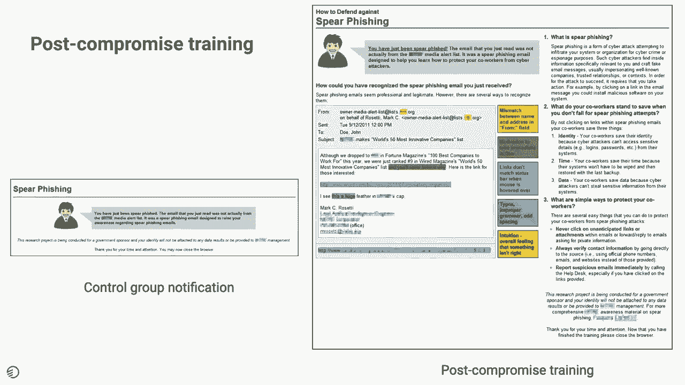
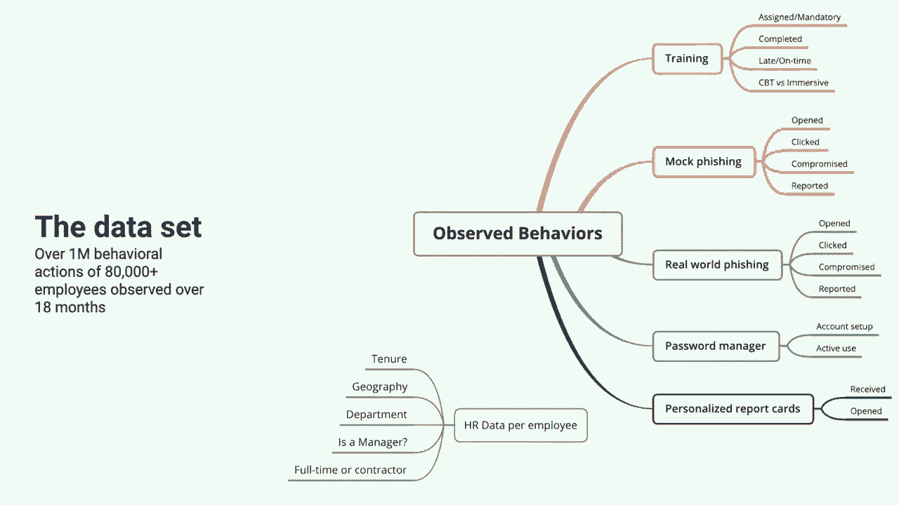
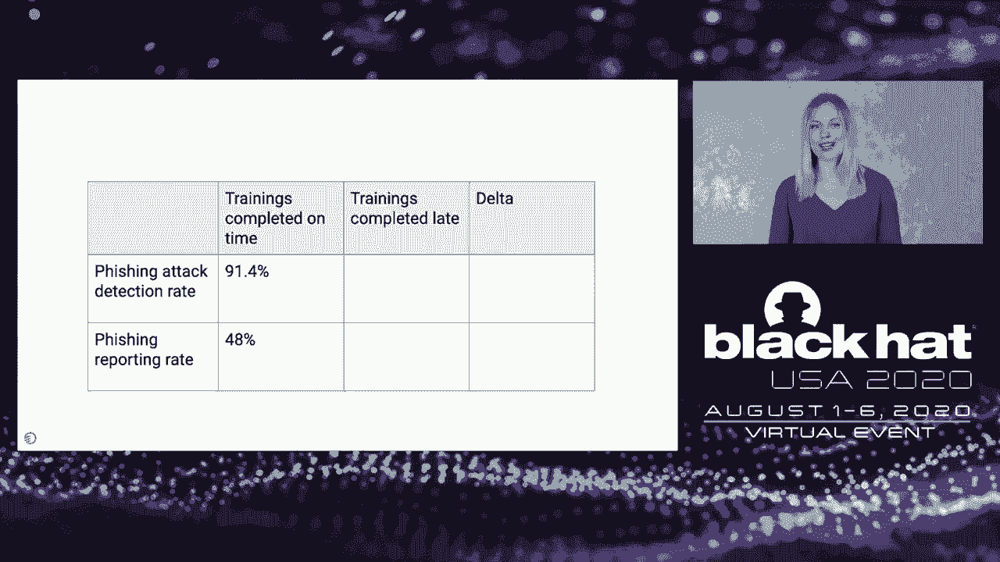
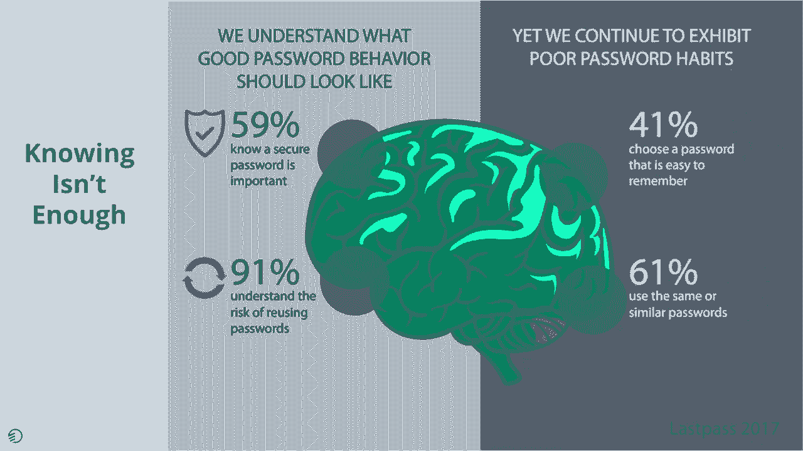
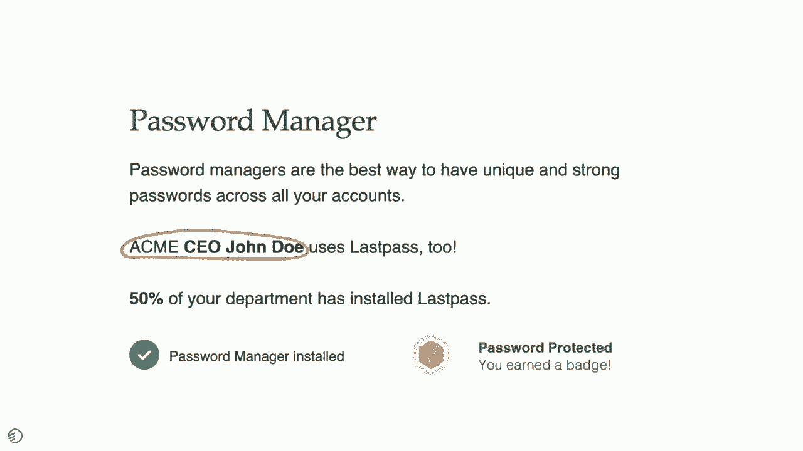
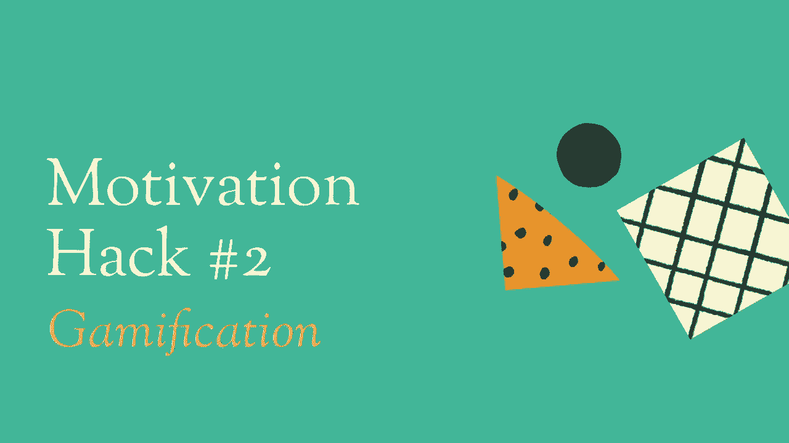
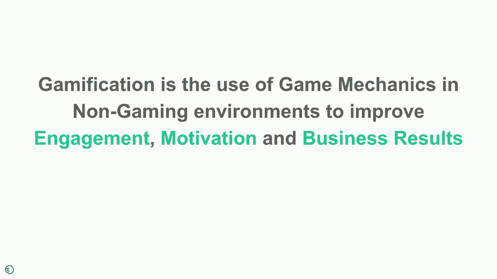
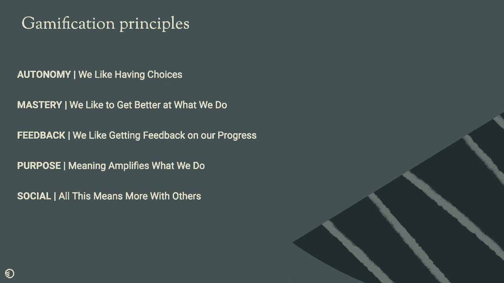
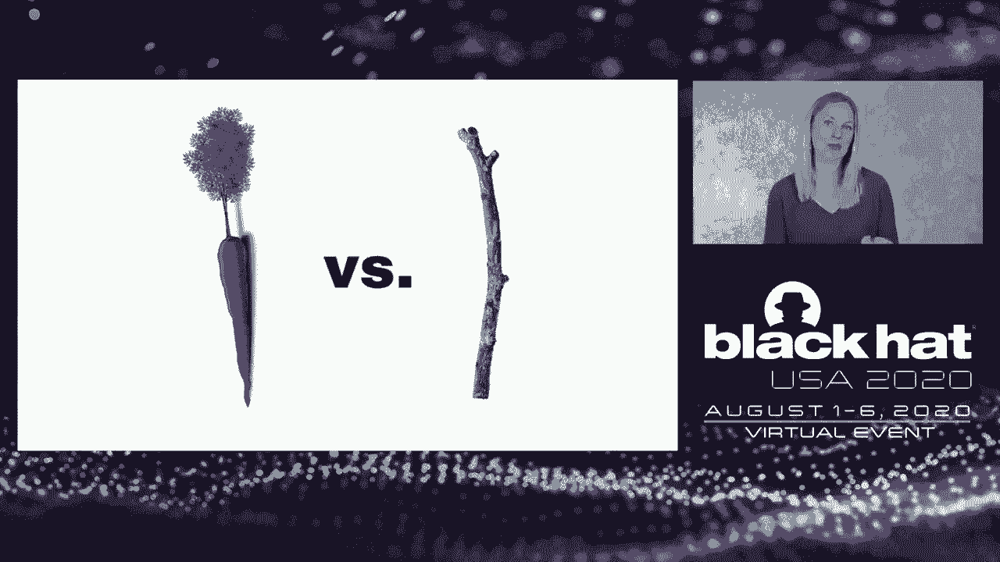

# 【转载】Black Hat USA 2020 会议视频 - P87：88 - Mind Games - Using Data to Solve for the Human Element - 坤坤武特 - BV1g5411K7fe

 Hi， my name is Masha Sedova and today I'm going to be talking to you about Mind Games。

 how we can use data to solve for the human element。 Before we get started。

 I'd like to tell you just a little bit about myself and how I got， to be here。

 I started my 16-year career so far in the security space as a defense analyst focusing。

 on the Russian cyber threat。 From there， I had the opportunity to start and run the security engagement team at Salesforce。

 which I did for about five years。 In that capacity。

 I got to focus on all the elements of human risk in that organization。

 and getting people to buy in to more secure outcomes and behaviors。

 My love of the human element then took me to starting Elevate Security， which I did in， early 2017。

 Today， Elevate Security is the leading human risk management platform。 Throughout my career。

 what I have been really focusing on is the role of the human being。

 in our defense as well as its weakness in securing of our organization。

 One of the things that I have noticed time and time again is that often we make our employees。

 do security。 I've been really obsessed with the question of what would it look like if employees wanted。

 to do security instead of have to。 In that question。

 I got the chance to explore concepts outside of security like behavioral。

 science and positive psychology that really study how and why we make decisions the way， we do。

 For the last 10 years， I've been knitting together the fields of behavioral psychology。

 and cybersecurity to create more robust defenses as it relates to the human element。 Today。

 I want to tell you a little bit about what I have noticed in my career tackling this， problem。

 What I have seen and what I have come to believe is that the human risk is one of the largest。

 unsolved problems in security。 Let me tell you a little bit about why I think that is。

 If you opened up the Verizon Data Breach Report this year， you would find that the human element。

 or human risks associated with human action have the top reasons why breaches are successful。

 Whether or not it is phishing， credential stealing， abuse， either privilege abuse， intentional。

 or unintentional through errors or mishandling of sensitive information， time and time again。

 it is human errors， intentional or otherwise， that continue to create a repeated vulnerability。

 in our organization。 This year is no exception。 If you take a look at any of the last five years。

 you'll find that phishing and credential， stealing tends to be the top three， four。

 five issues time and time again for what we're， trying to tackle as a security industry。

 And why do we think this is？ Is it because we haven't invested enough technology？

 Is it because we haven't explored this problem as effectively？

 I think it is because human risk is the largest unquestioned and unexplored problem in the。

 security space。 I say this because if you were to go into almost any organization today。

 you will find， the same approach to this problem。 And that is our employees taking a one-size-fits-annual training。

 one-size-fits-all annual security， training that they mute。

 skip through to the end and brute force this quiz question。

 And this is showing to be completely ineffective as it relates to addressing this pervasive。

 and ubiquitous problem。 And the approaches that we have set out for our employees today are really compliance-oriented。

 hard to measure their impact and truly a one-size-fits-all approach。

 Today I want to tell you a little bit about a new way we can tackle this pervasive problem。

 and how we can use the data that we have available to us in our organization to understand the。

 efficacy of accepted best practices， understand where we can look for human risk in our organization。

 and explore a variety of effective remediation techniques beyond what we consider to be best。

 practices today。 So to get us started， I want to tell you about a piece of research that I came across that。

 I found incredibly impactful and well-researched。 So one of the things that we do in our society and our security practices today is a concept。

 called mock phishing。 So what this research did was they found a group of 1。

500 employees that they set three， targeted spearfishing emails to them over the course of several months。

 And spearfishing emails were claiming to have relevant information for the employees。

 And the idea of this particular exercise was that if the user clicked on the spearfishing。

 email they were provided a training immediately following their mistake。 And if they didn't。

 they would just be notified。 They wouldn't be notified at all。

 They were hoping to see that if a person received something like this a phishing email， what。

 they would do and that they were expecting to see is that one， a lower clicking click rate。

 of spearfishing links would happen because people were given training when they clicked。 And two。

 people were going to increase their reporting suspicious emails。

 Perfectly reasonable logical expectations and results。 In fact。

 this is what most of our security teams do right now in practicing phishing， resiliency。

 This is what the interventions look like。 For a group of people who they chose not to give training to to see what would happen。

 with the control group and they just received a notification what we see on the left hand。

 side here say， hey， that was a phishing email and you clicked on it。 On the right hand side。

 the post-compromised training group received this training email， that said， well， this was this。

 this is a spearfishing。 This is how you could have identified it and how。

 what are things that you could do to。

 protect your coworkers。 And what they found was actually quite surprising。 First of all。

 they found that employees actually grouped themselves into cohorts and many employees。

 either clicked all of the links or none of them at all。

 And what the second thing that they found is that the performance that of an employee's。

 reaction to the email on the first， on the first email they received was a very good。

 predictor of how they would react to the subsequent spearfishing emails they received over the。

 course of the next few months。 So if you were likely to click on the first one。

 you were more likely to click on all， future ones。 And if you didn't click the first one。

 you were likely to not click the future ones。 And as for the training。

 they found that the training didn't matter at all。

 They found that when an employee clicked and received a training and then received a future。

 phishing email， whether or not they received a training had no impact on their performance。

 And those employees that did receive a training spent a mere few seconds on the page indicating。

 that they did not bother reading or ingesting any of the content。

 And what we took away in reading this research and understanding what was done in this space。

 was a couple of key questions that we wanted to analyze a little bit further。 The first was。

 if people were likely to click all or none， can we find predictors of what。

 kind of cohort you as an employer are going to fall into？

 Are you going to be a good or bad security performer across specific security behaviors。

 like phishing， like reporting， like malware infection rates？ And as far as training。

 if the training content didn't matter and people were skipping it。

 are there more effective ways that we can create interventions to improve these skill sets and。

 the ability to change these behaviors of employees？

 So my team at Elevate Security and I decided to tackle these two questions。

 And for the rest of the presentation， I want to tell you about our findings in both of these。

 spaces。 So let's start off with， can we predict security behaviors？ Before we get into this。

 I want to give you a little bit of context around how we did this。

 research and the data sets that we're using to do this analysis。

 So the Elevate Security platform integrates with existing security tools that organizations。

 have and the security tools map back to the security actions of employees。

 So in the case of malware， what we're looking at is， did an employee download malware？

 Was it executed？ Did it have to be blocked？ In the case of sensitive data handling。

 were there known violations in this space and did， someone email things that they shouldn't have？

 Did they upload things that they shouldn't have？ And so we're looking at a variety of different behavior sets。

 And then we take that and map it against HR data set to create risk mappings and heat。

 maps around what's good and bad is trends in an organization。 So for this particular study。

 what we did is we took a look at over a million different， behavioral actions done by over 80。

000 different employees across the world observed over a， period of time of 18 months。

 And to the best of my knowledge， this is the largest behavioral data set observed around。

 human risk to date。 So with the type of behaviors that we took a look at。

 you can see in front of you is a， couple of categories。 First was training。

 Did they take the training？ Was it completed？ On time or late， what kind of training was it？

 Was it computer based training or was it immersive？

 We took a look at certain security actions around phishing， both mock phishing and real。

 world phishing。 Did the employee open it？ Did they click it？ Did they compromise？

 Did they report it？ Password manager adoption。 Did they--are they using an account and are they actively using it？

 And then personalized report scorecards， which I'll talk about a little bit later， did they。

 receive it and did they open it？ As far as HR data set。

 we took a look at a couple of things related to the employee， element。

 How long have they been in the company？ They're 10-year。 What geography were they part of？

 Are they part of APAC， Asia Pacific， EMEA， Europe Middle East or the Americas with a particular。

 focus on North America？ Are they a manager？ And what kind of contracting status are they？

 Are they full time or part time？ So the first thing we took a look at the data set was can we predict good or bad behavior。

 based on who you are as an employee of your HR data set？

 And the first thing we looked into was password manager use。

 Who is most likely to use a password manager？ And so we took this data set and we created a decision tree。

 And the way you can read this decision tree is we split the data based on the most predictive。

 attributes and ways we can group the data。 And everything that falls to the left answers yes to the question。

 everything that falls， to the right answers no to the question。

 So the first way we split the data was are you outside of the United States？

 Then we split that data set into are you outside of Europe or tenure？

 Have you been in the company less than two years？ From there we split that data set into 10-year different 10-year groupings based on pools。

 of employees and as I was mentioning earlier most likely predictors。

 And what we found were two categories。 The least likely group to use a password manager and the most likely to use a password manager。

 And what we found was that employees in the Asia Pacific region that have been with the。

 company for longer than 1。3 years were the least likely to adopt and regularly use a。

 password manager across our data sets。 Employees in the United States who were the company longer than 1。

3 years were the most， likely。 And we found that geography was a much stronger indicator of likelihood of the use of a password。

 manager， US versus APAC in this specific example。 And tenure while being a bit of a predictor had only a slight effect on the ability to。

 divide the group。 The next thing that we looked into was fishing attacks。

 Who's most likely to fall for a fishing attack？ Similarly we created a separate decision tree and split it on a couple of different splits。

 The first was what's your tenure in the company？ Have you been here less than 3 years？

 Are you full time？ And are you located in the United States？

 And then through a couple of attributes including are you in or outside of Asia Pacific？

 What's your team size？ And what's your tenure？ And what we found again are two groups that are most likely to click and least likely。

 to click。 And what we found is for fishing is that the most likely to click are short tenured contractors。

 who are on large teams。 The least likely to click are employees who are in the United States who have been with。

 their company more than three years but less than 16。

 And in this case tenure is a much stronger indication of resiliency to fishing than any。

 other attributes。 What's really fascinating is that the length of time if you're in the company less than。

 three years or more than 16 have equal amounts of risk for your organization。

 So that's based on HR data。 Next question we wanted to ask was are there behavioral attributes that an employee exhibits。

 that will allow us to predict whether or not they're going to be good or bad security performers。

 And one of the things that we had a lot of data sets around was trainings completed。

 As an employee when you're assigned a training how responsive are you？

 Do you complete your security trainings on time or do you complete it late？

 And so we took a look at everyone who has regularly completed their trainings on time。

 and we found that on average their fishing detection rate was 91 percent which means。

 that they had an average clicking rate on fishing attacks at about 9 percent。

 They reported fishing attacks about 48 percent of the time。

 Now in comparison across all of our companies that we looked at and all of the employees。

 if you complete a training late you performed worse on both detection of fishing attacks。

 and reporting attacks。 So this is not a question about knowledge。

 This is a quote because both groups actually completed the training。

 It's a reflection on how important do I think security is。 Is it worth my time？

 Will I bother to do it before the deadline or will I need to be nagged to do it？

 And so the delta in there is a clear delta it is not a huge number 2 percent and 6 percent。

 but it does clearly show that if you are late on training you actually do perform worse。

 on fishing and not worse on reporting。 And by itself this might be only a small indicator or predictor but if you take it in connection。

 with the other attributes that we looked at for example your region or your tenure you。

 can find that these there are more common groupings of people so if we take in a set。

 of employees who are new to the company late on training and located at the outside of。

 the United States you're going to see much higher clicking rates and much lower reporting， rates。

 So now that we've identified groups of stragglers around behaviors and ways that we can predict。

 these kinds of good and bad approaches to security the next question is well what do。

 we do about it？ How do we decide more effective interventions for our employees？

 If we take a look back to the study that we started this presentation with the approach。

 that we did for an intervention was training。 So I click on the link and I received a training but what we found in that study was that employees。

 did not spend the time consuming the training and they did not bother to apply the training。

 and subsequent fishing emails that they were receiving。

 So the thing that training tries to tackle for us is knowledge。

 We assume as security practitioners that if our employees just know more they would do。

 something differently。

 The thing is knowing isn't enough and it's not really what our employees know but what。

 they do that matters。 And if we take a look at knowledge alone we see that it only gets us a little bit of the。

 way。 So last pass did a really awesome study in 2017 where they interviewed hundreds of users。

 of their platform and what they found was that a huge proportion of their users know what。

 a secure password is。 They know that it is important。

 They understand the risk of reusing the password and yet their knowledge doesn't actually translate。

 to action。 Because when we take a look at the passwords they have they choose easy to remember passwords。

 They reuse them a huge percentage of the time。 And so the delta of what we know and what we do is significant。

 And we see this time and time again not even just in security。

 If knowledge was enough everyone who was a smoker would receive an advertisement about。

 the fact that smoking kills and we would have no smokers in our society。

 And yet that's not the reality we have today。

 So if knowledge isn't enough what is our missing what's the missing puzzle piece？

 So the thing that we're missing here is motivation。

 If I am not motivated to learn the information needed and then choose to apply it I will never。

 change my behavior。 I will never stop clicking on phishing links。

 I will never stop reporting no matter how much I know this to be a good practice。

 Before I go into what motivation looks like in implementation I want to give you just a。

 little bit of behavioral science theory so that you can understand how this maps to a。

 bigger picture。 So in behavioral science concept the formula for behavior change consists of three things。

 that happen at the exact same time。 I have to be motivated to do something。

 I have to have the ability to do something and I need to have a prompt or trigger or something。

 that reminds me to do something。 So if I want to go running I need to be motivated to lose weight。

 I need to have two feet that work and running shoes that are my size and I need to be reminded。

 to do it。 I need to have a friend come over and say let's go for a run。

 I need to have an alarm on my phone says it's time to go for a run Masha。

 And if any one of these things are absent or are not present in enough proportion you're。

 not going to see the behavior。 I may have the ability to go running but if I don't care it doesn't matter you're not。

 going to get me to go running。 So all of these need to exist in the right amount and the right time for this to happen。

 So if we take a look back into the example of fishing training we find that even if people。

 have the ability they're not motivated to do it it's possible that they have neither。

 the ability nor the motivation。 So let's take a look at how we tackle motivation。

 I want to walk you through three motivation hacks we've applied in our research and seen。

 incredible impacts and results in changing people's behavior。

 And these are all techniques that you can take home and apply to your own organization。

 The first and this is one of my favorites is a motivational hack called social proof。

 Now social proof shows up in so many parts of our lives。

 It's the reason why we are swayed by five star reviews on Amazon。

 It's the reason when we go to a hotel booking site and take a look at how many other people。

 are looking at this room just right now。 Or did you know this room was booked 41 times in a day？

 Social proof is the thing that says other people like you are doing this behavior and。

 this is what good behavior looks like。 This is what normal looks like。

 And we as human beings come from a herd mentality and are constantly looking around us to say。

 what is acceptable behavior？ What should I be doing？ And so advertising。

 marketing and even psychology has figured this out and uses this in communication。

 with the average end user。 And so we see this time and time again in motivating people to act and like checking。

 out of a hotel room or buying purchases。 One of my favorite examples of social proof is the use in energy bills and energy consumption。

 And the company O-Power started applying social proof by comparing your energy use to your。

 neighbors and letting you know how far off you are from your most efficient neighbors。

 thereby saving billions of dollars in wasted energy use。

 There was a really great study done about two years ago with a partnership between Facebook。

 and Georgia Institute of Technology that actually tracked using social proof and the adoption。

 of multi-factor authentication in the Facebook platform。

 And what they found was that when they presented users logging in with a control prompt that， said。

 "Hey， security is good for you， please adopt MFA，" they had a certain number of people， adopted。

 But when they created social context to it， they said， "Hey， did you know 100 eight of。

 your friends are already using security measure and you should too？"， They were 1。

36 times more effective in driving that adoption of MFA。

 We applied similar types of social proof across behaviors including phishing， reporting， password。

 manager adoption。 And so by taking data sets of what employees are doing in an organization。

 you can compare， every employee's actions to their peer group。

 And when we compare our actions to people we know， we are much more likely to change those。

 behaviors to match our norm。 So by seeing the example in front of us。

 if you can show me that I compromise my computer， through clicking on spear phishing way more often than the rest of my department and the。

 rest of my company， we've been finding that employees are much more motivated to engage。

 not in just this concept of wanting to participate in changing their behavior， but they're also。

 way more motivated to take the follow on training。

 It helps them to course correct for the skill set。 In fact。

 when we do present these types of messaging， we find over 60% engagement rate。

 month after month with participants of this type of communication to see how they're tracking。

 over time。 We also use a social proof concept that is leveraging celebrity social proof。

 And celebrity social proof is when you show me someone rich and famous or someone I know。

 and I'm sensitive to look up to is doing some kind of behavior that you want me to emulate。

 We see this all the time in advertisements when famous sports star is using Nike shoes， for example。

 and we want to buy those shoes because if it's good enough for that person， it's good enough for me。

 Similarly for password manager adoption， we call out the most senior person in organization。

 that uses as password manager， thereby creating a social norm for employees。 They say， "Oh。

 this is great。"， And that's how social proof can be applied。

 The second motivational hack I want to walk you through is gamification。

 Before I get too far into gamification， I want to set the record straight around what gamification。

 is and isn't。 Gamification is not about playing games at work。 And often it's just confused with。

 "Well， if I bring monopoly into the workforce and。

 that gamification， it's not。"， What gamification is。

 is taking apart the things that make gaming successful and applying it。

 to business to improve results。 The reason we take a look at game mechanics is because games have figured out to a billion。

 dollar industry how we get people to want to do something instead of have to。

 The reason that is is because games leverage something intrinsic to us as human beings。

 It leverages our desire to be engaged， to be motivated， and to play。

 But what we found in the study of gamification and game design is that there are five key。

 elements to making something successful to be gamified， including in game playing。

 And the first one is autonomy。 We as players like to have choices。 Don't tell me what to do。

 Give me the choice to go left or right。 That gives me a sense of ownership of the experience。

 Mastery。 I like to get better at what I'm doing。 If you can give me the tools。

 I will be motivated to improve。 We don't always love winning the level。

 We like the attempts at trying to get there。 Feedback。 What。

 how is my progress on this particular action？ Am I getting better or worse？ Purpose。 What。

 why am I doing this to begin with？ What is the meaning behind this？ The last thing is social。

 All this means more when we're connected with others。

 So I want to show you what gamification looks like in our daily lives。

 This shows up everywhere， whether or not you， you know， to look for it。

 It's in our airline points and our miles。 And this gamifies loyalty。 It gamifies the ability to。

 for an airline to continue to drive us to use their airline， system and for rewards， status。

 access to lounges and boarding earlier， we change our。

 behaviors in our purchasing habits and our flying patterns to， to allow us to retain。

 greater bonus points or mileage credits。 Same thing with Fitbit like approach that tracks how many steps we have and compares。

 it to our peers。 We try to level up。 It drives our coffee purchasing habits with loyalty cards。

 You know， you have a punch card of 10， you get it the 11th free。 I'm continually getting feedback。

 I'm 9 out of 10。 This is a， I'm connecting to the purpose of however。

 however exciting for me is another， free coffee， but I am being gamified to continue to repeat a behavior。

 And even filling out your LinkedIn profile is gamified。 Look how strong you are。

 You're almost to that gold star。 You just need to do one more step back to feedback。

 back to mastery being a full percentage， a， like full 100% fill that profile。

 So this is how we're using it in business。 Why not in security？

 So let me show you a couple of ways where we've seen this play out。 On the left hand side。

 you see a security strength chart。 We found it to be incredibly effective in communicating the security strength of employee。

 It could be on one behavior。 It could be on several behaviors combined。

 But when we can communicate to an employee， did you know that your fishing performance is。

 a two out of five？ Make it a little bit friendlier and say it's a tenuous out of an indestructible scale。

 You get a little ways to go。 So we're tying in elements of feedback。

 We're tying in opportunities for mastery and we're giving people a sense of purpose。 As you can see。

 the reason we need you to get to indestructible is because you need to， help us protect the company。

 So instead of just saying， hey， take this training， it's a here are things you need to。

 do to be more resilient， security minded employee。 On the far right side。

 we see a similar kind of leaderboard。 So same concept that we would see in a game。

 Where are you on your top ranking leaderboard？ Can you do the same thing tied around behavior？

 We found this to be incredibly effective for executives and for salespeople。

 If you can show them how a specific behavior， take reporting for example。

 How are your reporting trends compared to people who look like you？

 And where are you on the leaderboard？ And in the middle one is status level。 And in gaming。

 this would be something that we would call a streak。 And we're trying。

 we'd be trying in a game to not break our streak。 We've seen this play out time and time again around safety。

 right？ Number of days since last accident。 And yet we haven't ever really seen this apply to security very often。

 This is a really great way of tying security actions to social， which is one of the points。

 or altruism， something bigger than just myself。 So if I take a look at how we would apply streaks to security。

 what if we had something， that's in our organization say。

 number of days since last malware infection。 So as an employee。

 when I am faced with an opportunity to download something， will I， pause just for an extra second？

 Because I don't want to be the person that resets the company clock。

 And so what we're finding is that if you don't just focus on， hey， take the training。

 you allow motivation like leaderboards， improvement， or connecting it to a greater purpose where。

 you are trying to keep up with the security posture for the whole company， you're applying。

 motivation to the specific action we want。 And the last motivational hack I want to walk you through is positive reinforcement。

 So when we talk about positive motivation or negative motivation， as a security team。

 we have one of those two choices， we can either choose to reward a good behavior or punish。

 a bad behavior。 And very often， we see the sticks show up。 We see that if you violate a policy。

 you'll hear from a security team。 But otherwise， you're never going to hear from a security team because to be totally honest。

 security tends to have a whole bunch of stuff to do and they don't have time to reward people。

 for their good， good behavior。 And instead， you're just going to hear from them when it's a bad behavior。

 But I want to show you what that actually looks like in changing behavior and why that。

 may not be the right approach。

 So taking a step back， I wanted to define for a second what negative reinforcement looks， like。

 So negative reinforcement is when we do a behavior to avoid negative outcome。

 So as you can see in this illustration， I put on sunscreen， not because I love sunscreen。

 but because I hate getting sunburned。 So the thing I'm reinforcing here is application to avoid pain。

 When we think about security， this is how we again often show up。 I will continue to。

 I will change my password when the policy dictates because I don't want。

 my access to get locked out。 That's the negative outcome。

 I'm going to take this training because I want my manager to stop nagging me。

 So what does the opposite look like？ So this is positive reinforcement。

 And we've seen time and time again that positive reinforcement when it applies to training our。

 pets， raising our children， even teaching us new skills as adults outside of security works。

 incredibly well in creating new behaviors。 So positive reinforcement allows us to reinforce when a behavior is done well。

 So in the case of this illustration， whenever the dog spends a day not going to the bathroom。

 inside the house， but goes outside underneath a tree like expected， they're getting a tree。

 And so instead of being punished for a bad behavior， they are looking forward to getting。

 rewarded for the good behavior。 So let's apply that again to security。 What does that look like？

 If we go back to the very first study that we took a look at， we were treating training。

 as a negative reinforcement。 You clicked on the link， now it's time to take a training。

 And so the motivation to not click a link is to not take the training。

 So why in the world would someone possibly want to go through a training when that is。

 what we use as punishment instead of driving it as a positive outcome and something that。

 people voluntarily would choose into？ So instead of taking a negative reinforcement approach to do this or else。

 what if we take， security from a positive reinforcement？ If you take a look at the time。

 so insecurity has been done well。 If you take a look at everyone in the organization who。

 for example， did not click on the phishing， link and reported it and took that opportunity to give them kudos and accolades at a company。

 wide level to reinforce the rest of the company。 Why that is such a positive behavior that's desirable。

 you're going to begin to see more， of that behavior show up in your organization。

 And what I've seen time and time again is pairing gamification with leaderboards and tying。

 it to an all-hands presentation where you give positive reinforcement and kudos at a。

 company wide level and saying these people did a great security behavior and we want。

 to call that out。 So it's a shift in the way we approach this problem set because it creates incentive to。

 not just take the training and improve， but it creates incentive to continue to do that。

 type of behavior better and more frequently。 And there's been a really great study done about this in 2014 around using both positive。

 and negative reinforcement and what this study found was that yes， punishment can be an。

 effective tool of changing behavior， but it has a side effect where it reduces morale。

 And positive reinforcement is as effective in increasing the desired behavior but also。

 has a secondary benefit of creating enthusiasm， engagement and satisfaction amongst staff。

 which in security is what we need to start changing our brand from the Department of。

 Technology to creating alliances and engaging our employees as part of the defense。

 And what we've seen in the dozens of deployments we've applied these different techniques around。

 motivational improvements and behavioral science approaches is time and time again significant。

 changes to vision compromises， employee reporting and password manager adoption。

 So what I want to leave you with are two sets of findings that we talked about。

 The first is the study of cohorts and predictive analytics。

 Can we understand who is going to be a good and a bad security performer？

 And what we found was that tenure was in fact a really strong indicator of vision resiliency。

 and those employees that are accompanied less than three years or more than 16 performed， the worst。

 Geography was a really great indicator of password manager adoption and late training。

 had a correlation to clicking on phishing links and reporting less。

 And when we take a look at the second question of well what can we do about our risky cohorts。

 we're finding that motivation needs to be applied in addition to training to get our employees。

 to both want to take the training and adjust their knowledge levels and secondly to actually。

 apply the things that they learned to change their behavior and want to improve those actions。

 And we all have the choice and the ability to apply techniques like social proof， gamification。

 and positive reinforcement to achieve these types of behavioral change goals that we're。

 trying to get to。 We at Elevate Security are constantly keeping on top of the latest research in the space。

 and so if you'd like to follow us and learn a little bit more about what we're finding。

 in our data sets and in our research please follow us here。 And with that。

 have you taken any questions？

 [BLANK_AUDIO]。