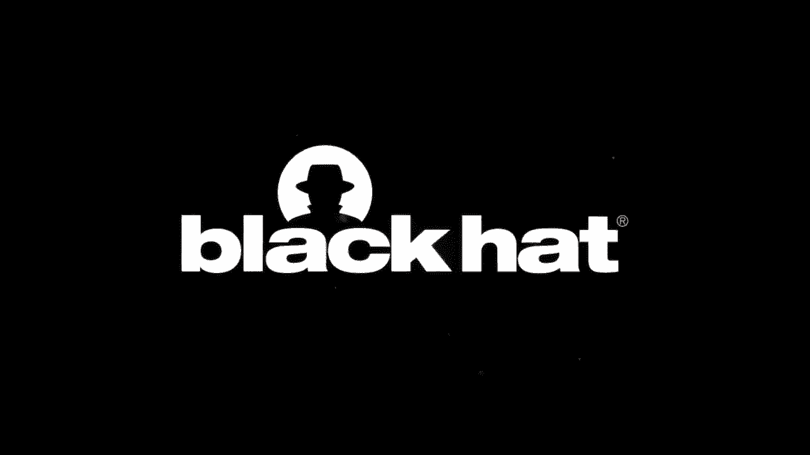
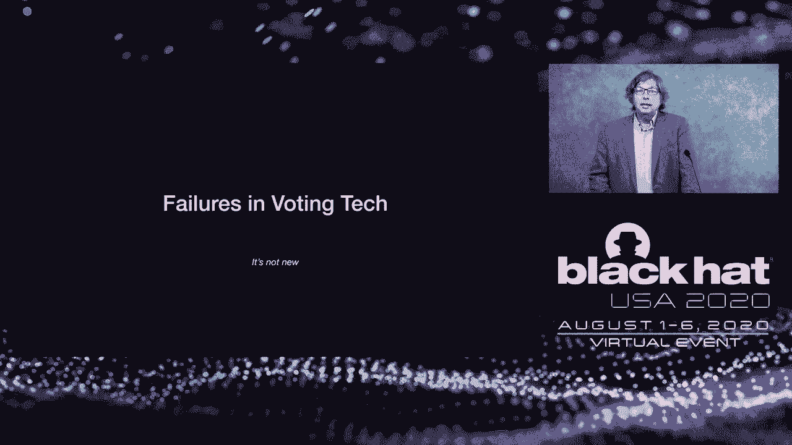
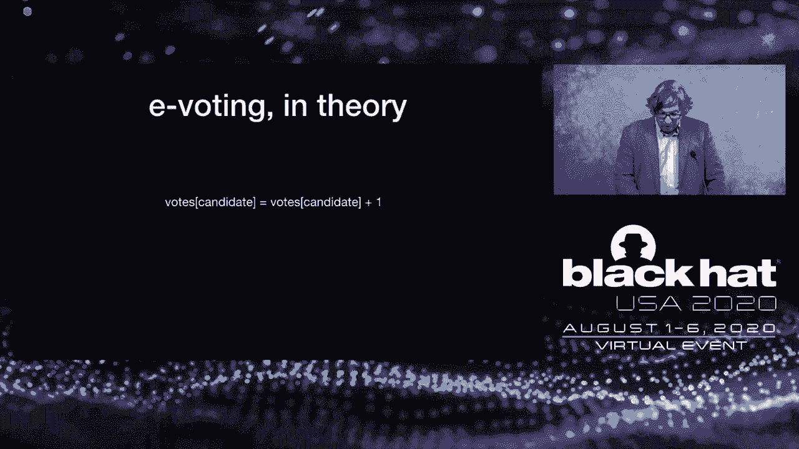
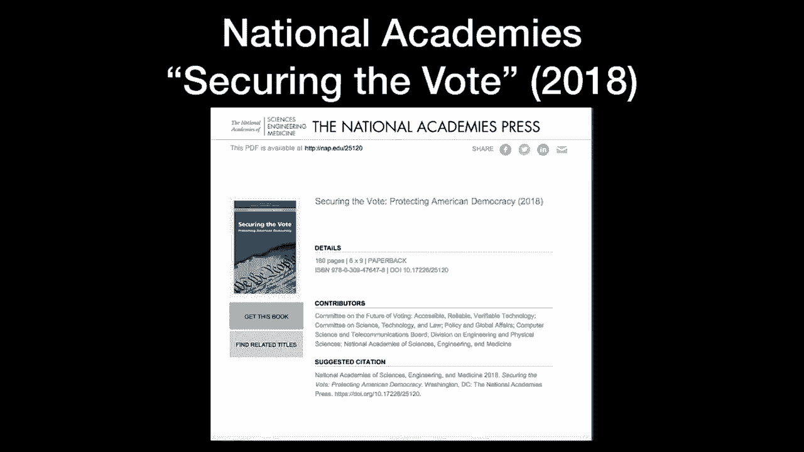
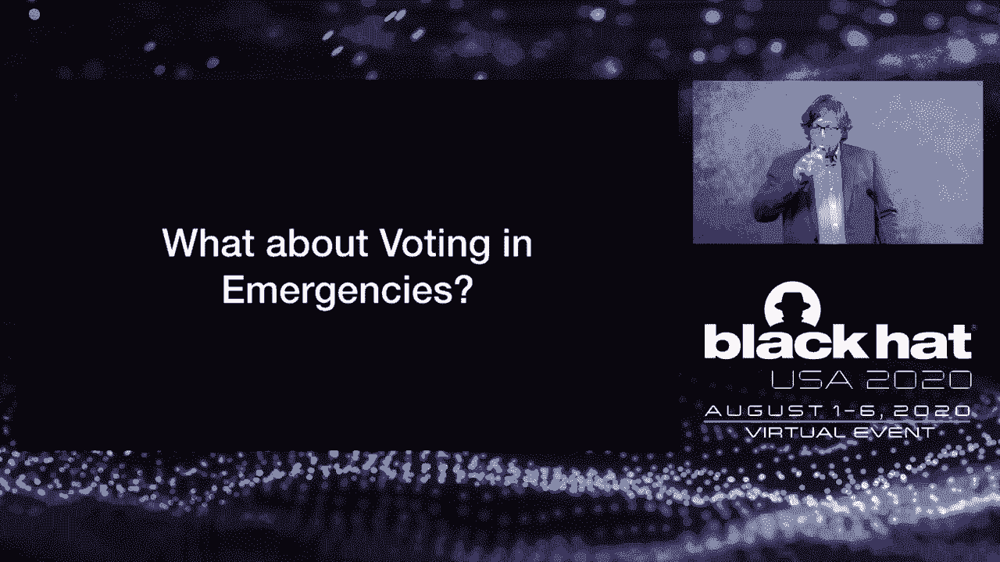
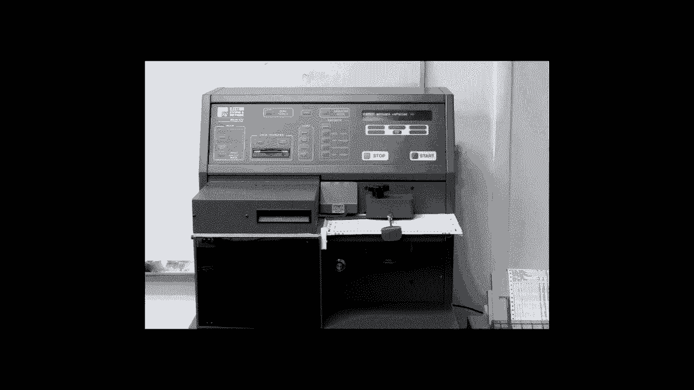

# P88：89 - Stress Testing Democracy Election Integrity During A Global Pandemic - 坤坤武特 - BV1g5411K7fe

 In 1999， we launched the first-ever SAS security solution。 Since then。

 we've been diligently expanding our cloud platform， one IT， security， and compliance app at a time。

 The result。 One integrated cloud-based platform for IT， security， and operations。 Today。

 we extend the unifying power of our cloud platform to EDR。 We hope you'll give us a look。 [MUSIC]。

 Hello， and welcome to Black Hat USA 2020， our first virtual Black Hat event。

 While our event is entirely online this year， the Black Hat team and。

 board have made every effort to provide you with the same high standard of Black Hat content。

 This includes nearly 80 technical trainings， which concluded yesterday。

 And it includes 90 Black Hat briefings over 18 tracks covering the very latest security。

 research from the global community。 Outside of our trainings and our briefings programs。

 we have a wide variety of content， that is available to all attendees。

 We have nearly 60 open source tools being demonstrated in the Black Hat Arsenal。

 and many sessions on current trends and best practices being presented by our sponsors and our partners。

 Our keynotes and our review board locknotes are also open to all attendees this year。

 We have a packed agenda with the best content and we hope you enjoy your experience。

 It's now my pleasure to welcome Jeff Moss to provide his opening remarks。

 but first a little bit about Jeff。 In addition to founding both Black Hat and DEF CON。

 Jeff has served as Vice President and Chief Security Officer at ICANN。

 He is an advisor with the US Homeland Security Advisory Council。

 and a Commissioner with the Global Council on the Stability of Cyber Space。

 Please join me in welcoming the Dark Tangent Jeff Moss。 Hi。

 I'm Jeff Moss and I'd like to welcome you to the first-ever Black Hat Briefings Virtual Edition。

 Instead of sitting in Las Vegas， watching me wear my blinky。

 shiny shoes on stage with the smoke machine， and laser beams。

 we'll be sitting at home watching me on a TV screen。 Okay。

 so what do we have in plan for you for this year？ We have a large lineup and I'm going to start with what's become tradition for the last 20 years。

 I want to tell you about all the people from around the world that are participating in the event this year。

 because they can't do it in person。 And as usual， we have a record number of people participating from other countries。

 117 countries are currently represented and I'm going to go through the countries where only。 Yeah。

 only 30 people were one person from the country is represented online today。

 To give you an idea of the scale and scope and also encourage people from no matter where you are in the world。

 you can participate in security。 It's really a community of ideas。 Okay， here we go。 Afghanistan。

 American Samoa， Andorra， Angola， Azerbaijan， Bahrain， Bolivia， British Virgin Islands， Brunei。

 Cameroon， El Salvador， Cape Verde， Gambia， Georgia， Guatemala， Honduras， Iceland， Macedonia， Malta。

 Mauritius， Montenegro， Mozambique， Niger， Rwanda， Sudan， Tanzania， Togo， Venezuela， Vietnam。

 and I think for the second year in a row is Zimbabwe。

 Hopefully he brings a friend next year and we can get him off this list。 Okay。

 another thing that we do every year is we offer scholarships。

 We're trying to figure out a way to bring those not so lucky to have a high paying job in information security。

 to develop the skills to find an on-ramp， to get involved in the professional side of things。

 What are their on-ramps？ So， Black Hat， we have scholarships and we give these away for a number of reasons。

 Some are for writing white papers that get reviewed well and so we give passes for free。

 This year we've distributed the scholarships to a number of different organizations。 So。

 Blacks and Cyber， 25 scholarships awarded， the COVID-19 Leaf Scholarship， 71 scholarships awarded。

 the Executive Women's Forum Scholarships or the EWEF， 50 scholarships， student scholarships， 85。

 veteran scholarships， a new thing that was started last year， we have 30。

 and finally Women in Security and Privacy or WISP 40 for a total of 301 scholarships for this year's conference。

 That's fantastic。 It's something I'm really proud of and I'm really glad Black Hat continues every year to grow this program。

 and bring new blood， new ideas， more diversity into our community because it's really needed。 So。

 how many of you last year thought that this year you'd be living in your cyberpunk future？

 I think in the last year I've realized more of what I grew up reading in the 90s with maybe Nuro Mansour。

 or William Gibson and Shockwave Rider and some of the other classics。

 It seems to be all happening right now。 And the part that for me is the most vivid is sort of the very rapid erosion of privacy。

 civil liberties， the very rapid expansion of authoritarianism online。

 the quick speed with which companies are sort of doing battle， with national governments。

 whether it's over taxes or a fragmented internet or routing or maybe liability。 So。

 just like everything else， the pandemic has accelerated my cyberpunk future。

 And I bring that up because I want to remind everybody that we're part of that。

 Even if we're just a little part on the side， the things we build。

 the technologies we create are going to be part of that。

 And it's going to be left to future governments， future generations。 I mean。

 we're still living with FTP and that's what， 35， 40 years old。

 We haven't moved to IPv6 yet or DNS sec。 And those are measured in decades of age。 So really， yes。

 what we do build today is probably going to be around for decades。

 So keep that in mind when we're making decisions that there is a trade-off between privacy and security。

 And the implications are not theoretical。 They're becoming more and more real-world。

 Looking at facial recognition is the most recent battle for privacy and civil liberties。

 And this leads me to sort of a second thought， which is it was kind of cuckoo to say a couple years ago。

 there's sort of the east and the west or there's the open internet and there's the。

 vulcanized or fragmented internet。 And now not so crazy。

 You can really see battle lines being drawn between countries with sort of Western rule of law values。

 and those with more of an authoritarian or the party control centralization。

 China or maybe North Korea， Russia， some others。 And I think what's happening now is you're seeing a fast realignment in technology。

 supply chain， social media， the data that gets collected on you and how it gets shared with the government is happening so quickly。

 And it's happening in such a way now that you might not be aware of it。 For example。

 a Chinese company might own a large stake in an American company and they might get access to some data that might end up going back to China that you're not aware of。

 And it might not have been anything that was contemplated when that partnership was originally created。

 So I think what we're going to see in the years to come is we're going to probably see some sort of US policy toward industrial technology transfers or an industrial policy。

 In the United States is one of the few countries in the world without an industrial policy。

 And now we have a White House strategy on 5G。 We have some battles going on with Huawei。

 I think in the next five years we'll have an industrial policy and then we'll be just like everybody else in the world。

 And while that battle is happening and those lobbyists are fighting。

 I want you to keep in mind that privacy and human rights and civil liberties need to be considered in all of these decisions。

 Because really it will be， I believe， two types of networks。

 those that respect rule of law and those that don't。 So the big battle space for this year， 2020。

 the national election for a new president in the United States。 Lots of interference。

 lots of misinformation， lots of new technologies being deployed。

 And that's why we're going to have our keynote， Matt Belaise。

 Now it's my honor to talk a little bit about Matt。 I've followed Matt's career for a long。

 long time。 I think one of the things I was most proud of is when he was involved in cracking encrypted radio communications used by police to point out that there are problems with this technology。

 He's been heavily contributory to the public knowledge space。 Always been in public education。

 worried about and helping the community。 He's the chairman of the Torr Project。

 He's the co-creator four years ago with myself on the voting machine village。

 Hacking Village at Defcon， which has had tremendous impact and managed to convince several states to change the kind of technology they buy in their voting machines。

 He has repeatedly provided expert testimony to the U。S。 Congress。

 And he's an election security expert。 And he's currently at the McDermott， I'm sorry。

 the McDivot Chair in Computer Science and Law at Georgetown University in Washington， D。C。

 with a focus on privacy， cryptography and security at scale。

 And obviously this year his time has all taken up focused on election security。

 So we're going to be listening to Matt talk about election integrity during a national pandemic。

 Thank you very much for making the time for this virtual Black Hat。

 And I really look forward to seeing you next year in person。

 Now I'd like to introduce Philippe Corto， CEO of QALIS and the Platinum sponsor for Black Hat Briefings this year。

 Now for those of you who don't know Philippe and QALIS， they're a long time sponsor of Black Hat。

 big believers in our mission， and almost 20 years being a top sponsor。 So， Philippe， in 2004。

 received the SC Magazine Editors Award for bringing on demand technology to the network in the security space。

 That sounds kind of strange on demand technology， but you have to remember this is pre-cloud and pre-sass。

 And as QALIS was developed it was really became a SaaS security company for developing and delivering security。

 In years later he developed and co-founded the CSO Interchange to provide a forum for sharing information in the security space。

 And then was named a 2011 CEO of the year by SC Magazine Awards in Europe。

 And you see this progression of sort of pre-sass， SaaS， cloud， and QALIS adapting at each stage。

 So with that there's a certain amount of forward-looking vision Philippe brings。

 And because of that I'm looking forward to his comments to everyone this morning。 Thank you。

 Thank Jeff for such a nice introduction and for keeping the spirit of Black Hat alive in such difficult times。

 where we are certainly missing the essential human interaction。 Welcome to you all。

 And first let me encourage you to engage with the Black Hat online platform and to visit the business org。

 It is now a real pleasure for me to introduce our keynote speaker who really doesn't need much introduction。

 It's currently the McDavid Chair of Computer Science and Law at Georgetown University on the board tour that all of you know。

 And a cryptographic extraordinary。 Today is going to share with us the technological。

 economical and political challenges of living through such a crippling pandemic。

 And now ladies and gentlemen， Matt Blaze。 Hi and my name is Matt Blaze and first of all thanks so much for inviting me to give this keynote this morning。

 I'm going to talk about election security and this is a very different talk than I would have given four or five months ago。

 But we'll be talking a little bit about stress testing our democracy and how we think about election security with the added wrinkle of an emergency and a pandemic。

 So technology and elections in the United States are very heavily interrelated。

 And that wasn't always the case。 In fact early elections in the US used very little technology at all。

 They consisted pretty much of getting people together in a room and having them raise their hands。

 This stopped being viable because it really doesn't scale very well。

 And it was only because fitting everyone in a community into the town hall on election day stopped being practical that we started to adopt technological mechanisms for elections fairly early in the history of the United States。

 And the earliest technology that we used here and that most democracies used at the time was simple paper ballots put into a ballot box and then counted at the end of the day。

 And you know we don't think of that as being particularly technological but it actually has some very interesting security properties。

 If you take a piece of paper and nobody looks at it and you put it into a ballot box and then shake the ballot box up at the end of the day and make sure that you've looked in the ballot box at the beginning of the day and make sure it was empty and full at the end of the day。

 And this very nice property that as long as the ballot box itself isn't tampered with you have pretty high confidence that the vote you put in gets to be one of the votes that's counted and you can watch that process pretty well。

 It also adds along with it a new property that you didn't get in the room with everyone raising their hands which is ballot secrecy。

 No one can tell how you voted but you're confident that your vote got counted as you cast it as long as that ballot box didn't get tampered with and the counting process had high integrity。

 So that was a pretty interesting and high standard for security that other subsequent technologies had to meet。

 And we've moved on largely from the literal ballots in a box that we count by hand in most of the US to other more advanced technologies like machine counted ballots。

 And we have a number of votes that we have to vote on where we might cast our vote on something that can be tabulated by machine rather than people。

 Or that actually records our votes directly on technology like those older lever voting machines which record internally how you voted。

 We have voting computers in which we cast our votes in some way with the aid of a computer。

 But what all of these have in common and their security properties and their risks are a little bit different is that our confidence in the outcome of the election increasingly depends on our confidence in the integrity of the mechanisms that we're using to do this。

 So it's very important that we trust not only the people who are involved in elections but also the technology that we depend on for those elections to be secure to have high integrity and to be genuinely reflective of how we voted。

 Now this is and I've often said this long before the pandemic。

 I've been working on election security for a couple of decades now。

 And I'm a computer scientist who studies computer security which is full of terribly hard problems。

 I don't think I've ever encountered a problem that's harder than the security and integrity of civil elections。

 It's fundamentally orders of magnitude more difficult and more complex than almost anything else you can imagine or that we do。

 And one of the reasons for this is that some of the requirements for elections contradict each other。

 So from a technology point of view the biggest contradiction is that we have two requirements that conflict with each other in a way that improving one degrades the other。

 So those two requirements are secrecy。 We want to not be able to discover how someone else voted or even be able to prove how we voted to another person under duress。

 But we also want transparency。 We want to be confident that our vote was counted as cast and that the whole system is doing that for everyone else。

 So we have one requirement that says you can't find anything out about how someone voted。

 And another requirement that says you want to be able to audit everything and be sure that everyone's vote was counted as they intended。

 And when you think about ways of actually accomplishing that the ballot box with pieces of paper seems to do it pretty well。

 And almost nothing else comes close unless you start to have to get very clever。

 But that's not the only difficulty of elections。 The other difficulty is the starkness of the application itself。

 And in particular， it is almost impossible if you discover an irregularity to redo an election。

 Elections pretty much have to be certified by a certain date。

 And even if you discover that there were widespread irregularities。

 the consequences of doing an election over and the difficulty of logistically pulling off。

 Doing a statewide or national election again， before the date that whoever is being elected assumes office。

 make it pretty much impossible。 All right， so I'm going to talk a little bit about how voting works in the United States from a legal and structural point of view。

 We think about presidential elections， you know， for a federal office。

 That's what everyone thinks of。 That's what we're thinking about largely for November。

 That's certainly the election that we pay the most attention to。 But in fact。

 the federal government has remarkably little to do in practice with the process and the mechanisms of voting。

 The federal government sets pretty broad standards， mostly in the Constitution。

 Congress has authority， but it's very reluctant to exercise it。 In practice。

 each state sets its own rules， has its own laws， has its own requirements for the elections that are conducted in that state。

 And in most states， elections are actually run by local governments， most often counties。

 And to give you a sense of the scale there， there are over 3，000 counties in the United States。

 And if you add the townships and other governments that run elections， there are over 5。

000 government entities responsible for doing everything with the elections for their residents。

 So there's no single place that can change everything nationwide。 And furthermore。

 when we vote in person， we generally vote in our neighborhood。

 in polling places that are called precincts。 And each county， each government。

 might have hundreds or even thousands of precincts within it。

 So this is a pretty large scale and very decentralized operation。

 US elections are also the most complex in the world in terms of the number of different races and the number of different types of ballots that people。

 even within the same county， may see。 So everybody votes for president。

 everybody in a state votes for their state senators。

 but we also will have very local elections like school districts and so on。

 And so even within a precinct， there may be several different ballots that different voters end up getting。

 And that all has to be managed by a local government that's mostly stretched pretty thin。

 In general， it's the county budget that's paying for elections。

 So when we talk about voting systems and we talk about election management。

 we're competing with things like road repair and fire department services for resources and for budgets。

 To give you a sense of the scale of this， in 2016 in the general election， there were almost 117。

000 different polling places in the United States and 178，000 and chains。

 different ballots that Americans might vote on。 There was a huge temporary workforce between about four and about 10 people。

 depending on the local circumstances per polling place。

 mostly hired to work just on that day and trained for a day or two on election procedures。

 And they're probably your neighbors when you vote in person。

 There were in 2016 throughout the country 138。8 million ballots cast。

 and that was about 60% of the eligible voters who participated。 If you remember 2016。

 that was a pretty highly contested presidential election， and it got about 60% turnout。

 which is considered actually high by U。S。 standards。 Of those， about 17% were cast in person。

 but before election day through early voting， about 24% were cast by mail。

 and the remaining 82 million ballots were cast in person at a local precinct。 So。

 mostly we vote in person。 That's how it's generally going throughout most of the country。

 though some states rely more heavily or almost exclusively on mail-in voting。

 But every state allows some mail-in voting for things like absentee ballots and so on。 Okay。

 so how secure is all this？ How reliable is all this？ And how robust is all of this？

 The stakes are very high， and one way to measure that。

 the way I like to measure that is if we think about the amount of money that's spent conducting political campaigns。

 that vastly outspends the amount of money we spend actually conducting elections。

 So the people who are spending money to influence how you vote have a lot more resources than the people who are trying to ensure that everything runs smoothly and that everybody is given the opportunity to vote and that the votes are counted properly。

 Traditionally， we've worried about corrupt candidates and their supporters doing things like buying votes or adding ballots or taking ballots out of a ballot box or interfering with the count。

 And we have a lot of mechanisms to make that difficult in practice， and in fact。

 it generally is pretty difficult to do that， although we'll talk a little bit about how technology can affect that。

 But more concerningly， the systems are designed to provide safeguards against that traditional threat。

 but there's another threat that we hadn't really considered on a large scale before 2016。

 which is foreign state adversaries。 And foreign state adversaries are a little different from traditional attackers in an election system。

 because they might not want to choose a winner。 They may be satisfied with simply disrupting the overall process and casting doubt on the legitimacy of the outcome or making it difficult for people to vote or to know who won。

 And that is both an easier goal and one for which many different kinds of attacks than the kinds of attacks where you want to actually pick the winner might be possible。

 So a good question we have to ask is given this very broad threat model。

 does any given voting technology that we want to use help be an able mischief or does it help prevent mischief？

 Is it making us more reliable or less reliable？ And the answer is invariably yes to both questions。

 So this is not so usually so simple as to say this technology is completely good or this technology is completely bad。

 It's generally a matter of a trade-off and risk modeling。

 So let's talk a little bit about how voting technology can fail。 And this is not a new problem。

 It's not a problem that even has to do necessarily with the introduction of computer technology。

 So you probably recognize this picture from the 2000 election recount in Florida。

 This is a very patient election judge carefully examining a ballot to determine whether the whole that's been punched in the ballot reflects what was counted by machine and to try to determine whether or not。

 you can learn more about the voters intent by looking at this physical artifact。

 This picture is interesting because at the time this was on the news every night and every newspaper in the country on every news show pictures like this showing what an embarrassment the technology used in Florida was that it was so outdated that you would have to resort to this。

 But in fact I think the meaning of this photo has now kind of inverted and we can think of it now not as an illustration of the weakness of this system but rather as an illustration of the strength of this system。

 Because a person can grant it with a fair amount of eye strain look at the ballot and get a better idea of what the voter actually intended to do。

 And we can discuss and argue about whether that mark is meant for one candidate or the other and reach a human scale agreement about what the voters intention was。

 We don't have to just blindly rely on what the technology tells us。

 We can use our own judgment and maybe do better than the limitations of the technology。

 It's kind of interesting to think about what went wrong in Florida。

 The voting machine in Florida did not actually involve a computer in it。

 It was only the tabulator that involved a computer。 In fact it didn't even use electricity。

 The only electricity in the voting booth was for the light bulb so that you could see what you were doing when you voted。

 This was a punch card system in which a ballot would be inserted behind a little screen with holes in it and a paper template would tell you which holes corresponded to which candidate。

 Now the interesting thing about this technology is that you'd have a little stylus and you'd punch a hole through the position associated with your candidate。

 But as the day wears on the little pieces of cardboard that get punched out of the ballot associated with your candidate would start to build up behind the position of that candidate's choice。

 And under normal circumstances that wasn't a big deal that was plenty of room but if you had massive scale turnout toward the end of the day it would actually become physically more difficult to cast a vote for the more popular candidate because they'd have more pieces of cardboard。

 and more of a shadow of the shadow of the shadow of the ball。

 And so instead of making a big hole that you can see in position 68 here you'd only make a little dimple in it as you can see in the middle。

 The tabulating machine which works by passing light through each position attempts to read it it doesn't think you voted for anyone because it's still opaque even though a human being could look at that and pretty easily tell that oh yeah you tried to punch through that position。

 Another possibility is that you'd make a little flap and when the ballots were stacked together that flap might close up when it's put into the reader。

 So the effect was it took a long time we had to do a tedious recount it ended up being kind of stopped midway through because the Supreme Court ruled that the election needed to be certified。

 And that was controversial and while it satisfied the winner with the outcome I don't think anybody was satisfied with the process in Florida。

 Even though that process if it had been allowed to continue would have probably given us a more decisive result。

 So what this did lead to was in this very contested election an exercise of enormous bipartisanship。

 Congress passed the Help America Vote Act in 2003 and this mandated a shift to accessible voting technology。

 That is things that could be used by voters with a range of physical capabilities not necessarily requiring you to have to put put a stylus through a hole。

 It was intended basically to provide funding to modernize voting。

 But HAVA required that the voting technology available in the precinct had to be accessible to a very wide range of voters。

 And what that really meant was that none of the current equipment that most places were using complied with the requirements of HAVA。

 But there was substantial funding for states from the federal government to buy new voting equipment。

 And the unfortunate thing was at the time it was passed that voting equipment mostly didn't exist。

 Now HAVA allowed for a wide range of voting tech but the most popular。

 the most prominent was what's called a DRE voting machine。

 DRE stands for Direct Recording Electronic。 And what that actually means is this is a computer。

 usually a touch screen computer， that displays the ballot on a computer screen and records in computer memory internally who you voted for。

 Very modern。 And the experience is often compared to using an ATM。

 something that's fairly familiar to most voters。 So it seems like a very modern new type of technology。

 So let me make a very obvious observation here which is that this is in fact computerized voting。

 Voting machines and ballot scanners are at this point computers。

 And what by computers what I mean is they have a general design。

 They're not constructed from top to bottom with all their components to be voting machines。

 Somewhere in there is a general purpose computer controlled by software。

 And that software is generally provided by the vendor and the provisioning and configuration is generally done by other computers at the county that are often networked PCs connected indirectly or indirectly to the Internet。

 And then the results that come out of them are in turn tallied by computers often on the same networked PCs。

 And the results are sent from precincts via some sort of storage media that can only be read by computers。

 So software ends up touching almost every component of a modern election。

 So another way to think about that is that the integrity of the election results depends or can depend on the integrity of software and hardware。

 The outcome of the election might be under control of software。

 So the correctness of any software you're depending on for that purpose is critically important。

 Now I'm not going to belabor this point because we have an entire conference devoted to it。

 But software is really hard to secure。 It's hard to generally make software correct。

 We don't have general techniques to do that。 Complexity makes it harder。

 Large systems pretty much always have bugs in them。

 And sometimes those bugs can be used to hide malicious behavior or can be triggered in ways to cause malicious behavior。

 And software is designed to be replaceable and to be easily changed。

 And that's true often even if you're not authorized to do that。

 So if a voting system is recording your choices exclusively electronically。

 that means that you have to trust not only that the software is correct。

 but that the software that you think is correct is actually the software that was running。

 This is a really hard problem。 There's software all over election systems。

 There's software used before the election to define ballots。

 to provision and configure voting machines， and also to manage voter registration databases。

 There's software used on election day at the precinct to vote in the case of DRE voting machines。

 and often to register and check in voters with what are called electronic poll books。

 And then after the election we use software to tally and report the results and to manage audits and recounts。

 So software is all over the place here。 So there are a lot of potential vulnerabilities that might involve tampering with either data or software itself that manages this。

 And if the system isn't designed carefully， you may not be able to detect that that's happened or recover from it。

 if you do detect that that's happened。 So let me just make a very humble observation。

 which is that software security and reliability is hard。

 And it's hard even under ideal circumstances in relatively low stakes environments。

 And if you don't believe me， just stick around for the rest of this conference and you'll see lots of examples of that。

 So let's look at this specific question。 How secure is voting when we add computers to it？

 In principle， in theory， this is a pretty simple problem。

 There should be a line somewhere in the software that says "vote for the candidate equals votes for the candidate plus one"。

 when you try to cast a vote for that candidate。 And auditing the software should be a matter of looking for that line。

 making sure it's there， making sure it's not surrounded by some if statement。

 that says "if Democrat， vote， add one vote， if Republicans subtract one vote" or something that says "add two votes" or something like that。

 Just as long as this is in there， in principle， then you're counting the tally correctly。

 But as either Yogi Berra or John von Neumann famously said， in theory。

 theory and practice are the same thing， but in practice they're different。

 And in elections， in practice， we have a much larger attack surface than just that one line of code。

 We have to worry about the county election management software。

 We have to worry about the software in voting machines themselves。

 We have to worry about the communications protocols， typically that involve moving removable media。

 maybe USB sticks around。 And we have to worry about the physical and human scale protocols。

 often that involve a big temporary workforce。 So this attack surface and the range of threats in the threat model is very broad。

 Everything from denial of service to altering or forging precinct counts or compromising the tally or deleting records。

 and the possibility of viral propagation where compromising one component of the system can end up compromising every other component in the county。

 And unfortunately， these attacks are not merely theoretical。

 When computer scientists have been asked to look at voting systems invariably what they discover is that there are practical ways to do all of these things。

 And in fact， every current voting system that's been examined is terrible in some way and probably exploitable。

 Now， this is not all terrible news。 One piece of good news is that finding this out is better than not finding it out。

 And we have an exemption from the Digital Millennium Copyright Act for good faith security research that specifically allows voting machines。

 And this was just renewed two years ago。 It's up for renewal again this year。

 And effectively it makes it legal to buy surplus voting machines and take them apart and reverse engineer the software and look for and report weaknesses。

 And in fact， if you stick around for DEF CON we have a voting village in which we encourage people to learn how to do this。

 And you'll hear quite a bit about that。 If you head over to DEF CON I'm one of the organizers of that。

 And it's both frightening because these are systems that we actually use to run elections but also heartening because we can look。

 we can examine， we can report these flaws and we can think about ways of improving these systems。

 So what should we actually do？ One thing we could do is just not have elections until we fix this but that's not a particularly viable approach。

 If you ask the internet they're pretty unanimous that there are two solutions to this problem。

 One is that you shouldn't use software。 Just go back to hand counting paper ballots put into a box。

 And the other is that you should use more software。 That is everyone should vote on the blockchain。

 And if you ask people who've not thought about this before。

 one of those two extremes of no software or more software is the solution to this。

 And unfortunately once you start digging in neither of those simple solutions are as viable as they might sound。

 So the no software extreme is just hand count all the ballots cast on paper。

 Unfortunately US elections are really complex and the number of ballot choices that we make on an individual ballot and the sheer scale of the operation means that they're not going to be able to use it。

 And that means that the amount of work required to do a complete hand count in most places is truly enormous and probably infeasible。

 And it's not clear that in fact that at scale people will do a better job routinely counting and doing these repetitive tasks of looking at ballots than software would。

 And remember that this is more than just the voting machines that we have to think about replacing。

 We also have a lot of other processes that depend on software that are going to be very hard to eliminate voter registration databases。

 the reporting， the websites in which information is available。

 All of those are part of the attack surface too and it's really hard to imagine ways in 2020 of eliminating all dependents on software for all aspects of elections。

 When you add to that the problem of accessibility not everybody can hand mark a piece of paper computers can help a lot。

 And computers solve real problems that election officials have。

 So the other extreme is more software just vote on the blockchain。

 We've all heard about the blockchain it somehow is a way of producing money out of thin air。

 Unfortunately the blockchain actually makes us more dependent on software。

 In particular it makes us dependent on the software integrity of the client what gets put on the blockchain in the first place。

 You can't tell every operation required to do something with the blockchain because it requires an enormous number of steps。

 You need a computer to put something on the blockchain and you need to trust that that computer is truly reflecting what your choice is。

 And that's the same problem we had with the DRE voting machines。

 There are other issues civil elections aren't actually a decentralized consensus process。

 They're actually something with somebody in charge who's responsible for certifying election results。

 So it doesn't quite match the blockchain even though at first glance it kind of sounds like it does。

 And finally the blockchain addresses tamper detection but it doesn't help us with recovery。

 So it's easy to detect that something isn't on the blockchain but then what do you do？

 Detection isn't sufficient。 Okay so we've got a problem that we need some software to run elections because as a practical matter we can't really live without software and computers。

 But we don't want to depend on it。 And there have been this is a problem we've grappled with for two decades now of how do we do elections that take advantage of software without depending on software。

 And there were two breakthroughs in the 21st century here that I'm going to call out specifically that were enormous breakthroughs。

 The first was a formalization from Ron Rivest called software independence。

 And this is essentially a requirement for voting systems that you should design your voting system in a way that an undetected change or error in the software can't cause an undetectable change or error in the election outcome。

 It doesn't say you can't use software。 It says you shouldn't depend on software for the outcome in ways that you can't detect。

 And then but that he didn't tell us how to do it。 He said this is a desirable property。

 And then a statistician named Philip Stark at UC Berkeley came along with a method for doing this with certain types of voting machines。

 particularly optical scan paper ballot voting machines。

 And he essentially said if you use a statistical method to sample a subset of ballots or a subset of results and you choose them carefully in a rigorous way。

 you can audit a subset of ballots， compare their outcome with the true， with the reported outcome。

 And if they're the same， if you do this enough， you can have very high confidence that can be mathematically quantified that your reported election results。

 are the same results you'd get by hand counting all the ballots。

 but without having to hand count all the ballots。 And these two ideas have become kind of the gold standard for election security at the beginning of 2020。

 So， you know， there's been progress。 We finally know how to do this well。

 And election security at the beginning of the year was a matter of getting it implemented。

 And in fact， we've had some progress on that。 The paper lists voting machines are slowly being replaced by optical scan paper that's compatible with the risk-limiting audit techniques。

 A few states are starting to employ risk-limiting audits。 It's catching on。

 There have been bills in Congress to fund states to shift to paper ballots。

 None of them have really passed， but mostly it's been pretty good legislative language and some bipartisan support for doing this。

 So， you know， there was reason for optimism。 And in fact。

 all this stuff was the part that computer scientists have traditionally worried about in elections。

 To a large extent， we were having some confidence。

 We could pat ourselves on the back that we were really doing a good job here。 And in fact。

 if you're interested in this， I can't recommend anything more highly than the National Academy's Securing the Vote consensus study。

 If you want to learn about the state-of-the-art voting and the path forward。

 this is a great document。 If you're not going to Google for securing the vote。

 you can find a free PDF download of it。 It's about 180 pages long and really worth your time if you're interested in the problems of securing elections。

 So， if I were giving this talk in February of 2020， this would be the end。

 I'd say， "Well， we finally know what to do。 We kind of have our technological marching orders。 Yay。

 we can declare a certain amount of victory and be optimistic that going forward。

 we will one day secure our elections really well。"， And then the pandemic came along。

 And that added a whole new set of concerns that were always there。

 but that got brought very sharply into focus。 So， what about voting in emergencies？

 What about exception handling for voting？ So， there can be a number of disruptions for voting。

 Everything from individual voters who aren't able to get to their polling place on election day to regional emergencies。

 like earthquakes or power failures， things like Katrina and Sandy， 9/11。

 that might disrupt some fraction of people from being able to vote。

 And then we have national scale emergencies， things like civil wars or pandemics。

 not that that could happen。 And all of these are addressed in different ways and increasingly difficult and increasingly ad hoc when they occur。

 So， let's start with the simplest one， because maybe we can build from that。

 Individual voters can be disrupted。 So， some voters will be out of town on election day。

 others will not be able to travel to the polling place because they have some disability or they have to work or whatever。

 And the usual mechanism， and it's available everywhere in the United States。

 is what's often called an absentee ballot or a mail-in ballot。 And this is available everywhere。

 It's a fairly predictable， well-established concept。 In general。

 election officials can predict how many people are going to need to vote by this absentee method。

 Some jurisdictions permit anyone to request an absentee ballot， even if you're not going to be away。

 That's called no excuse absentee voting。 In general， and there are exceptions。

 there are states that rely on mail-in voting very heavily， places like Oregon。 But in most places。

 this is augmenting on fairly small scale the in-person voting method。 We still， by and large。

 vote in person， more than half vote in person on election day。

 But we have this sort of safety valve for individual circumstances。

 So then we have local emergencies or regional scale emergencies。 And these don't happen every day。

 but they're reasonably common。 We know they will occasionally happen。

 And they're difficult if they occur around election day。

 Things like an earthquake or a hurricane can disrupt voting。

 There might be precincts unable to open， such as in hurricane Sandy。

 where many polling places weren't available because they had been flooded。

 Voters might be displaced or otherwise unable to vote in their normal way。

 as we saw in Hurricane Katrina in the Gulf States area。

 9/11/2001 is remembered as the attacks on the World Trade Center and the Pentagon。

 but it was also a primary election for mayor in New York City that was very heavily contested。

 And that election had to be postponed because of course the city effectively shut down on 9/11。

 So we have a really strong bias to keep going when there's a local and regional emergency。

 Try to accommodate as many voters as we can， but postponing an election really requires something of the scale of 9/11 before we consider doing it。

 And then we have the rarest， which are national scale emergencies。

 Things like war or a large scale cyber attack perhaps。

 or as we're seeing now perhaps pandemics that make it difficult to conduct voting in the normal way。

 So disrupting voting on a national scale has national implications。

 particularly if we talk about elections for national office。

 such as we're going to have in November。 It can raise questions about the legitimacy of newly elected officials if people haven't been able to vote。

 And at the extreme we have generally untested continuity of government plans that are kind of last resorts for keeping the government functioning under extraordinary circumstances。

 And one of them involves postponing elections。 So this is kind of the worst case option。

 It's obviously very highly disruptive。 For certain elections we don't really know what the rules are because they haven't been tested before。

 What happens if we're not able to hold a presidential election on time？

 Does the current speaker of the house become acting president？

 We hope not to find out the answers to questions like that。 It's a very， very disruptive thing。

 But even then it may be preferable to holding an election that people regard as a legitimate。

 So the decision to postpone an election in a national emergency is a really， really difficult one。

 So let's look at some of the properties of an emergency like the one that we might be facing in November。

 We have an increase in the number of voters who are unable to vote in person and maybe an increase in the number of local administrators who can't operate all of their normal polling places。

 So people may not be able to vote in their normal way in much larger numbers than previously anticipated。

 We might have an increase in the number of people who are displaced and have to vote from someplace else。

 Maybe they're in a hospital， maybe they're quarantined somewhere。

 Maybe they're at a different location while they wait out the emergency。

 the pandemic or what have you。 So we see basically an increase pressure on the exception processing mechanisms。

 And we see increased pressure at the same time we have decreased resources。

 And some of this is predictable， but some of it may not be easily anticipated。

 particularly with respect to when and where and how many。

 So basically emergencies are likely to require scaling up our exception mechanism。

 which mostly involves mail-in voting。 So let's look at what the properties of that are in some detail。

 Absentee voting by mail is permitted everywhere in the US。

 Every US voter has that option if they're not going to be present in their community on election day。

 but the scale varies。 In the strictest places， you need a reason。

 You need to certify that you will be out of town， for example。

 And that's a small fraction of voters who will meet that requirement and probably a fairly predictable one under normal circumstances。

 Then you have no excuse required absentee voting。 And there， if you prefer to vote by mail。

 you just can。 And that's a larger fraction of voters who avail themselves of that option。

 And places that allow no excuse voting generally have larger scale capabilities already there。

 And then you have some places that rely almost exclusively on vote by mail。

 You vote by mail unless you really want to vote in person。

 And they don't have large numbers of local precincts。

 And states like Oregon fall into this category。 But these are overall in the country the exception rather than the rule today。

 Most places are either excuse or no excuse absentee。

 So a question is how do we scale up this mechanism in an emergency？

 And this is not a theoretical question。 By which I mean this is a systems and logistics question。

 We have to look at how we actually do this， what the operational details are。

 What are the resources required？ How do we deploy them？ So let's look at absentee voting。

 So the user experience for absentee ballots is pretty simple。 You request your ballot， you mark it。

 you put it in an envelope， and then you put it in a second envelope。

 And on the outer envelope you have identifying information。 On the inner envelope you don't。

 You sign your name on the outer envelope that has your identifying information on it。

 But the envelope contained within that if you follow the instructions correctly shouldn't have any information that identifies you。

 and just contains your ballot itself。 And then you drop it in a mailbox。

 maybe with postage and maybe not。 Okay， so that's the voter side of this。

 What's the actual workflow in the election office？ How does this actually happen？ Well。

 there are a number of steps。 The voter requests the ballot。

 When the voter requests the ballot they have to be removed from the in-person poll book and sent a ballot package。

 The voter hopefully receives the ballot package， fills it out。

 sends it back by mail correctly with the signature on the outer envelope。

 It has to be received or mailed by some deadline。 When it's received the signature has to be checked against the signature on file。

 If it's a match as it should be in most cases the outer envelope is removed。

 the inner envelope is sent off for batch scanning。 Now without the voter's identity。

 If the signature didn't match， chances are it was from the legitimate voter。

 but there's some exception handling process， that has to be introduced at this point。

 called curing the signature mismatch。 And then finally the accepted ballots are separated from the identifying information and scanned all at once。

 So we don't know whose individual ballot of the ones that were accepted came from which voter。

 But if we've done this correctly and well then we have high confidence that all the accepted ballots are the ones that got scanned。

 The machines that do this back scanning are big and expensive。

 These are not off the shelf components。 These are basically industrial machines。

 This is an example of one from ESNS called an M650。 So a question is how do you scale this up？

 This is a pretty labor intensive process。 Sending the ballots out to the voters who need them and processing the marked ballots are both very human intensive processes。

 that often involve checks by multiple people and have to be done properly or the integrity of the election can get called into question。

 The exception handling aspects of this， things like signature mismatches are even more labor intensive。

 You have to follow up with the voter in some way。 So。

 and then if you're going to do this on a larger scale。

 not only do you need to provide for all of this work that has to be done by human beings。

 over a pretty short time and it's really critical for the integrity of the election。

 But you also have to worry about things like how many ballots do you have？

 How many envelopes do you have？ And what's the throughput of your scanning capability？

 And if you've only got the throughput for the normal absentee ballot process。

 you may not have enough to accommodate a really large increase in the last minute。

 of the number of these mailing ballots。 And worse。

 you may not just be able to go to your local Kinkos or FedEx office and print new ballots because often ballots have security features involving infrared reflective and infrared opaque inks。

 And then you've got the storage and management of all this paper coming in at the same time。

 We have security issues。 The scanners themselves have to be audited。

 Risk-limiting audits are still necessary。 There's very high pressure on the chain of custody。

 And things like denial of service where voters are given incorrect instructions or voter registration rolls with addresses are tampered with have serious implications。

 So where do we go from here？ Should we be optimistic or pessimistic for November？

 And I think the answer is yes to both。 There's reason to be optimistic and reason to be pessimistic。

 Let's start with the pessimism。 The first is that there's a lot of uncertainty about how many voters who'd otherwise vote in person will need mail-in ballots。

 And that means we need to prepare for a very wide range of scenarios that may not come to fruition。

 So we may need to print lots of ballots that we don't end up using and also provide for lots of in-person voting that might not be used under pandemic conditions。

 It's likely that most jurisdictions are going to not be have the funding to do this themselves or other resources to do this themselves。

 They're the expertise and the personnel。 Most don't have budgets for this。 And time is really short。

 The election is less than 100 days away。 Many of these problems。

 the logistical aspects of this are familiar to computing specialists。

 The operational environment under uncertainty and emergency。

 So our expertise in this community is central to many of the problems that we have here。

 And I think the optimistic note is that we can do this， but we need to engage now。

 So let me end with a kind of call to arms that this community is precisely the one whose help is among others going to be needed by your local election officials。

 Call them。 Find out what their plans are。 Find out how you can help。 Do they need poll workers？

 Do they need judges to help with the signature matching？ Do they need IT expertise？

 Find out and engage with them。 And I think we can do this， but we have to want to。

 And we have to all take responsibility for this。 So thanks very much。

 And I look forward to talking to all of you if we have time in the community。

 in the question and answers。 [BLANK_AUDIO]。