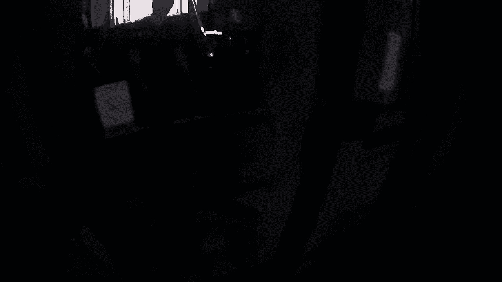
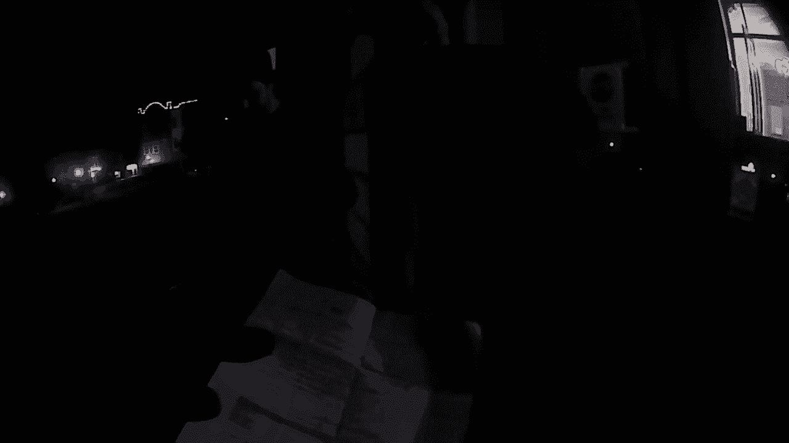
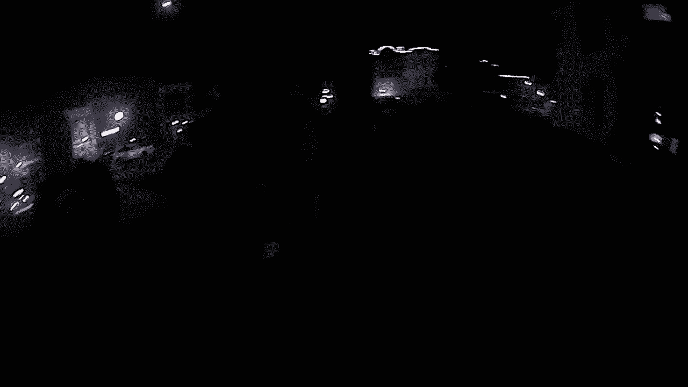
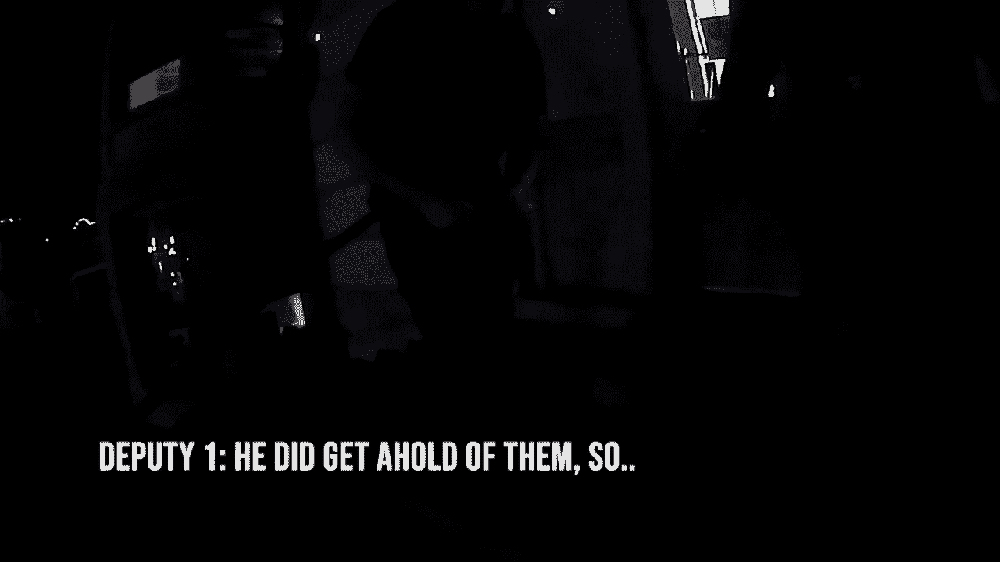
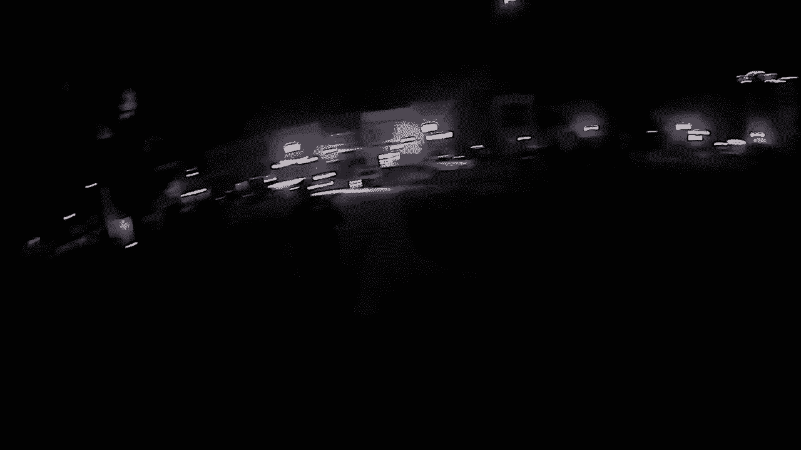
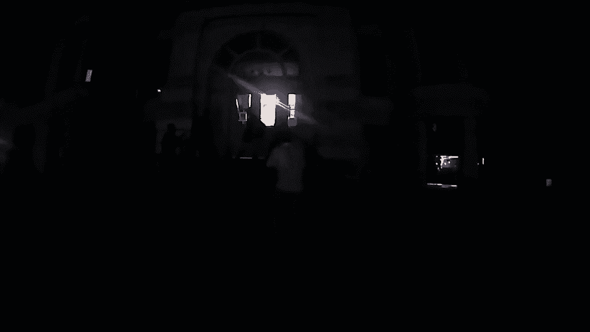
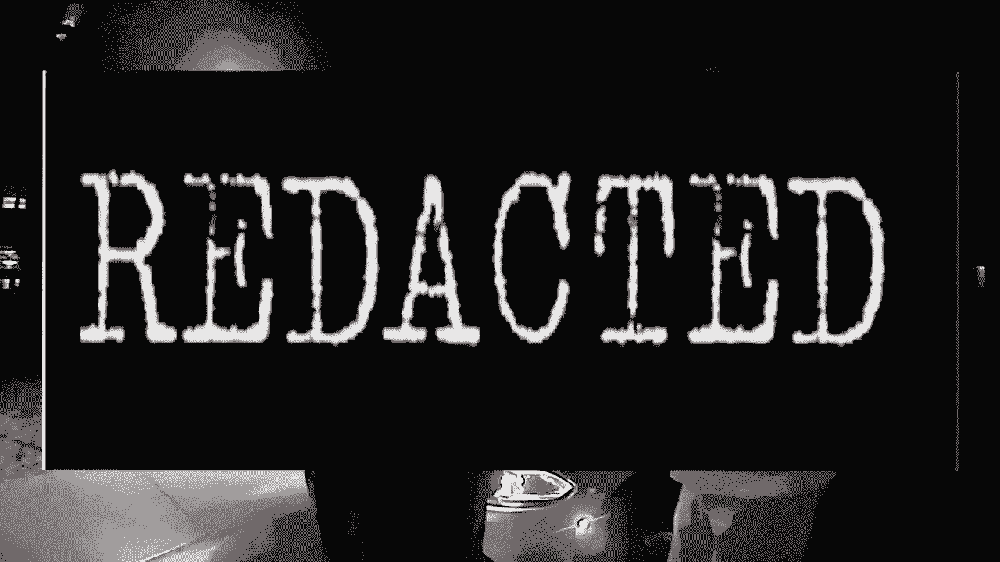
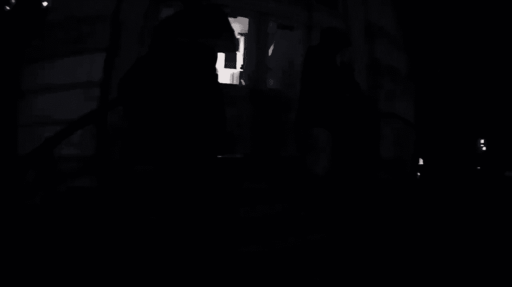
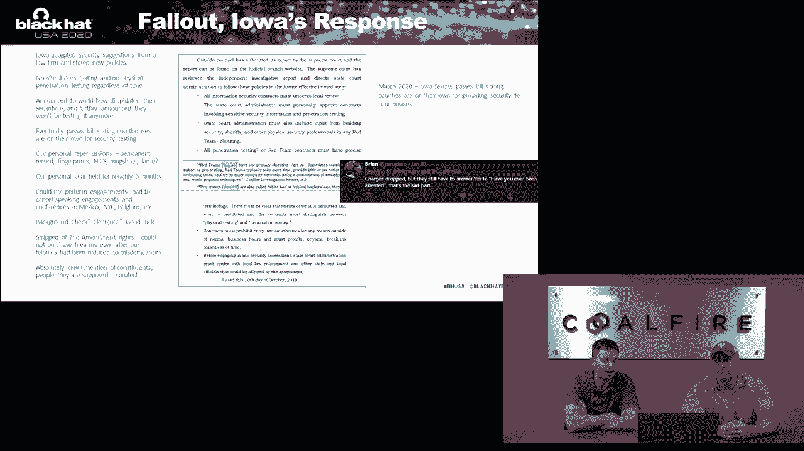
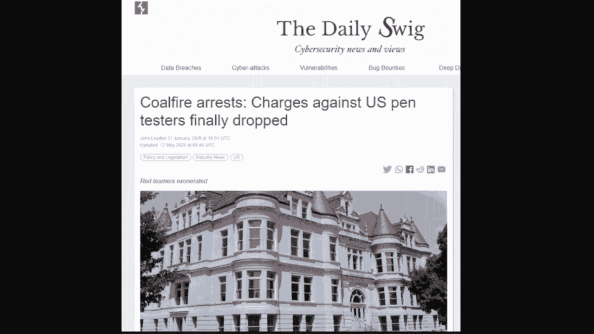

# 【转载】Black Hat USA 2020 会议视频 - P90：91 - We Went to Iowa and All We Got were These Felony Arrest Records - 坤坤武特 - BV1g5411K7fe

 Because as an employer， I don't want to see deputies going to fake calls at 100 plus miles an hour to get somewhere when somebody says I'm just checking your response time。

 That doesn't work well because if one of your family members was t-boned by a deputy， you'd be mad。

 especially when you found out it was a fake call or something like that。 They need to be arrested。

 They're going to try to break in。 A lot of them are way too。 I don't care。 You know。

 we didn't do it。 We didn't charge these two gentlemen for because we wanted to or we were trying to make a statement。

 And all these things， these comments that were being made， none of that stuff came into。

 If you look out there， I've never made a single statement here。 Never done a single press release。

 Never done anything。 You know， this is a confusing case。 Hopefully it'll wash out at the end。

 This belongs to the court for the count。 This don't belong to the state。

 The only thing I want to talk to is the judge told them they're running into jail and he said， "Oh。

 that's totally crazy。"， I'll try。 I don't know if I can。 This has any more about drugs。 Shit。

 this is bullshit。 I've never heard of this before。 This is bullshit。

 It's been a little bit of money。 The world's a dumpster fire and everybody's mind is gone and if they hadn't said something。

 these guys would have just been forgotten。 You know， then without the public pressure。

 maybe their case would have gone a different way。 I don't know。 Yeah， I think this is not。 Nowadays。

 lawyers still want to squash people and say， "Never talk。"， But if you don't talk。

 everyone else is talking for you and it gets worse and worse。 Hello everyone， I'm Justin。

 And I'm Gary。 And we are a senior security consultant with Cold Fire Systems。

 We are here today to talk to you about the Chronicles of Iowa and the events that unfolded there。

 Hopefully we're going to dispel a lot of the misinformation and myths that may have come up and come to the media's light during that while we were legally gagged。

 So without further ado， we'd like to walk you through the process。 Well， not being gagged。

 All right， so set the stage。 Let's go through some of the engagement details。

 So this is a scoping and charter process that takes place before we're ever brought on to an engagement when the client contracts with Cold Fire and they fill out some forms that have details over what they want。

 And this particular engagement， it was a red team engagement which covers all tax services。

 but the one that we're most concerned about today is the physical engagement。

 This is where the client wanted us to come on site， test security of the courthouses。

 traditional buildings， things of that nature。 And from that process。

 see if you can plant a drone on the internal network and then do the internal network penetration test down the road。

 So when we're discussing the physical engagement details， the client was specifically requesting。

 please focus on after hours testing。 We want to see what can be done in a real life scenario。

 And some of the confusion that happened in here was the hours and the daytime。

 the daytime testing versus the evening testing。 What was released in the media partially from the client's perspective was。

 well， we didn't want nighttime testing and we didn't want after hours testing was only supposed to be during the day。

 hence the day of the evening。 The reality of that story was when they first came to us。

 they only wanted physical pen testing at night after hours。 The actuality of what changed was。

 they said， after speaking to us in the charter calls， you know what。

 we really do want social engineering during the day。 We want to test some of our employees。

 We want to do it during the day。 So can we add day and evening to that testing to make sure that we encompass the social engineering。

 So the truth of that story is， originally it was night。

 we changed it and amended that to day and evening to encompass the daytime portion of the social engineering。

 And to cooperate in our story， there was actually five people on the phone。

 It wasn't just us and the client。 There was two out of the three clients came to the charter call along with myself。

 Justin。 Another pen tester actually didn't make it due to family issues。

 our project manager and the director。 All of them ended up giving out testimony。

 all corroborating our story saying this is exactly what happened just as we said it was from at least five different viewpoints from us。

 They kept all aligned in that idea。 So another point of contention that kind of cracked up again related to the hours when judicial branch accused us of being out of scope or testing when they weren't expecting it was the default boilerplate template that we have in there says we're only going to。

 type network penetration testing between six am and six pm。 We're on the calls with the client。

 of course it's understood and we communicated with them when we're doing a physical engagement。

 This is likely to occur over 24 hours of the day as long as that's amenable to you。

 And so we kind of clear that up and that's where we put that field that can be during day and evening in relation to the physical penetration testing where all the virtual stuff we've done before that was within those hours。

 Another point to that as well is the social engineer or the letter of authorization rather scoped us to begin testing on Sunday。

 So if we're coming on site to I'm able to assess government buildings。

 nothing's going to be open on Sunday， but that's when we're slated to begin again because the client wanted us to test outside of。

 the distance。 That's important。 It comes up later。 All right。

 so these are the target locations client had outlined five locations that they wanted us to assess we did walk through these individually we asked questions like who's going to be there after hours if we encounter anybody are there armed guards what's the maintenance crew look like what is what is the cleaning crew schedule look like。

 And we asked specific limitations on some of these locations。

 So some of those did arise like the criminal justice center client told us we only own a server rack inside this building。

 We do not have authorization to perform a physical penetration test。

 But what you can do is a social engineer， guys， go in。

 ask them flash the big business card so you can gain access to the server closet。

 Other than that the restrictions were placed around the judicial branch building don't access course three or four。

 maybe open and go and take a perfect concept that you guys could access that。

 but don't actually go in。 As far as anything else。

 it was full scope access for utility and try to gain access to the internal network and show us what are the vulnerabilities and find what you're on。

 In this， in this conversation that we're having with the client isn't isn't a quick conversation。

 This is line by line， building by building address by address。

 What exactly do you want us to perform in this building。 What are the hours you want us to do it。

 What's in scope。 What's out of scope。 Her building。

 So if there would have been a miscommunication which there wasn't at the time it would have been fleshed out in this call because we went building by building exactly what was in scope what wasn't in scope her building。

 Now what makes it into the actual contract is a little more generalized which is why we have the scoping call。

 Let's learn from this record your calls。 Yeah， great point。 All right。

 so we have a number of parties involved。 Of course there's coal fire the company that we work for。

 There's Gary and myself who had charges pressed individually against us。

 That makes an important legal distinction that we'll see there's a difference between the company that you're working for and when charges were pressed against us as individuals。

 You have Dallas County which was primarily comprised of Sheriff Chad Leonard and the county attorney Chuck Sonard。

 We also have the Iowa Judicial Branch。 So our three points and contacts that you're working for Mark Headley。

 John Hoover and Andrew Shirley。 And there's also going to be a special guest appearance from somebody that we'll see later in the presentation。

 All right， so now what we're going to do is we're going to run you through kind of a real quick story of events on Sunday Monday and then a little bit of Tuesday before we actually went to Dallas County to the Fabled Courthouse Sunday we hit the ground running。

 We were there again like we had said before。 Our third teammate had some some family health issues with one of his relatives and so he couldn't actually come。

 And the bad part about that is he had the drone that we were going to use so we were still waiting on the drone to come with the mail on I think it was supposed to be their Monday or Tuesday which is why we ended up going back to the Polk County Courthouse later was to set the drone in the server。

 So Sunday we hit we hit the ground running。 We we go after the Polk County Historic Courthouse。

 We get in we get in through bypassing it bypassing a door and then we hit all flags。

 We're probably there till one or two in the morning something like that。

 All the value that the customer is looking for and then some we were able to get in that single night so for the most part outside of coming back there and placing the drone。

 That was done and then Monday Justin will go into it。 Right， so we wake up the following day。

 That's our first full day while we're on site so we decided to drive by all the locations make sure the addresses match up to what we're seeing online and talk about。

 And we just verify everything's there during public hours we are able to access the judicial branch and the Dallas County courthouse during business hours we're able to walk through see some of the stuff in judicial branch for the rest were to buy an armed guard who didn't let us leave inside and then for the Dallas County courthouse it's open public access。

 we're able to see some of the floors and the purpose of that is to walk through get an idea of what we're working with so when we come back later that night we know how to approach it and what we look out for。

 So the real me of Tuesday is we enter and we reach the judicial branch actually arrive on site we're outside working on a door about 10 or 15 minutes when a state trooper arrives so this is kind of expected behavior。

 The client hadn't formed us there are patrols after hours from 5pm to 6am at this location you may run the state trooper so he arrives says hey gentlemen how's it going as we had tools inside a door。

 We look back and say hey officer how are you like great just checking what you guys were up to is this security testing we say yeah we're hired by pole fire and hired by the state judicial branch to test security some facilities here。

 He says great no problem that's pretty routine we actually do this testing regularly sometimes they give us a heads up before this this time they didn't。

 Do you have a business card is there some way you can verify yourselves so give him a business card he satisfied and that's the end of the encounter afterwards we end up making access we make entry into that building。

 We go through and again we start elevating privileges checking off findings and doors like we're looking for the best policies seeing what a malicious actor could do while we're actually inside and telling the client how to remediate those vulnerabilities。

 So throughout this process we end up getting into the IT offices where we find our point of contact desk。

 we have a business card there for him next morning first thing the morning when he walks in he sees the card and he shoots me email he says well I guess I owe you a congratulations I'll be curious to see how easy this was。

 What we didn't find out until later right at that same time he actually pulled the guys together all the points of contact they reviewed the footage they still have we got in what tools we were using what we perform while we're on site and most importantly the hours and nature of testing so offensive and nature。

 and then they didn't raise any flags they decided to call us and say hey stop testing this is what we're expecting because we were performing the contract exactly how they requested。

 And you couple that with our get out of jail free card started on Sunday and so you couple that with where they're on Sunday already outside of business hours we're already doing that now we're in this other building outside of business hours we're testing they saw us there they gave it a congratulatory email said we're really looking forward to the engagement。

 And we've already have these all these green flags as far as we're concerned that everything is going well and everything is great up to it including the state trooper that showed up on time they gave us the time he was supposed to be there and we were expecting him knowing that he could come around the corner any minute and low and low just with。

 our client told us that this trooper would be there the trooper ends up showing up and so as of right now to this point in the engagement everything is going along perfectly exactly how it was said in the term。

 We read things up on Monday night end up with the judicial branch the next day Tuesday we come back we breach a few more facilities so at that point we have reached three facilities no alarms have gone off that a prompt to law enforcement response is just kind of happenstance that we ran in the state trooper earlier。

 But we're becoming very concerned okay we're assessing government facilities no alarms are going off whatsoever and we didn't notice there is an alarm panel from our walkthrough during the daily hours at the Dallas County courthouse。

 They do have an alarm system in place we all later tonight we're hoping that alarm goes off and we actually see a police response。

 Miss Kaidan hope yes yeah。 I'm sorry it's 20。 Learn some lessons。

 All right so now to the meat of the story what everybody really wants to hear is what happened at Dallas County。

 We got there at about 11 30 on Tuesday night， 11 30 on Tuesday night which would have been September 10th。

 We walked around we did a we did just a brief walk around the building just to make sure that there was nothing wonky going on。

 We come up to the front door which by the way if you turn if you're looking at the building like this you turn around the sheriff's department is literally at our back as we're looking at the courthouse so it wasn't any surprise that the sheriff's department was right behind。

 We go and Justin grabs the door the door is actually open and we're like oh my goodness look at this but of course we're not there to walk through open doors we're there to make sure that the building once in a secure state is actually really secure。

 So Justin closes the door we're able to bypass the door we get in and we hear the initial alarm go off which is that 30 seconds or so that you have when you open the door the alarm triggers and then you've got that 30 seconds to actually punch in the code。

 We tried all the default codes that we knew offhand none of them worked and so eventually the alarm goes off in which case we said well how would you like to proceed let's just hang out wait and see if there was response because again there hadn't been any response up to this point。

 We make it to the third floor we bypass a couple doors we're in a courtroom and at which point we look out and there is a city police officer that has already spotted。

 And then we're going to do a quick response time to probably the fastest response time and give credit where credit is due the fastest response time we have ever seen。

 Like literally literally three minutes。 So we talk about a little bit about what we're going to do but we don't want to do is we don't want to surprise any police officers or get surprised by police officers。

 It's not what the scenario you want to be in so we walk out we walk to the stairwell we shout down a couple times。

 Are there any officers in the building we're here performing a security assessment and we hear nothing this probably goes on for about five to seven minutes at which point we're sitting down we're waiting we're listening for doors to open nothing ever out。

 And then we make our way downstairs and what you're going to see in this clip right after this right after this is that initial initial contact with the deputy sheriff that's on the south side of the building which is the opposite door of actually what we came in。

 What you don't see in the clip or actually hearing the clip is when we come down you'll see our hands go up like this the sheriff。

 the deputy sheriff looks at us and I say， would you like us to come out or do you want to come in。

 And he actually waves us out which is why we come to the door open the door and then we begin talking。

 All right， let's take a look at footage。 I've got him here in the south side。

 How's it going？ We just came to find where security we work with coal fire and the court system that is they're having us test all the buildings。

 Okay， all right， we don't step out here。

 Yeah， yeah， yeah。

 We're coming here at three o'clock and there's a bunch of people here。

 You guys got your IDs with you。

 I don't know what the dust was but most people。 That would be a funest job though。

 I'm sure for the good to go。

 I heard you was around。

 It goes to him。 Sounds like he guys are good。 He did get a hold of himself。

 So what you just saw there just in case you missed it is they let us go。

 He walks up to us and says you guys are good。 Everything checks out。 We talked to your contact。

 You guys are great。 The reason that we stuck around is we were actually having a really good interaction with law enforcement。

 They were asking us a ton of questions。 They were asking us how we did things。

 how we bypassed stuff， craziest stories， training war stories between law enforcement officers and us。

 It was actually a lot of fun which is why we were still sticking around。

 There was probably nine law enforcement officers on the steps of the courthouse。

 It was really jovial。 We were all smoking and joking and having a good time。

 And then that mood suddenly switches and it gets much different real quick。

 As soon as you see the sheriff arrive， body cameras start going off。

 The mood dramatically changes and we start losing a lot of professional。 So take a look at that。

 And that's what you're going to see right now is the body camera or my truck。

 So there's a guy who's to walk around and I'm going to go to bed。

 That's really good。 That's not a good。

 Maybe I better shut my videotape off。

 All right， so the sheriff has arrived on site。 This is when he decides to wrongfully arrest us。

 So his rationale behind this is that this is the county courthouse。

 The state doesn't have the authority to provide us with the authorization to assess this facility。

 And because of that， we were going to go to jail for burglary。 Now， if you know anything about law。

 you can't have burglary without intent and whether or not the judicial branch did have the authority to authorize us to perform this testing。

 They assured us that we did and we had no intent of committing a crime。

 We had intent of executing on our engagement and fulfilling the contract according to the judicial branches。

 which is now what's also interesting about this is that despite all the lectures that we were given that night about this being county property and not the state。

 there was actually， an independent review by a law firm performed at the request。

 the judicial branch that took a look at the standing statutes and history of case law in Iowa。

 And what they concluded was that it is actually likely the state that has the sole burden of providing security for this courthouse。

 So what we're going to do now is we're going to kind of set up the slide that's going to follow。

 which is actually the slide， the slide of our arrest。

 What you're going to see is you're going to see the sheriff talking to a couple of his deputies。

 His deputies repeatedly tell him that we've been extraordinarily cooperative。

 And you can see he's very flustered。 He's these throw out a lot out a lot of bad language saying that they don't have authorization that these guys really aren't professionals。

 And the reason that we want to point this out is up until the point where the sheriff arrives。

 we are treated with the utmost respect。 We are seen as professionals were seen as doing our job。

 We're questioned about our job asking us advice on how to do things。

 The sheriff shows up and now all of a sudden like we said before that mentality shifts。

 It comes to more of a group think。 And everybody starts following the sheriff's leave like， well。

 these guys really aren't professionals because they use a very simple tool to get in。

 And that obviously isn't what a professional would do。 So that that starts to change a little bit。

 And then of course you're going to see in the slide， you're going to see us get arrested。

 We're going to go through the entire process very quickly。

 I might add to the very point where the sheriff kind of makes fun of me outside in a hallway。

 And again， for somebody who said this wasn't personal and it wasn't political。

 it looks very differently。 When you see the action。 [Music]。

 [Music]， [Music]， [Music]， [Music]， [Music]， [Music]。

 [Music]。

 [Music]， [Music]， [Music]， [Music]， [Music]， [Music]， [Music]， [Music]， [Music]， [Music]， [Music]。

 [Music]， [Music]， [Music]， [Music]， [Music]， [Music]， [Music]， [Music]， [Music]， [Music]， [Music]。

 [Music]， [Music]， [Music]， [Music]， [Music]， [Music]， [Music]， [Music]， [Music]， [Music]， [Music]。

 [Music]， [Music]， [Music]， [Music]， [Music]， [Music]， [Music]， [Music]， [Music]， [Music]。

 [Music]。

 [Music]。

 [Music]， [Music]。

 [Music]， [Music]， [Music]， [Music]， [Music]。