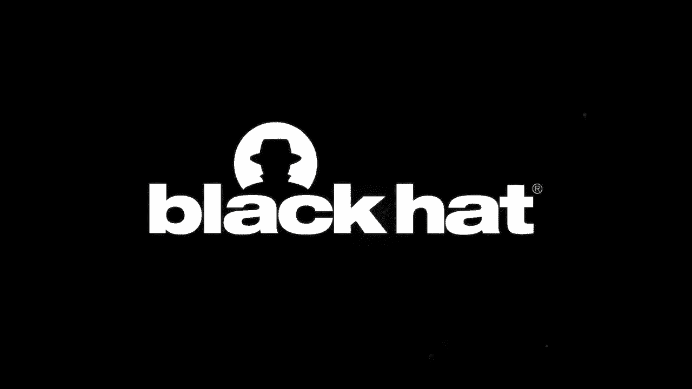
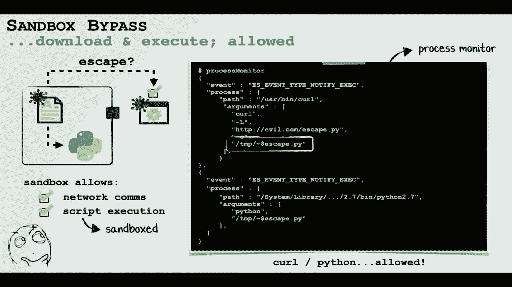
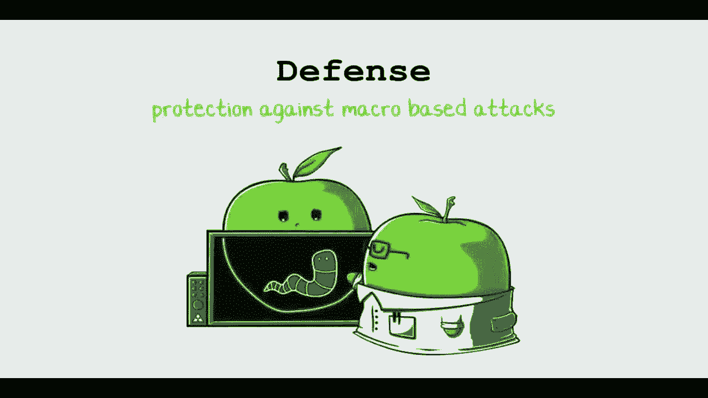
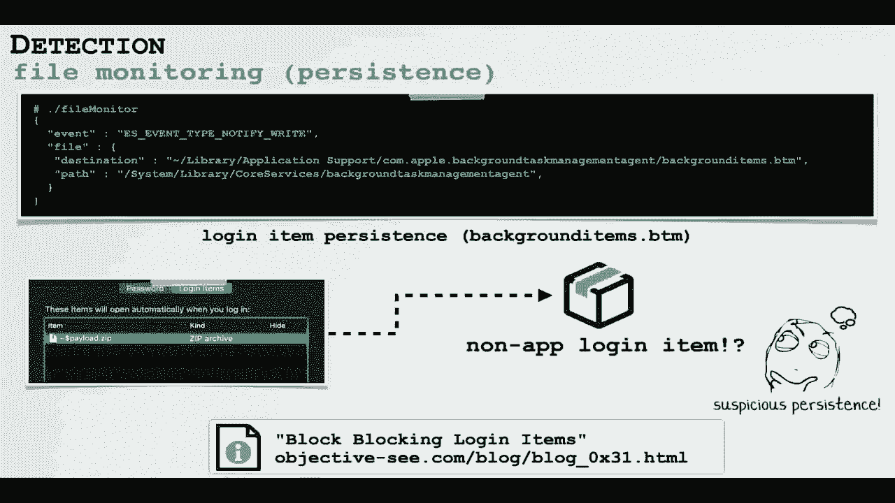
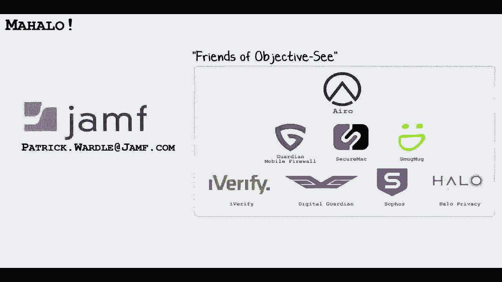

# P9：09 - Office Drama on macOS - 坤坤武特 - BV1g5411K7fe

 Aloha and welcome to my talk， Office Drama on macOS。

 My name is Patrick Wardle。 I am a Principal Security Researcher at Jamf and also the creator of the Mac Security。

 website and tool suite Objective-C。 So today we are going to be talking about malicious Office documents on macOS。

 First we are going to detail recent attacks targeting Mac users， attacks that leverage。

 macro-laced documents。 Then we will discuss methods of analyzing these attacks。

 for example how to extract the embedded， macros and also how to analyze the document payloads。

 As the current attacks are kind of lame， somewhat constrained， for example by the sandbox。

 I wanted to dig into this a little more and we will talk today about a new exploit chain。

 that combines what was at the time a handful of zero days to bypass the sandbox and Apple's。

 latest security mechanisms。 We will end by discussing generic methods to detect and thwart some of these attacks。

 Alright so let's dive in， we are going to start by looking at recent macro-based attacks。

 targeting Mac users。 Now first you might be wondering what is a macro。

 Well I have added the official Microsoft documentation on the slide but in short a macro is embedded。

 in executable code in Microsoft Office documents。 In other words it allows one as I mentioned to add executable code into a file。

 into a， document。 So as we can see on the slide what I have done is I have inserted a macro into a word。

 document that will display a pop-up that says hello world。

 Now we will talk about this more later in the talk but since I have placed this code within。

 the auto-open sub-routine if the user has enabled macro this code will be automatically executed。

 anytime they open the document。 Now from a security point of view you might be thinking this sounds like a horrible idea。

 and you are right。 Placing executable code within documents really just a terrible idea which attackers。

 have abused for years。 In fact the infamous Melissa virus which was around all the way back in 1999 you guessed。

 it was a macro virus。 Now to be fair Microsoft has added some mitigations for example alerts and sandboxing but as we。

 will see this is not fully mitigated the threat。 So traditionally these macro based attacks have targeted Microsoft windows systems due。

 to two main reasons。 First macros are a Microsoft creation and only work in Microsoft products。

 That is today they are not going to work in Apple's office apps such as pages or numbers。

 And then windows computers especially in the past were far more prevalent especially in。

 the enterprise。 Now this is definitely changing we are seeing a lot more Macs especially in the startup。

 scene and also in the enterprise as well。 So in short there are more Macs and a lot of them are running these Microsoft office products。

 which means there is just more targets for hackers。

 So now let's take a look at some recent attacks targeting Mac users attacks that leverage macro。

 based documents。 So first in this section we are going to look at these at a high level。

 In the next section we are going to dive into discussing exactly how to extract and analyze。

 the payload of these malicious documents。 So we are going to start in 2017。

 Here we have a document that appears to be about Trump's unfortunate election victory。

 If the user went to open this document and clicked allow on the enabled macro alert the。

 system would become infected。 Because in reality this was a malicious document containing malicious macros。

 Moving on to 2018 we have a document that appears to be about Bitcoin which was a very。

 hot trendy topic at the time。 Again if the user opens the document and allows macros to run the system is owned。

 Now this document is interesting and we will dig into this more shortly but the most interesting。

 aspect of this attack was that the embedded exploit code contained the ability to actually。

 bypass Microsoft offices sandbox。 Moving on to 2019 we have a document from the prolific Lazarus APT group which is normally。

 associated with North Korea。 This is interesting because we are actually now seeing APT groups jump on the hey let's。

 target Mac OS via macros bandwagon。 Again if the user opens the document and clicks allow the system will be owned。

 Alright so now let's talk about methods of analyzing these malicious documents showing。

 exactly how to extract embedded macros and how to analyze both the macro code and any。

 embedded payloads。 First we need to be able to extract the embedded macro code。

 Now the details of the file format of Microsoft office documents is kind of beyond the scope。

 of this talk but the good news is you really don't have to even worry about that。

 Turns out there are some really great tools that are able to if given a office document。

 with macros can trivially extract those macros and that's really basically all we care about。

 My favorite is a tool suite called OLE tools from GitHub。

 So we can see on the slide we downloaded the package and installed it and then we execute。

 the OLE VBA command with a -c parameter passing in the document which we suspect has embedded。

 macros that we want to analyze and the OLE VBA tool will then parse document and dump any。

 embedded macros to standard out。 There's also various online sites where you can upload a document。

 The website will then do the analysis and extract any macro code。

 Now we want to understand exactly what these malicious macros are doing。

 So let's briefly return to the documents that we discussed in the first part of the talk。

 and for each of these look at exactly what the malicious macro code is doing。

 So again starting at the one from 2018 we can use the OLE VBA tool to extract the macros。

 and I've cleaned up the macros a little bit and placed them on the screen。

 So you can see on the slide there is a subroutine called Fisher that is invoked via the auto。

 open method。 The auto open method is a Microsoft API and as its name implies any code placed within。

 this API will be automatically executed if and only if the user has enabled macros when。

 opening the document。 So if we assume the user has clicked allow to the embedded macros let's look at what。

 the Fisher subroutine does。 Again as it will be automatically executed each time the document is opened。

 So the first thing it does is it builds a base 64 encoded string and then it decodes。

 and executes that via Python。 If we manually decode this string we can see its Python code which is you know unsurprising。

 as it's passing it to Python to execute。 So what is this Python code does？

 Well first thing it does is it checks to see if popular security products for example。

 little snitch is running and then it downloads a second stage payload from security checking。org。

 Then decrypts this payload using RC4 and executes this。

 Now this code might look familiar if you spend a lot of time kind of looking at these attacks。

 and that's because this payload is actually Empire which is a well known open source Python。

 backdoor。 Now you might be wondering okay what is it downloading and executing as its second stage。

 payload。 Well unfortunately the command and control server was offline at the time I did this analysis。

 but it's likely that it's simply Empire's second stage payload which gives attackers。

 full access over the infected system。 Moving on to the bitcoin document again this one was from 2018 using the OLE VBA tool we。

 can again extract the embedded macros。 Interestingly this also contains encoded Python and what appears to be an embedded property。

 list。 That's interesting。 So let's take the closer look。

 First thing we do is we decode the Python since it's base 664 encoded it's very trivial， to do。

 You can either do that via an online site that provides base 64 decoding or I just do。

 it via the command line via a Python shell。 Once the code is decoded again we can see that on the slide it connects to an IP address。

 executes and downloads a second stage payload。 Turns out this command and control server was still online during the time of my analysis。

 so I was actually able to get a copy of this second stage payload which turned out to be。

 metastoite's retirper。 Get interesting to see attackers leveraging open source agents in second stage payload。

 Server affords remote access of an infected system。

 Now if you call the beginning of the talk we kind of said that the most interesting thing。

 about this particular document was its ability to escape out of Microsoft Office's sandbox。

 So recent versions of Office run in a sandbox which is good and it means that if code is。

 executed within the context of the process for example macro code executing within a。

 word document it is highly contained。 It's limited by what it can do it's still in the sandbox。

 So it can't do things like persist the back door or even access the user's files。

 From a security point of view this is very good。 However。

 Mac security researcher Adam Chester found a very neat way to escape the sandbox。

 and posted a guest blog about this on my Mac security website Objective。

 In short we found that Microsoft Office had a sandbox exception that was based on a faulty。

 reg X that would allow sandbox code to create a file anywhere on the system。

 So what Adam was able to do was via macro code running in the context of the sandbox。

 create a launch item that on the next login would be executed outside the context of the。

 sandbox and use a property list in order to do that。

 So I was analyzing this document and said okay this code looks very familiar and I read。

 Adam's blog and posted it on my site and it turns out that the attackers had likely。

 also read this blog and took Adam's code for verbatim and embedded it into their office， document。

 So this would mean that on unpatched systems they would be able to break out of the sandbox。

 and cause more havoc。 More mayhem。 Finally， if we extract the embedded macro code from the Lazarus group document we can。

 see it's pretty basic。 This case is not even included。 So what does it do？

 Well it simply downloads and executes a second stage persistent implant。 That implant is named MT。

dat and would give attackers persistent remote access to the system。

 However this document did not have any sandbox escape code which means if it was opened on。

 a recent version of macOS this part of the attack would fail because you can't obviously。

 persist code from within the context of a sandbox。

 So that's an overview of recent macro based attacks against macOS which gave us a pretty。

 thorough understanding of the status code。 Now let's talk about a new zero click macro based exploit chain。

 And you might be wondering why should we do this？ Well all current macro based attacks in my opinion are super lame。

 Let's list the ways。 First for any of these attacks when the user goes to open the document there is a huge alert。

 warning them that this document contains macros and they probably should not allow them。

 These are basically has to click enable。 Most won't which means these attacks will fail immediately out of the box。

 Macro code will never even be run。 Also as Microsoft has now patched Adams sandbox escape bug all the attacks remain sandbox。

 And it means even if the user does enable the macro code they are incredibly limited about。

 what they can do。 They can't persist code or access user files。

 And then finally on macOS Catalina the most recent version of macOS Apple has really upped。

 the bar and introduced some new security mechanisms such as notarization which means the second。

 stage payloads may not necessarily be even allowed to execute by the system。

 So again the current attacks my opinion basically useless。

 Now whenever companies such as Microsoft or Apple patch stuff or implement new security。

 mechanisms I like to poke on that because often they do so incorrectly insufficiently。

 So let's walk through now this kind of zero click exploit chain。

 So that's why it starts with a really neat bug that was fine I found a while ago by two。

 security researchers and then kind of improved upon by other researchers at cert。

 So this first bug is not mine。 What these researchers found was that even if macros are turned off they could create。

 a document that contained macros that would be automatically executed with no alerts no， prompts。

 That's hot。 How do they do this by abusing a incredibly old Microsoft file format called sylk files。

 held like from the 1980s before I was even born。 And they also used a macro language not written in VBA but something called XLM not XML XLM。

 Now Microsoft loves to support old file formats for compatibility reasons。

 So yeah these old four file formats still work even in recent versions specifically in XL。

 So as I mentioned the researchers found that they could create these XLM macros in these。

 sylk file formats that would be automatically executed ironically if the user had set never。

 run macros to true。 So the researchers published some great details about these older formats and some of their。

 findings so if you're interested I posted a link on the slide to their very thorough technical。

 writeups。 So what I did was I created a simple proof of concept based on their code。

 We'll see a malicious document is downloaded from the internet and when it is opened Calc。

 is automatically executed。 Now the main takeaway from here is that there are no macro alerts right no prompts nothing。

 just as soon as the document is opened calculator pops。

 Now that's well and good but as we noted on recent versions of Microsoft Office the applications。

 are sandboxed meaning sure we can pop calculator and that's neat for a demo but you know we。

 can't persist a back door we can't access the users files。

 This is the point of a sandbox that contains malicious code even if such code finds a way。

 to execute。 So in short we need a new sandbox escape in order to do any real damage。

 So I started by looking at Microsoft's patch for Adam's bug and I noticed that they actually。

 didn't fix the faulty regex instead they just simply blocked certain locations such as the。

 launch agent directory which is where Adam's proof of concept created a launch agent which。

 on the next login would be executed outside the context of the sandbox。

 So this means we can create arbitrary files as long as they start with tilde dollar sign。

 meaning they conform to this faulty regex almost anywhere。

 Again almost anywhere because Microsoft added some specific locations that they blocked。

 Now our goal of course is to execute something outside the sandbox so we can persist and do。

 evil things。 We just noted we can write specially named files to arbitrary locations from macro code。

 that's running within the context of the sandbox as Microsoft didn't fully patch that。

 Also it turns out in the sandbox we can both download and execute scripts as we can see。

 in the process monitor on the slide。 Now these scripts themselves will be sandboxed right their children of a sandbox process。

 which means themselves are also sandboxed but that's still a start right we can execute。

 for example python scripts which gives us a very extensible programming language to perhaps。

 do some sorts of evil things。 So via a python script which we again download and execute within the sandbox we can create。

 something called a login item。 Now login items are automatically executed the next time the user logs in and since it's。

 started by Mac OS instead of us via the sandbox it's not going to be sandbox。

 So when the user is logging in Mac OS goes and looks at the register login items and just。

 executes and starts all of them。 Again there's no tie back to the Microsoft office macro code sandbox nothing so that means this。

 will be executed outside the context of the sandbox。

 To confirm we can persist terminal dot app sure enough when we re log in terminal is executed。

 and if we look at it in activity monitor we can see that it runs outside the sandbox。

 So this is good right we now have a way to bypass the sandbox but unfortunately we run。

 smack into Catalina's new security mechanisms which are file quarantines and new notarization。

 requirements and an nutshell notarization basically says hey apple has to bless the file。

 before it's run。 Obviously apple is not going to bless our back door so even if we go and persist the。

 back door as a login item Mac OS will simply refuse to execute it because unfortunately。

 it is not blessed it is not not。 This is a bar and so what do we do right we got to figure out a way to bypass now quarantine。

 and notarization now hope is not lost right this is 2020 things look bleak but we got。

 to stay optimistic especially when we are looking and developing exploits because if。

 and this is a big if if we can create a launch agent we can specify arguments and persist。

 a persistent interactive non sandbox or shell via bash。

 Now this is a big if but again there's a few kind of takeaways here first being able。

 to specify arguments is huge and then also if we can specify or persist rather an interactive。

 shell it's going to be running outside the sandbox which is going to do things like allow。

 us to remove quarantine attributes which means that notarization checks will not even be performed。

 This would be great but recall that Microsoft's patch for Adam's bug explicitly blocks the。

 creation of launch agents。 Bummer。 So we kind of have like all these pieces but we just can't quite put them together。

 First grade so we can escape the sandbox via a login item but login items can't take arguments。

 and they also can't be a random binary because notarization will block it so in other words。

 all we can do is persist an apple binary again with no arguments。

 And sure we can bypass notarization by the creation of a launch agent but we can't create。

 one from the sandbox due to Microsoft's partial patch。

 So in other words what we need is a way for the system or for an apple binary with no。

 arguments is to create a launch agent for us。 This is where things get beautiful。

 So I had a random idea。 What happens if you create a login item that is not a binary or an application like what。

 happens if you persist a zip file how does the system handle that again recall we can。

 create these login items from the sandbox they can't take arguments and they can't be。

 random binaries but you know what happens if we create persist a zip file right。

 Well turns out on logging login the files default handler will be invoked which for a zip file。

 Mac OS will automatically execute the apples archive utility to unzip file basically says。

 okay this is not an executable so I'm going to invoke the handler in this case the archive。

 utility because we persisted a zip file which will extract that。

 Now we remember we want to create a launch agent but due to apples sorry Microsoft's。

 recent patch we cannot directly write to the users launch agent directory。

 Now if it doesn't exist which on a default version of Mac OS it does not we can drop。

 the zip file one directory up in the users library directory this is allowed from the， sandbox。

 So now we can place the zip file in the library directory and we can persist this as a login。

 item so we're making progress。 So what do we put in the zip file a directory named launch agents and in that a launch agent。

 property list。 So now when we persist this zip file as a login item on next login the archive utility。

 will automatically be invoked。 This is allowed because it's an apple sign process and it will run outside the context。

 of the sandbox which means it can do things like unzip our file and create the launch。

 agent directory and our launch agent property list for us。 That is awesome。

 So this completes the full exploit chain。 The user starts by opening this slk file containing the xlm macro which will execute automatically。

 again no alert they just open the document。 This downloads and persists the specially crafted zip file as a login item。

 On next login the archive utility will be automatically invoked and in the background。

 will extract this zip file thereby creating a launch agent for us。

 But on next login the login agent will be automatically executed with our arguments which。

 we can put in the property list and will execute our bash based interactive backdoor。

 So this batch backdoor runs outside the sandbox meaning it can download and unquarantine files。

 Unquarantine files are not constrained by apple's notarization requirements。

 So we have this interactive shell outside of the sandbox。 What do we do？

 Well we decided to persist something and I thought it would be extra funny to persist。

 a repurposed clearly not notarized version of wind tail。

 And you can see on this slide when I finally got this all working in the slack channel。

 that will work I was clearly pretty stoked。 Alright so let's now talk shift gears and talk about defending against these attacks。

 and some generic methods of detection。 First thing as a responsible security researcher I reported all these vulnerabilities to Microsoft。

 and Apple。 Microsoft responded and said this is a known issue on the apple side and I was like well。

 yeah because I told Apple as well。 So I have no idea what Microsoft did no CDE no bug bounty bomber。

 Apple said thank you for your reports and then nothing。

 I waited a long time and checked back in with Apple and they said oh yeah we patched that。

 back in you know 10。15。3。 Again no CDE no bug bounty classic Cupertino。

 Let's talk briefly though about how to detect this these attacks and perhaps other Mac malware。

 as well。 So the first thing let's talk about is process monitoring leveraging Apple's new endpoint。

 security framework。 It turns out it's pretty easy to create a process monitor to detect something I call。

 suspicious children suspicious children processes。

 As we can see on the slide we can now detect when an office application for example Excel。

 spawns a child process that is well suspicious。 So regardless of the reason you know of the exploit if it was a macro buffer overflow if。

 you see Excel spawning curl and then Python you know that's bad news something is a miss。

 We can also detect a wide range of attacks including the exploit chain we just talked。

 about this by monitoring the file system for persistence。

 Persistence is just the way that malware or perhaps an exploit chain escapes out of the。

 sandbox or ensures that it's automatically re executed when the system is rebooted or。

 the user re logs in。 So again we can use Apple's new endpoint security framework and we can monitor for files specifically。

 related for ones to persistence。 So here for example on the slide we can detect now that a login item was created that does。

 not point to an application or a binary which is normally the case when a login item is。

 created but instead to a zip file。 This is a huge red flag and kind of you know shows that our exploit is excuse。

 So at JAMP we implement such monitoring logic in a framework we call monitor kit。

 We then feed that monitoring data as well as our analytics and rules into Apple's game。

 logic engine for evaluation。 This gives us a powerful endpoint detection capability uniquely tailored for Mac OS and。

 kind of neat not to really brag but based on our current rules we were actually able。

 to detect this exploit chain with no a priority knowledge。 Pretty。

 Alright so let's wrap everything up。 So today we kind of talked about the current state of affairs in the land of macro based。

 attacks and we showed that they are becoming more and more popular in the sense of targeting。

 specifically Mac OS users but luckily current attacks are rather late。

 However we should not be involved into a sense of complacency because you know showed us。

 pretty easy to actually create a zero click exploit chain that if the user would open。

 a document would both escape the sandbox and bypass all of Apple's recent security mechanisms。

 Again at the time on a fully patched Mac OS system。

 However we ended by showing that by leveraging Apple's new endpoint security framework we。

 can generically detect these and other attacks。 I really want to thank a variety of people first and foremost you all for virtually attending。

 my talk。 Hope you're all staying safe and healthy。

 Also to JAP for putting up with my many shenanigans and also all the amazing companies that support。

 Objective C。 Oh and one more thing。 Today I am announcing my new book The Art of Mac Malware Analysis。

 My dog is very excited about it as well。 I published the first part online at taumm。

org and the rest of the chapters will be published， shortly as well。 All 100% free。

 Sharing is caring。 So if you're interested in learning more about Mac Malware， exploits。

 persistence， debuggers， this is assembling check out the site。

 So again that is a wrap thank you so much for attending my talk and hopefully see you in。

 person at Black Hat 2021。 Aloha。 Well thank you for attending my talk。

 We now have live Q&A session so if there's any questions about my research or my talks， ask away。

 Okay， great。 I saw me on Twitter earlier that said you're on mute in the name of 2020。

 Thank you for attending and for the feedback。 Like we said we will put up the slides online。

 So this question from Sean that says how did you come up with ideas for research， start。

 with existing exploit or try to come up with something new。 So that's a great question。

 So I was kind of looking at these macro based attacks， these document based attacks and seeing。

 if they would be kind of still a threat and luckily because all the patches were applied。

 they were as we mentioned kind of not really going to work against patched systems。

 So what I did was started kind of looking and you know where to get the idea that I said。

 okay we needed the sandbox escape so I looked at Adam's base sandbox escape and instead of。

 you this is a good place to start let me see how Microsoft fixes this。

 This is actually a really good approach。 A lot of times vendors will patch vulnerability but that won't do so in maybe the best of。

 ways。 For example they will patch one specific code path but not actually really address the。

 systemic underlying calls and that was exactly what happened in this case。

 So basically look at how Microsoft patched it and that was the idea you know looking at。

 the patch for the existing escape and then I saw it wasn't really comprehensive so that。

 allowed me to find this sandbox escape。 Then I basically said okay I need to create a way to kind of break out or get around Apple's。

 notarization requirements and you know I just really kind of thought long and hard about。

 it for a few different days and there have been some previous research using the archive， utility。

 So what I try to do is really just say a breast of other people's security research and then。

 also look at how vendors patch and fix things。 So when I find a bug or kind of need pieces to put an exploit chain together I kind of。

 have all these ideas and generally something falls together。

 So great question that's kind of where I get the questions。

 Next question why did you not assign CDEs？ That's actually a great question。

 So you know like I said our report of this vulnerability to Apple they said this issue。

 was not CBE worthy。 Apple's prerogative apparently you know they've given me CDEs in the past so I'm not sure。

 exactly what the reasoning was。 They're an ask for clarification。

 They basically said that they provided some mitigations to prevent the sandbox escape。

 I would obviously argue that a generic sandbox escape that allows you to break out of an。

 app sandbox and persist unsign knowledge。 The security risk which probably should have a CDE but Apple did provide a mitigation but。

 you know under incident wisdom decided not to give a CDE。

 So yeah maybe I could see if I can apply myself a CDE。 That's actually a great idea。

 I'm sure maybe Apple really happy。 Alright next question。

 Try to ask are you seeing an increase of max and just cyber tax increasing on a macro。

 standpoint as well。 If so could it be correlated with work from home？

 So we're seeing this definite trend of increase of max in the enterprise。

 I think this is driven by a few different reasons。

 One is you go to any college campus walk into a classroom pretty much everyone is using， max。

 So that trend probably started maybe five years ago and as those college graduates graduate。

 into the workforce a lot of them want to use max computers。

 Microsoft computers are maybe seen as a little more outdated so maybe that's one driver。

 Also Apple has definitely made a lot of pushes into the enterprise so if you're not seeing。

 max in the enterprise。 Hackers are very opportunistic。

 I have taken notice of this trend so they're starting to take their windows based tax factors。

 for example macro based attacks which they had great success targeting videos PCs and。

 say hey look max in our common in the enterprise。 Yes。

 especially now is people are more working from home a lot of people have personal max。

 that they can now use for their work job enterprise network。

 And so we're definitely seeing a trend and this talk was kind of illustrative of that。

 where they're bringing their traditional window based attacks and infection vectors for example。

 macros and now are specifically targeting that user。

 So this is a trend I expect to see both the creation of brand new max specific infection。

 vectors and attacks scenarios but also attackers bringing their proven windows based techniques。

 and it's possible porting those to target。 Next question。

 Have you looked at other apps that have minimal or weekend runtime configurations？

 For example Firefox has somewhat weak defaults。 That's actually a really good question。

 And the question is basically asking about applications sandbox profiles and also how。

 they are compiled。 So in Catalina Apple introduced this concept called the hard and runtime I believe was。

 in Catalina where applications can basically be recompiled with these extra protections。

 for example that prevent dilated injection attacks or other injection based attacks。

 But this means that the applications have to kind of opt in and be recompiled。

 So what I do is I look at a lot of applications and for ones that are not compiled with this。

 hard and runtime really opens up a raw attack。 Recently I looked at zoom so probably now four or five months ago and it turned out。

 they had an exception in their hard and runtime configuration that allowed for the loading。

 or injection of arbitrary dynamic libraries。 Zoom was an interesting case study because on a system they are granted access to the。

 mic and the webcam。 However because they had this weak kind of hard and runtime policy I or any malware that。

 was existing on the system could piggyback off of zoom's kind of weak hard and runtime。

 configuration and loaded dynamic library into the process context of zoom。

 Since zoom was allowed to access the mic or the webcam the malicious dynamic library which。

 is running now within zoom could also do that。 So really good point is really good to look at applications that are configured with without。

 a hard and runtime or also if they are configured with the sandbox take a look at their sandbox。

 policy。 For example in this talk the reason we were able to break out of the office sandbox was。

 specifically because of kind of an exception in Microsoft sandbox policy。

 So that's always a really good thing to look at。 So really good question。

 Next question can you compare or trust the new security features native to Catalina versus。

 Jamf implementation。 I'm not sure about that but let me at least talk a little bit about Catalina's new security。

 features and then I can also talk about what we do at Jamf to benefit or leverage those。

 in our endpoint security policy。 So Catalina does a lot of great things。

 We mentioned the notarization that will stop a lot of attacks where the users basically。

 tricked into running a piece of malware。 I'm sure you're all familiar with like hey browser website pop up saying flash is out。

 of date downloaded install is flash update。 Obviously it's generally on flash it's malware。

 So in this case the user is basically tricked or socially engineered into affecting themselves。

 So notarization will now block these attacks which is really good。

 So that's probably the main feature security feature I see at least in the context of malware。

 But as we showed in this talk exploit based attacks which we'll probably see an uptick。

 in are generally able to bypass the notarization constraints。

 There's also some very creative adware now where that we've seen that basically instructs。

 the user how to bypass the notarization。 So if you kind of like right click on the file and click open it'll give you a prompt。

 that says hey are you sure you want to allow this and we can click okay even if the application。

 or the package is not no less。 So we've seen now are basically instruct the user how to install that。

 So there are ways to kind of bypass there's still maybe some gaps。

 So what we do at Jamf is as I mentioned we leverage Apple's new endpoint security framework。

 which is also a new security feature of Catalina。 And this allows us to very efficiently do things like monitor from processes。

 monitor for persistence， attempts。 So for example if we see a process being started that is unnotarized that's something we're。

 going to flag。 Like we don't care how it was run if it was the user kind of right clicking and launching。

 it kind of sidestepping the Catalina requirements or if it was an exploit like the one we talked。

 about today。 We basically just don't care we're basically saying hey look unnotarized code is running。

 you know this is normally block clearly the attacker or the malware found a way of alumnus。

 You know it would be interesting to figure out how and why but right now let's block that。

 because that's not something that normally shouldn't run。

