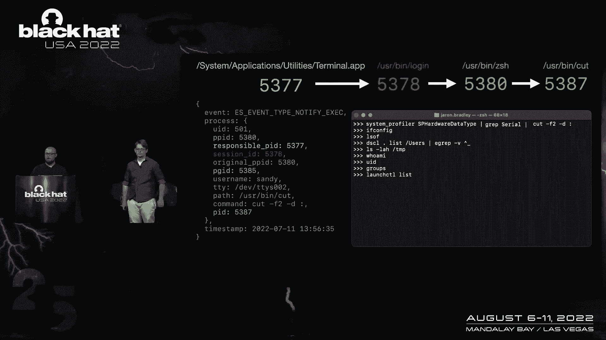
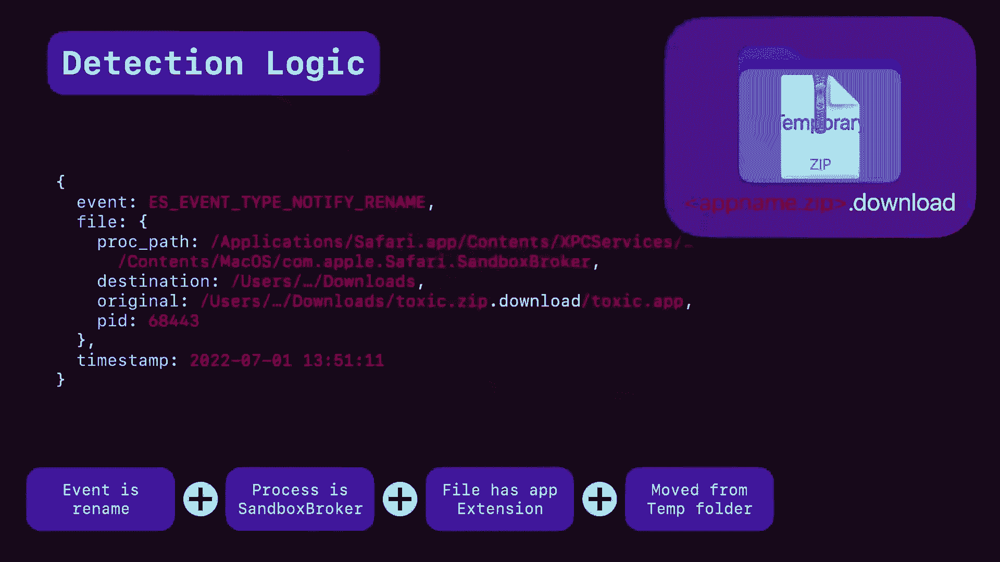

# 课程 P1-001：利用 Apple 端点安全框架进行行为检测 🛡️

在本节课中，我们将学习如何利用 Apple 的端点安全框架来检测 macOS 设备上的可疑行为。我们将从了解 ESF 的基础知识开始，逐步深入到具体的检测技术和实际案例。

## 概述：什么是端点安全框架？

如果你正在为 macOS 构建端点安全工具，你需要两个基本能力：一是获取用于分析和检测的事件信息，二是对检测到的威胁采取行动的能力。历史上，这需要通过开发内核扩展来实现，但这种方式开发困难且容易引发系统不稳定。

为了保护内核并满足安全供应商的需求，苹果推出了**端点安全框架**。ESF 在用户空间提供服务，提供丰富的事件信息源和行动控制能力，而无需增加内核的不稳定性。供应商现在可以构建存在于用户空间中的系统扩展。

当一个事件发生时，内核会将信息发送给所有订阅了该事件的第三方系统扩展。大多数 ESF 事件有两种类型：**通知事件**和**授权事件**。通知事件仅用于告知扩展发生了什么，而授权事件则可以决定是否允许该活动继续进行。

## 从静态检测到行为检测

静态检测（如检查文件哈希、团队 ID 或使用 Yara 规则）是检测已知恶意软件的有效手段。ESF 的授权事件机制能很好地配合静态检测，在程序执行被暂停的短暂窗口内快速扫描并决定是否放行。

然而，静态检测无法识别从未见过的恶意软件或新的活动模式。这自然引出了我们课程的重点：**行为检测**。

行为检测通过建立正常应用程序活动的基线，来识别更广泛的可疑活动模式。虽然它可能产生更高的误报率，但能有效发现新型恶意软件或未知的攻击模式，这是一个值得的权衡。

## 行为检测实战案例

以下是几个利用 ESF 数据进行行为检测的具体案例。

### 案例一：伪装文件扩展名

在这个例子中，用户在临时目录中发现了一个名为 `letter.pdf` 的文件。仅凭临时目录中的 PDF 文件就足以引起怀疑。

但进一步检查会发现，这实际上是一个 `Mach-O` 可执行文件，伪装了文件扩展名。攻击者使用这种矛盾的文件扩展名来混入用户的文件系统。

我们的检测逻辑是：监控在临时目录中创建或写入文件的行为，并进行额外检查以确定其是否可疑。例如，可执行文件使用 `.pdf` 扩展名本身就值得关注。如果再结合其他可疑特征（如奇怪的字母文件名），就可以创建一个更可靠的检测规则。

### 案例二：伪装成苹果的启动代理

在 macOS 中，启动代理通常会在系统启动时运行。苹果鼓励开发者使用反向域名表示法（如 `com.apple.diagnosticd`）来命名。

恶意软件作者也发现了这一点，他们开始将自己的恶意守护进程和代理命名为 `com.apple.xxx`，试图融入操作系统。

我们的检测逻辑如下：
1.  首先，检测在用户启动代理目录中添加新属性列表文件的行为。
2.  然后，检查文件名是否使用了 `com.apple` 标识符。
3.  接着，查看该属性列表文件中指定的、将在登录时运行的可执行文件路径。
4.  最后，对该可执行文件进行代码签名检查。如果它使用了 `com.apple` 标识符，我们期望它也是由苹果签名的。如果返回“未签名”或签名不匹配，则可以自信地触发检测。

多年来，这一直是非常可靠的检测方法。

### 案例三：利用进程上下文进行威胁狩猎

假设你在日志中看到了一个进程执行事件，例如简单的 `cut` 命令。单看这个命令本身没有太大意义。

我们可以利用 ESF 事件中的其他字段来获取上下文：
1.  **父进程ID**：可以找到运行 `cut` 命令的进程，通常是某个 shell（如 `zsh`）。
2.  **负责任进程**：可以追溯到启动该 shell 的 GUI 应用程序（如 `Terminal.app`）。
3.  **进程组ID**：可以找到该命令所在的进程组领导者。通过搜索共享同一进程组ID的所有进程，可以重建完整的命令执行链。例如，可能发现 `cut` 命令是 `system_profiler` 命令管道的一部分，用于获取设备序列号。
4.  **会话ID**：可以指向控制这些进程组的进程，例如 `login` 进程。

通过综合利用这些 PID 字段，我们可以从单个 `cut` 命令事件，还原出在终端中运行的完整命令历史及其上下文。

### 案例四：检测“离地生存”技术

攻击者常使用“离地生存”技术，例如将脚本托管在服务器上，然后通过 `curl` 直接管道传输给解释器执行。这样做不会在磁盘上留下恶意文件，从而规避静态检测。

使用 ESF 数据跟踪此类活动：
1.  寻找解释器（如 `osascript`）的执行事件。
2.  检查其命令行参数。如果解释器是直接运行而没有附加脚本文件，这是一个重要迹象。
3.  查看该解释器进程的**进程组ID**，通常会引导我们找到 `curl` 命令。
4.  一旦建立 `curl | osascript` 这样的链接，我们就可以高度确信发生了离地生存攻击。

### 案例五：检测利用 `mdfind` 的数据窃取

`mdfind` 是 Spotlight 搜索的命令行工具。攻击者可以利用它快速查找包含敏感关键词（如“密码”、“机密”）的文件，并立即将其打包归档。

检测方法：
1.  寻找内置归档工具（如 `tar`）的执行事件。
2.  检查该 `tar` 进程的**进程组ID**，通常会引导我们找到 `mdfind` 命令。
3.  一旦建立 `mdfind | tar` 这样的命令链，就有理由相信攻击者正在窃取数据。

## 高级检测：针对零日漏洞的检测

我们还将探讨一些针对已修补零日漏洞的检测方法，这些方法能确保在漏洞被利用时及时发现。

### 检测一：Gatekeeper 绕过漏洞

去年发现的一个漏洞允许未签名的应用程序绕过 Gatekeeper 检查。攻击者可以将恶意软件伪装成应用程序，并利用该漏洞在用户双击时直接执行，而不会触发安全提示。

该漏洞适用于满足以下条件的应用程序：不包含 `Info.plist` 文件，且使用脚本作为主有效载荷。

我们的检测逻辑围绕单个 `exec` 事件展开：
1.  检查父进程是否为 `launchd`。
2.  检查命令行参数中是否包含 `.app/Contents/MacOS/` 字符串，以确认正在处理应用程序包。
3.  检查正在运行的进程是否是内置解释器（如 `bash`、`zsh`、`python`）。
4.  检查可执行文件是否为脚本文件（而非 Mach-O 二进制文件）。
5.  检查该应用程序是否正在被 Gatekeeper 进行“应用程序易位”分析（这是 Gatekeeper 检查的一部分）。

当所有这些条件同时满足时，我们就能检测到该 Gatekeeper 绕过漏洞正在被利用。

### 检测二：TCC 权限绕过漏洞

TCC 是 macOS 的透明、同意和控制框架，用于管理应用程序对麦克风、摄像头、屏幕录制等敏感资源的访问。一个漏洞允许恶意应用程序通过嵌套在已获得权限的“捐赠者”应用程序中，来继承其 TCC 权限。

检测逻辑：
1.  查找正在打开的应用程序执行事件。
2.  检查该应用程序是否嵌套在另一个应用程序包内。
3.  分别检查外部应用程序和内部应用程序的代码签名信息。
4.  在合法情况下，两者的签名信息应匹配（例如，都由 Zoom 公司签名）。如果内部应用程序是临时签名、签名不匹配或根本没有签名，则表明可能存在 TCC 权限滥用。

### 检测三：Safari 自动解压导致的 Gatekeeper 绕过

此漏洞涉及 Safari 的“下载后打开安全文件”功能。在自动解压某些特殊构造的 ZIP 文件时，Gatekeeper 必需的“隔离”属性可能无法正确应用到应用程序包本身，从而导致其绕过安全检查。

检测逻辑：
1.  监控文件重命名事件，寻找 Safari 沙箱代理将新应用程序从临时目录移动到下载文件夹的时刻。
2.  确认执行该操作的是 `com.apple.Safari.SandboxBroker`。
3.  确认被移动的文件是一个应用程序（`.app`）。
4.  确认原始路径是沙箱代理创建的临时目录。
5.  最后，检查该应用程序文件是否缺少 `com.apple.quarantine` 扩展属性。

这个检测的有趣之处在于，它通过观察内置安全系统是否按预期工作，来一般性地检测 Gatekeeper 是否被绕过，即使我们不知道具体利用的技术细节。

## 总结

本节课我们一起学习了如何利用 Apple 的端点安全框架进行高效的行为检测。我们从 ESF 的基础讲起，了解了它如何提供丰富的系统事件。然后，我们探讨了从简单的文件属性检查到复杂的进程链分析等多种行为检测技术，并通过多个实战案例加深理解。最后，我们还研究了如何针对特定的零日漏洞构建检测规则。

ESF 的强大之处在于，苹果可以专注于提供操作系统的可见性，而安全开发者则可以专注于利用这些事件信息，构建强大的检测引擎和响应机制。这使我们能够更有效地发现和应对 macOS 平台上的新兴威胁。