# 课程 P10：010 - 我是我所说的我：利用0点击漏洞渗透身份提供商 🎯

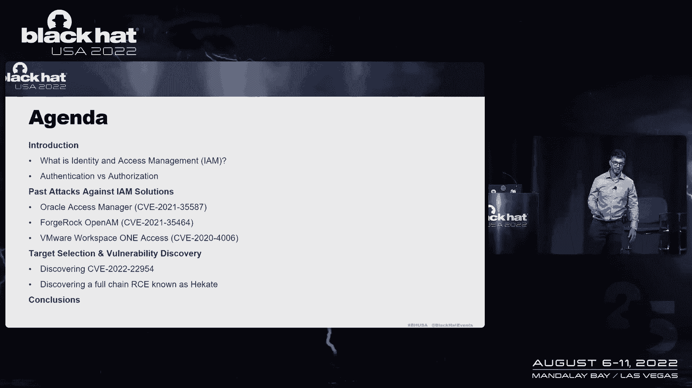

在本课程中，我们将学习身份与访问管理（IAM）系统的基本概念、常见攻击面，并通过分析几个真实案例来了解如何发现和利用其中的关键漏洞。我们将重点关注无需用户交互的“0点击”攻击，并理解其背后的原理。

---

## 什么是身份与访问管理（IAM）🔐

身份与访问管理是将身份验证和访问授权功能集成到一个统一解决方案中的技术。它包含两个核心部分：
*   **身份验证**：验证“我是我所说的我”。用户向系统提交凭据，系统验证这些凭据。这通常通过密码认证或联邦认证（如单点登录）完成。
*   **访问授权**：验证已认证用户的权限或特权。这通常使用 OAuth 或 OpenID Connect 协议，并结合 JWT 令牌。

IAM 系统是攻击者的主要目标，因为它：
*   是一个集成了认证和授权的技术栈。
*   通常部署在网络边界。
*   使用复杂的协议栈。
*   一旦被攻破，攻击者就获得了通往组织内部系统的“万能钥匙”。

---

## 高级联邦身份验证流程 🔄

上一节我们介绍了 IAM 的基本概念，本节中我们来看看联邦身份验证的具体步骤。以下是其典型流程：

1.  用户通过服务提供商请求资源。
2.  服务提供商将请求重定向到身份提供商。
3.  用户向身份提供商发送认证请求。
4.  身份提供商验证请求并发回签名的响应。
5.  服务提供商验证响应并授权用户访问资源。
6.  服务提供商向用户返回所请求的资源。

---

## OAuth 2.0 授权流程 🔑

与身份验证不同，OAuth 2.0 授权流程发生在用户已经认证之后。以下是其关键步骤：

1.  已认证的用户向应用程序请求访问特定资源的权限。
2.  用户通过弹窗等方式同意授权。
3.  应用程序获得授权码，并向授权服务器请求访问令牌。
4.  应用程序使用访问令牌获取对资源的访问权。

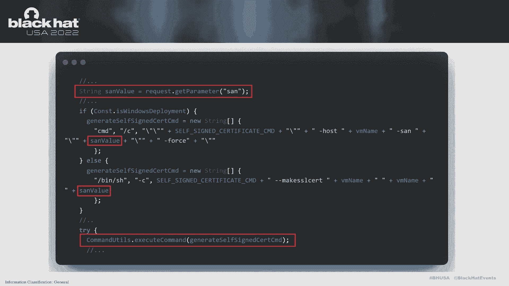

这里有一个关键区别：身份验证（如 SAML）通常在服务器端完成，而授权（OAuth）混合了客户端和服务器端组件。

---

## 常见的 IAM 攻击面 🎯

基于上述流程，我们可以识别出 IAM 系统的几个主要攻击面。

**对于基于 SAML 的身份验证：**
*   存在 **XML 税**，可能引发 XXE、SSRF 等漏洞。
*   存在令牌传递漏洞，如缺失签名验证、签名验证绕过（利用 XML 签名包装或 XML 规范化）。

**对于基于 OAuth 的授权：**
*   存在客户端攻击，攻击者可能通过 XSS、CSRF、开放重定向或点击劫持来窃取授权码或访问令牌。

---

## 历史漏洞案例分析 📜

现在，让我们回顾几个针对具体 IAM 产品的历史漏洞，以理解攻击者的思路。

### Oracle Access Manager 反序列化漏洞 (CVE-2021-35587)
这是一个预认证的反序列化漏洞，允许在 OAM 11g 上实现远程代码执行。有趣的是，由于代码重构，Oracle 在 OAM 12g 中无意间删除了易受攻击的端点，从而意外地修补了漏洞。

### ForgeRock OpenAM 反序列化漏洞 (CVE-2021-35464)
此漏洞存在于一个第三方库 `Jato` 中。攻击者可通过 `jato.pageSession` 参数传递恶意数据，触发反序列化，实现预认证的 RCE。修补方式是从产品中移除易受攻击的库。

### VMware Workspace ONE Access 命令注入漏洞 (CVE-2022-22954)
这是一个通过证书生成功能触发的命令注入漏洞。攻击者可以控制 `SAN` 参数，将其嵌入到系统命令中。该漏洞需要管理员权限，且针对管理端口（8443），并有 CSRF 保护。VMware 通过实施严格的白名单输入验证来修补此漏洞。

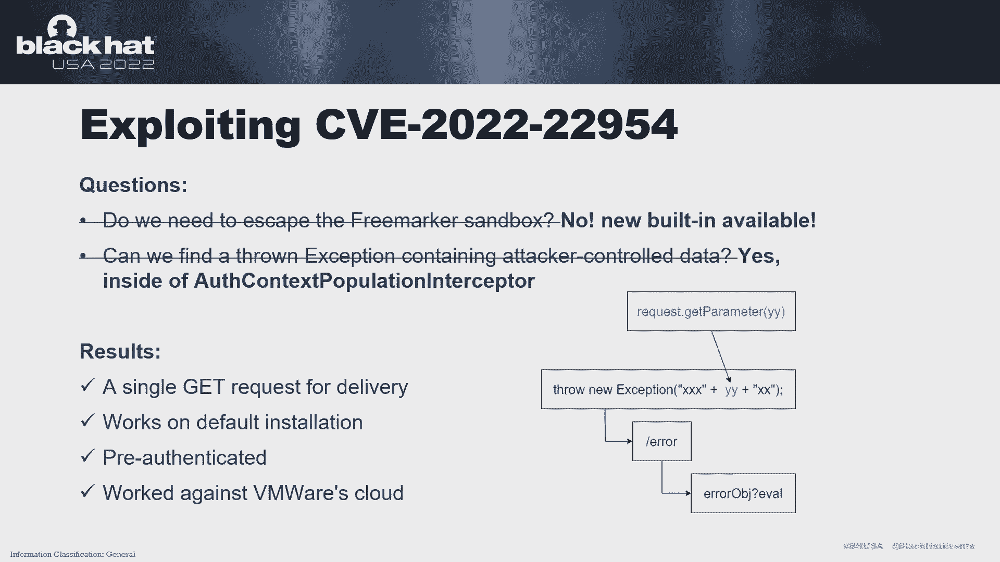

---

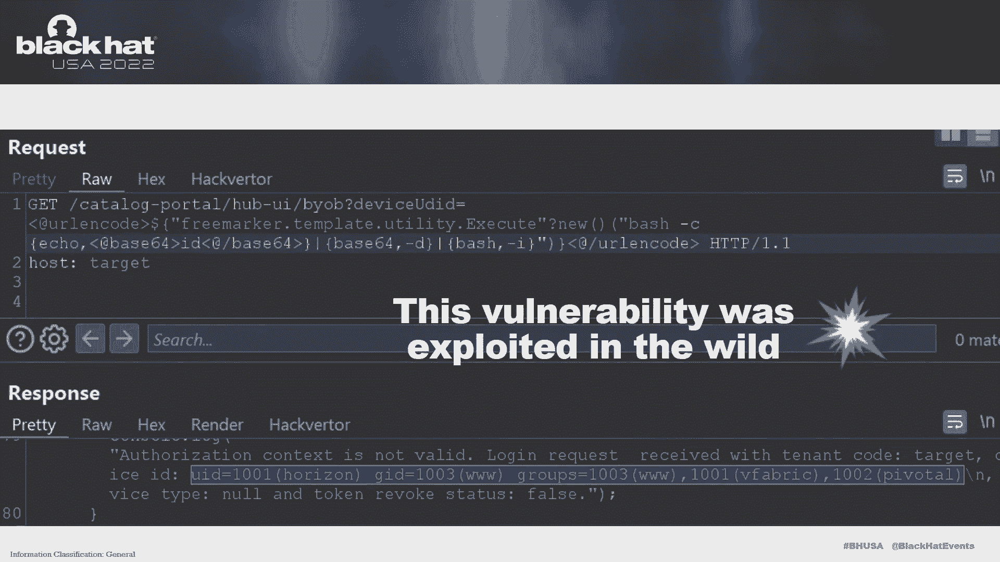

## 漏洞发现：VMware Workspace ONE Access 模板注入 🕵️

上一节我们回顾了历史案例，本节我们将深入探讨一个具体的漏洞发现过程，即 CVE-2022-22954 的发现。

我在测试一个 API 端点时，通过发送特殊字符触发了 500 错误。服务器返回的堆栈跟踪提到了 FreeMarker，这让我怀疑可能存在模板注入。

经过分析，问题根源在于 Spring 的错误处理机制。当应用抛出异常时，会由 `UiErrorController` 处理，并渲染一个自定义的 FreeMarker 错误页面。攻击者可控的错误信息被传递到了这个模板中。

进一步调查 Spring 配置发现，虽然默认启用了 FreeMarker 沙箱，但开发者遗漏了两项关键配置：
1.  未禁用 `setNewBuiltinClassResolver`，允许实例化特定类。
2.  未禁用调试模式，导致泄露敏感信息。

因此，攻击者无需绕过沙箱，可以直接利用 `new` 内置函数。接下来需要找到一个能注入可控数据的异常点。我检查了 Spring 拦截器，发现 `AuthContextPopulationInterceptor` 会从请求参数中获取 `deviceId` 和 `deviceType`，并在验证失败时将其包含在异常信息中抛出。

至此，所有条件齐备：一个可触发异常并注入数据的预认证端点，以及一个可利用的 FreeMarker 配置。最终的攻击 payload 形如：
`GET /endpoint?deviceId=123&deviceType=<#assign ex="freemarker.template.utility.Execute"?new()>${ex("id")}`

---

## 漏洞利用链：CAT 三重奏 🎻

有时，单个漏洞不足以达成目标，需要将多个漏洞串联起来。CAT 利用链结合了客户端和服务器端漏洞，这里我们聚焦服务器端部分。

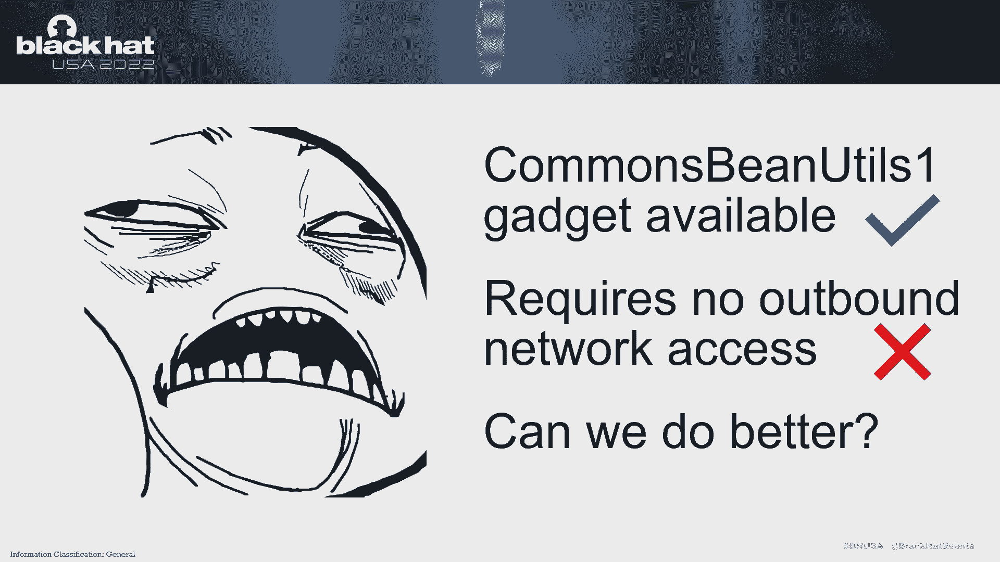

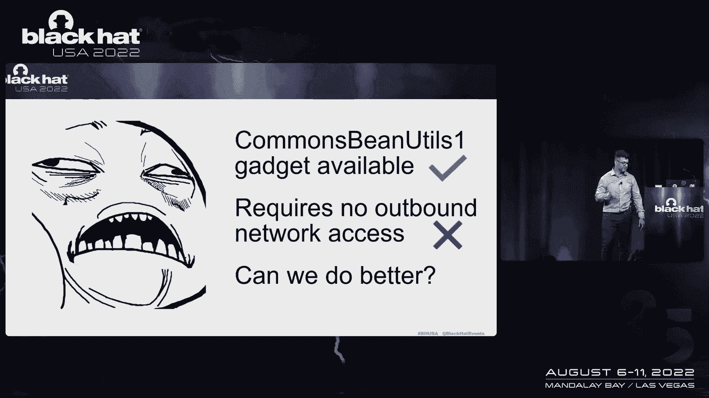

**第一步：OAuth 客户端认证绕过**
VMware 的 OAuth 实现存在缺陷，暴露了 `generateActivationToken` 和 `activate` 端点。攻击者可以：
1.  为默认的 `acs` 客户端请求激活令牌。
2.  使用该令牌激活客户端，获取客户端密钥。
3.  使用客户端密钥，以 `client_credentials` 模式直接申请系统或管理级别的访问令牌，完全绕过用户认证。

**第二步：JDBC 注入实现 RCE**
获取高权限令牌后，攻击者可以利用另一个端点实现 RCE。`DbConnectionCheckController` 的 `dbCheck` 方法将用户输入的 JDBC URL 直接传递给 `DriverManager.getConnection()`，存在 JDBC 注入漏洞。

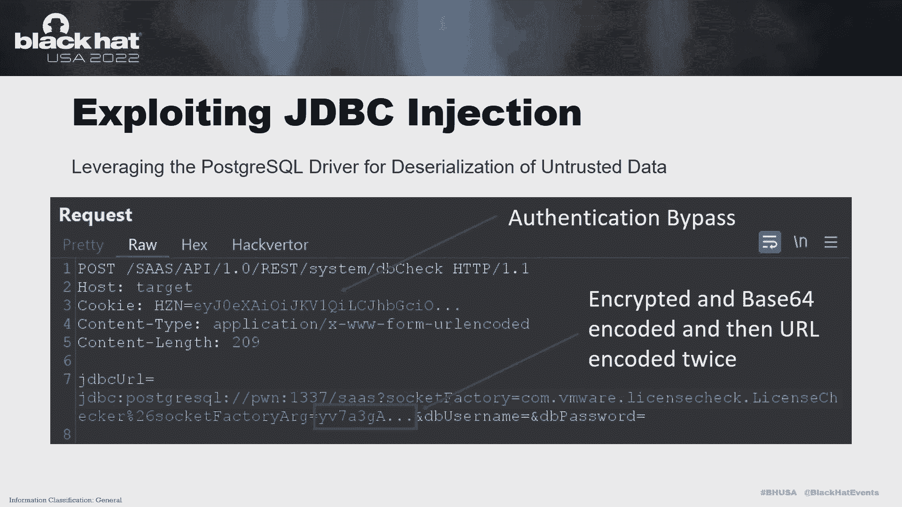

通常，利用 MySQL 或 Postgres JDBC 驱动注入需要出站网络连接，以便从攻击者控制的服务器加载恶意类。但为了适应无外网访问的环境（如云场景），我发现了更好的方法。

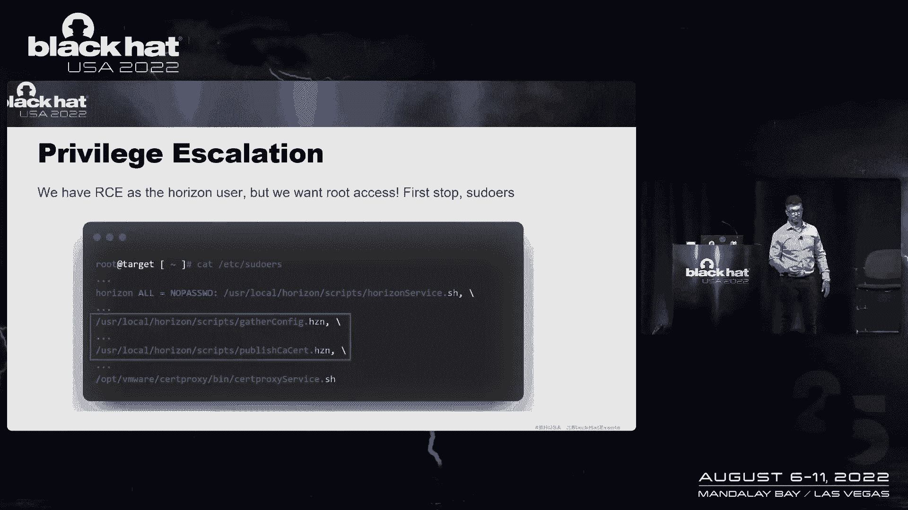

系统中存在一个 `LicenseChecker` 类，其构造函数接受一个字符串，该字符串会被 Base64 解码并反序列化。因此，攻击者可以构造一个包含序列化恶意对象的加密字符串，通过 JDBC 注入传递给 `LicenseChecker`，从而在无需任何出站网络连接的情况下触发反序列化，执行任意代码。

**第三步：权限提升至 Root**
初始获得的代码执行权限位于 `horizon` 用户下。通过检查 `sudo` 权限，发现可以运行 `collect-debug` 等脚本。这些脚本存在逻辑缺陷，允许 `horizon` 用户更改特定文件的所有权。通过巧妙的文件链接和编辑，最终可以获取 `root` shell。

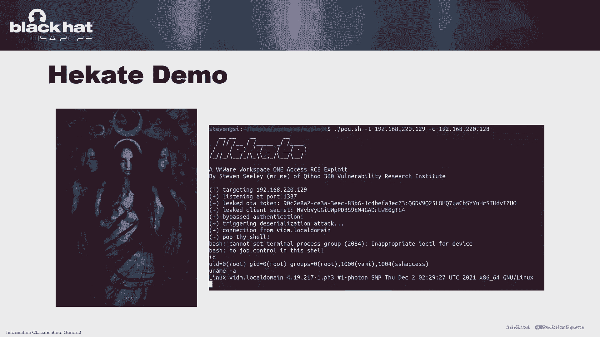

---

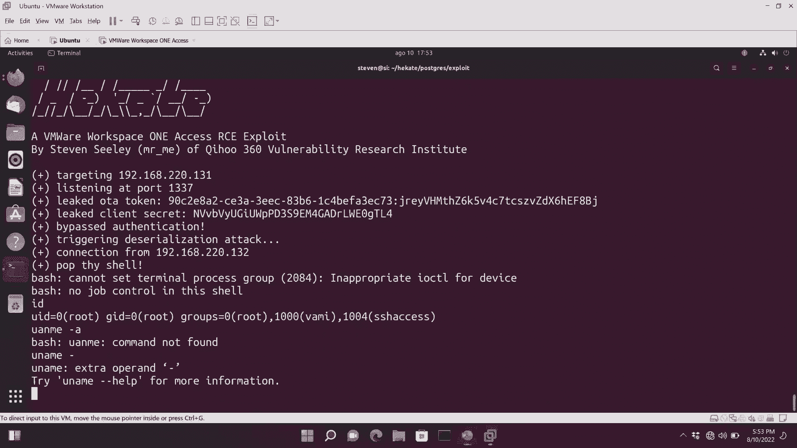

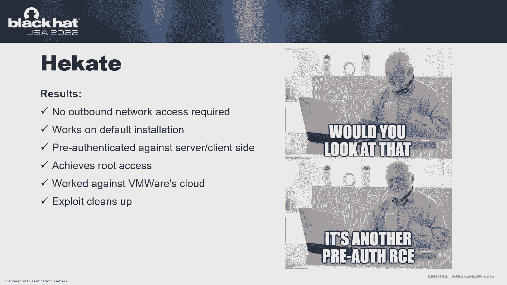

## 演示与总结 📝

通过串联 OAuth 绕过、JDBC 注入和本地权限提升漏洞，我们实现了从外部无需认证到获取系统 root 权限的完整攻击链。这凸显了深度利用和组合攻击的威力。

**核心要点总结：**
1.  **避免单点故障**：部署在边界的 IAM 系统一旦被攻破后果严重。
2.  **严格遵循协议规范**：不要偏离 OAuth 等复杂协议的标准实现。
3.  **注意安全默认配置**：使用 FreeMarker 等模板引擎时，务必禁用 `new` 内置函数等不安全默认项。
4.  **审计协议实现**：仔细检查所有协议实现是否存在偏差。
5.  **组合利用漏洞**：将多个看似微小的漏洞原语组合起来，往往能产生巨大威力。
6.  **坚持深度测试**：在漏洞利用遇到困难时不要轻易放弃，持续探索往往会有新发现。

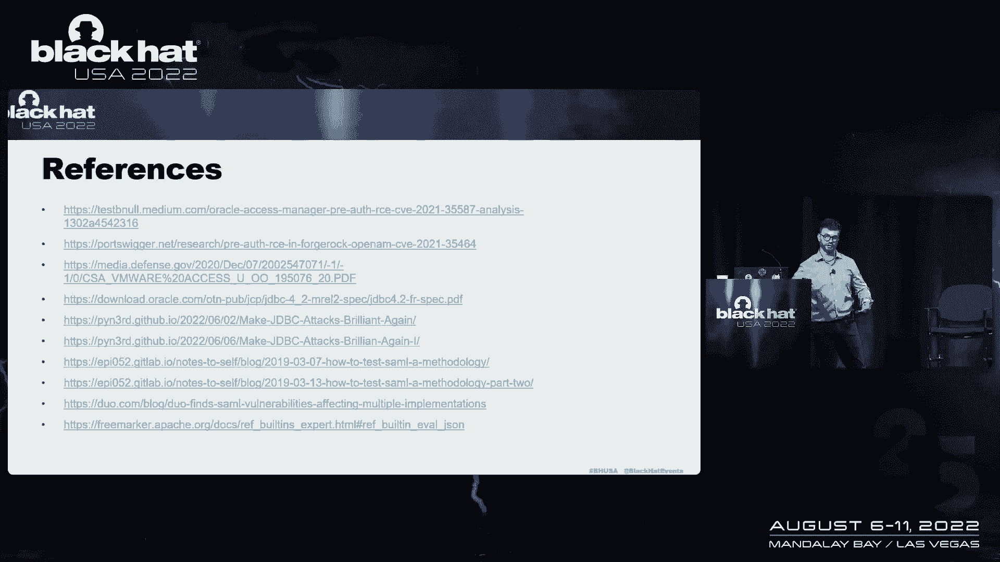

在本节课中，我们一起学习了 IAM 系统的基础、攻击面，并通过分析真实漏洞案例，掌握了发现和利用复杂漏洞链的方法。安全是一个持续的过程，理解攻击者的思维和手段是构建更好防御的第一步。