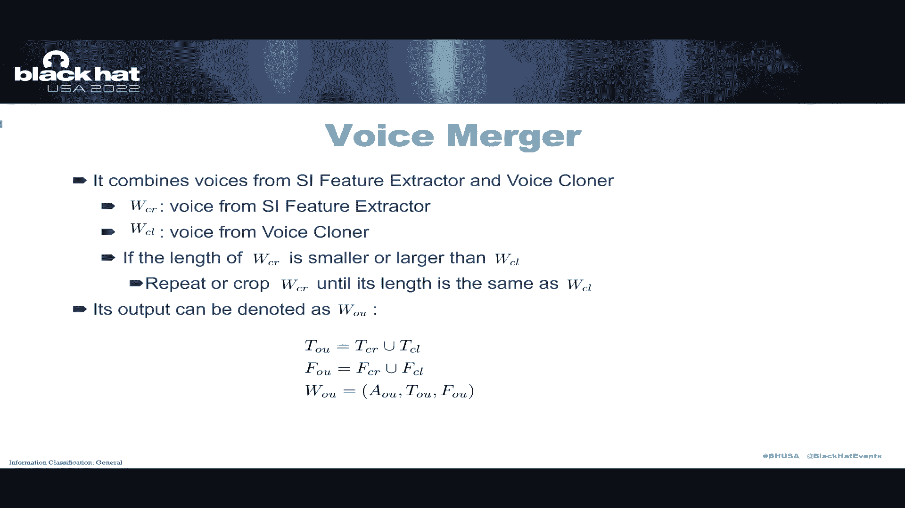
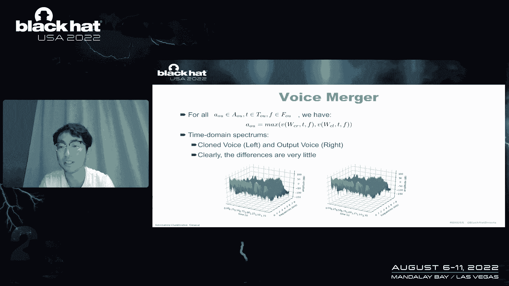
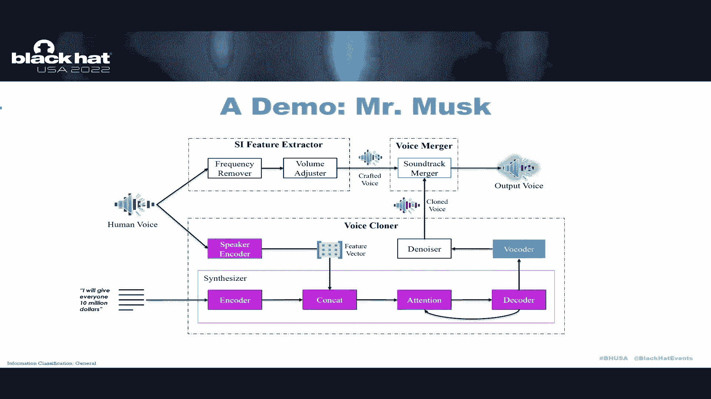
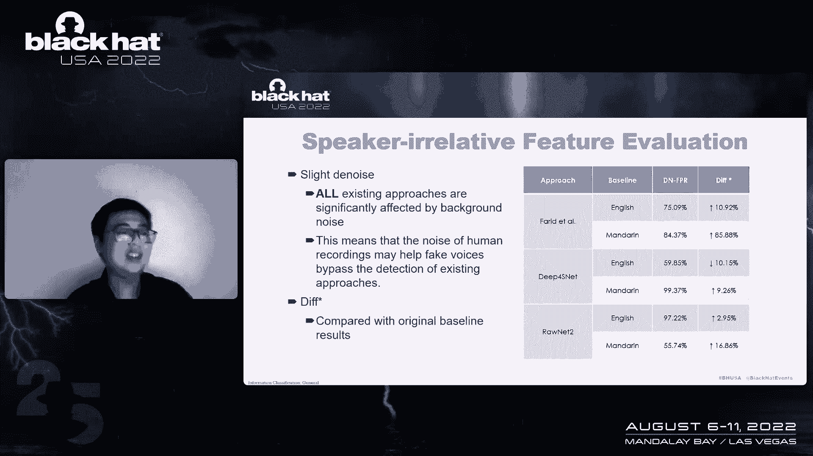
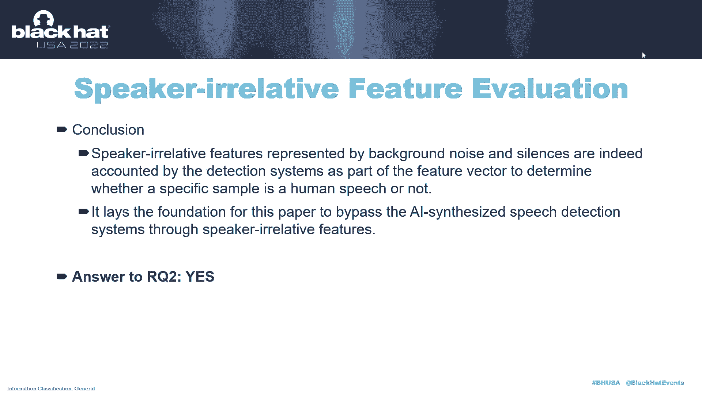
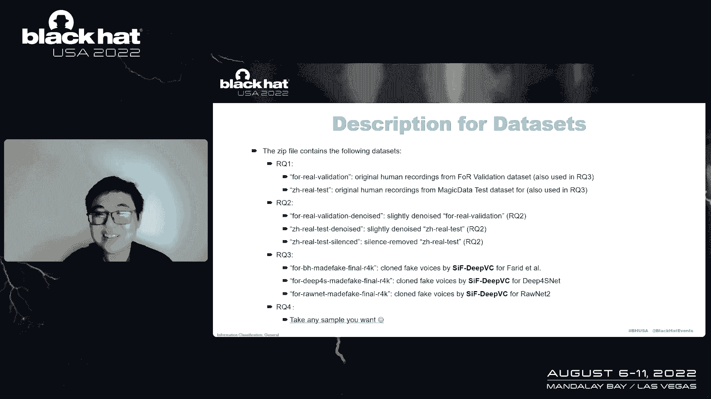
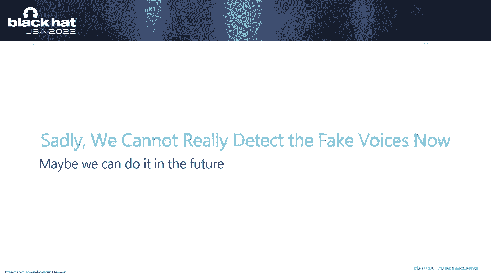
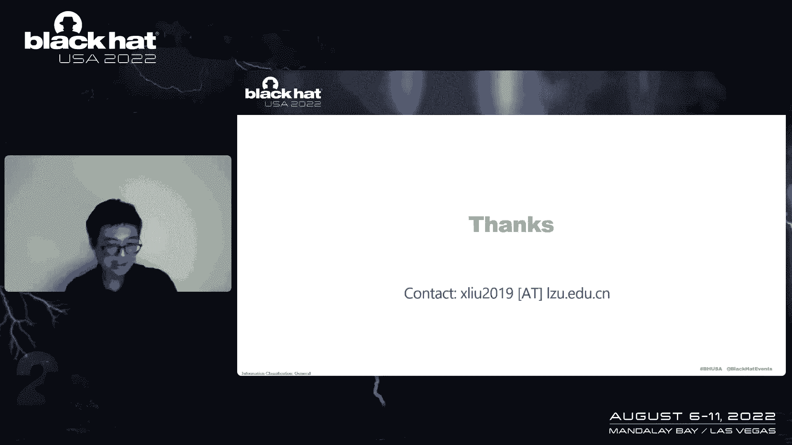

# 课程 P11：011 - 人类还是机器？你真的能检测出伪造语音吗？ 🎤🤖

在本节课中，我们将学习关于AI合成语音（深度伪造语音）的检测与反检测技术。我们将首先了解什么是合成语音，然后探讨现有检测方法的原理与局限性，最后介绍一种能够有效绕过现有检测器的新型攻击方法——SafeVC。课程内容旨在让初学者理解当前语音安全领域的挑战。

## 什么是合成语音？ 🗣️

上一节我们介绍了课程概述，本节中我们来看看什么是合成语音。

我们一直在接触机器创造的东西。早期的语音合成系统主要是基于规则的，很难模拟人的声音。后来的语音合成方法，如拼接合成，其特征很容易被识别。而如今，基于AI的感知式语音合成（如WaveNet、Tacotron）已经非常自然，人类很难分辨一段语音是真人所说还是AI合成。

但是，也许程序可以做到。基于AI的犯罪活动已经出现。因此，开发能够检测合成语音的技术变得至关重要。

## 现有检测方法及其问题 🔍

上一节我们了解了合成语音的发展，本节中我们来看看现有的检测方法。

检测合成语音的方法有很多。所有现有方法在论文中都报告了非常好的性能，平均值达到98%，有些甚至声称达到100%。

以下是几种主流方法：
*   **基于计算机视觉的方法**：将音频转换为频谱图等图像，然后使用图像分类技术进行判断。
*   **基于音频信号处理的方法**：提取梅尔频率倒谱系数等声学特征，然后使用分类器进行检测。

然而，这些方法存在一个严重问题：它们使用了过于理想化的数据集进行训练和评估，没有考虑现实世界环境中存在的干扰因素，例如背景噪音、录音设备差异等。因此，它们在实验室环境下的高精度在现实世界中可能无法复现。

## 提出新概念：说话人相关特征 🎯

上一节我们指出了现有检测器的问题，本节中我们引入一个新的核心概念。

我们提出了一个名为“说话人相关特征”的新概念。这些是语音中与说话人身份无关、也不应被用来判断语音真伪的特征。例如：
*   无意义的填充词（如“呃”、“嗯”）。
*   背景环境噪音。
*   说话人使用的特定语言。

现有的检测器无意中学习了这些特征作为判断依据，这导致了它们在面对经过处理的语音时表现脆弱。

## 我们的方法：SafeVC 攻击框架 ⚔️

上一节我们定义了“说话人相关特征”，本节中我们将介绍利用这一概念的攻击方法。

我们提出了一种名为 **SafeVC** 的攻击框架，旨在生成能够绕过现有检测器的合成语音。其核心思想是：在生成伪造语音时，刻意保留或模仿目标说话人的“无关特征”，使检测器误判。

**SafeVC 的工作流程** 可以用以下步骤概括：
1.  **特征提取**：从目标人物的真实录音中，提取其“说话人相关特征”（如特定的呼吸模式、背景噪音）。
2.  **语音合成**：使用标准的AI语音合成模型生成伪造的语音内容。
3.  **特征融合**：将步骤1中提取的“无关特征”与步骤2生成的“纯净”合成语音进行融合。这包括调整振幅、抑制特定频率等操作。
4.  **输出**：生成最终的、携带了目标说话人习惯性“无关特征”的伪造语音。

通过这种方式，生成的语音在检测器看来，会因为它包含了这些“人类特征”而被判断为更“真实”。

## 评估与实验结果 📊

上一节我们介绍了SafeVC的攻击原理，本节中我们通过实验来验证其有效性。

我们设计了四个研究问题来评估我们的工作：

**RQ1：现有检测方法在现实世界中是否可靠？**
我们使用更接近现实世界（数据分布不平衡、包含噪音）的数据集测试现有检测器。结果表明，它们的性能大幅下降，**误报率** 飙升，证明其在现实环境中不可靠。

**RQ2：说话人相关特征是否真的影响检测结果？**
我们通过实验验证，去除或添加背景噪音、静音段等“无关特征”会显著改变检测器的判断结果。这证实了检测器确实依赖于这些特征。

**RQ3：SafeVC框架能否成功绕过检测？**
我们使用SafeVC生成伪造语音，并用现有检测器进行测试。结果显示，SafeVC生成的语音被判定为“人类”的概率（即**负类率**）远高于基线方法，甚至超过100%，成功绕过了检测。

**RQ4：SafeVC生成的语音是否清晰可懂？**
我们进行了人耳听觉实验。参与者几乎无法区分SafeVC生成的语音和真实人类语音，并能清晰理解其内容。

## 总结与展望 🚀

本节课中，我们一起学习了深度伪造语音的检测与对抗技术。

我们首先介绍了语音合成技术的发展与威胁。然后，我们分析了现有检测方法在理想数据集上表现良好，但在现实世界中存在严重缺陷。接着，我们提出了“说话人相关特征”这一概念，并在此基础上构建了 **SafeVC** 攻击框架。实验证明，SafeVC能有效利用这些特征，生成人类难以分辨、且能绕过当前最先进检测器的伪造语音。

**核心要点总结：**
1.  **语音生成与检测的博弈**：我们展示了如何生成伪造语音，并强调了现有检测方法存在的问题。
2.  **防御的困难性**：现有的解决方案尚不成熟，**不应直接部署到生产环境**中。
3.  **贡献与资源**：我们为未来研究提供了新的高质量开源数据集和评估框架。

我们的研究揭示了当前语音深度伪造检测领域的脆弱性。在最新的工作中，我们正在开发一种融合了说话人无关特征的新型检测方法。同时，我们也呼吁社区共同努力，开发出更能适应现实世界复杂环境的鲁棒检测器。

***
**附：资源链接**
*   本项目所有代码、模型及数据集已在GitHub开源。
*   数据集包含真实语音、中文/英文合成语音、以及用于测试的经处理语音样本。
*   请注意，完整数据集大小约为7.8GB。