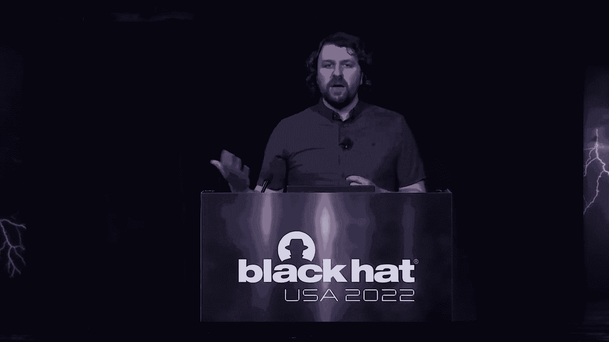
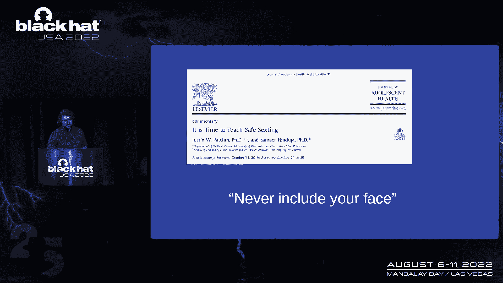
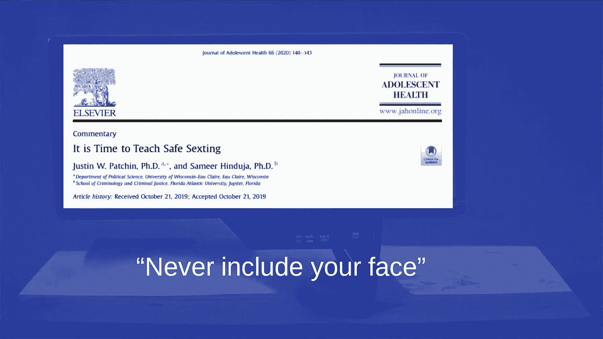

# P12：012 - Harm Reduction： A Framework for Effective & Compassionate Security Guidanc - 坤坤武特 - BV1WK41167dt

早晨，各位，它是，很高兴这么长时间以来第一次见到你们，欢迎来到减少伤害，热情或富有同情心和有效安全的框架，指导，所以如果你让我，我想从一个故事开始，这对你来说可能很熟悉，你可能在我高一的时候就经历过。

我和我的全校同学被拖进礼堂，中间是一辆被砸碎的失事汽车，我们被告知我们的同学死于酒后驾车，这是一个旨在用恐惧来抑制未成年行为的项目，喝酒，实际上有很多这样的程序，那个每十五分钟打一次电话。

但他们也敢直接害怕，当你还是个孩子的时候，你可能经历过其中的一个。

在很大程度上，这些项目在当时对我来说是无效的，我在那个房间里有很多同学发誓不再喝酒，我再也不喝酒了，和，他们当然做了，他们当然做了，研究表明，这些程序旨在通过恐惧来抑制特定的行为。

实际上可以使他们试图抑制的行为，那我为什么要告诉你这些，为什么我十几岁的经历和你在黑帽的经历有关，想象一下那是你的安全程序，恐惧是网络安全中常见的策略，我是说你只要走在小贩大厅里。

你会看到一些基于恐惧的推销，有很多危险的行为，随着网络安全专业人士寻求遏制，有时我们会吓唬人，我们告诉他们不要做，因为看看如果你这么做可能会发生在你身上的坏事，但如果我们真的让问题变得更糟了呢。

不是更好，所以我今天的目标很简单，我想帮你提供更好的安全指导，你能给的最好的指导，这适用于任何人，你是否在财富上给予指导，一百到数千人，或者你是在教你的祖母如何更安全地使用互联网，所以只要一个快速的。

快，对我的简要介绍，嗯，我叫凯尔•托宾纳，我是一家小型开发运营公司的安全主管，这次会议对我来说意义重大，我与减少伤害的第一次互动发生在不幸的情况下，我有一个家庭成员真的在与毒瘾作斗争，我很难理解为什么。

这些基于禁欲的项目本应有所帮助，但却毫无帮助，就在那时，我学会了减少伤害，当我开始阅读更多，并发现医学界处理危险行为的整个策略，我的头脑被震撼了，我永远改变了，减少伤害已经入侵。

不仅仅是我如何处理成瘾行为，也是我如何处理网络安全，这是我现在运作方式的一部分，也是另一个原因，我真的很自豪能来到这里，我第一次试图把这个演讲带给黑帽是在1920年，我被诊断出患有癌症。

不管是什么愚蠢的原因，我在化疗期间试图屈服，这是一个糟糕的提交，原因显而易见，但我得到了很好的反馈，当你健康的时候，回来，所以现在我在这里，我没有癌症，我有我的，我的头发又回来了，我很自豪，谢谢。谢谢。

所以我真的很兴奋能和你们分享我喜欢减少伤害的地方，但可以说，我已经想了很长时间了，所以如果你还记得今天会议上的任何事情，我想让你记住这三件事，第一，除了冒险行为会持续下去，第二，优先考虑减少负面影响。

第三，当你给予指导时，要有同情心，这是减少伤害框架，我要教你怎么做，我会给你更多关于这些子弹的细节，当我们进行谈话时，首先，我认为回顾一下一些非常常见的安全情况是有意义的，您可能被迫提供安全指导。

所以如果你看超级碗，你可能会认出这个硬币库，运行了一个广告，只是一个弹跳的二维码，你可能马上就去了推特，或者如果你在推特上，你可能会看到数百名Infosec专业人士说，不要用这样的二维码，它是不安全的。

通常我们的钓鱼指南可以遵循与此相同的路线，不要点击链接，不安全，我们也给出了很多关于密码的指导，密码复杂度，你应该重复使用它们吗，不要重复使用它们，以某种方式制作密码，我们建议在这些场景中非常复杂。

但当有人与这种高度复杂性作斗争并需要像这本书这样的东西时，有些人可能会嘲笑他们或者说不，你不应该用这样的书，使用密码的唯一方法是最疯狂复杂的方法，我终于喜欢上抖音了，我爱TikTok。

如果你没看过我的抖音，看一下，但安全人员一直告诉我你不应该使用TikTok，它是不安全的，很糟糕，这里有没有人告诉他们的家人不要用抖音，我看到我看到几只手有罪，他们真的听你的吗，因为我不听任何人告诉我。

所以指导真的真的无效，现在，我刚才描述的所有这些指导，这叫做减少使用，你看到一个危险的行为，你告诉别人不要做这件事，你的目标是让他们不要这么做，减少使用，这似乎真的很简单，就像如果你看到一件坏事。

别做那种坏事，给予那种指导有什么害处，所以第一次使用减少并不能改变驱使人们做出这种行为的最初动机，首先，人们做事有理由，即使是危险的事情，他们很健忘，所以他们买了一本密码本，TikTok真的很好玩。

它帮助我度过了癌症，所以我不在乎风险，减少使用也倾向于给危险行为增加社会耻辱，在安全领域有一个很常见的术语--名字和耻辱，我不知道你是否提到过做某事，安全程序中的名字和耻辱。

但这会让人觉得自己不如同龄人，这不是一件有趣的事情，在羞辱的另一端，现在减少使用也可能是医源性的，这是我最近学的一个医学术语，我真的很喜欢残暴意味着，实际引起伤害的治疗方法。

有时伤害比他们试图治疗的东西更大，所以说，如果你的指导使问题变得更糟，这不是很好的指导，现在我刚才描述的所有这些场景，听起来都不是很好，这让我想到了减少伤害，所以首先，如果你从未听说过。

让我来定义减少伤害，减少伤害是一套实用的策略和想法，旨在减少与各种人类行为相关的负面后果，这是一种干巴巴的解释，那么这到底意味着什么呢冒险的行为会有消极的结果，减少伤害侧重于结果，不是最初的行为。

了解一点减少伤害的起源可能会有所帮助，在八十年代，在利物浦，一组卫生保健专业人员找到了解决静脉注射药物使用的更好方法，他们创造了一个叫做针头交换的东西，如果你用了静脉注射的针头，你把他们带到针头交换处。

他们给你干净的针头，现在这对很多人来说可能听起来有点激进，用这个模型，当时真的真的很深刻，现在从那以后，减少危害已成功地用于药物治疗，酒精处理，性教育和许多，许多其他节目。

所以我想向你们展示我们如何从医疗保健中吸取教训，并将减少危害应用于网络安全，四十年来，医疗保健一直在获得减少伤害的好处，我想是我们加入的时候了，所以跳回框架，接受冒险行为将持续下去。

我将更详细地研究这一点，并解释这意味着什么，我之前提到过，人类的动机是激励，我们冒险是有原因的，当你告诉某人不要做某事时，你实际上不做任何关于，最初驱使他们做出这种行为的动机，而且经常是为了人们。

激励大于风险，我们告诉人们不要吸烟，但他们喜欢抽烟，这让他们感觉压力更小，所以他们抽烟，因为冒险行为会持续下去，百分之百地投资于减少使用真的真的很低效，减少使用收益递减，所以当你专注于减少使用时。

实际上有相当多意想不到的后果，让我谈谈那些意想不到的后果，这里有人听说过禁酒令的铁律吗，没有人，哦一个，不错的两个，好的，所以你们大多数人都没有听说过这个，禁酒令的铁律说，当你宣布某件事为非法时。

它会增加效力，变得更难检测，所以在美国的禁令中，s，在二十世纪初，我们禁酒，突然间酒精变得更有效，更难检测，走私变得更容易了，我们开始用更硬的酒精代替啤酒，现在，美国正在经历一种流行病，很难察觉。

极其有效，它杀死了很多人，这被医学界视为对禁毒战争的回应，还有一种叫做违反禁欲效应的东西，谁知道呢，我看到几个更多的手为这一个，所以说，当人们面临不切实际的减少使用目标时，禁欲违规效应就会发生。

他们实际上可以增加他们的风险，因为他们觉得他们不能满足你过高的期望，他们甚至可能失去尝试的动力，有时当你为人们设定这些非常艰难的禁欲目标时，他们最终只是经历了更多的伤害。

现在所有这些都得到了广泛的医学研究的支持，我要告诉你，我发现的一些医学研究非常有用，当我了解到减少伤害，所以把我的注意力转回到禁酒令上，禁酒令使酒精消费量最初下降了70%，听起来很不错，但在禁酒令期间。

这一比例下降到30%，但每年执行禁酒令开始时花费了600万英镑，最后花了一千三百万英镑，所以你所拥有的是一个随着时间的推移变得越来越有效或越来越不有效的程序，随着时间的推移越来越贵。

少女怀孕是一个我们经常使用的领域，减少，培训，标题，美国社会保障法的五项，保证每年一亿美元用于基于禁欲的怀孕预防项目，论延迟囊，这是浪费了很多钱在非常无效上，禁毒战争，我们已经在这上面花了一万亿美元。

大约从70年代开始，显然还没有被根除，人们实际上认为我们通过禁毒战争增加了贸易，最后敢的是对药物滥用的耐药性，教育计划研究表明，大胆是完全无效的，实际上增加了儿童的有害行为许多倍。

那么这对我们的安全有什么启示呢，百分之百减少使用是行不通的，彻底根除危险行为永远不应该是你的目标，你会浪费你的时间和金钱，追求不可能，减少使用是相关的，这仍然是一个首选的结果。

但这不可能是你唯一的治疗方法，减少使用需求，来自其他措施的支持，如减少伤害和有效指导，将承认，减少使用并不对每个人都有效，一旦你承认，让您帮助那些将被排除在您的减少使用指导之外的人，而不是忽视它们。

所以不管是好是坏，二维码和链接，互联网就是这样运作的，务实的方法是接受人们会使用这些东西，对后果做点什么，不是行为本身，抖音也是美国排名第一的应用，它在这里停留一会儿，如果你关注TikTok的糟糕结果。

并试图解决这些，你会比试图阻止人们使用明显的东西更有效，这个国家的很多人想用，现在，这里有一个很好的例子来说明为什么你不能消除安全研究的风险，你看这里的研究是从汤，二十六个人使用重用密码。

因为它们太复杂了，人们重用他们必须经常重用的密码，安全专业人士给出大量密码指导，但是人们做出决定是因为激励，所以用密码，他们正在决定重用它们，因为它节省了他们的时间，它节省了他们的精神能量。

所以人类总是会重复使用密码，无论我们多么努力，这是另一篇有趣的论文，从不久前，这叫组织钓鱼，大规模长期研究发现，他们发现一些被广泛接受的捕鱼测试和训练形式，实际上增加了捕鱼的敏感性，所以回到医学上的词。

我用了医源性的，在某些情况下，我们的治疗可能会造成更大的伤害，而不是带来好处，所以希望，我可能会让你相信冒险行为会持续下去，你可能会问得很好，好的，我该怎么办，我该怎么办。

这就引出了我的减少伤害框架的第二部分，它是优先减少负面后果，为什么这很重要，所以就像我之前说的，我们知道根除是不可能的，总有一些人会做出冒险的选择，但我们是安全专家，我们理解风险。

高风险行为有更多风险和更少风险的版本，听起来有点奇怪，但真正的风险存在于一个光谱上，现在你可能也经常听到这个，有时人们会觉得如果有人从事危险的行为，他们活该，但风险不仅对个人产生，但通常对一个群体来说。

所以如果你让那些做出这些危险行为的人自生自灭，因为他们活该，你忽略了他们周围的人所经历的伤害，你错过了一个降低组织风险的黄金机会，所以减少伤害需要务实，任何降低伤害的步骤都比没有强。

所以这意味着你接受了正在发生的危险行为，你看到的是当人们进行这种危险行为时可能造成的伤害，你试图找出任何可以减少这些负面后果的方法，不管有多小，因为总的来说，你会做更有效的安全指导总体上比你只是说。

别那样做，我喜欢这种方法的一点是，没有一个人被排除在你的伤害之外，缓解，所以减少伤害的重点是可行的，注重实效，有效指导，在不可能的目标上打洞是如此容易，你设置了一个R，你设置一个KPI，你说过。

你知道吗，我们解决这个行为，我们将这种行为减少30%，明年是百分之四十，明年是百分之五十，明年是百分之六十，你就继续沿着这条路走下去，这将结束一个不可能的事情，如果这就是你所做的，你在做你的公司。

你服务的人，你试图帮助伤害的人，所以你可以教使用减少，但你需要了解它的极限，并有一个计划来减少不遵守的伤害，一次又一次，我们在医学界有非常广泛的研究支持我所说的一切，我们在向未成年人推销。

E香烟浓度较低，青少年使用率比美国低四倍，并看到吸烟的减少，这比吸烟的危害更大，嗯，做这种比较的地方是在性教育中，有一种叫童贞誓言的东西，保证童贞的青少年，而不是接受传统的性教育。

与接受传统性教育的人一样有可能发生性行为，但是接受传统性教育的人更有可能使用避孕措施，更有可能接受性病检测，平均性病时间更短，禁毒战争是减少危害的另一个经典例子，减少危害的发源地，真的。

我在针头交换之前提到过，百分之七十，和安全的注射场所将用药过量死亡人数减少了三人，百分之五，和获得纳洛酮，这是一种过量抑制剂，减少了11%的用药过量，那么我们在这里可以从网络安全中学到什么。

在一次又一次的研究中，百分之百地减少使用是不够的，我们看到，只有减少使用才会增加对个人的伤害，从而更有效，你需要看看你的危险行为的有害结果，在你的环境中，并设计减轻这些风险和有害结果的治疗方法。

这听起来可能很像深度防御因为个人控制是不够的，但是您可以在聚合中分层控件，通过采用减少伤害来实施非常成功的安全计划，让我们回到我的第一个二维码示例，现在我们假设人们会点击这个。

所以我们有机会在我们的指导下教育，而不仅仅是告诉人们什么不该做，如果我们有，你知道的，这里的许多人可能在一些平台上工作，这些平台促进了我们生活的网络，您有机会在平台中构建警告。

在平台中构建使人们更安全的功能，他们不太可能经历他们行为的有害结果，抖音，作为一个例子，如果你生活中有人使用TikTok，而不是告诉他们不要使用它，您可能建议您可以在浏览器中使用它。

你可以在专用设备上使用它，上面没有你的任何其他个人信息，有一些方法可以降低冒险行为的风险，随着时间的推移，你知道这种指导会更有效。

所以这是一个我真的真的很喜欢的研究，是关于短信的，现在我有，我有孩子，有一些，你知道，我最大的五岁，所以我还没到，但我有很多有孩子的朋友，年龄，这已经成为一个问题。

人们倾向于做的一件事就是把头埋在沙子里，我们不谈这个了，永远不要这样做，永远不要这样做，但这是不务实的，在我们的文化中，短信是一种规范的行为，青少年会这样做一次，你知道他们会用那个来做这件事。

你有机会为他们提供更有效的指导，我很喜欢这篇论文中的一个指导是，不要把你的脸，如果你要做这件事，把你的脸拿开，这样那个形象就不会被用来对付你，未来是一种减少伤害的方法，那是非常有效的。

EFF的伊娃·加尔佩林，因为卢是减少伤害的大力支持者，她写道，基于减少伤害的指导，这是她写的一篇关于电报的文章，基本上是说，如果你在俄罗斯或乌克兰，在某些情况下，你可能需要使用电报，对你来说可能不安全。

所以这里有一些方法可以让电报更安全，在需要使用的情况下，我认为这种方法非常非常重要，我觉得像这样的文章比仅仅说，别用电报，所以这里的目标是移除，从你的词汇来看别那么做，相反，试着说一些话。

比如试着不要那样做，但如果你这么做了，这里有一些方法可以让这种行为更安全，你有机会用你的专业知识教育人们，你可以利用这个机会给他们更好的指导，随着时间的推移，当你与人建立信任时。

他们更有可能听从你的指导，好的，我的减少伤害框架的第三部分，现在这个对观众来说可能有点挠头，在提供指导的同时拥抱同情心，有点敏感，感觉，但它实际上是一个非常，减少伤害的非常重要的部分，污名会破坏意志力。

增加对伤害的易感性，所以你作为一个网络安全专业人士，应该尽量不要给这些高风险行为增加耻辱，而是，通过拥抱同理心，拥抱善良，鼓励积极性，你可以与你试图影响的人建立更积极的关系，在减少伤害方面。

这实际上有一个不同的术语，这叫做提高生活质量，但它是一种保健，所以你知道情况有点不同，但这是一个很好的思考方式，就是你怎么能，当你提供指导时，人们也让他们的生活变得更好，让他们的生活更轻松。

如果你不能阻止他们，支持他们，同情心和同理心建立信任人们为自己做出更好的选择，当他们感到被支持时，如果他们信任给他们指导的人，他们会更信任指导本身，通过建立一个富有同情心的。

与你试图引导的人建立信任的关系，你的指导会更有效，这是我发现的另一个非常重要的观点，当我在做这项研究的时候，我们从本质上知道这一点，但是关心别人比和他们打架更有趣，对你更好，也让你成为一个更好的实践者。

它让你不太可能筋疲力尽，你可能会说，哦，我不知道这听起来像废话，它不是，医学界的研究实际上表明了这一点，所以说到羞辱和污名化，这会降低你的功效，它增加了高风险行为可能造成的危害。

当我们看《害怕的直男》节目时，这实际上增加了参与者的犯罪率，从5到2，百分之八，他们试图测量，所以他们试图阻止这些人做的一切，给这些行为增加耻辱，他们打破了一些防御。

使他们更有可能做出贡献或执行他们现在试图阻止的行为，与hiv相关的耻辱感多年来一直是个问题，它实际上导致了更低的测试率，较低的治疗参与率，和较低的药物依从率，你不是一个有效的医生。

肥胖相关的耻辱感也降低了治疗的动机和参与度，并在健康相关问题中增加体重和肥胖，所以所有这些都是说耻辱现在让你的指导变得更糟，相反，同情的关怀提高了信任，减少伤害，我前面说过的安全注射部位。

降低用药过量死亡率，也为来到这些安全注射点的人提供了机会，得到照顾，对于那些地方的医生来说，和人民交谈，建立人与人之间的联系，向他们建议，他们可能寻求治疗的其他方式。

有富有同情心的医生的糖尿病患者对指导的依从性增强，出现并发症的可能性降低了40%，他们有80%的可能性有最佳的血糖控制，那只是因为喜欢你的医生，只是觉得你和你的医生关系很好，这个真的让我大吃一惊。

信任医生的病人，显示他们疼痛中心的大脑活动减少了40%，这太不可思议了，对呀，就像他们把这些小，你知道，人们头上的帽子，诱发他们的疼痛，确保他们有医生，他们关心医生，他们不在乎你会经历更少的痛苦。

如果你关心给你指导的人，所以你作为指导的人，应该专注于建立信任的关系，因为有很多因素可以减少对个人的伤害，你在引导，现在同情心也让修行者更有效，不遵守医疗保健每年给美国造成大约一千到三千亿美元的损失。

我只能想象这对网络安全来说是多少钱，这可能是一个非常高的数字，医患之间富有同情心的交流导致六十，病人坚持治疗的几率增加2%，所以如果你是一个更好的沟通者，你更有同情心。

你将通过使其更有效来节省你的安全计划的钱，以非常便宜的方式，和病人关系不好的医生是两种，两个或两个，两个x更有可能烧坏，据估计，倦怠会降低医生的工作效率，全球3%，那就是三十了。

世界上3%的医生因为倦怠而效率低下，我猜，我们在网络安全方面可能也有相当相似的数字，所以如果你的目标是有效的，指导，羞耻，污名化和对抗会降低你的效率，如果你的目标是有效的，指导，同情心让你更有效。

会有更多的人听你的，会有更多的人坚持你的指导，你提供的指导成本会更低，当你不再一直和人打架的时候，你更喜欢你的工作，你感觉好多了，你燃烧得更少，所以回到我们的一些示例密码，吸，每个人都讨厌密码。

但是制导是超级复杂的，2。在工作中你必须想尽一切办法，让你指导的人，让他们的生活更轻松，这甚至意味着给你的祖父母买一本密码本，让他们的生活轻松一点，也许你能理解我为什么喜欢TikTok。

所以如果你对我好，如果你试着用一种好的方式引导我远离抖音，在某个时候，如果我担心，我比任何人都更有可能和你说话，别用它，太可怕了，太可怕了，你为什么要，我只是，我不会接受那样的人的指导，没有效果。

所以网络安全界也有很多其他人，他们也是这样想的，我的朋友OA有一句很棒的名言，关于把你的马车挂在开发人员的生产力上，她在网飞负责产品安全，她的整个口头禅是让开发人员更有效，生产率更高。

提高他们的生活质量，将安全目标插入开发人员工作流中变得更加容易，她的安全指导更有可能被倾听，坚持，并以更低的成本来实现因为她与开发人员建立了牢固的关系，这是Regina在欧盟黑帽公司的一次演讲。

她的谈话是关于知识羞辱，让我们所有人都不那么安全，这里的想法是当我们严厉批评人们时，当我们为他们在安全程序中犯了错误而羞辱他们时，他们不太可能分享他们所学到的结果，在他们的破坏中，在他们的错误中。

你知道吗，他们的应对努力，这让我们所有人都不那么安全，因为我们没有从他们获得的知识中受益，对经历过违规行为的公司有同理心，鼓励他们改变，有同情心会鼓励他们分享更多的经验教训，从而让我们都变得更好。

所以我要给你讲讲我最后的想法，真正快速的减少伤害在医疗保健中是有效的，研究支持它，我认为网络安全对我们来说是一个广阔的领域，探讨和采纳减少危害的原则，如果你把减少伤害的原则纳入你的指导。

你可以看到疗效的提高，降低成本，甚至可能感觉不那么疲惫，只是提醒一下我们要离开这个房间，我们不是说不要再这样做了，我们会说尽量不要那样做，但如果你这么做了，这里有一些更安全的方法，终于回到我的框架。

记住这三件事，请接受冒险行为将继续存在，优先考虑减少负面后果，在提供指导的同时拥抱同情，就是这样。