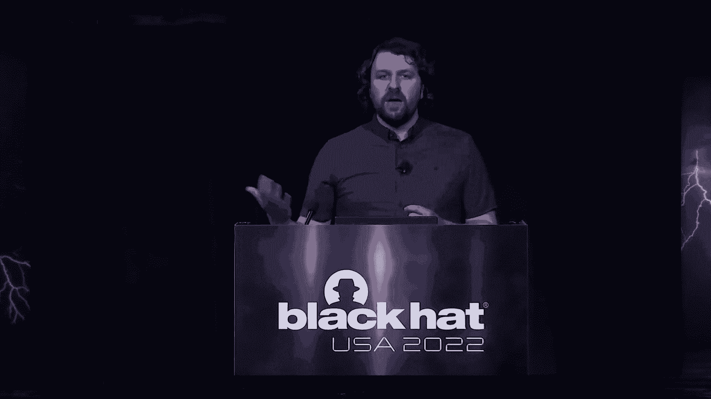
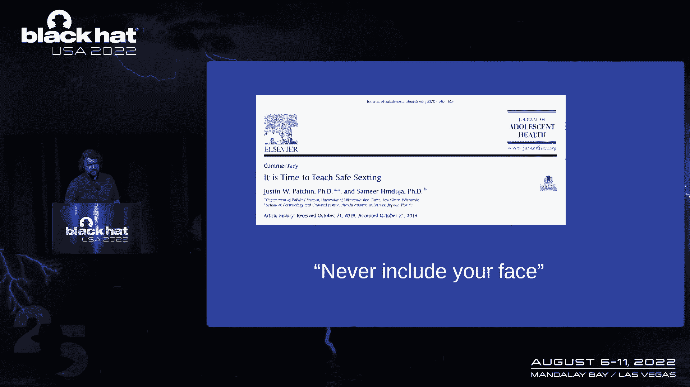

# 课程 P12：012 - 减少伤害：一个有效且富有同情心的安全指导框架 🛡️

在本节课中，我们将学习“减少伤害”这一源自医疗保健领域的框架，并探讨如何将其核心原则应用于网络安全指导。我们将理解为何单纯禁止危险行为往往无效，以及如何通过务实、富有同情心的方式来提供更有效的安全建议。

## 概述：从无效的恐惧策略说起

上一节我们提到了基于恐惧的安全教育往往效果不佳。本节中，我们来看看一个更优的替代方案。

我和我的高中同学曾被召集到礼堂，观看一辆因酒驾而损毁的汽车残骸。我们被告知有同学因此丧生。这是一个旨在用恐惧来抑制未成年人饮酒行为的项目。类似的项目还有很多。

研究表明，这些旨在通过恐惧来抑制特定行为的项目，实际上可能加剧它们试图阻止的行为。恐惧是网络安全中常见的策略。我们经常告诉人们“不要点击那个链接”或“不要使用那个应用”，因为可能会发生坏事。

但如果我们实际上让问题变得更糟了呢？我今天的目标很简单：帮助你提供更好的、你能给出的最佳安全指导。

## 什么是减少伤害？🧩

如果你从未听说过，让我来定义一下：**减少伤害是一套实用的策略和理念，旨在减少与各种人类行为相关的负面后果**。这是一种务实的解释，那么这具体意味着什么呢？冒险行为会产生消极结果，而减少伤害侧重于**管理结果**，而非彻底消除最初的行为。

了解其起源会有所帮助。在20世纪80年代的利物浦，一组医疗保健专业人员找到了应对静脉注射药物使用的更好方法，他们创建了“针头交换”项目。从此，减少伤害已成功应用于药物成瘾治疗、酒精处理、性教育等许多领域。

我想展示我们如何从医疗保健中吸取教训，并将减少伤害应用于网络安全。医疗保健领域享受减少伤害的好处已有四十年，是时候让我们加入了。

## 减少伤害框架的三个核心原则

以下是构成减少伤害框架的三个核心原则。

### 1. 接受冒险行为将持续存在 🧠

我将更详细地研究这一点。人类的动机是驱动力。我们冒险是有原因的。当你告诉某人不要做某事时，你并没有解决最初驱使他们做出该行为的动机。对许多人来说，动机大于风险。

因为冒险行为会持续存在，百分之百地投资于“减少使用”（即单纯禁止）是低效的。减少使用的收益会递减，并可能带来意想不到的后果。

*   **禁酒令的铁律**：当你宣布某事物为非法时，它会变得**效力更强、更难以检测**。例如，美国禁酒令时期，酒精变得更烈，走私更猖獗。
*   **违反禁欲效应**：当人们面对不切实际的禁欲目标时，他们实际上可能**增加风险行为**，因为他们觉得自己无法满足过高期望，甚至可能失去尝试的动力。

所有这些都得到了广泛医学研究的支持。

*   **禁酒令**：最初使酒精消费量下降70%，但随后回升至仅下降30%，且执法成本飙升。
*   **少女禁欲教育**：美国每年投入上亿美元，但被证明效果甚微。
*   **禁毒战争**：花费约一万亿美元，但未能根除毒品，反而可能加剧了非法贸易。
*   **抵制药物滥用教育**：研究表明，某些项目完全无效，甚至**成倍增加了**儿童的有害行为。

那么这对网络安全有何启示？**百分之百的“减少使用”行不通**。彻底根除危险行为不应该是你的目标。你会浪费时间和金钱去追求不可能的事。

“减少使用”仍然是相关且首选的结果，但它不能是你唯一的策略。它需要其他措施（如减少伤害和有效指导）的支持。承认“减少使用”并非对每个人都有效，这让你能够帮助那些被排除在禁令之外的人，而不是忽视他们。

**务实的方法是接受人们会使用二维码、点击链接或使用TikTok。专注于为这些行为的后果做点什么，而不是行为本身。**

例如，一项研究发现，**26%的人因为密码太复杂而重复使用密码**。无论我们多么努力，人类总会重复使用密码，这是由节省时间和脑力的动机驱动的。另一项关于网络钓鱼培训的大规模研究发现，某些广泛接受的测试和训练形式**实际上增加了**对钓鱼攻击的敏感性。这就是“医源性”伤害——治疗造成的伤害大于益处。

### 2. 优先减少负面后果 🎯

既然我们接受了根除是不可能的，那么该怎么办？这就引出了第二部分：优先减少负面后果。

高风险行为存在风险高低不同的版本。风险存在于一个光谱上。减少伤害需要务实：**任何降低伤害的步骤都比没有强**。

这意味着你接受正在发生的危险行为，关注其可能造成的伤害，并试图找出任何（无论多小）可以减少这些负面后果的方法。总体而言，这将比你只说“别那样做”更有效。

这种方法的好处是，**没有一个人被排除在你的伤害缓解努力之外**。减少伤害注重可行性、实效性和有效指导。

医学研究再次提供了支持：
*   在限制向未成年人销售电子烟的地方，青少年使用率比美国低四倍，并且吸烟（危害更大）率下降。
*   接受传统性教育的青少年，与只做“贞洁誓言”的青少年发生性行为的概率相当，但**更可能使用避孕措施，进行性病检测，且感染性病的平均时间更短**。
*   针头交换、安全注射场所和获取过量抑制剂纳洛酮，显著降低了过量死亡人数。

那么，在网络安全中我们可以学到什么？你需要审视在你的环境中，危险行为可能产生的有害结果，并设计缓解这些风险和结果的措施。

让我们回到二维码的例子。假设人们会点击它，我们就有机会在教育中提供指导，而不仅仅是禁令。平台可以内置警告或安全功能。对于TikTok，与其告诉家人别用，不如建议他们在浏览器中使用，或在没有个人信息的专用设备上使用。这些方法可以降低风险。

一项关于青少年“短信”的研究提供了很好的减少伤害指导示例：与其完全禁止（不切实际），不如建议“如果你要做这件事，不要露脸”，以保护未来不被图像滥用。

EFF的Eva Galperin是减少伤害的坚定支持者。她曾写道，在俄罗斯或乌克兰等特定情况下，使用Telegram可能是必要的，并提供了**让Telegram更安全的方法**。这种方法比单纯说“别用Telegram”要有效得多。

这里的目标是从你的词汇中移除“别那么做”，转而尝试说：“**尽量不要那样做，但如果你做了，这里有一些让这种行为更安全的方法。**” 这让你有机会用专业知识教育人们，建立信任，使他们更可能听从你的指导。

### 3. 在提供指导时拥抱同情心 ❤️

这可能听起来有点“软”，但它是减少伤害中非常重要的一部分。**污名化会削弱人的意志力，增加对伤害的易感性**。

作为网络安全专业人士，应尽量避免给高风险行为增加耻辱。相反，通过拥抱同理心、善意和鼓励积极性，你可以与你试图影响的人建立更积极的关系。这有时被称为“提高生活质量”。

同情心和同理心能建立信任。当人们感到被支持、信任给予指导的人时，他们会为自己做出更好的选择，也更信任指导本身。建立富有同情心和信任的关系，会使你的指导更有效。

关心他人比对抗更有趣，对你也更好，能让你成为更优秀的从业者，并降低职业倦怠的风险。

医学研究证实了这一点：
*   “恐惧威慑”项目实际上**增加了**参与者的犯罪率。
*   HIV相关的污名导致检测率、治疗参与率和药物依从率降低。
*   肥胖相关的污名降低了治疗动机和参与度，并增加了健康问题。

相反：
*   安全注射场所不仅降低死亡率，还提供了关怀和建立联系的机会。
*   对医生有信任感的糖尿病患者，对指导的依从性增强，出现并发症的可能性**降低40%**。
*   信任医生的病人，其大脑疼痛中枢的活动**减少了40%**。

富有同情心的交流使从业者更有效：
*   医患间富有同情心的交流使病人坚持治疗的几率增加。
*   与病人关系不好的医生，其职业倦怠的可能性是两倍。

回到我们的例子：密码管理很复杂。让你的指导对象生活更轻松，甚至意味着为祖父母买一本密码本。如果你对我使用TikTok表示理解并善意引导，我比听到“别用，太可怕了”更可能与你交流并考虑你的建议。

网络安全界也有类似思考。我的朋友在Netflix负责产品安全，她的理念是“**将你的马车挂在开发人员的生产力上**”——让开发人员更高效，提高他们的生活质量，这样安全指导更容易被采纳。另一位演讲者谈到“知识羞辱”让我们所有人都不安全——当人们因犯错被羞辱时，他们不太可能分享经验教训，这对整个社区都是损失。

## 总结与最终思考 🎓

本节课中，我们一起学习了如何将“减少伤害”框架应用于网络安全指导。

真正快速的回顾：减少伤害在医疗保健中是有效的，研究支持它。网络安全是探索和采纳减少伤害原则的广阔领域。如果你将减少伤害原则纳入你的指导，你可以看到有效性提高、成本降低，甚至可能感觉不那么疲惫。

离开时请记住这三件事：
1.  **接受冒险行为将持续存在**。
2.  **优先考虑减少负面后果**。
3.  **在提供指导时拥抱同情心**。

我们不是说“不要再这样做了”，我们会说“**尽量不要那样做，但如果你这么做了，这里有一些更安全的方法**”。