# 课程 P13：013 - 通过滥用外部身份后门和劫持 Azure AD 账户 🛡️➡️🔓

在本课程中，我们将学习 Azure Active Directory 中一个关于外部身份协作的安全漏洞。我们将探讨攻击者如何利用默认配置，通过劫持未兑换的邀请或修改账户身份属性，来后门或接管高权限账户，甚至绕过多因素认证。课程内容基于实际研究，旨在帮助初学者理解其原理与影响。

## 核心概念与定义

在深入细节之前，让我们从一些重要的定义开始。

本次演讲的核心是 **Azure Active Directory**。它是微软云服务的核心身份平台，用于管理 Microsoft 365、Azure 资源以及连接到它的任何第三方 SaaS 服务的身份验证。我们讨论的重点是 Azure 的身份部分，而非虚拟机或网络。

从安全角度看，一个关键概念是 **租户**。租户是组织 Azure AD 的一个独立实例。大多数组织会有一个主租户（通常链接到其 Microsoft 365 服务）。租户是 Azure 的一个重要安全边界，不同租户之间的数据访问应被隔离。

我们还将讨论 **外部身份**。外部身份是指不由你的租户管理的任何身份。它可以是另一个租户中的身份，甚至是不同的身份提供商（如个人微软账户、谷歌账户），或仅基于电子邮件地址的虚拟账户。

接下来，我们看看 **外部协作**。这是两个租户之间的协作。通常，我们设租户 A 是我们要攻击或防御的主要组织租户。租户 B 可能是外部合作方或攻击者控制的租户。

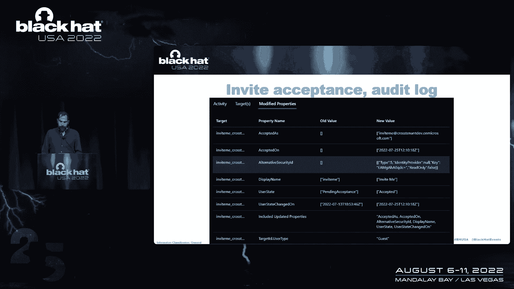

在外部协作中，租户 B 中的用户账户被称为 **家庭租户** 账户。当这个用户被邀请访问租户 A 的资源时，从租户 A 的角度看，该用户被称为 **资源租户** 中的来宾账户。这两个账户之间存在链接。

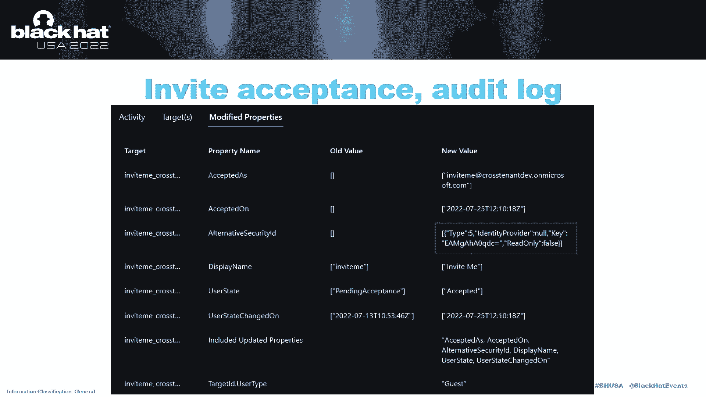

## 默认邀请流程分析

在这个设置中，我们有两个租户：主要租户（租户 A）和一个二级租户（租户 B）。所有设置均为默认，没有进行任何特定的加固。

让我们从租户 A 的角度看看标准的邀请流程。

如果我们在租户 A 中，可以添加一个新用户并指定其为外部用户。系统会向被邀请者的电子邮件地址发送一封包含“接受邀请”链接的邮件。

当用户点击链接并接受邀请后，他们需要使用其家庭租户（租户 B）的账户登录。此时，在租户 A 中会创建一个与该家庭账户链接的来宾账户。最终用户可以在两个租户的上下文之间切换。

## 底层技术视角

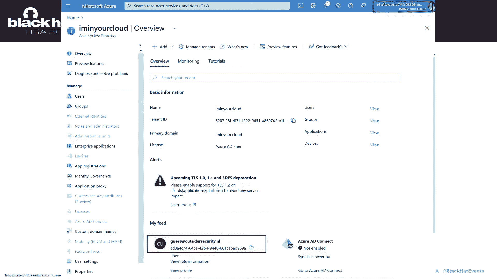

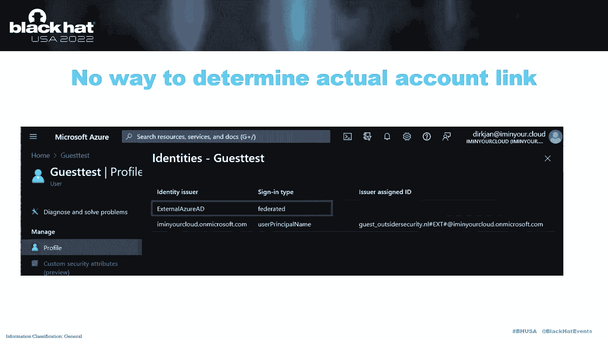

为了理解其工作原理，我们需要查看底层数据。我们有几种选择：

*   **Microsoft Graph**：这是 Microsoft 365 和 Azure AD 的官方 API。
*   **Azure AD Graph**：这是一个更底层的 API，只覆盖 Azure AD，有时能提供比生产环境更多信息（不推荐用于生产，但对研究有用）。
*   **Azure 门户**：使用上述 API 的图形界面。

在本课程中，我们将混合使用 Azure AD Graph 和 Microsoft Graph，并借助工具 `ROADtools`（Azure AD Graph 的前端）进行离线信息收集和分析。

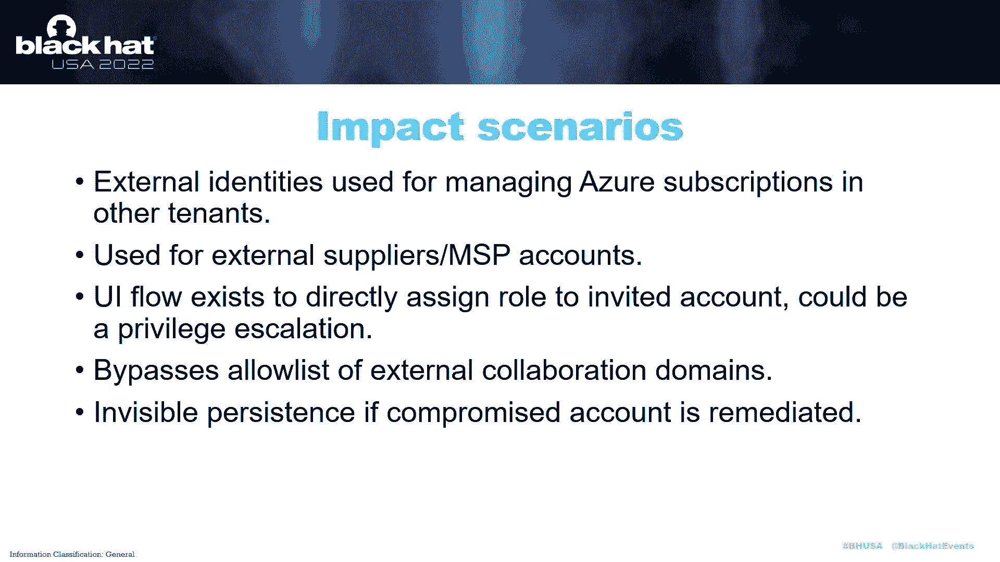

首先，我喜欢查看 **审计日志**，因为 Azure AD 中的任何操作都会创建审计事件。例如，当来宾账户的邀请被兑换时，我们可以看到哪些属性被更新。

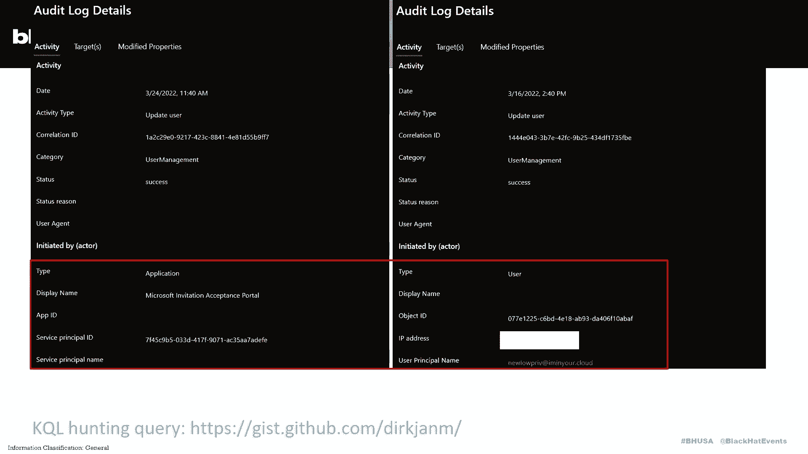

最有趣的属性可能是 **alternativeSecurityId**。在邀请兑换后，此属性被填充了数据。它包含关于身份提供商、密钥和类型的信息。

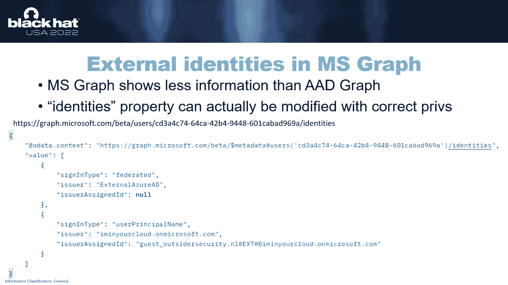

如果我们解码这个以 Base64 编码的密钥，会得到一个十六进制数。这个数字与用户家庭租户的 ID（称为 **netID**）相匹配。因此，`alternativeSecurityId` 属性通过 `netID` 将来宾账户链接回其家庭账户。

## 邀请劫持漏洞

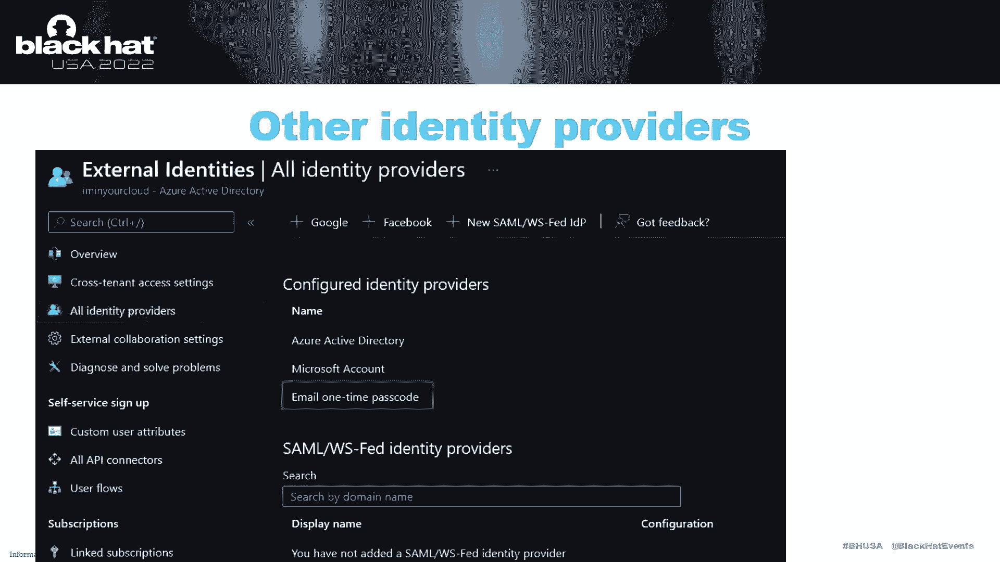

上一节我们介绍了账户链接的底层原理，本节中我们来看看一个关键的漏洞：**邀请劫持**。

我研究了一些旧文档和第三方项目，发现可以通过编程方式兑换邀请。这需要使用一个包含 `invitationTicket` 和 `netId` 等参数的 POST 请求。

进一步调查揭示了几个严重问题：

1.  **权限要求极低**：租户中的**任何用户**都可以为任何被邀请的用户兑换邀请。
2.  **信息无验证**：POST 请求中提供的电子邮件、`netId` 等信息均未经过实际验证。攻击者可以假装是任何人，并将邀请链接到任意外部账户。
3.  **秘密信息可查询**：兑换邀请所需的秘密部分——`invitationTicket`，可以被租户中的任何用户查询到。

以下是攻击步骤的核心代码逻辑：

1.  **查询未兑换的邀请**：通过 Azure AD Graph 查询状态为“PendingAcceptance”的用户，获取其 `invitationTicket` 和电子邮件。
    ```http
    GET https://graph.windows.net/myorganization/users?api-version=1.61-internal&$filter=userState eq 'PendingAcceptance'&$select=mail,invitationTicket
    ```
2.  **查询目标攻击者账户的 netId**：从攻击者控制的家庭租户中查询目标账户的 `netId`。
3.  **构造并发送劫持请求**：使用上述信息构造 POST 请求，将邀请链接到攻击者账户。
    ```http
    POST https://graph.windows.net/myorganization/invitations/<invitation_id>/redeem?api-version=1.61-internal
    Content-Type: application/json
    {
        "invitationTicket": "<stolen_ticket>",
        "targetTenantId": "<victim_tenant_id>",
        "invitedUserEmailAddress": "<victim_email>",
        "inviteRedirectUrl": "...",
        "externalUserNetId": "<attacker_netid_in_base64>"
    }
    ```

**影响**：
*   攻击者可以劫持发给高权限供应商账户的邀请，立即获得全局管理员等角色。
*   绕过“允许协作域列表”限制，因为域名在链接前未被验证。
*   即使攻击者的主账户被发现并补救，他们仍可通过来宾账户保持访问。

**检测**：管理员可以审计日志中寻找线索。正常的邀请兑换通过“Microsoft Invitation Acceptance Portal”应用完成，而流氓兑换会显示为用户或应用直接通过 API 执行。可以使用 KQL 查询进行监控。

## 身份属性修改与后门

到目前为止，我们看了 GUI 流程和邀请劫持。现在让我们转向 Microsoft Graph 和另一个有趣的属性：**身份**。

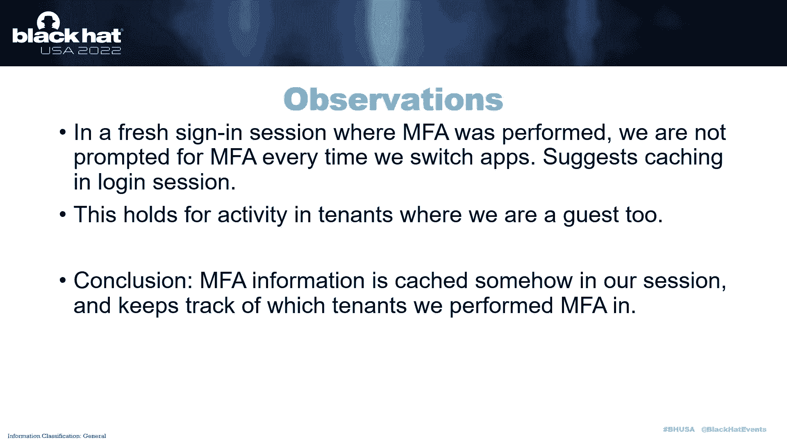

在 Microsoft Graph 中，外部用户有一个 `identities` 属性。与 Azure AD Graph 中的 `alternativeSecurityId` 不同，Microsoft Graph 允许有足够权限的主体修改这个属性。

在默认的身份提供者中，**电子邮件一次性密码** 类型引起了我的注意。它允许用户仅凭电子邮件地址登录，而无需真正的 Azure AD 或微软账户。

令人惊讶的是，**用户可以修改自己的 `identities` 属性**。用户角色定义允许用户“更新标识属性，但仅限于自身”。这开启了新的攻击场景：

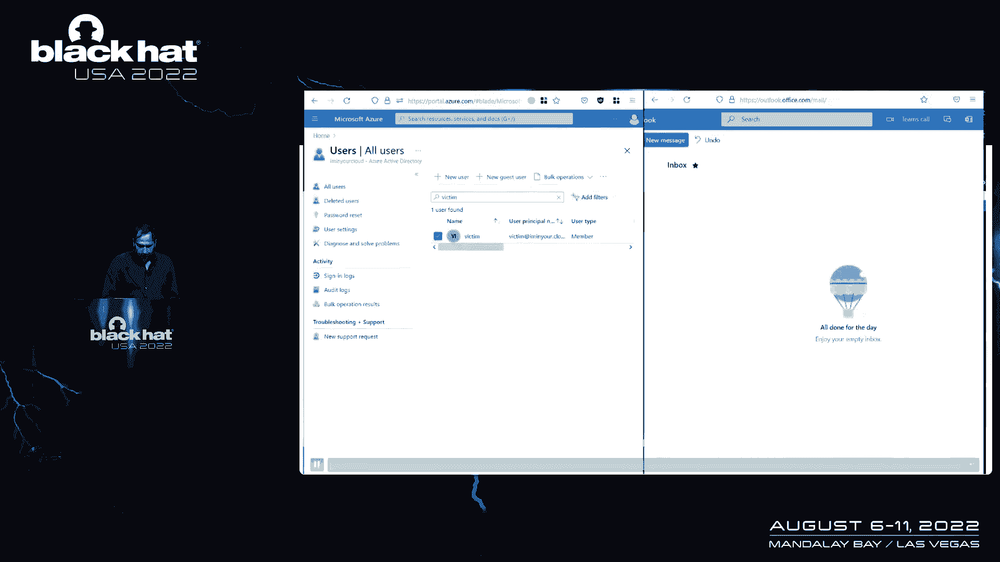

*   **临时账户访问**：如果通过恶意软件或钓鱼获得临时账户访问权，可以将该账户链接到攻击者控制的外部身份（如电子邮件 OTP 账户），实现持久化后门。
*   **令牌利用**：如果获得具有 `User.ReadWrite` 等权限的访问令牌，可以修改身份属性。
*   **应用程序接管**：控制具有足够权限的应用程序，也可实现此操作。

攻击演示：
1.  原始账户使用用户主体名登录。
2.  攻击者使用账户访问权限，通过 PATCH 请求向 `identities` 列表添加一个新的身份条目，类型为 “email”，颁发者为 “Microsoft”，登录名指向攻击者控制的电子邮件地址。
    ```http
    PATCH https://graph.microsoft.com/v1.0/users/<user_id>
    Content-Type: application/json
    {
        "identities": [
            {
                "signInType": "userPrincipalName",
                "issuer": "<tenant_domain>",
                "issuerAssignedId": "<upn>"
            },
            {
                "signInType": "email",
                "issuer": "Microsoft",
                "issuerAssignedId": "<attacker_controlled_email>"
            }
        ]
    }
    ```
3.  此后，攻击者可以使用该电子邮件地址登录，并选择切换到受害租户，从而以后门身份访问受害账户。

## 权限提升与 MFA 绕过

上一节我们看到了如何后门账户，本节将探讨更危险的组合技：**权限提升**和**MFA 绕过**。

一个更简单的权限提升方法是：**用户管理员可以将任何账户（包括全局管理员）转换为 B2B 来宾账户**。这可以通过 GUI 中的“转换为 B2B 账户”功能或向 Microsoft Graph 发送两个简单请求完成。转换后，攻击者用自己控制的外部身份登录，即获得高权限。

关于 MFA，一个关键的发现是：**MFA 状态似乎缓存在登录会话中，基于（源身份，家庭租户，目标租户）的组合，而没有与实际账户强绑定**。

这导致了“账户重新绑定”攻击：
1.  **初始设置**：攻击者合法受邀至受害租户，并为自己的来宾账户注册 MFA。
2.  **删除来宾账户**：攻击者离开组织，删除来宾账户，但登录会话保持，MFA 状态仍针对（攻击者身份，攻击者租户，受害租户）组合缓存。
3.  **重新绑定**：攻击者通过“转换为 B2B”或修改 `identities` 属性，将受害账户链接到攻击者身份。
4.  **绕过 MFA**：当以受害账户身份访问时，系统发现（攻击者身份，攻击者租户，受害租户）的 MFA 已满足，不再提示，从而绕过受害账户自身的 MFA 设置。

**攻击场景**：
*   将有限的账户访问（如仅密码或特定令牌）转换为持久的、绕过 MFA 的访问。
*   用户管理员可提升至全局管理员并绕过其 MFA。
*   即使租户禁用外部协作或电子邮件 OTP，攻击仍可能发生，因为攻击者可以先链接自己的账户注册 MFA，然后断开再链接到目标。

## 缓解措施与总结

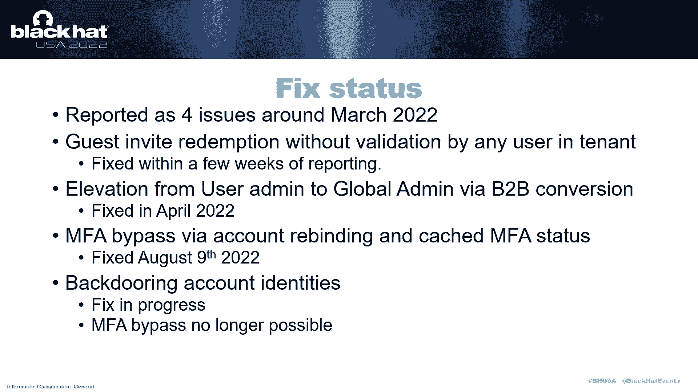

我已向微软报告了这些漏洞。其中部分（如无验证的邀请劫持、通过转换提升权限、MFA 重新绑定绕过）已被修复。但修改身份属性的后门技术仍在调查中。

**给防御者的建议**：

以下是关键的安全建议列表：
*   **清理未兑换邀请**：定期删除长期未兑换的来宾邀请。
*   **严格管理邀请权限**：限制普通用户发送邀请的权限，并仔细审查来宾用户的访问权限。
*   **配置协作限制**：使用允许域列表、限制来宾访问范围等功能。
*   **启用审计与监控**：使用提供的 KQL 查询监控可疑的邀请兑换和身份属性修改事件。
*   **全面强制执行 MFA**：在所有应用程序上强制实施 MFA，而非选择性实施，以消除安全短板。

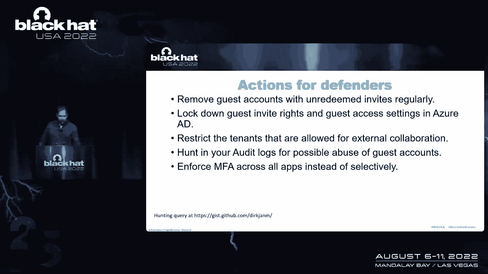

在本课程中，我们一起学习了 Azure AD 外部身份机制中存在的多种安全风险，包括邀请劫持、身份属性修改后门、权限提升和 MFA 绕过。理解这些漏洞的原理对于构建更安全的云身份体系至关重要。请务必实施上述缓解措施，并持续关注安全更新。