# 课程 P14：014 - 自动协议逆向工程 🧩

在本节课中，我们将学习什么是协议逆向工程，为什么它是一项重要且具有挑战性的任务，并介绍一个名为 **Pizza** 的工具，该工具能够自动从二进制可执行文件中提取通信协议。我们将了解其工作原理、核心算法，并通过实际演示来展示其强大能力。

---

## 什么是协议逆向工程？ 🤔

上一节我们介绍了课程概述，本节中我们来看看协议逆向工程的具体含义。

协议逆向工程是指学习两个程序之间对话规则的过程。这些规则被称为协议。它类似于学习人类语言的对话规则，但对象是机器。

一个协议通常可以用**状态机**来描述。每个状态代表程序期望接收或发送的消息。例如，一个FTP服务器的部分状态机可能显示，在初始状态下，它期望接收 `USER` 消息，然后转移到下一个状态并发送 `250 OK` 消息。

协议逆向工程的目标是从一个可执行文件中，自动学习其实现的**协议状态机**和**消息格式**。

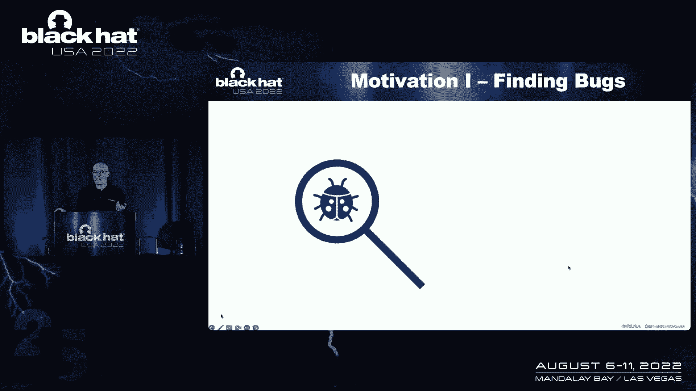

---

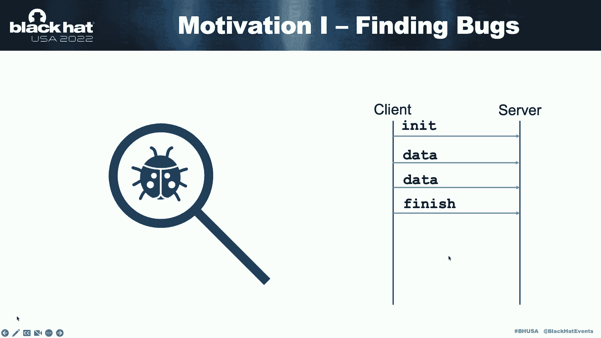

## 为什么需要协议逆向工程？ 🎯

理解了协议逆向工程的定义后，本节我们探讨其重要性和应用场景。

以下是进行协议逆向工程的主要动机：

1.  **寻找程序漏洞（Bug）**
    程序在实现协议时可能存在错误。通过提取实际的状态机并与预期协议对比，可以发现这些实现上的偏差，这些偏差可能就是安全漏洞。

2.  **检测后门（Backdoor）**
    攻击者可能在软件中植入后门，使用特殊构造的命令来获取访问权限。这类命令通常不是公开协议的一部分。通过逆向工程提取状态机，可以发现这些不应存在的“奇怪”命令。

3.  **分析恶意软件（Malware Analysis）**
    分析恶意软件时，常需要向其发送正确的命令，以触发其行为并进行分析。如果命令与控制（C&C）服务器已失效，逆向工程其协议是获取所需命令的唯一途径。

然而，传统的手动逆向工程过程非常耗时且困难，可能需要数天甚至数周时间。这促使了自动化工具的研究。

---

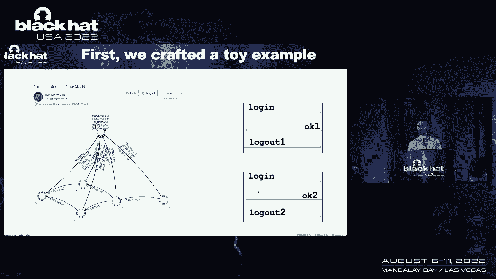

## 我们的方法与工具：Pizza 🍕

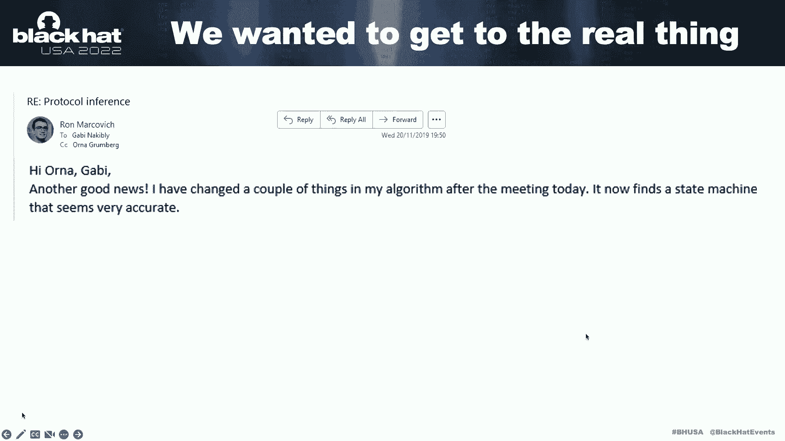

了解了需求和挑战后，本节我们将介绍能解决此问题的自动化工具 **Pizza**。

Pizza 工具旨在给定一个二进制可执行文件，在没有任何历史流量捕获或活跃协议端点（如已下线的C&C服务器）的情况下，自动提取其通信协议。它只依赖二进制代码本身。

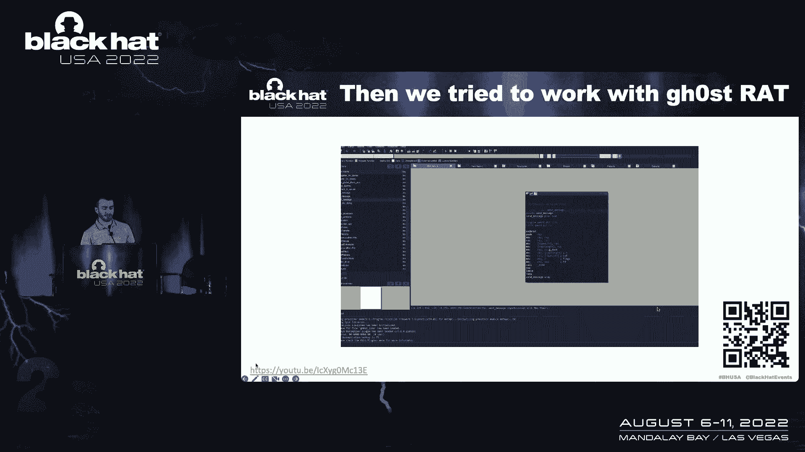

工具由两个核心组件构成：
*   **客户端（提问组件）**：基于 **L\* 算法**，负责学习协议状态机。
*   **服务器（应答组件）**：基于 **符号执行（Symbolic Execution）**，负责与二进制文件交互并回答客户端的问题。

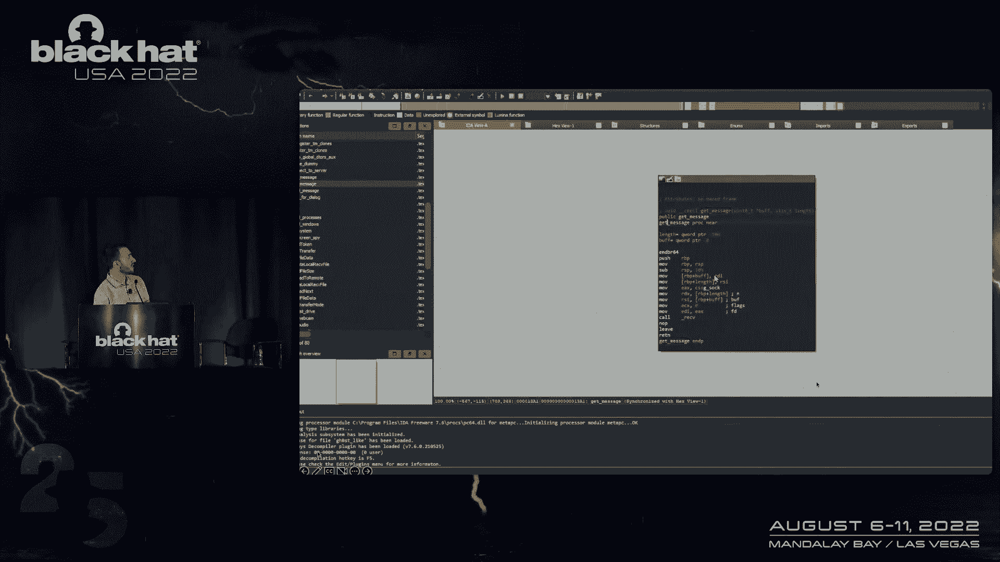

---

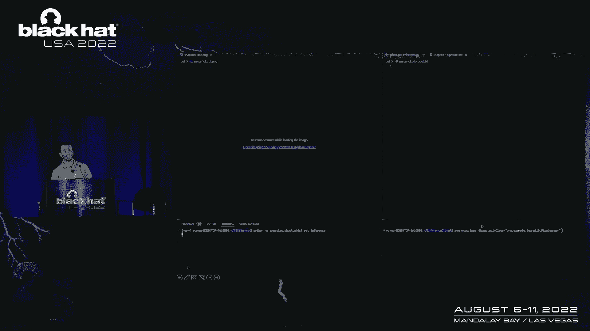

### 核心组件一：L\* 算法（提问者）

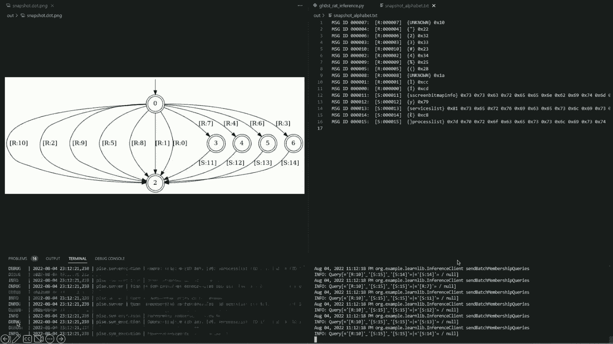

首先，我们来看看负责提问和构建状态机的客户端组件。

L\* 算法是一种用于学习未知正则集的自动机学习算法。在我们的场景中，这个“正则集”就是协议所允许的所有有效消息交换序列，它本质上描述了协议状态机。

算法通过询问**成员资格查询**来工作：
*   **查询形式**：“给定的消息类型序列 `S` 是协议有效的吗？”
*   **期望答案**：“是”或“否”。

算法不断提出此类问题，并根据答案逐步构建出完整的协议状态机。它非常高效，所需的问题数量仅是协议状态数的多项式级别。

**公式表示一个查询：**
`IsSequenceValid(Sequence S) -> {True, False}`

但这里存在一个关键问题：算法需要询问具体的消息序列，而我们最初并不知道协议的真实消息是什么。这就需要另一个组件来回答这些问题。

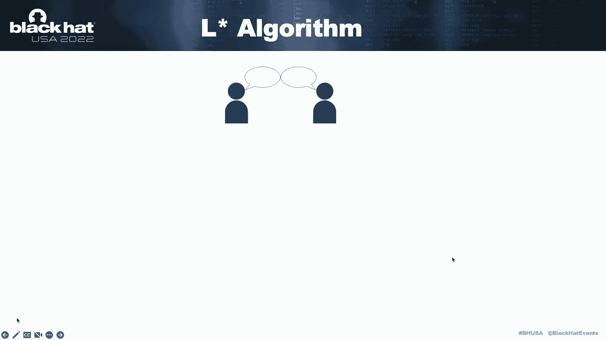

---

### 核心组件二：符号执行（应答者）

上一节我们介绍了提问的算法，本节中我们来看看工具如何利用符号执行来回答这些问题。

符号执行是一种静态分析技术，它允许我们在给定程序输入约束的情况下，探索程序所有可能的执行路径。

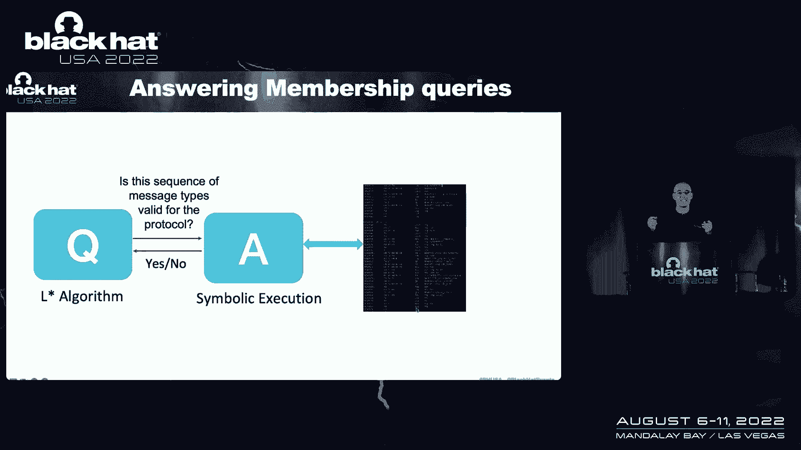

Pizza 利用符号执行来回答 L\* 算法提出的问题。具体过程如下：
1.  当被问到序列 `S` 是否有效时，符号执行引擎会尝试在二进制程序中寻找一条执行路径。
2.  在这条路径上，每当程序进行网络**发送（send）**或**接收（recv）**操作时，引擎会添加约束，要求该操作的消息类型必须与序列 `S` 中对应位置的消息类型相匹配。
3.  如果引擎能找到至少一条满足所有约束的完整执行路径，则回答“是”（序列有效）。否则，回答“否”。

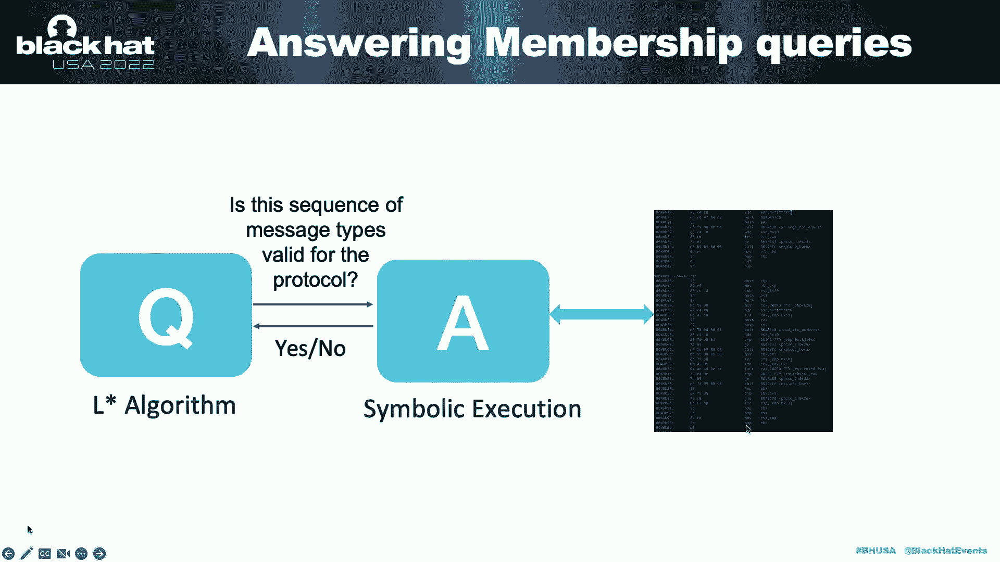

**代码概念描述这一过程：**
```python
def check_sequence(program, message_sequence):
    for op, expected_msg_type in message_sequence:
        if op == “recv”:
            constraint = (received_message == expected_msg_type)
        elif op == “send”:
            constraint = (sent_message == expected_msg_type)
        symbolic_execution.add_constraint(constraint)
    # 探索受约束的路径
    if symbolic_execution.find_valid_path():
        return True  # 序列有效
    else:
        return False # 序列无效
```

---

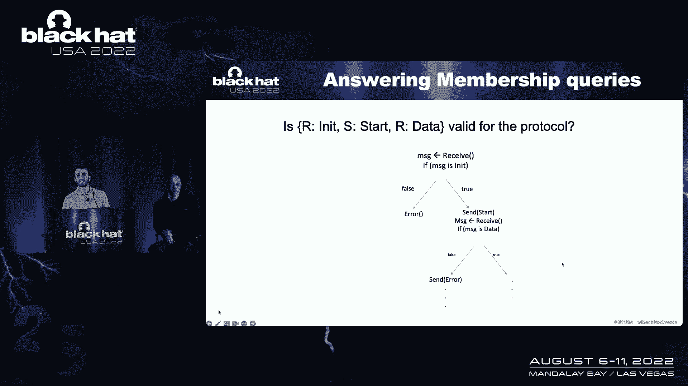

### 动态学习消息格式 ✨

我们提到过，工具开始时并不知道消息的具体格式。本节将解释它是如何动态发现这些格式的。

当符号执行验证一个序列有效后，它还会做一件事：探索在该序列之后，程序接下来可能**发送**或**接收**哪些具体的消息值（示例）。然后，工具会分析这组示例，提取它们的**公共特征**（例如，某些固定字节、特定格式），从而归纳出该位置的消息类型。

例如，从一组接收消息的示例 `{“DATA:foo”, “DATA:bar”, “DATA:123”}` 中，工具可以推断出消息类型是格式 `“DATA:”` 后跟可变内容。

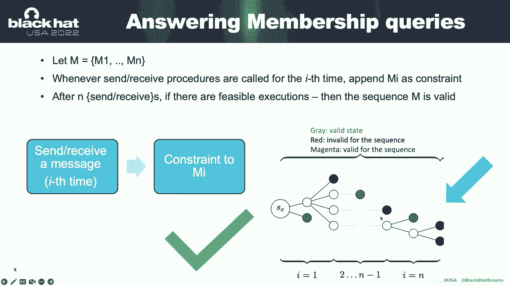

这个过程与状态机学习同步进行，使得消息类型集合能够被逐步、动态地构建出来。

---

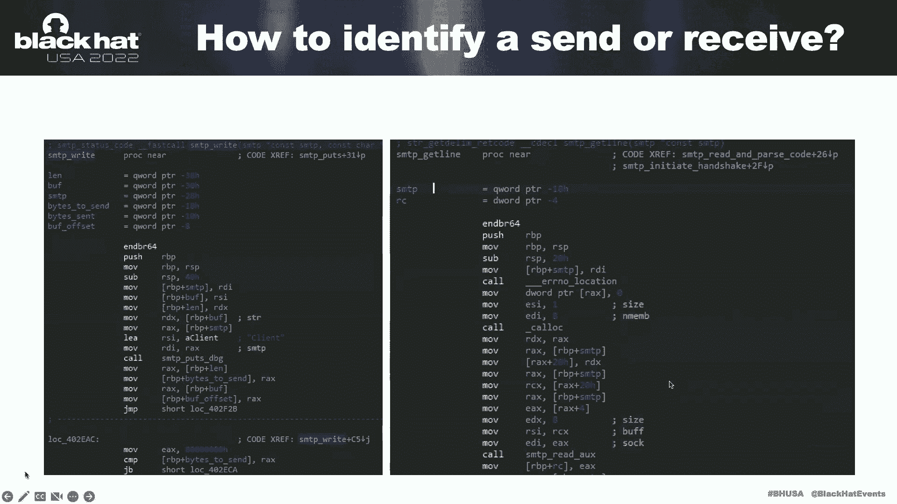

### 工具演示与性能 🚀

了解了核心原理后，我们通过一个实际案例来看看 Pizza 工具的表现。

研究团队将 Pizza 应用于一个著名的远程访问木马（RAT）—— Ghostwriter 的客户端二进制文件。
1.  用户只需手动标识出二进制文件中负责**发送**和**接收**网络消息的函数（这是对用户的唯一要求）。
2.  提供这些信息后，启动 Pizza 工具。
3.  工具在**两分钟**内自动逆向工程出了该恶意软件的完整协议状态机和消息格式。而同样的工作，手动完成可能需要数小时甚至数天。

这显著提升了分析效率。

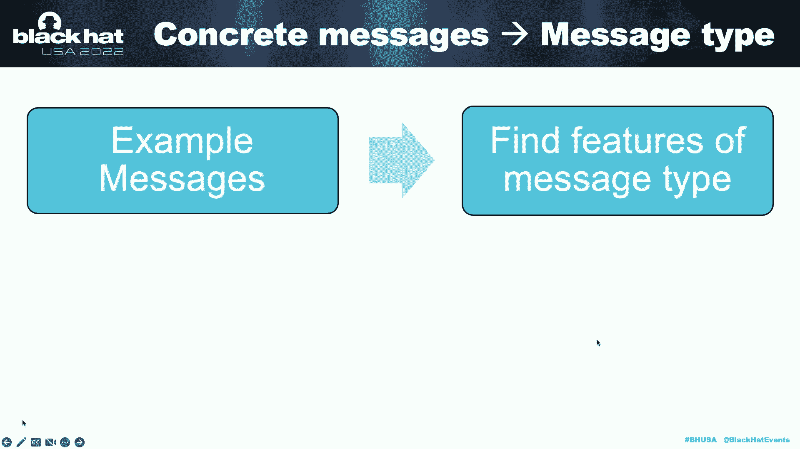

---

### 当前限制与未来工作 ⚠️

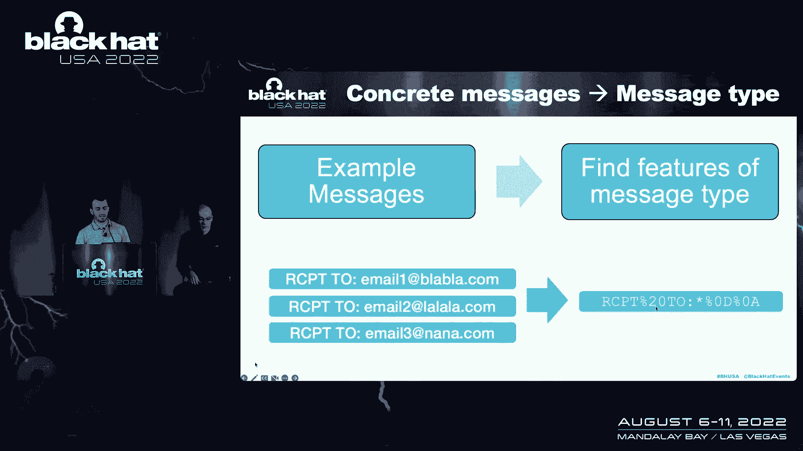

尽管 Pizza 工具非常强大，但它也存在一些依赖和限制。

工具的能力受限于其底层的符号执行引擎（目前使用的是 Angr）。该引擎存在一些局限性：
*   对**多线程程序**的支持存在困难。
*   对 **Windows API** 的支持不完全。

因此，Pizza 目前能分析的可执行文件类型受到一定限制。未来的工作包括扩展工具，使其能兼容更多符号执行引擎，从而支持更广泛类型的二进制文件。

---

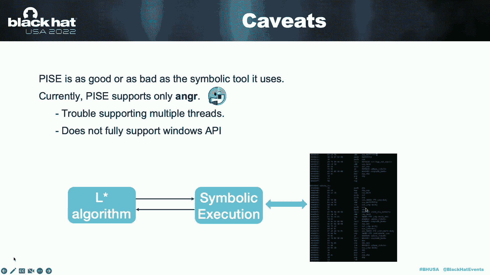

## 总结 📝

本节课中我们一起学习了协议逆向工程的概念、重要性及其自动化挑战。

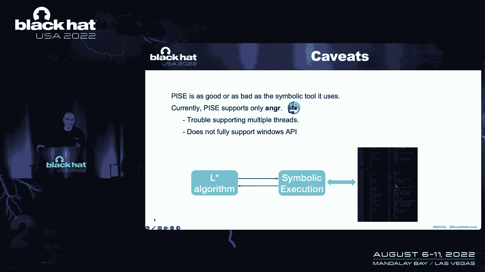

我们深入介绍了一个名为 **Pizza** 的自动化工具，它结合了 **L\* 算法** 和 **符号执行** 技术，能够直接从二进制可执行文件中自动提取通信协议的状态机和消息格式。这种方法无需流量捕获或活跃服务器，极大地加速了恶意软件分析和协议验证的过程，将耗时从数天缩短到数分钟。

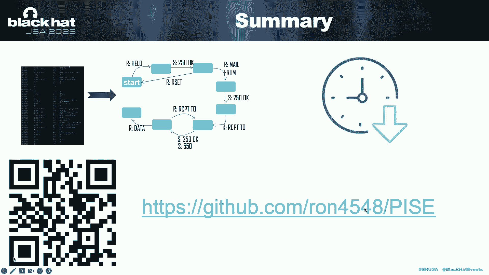

虽然工具目前依赖于特定符号执行引擎的能力，但它为自动化逆向工程领域提供了一个强大而实用的解决方案。