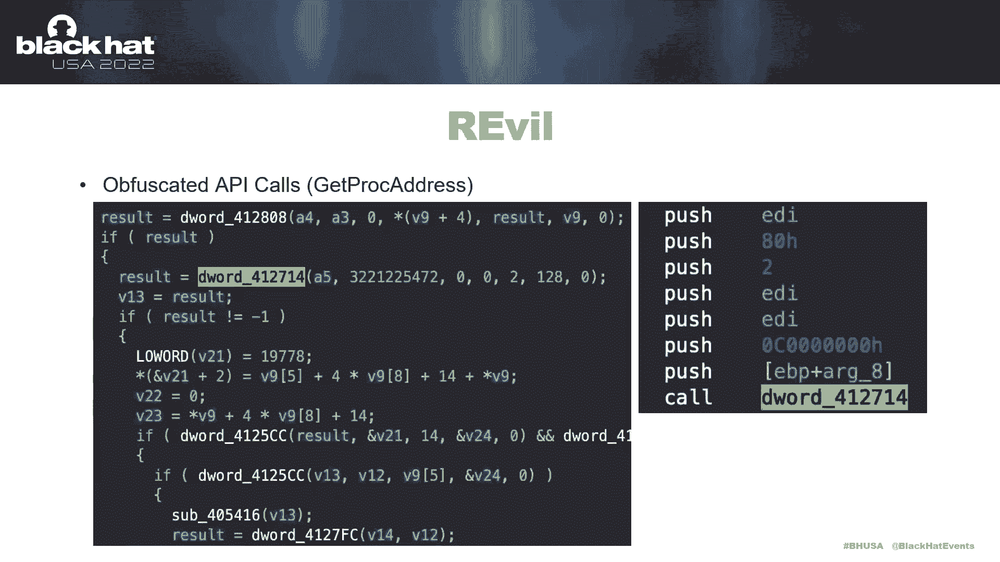
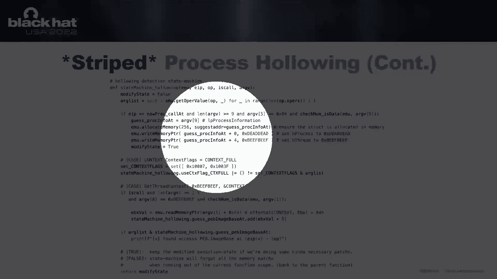

# 课程 P15：016 - 蓝队新趋势：使用符号执行引擎检测规避性恶意软件 🛡️🔍


在本节课中，我们将学习一种新的蓝队检测方法：利用符号执行引擎来有效检测各种恶意行为和勒索软件。我们将探讨当前静态和动态分析技术的局限性，并介绍一种能够克服这些瓶颈的新型引擎。

---

## 概述：现有检测技术的瓶颈

上一节我们介绍了课程主题。本节中，我们来看看当前主流的恶意软件检测技术及其面临的挑战。

传统检测方法主要分为以下几类：

*   **基于签名的检测**：需要庞大的签名数据库，难以应对行为多变的样本，且无法识别变种。
*   **基于动态执行的检测**：存在被绕过的高风险，并且扫描耗时较长。
*   **基于启发式或行为序列的检测**：例如基于API调用序列或汇编指令列表。这类方法虽然能捕获多种行为模式，但也存在不同问题。

以下是这些方法面临的共同困难：

*   需要持续更新签名。
*   动态分析耗时且可能被规避。
*   静态分析难以识别混淆或变种样本。
*   许多方法需要实时互联网连接。

这些局限性促使我们寻找新的解决方案。我们不仅希望判断文件是否恶意，更希望深入洞察其具体行为。

---

## 研究背景与灵感来源

在介绍我们的方法之前，我们先回顾三项重要的前期研究，它们为我们的工作提供了许多灵感。

1.  **2005年轻量级污点分析研究**：提出了基于数据引用关系的概念，这在当时是非常前沿的想法。遗憾的是，该研究没有发布可用的工具，且其方法无法完全解决样本分析问题。
2.  **2018年基于隐马尔可夫模型的研究**：用于识别混淆样本。但其参数设置有限，并非所有API参数都得到充分利用，这为后续研究留下了一些限制。
3.  **2020年基于语义和神经网络的方法**：能够在语义层面检测变体样本。但该方法缺乏解释能力，无法说明为何被判定为变体，更适用于分类而非深度分析。

基于这些研究的智慧，我们总结并构建了自己的方法：**一个基于符号执行的移动分析引擎**，它结合了语义库、指令标签和多种模块，能够更有效地识别二进制文件中的技术内容。

---

## 为什么选择符号执行？ 🧠

上一节我们了解了研究背景。本节中，我们深入探讨核心概念——符号执行。

**符号执行**是程序分析领域的一种技术，它使用符号值（而非具体值）作为程序变量，并探索程序的不同执行路径以获取输出结果。

用公式化的方式描述其核心思想：
```
对于程序 P，输入变量设为符号值 S。
引擎会探索 P 的所有可能路径 Path_i。
对每条路径 Path_i，引擎会收集路径约束条件 Constraint_i。
最终输出是路径集合 {Path_i} 及其对应的约束 {Constraint_i}。
```


在我们的应用中，我们意识到关键的恶意行为大多涉及对Windows API的滥用。因此，我们专注于分析从主函数到关键API函数（特别是`Win32 API`）之间的**数据引用过程**和**参数关系**。


通过利用指令标签库来评估各种行为，符号执行能为我们提供强大的分析能力。我们特别注重利用**轻量级污点分析**来追踪函数间的参数关联，这足以解决深度分析问题。

选择符号执行的优势在于：
*   **静态分析，低风险**：没有动态执行被绕过的风险。
*   **基于语义，低误报**：假阳性率非常低。
*   **高效可行**：整个方案是切实可行的。

---


## 我们的符号执行引擎架构 ⚙️


我们的符号执行引擎由五个串联的模块组成，共同提供完整功能。



以下是各个模块的简要介绍：


*   **控制流模块**：负责传递和控制每个代码块的分析流程。
*   **污点分析模块**：负责连接每个参数与函数间的关联关系。
*   **API识别模块**：负责识别指定的API及其功能内容。
*   **函数识别模块**：负责识别样本中的函数，包括经过混淆的函数。
*   **环境模拟模块**：负责模拟编译器和系统运行环境。


通过这个引擎，我们可以创建**符号化语义签名**作为检测规则。将规则和目标文件输入引擎后，能在很短时间内得到结果。输出不仅仅是“是否恶意”的判断，还能详细描述二进制文件中的具体恶意行为。根据规则复杂度，分析时间从几秒到一分钟不等，快速且稳定。


---


## 引擎关键技术演示


接下来，我们将通过几个具体案例，演示引擎如何工作。


### 案例一：识别无API名称的样本（以`BazarLoader`为例）

许多恶意样本会完全抹去API名称以规避检测。我们的引擎能够克服这个问题，通过参数特征推断出原始的API调用。

例如，在一个函数调用中：
*   第一个参数看起来像通用读写权限 `GENERIC_READ | GENERIC_WRITE`。
*   第三个参数看起来像创建标志 `CREATE_ALWAYS` 或 `OPEN_EXISTING`。


结合这些特征，我们可以推断该调用可能是 `CreateFile` API。我们使用这个原理扫描了大量样本。以著名的`BazarLoader`勒索软件为例，它完全混淆，二进制文件中没有任何API名称，只在运行时通过函数表动态解析API。


我们的引擎无需运行样本，仅通过静态分析参数特征，就成功检测出其中存在 `CreateFile` API调用。通过逆向工具`IDA Pro`进行双重验证，确认了该指针确实被用于类似创建文件的功能。


### 案例二：基础行为分析


我们的引擎 `TX One Semantic Analyzer` 以 `Vivisect` 作为反编译引擎。研究人员可以提交二进制文件，引擎会遍历每个函数并逐一分析其汇编指令。同时，用户可以编写规则来接收事件、内存访问和地址信息，从而洞察可疑行为。


例如，一个简单规则可以打印出所有被调用的API。对于某个样本，规则显示它尝试使用 `CreateProcess` API 来运行某个可执行文件（如`cmd.exe`），并且在此之前还尝试使用 `WSAConnect` 连接到远程地址。基于这种上下文关联，我们可以判断该程序具有反向Shell的能力。


### 案例三：模拟执行环境


我们的引擎是纯静态的，但为了正确分析程序逻辑，需要模拟大量必要的API实现。例如，`LoadLibrary`、`GetProcAddress`、`GetTickCount`等API是许多程序运行所必需的。我们在引擎环境中实现了这些必要的API模拟。


用户可以编写 `TR` 规则，规则包含三个回调函数：`setup`, `cb` (指令回调), `clean`。在 `cb` 函数中，规则可以接收每条汇编指令的事件，记录特殊行为。引擎分析完所有函数后，`clean` 函数会收到事件，最终规则可以做出判定并生成类似 `Yara` 规则的结果。

---

## 实战：检测高级恶意技术

现在，我们来看引擎如何检测几种复杂且流行的恶意技术。


### 技术一：CRC32哈希计算 🔢


`CRC32` 哈希算法被广泛用于字符串哈希或简单校验。其核心逻辑是使用一个魔术数（如 `0xEDB88320`）对数据循环进行异或和移位操作。


用伪代码描述其核心循环：
```c
crc = initial_value;
for each byte in data {
    crc = (crc >> 8) ^ crc_table[(crc ^ byte) & 0xFF];
}
// 其中 crc_table 与魔术数 0xEDB88320 相关
```

我们的规则可以检测二进制中是否存在使用魔术数 `0xEDB88320` 进行循环异或操作的指令模式。一旦发现，就可以确信存在 `CRC32` 计算行为。这是一个相对简单直接的检测。

### 技术二：反射式DLL注入（Reflective Loader） 🎯

反射式加载器是一种高级注入技术，它将DLL直接注入远程进程内存并执行，无需依赖Windows加载器。它高度变异，难以用固定模式检测。

其典型三步设计如下：
1.  **计算大小**：解析自身PE头，确定需要分配多少内存来容纳整个恶意二进制。
2.  **重定位修复**：解析数据目录，修复导入地址表（IAT）等指针。
3.  **执行入口**：解析入口点地址，并跳转执行恶意代码。

我们的 `TR` 规则设计如下：
1.  首先检测是否有指令在比较数据与魔术数（如 `"MZ"` PE头标志），将其加入观察列表。
2.  随后在代码中检测是否使用了观察列表中的结构，例如：
    *   使用观察列表中的`SizeOfImage`调用`VirtualAlloc` -> 试图在内存中分配空间装载恶意二进制。
    *   使用观察列表中的关键数据目录进行内存写入 -> 试图修复导入表。
    *   跳转到观察列表中入口点的地址 -> 试图唤醒恶意入口函数。
3.  如果在同一函数中同时检测到这三种行为，则判定为反射式加载器。

我们在一个2023年7月的新样本上测试，成功准确地识别出了负责反射式加载的函数。

### 技术三：进程镂空（Process Hollowing） 👻

进程镂空是恶意软件隐藏自身的另一种典型技术，被编译器广泛使用。攻击者创建一个挂起的合法进程，然后将其内存替换为恶意代码。

其步骤通常为：
1.  **创建挂起进程**：使用 `CreateProcess` 以挂起模式创建一个合法进程（如`svchost.exe`）。
2.  **获取并修改内存**：使用 `GetThreadContext` 获取新进程的上下文（`CONTEXT`结构），找到进程环境块（PEB）和映像基址。然后取消映射原始映像，并在此地址写入恶意二进制。
3.  **恢复执行**：恢复线程执行，此时进程运行的是恶意代码。

我们的检测规则利用引擎的API模拟功能：
*   规则首先观察所有 `CreateProcess` API调用。
*   引擎提供 `API_Micro_Simulator` 功能，可以在特定地址创建微模拟器，模拟后续代码执行。
*   在模拟过程中，检查后续代码是否调用了 `GetThreadContext`，或是否在内存中写入数据以修改PEB和映像基址。
*   结合这些行为，可以确认该样本试图进行进程镂空，以控制目标EXE模块。

我们收集了233个被标记为具有“注入行为”的新鲜样本进行测试，其中高达61%被确认为典型的进程镂空行为，其余多为黑客工具。


---

## 专项检测：勒索软件 🚨




感谢Morris的介绍。现在我来讲解如何使用我们的 `TSR` 引擎专项检测勒索软件。

我们为勒索软件检测建立了基于三个共同特征的标准：
1.  **文件枚举**：在磁盘上查找多个文件。
2.  **文件操作**：为每个文件创建句柄，并进行读写。
3.  **文件加密**：对文件内容进行加密。

这三个特征通常按顺序发生。我们还实现了**功能链**分析，以帮助过滤掉不属于勒索软件工作流的无关特征。我们主要检测两种函数链：`文件枚举 -> 文件加密` 和 `文件枚举 -> 文件操作 -> 文件加密`。


### 规则实现

以下是针对这三个特征的规则实现思路：

*   **文件枚举**：识别 `FindFirstFile` 和 `FindNextFile` 等API。比较它们的第一个参数，分析文件名的使用情况，并在检测日志中记录。
*   **文件操作**：识别 `CreateFile` 及其他文件操作相关API。分析返回的文件句柄如何被存储（通常在局部变量中），并在后续操作中被加载使用。
*   **文件加密**：采用高级策略，结合明显的加密API识别（如 `CryptEncrypt`）和基于模式的规则。


### 检测验证

通过查看检测日志，我们可以验证工具的有效性。例如，对 `Babuk` 勒索软件的检测日志显示：
*   在文件枚举部分，列出了被查找的潜在文件。
*   在文件操作部分，记录了被操作的文件句柄。
*   在文件加密部分，识别出了加密行为。

对于 `DarkSide` 和 `LockBit` 等勒索软件家族，我们的引擎也能同样有效地检测出这三个特征。

### 提升检测能力

现实世界中的勒索软件使用多种加密算法，仅靠API规则难以覆盖。为此，我们实施了**基于模式的规则**来增强检测。

例如：
*   `DarkSide` 使用了自定义的Salsa20算法，我们通过捕捉其特征模式来检测。
*   `Conti v7` 使用了 `RC5` 加密（不在标准API中）和 `NtOpenFile`（而非 `CreateFile`）进行文件操作。我们分别实施了基于模式的规则来识别这两种行为。

### 实验效果

我们收集了全年被多家主流商业防病毒软件标记为勒索软件的样本，并用商业沙箱过滤掉那些不实际加密文件的样本，构建最终测试集。我们的引擎取得了约 **96%** 的检出率，能够检测到64个勒索软件家族及其变种。

当然，也存在一些未检出的样本，例如 `Phobos` 使用了未知的加密算法。对于这种情况，我们可以像处理 `DarkSide` 一样，后续为其添加特定的模式识别规则。

此外，我们的假阳性实验结果显示误报率接近**零**，这表明我们的工具能够精准检测勒索软件。

---

## 总结与展望 🚀

本节课中，我们一起学习了以下内容：


1.  **识别了瓶颈**：我们认识到现有检测技术存在强度不足、难以应对高度变异的恶意软件和勒索软件等局限性。
2.  **提出了新方案**：我们采用符号执行技术来检测多种恶意攻击，并展示了良好的效果，尤其是解决了用传统模式匹配难以实现的高级恶意行为检测。
3.  **验证了可行性**：我们的实验表明，轻量级的符号执行解决方案能够有效解决现实世界的复杂问题，并对代码混淆有很强的抵抗力。
4.  **开源与协作**：我们希望这个引擎能帮助全球的蓝队。因此，我们将其在GitHub上开源，并期待社区能与我们一同制定更多规则，以增强整体防御能力。

**核心要点**：符号执行引擎通过 `符号值分析` + `污点追踪` + `语义规则`，实现了对 `高度混淆` 和 `变异恶意软件` 的精准、静态、高效检测。

我们的目标是推动蓝队防御技术的进步。如果你有任何问题，欢迎通过Twitter或GitHub链接联系我们。


感谢收听！