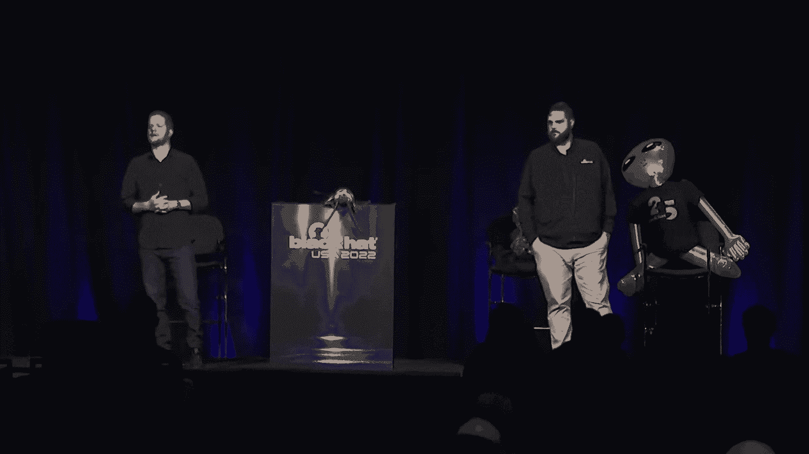

# 课程P16：017 - 第八届美国黑帽大会NOC报告 🛡️

在本节课中，我们将学习如何为一个大型安全会议（以美国黑帽大会为例）搭建并运营一个稳定、安全的网络运营中心。我们将了解其核心目标、架构设计、使用的工具以及运营过程中遇到的挑战与趣事。

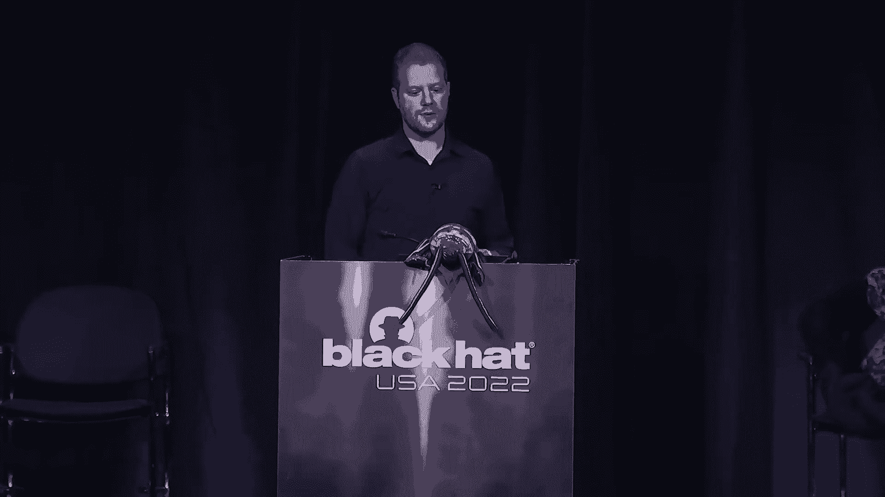

## 概述与团队介绍

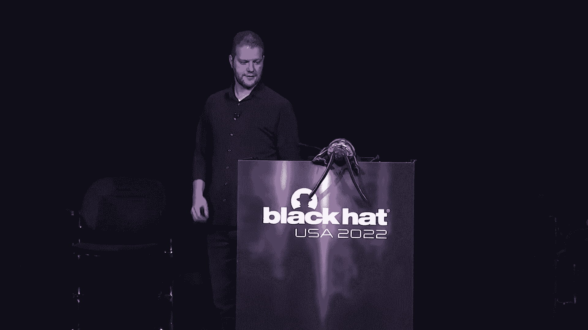

我是尼尔·维勒，白天是IBM X-Force主动威胁评估的全球负责人，晚上则为黑帽大会服务。今年是我参与黑帽大会的第二十周年。我的搭档是巴特·斯坦普，他作为网络证人的高级安全专家，也已参与此事十五年。我们共同负责黑帽大会的网络运营中心。

我们并非独自工作。我们拥有一支由15名技术助理组成的志愿者团队，以及多家合作伙伴公司，共同确保网络顺畅运行。

## 合作伙伴与设备架构

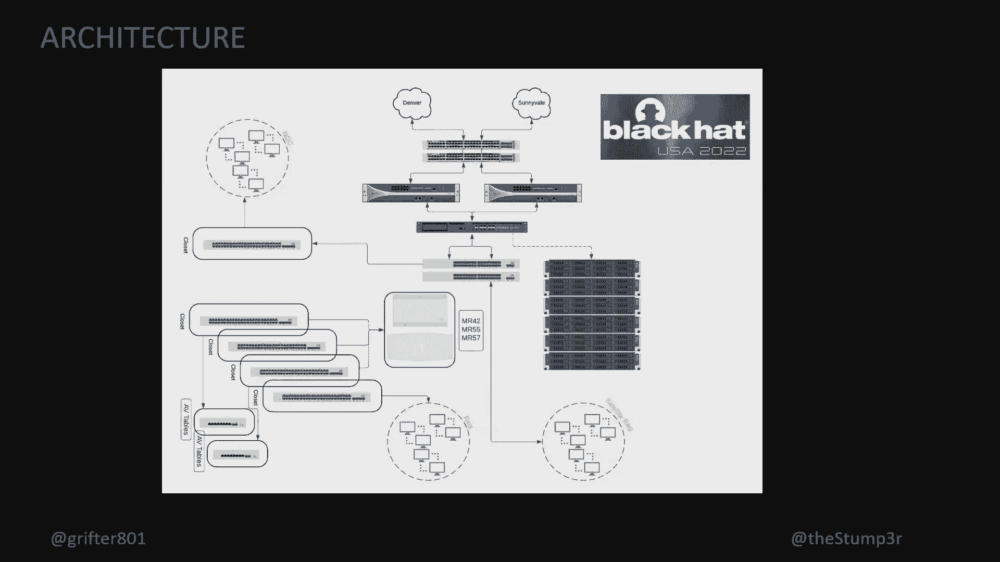

上一节我们介绍了核心团队，本节中我们来看看支持我们工作的合作伙伴与核心设备。

我们的合作伙伴包括帕洛阿尔托（提供防火墙）、思科（提供交换、接入点及安全服务）、世纪链接/流明（提供网络电路）、Gigamon（提供网络数据分流与监控工具）以及网络证人（提供日志、数据包和端点数据采集）。

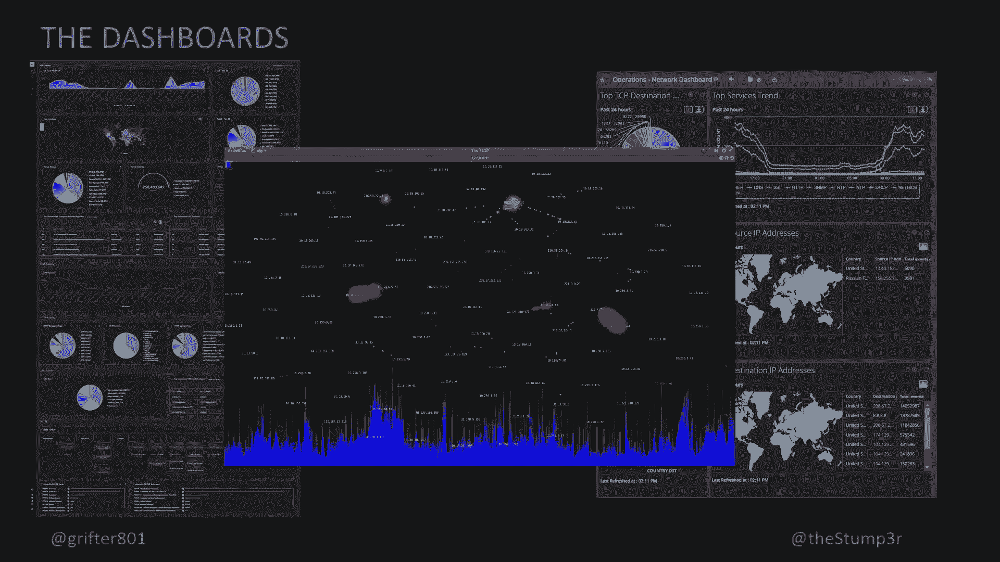

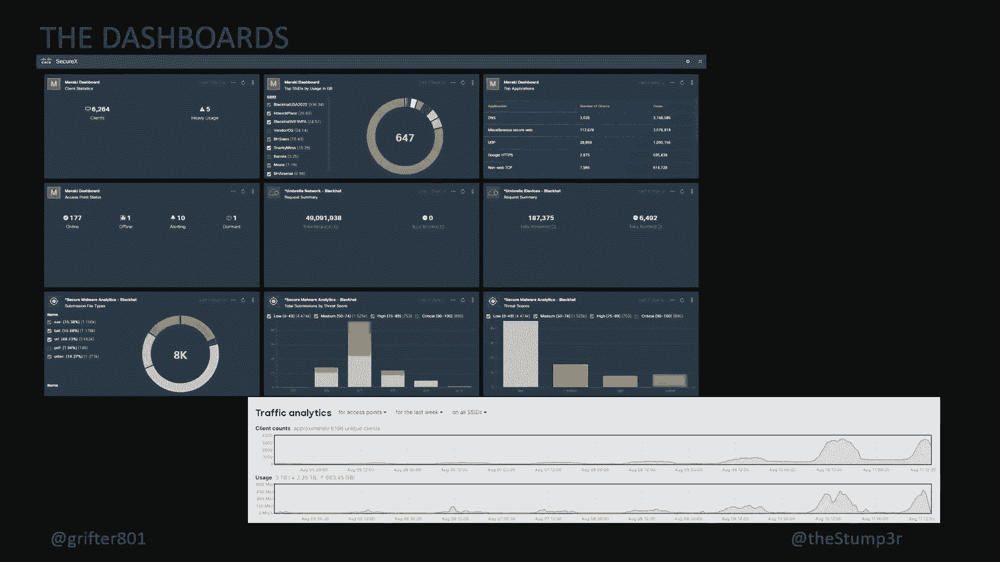

以下是构建整个网络所需的核心设备与方案列表：
*   **防火墙**： 由帕洛阿尔托提供，作为整个网络的第三层网关。
*   **交换与无线**： 由思科提供，负责所有有线与无线接入。今年由于供应链问题，思科在关键时刻提供了大量硬件支持。
*   **网络电路**： 由流明提供两个10G电路。
*   **数据监控**： 由Gigamon提供网络分流器，将流量镜像给所有安全分析工具。
*   **安全分析平台**： 由网络证人提供，进行全流量数据包捕获、日志记录和端点注册。
*   **其他工具**： 还包括开源工具、IronNet（提供额外可见性）等。

## 网络架构与设计目标

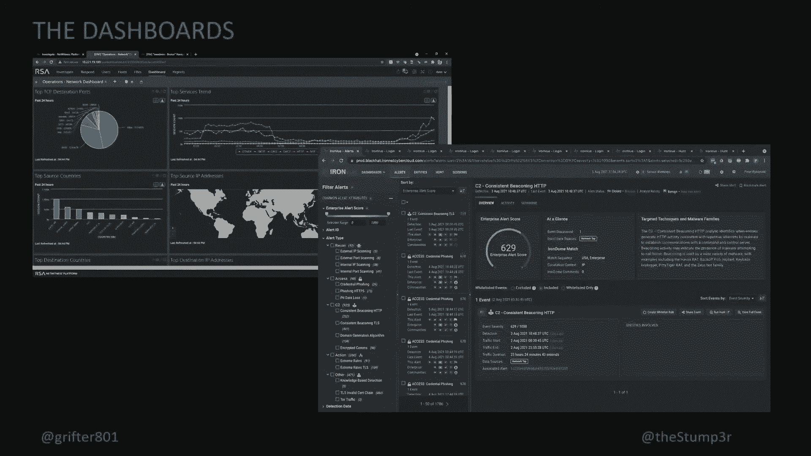

在了解了合作伙伴后，我们深入看看网络是如何架构的，以及我们的核心设计目标。

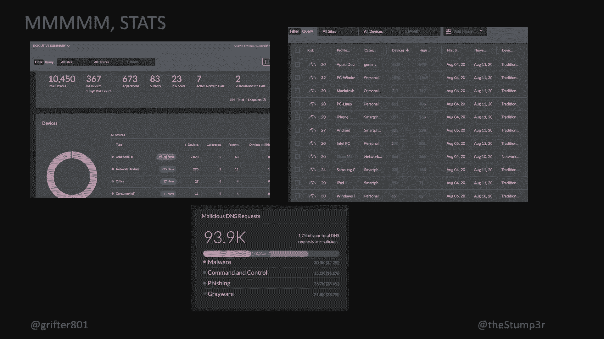

我们的网络架构追求逻辑清晰与冗余。核心是两台提供冗余的防火墙，作为所有VLAN的网关。所有流量通过Gigamon分流器，被同时发送给网络证人、思科安全工具、开源工具等进行分析。

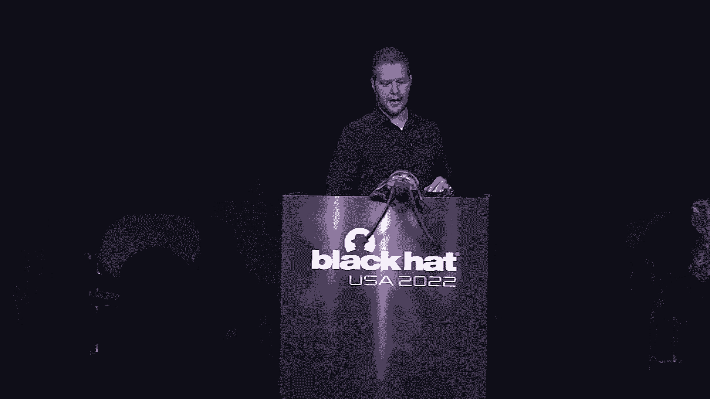

我们的核心目标按优先级排序如下：
1.  **稳定性**： 首要目标是保证网络稳定可用。任何中断都会直接影响高价培训课程和展会注册，这是我们无法接受的。
2.  **安全性**： 在稳定的基础上，我们实施全面的安全监控。这包括网络分割（防止参会者互相攻击）、威胁狩猎、恶意软件沙箱分析、身份与访问管理以及自动化检测。

## 运营仪表板与数据分析

网络搭建好后，运营阶段我们依靠一系列仪表板来监控状态。本节我们来看看这些仪表板能告诉我们什么。

我们使用多种仪表板来可视化网络状态。其中一个关键工具是**长椅地图**，它能动态显示网络中最活跃的50台主机及其通信协议（TCP/UDP/ICMP），帮助我们快速发现异常流量模式。

此外，我们还有统计信息仪表板，显示诸如：
*   在线独立设备数量（超过10，000台）
*   物联网设备类型（367种）
*   操作系统分布（苹果设备居多）
*   恶意DNS请求数量（近94，000次）
*   总数据包数量（32亿个）

这些数据为我们提供了网络健康的宏观视角。

## 安全事件与威胁狩猎实践

有了数据和监控，真正的安全运营在于发现和响应威胁。本节我们通过实例看看威胁狩猎是如何进行的。

黑帽大会的网络环境极其复杂，恶意流量频发。我们将其比喻为“在针堆里找针”。我们的威胁猎人团队（来自各合作伙伴）会人工审查告警。

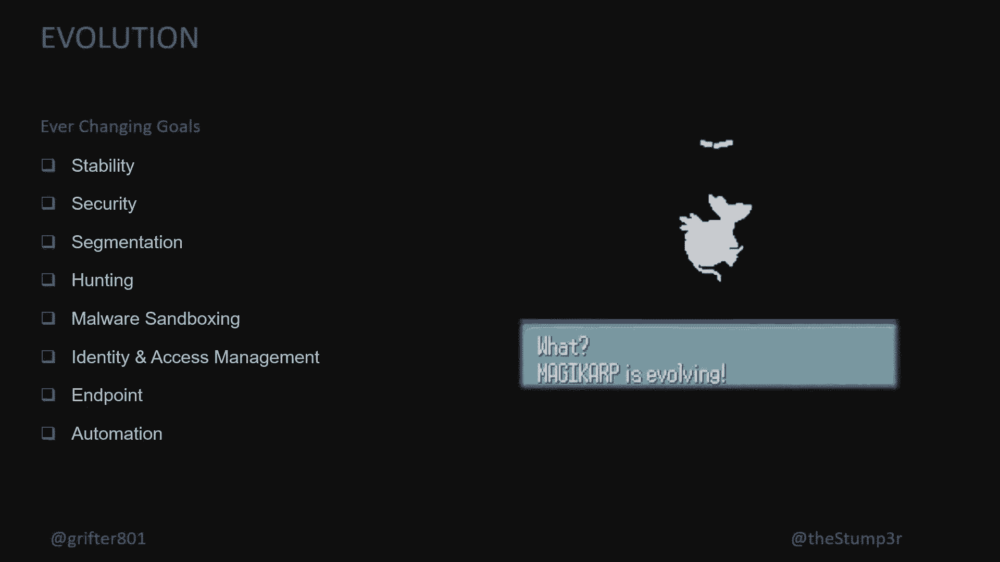

**自动化**在此扮演重要角色。例如，当检测到疑似命令与控制（C2）流量或明文凭证传输时，系统会自动介入调查。如果确认存在恶意行为，我们会为该用户设备启用** captive portal **（强制网络门户），展示其恶意流量证据，并进行安全教育。

我们所有合作伙伴的工具和团队通过Slack紧密协作。在一个平台发现的线索会迅速共享给其他团队进行交叉验证，确保没有漏网之鱼。

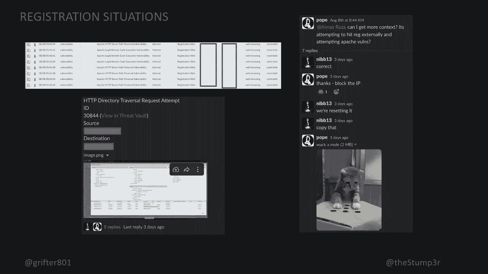

## 经验教训与趣闻分享

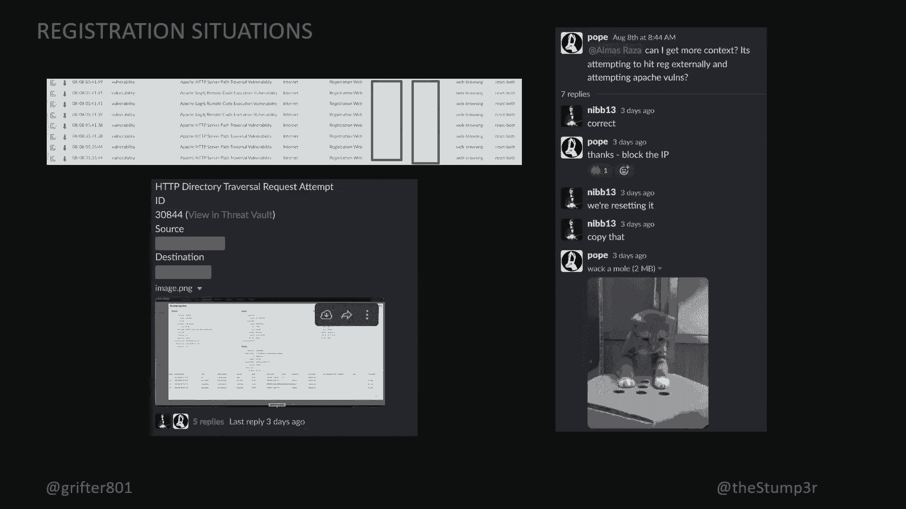

在运营过程中，我们总会遇到计划外的情况并从中学习。本节分享一些我们的经验教训和有趣发现。

**教训：隔离至关重要**
在一次培训课的网络故障中，我们经历了长时间的排错，最终发现是讲师镜像中的一个服务产生了广播风暴。这提醒我们，关键系统（如注册服务器）必须进行严格的网络隔离。事实上，我们曾因配置疏忽将管理流量与注册服务器置于同一交换机，导致链路拥塞，这是一个深刻的教训。

**趣闻：不安全的通信**
每年我们都会发现场馆或安保公司的电子邮件以明文方式传输，内容甚至包括人员解雇通知。这再次证明了基础安全措施的重要性。

**趣闻：物联网设备风险**
我们发现了大量物联网设备，其中一些安全性堪忧。例如，我们看到了明文传输视频的家庭安防摄像头、远程宠物喂食器（一只名叫加菲猫的猫）等。这些设备往往缺乏基本加密。

**发现：不安全的API**
在一次深度挖掘中，我们发现一款外币交易应用虽然主要通信使用HTTPS加密，但其关键的交易状态API调用却是明文的。这提醒我们，不能盲目信任应用程序声称的安全性，必须进行实际验证。

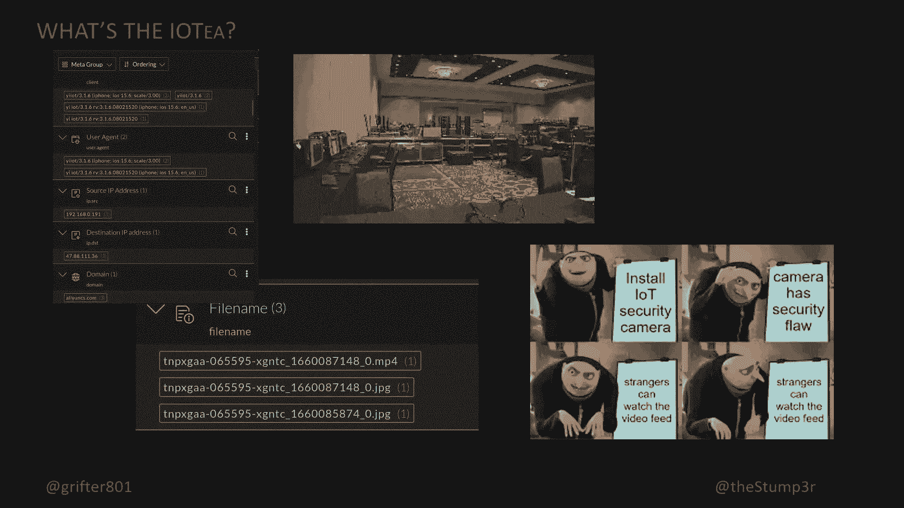

## 总结

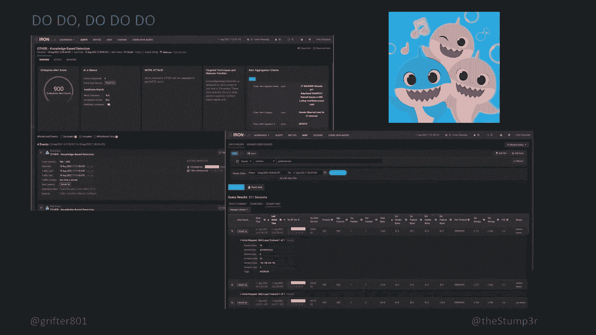

本节课中，我们一起学习了为一个顶级安全会议构建NOC的全过程。我们从**团队与合作伙伴**开始，了解了**网络架构与核心设备**。我们明确了运营的双重核心目标：**稳定性优先，安全并行**。通过**多样化的仪表板**，我们实现了对网络状态的全面监控。在安全方面，我们结合**人工威胁狩猎**与**自动化响应**，在极其复杂的环境中有效发现并处置威胁。最后，我们分享的**经验教训与趣闻**表明，安全是一个持续演进的过程，需要从每一次事件中学习，并对所有连接设备保持警惕。黑帽NOC的目标不仅是防御，更是教育，让每一位参会者在离开时都比来时更加安全。