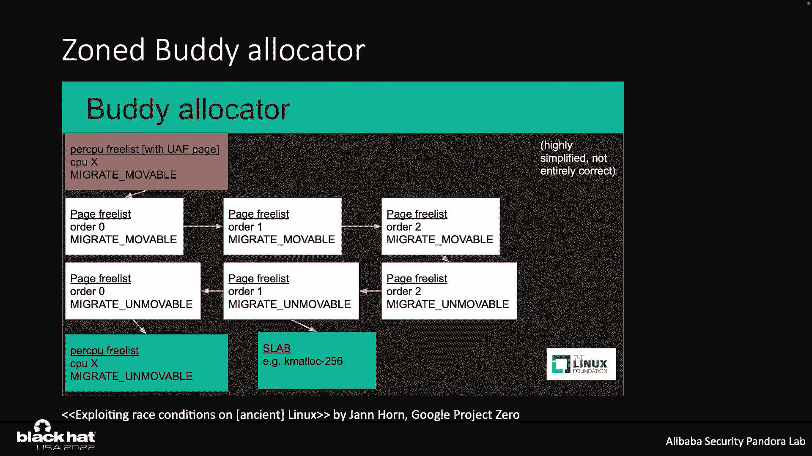
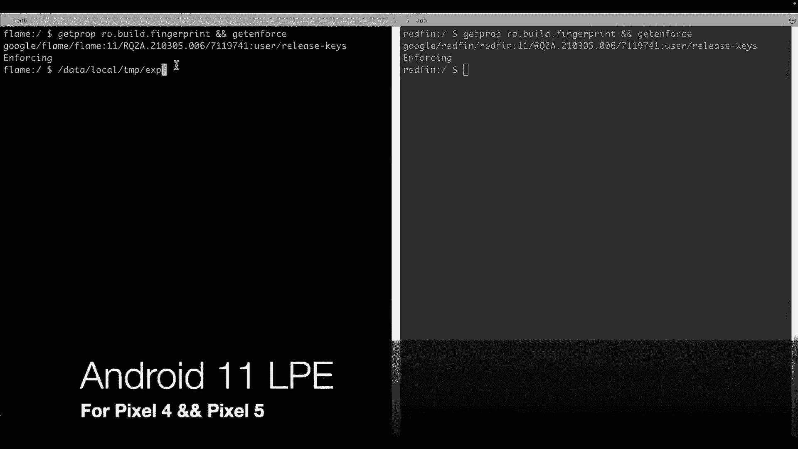

# 课程 P17：018 - Ret2page：利用释放后重用漏洞的艺术 🎯

在本节课中，我们将学习一种名为“Ret2page”的新颖利用技术，它专门用于在Android内核的专用缓存中利用释放后重用漏洞。我们将从回顾通用缓存中的传统利用方法开始，深入分析Slab和伙伴分配器的关键部分，并详细讲解跨缓存攻击的核心概念。最后，我们将通过分析去年修复的两个典型UAF漏洞，来具体演示如何应用Ret2page技术。

## 通用缓存与专用缓存回顾 🔄

在开始讨论如何在专用缓存中利用UAF漏洞之前，让我们先简要回顾一下在通用缓存中利用UAF漏洞的典型思路和步骤。

Linux内核中的缓存主要分为两类：通用缓存和专用缓存。
*   对于通用缓存，只需调用 `kmalloc` 和 `kfree` API 来分配和释放堆对象。
*   对于专用缓存，缓存是为特定类型对象创建的。在分配和释放时，必须提供相应的缓存指针。

近年来，随着攻击面不断减少，在Android内核的不可信应用上下文中可利用的漏洞越来越少。去年修复的第二个eBPF子系统漏洞和第四个TTY驱动程序漏洞，即使第二个漏洞在野外被利用过，也并未引起太多关注。去年，没有像Dirty Pipe那样针对Android内核的公开漏洞利用。

## 通用缓存中的UAF漏洞利用案例 📖

为了理解差异，我们先回顾两个典型的Android漏洞利用，看看它们是如何利用通用缓存中的UAF漏洞的。

第一个漏洞是CVE-2020-0041。相关的 `binder_ref` 对象分配在 `kmalloc-128` 缓存中。为了伪造 `binder_ref` 对象，公开的漏洞利用使用了 `epitem` 对象来重新占用被释放的 `binder_ref` 对象。在泄露了 `binder_ref` 的内核地址后，他们使用了 `sendmsg` 喷射技术来获得写原语，然后通过破坏泄露指针的某些字段来获得任意读写原语。

第二个漏洞也是一个binder漏洞。他们利用 `seq_file` 对象来获取内核地址偏移，同样使用 `epitem` 对象来获得任意读写原语。

很容易发现，`seq_file` 对象确实是分配在通用缓存中的。然而，`epitem` 对象似乎分配在专用缓存中。为了消除这个疑问，让我们深入源代码。

## Slab分配器合并机制与演变 🔍

当创建一个新的Slab缓存时，它首先会尝试找到一个可以合并的现有缓存，目的是减少内存碎片。

`slab_merge` 配置通常是启用的。如果新缓存有一个构造函数，它可以在没有特殊标志的情况下合并到另一个缓存中。新缓存将被合并到另一个具有基本相同配置的缓存中。这就是为什么 `epitem` 对象最终被分配在通用缓存中的原因。

但从Android 11开始，情况发生了变化。

在Android 11中，`seq_file` 有了自己的专用缓存，并且 `slab_account` 被设置，这意味着这两个缓存都不会被合并到通用缓存中。

从Android 12开始，`freelist` 随机化和硬化都被启用，这在我看来是一种释放后重用缓解措施，并且 `slab_merge` 开关仍然开启。

从Android 13开始，`slab_merge` 开关默认是关闭的。

这意味着专用缓存永远不会被合并到通用缓存中，代价是增加了内存碎片。显然，从 `kmalloc` 分配的不同类型对象仍然共享同一个缓存。因此，要利用专用缓存中的漏洞，必须应用跨缓存攻击技术，使不同类型的对象共享同一块内存。

## 跨缓存攻击的核心挑战与思路 🧩

这是一个如何利用UAF漏洞的典型例子。关键点在于，对象B的喷射区域与被释放的对象A重叠。那么，如何可靠地重新占用被释放的对象A呢？

要回答这个问题，让我们深入Slab分配器。这里列出 `kmem_cache` 结构的一些重要字段，现在我们只关注 `cpu_slab` 和 `node` 字段。

`kmem_cache` 的 `cpu_slab` 是按CPU核分配的。我们可以通过设置亲和性将一个进程固定到特定的CPU核上。可以简单地认为Android设备只有一个CPU核，统一内存架构并未启用，因此只有一个CPU Slab。

分配对象时，它首先尝试从 `freelist` 分配。`freelist` 指向一个物理页（这里PFN 1100），这被称为快速路径。当第1100页被对象填满时，第2020页将被移动到 `freelist`。现在，`kmem_cache_node` 的 `partial` 链表是空的。`kmem_cache_cpu` `partial` 链表中的第3330页将被移动到 `freelist`。

当 `kmem_cache_cpu` `partial` 链表中的所有页都被对象填满后，将从伙伴分配器分配一个新页（第1338页）。当释放一个对象时（分别来自第3330页和第1440页），这两页将被添加到 `kmem_cache_cpu` 的 `partial` 链表中。这些页处于所谓的“冻结”状态。

当 `kmem_cache_node` `partial` 链表中的页数大于 `min_partial` 时，空的第1100页将被释放并由伙伴分配器回收。

假设一个用户句柄与被释放的对象A关联。对象A可能是从第2020页分配的。当喷射对象B时，被释放的对象A很可能通过快速路径被重新占用，这使得重新占用变得可靠。

但是，当被释放的对象是从专用缓存分配时，情况就变得复杂了。这里，A和B都有自己的缓存，因此喷射对象B无法重新占用被释放的对象A。

对象A可以被其他类型的对象重新占用吗？有可能通过释放相关的物理页，然后该页可以被分配给其他缓存。这样，被释放的对象A可以通过这种间接方式被重新占用。但是，如何可靠地回收这个空闲的物理页呢？

## 伙伴分配器与物理页管理 📊

要回答这个问题，让我们深入物理页分配器（伙伴分配器）。这是我从书中获取的经典伙伴分配器示意图。分配器维护着空闲页块，每个块是2的幂次方个页面。

你可以清楚地理解空闲页的管理。我把两个分配器放在一起。缓存的 `order` 是3，这意味着Slab页包含8个物理页。`kmem_cache_cpu` 和 `kmem_cache_node` 的 `partial` 链表都是空的。复合页1338和5338的 `order` 是3。因此，在分配新对象时，将分配第1338页。当第1338页被填满后，将分配第5338页。

现在没有第三个 `order` 的复合页了。当第5338页被填满后，第四个 `order` 的复合页8100将被分割成小块。现在我们开始释放对象。具体来说，除了第8108页，让所有其他页的 `partial` 链表为空。最重要的是，`kmem_cache_node` `partial` 链表中的页数大于 `min_partial`。当第8108页变空时，它将被回收。由于第8100页仍然是空闲的，另外两个第三 `order` 的复合页将合并形成一个第四 `order` 的复合页。这基本上就是Slab页被这两个分配器处理的方式。

实际上，根据迁移类型，有几个不同的区域。

## 传统跨缓存攻击技术及其局限性 ⏳

跨缓存攻击的基本思路如下。第一步是喷射对象，不仅要耗尽当前的Slab页，还必须占满 `partial` 链表中的所有页。红色块代表触发UAF漏洞后的易受攻击对象。

释放当前Slab页中的所有对象，使当前Slab页变空。接下来，该Slab页被伙伴分配器回收。当喷射对象B时，首先需要耗尽 `kmem_cache_cpu` 和 `kmem_cache_node` 的 `partial` 链表。如果空闲页成功分配给对象B的缓存，那么对象B就可以与易受攻击的对象A重叠。

为了跨越Slab缓存，相关页必须处于空闲状态。因此，步骤一、二、三是必需的。而要分配目标页，需要先耗尽特定 `order` 的空闲页列表。这就是为什么跨缓存攻击非常消耗内存和时间，且确定性较低。

2015年，Win Xu发表了一篇论文，在我看来，我认为这是一种跨缓存技术。

关键点在于，所有可以分配给Slab分配器的物理页都是连续映射的。因此，我们可以重复调用 `mmap` 系统调用来喷射页，直到特定页被映射到用户空间。由于物理页是连续映射的，悬垂指针的内核地址总是有效的。

七年前，我用这个想法利用了一个类型混淆漏洞。

你可以在我的GitHub上找到这张幻灯片。以下是填充UAF套接字的步骤。他们反复调用 `mmap`，直到空闲套接字返回一个固定的文件描述符。第一步非常消耗时间和内存。但为什么呢？

在分配一个页时，需要设置很多标志。这里你只需关注迁移类型和页的 `order`。对于Slab页，它是不可移动的。当为用户地址分配一个页时，迁移类型是可移动的。

我从他的幻灯片中取了这张图。大致上，不同迁移类型的页存储在不同的页空闲列表中。这看起来像是跨缓存，所以非常消耗时间和内存。

现在我们知道这个问题的答案了。页的 `order` 不同。如前所述，高 `order` 的页可以被分割成低 `order` 的页，因此需要先耗尽低 `order` 的页。同时，迁移类型也不同。

当我们释放一个单页时，它会被根据迁移类型添加到一个缓存列表中。因此，该页很快就可以被重新分配。通过 `mmap` 来回收该页是不可能的。更一般地说，当Slab页的 `order` 为0时，传统的跨缓存技术是无用的。

## Ret2page：新型利用技术详解 🚀

现在让我介绍跨缓存攻击技术：Ret2page。

核心概念是分配具有相同 `order` 和迁移类型的页，这些页可以被对象X用来重新占用被释放的对象，从而增加重用目标Slab页的可能性。并且，被释放对象的内容可以通过读写这些页来泄露和修改。它不那么消耗时间和内存，更具确定性。

但其局限性也很明显。通常，由于页的内容无法在对象操作中保持完整。

步骤一、二、三无法避免。我在之前的幻灯片中讨论过。一些技巧可以用来塑造堆布局，使每次分配更具确定性。

这里我列出一些“老朋友”，它们可以给我们提供单页分配。用户空间和内核空间都可以读写这些页。页的 `order` 在控制之下。我们可以让内核来做“脏活”。I/O驱动程序可以给我们一些完全可控的页，但这可能因特定窗口实现而异。GPU驱动程序也可以给我们一些完全可控的页，但这并非普遍适用。

我从Adreno GPU驱动程序中截取了这段代码。

`io_uring` 可以给我们一些完全可控的页。然而，在Android不可信应用域下它被阻止了。你可以在 `selinux` 域下使用它。

## 实战分析：CVE-2023-0266 (eBPF) 🛠️

第三部分，为了更清楚地理解Ret2page利用技术，我将详细说明如何利用去年修复的那两个突出的漏洞。

你可以在Google Project Zero博客上找到简要的根本原因分析。当将一个eBPF文件描述符插入另一个eBPF文件描述符时，它首先执行循环检查。具体来说，它会递归遍历eBPF项。如果相关字段不是eBPF字段，并且尚未添加到任何链表中，则其引用计数将无条件增加。常规字段将被放在eBPF控制结构的末尾。

虽然整个过程受 `epmutex` 保护，但常规字段可以通过文件句柄关闭。具体来说，任务A创建一个epoll文件描述符，并向其添加一个binder文件描述符。在循环检查期间，如果binder字段在增加其引用计数之前被提交释放，那么binder字段可以被再次提交释放。

如果你对如何控制线程调度感兴趣，可以查看这张幻灯片。

在触发漏洞之前，我们应该塑造缓存。确保被释放对象的数量大于 `min_partial`，并且 `kmem_cache_node` `partial` 链表中的页数大于 `min_partial`。然后触发漏洞并重新占用被释放的字段。当清除目标链表时，目标字段将被释放。我们可以关闭其他文件描述符，使Slab页返回给伙伴分配器。

有一个与被释放字段相关的句柄，但我们不知道是哪一个。

由于页在用户空间和内核空间之间共享，SMAP/PAN缓解措施自然被绕过。如前所述，页的内容可以被读取。如何绕过KASLR缓解措施呢？

因为悬垂字段与只读对象重叠，所以我们可以将释放的字段模式设置为只读。然后反复调用 `splice` 系统调用来检查文件描述符是否是目标描述符。如果它不是，它只会返回错误的描述符错误。由于输入和输出字段都不是管道字段，延迟函数只会返回无效值错误。因此，基于不同的错误代码，可以找出目标句柄。

我们必须找到一种方法来绕过Android设备上的KASLR缓解措施。内核偏移是随机的，但不能跨越1GB对齐的边界。这个限制源于ARMv8 MMU硬件。最重要的是，只有64位用于随机化。因此，有可能在短时间内获取内核偏移。但如何绕过内核崩溃呢？由于字段没有验证操作，由于无效的内核地址引用，很容易导致内核崩溃。

这与查找用户句柄类似，只需要仔细设置参数。当内核偏移错误时，`fd_in` 将不会被识别为管道字段，因此返回无效值错误。当内核偏移正确时，它将返回管道错误，因为偏移不为零。

我们可以伪造任何类型的字段，并且页在控制之下。很容易获得任意读写原语，我稍后会谈到。

## 实战分析：CVE-2023-45898 (TTY) 🛠️

这个漏洞最初是由Yang Hong报告给Linus的，但我在修复之前也发现了它。该漏洞最终在去年五月被标记为安全漏洞。尽管Jann详细说明了如何针对Debian内核进行利用，但漏洞利用代码无法在Android设备上运行。

我成功地Root了Pixel 2到5，以及其他当时的Android 11旗舰设备。从Jann的帖子来看，该对象分配在通用缓存中。

但在Android内核分支中并非如此简单。对于内核4.4，`pid` 对象确实分配在通用缓存中。然而，对于内核4.14，情况并非如此。

如前所述，设置了 `slab_account` 的缓存不能被合并到通用缓存中。因此，基本上对于像4.4这样的旧内核，对象分配在通用缓存中。而对于上游内核分支，对象分配在专用缓存中。这里我主要关注Android内核分支。

