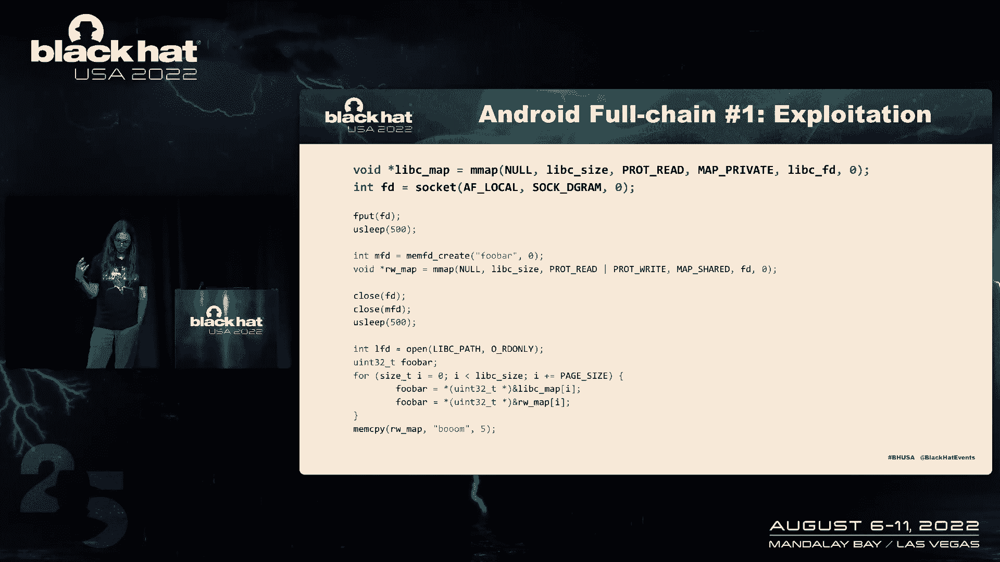
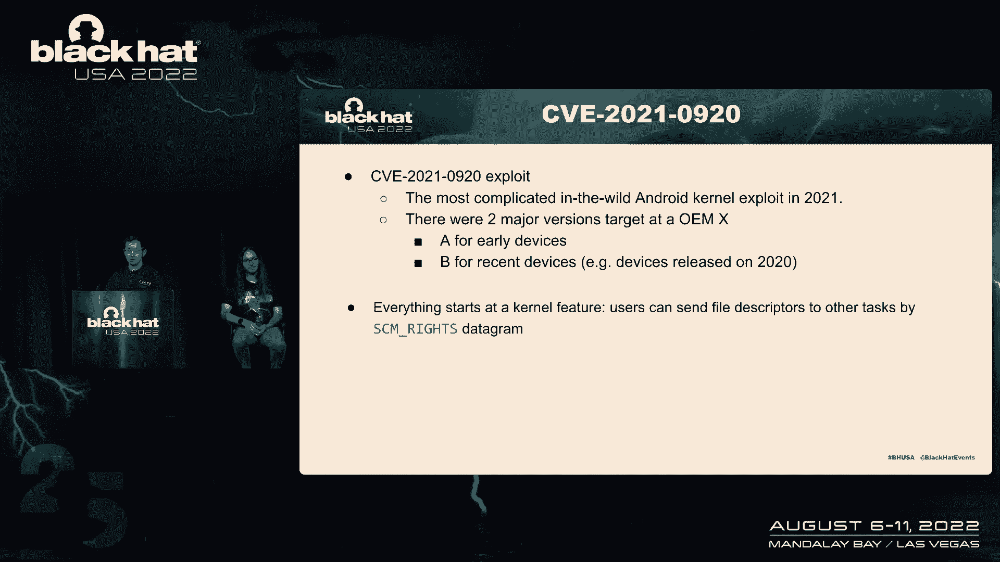
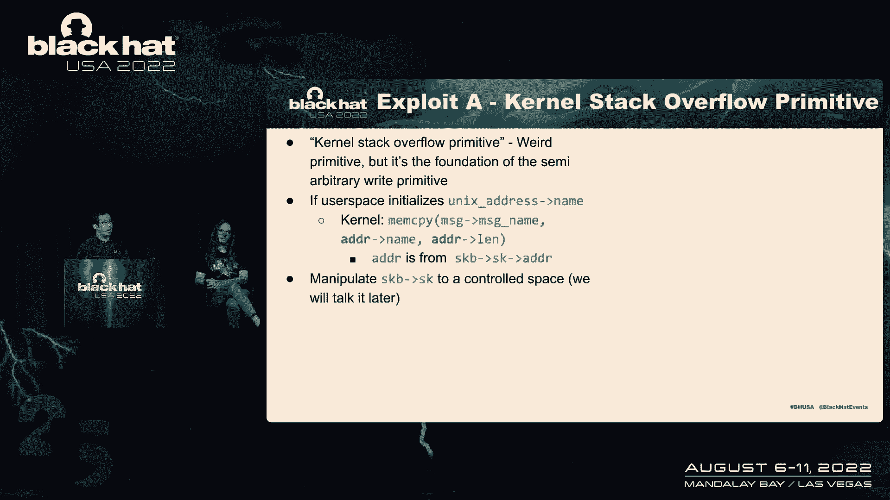
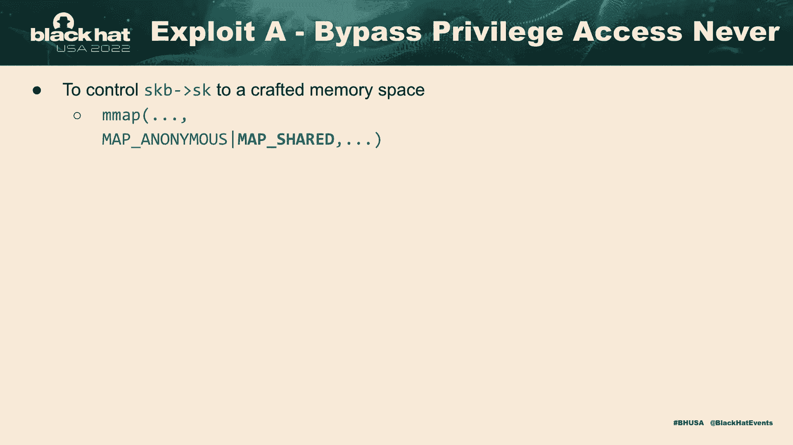
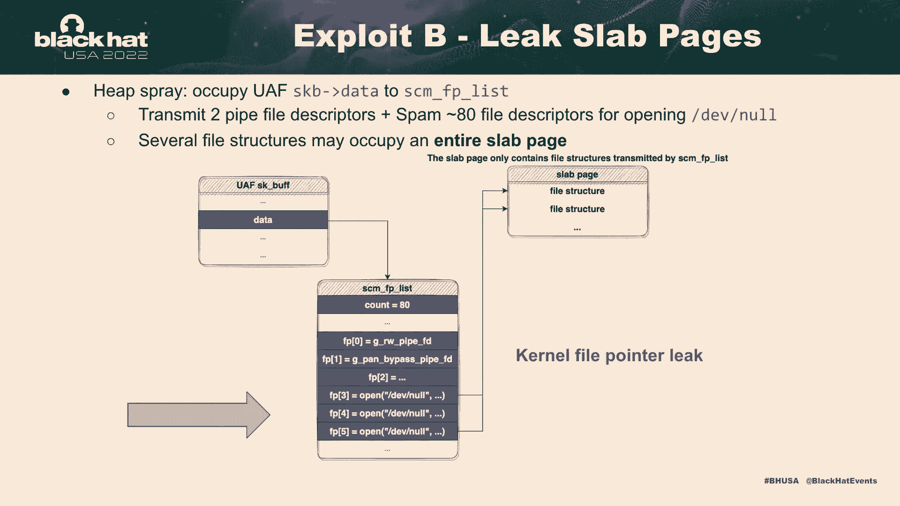
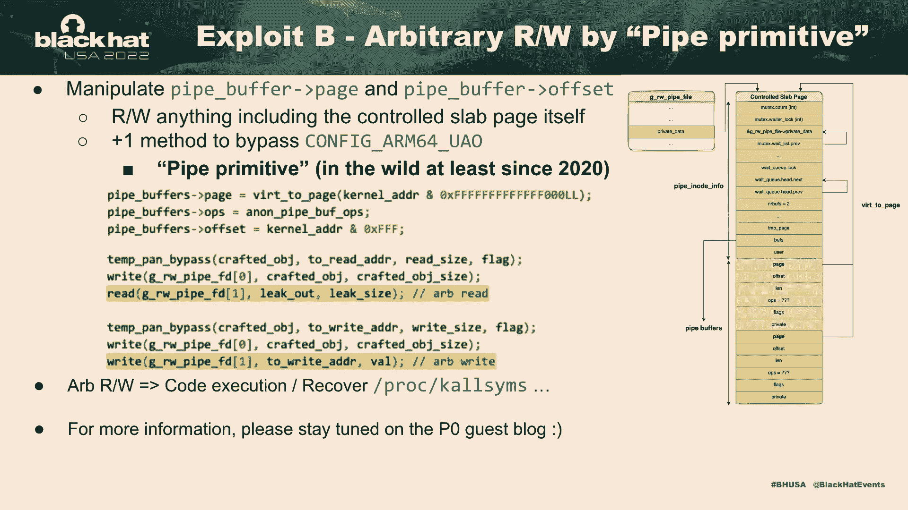
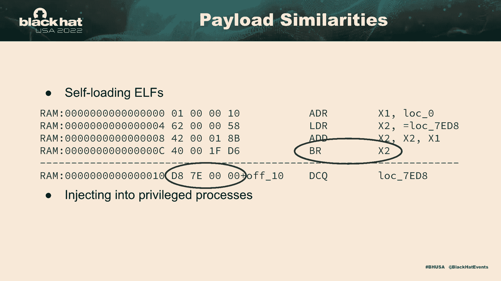
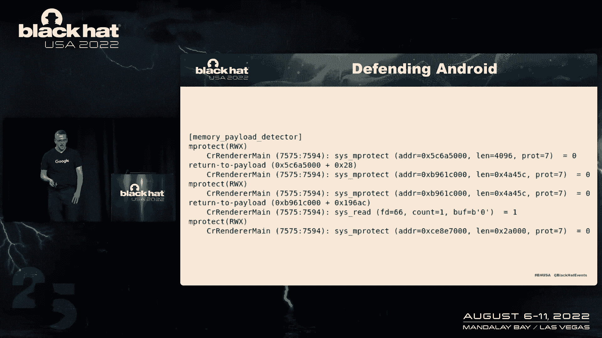

# 课程 P18：019 - 监控监控供应商：深入分析野外发现的Android完整攻击链 🔍


在本节课中，我们将深入探讨谷歌威胁分析小组在2021年通过监控商业监控供应商，在野外发现的两个Android完整攻击链。我们将分析其利用的零日漏洞、复杂的开发技术以及攻击者的后期利用手段。

---

## 背景介绍

上一节我们概述了课程内容，本节中我们来看看谷歌威胁分析小组的工作背景。

谷歌威胁分析小组的主要目标是保护谷歌及其用户。实现这一目标的方法之一，是在野外主动搜寻并报告零日漏洞。例如，在2021年，该小组报告了在野外发现的7个零日漏洞。截至2022年，已报告了3个。

该小组持续追踪超过30家不同的商业监控供应商。这个行业非常繁荣，参与者众多。一个有趣的现象是，某些团体之间会共享或出售漏洞利用程序。例如，曾有一个Chrome的零日漏洞被多个团队同时使用。

---

## 2021年发现的两个Android完整攻击链



上一节我们介绍了威胁分析小组的背景，本节中我们来看看他们在2021年发现的两个具体攻击链。

### 攻击链一：针对最新Android设备的双漏洞利用

第一个攻击链于2021年10月被发现，目标是当时最新的Android设备。它利用了以下两个漏洞：

1.  **Chrome渲染器进程中的一个零日漏洞**：用于在沙箱内执行代码。
2.  **Linux内核中的一个“时代引用计数”漏洞**：用于逃离沙箱。

内核漏洞的修复过程颇具启发性。该漏洞在上游Linux内核中很快被修复，但补丁被集成到Android系统中却花费了大约一年时间。类似的情况也发生在另一个被称为“坏活页夹”的漏洞上。

#### 有趣的开发技术：利用 `libc` 进行进程间代码注入

攻击者利用内核漏洞实现了对 `libc` 库的任意写访问。当他们向 `libc` 写入数据时，这些更改会镜像到系统上每个使用 `libc` 的进程中。

以下是该技术的关键步骤：


1.  映射目标 `libc` 库。
2.  创建可以触发漏洞的文件描述符。
3.  触发漏洞，获得一个指向已释放文件结构的文件描述符。
4.  通过创建 `memfd` 快速替换该文件结构，并将其映射为可读写。
5.  再次释放该文件结构（因为用户空间的两个描述符指向内核中的同一结构）。
6.  循环遍历 `libc` 的每一页，触发内核的缺页处理程序，将 `libc` 的页面加载到可读写的内存映射中。
7.  覆盖 `libc` 内存，其更改会反映在所有进程中。

该监控供应商利用此技术在特定的系统调用中注入shellcode，以便在正确的进程中加载并植入后门。

---

### 攻击链二：针对基于Chrome的浏览器

上一节我们分析了第一个攻击链，本节中我们来看看第二个更具策略性的攻击链。

第二个攻击链的监控供应商采用了不同的策略。他们没有直接使用零日漏洞攻击Chrome，而是针对那些基于Chrome但补丁落后的第三方浏览器，从而可以使用已知漏洞进行攻击。



该攻击链捆绑了三个不同的漏洞。沙箱逃脱部分，有时使用“坏活页夹”漏洞，有时则使用一个我们即将深入分析的零日漏洞。

#### 攻击流程概述


1.  用户收到并点击一个一次性链接。
2.  用户被重定向到攻击者的服务器。
3.  服务器根据浏览器版本等信息，投递相应的漏洞利用程序。
4.  攻击者利用Chrome渲染器进程中的漏洞（例如滥用WebAssembly代码映射）获得代码执行权限。
5.  通过加载本地特权提升漏洞利用程序，完成提权。

接下来，我们将深入分析这个攻击链中捕获的一个关键零日漏洞。

---

## 深入分析：CVE-2021-0928 内核漏洞

上一节我们概述了第二个攻击链，本节我们将深入剖析其核心——一个于2021年11月修复的复杂Linux内核漏洞。

这可能是2021年最复杂的Android内核漏洞利用，就其根本原因分析和利用技术而言，也可能是历史上最复杂的之一。攻击者开发了两个主要变种：
*   **变种A**：针对较旧的早期设备。
*   **变种B**：针对较新的设备。

### 漏洞原理：Unix域套接字垃圾回收竞争条件


漏洞根源在于Unix域套接字发送文件描述符时，其垃圾回收机制存在一个竞争条件问题。

**核心概念**：进程可以通过 `SCM_RIGHTS` 消息发送文件描述符。内核会分配一个 `sk_buff` 结构，其中包含一个 `fp` 列表指向“在途”的文件。


**垃圾回收机制**：Linux内核使用“在途计数”来识别潜在的垃圾文件。如果文件的引用计数等于在途计数，它可能被视为垃圾。

**问题所在**：当使用 `MSG_PEEK` 标志调用 `recvmsg()` 接收消息时，此操作与垃圾回收不同步。这意味着一个线程可以正在读取消息（增加文件引用计数），而另一个线程同时在进行垃圾回收（可能释放文件）。

**竞争条件公式**：
```
线程1：recvmsg(fd, &msg, MSG_PEEK); // 增加文件引用计数，但不从队列移除sk_buff
线程2：垃圾回收器运行 // 可能将同一文件判定为垃圾并释放其结构
```
这种状态可能导致 `sk_buff` 被过早释放（Use-After-Free）。

### 漏洞利用思路

利用此漏洞获得一个可用的“Use-After-Free”对象非常复杂，需要精心构造多线程竞争和内存状态。攻击者通过大量尝试（约150次）来触发一个可用的 `sk_buff` 对象释放。


由于 `sk_buff` 对象从独立的缓存分配，传统的堆喷技术不易生效。攻击者利用了“跨缓存堆喷”技术：如果能在同一个slab页面中释放多个 `sk_buff` 对象，该页面可能被页分配器回收，并被其他缓存使用，从而受到攻击。

---


### 变种A：针对旧设备的利用

上一节我们解释了漏洞原理，本节我们看看攻击者如何针对旧设备利用它。

获得一个释放后的 `sk_buff` 后，攻击者面临信息泄露问题：需要知道读取什么地址。变种A的一个有趣之处在于它读取物理地址，并通过计算哈希与预置表比较来推算内核基址。

攻击者之所以能读取固定地址，是因为旧版本内核的KASLR实现较弱。在ARM64上，早期内核仅随机化基址，且对齐粒度较大。攻击者通过一种“半任意读”原语，能够迭代进程列表并定位关键的内核结构地址。



#### 内核栈溢出与权限提升



攻击者利用一个称为“内核栈迁移”的技术。基本思想是：如果用户空间程序传递一个受控的 `sk_buff` 给内核，内核的 `memcpy` 操作可能从 `sk_buff` 的数据区拷贝过多数据到内核栈，造成栈溢出。

**利用步骤**：
1.  通过漏洞控制 `sk_buff` 的 `fp` 列表。
2.  构造伪造的 `pipe_buffer` 数据结构，并将其布局在溢出可能覆盖的栈区域。
3.  触发栈溢出，覆盖关键的栈变量（如 `msg_hdr`）。
4.  当内核后续使用被破坏的 `msg_hdr` 时，会解引用我们伪造的 `pipe_buffer` 结构。
5.  通过操作伪造的管道缓冲区，最终获得一个稳定的内核写原语，绕过权限限制。


---

### 变种B：针对新设备的利用

上一节我们分析了针对旧设备的利用，本节我们看看针对新设备的变种B有何不同。

变种B同样利用 `sk_buff` 的UAF。策略是大量发送文件描述符，使得许多文件结构占据整个内存页。



**利用步骤**：
1.  触发漏洞后，控制 `sk_buff` 的 `fp` 列表，使其指向新分配的文件结构。
2.  从接收端获取这些文件的内核地址。
3.  关闭这些文件描述符并触发垃圾回收，从而控制整个内存页。
4.  在该页上构造伪造的管道数据结构。
5.  利用管道操作未初始化的特性，通过写入一个字节来初始化管道缓冲区。
6.  通过读取管道，可以泄露整个栈页内容，绕过KASLR。
7.  通过“管道迁移”技术，绕过SMAP/SMEP等硬件防护，最终获得内核任意读写原语。

---


## 后期利用技术

上一节我们深入分析了内核漏洞的利用，本节我们来看看攻击者在获得内核读写权限后做了什么。

在获得内核写权限后，攻击者的目标并非简单地通过 `setuid` 变成root。因为目标设备通常有基于虚拟化的安全保护，会锁定SELinux策略内存，并阻止非特权进程调用关键函数。



### 禁用SELinux

攻击者通过分析内核函数指令，找到引用SELinux策略数据的 `ADRP` 汇编指令。通过计算，他们可以定位策略在内存中的地址，然后直接修改策略内容，刷新并重新加载，从而将SELinux设置为“许可”模式。

### 获取Root权限

Android的实时内核保护机制信任 `init` 和 `system_server` 等特权进程。攻击者利用此信任链：
1.  在受信任的特权进程（如 `system_server`）中注入shellcode。
2.  该shellcode利用内核写权限，将自身凭证修改为root。
3.  `system_server` 随后启动一个包含完整后门的合法可执行文件（如 `simpleperf`）。
4.  此时，完整的后门就以root身份在许可模式的SELinux下运行。

### 后门行为

获得完全控制后，后门会执行以下操作：
1.  **数据窃取**：上传设备上的大量信息，重点关注社交媒体数据、消息和账户数据库。
2.  **降低安全性**：禁用多项系统安全设置，如自动更新，并卸载第三方安全软件，使设备更容易受到其他恶意软件侵害。
3.  **自我清理**：在收到命令后，可以清除自身痕迹。

---

## 关联分析：与历史攻击的关联


上一节我们介绍了后期利用技术，本节我们通过一个案例来看看这些攻击的关联性。

克里斯蒂安之前提到了CVE-2019-2215。2019年9月，Project Zero的Maddie Stone识别并报告了此漏洞。我们编写了检测程序并部署，以寻找其利用痕迹。

我们发现了利用CVE-2019-2215的样本，其中引用了几个Android应用，例如一个名为“图片查看器工具包”的应用。该应用在漏洞公开前7个月就已上架，并请求了过多权限。



2020年和2021年的攻击载荷之间存在许多相似之处：
*   **自加载机制**：ELF文件导出一个自加载函数，负责在内存中修补自身并解析导入。
*   **进程注入**：载荷被注入各种特权进程。
*   **安全设置修改**：行为模式相似，包括禁用安全设置、复制文件、卸载应用等。
*   **相同错误**：甚至出现了相同的配置文件路径拼写错误，表明攻击者可能复用了一套标准工具或脚本。

### 检测与捕获

任何ARM/ARM64代码都需要可执行内存来运行。因此，如果在一个进程中发现意外的可执行内存区域，就值得深入检查。

我们的内部分析系统在给Chrome投递漏洞时，捕获到了一个可疑的、具有读写执行权限的内存区域。系统调用返回到该区域，表明其中有代码执行。转储该内存后，我们发现了被新宇详细解释过的漏洞利用载荷。



这形成了一个完整的证据链：发现了在野使用的Chrome远程代码执行漏洞，其载荷中包含了另一个内核零日漏洞的利用，而该内核利用又与更早的攻击活动存在强关联。


---

## 总结与启示

本节课我们一起深入学习了通过监控商业监控供应商发现的两个复杂Android攻击链。

我们分析了攻击者如何利用包括Chrome和Linux内核零日在内的多个漏洞，构建完整的攻击链。我们深入探讨了CVE-2021-0928这个极其复杂的内核漏洞的原理和两种利用变种。我们还了解了攻击者在获得内核控制权后，如何禁用SELinux、获取root权限并实施数据窃取。

这些案例揭示了几个关键点：
1.  **补丁延迟问题**：许多漏洞源于Android与上游Linux内核之间的补丁不同步。
2.  **资源与复杂性**：攻击者拥有丰富的资源，能够开发极其复杂的漏洞利用程序。
3.  **持续对抗**：安全行业需要更快地发现、修补漏洞并推动更新落地。漏洞奖励计划等举措有助于激励研究人员提交漏洞，缩短响应时间。


安全是一场持续的攻防对抗。我们反应越快，就能更好地保护用户，迫使监控行业付出更高成本来维持其攻击能力。