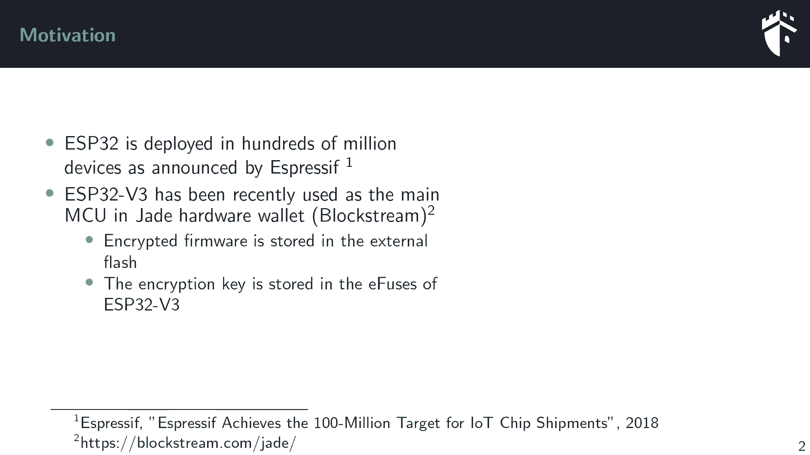
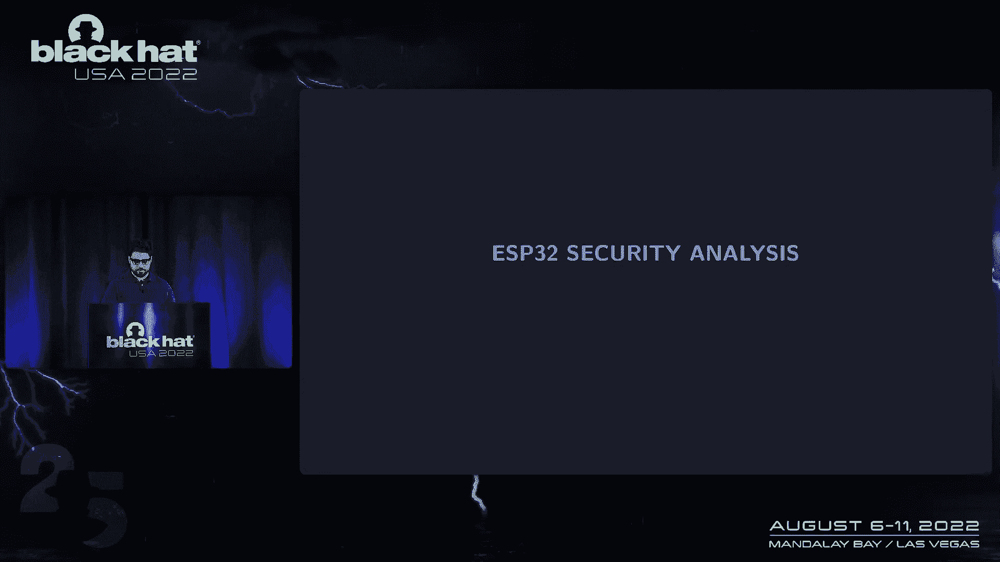
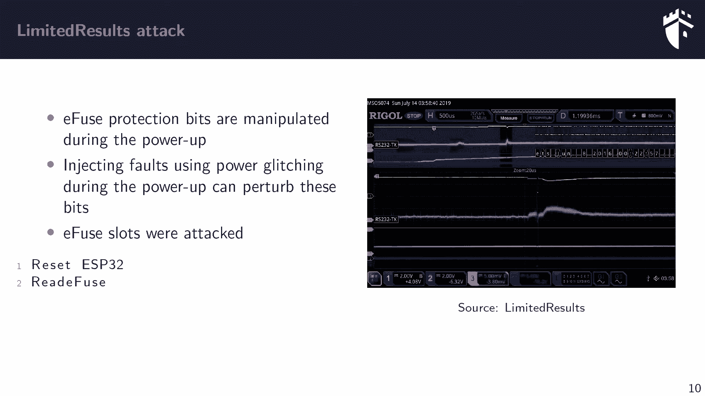
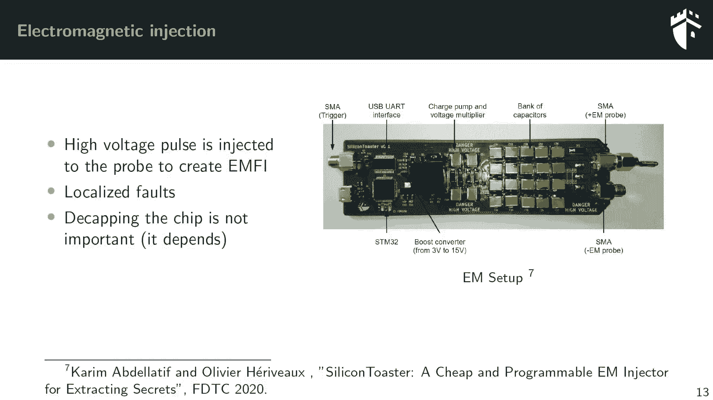
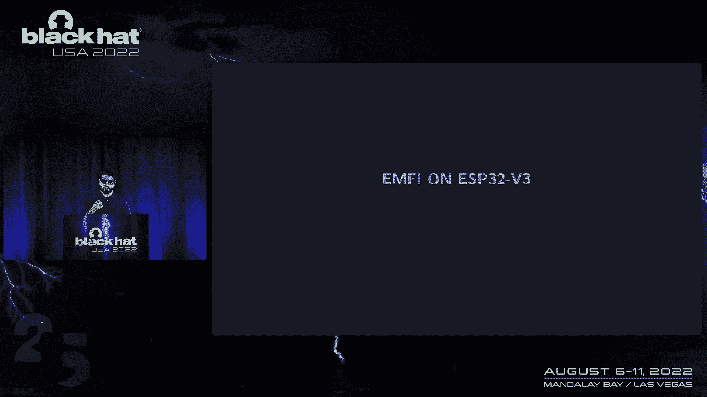
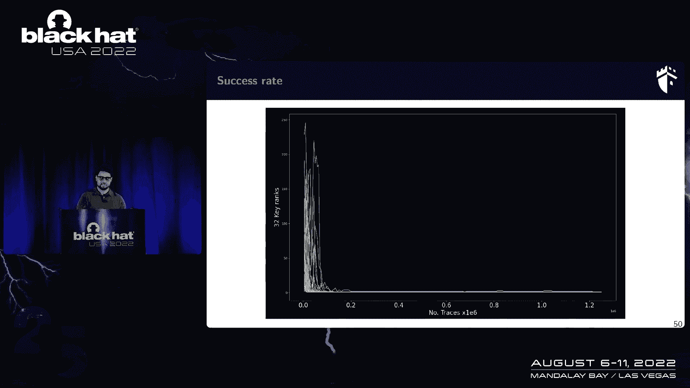
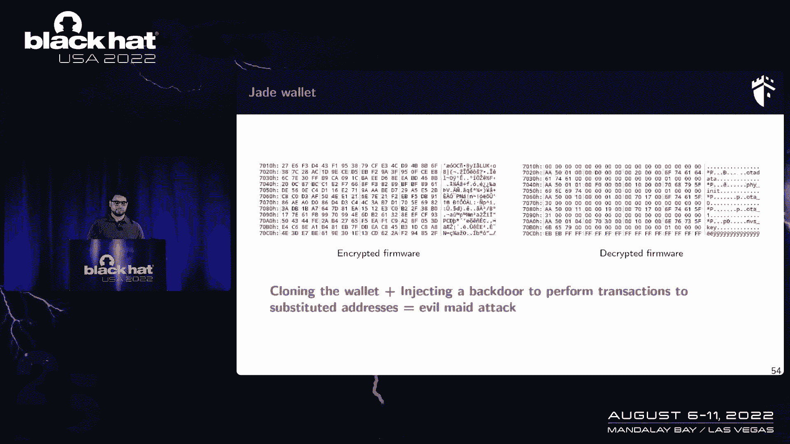
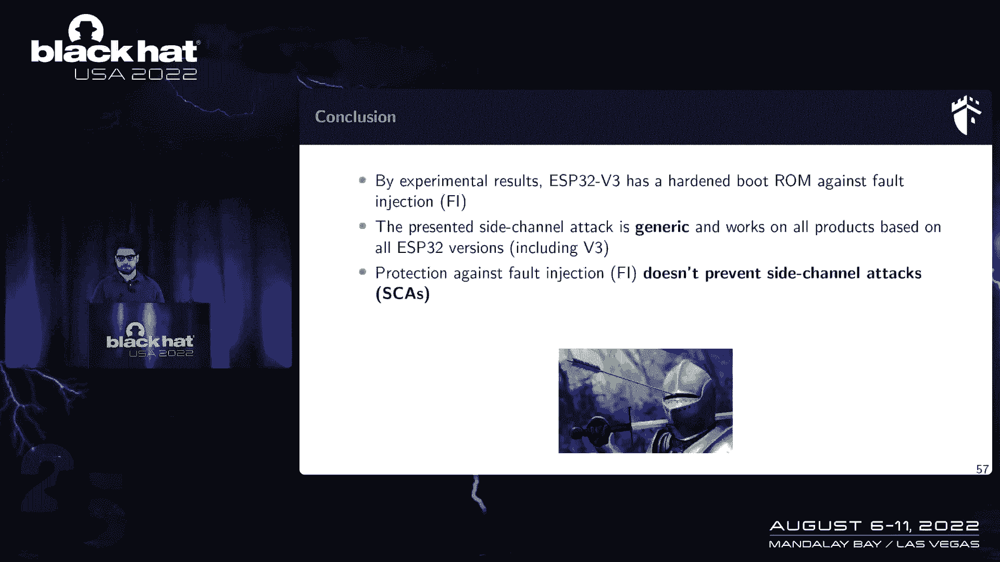

# 课程 P19-020：无限结果 - 攻破 ESP32-V3 固件加密 🔓

在本课程中，我们将学习如何利用电磁故障注入和侧信道分析技术，攻破 ESP32-V3 微控制器的固件加密机制。课程内容基于 Karim Abdellatif 与 Olivier Rio、Adrian Thill 的合作研究，将详细解析攻击原理、实验步骤与最终成果。

## 概述 📋

ESP32 是一款广泛部署的低功耗片上系统。到 2018 年，乐鑫公司已售出超过 1 亿台设备。近期，它被 Blockstream 选为其硬件钱包的主要微控制器。该钱包使用 ESP32-V3 芯片和一个外部闪存，其中闪存用于存储加密固件，而加密密钥则存储在 ESP32-V3 内部。本课程将展示如何通过注入攻击和侧信道攻击提取此密钥。

## ESP32 安全特性介绍 🛡️

上一节我们介绍了课程背景，本节中我们来看看 ESP32 芯片本身的安全特性。

ESP32 具有多项安全功能，包括安全启动、闪存加密以及一个 128 字节的一次性可编程存储器用于存储密钥等秘密。用户可以使用乐鑫提供的开源工具 `esptool` 来激活这些功能。

OTP 被分为四个存储槽。
以下是各槽的用途：
*   **槽 0**：保留给系统，用于存储芯片设置，如闪存加密模式、安全启动模式是否激活。
*   **槽 1 与槽 2**：用于存储闪存加密密钥和安全启动密钥。
*   **槽 3**：用于用户应用程序。

软件无法直接访问槽 1 和槽 2 中的密钥，因为它们受上电时生效的写保护位保护。唯一能读取这些密钥的实体是 ESP32 的硬件本身，它在上电过程中使用这些密钥来执行闪存解密或安全启动。

关于安全启动，ESP32 有两个版本。
以下是安全启动 V1 的主要流程：
1.  固件包含引导加载程序和公钥。
2.  存储在 OTP 槽 2 中的密钥用于签名验证。
3.  使用 SHA-256 对引导加载程序进行哈希，生成摘要。
4.  摘要存储在闪存中。
5.  上电时，重复此过程并进行比较，以决定是否继续启动。

闪存加密用于保护存储在外部闪存中的固件。
其核心流程如下：
*   使用 AES-256 加密和解密闪存内容。
*   上电时执行闪存解密。
*   采用一种称为“密钥调整”的技术，该技术依赖于地址，使得每 32 字节的密钥都会变化。
*   上电时从闪存操作的第一个数据块是存储在地址 `0x1000` 的引导加载程序。

## “有限结果”攻击回顾与故障注入装置 ⚡

上一节我们介绍了 ESP32 的安全机制，本节中我们来看看之前著名的“有限结果”攻击以及我们将使用的故障注入装置。

“有限结果”攻击针对的是 ESP32-V1。攻击者在上电时，通过电压毛刺干扰写保护位的生效。成功注入故障后，攻击者可以执行内存读取命令，从而提取安全启动和闪存加密密钥。

为了评估芯片，我们需要在执行敏感操作时扰动它。我们将使用自制的电磁故障注入装置，称为“Silicon Tester”。
该装置的核心原理是：
*   将高压存储在电容器中。
*   通过线圈释放，产生瞬时大电流，进而生成强电磁场。
*   电磁场与芯片表面相互作用，试图扰动其内部操作。

该工具能够注入高达 1000V 的故障脉冲。为了获得稳定的实验环境，我们制作了一块定制 PCB，将 ESP32 芯片、外部闪存、用于控制电压的 GPIO 引脚以及一个外部时钟振荡器集成在一起。

## 在 ESP32-V1 上复现攻击 🔬

在开始攻击 V3 之前，我们首先需要验证自制故障注入装置的有效性，并在 ESP32-V1 上复现“有限结果”攻击。

我们首先在一个简单的测试程序上验证故障注入能力。程序包含一个循环，目标是跳过该循环。通过扫描芯片表面并注入 500 次脉冲，我们成功找到了一个能可靠引发故障的区域，证明了装置的有效性。

接下来，我们在 ESP32-V1 上复现“有限结果”攻击。
攻击步骤如下：
1.  准备加密固件并存储在外部闪存中。
2.  启用闪存加密。
3.  追踪芯片在上电期间的功耗，找到一个早期的活跃期，这可能是写保护位生效的关键窗口。
4.  在上电时，向该窗口注入单个电磁故障脉冲。
5.  如果故障成功，则执行 `read_mem` 命令来提取密钥。

实验取得了成功。我们获得了两个不同的密钥输出，其中一个与正确密钥仅有一位之差。这表明故障可能也影响了从 OTP 中读取的密钥值。通过分析成功故障时的功耗轨迹，我们确认了注入脉冲与故障发生的精确时刻。此次复现仅需单次脉冲，成功率约为 0.6%。

## 挑战 ESP32-V3：故障注入遇阻 🚧

上一节我们成功复现了对 V1 的攻击，本节中我们将相同的攻击场景应用于 ESP32-V3。

ESP32-V3 针对“有限结果”攻击进行了加固。安全启动升级为基于 RSA 的方案，避免在芯片中存储私钥。乐鑫还增加了一项功能：禁用 UART 引导模式，以防止通过 `read_mem` 命令读取内存。

我们首先在 V3 的测试程序上尝试故障注入，成功跳过了循环，证明 V3 并未配备完善的故障注入检测器。

然而，当我们将针对闪存加密的完整攻击流程应用于 V3 时，遇到了困难。V3 上电期间的功耗特征与 V1 明显不同，显示了更复杂的启动序列和可能存在的验证步骤，这意味着可能需要多个连续故障才能成功。

我们调整了攻击场景，尝试随机化故障脉冲的数量和时序。不幸的是，我们未能获得任何成功的故障。相反，连续注入多个电磁脉冲对芯片攻击性过强，经常导致芯片崩溃或超时。这表明我们需要寻找新的攻击路径。

## 转向侧信道攻击：攻破固件加密 🔍

上一节我们发现故障注入对 V3 效果有限，本节中我们转向侧信道攻击，目标是在上电时执行的闪存解密操作。

通过查阅乐鑫文档，我们发现其未提及针对侧信道攻击的防护措施。这为我们提供了新的突破口。攻击思路是：通过控制外部闪存中引导加载程序的内容，在上电时触发固件解密，并采集此时的功耗轨迹，然后利用相关功耗分析攻击 AES 密钥。

首先，我们需要精确定位 AES 算法在功耗轨迹上的执行位置。我们向外部闪存的引导加载程序区域写入已知的随机数据，然后捕捉上电解密时的功耗。通过对比不同数据对应的功耗波形，我们成功定位了 AES 操作发生的精确时间窗口。

为了高效地采集大量功耗轨迹，我们移除了物理闪存，改用 FPGA 实现的闪存模拟器。它可以动态提供不同的随机明文数据，从而允许我们无限次地采集针对不同输入数据的功耗轨迹。

我们采集了约 200 万条功耗轨迹，并使用相关功耗分析进行攻击。
攻击的关键设置如下：
*   **攻击目标**：AES-256 的第一轮和第二轮输出。
*   **泄漏模型**：使用了汉明重量和汉明距离模型。
*   **分析结果**：在大约 40 万条轨迹内，我们成功恢复了 256 位密钥中的 31 个字节。对于剩余的 1 个字节，在约 150 万条轨迹后也能成功恢复。

即使在激活了安全启动和禁用 UART 引导模式后，此攻击依然有效，因为闪存解密是上电后执行的第一项安全操作。

## 实战应用：提取 Blockstream 钱包密钥 💰

上一节我们理论上攻破了 V3 的固件加密，本节中我们将其应用于实际设备——Blockstream 的硬件钱包。

我们将 Blockstream 钱包中的 ESP32-V3 芯片移植到我们的测试板上，并重复侧信道攻击流程。我们成功提取了用于固件加密的完整密钥。利用该密钥，我们解密了外部闪存中的固件，获得了用户的私钥。这意味着攻击者可以克隆该设备，甚至注入后门，将交易重定向到攻击者控制的地址。

## 供应商回应与总结 📝

我们在去年 10 月向乐鑫公司披露了此漏洞。他们于今年 5 月发布了安全公告，确认该侧信道攻击适用于市场上所有 ESP32 系列芯片（包括 C3、S3）。由于漏洞存在于硬件设计中，现有芯片无法通过固件更新修复。乐鑫表示将在未来的芯片设计中加入对抗侧信道攻击的防护措施。

## 课程总结 🎯

在本课程中，我们一起学习了如何结合电磁故障注入和侧信道分析，全面评估并最终攻破 ESP32-V3 的固件加密系统。我们证明了 V3 的启动流程对故障注入有一定防护，但未能抵御侧信道攻击。通过相关功耗分析，我们使用约 40 万条功耗轨迹即可提取完整的 256 位 AES 密钥。这项技术是通用的，适用于乐鑫多款产品。本案例表明，硬件安全设计必须同时考虑故障注入和侧信道攻击的联合威胁。