# 课程 P2-002：在缓存中起舞 - 破坏 Microsoft IIS 的哈希表 🕺💥

在本节课中，我们将学习如何通过分析 Microsoft IIS Web 服务器中哈希表的实现与使用，来发现并利用其中的安全漏洞。课程将涵盖哈希表的基本概念、IIS 的内部架构，并深入探讨三种不同类型的攻击：哈希碰撞拒绝服务攻击、缓存投毒攻击和身份验证绕过攻击。我们还将演示如何将这些攻击应用于 Microsoft Exchange Server，并讨论相应的缓解措施。

---

## 哈希表基础概念 📚

上一节我们介绍了本课程的主题，本节中我们来看看理解后续内容所需的基础概念。

哈希表是计算机科学中最基本的数据结构之一，其目的是高效地存储数据。哈希表特别擅长处理键值对，并能以高性能操作数据。

哈希表广泛应用于计算机基础设施中，例如操作系统、编程语言、数据库或 Web 服务器。如果你是一名开发者，你很可能在内部使用过哈希表。

### 什么是哈希碰撞攻击？

我们不会深入探讨哈希表的所有内部细节，但需要理解哈希碰撞攻击。这种攻击展示了攻击者如何滥用哈希表。

哈希碰撞攻击的核心思想是，由于哈希算法是公开的，攻击者可以预测其哈希值，从而将所有恶意记录放入哈希表的同一个“桶”中。

**攻击流程如下：**
1.  攻击者在左侧创建多条恶意记录。
2.  中间的哈希函数处理这些记录并将其转换为索引。
3.  攻击者可以精心构造记录，使所有记录都映射到同一个索引（例如索引 4），从而进入同一个桶。

当所有记录都落入同一个桶时，哈希表就退化成了一个链表。这意味着插入 n 条记录的时间复杂度从理想的 O(1) 恶化到 O(n²)。我们都应该同意 O(n²) 是非常糟糕的性能表现。

---

## IIS 中的哈希表 🔍

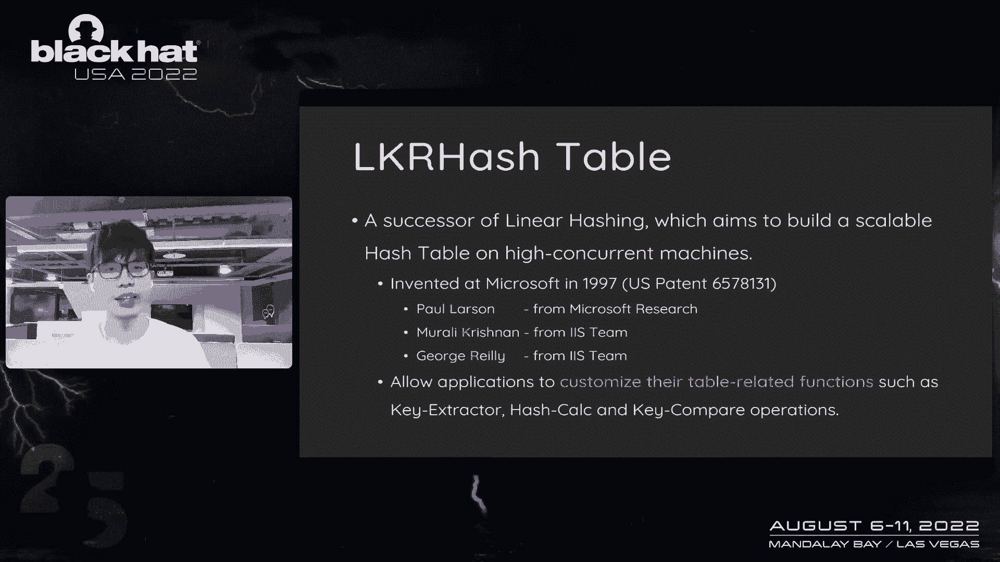

对哈希表有了基本了解后，让我们讨论哈希表和 IIS 之间的关系。

作为 Windows 中主要的 Web 服务器，IIS 在其架构中广泛使用哈希表来存储信息，例如 HTTP 请求头。由于这种数据结构被大量使用，微软很早就设计了自己的哈希表实现。

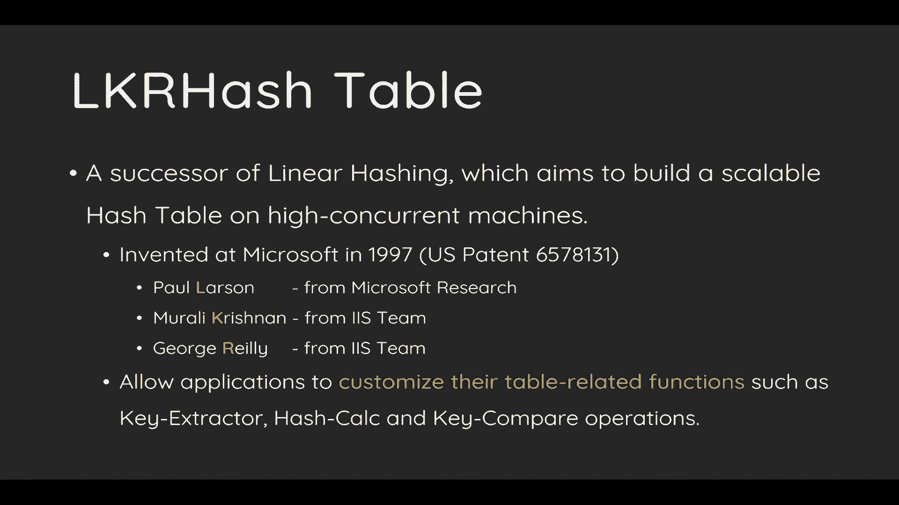

以下是 IIS 中使用的两种较旧的实现：
*   **树哈希表**：这是最常见的实现，类似于教科书中的示例代码。它使用链表来解决冲突，并在表不健康时进行重建（Rehash）。重建过程包括：先将表扩容，然后重新计算所有记录的哈希值，最后将它们复制到新的索引位置。
*   **LKR 哈希表**：这个实现旨在构建一个可扩展的高并发哈希表，适用于多线程、多核环境。它使用了另一种更好的算法来解决哈希碰撞以提高性能。创建者花费了大量精力使其可移植、灵活，可供应用程序使用。应用程序可以定义自己的表相关函数。

有趣的是，部分创建者也是 IIS 的开发者。这可能是我们在 IIS 中发现许多这种实现的原因。

---

## 深入研究 IIS 内部 🧠

现在我们对哈希表和 IIS 的关系有了完整的了解，是时候深入研究 IIS 内部了。在本节中，我们将展示 IIS 的内部架构，并定义我们真正关心的研究范围。

我们主要关注哈希表的实现及其使用方式。由于 IIS 中使用的大多数哈希表都与缓存相关，因此我们也研究和探讨了缓存机制。

因为微软在没有开源的情况下设计了自己的哈希表，所以其实现应该是一个未探索的、可以发现漏洞的领域。在这种情况下，我们不仅寻找内存破坏漏洞，也寻找逻辑错误。

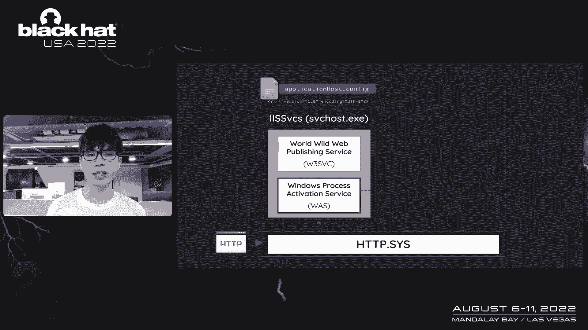

**一个启发性的例子是 CVE-2020-7068**，这是 PHP `get_headers()` 函数中的一个逻辑错误。哈希表实现没有正确区分数组的键类型，导致攻击者可以删除具有数字索引的任意元素。这个漏洞启发了我，我相信这正是我要寻找的漏洞类型。

当然，我们也寻找算法复杂性问题，例如哈希碰撞攻击。然而，因为这已经是存在了 20 年的攻击，大部分容易发现的漏洞应该已经消失了。因此，我们在实现本身上投入了更多精力。

至于哈希表的使用方式，我们提到 LKR 哈希被设计成可移植、灵活、易用的算法，可应用于任何情况。这种设计要求应用程序在初始化期间配置自己的表相关函数。这种可扩展性给了我们发现漏洞的更多机会。例如，我很好奇：哈希函数好吗？键比较函数好吗？或者当碰撞发生时，函数如何选择正确的记录？我对这类问题都很感兴趣。因此，在这种情况下，我们更关心键和函数之间的关系。

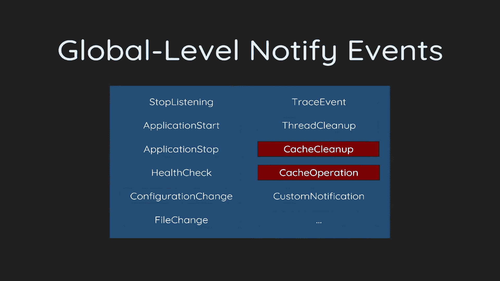

### IIS 请求处理流程

当 HTTP 请求到来时，内核 HTTP 处理程序首先处理连接并解析请求。如果没有可用的工作进程，它会通知服务控制器生成一个新进程。

工作进程启动后，首先加载配置中定义的几个模块。默认情况下，IIS 会为不同目的加载多个模块，例如压缩、重定向、身份验证和缓存。

在所有模块中，以下四个是管理模块间缓存的全局缓存提供程序：
*   `FILE_CACHE`
*   `TOKEN_CACHE`
*   `URI_CACHE`
*   `BLOB_CACHE`

每个提供程序负责处理不同的缓存，例如静态文件缓存、URL 配置缓存或 Windows 令牌缓存。

一旦模块加载完毕，工作进程进入请求生命周期。生命周期是一个事件循环，处理来自请求的所有通知。模块可以订阅其感兴趣的事件来完成其逻辑。模块也可以订阅全局事件。例如，缓存提供程序订阅缓存清理和缓存操作事件，以管理模块间的缓存。

我们的研究不仅关注请求生命周期内的缓存，也关注全局缓存提供程序，尤其是上述四个是我们的主要目标。

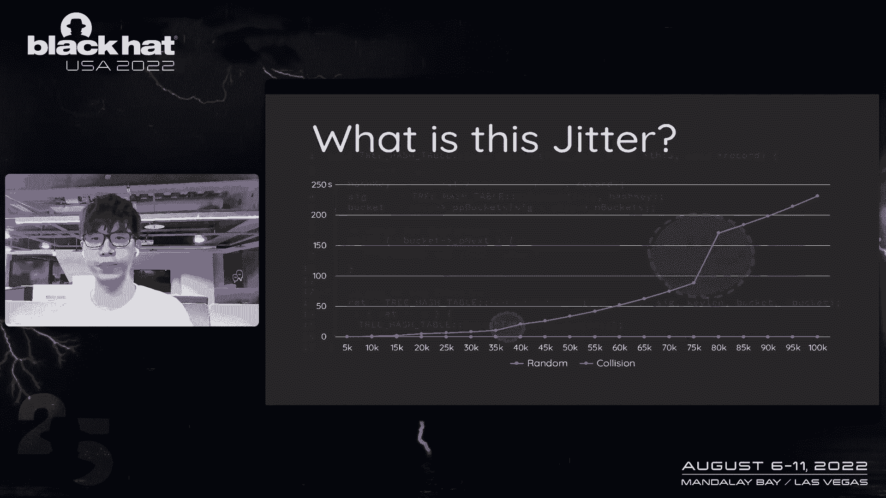

---

## 漏洞研究与案例分析 🎯

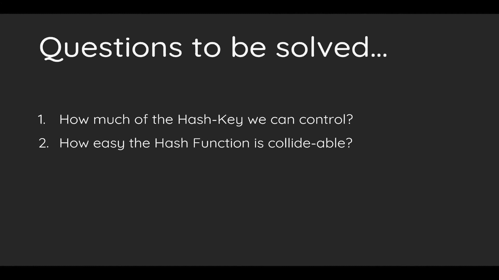

在上一节我们了解了 IIS 的内部架构，本节中我们将详细说明我们的研究思路，并附上三种不同类型的漏洞来证明这些思路。我们将讨论缓存中毒和身份验证绕过，并演示如何在真实的 Microsoft Exchange 服务器上利用身份验证绕过漏洞。

### 案例一：哈希碰撞拒绝服务攻击

我们要分享的第一个漏洞是哈希碰撞拒绝服务攻击。先剧透一下：微软实现的所有哈希表都受到哈希碰撞攻击的影响。树哈希表默认就易受攻击，而 LKR 哈希表仅在配置了糟糕的哈希函数时才易受攻击。

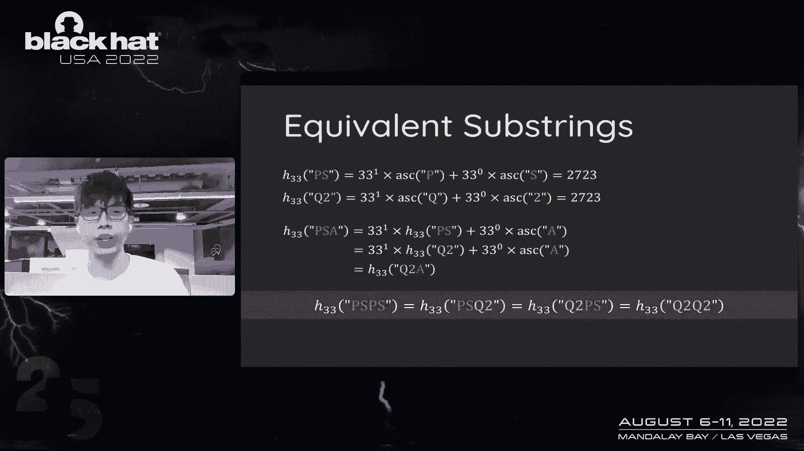

然而，存在漏洞不等于可以轻易利用。除了找到攻击点，我们还有几个障碍需要克服。

我们发现 IIS 的 URL 缓存模块似乎是一个很好的目标。此模块的目的是缓存 URL 的配置。该模块使用树哈希表作为其缓存存储。默认情况下，树哈希表听起来不错。

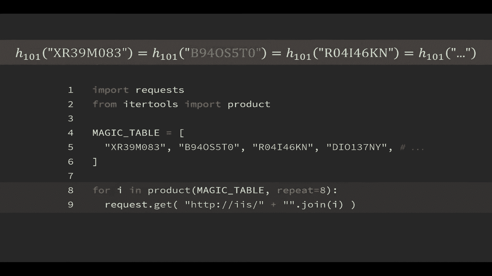

下图展示了在树哈希表中插入恶意碰撞记录（橙色线）与随机记录（蓝线）的性能对比。你应该能看出，两条线之间存在巨大差异。然而，在 35,000 到 75,000 条记录之间，时间增长很奇怪。理论上，橙色线的增长应该是线性的，那么到底是什么让时间平稳地增加呢？

答案是“重哈希”。这是插入操作的一部分。实现在插入后会调用 `rehash_table` 函数。该函数跟踪记录数量，如果数量大于阈值（一个从质数列表中选择的值）的两倍，就会触发重哈希。一旦重哈希，函数会将表扩容到下一个质数，并将所有记录重新映射到相应的桶中。这是一次巨大而广泛的操作，也是图表中时间平稳增长的原因。

要利用这一点，还有几个问题需要解决：例如，我们可以控制多少缓存键？或者如何构造碰撞的有效载荷？

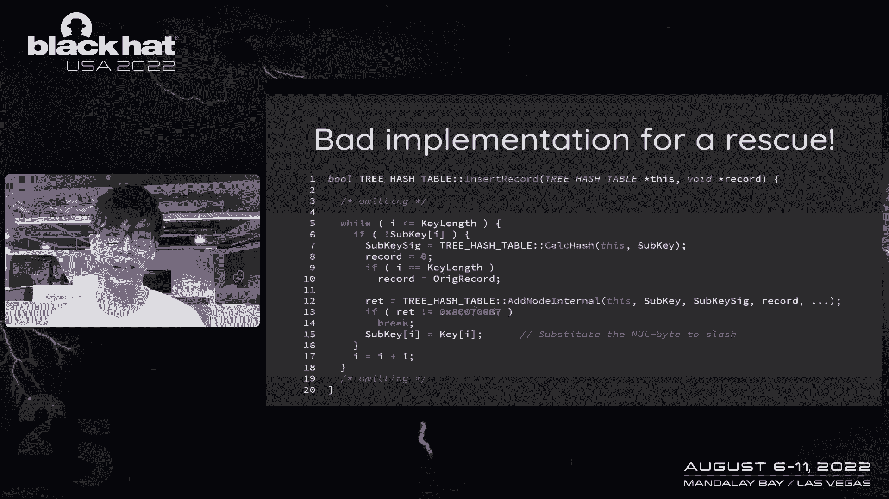

缓存键由几个元素组成，我们唯一可以控制的元素是 URL 路径，它反映在缓存键的末尾。实现会首先将所有文本转换为大写，然后将密钥发送到哈希函数。

哈希函数只是将缓存密钥的每个字节乘以 0x1003F，然后累加。该函数还使用一个线性同余生成器对结果进行加扰。然而，这个哈希函数好吗？这是来自作者在其自身演讲中的答案：这个乘法是 DJB 哈希的变体，并且该算法已被证明是可被等价子串排序的。当两个键具有相同的哈希值时，例如 `ps` 和 `q2`，无论你在它们之前或之后添加什么，它们的哈希值都必须相等。例如，在添加字母 `a` 之后，`psa` 和 `q2a` 的哈希仍然相等。

知道这个特性后，不难理解两个等价的子字符串可以组合形成不同的键，例如 `psps` 和 `q2q2`，或者 `pspsps` 和 `q2q2q2`。它们都共享相同的哈希值。因为你可以重复这个字符串很多次，所以构建有效载荷很容易。你只需要找到一对具有相同哈希值的字符串，并将它们组合起来。

然而，这次攻击有一个致命的缺陷：它太弱了，难以引起关于减速的通知。你必须发送大约 35,000 个请求（至少对于我们一次记录一个请求的负载来说是这样）。这太慢了。更可笑的是，有一个“清道夫”线程定期回收未使用的记录，每 30 秒删除一次。这两个障碍使我们的攻击不那么实际。

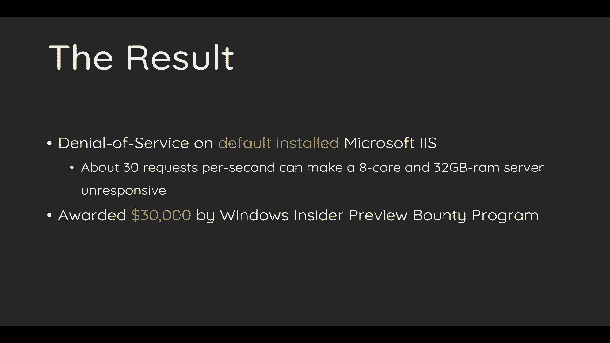

为了克服这一点，我们必须深入研究实现模型。我们发现了一个有趣的行为可以拯救我们的攻击：实现会递归扫描密钥的所有子目录，并将它们也作为新记录插入表中。例如，在我们的想象中，一个 URL 只会触发一次查找和一次插入操作。但实际上，其所有子目录也将被训练为新记录，因此一个 URL 将触发多个插入操作。

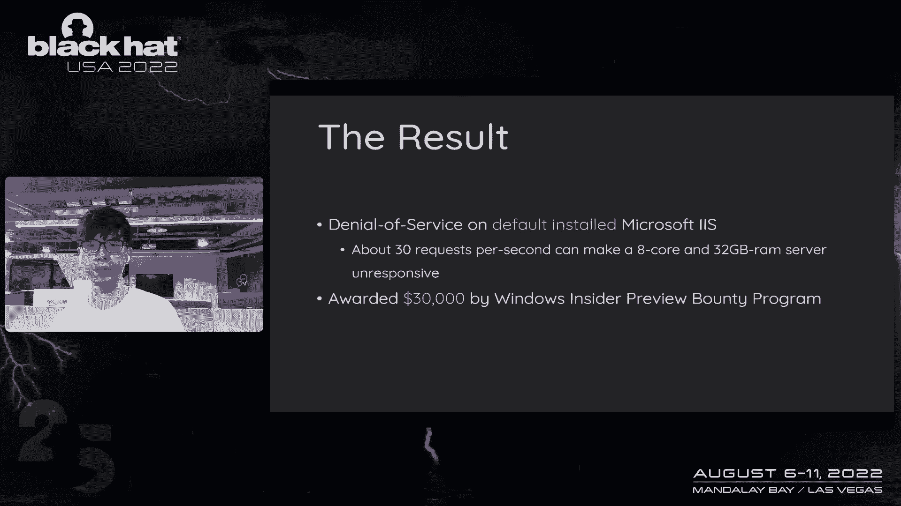

更有趣的是，所有新插入的记录都将有一个正常的“最后使用时间”。清道夫对正常记录很友好，只会延迟一个一个地删除，而不是一批全部杀死。所以剩下的唯一问题是如何在这种新的上下文中构建碰撞。因为所有子目录都被视为独立的键，我们必须构造一个满足以下所有方程的有效载荷。

通过我们之前的等价特性，如果我们把每个子目录的哈希都设置为零，事情就容易多了。任何数乘以零都是零，零加零也是零。这样我们就可以满足所有的方程。我们可以准备一组哈希为零的字符串，并将攻击放大十倍。

结果是，我们可以使服务器每秒大约只能处理 30 个连接，而 IIS 通常可以轻松并发地处理数千个连接。由于此漏洞影响默认配置的 Windows，我们还因此获得了丰厚的漏洞赏金。

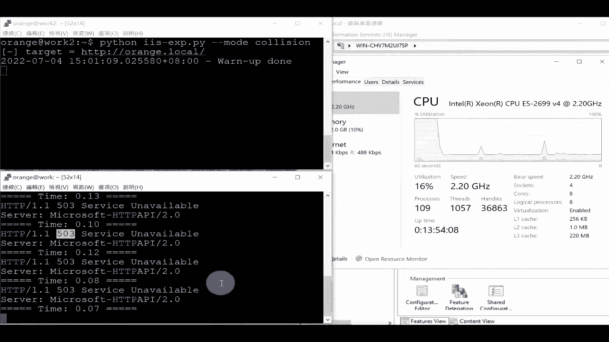

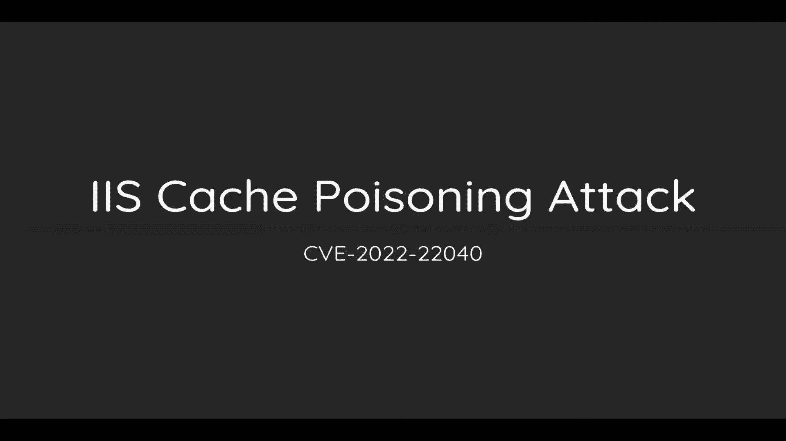

### 案例二：缓存投毒攻击

IIS 中有两种类型的响应缓存：一种是内核支持的静态缓存（例如图片、CSS 和 JavaScript 资源）；另一种是动态缓存，通常用于缓存很少改变的响应，例如网店的产品信息或新闻公告。动态缓存的好处是你可以减少后端服务器的负载。

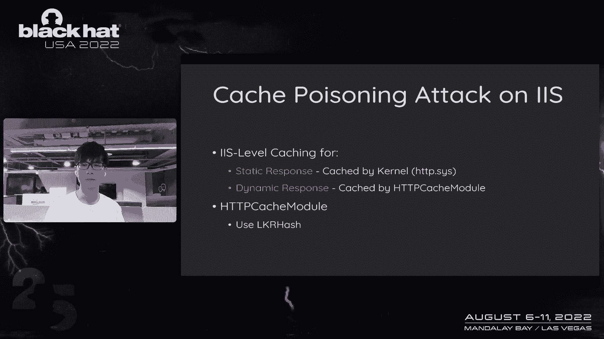

动态缓存由 HTTP 缓存模块处理，并且可以通过输出缓存组件配置缓存规则。规则可以基于几个条件，例如文件扩展名、查询字符串或 HTTP 头。

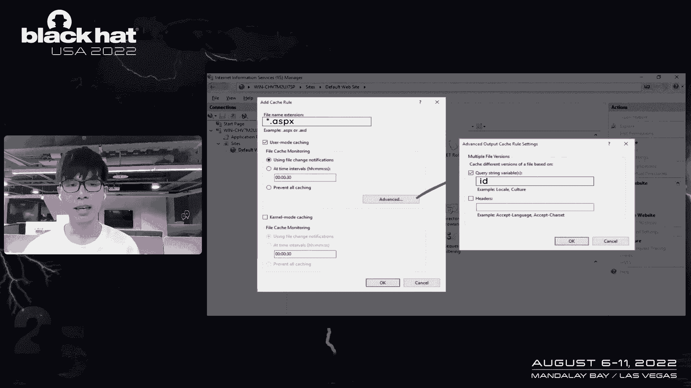

缓存投毒的根本原因是模块使用了一个糟糕的解析器来处理查询字符串。假设你已经制定了一个规则来缓存基于特定参数（例如 `id`）的响应。模块和后端（例如 ASP.NET）之间对查询字符串的解析不一致，可能导致 IIS 缓存到错误的结果。

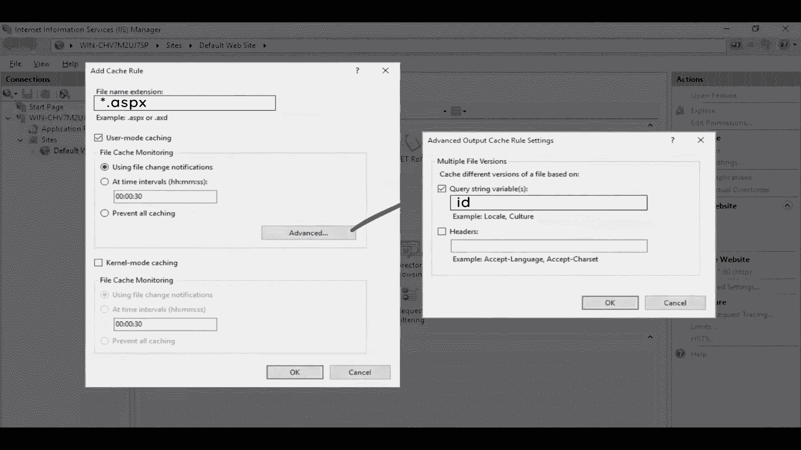

在查询字符串中，键可能会出现多次。模块仅使用缓存键的第一次出现，然而 ASP.NET 可能会连接所有的值。这种不一致的解析行为导致 IIS 缓存到错误的响应。

例如，如果一个页面只是根据 `id` 参数打印出你的名字，攻击者可以通过在 URL 上重复 `id` 参数来毒害缓存结果。IIS 的缓存键只认第一个 `id` 的值（例如 `id=1`），但 ASP.NET 处理的是 `id=1&id=attacker_payload`。因此，当用户下次访问该页面时，他看到的将是攻击者注入的内容。

### 案例三：身份验证绕过攻击

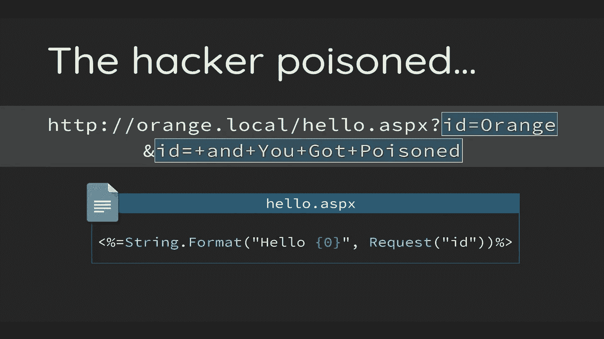

回到我们的开场案例：一个由超强密码保护的超级秘密区域，所有密码都有效。你可能会想：战利品是什么？或者我如何获得这些密码？或者怀疑这一定是一个边缘案例。什么样的场景是脆弱的？

第一次登录是一个昂贵的操作，为了不降低性能，IIS 会缓存基于密码的身份验证令牌。默认情况下，你看到的是 LKR 哈希表的实现，并配置了清道夫每 15 分钟删除一次未使用的记录。

正如我们提到的，LKR 哈希在初始化期间是高度定制的。该模块定义了多个函数，例如哈希函数、从记录中提取键的逻辑，以及当碰撞发生时决定哪一个是正确记录的函数。

以下是令牌缓存模块定义的哈希函数：它使用 DJB 哈希分别对用户名和密码进行散列，然后用 XOR 把它们组合在一起。

这是一个当碰撞发生时用来决定哪一个是正确记录的函数。函数首先检查两个记录的登录方法是否相等，然后比较它们的用户名，并再次比较用户名。你可能想知道，为什么函数比较用户名两次？我猜 IIS 的初衷是比较密码，然而，开发人员复制粘贴了代码，但忘了把字段名改成密码。这是一个很大的失误。

这个失误导致了哈希计算和缓存比较之间的不一致。哈希计算涉及用户名和密码，然而，当碰撞发生时，该表只比较用户名来获取正确的条目。因为我们可以调整密码的字段来更改哈希值，如果哈希值击中了表中已经存在的键，模块会直接返回对应的令牌。因此，你可以重用另一个用户的登录令牌，只需使用一个能产生碰撞哈希的随机密码。

然而，仍然有一些先决条件：
1.  每次密码猜测攻击的成功率只有 1/40 亿，因为哈希是一个 32 位的整数。
2.  在我们攻击之前，必须有一个成功的登录将令牌缓存在内存中。

但是，一旦令牌被加载并缓存在内存中，在 15 分钟的时间窗口内，你就有无限次尝试机会。所以为了让这个漏洞有更强的可利用性，我们开发了几种“中彩票”的方法。

**第一个增强是增加碰撞概率。** 40 亿条可能的记录是一个荒谬的数字。LKR 哈希甚至使用 LCG 使结果更加随机。正因为这个 LCG，我们可以缩小键空间。因为 LCG 不是一对一的映射，在 32 位整数的键空间下，一定会有永远不会出现的结果。我们可以预先计算一个排除列表，排除那些哈希值不在结果中的密码。这一改进可以减少许多键的搜索空间，尽管仍然有约 10 亿个可能的记录，但我们将成功率提高了至少 30%。

**第二个增强是无需用户交互。** 有一个叫做“运行身份”的功能，通常用于虚拟主机。具有此功能的进程可以在指定的用户凭据下运行。在此功能下，IIS 会自动使用你指定的用户进行登录，同时产生新的进程。此令牌也将被缓存。这意味着我们可以重用客户的身份，并且不再需要等待用户交互。

**第三个增强是击败 15 分钟时间窗口。** 我们的想法在现代软件架构中更简单：看到后台守护进程定期调用内部 API 进行健康检查或执行任务是很常见的。我们可以假设一个凭据被这种任务使用的情况，并且每次调用之间的间隔小于 15 分钟。在这个假设下，令牌将永远被缓存。

我知道这听起来很理想化。有没有真实的案例？当然有，让我们谈谈 Exchange 服务器。有一种叫做“主动监视”的服务，默认情况下启用，负责监视所有服务。它每十分钟使用测试凭据检查一次 OWA 和其他服务的健康状况。该凭据的令牌将永远被缓存。你可以尝试任意多次，直到成功登录。这个密码也可以用来登录 OWA。健康检查的帐户有自己的邮箱，这对于进一步的利用（例如钓鱼或横向移动）非常有用。

---

## 缓解措施与未来工作 🛡️

在上一节我们分析了三种攻击案例，本节中我们来看看如何缓解这些问题以及未来的研究方向。

对于哈希表的设计，建议使用伪随机函数，例如 SipHash 或 HighwayHash。这可以减少碰撞，使攻击者的成本更高。

对于缓存的设计，不一致性仍然是导致问题的根源，就像我们今天的案例一样：由于解析不一致导致的缓存投毒，以及由于哈希比较不一致导致的身份验证绕过。

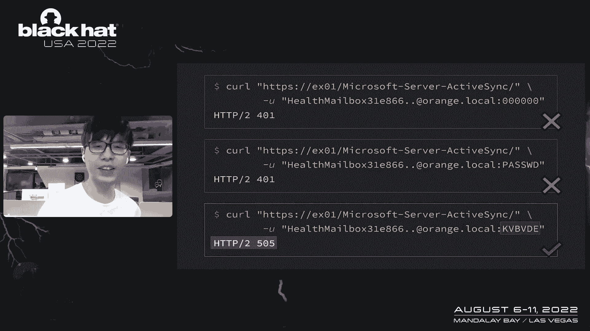

由于哈希碰撞攻击被广泛知晓，有几个变通办法可以缓解这些问题，例如输入大小限制或将哈希随机化的盐值。但每种解决方案都有其局限性。

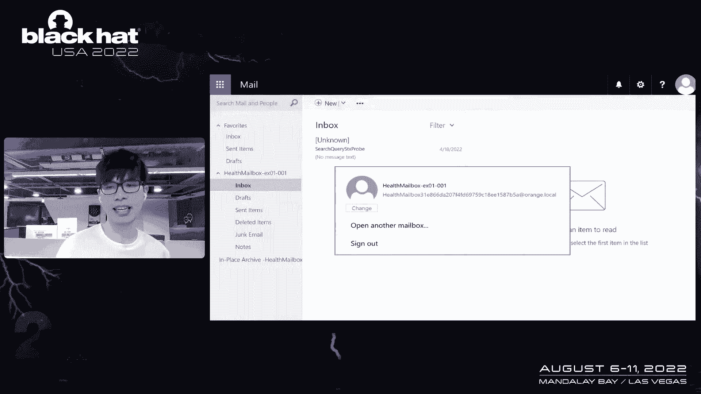

我脑子里还有几个很酷的想法，比如利用计时器的定时攻击来减少键空间。然而，因为我很懒，如果您有兴趣的话，我们可以来探讨。

---

## 总结 📝

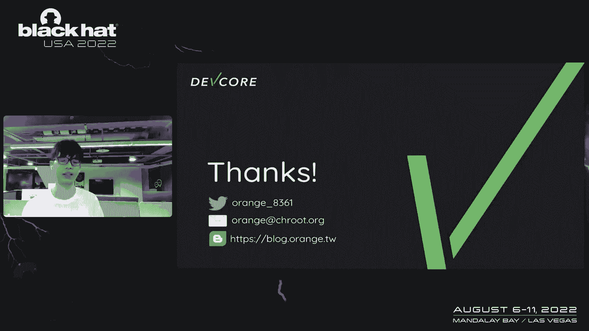

本节课中，我们一起学习了如何通过分析 Microsoft IIS 中哈希表的实现与使用来发现安全漏洞。我们从哈希表和哈希碰撞攻击的基础概念讲起，深入探讨了 IIS 的内部架构和请求处理流程。随后，我们详细分析了三种实际漏洞：哈希碰撞拒绝服务攻击、缓存投毒攻击和身份验证绕过攻击，并了解了如何将它们应用于 Microsoft Exchange Server 这样的真实环境。最后，我们讨论了针对这些问题的缓解措施和未来的研究方向。希望本课程能帮助你理解这些复杂攻击背后的原理。