# P21：022 - Better Privacy Through Offense： How To Build a Privacy Red Team - 坤坤武特 - BV1WK41167dt

我早上好黑帽子，我叫斯科特•托内利，我是Meta的隐私工程经理，我支持一个叫隐私红队的组织，巧合的是，这就是这次谈话的主题，我们要开始的方式，是通过更广泛地提出冒犯性隐私的理由，在深入研究这个问题之前。

我相信你们都是来听答案的，这就是安全和隐私红队的区别，我们会谈谈我们在Meta做了什么，建立一个隐私红队，为您可能想要执行的操作提供一些想法，如果你在考虑建立一个隐私权团队，然后用一些最后的想法来结束。

但在我们做这些之前，我想，设置一点，让你了解这个演讲是什么，不是关于什么，所以我们在这里主要想做的是，在这个社区里发起一场关于冒犯性隐私的对话，我知道我和观众中的其他人谈过，来自不同的公司，你要么有。

要么正计划成立一个隐私红队，我想是时候提升这一点了，这次对话到了社区范围内，相对于一对一，切中要害，如果你是一个组织，或者你为一个目前有内部安全红队的组织工作。

这次演讲可能是你如何建立一个内部隐私红色团队的蓝图，嗯，这可能是要求另一种类型服务的蓝图，如果你提供红队服务，那么这可能是您可能想要提供的一种新型服务。

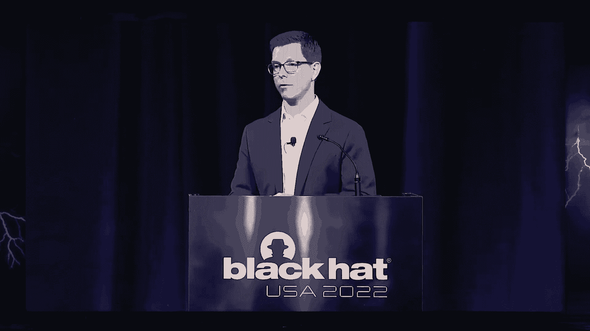

但总而言之，我们正在努力做的，这里给出一个如何理解，我们认为隐私红色团队符合一个整体的隐私计划，但我们绝对不会，这是给你的任何东西，我不是来推销东西的，我们也不打算谈论元的任何其他方面。

超越隐私红色团队，在整个演讲中，你们将听到我说隐私之类的话，这或安全，我非常明白，这些是重叠的领域，事实上，我们很快就会讨论这个问题，但这里的重点是我很难保持Caveon，我所说的一切。

所以不要接受我说的任何话，这是一个绝对的，最后的循环，对于第一点，你可以同意也可以不同意，我在这里要说的是，记住这是一次谈话，我想要你的反馈，我现在就想听听你对此有什么看法。

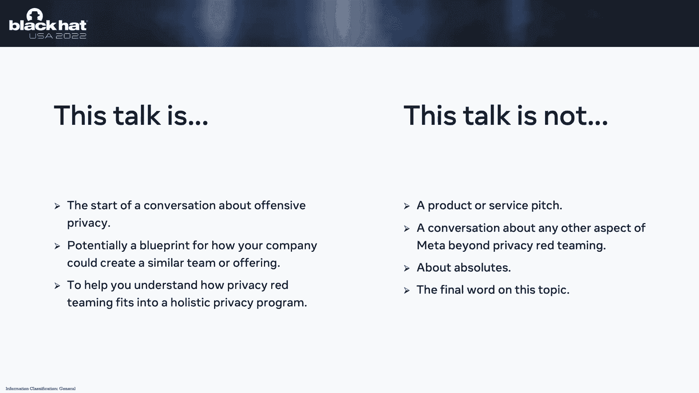

让我们潜入其中，为冒犯性隐私辩护，我们在黑帽，这意味着你们都很清楚冒犯是如何帮助你们的安全程序的，我想提出同样的理由来说明冒犯如何帮助你的隐私计划，当我以两种非常具体的方式做到这一点时。

首先是通过你可能有过的一些经历，第二个是概念上的，所以如果你是现在的红队或钢笔测试员，您可能正在进行操作，遇到了一些圆周率或其他敏感数据，不知道该怎么办，这不是你行动的重点，但你作为一个发现登录。

你只是忽略它，你也可能被要求开始记录这些事情作为发现，你知道的，如果你遇到这种数据感，嘿嘿，请记录下来，让我们知道，您可能还被特别要求创建一个以隐私为重点的版本，你通常会做的。

也许你不确定那到底是什么样子，然后也许你刚刚得到了一个标准的安全发现，你真的不能得到很多牵引力，因为有人告诉你没有正确的安全影响，对呀，我自己没有足够的影响力，一个同事发现自己处于这种情况。

回到2016年在黑帽欧洲。

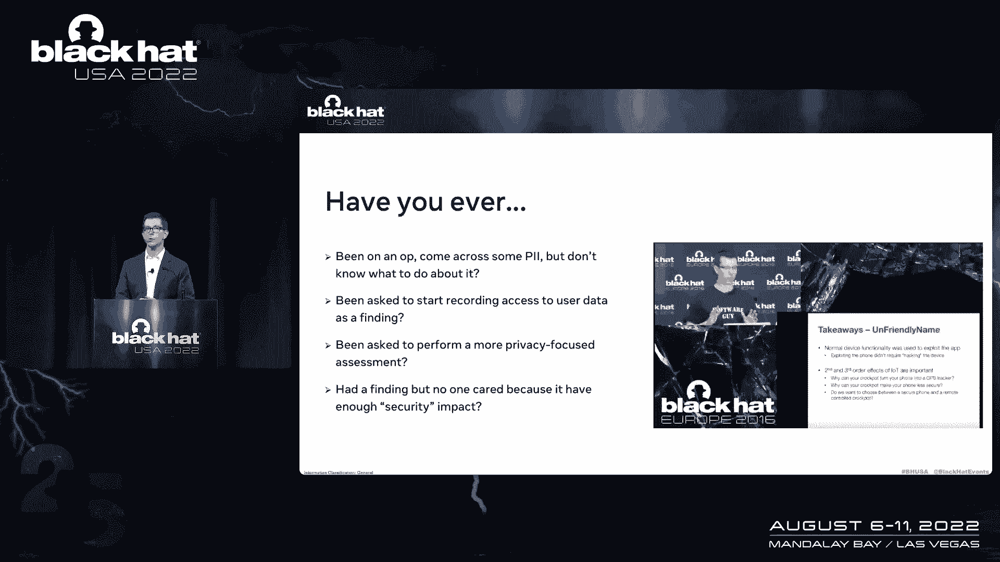

我们展示了我们在物联网设备上发现的漏洞的一些结果，其中一个漏洞是将代码注入到手机上，与IoT设备关联的手机应用程序，我们很多人都做一些事情，但人们不认为这有什么大不了的，因为代码注入漏洞很简单，对呀。

不是特别令人印象深刻，这有点难执行，因为您必须与设备在同一网络上，但我们的观点是这个代码注入漏洞，使我们能够从设备上提取所有的照片和其他文件，把手机变成GPS跟踪器它能追踪你的位置，不管你在哪个网络上。

当时我们试图通过说嘿来着陆，这些事情会发生在你身上，这难道不奇怪吗，就因为你现在想要一个联网的瓦罐，我也在想同样的事情，我说，嗯，是啊，是啊，安全漏洞可能很简单，但该漏洞对隐私的影响是超高的，您的位置。

你的照片，那种信息感，有人得到了他们的手，这对隐私确实有影响，所以也许你现在也有同样的问题，我们谈谈吧。

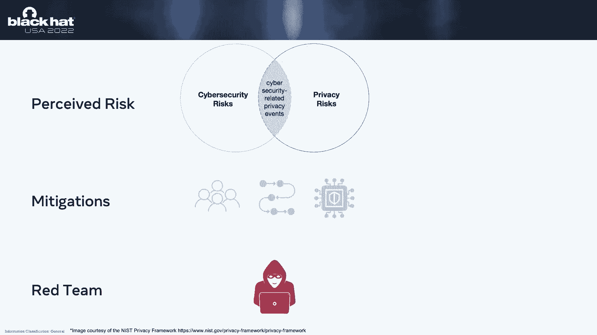

在概念上，整个对话从幻灯片上的风险概念开始，你看到的是这个维恩，安全和隐私重叠风险图，你不必相信我的话，这些是重叠的，因为这个维恩图来自这个隐私框架，我们在这里真正谈论的是感知风险，那是个人的主观判断。

关于负面事件发生的可能性，那些安全和隐私程序，我们都知道他们所做的一部分是帮助减轻这种风险，他们这样做的原因是把人们结合在一起，工艺和技术，我们称之为蓝队的权利来帮助防止这些风险被实现。

作为一名红队操作员，你要做的是对抗性测试，来弄清楚这些缓解措施有多好，他们实际上在减轻风险方面做得有多好，你在这里所做的是你在冒实际的风险，现在感知和实际的区别，对呀，一个是某人的判断。

另一个是风险的量化，如果你能绕过缓解措施，不再只是有人认为这可能是一个问题，你已经证明了，你做得很对，所以你的想法是你发现了实际的风险，你也可能会发现新的风险，所以想想几年前勒索软件还没有成为一件大事。

你有没有发现在一次行动中有人可以rm数据嘿，那将是一个新的风险，也许人们现在应该试着减轻，如果我们把这个维恩图拉开一点，我们可以开始了解两队之间的差异，所以让我们从网络安全方面开始。

您可能有兴趣降低的风险之一是攻击面枚举。

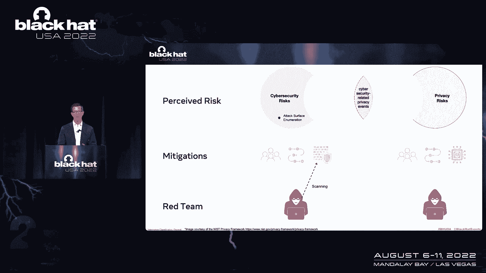

有一个过程来响应这些警报，人们实施这个过程，所以人的组合，过程和技术是缓解标准，红队在侦察阶段的活动可能是扫描目标网络，如果你没有从扫描中得到太多，嘿嘿，否则你可能需要做一些调整，在任何一种情况下。

你所做的是识别系统和网络的实际风险，现在与该目标相关联，让我们看看我们在隐私方面做了什么，我们非常关心的风险之一是大规模访问数据，我们减轻这种情况的方式，或者我们缓解这种情况的方法之一是通过利率限制。

正确的限制说你只能在特定的时间内访问这么多数据，作为一名红队操作员，红队随时可以访问敏感数据或重要数据，你认为你不应该获得的东西，你要做的第一件事就是看到，你还能做对多少，你要把那个轴放大，你要刮。

如果这些利率限制运行良好，然后嘿嘿，你可能在那里做不了什么，否则，您可能需要对费率限制进行一些调整，在任何一种情况下，您所做的是识别用户数据的实际风险，和他们的隐私非常直接。

这就是现在关于差异的对话的基础，我们潜水吧。

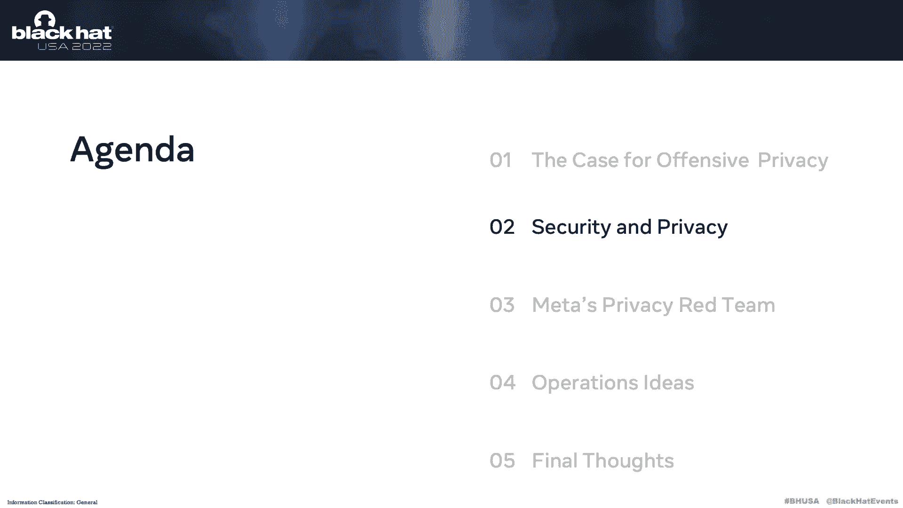

深入研究一些更具体的差异，你会明白的，如果你是红队接线员，你可能已经决定有一大堆风险，仅适用于您的团队，并在操作上访问用户用户数据，所以也许你真的说嘿，我们将完全避免这样做，我们不能做对。

这就是关键是找到对数据的访问，那不应该在那里，我们无法避免这些不同的含义，这不仅是一个关键的区别，但这里有一个公共服务公告，确保你和你的法律团队合作，了解你正在做的手术的风险。

以及它们与你可能遇到的不同法律法规的关系，我想说的下一个区别是对手，所以在安全社区，大家都知道。

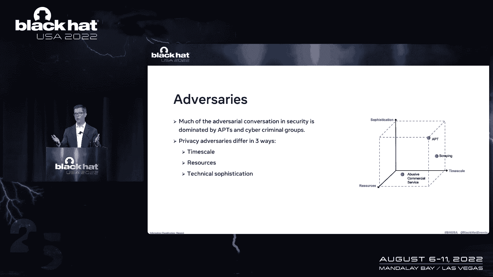

我们非常关心那些高级的持续威胁，像国家一样，国家行为者，也许还有一些网络犯罪集团，当然还有隐私，我们也关心那些，但我们也关心其他类型的对手，我喜欢从三个不同的角度来区分，其他资源和最后一个是技术复杂性。

如果你想一个贴切的，无限的资源和高度的技术复杂性，如果我们看一个隐私对手，我们很关心像滥用商业服务，一家基本上从我们的平台上提取数据的公司，然后卖给别人，合同期为，他们的资源将受到任何限制。

有人付钱让他们做那种活动，以及他们的技术复杂性，我们期望比APT低得多，另一个有趣的例子是一个投机取巧的坏演员，试图从平台上刮取数据并将其转储到黑暗的网络上，所以你认为那种演员是一种孤独的演员。

他们是机会主义的，受他们注意力持续时间的限制，但他们的技术复杂度会在任何地方，在滥用的商业服务和T之间。

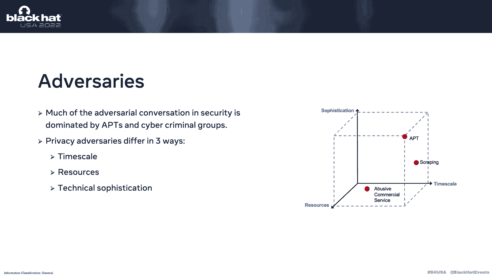

现在你可能在想，好吧，听着，我一直在做红队的工作，我的标准向上是这样的，我在找一些凭据，我登录到一个盒子里，我在网络中横向移动，有N个漏洞，我放弃恶意软件以保持持久性，也许拿一些红葡萄酒，把我变成了猫。

登录数据库，下一个完整的数据，所以看着我，我在做隐私红队，对呀，因为我可以访问数据，但如果我们想想你是怎么做的，那是非常间接的，你破坏了整个系统网络来访问这些数据。

世界上的隐私红队对这种直接访问更感兴趣，也许通过用户界面或API，所以如果你没有从安全和隐私之间的区别中拿走任何东西，红队，我想让你把它想象成这个保安，红队的目标是公司，把公司看作是信息的容器。

你的目标是隐私红队的目标是用户，那个公司持有集装箱里的东西的数据，那是电话，艺术，这是要记住的事情，在我们完成这些差异之前，我想谈谈蓝队，就像你在几张幻灯片前看到的那样。

我们在Meta有一套单独的隐私风险，我们雇了一组单独的人，并创造了新的流程和技术来帮助减轻风险，所以可以说我们有一个单独的蓝队，事实上你可以说这个隐私红队很有意义，因为一个单独的蓝队。

我们需要一个单独的红队来测试它，但当我们谈论布鲁斯时，还有另一个重要因素，那就是对手窃取数据是有原因的，对呀，所以如果他们是间谍或犯罪行为，或者类似的东西，嗯，您作为隐私执行的活动类型。

红队可能看起来很像那些演员在做什么，这意味着如果你有一个正直的蓝队，你可能会被其中的一些检测绊倒，触发那些警报，同样地，你可能会攻击的东西，假设身份验证系统可能检测到，你在你的标准安全蓝队绊倒了。

所以重点是，提前弄清楚你需要和谁合作是很重要的，在你行动之前，你可能会触发哪些蓝队，好了现在，让我们谈谈我们在Meta做了什么，建立一个隐私红队，如果你把我们到目前为止谈论的一切都归结为。

你得到这份任务说明，我们正在做的是主动测试人们。

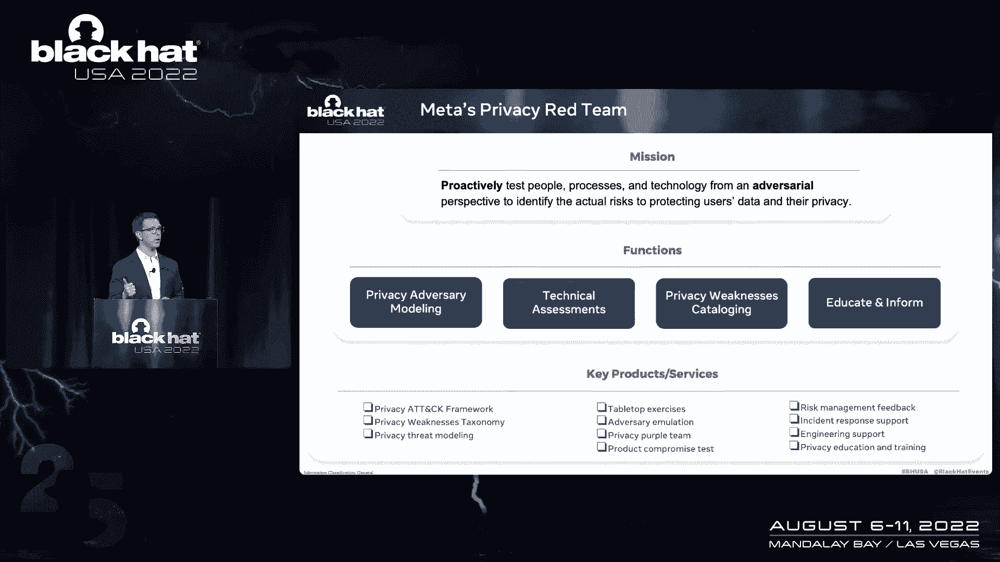

从对抗的角度来看过程和技术，识别对我们用户数据和隐私的实际风险，两个关键词是，当然是积极主动的和对抗性的积极主动的，意思是，我们想在真正的对手做之前做这些事情，这样我们就能更好地防御他们。

当然对抗性测试是红队的独特之处，现在，我们中间的四个函数，你可以从左到右读，这真的是我们如何做我们所做的事情的核心，开始谈论对抗性测试，嗯，你需要知道的第一件事是你需要了解对手，就像他之前说的。

这个隐私对手的空间定义不太明确，也不太为人所知，也许安全行业，所以我们在这里要做的是真正弄清楚这一点，通过建模那些对手，我们取一个侧写，几个配置文件，并将它们应用于我们所做的这些技术评估。

这些发现中的一些是产品和服务中的个别弱点，我们认为纪念这些弱点真的很重要，对呀，对它们进行编目，以便我们可以与工程团队共享，对呀，教育和通知那些人，谁能阻止那些事情在将来发生。

这张幻灯片上列出的关键产品和服务是我们如何实现这些功能，我将在随后的幻灯片中更详细地介绍它们，但在这里，我只想快速地将产品和服务映射到功能，所以从左上方开始，隐私攻击框架是我们试图更好地理解对手。

那是我们的对手，建模，隐私弱点，分类法是我们对隐私弱点的实例化，编目中间的一行是我们所做的不同类型的技术评估，在右边，是我们教育和告知公司其他人的不同方式，在我们更详细地讨论这些之前。

我想花一点时间谈谈团队的组成，我们怎么，我们如何建立这个团队，我们雇了谁很多人对隐私不太感兴趣，因为他们认为这是一种风险评估，非技术学科，首先也是最重要的，我想说风险评估对隐私保护项目非常非常重要。

你做这些是很重要的，但这不是我们所做的，我们做技术评估，事实上，隐私工程操作员是真正的隐私工程师，对呀，隐私团队操作员是隐私工程师，所以我们要找的工程师有三个主要特点，一种明显的敌对心态。

他们必须能够像对手一样思考，模仿对手，攻击性安全技能集，所以这分解了几个不同的组件，一个是因为我们攻击的是同一种系统，所以网络和移动系统，你必须对这些不同的工具有一些了解。

以及如何使用这些工具来实施不同的策略，技术和程序，但另一个角度是想象，你是一个对Linux或Windows有深入了解的人，一些操作系统，你已经很擅长操纵操作系统了，你有知识，在那里建立了很好的技能。

我们并不真的想要你对Windows和Linux的了解，因为我们当然不是在攻击那些东西，但我们确实想要你的技能，你怎么知道如何操纵这些东西，我们只是想把这套技能应用到我们的平台上，脸书。

Instagram，信使，等，我们可以教你，给你知识，让你成功，操纵那些东西，最后是隐私本能，尤其对于这种观众来说，嘿，我们需要你有五年的经验，所以我们真的在寻找那些有良好直觉的人，关于它的很多。

你可以想象，这意味着我们要从这四个人中招募，你在屏幕上看到的这四个学科，但我们这样做是有目的的，因为我们想从两个方面攻击任何问题，内部是白色的盒子外部是黑色的盒子，所以你想想。

作为您的漏洞研究人员和应用程序，技术工程师非常擅长看代码，喜欢看代码，不管是源代码还是反向工程代码，他们从那个角度来解决问题，然后红队和笔测试员做得更多，过程和系统的外部探测。

所以我们认为如果我们把这两者混合在一起，我们对一切都有一个很好的团队方法，最后，我想指出，这里还有一些其他重要的伙伴关系，所以法律风险和政策，因为我们在谈论隐私是非常重要的伴侣，但在Meta。

我们建立得很好，以促进这些伙伴关系，但我们没有他们作为团队成员，我要说的是，因为我不想让你认为，如果你和你的组织支持其中一个团队，并在该团队中安排一名律师。

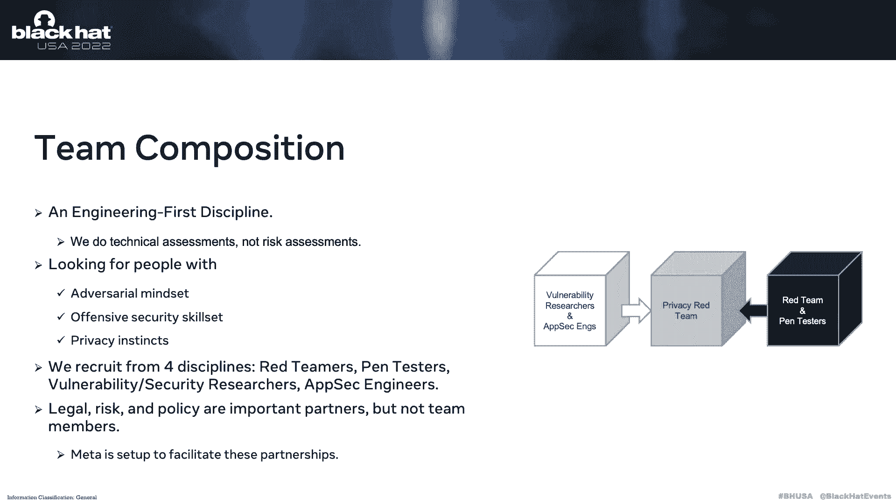

你做错了，你不是，你只是设置不同，法律伙伴关系是必需的，如果你有，你就是这么做的，那完全没问题，只是我们不是这样做的，因为公司的工作方式不同，但一定要现在就做，让我们回到其中的一些产品和服务。

所以隐私弱点，隐私弱点是我们要寻找的正确的东西，这些都是我们需要很好地理解的事情，它们是错误的缺陷，我们可能会发现的错误和代码，你可能会说，为什么不使用安全漏洞这个术语，这些是一回事，答案是。

也许我们不知道，所以我们特别给它们起了别的名字，所以我们可以探索这个空间，并回答我们的安全漏洞的问题，隐私弱点是完全明显的，部分重叠，完全重叠，或者一个是另一个的子集，我们只是还不知道，但我们正在调查。

当然，这是一件重要的事情，不仅因为它是我们要找的，但这是我们要用的语言，与我们不同的产品和工程团队交谈，当我们发现一个特定类型的问题，我们想对他们说，嘿嘿，就是这样，这就是它的影响。

这是它在代码中的样子，这就是你将来预防或补救它的方法，我们也可以用这些东西来定义度量，比如嘿，我们不断发现这个问题，特定产品、服务或代码库中的这种类型的弱点，也许我们应该花更多的资源来解决这个问题。

并根除它，同样，我们已经开始研究隐私攻击框架，所以这里的想法又来了，我们是红队，所以想模仿对抗，我们必须知道那个活动是什么，战术是什么，他们使用的技术和程序，这对我们的工作当然是至关重要的。

但对蓝队来说，理解这一点也很重要，这样他们就可以建立那些检测和检测预防系统，问题就像我之前提到的，对一个空间的理解有点少，所以我们必须用不同的方法来解决这个问题，拿了所有这些不同的报告。

他们从中蒸馏出不同的ttps，然后他们可以联系到这些演员，我们算是做到了，意思是，我们说嘿，这就是我们在这个特定操作中想要模仿的演员，一旦我们做了那个手术，我们找出我们用来成功的TTP，然后说，好的。

嗯，这显然是那种演员会做的，随着这个空间的前进和成熟，我们希望像米特那样攻击它，我会注意到隐私的弱点，分类学，隐私攻击框架是我们希望在未来与您分享的东西，也许以这种形式，或更广泛的其他，好了现在。

让我们谈谈我们执行的各种技术评估，我们再次从安全手册中借鉴了一页，我们要做的第一件事就是你认为的正常的红队行动，也就是对手仿真，所以这些事情是客观的。

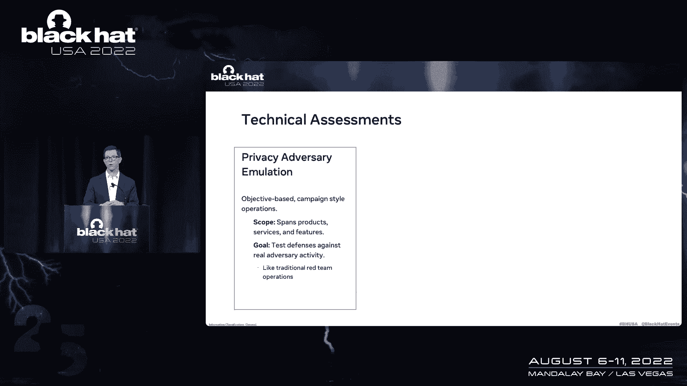

专注，非常长的持续时间竞选风格的事情运行了很多个月，因为他们是客观的焦点，对呀，我们想给自己最大的成功空间，所以我们对这个范围的限制很少，使用不同的平台，无论我们需要做什么才能成功。

目标是测量和理解我们的韧性，对特定类型的对手，接下来我们有一些类似紫色团队的操作，同样，这在很大程度上是针对一种特定的防御技术的，我们帮助一个蓝队改进它，具体的例子可以是我们添加到产品中的隐私控制。

也可能是某种隐私保护措施，他们可能会问我们这样的问题，我们认为我们已经涵盖了整个空间，有人可以在这里做什么，我们有还是嘿，你怎么得到，你能不能想办法绕过这个，因为我们不希望这种情况最后发生。

我们称之为产品妥协测试，我们专注于一件具体的事情，产品服务特色，我们试着做两件事中的一件，要么，做一些事情，比如找到所有的漏洞，在这种情况下，它将找到所有的弱点，那个。

这就是为什么我们需要这个弱点分类法来理解我们在寻找什么，然后我们执行的另一个活动，这里的另一个目标可能是做一些事情，比如在盒子上扎根，在我们的情况下，获得根更类似于找到所有不同类型的数据。

然后尽可能多地提取数据，所以经典的例子可能是API，对呀，你认为有一些API允许访问某些类型的数据，并以一定数量，如果我们能挤压API并获得所有的数据，所有这些数据类型，以及与之相关的所有数据。

我们把根做对了，我们在努力扎根。

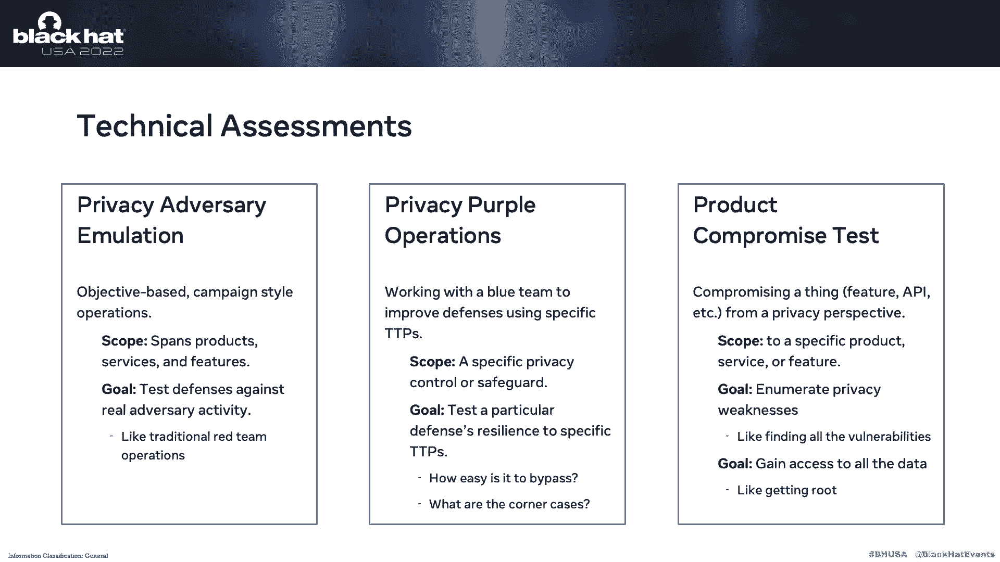

所以考虑到这一点，让我们谈谈您可能想要执行的操作的一些想法，现在第一个是对抗性仿真操作，它真的适用于任何有任何在线存在的公司，所以如果你有别人可以账户的东西，世界上肯定有演员想做两件事中的一件。

要么找出与该帐户相关联的联系信息，所以他们可能有一个联系信息列表，电子邮件地址，电话号码，并找出哪些帐户与，或者他们可能想反其道而行之，并记下他们知道与他们有联系的人的账户列表，并弄清楚联系方式是什么。

在任何情况下，方法可能是一样的，他们会寻找功能的一部分，他们可以输入联系信息，也可以输出联系信息，试着把它们串在一起，以一种连锁的开发方式，为了达到那个目标，当你考虑这种功能时。

你知道你可能想象中的蓝队，除了隐私蓝队可能会在这里作为安全，蓝队，因为他们显然可能对恶意行为有一些检测，这些不同的功能，虽然，我们觉得，因为这些功能只是通过，你知道的，网页、网络浏览器或移动电话。

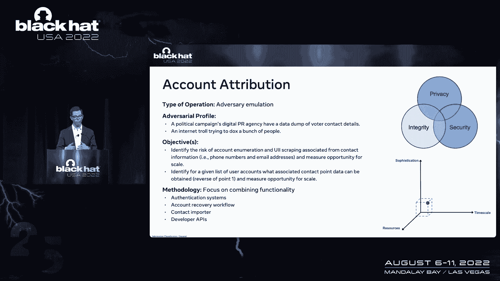

他们很容易接近低，老练的对手，你没有很多时间或资源，另一个有趣的，紫色团队操作的一个例子是敏感数据泄漏检测，所以你可以想象他们内部有一个团队，他们关心确定，如果敏感数据离开内部基础结构，PCAP数据。

然后重建溪流，以及在敏感数据方面，我们认为它更多的是一个应用程序层的东西，所以当你从这个角度思考时，有一个有趣的，我会加引号，这里的对手，这就是我们所说的心不在焉的开发人员。

这是一个可能正在创建一个新的微服务的人，你知道在你的内部环境中，他们意识到他们可以得到一些数据，他们需要从外部资源处理，网上某个地方的一些宁静的API，他们向那个宁静的API发出请求。

但他们不认识隐藏的，该请求是一些不应该真正离开环境的数据，所以这个内部团队正试图检测，这些新的数据流来自新的服务，所以作为隐私红队操作员，你可以在这里做捉迷藏，对呀，做一个两周的冲刺模型，第一周。

团队提出了所有这些不同的数据流，他们中的一些人没有，然后在第二周，他们说，好的，去找他们，见，如果你的检测技术发现了他们如果没有，也许在这两周结束时寻找它们，大家一起回来，股份，经验教训。

也许会重复另一次冲刺，当然，这也是相关的，如果你试图检测内部人士的，你知道的，我想和大家分享的最后一个操作是某物的数据类型集中在右边，这是另一件非常广泛适用的事情，任何组织都有特定类型的数据存储。

他们知道比其他人更敏感，所以你可以很容易地做的一件事就是说，好的，让我们从这些中挑一个，看看我们能不能得到它，在这里选择两个不同的对手简介很有趣，低技能的人，意思是他们只是用现成的东西。

我真的不知道他们在做什么，不是很熟练，然后是一个高能力的对手，所以一个拥有真正熟练团队的人，他们可以创建自定义工具，并真正知道自己在做什么，因为你会知道你对每个人都有多大的弹性，这里的目标。

当然是你想能够识别，不仅仅是人们可能想要的有趣类型的数据，但有助于改进这些检测技术，所以这样做的标准方法是说，好的，假装是那些高中低年级的对手，查看可能可用的数据，他们感兴趣的是什么。

然后列举一大堆ttps，他们可能用来获取数据，执行它们，看看它们有多成功，这还有一个额外的好处，即使没有成功，也仍然是尝试，你的蓝队可以看着然后啊哈，如果有人想这么做我都能看出来。

因为这些是数据类型集中的权利，参与者出于特定的原因想要数据，嗯，你最终可能会做一些看起来像诚信团队会跟踪的事情，比如你在平台上创建一些他们知道的资产，某些类型的演员创造，所以你可能会在那里触发这些探测。

好了现在，让我们来谈谈发现以及安全和隐私发现之间的区别，所以请原谅，总的来说，安全调查结果，非常客观，如果你告诉别人，我发现X漏洞，比如跨站点脚本，他们的意思是说，好的，我拿到了，我明白为什么不好。

我理解它的影响，我可能知道怎么修好它，我很清楚你做了什么，没做什么，我可以去解决，隐私调查结果可能更加主观，因为一个发现的概念可能会受到许多不同因素的影响，首先也是最重要的。

您的组织可能在世界的某个地方运作，在世界的那个部分，这可能会影响一个发现是什么，第二次，您的公司可能已经就如何保护用户的隐私数据发表了声明，如果你发现这种说法与你的发现不太正确，嗯，这可能。

这可能是一个发现，最后，即使在先的是真的，这意味着你的发现与我们一致，与公司的声明，而不是违反法律规定购买，你作为同一个平台的用户可能会对自己说，你知道对我来说，作为用户，我仍然不认为这符合隐私的期望。

你可能想称之为发现，现在在未来，我们希望真正从主观走向客观，我想我们要做两件事，一个是了解这些隐私弱点，更好的是理解如何通过设计来实现隐私，一次又一次，我想我们会到达那里，我想给你留下几个最后的想法。

第一个我知道你会很兴奋的，因为我知道这个房间里的每个人都喜欢度量的话题，我不想让你失望，但如果你这么做了，如果你现在是红队接线员，我知道这会让你很失望，但你的大多数指标在这里不适用。

妥协系统的时间真的没有意义，因为嘿，我们不是在破坏系统，检测的时间可能甚至没有意义，因为，就像我们刚才说的，我们甚至可能不知道我们试图检测什么，所以我们可能没有任何东西可以检测到他们。

那么我们做得好的是什么呢，答案是，我还不知道，我不知道完美的度量标准是什么，但我想给你一些框架的想法关于第一个框架的想法是，这些度量的目标，应该是推动组织隐私姿态的根本改变，让他们更好地保护隐私。

我想你能做到，通过看三个大桶来衡量一个是你的组织是如何做到的，理解空间，那个隐私空间，尤其是对抗空间，你对，新的TTP和新的弱点可能会帮助他们理解，下一个是了解公司自己是如何做对的，所以他们有防御。

这些防御工作得有多好，他们在识别这些防御的漏洞方面做得有多好，把它们装满，最后，当然你想衡量你自己的团队做得如何。

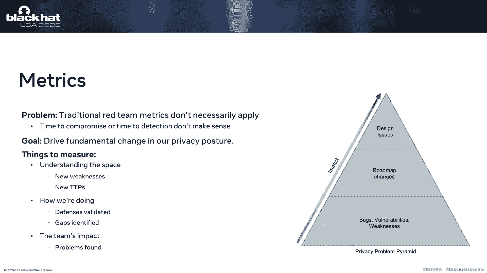

你的隐私如何，红队在做，红队，为此，我喜欢用隐私问题，右边的金字塔，所以当我们在这个金字塔里往上走的时候，你得到了更多的影响，我们越低，你会发现更多的东西，所以说，如果你想想这些发现，你可能要做手术。

金字塔的最底层将是你的虫子，你的弱点，那些可能导致隐私问题的缺陷和弱点以及代码，这些都很明显，对吧，你可以给任何人看，他们说是的，我们得把这些修好，明白了，我们会在下一关做的，希望你有更少的这些。

下一个层次绝对不是bug和弱点，但它们是你会带给产品团队的东西，一个工程团队说嘿，我想这是个问题，我觉得我们应该做点什么，哦耶，我们一定要解决这个问题，但这将是相当复杂的。

所以我们要把它放在我们的路线图中，对，我想这就是为什么我称之为路线图改变，现在，最后一类东西不是前两者中的任何一个，希望这绝对是你能找到的最少的东西，我认为他们中的设计问题。

因为有些东西你可能会去同一个工程团队，说看，我想这是你需要改变的地方，他们不会去的，我们所说的关于如何保护用户的一切，隐私在这里完成，它不违反任何法律或法规，现在你要回来说好，但是是的。

这违背了我对隐私的期望，我是这个平台的用户，如果你继续这么做，你真的成功地让他们做出了改变，因为从根本上说，你可能会谈论一个设计问题，对，这里不一定不好，对吧，它可能是一个更老的产品。

他们在建造它的时候没有考虑到用户隐私，但如果你说到重点，他们将来可能不会犯那样的错误，下次他们建造东西的时候。

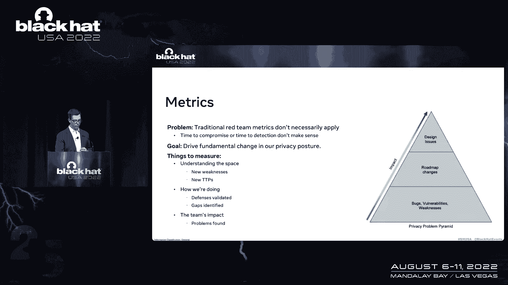

所有的权利，所以，现在让我们来谈谈一些经验教训，以结束这整个对话，我想从一个故事开始，所以我已经和内部和外部的人谈过了，给公司，关于这个概念和有趣，同样的问题我已经问了很多次了。

所以在这里讲这个故事是值得的，它是这样的，嘿斯科特，这是一个很棒的概念，喜欢你在这里做的事，好像超级值钱，但我的问题是，如果您有所有这些数据库表，如，你如何确保他们都有保留限制，这些是正确的保留限制。

我说我得到了这个没有问题很简单，我不那么做，这不是我的工作，你告诉我的，您是否要求对数据库表有保留限制，你想知道谁在验证这个要求，那是一个遵从性函数，顺便说一句，合规是非常重要的，绝对需要那个。

但那不是我们所做的，我们在上面，不遵守情事，我们提供了一定程度的信心，相信你在做正确的事情，你所做的不仅仅是满足要求，你要超越这一点，那是保证，红队就是这么做的，下一件我认为重要的是在这里重申的是访问。

收集，储存，使用数据，为了这个红队的目的，可能与你的公司想象的方式不同，这可能会有一些取决于你所经营的世界的地区，所以你肯定需要和你的法律团队合作，弄清楚如何减轻这些风险，因为他们可以阻止表演。

我想留给你的最后一个想法是，我认为我们已经到了哪里，作为一个隐私行业，我们将走向何方。

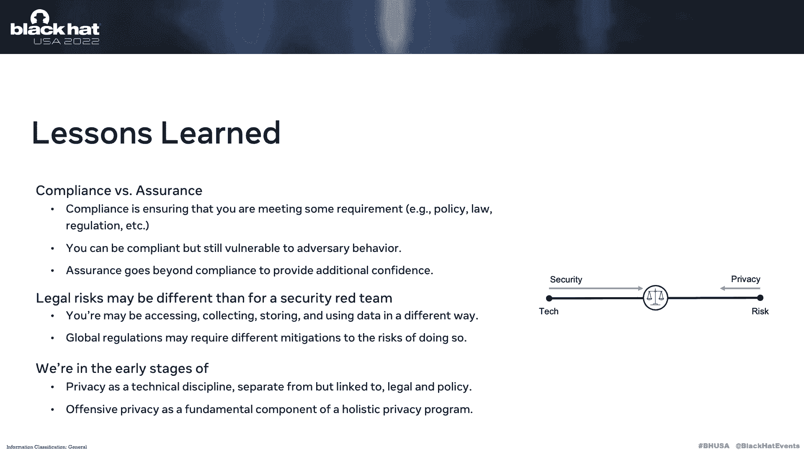

所以在右边这里，这个小图显示了我自己对，关于历史上安全和隐私之间的区别，所以我认为他们在非常注重技术到非常注重风险的范围内，想想25年前的安保系统，嗯，他们很久以前就开始了，你知道的，技术重点领域。

所以人们想出了打破东西的新方法，和其他人想办法抵御这种情况，它非常注重技术，随着行业的发展，公司参与进来，安全程序，他们引入了风险权的概念，以确定他们需要什么技术。

现在我们在技术和风险之间有了很好的平衡，我想隐私是从另一边开始的，对呀，他们从风险方面开始，这可能是一个原因，我们很多人都没有进入，嗯，谈论像嘿这样的事情，你的敏感数据在哪里，谁可以访问它，等。

但如果你想想这些问题，现在就像，你的敏感数据在哪里，在我手机上，在我的笔记本里，它在多个云环境中，对呀，这一切都在所有这些不同的技术中，所以技术的概念，你知道，给隐私注入更多风险，并将隐私推向技术方向。

我想这就是我们要去的地方，我想我们还处于起步阶段，就像我们，你知道，也许20年前在不安全的情况下，希望，虽然在未来对吧，我们会得到这个很好的平衡，人们会坐在这样的房间里。

我不敢相信我们曾经争论过冒犯性隐私是否是一件事，我们应该在隐私程序中，我想现在开始这个对话真的会帮助我们到达那里，所以说了这么多，2。我想把我刚开始讲的话再重复一遍，你可能部分和全部不同意。

我今天说了很多话，或者你可以同意任何一种方式，我不在乎，我觉得很好，这就是对话，这是一个来回，所以让我们继续谈，谢谢你抽出时间，我会回答任何问题。

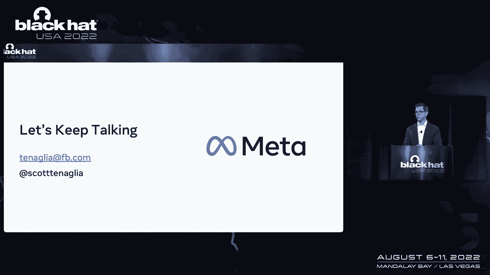