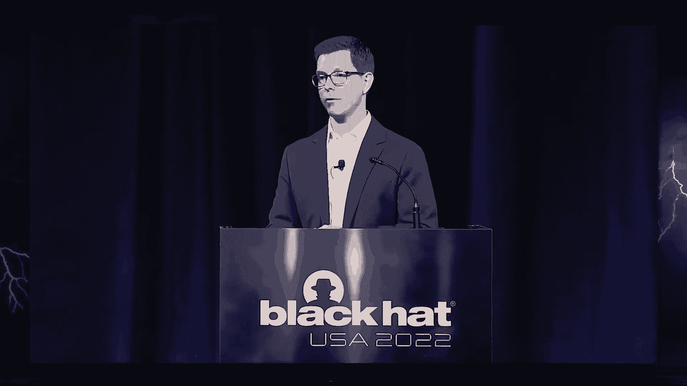
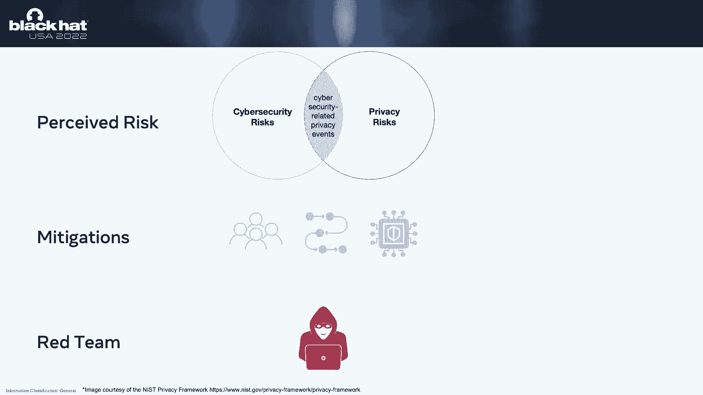
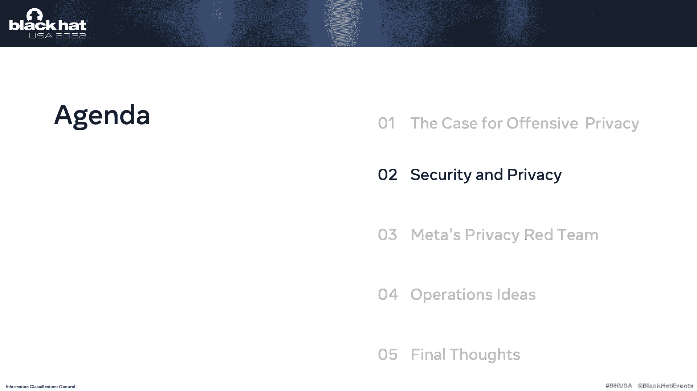
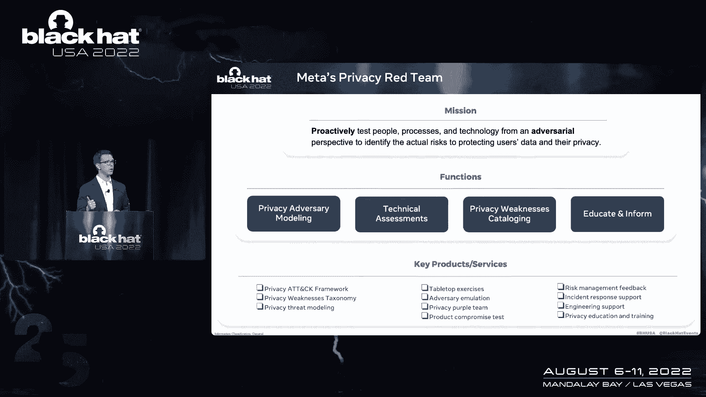
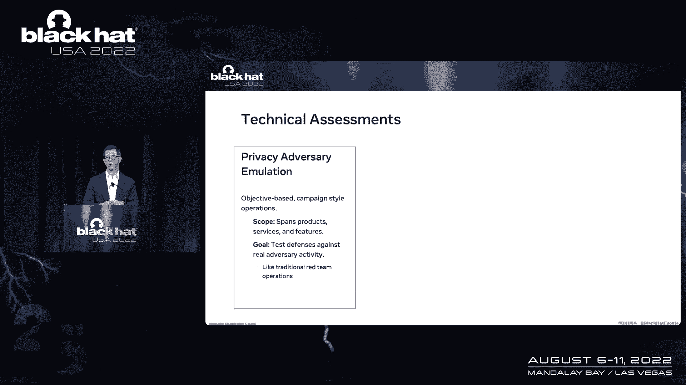
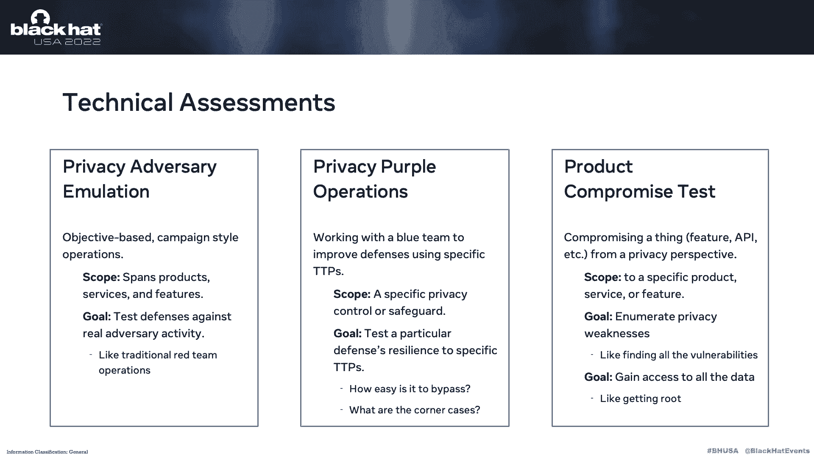
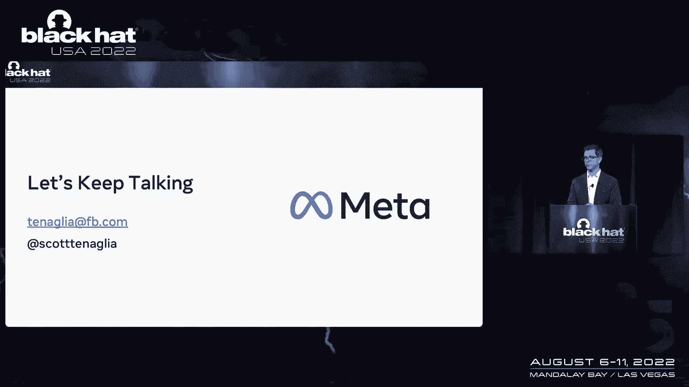

# 课程 P21-022：通过进攻实现更好的隐私：如何构建隐私红队 🔒

在本节课中，我们将学习如何构建一个隐私红队。我们将探讨进攻性隐私的概念，分析其与安全红队的区别，并提供一个建立隐私红队的实用框架。课程内容基于斯科特·托内利在 Meta 领导隐私红队的实践经验。

---



## 概述：为进攻性隐私辩护

上一节我们介绍了课程主题，本节中我们来看看为何需要进攻性隐私。我们身处安全社区，深知进攻性测试对安全计划的帮助。同样的理由也适用于隐私计划。


我们可以从两个具体方面来论证：
1.  你可能已有的一些实际经历。
2.  概念上的理解。

如果你是一名红队或渗透测试人员，可能遇到过以下情况：
*   在操作中偶然发现个人身份信息等敏感数据，不知如何处理。
*   被要求开始记录此类数据发现。
*   被要求专门执行以隐私为重点的测试，但不确定具体做法。
*   提交了一个标准的安全发现，却因“缺乏足够的安全影响”而未被重视。


一个具体的例子发生在2016年黑帽欧洲大会上。团队展示了一个物联网设备漏洞，该漏洞允许向关联的手机应用注入代码。虽然这个代码注入漏洞本身看似普通，但其对隐私的影响是巨大的：攻击者能提取设备上的所有照片和文件，并将手机变成GPS追踪器。这个例子说明，**安全漏洞可能简单，但其引发的隐私风险却可能非常高**。

---

## 概念基础：风险、安全与隐私



上一节我们通过实例说明了隐私风险，本节中我们从概念上探讨风险。整个对话始于对风险的理解。

下图展示了安全与隐私在风险层面的重叠关系：
```
[安全和隐私重叠风险维恩图]
```
安全和隐私领域存在重叠，因为它们都关注于减轻风险。两者都通过结合人员、流程和技术（即“蓝队”）来帮助防止风险成为现实。

红队操作员进行对抗性测试，以评估这些缓解措施的实际效果。你所做的是将“感知风险”（某人的主观判断）转化为“实际风险”（可量化的证明）。如果你能绕过缓解措施，就证明了风险确实存在，甚至可能发现全新的风险类型。


将维恩图拆开看，能帮助我们理解两队关注点的差异：

**网络安全红队**关注的风险之一是攻击面枚举。缓解措施是建立响应流程。红队的活动可能是扫描目标网络，以识别与该目标关联的实际系统和网络风险。



**隐私红队**关注的风险之一是大规模数据访问。缓解措施之一是实施速率限制。红队的活动是测试能否突破这些限制，以识别用户数据及其隐私面临的实际风险。

这就是两者差异的对话基础。


---

## 核心差异：安全红队 vs. 隐私红队


上一节我们建立了基本概念，本节中我们深入探讨一些更具体的差异。

首先，**操作权限和意图**是关键区别。安全红队可能完全避免接触用户数据，其重点是发现本不应存在的数据访问途径。而隐私红队的目标恰恰是寻找这些不应存在的数据访问。**这是一个至关重要的区别**。同时，必须与法律团队合作，了解操作风险及其与不同法规的关系。

其次，**对手模型**不同。安全社区非常关注高级持续性威胁（如国家行为体）。隐私领域同样关心这些，但也关心其他类型的对手。我们可以从资源和技术复杂性两个维度来区分：
*   **滥用商业服务的公司**：资源受合同限制，技术复杂度通常低于APT。
*   **机会主义的恶意行为者**：资源有限（如个人精力），技术复杂度可能介于滥用服务者和APT之间。

第三，**攻击路径和目标**不同。典型的安全红队操作是：获取凭证 -> 登录系统 -> 横向移动 -> 部署恶意软件 -> 窃取数据。这是一个**间接**的过程，通过破坏系统网络来访问数据。隐私红队则对**直接**访问数据更感兴趣，例如通过用户界面或API。可以这样理解：**安全红队的目标是公司（信息的容器），而隐私红队的目标是容器内的东西（用户数据）**。

最后，**与蓝队的互动**。在Meta，我们有独立的隐私风险缓解措施和相应的“蓝队”。隐私红队的存在部分是为了测试这个独立的蓝队。此外，隐私红队执行的活动（如模拟数据窃取）可能触发正直的安全蓝队或隐私蓝队的检测警报。因此，在行动前，必须明确可能与哪些蓝队产生交互。



---

## 实践框架：Meta 如何构建隐私红队

上一节我们分析了差异，本节中我们看看Meta的具体实践。将之前的讨论归结起来，就得到了隐私红队的**任务说明**：
> 主动地、从对抗角度测试人员、流程和技术，以识别对我们用户数据及隐私的实际风险。

关键词是 **“主动的”** 和 **“对抗性的”**。

我们的核心职能体现在下图的四个模块中，从左到右阅读：
```
[隐私红队核心职能图：对手建模 -> 技术评估 -> 弱点编目 -> 教育告知]
```

1.  **对手建模**：首先需要了解对手。我们通过建模对手档案来做到这一点。
2.  **技术评估**：将对手模型应用于具体的技术评估中。
3.  **弱点编目**：我们发现产品和服务中的具体弱点，并将其编目，以便与工程团队共享。
4.  **教育告知**：我们通过分享发现来教育和通知公司内的相关人员，防止未来发生类似问题。

---

### 团队构成与招聘

上一节介绍了核心职能，本节中我们看看团队的组成。隐私常被视为非技术性的风险评估学科，但我们进行的是**技术评估**。我们的隐私红队操作员本质上是**隐私工程师**。


我们寻找的工程师具备三大特质：
1.  **对抗性思维**：能够像对手一样思考。
2.  **进攻性安全技能**：了解攻击网络和移动系统的工具及TTPs；具备深入操作系统的知识及操纵系统的技能（这些技能可迁移到攻击我们的平台）。
3.  **隐私直觉**：对隐私问题有良好的本能理解。

我们有意从以下四个学科招募人才，以从内外两个角度解决问题：
*   **漏洞研究/应用安全工程师**：擅长查看代码（白盒）。
*   **红队/渗透测试员**：擅长从外部探测流程和系统（黑盒）。

此外，与**法律、风险和政策团队**的伙伴关系至关重要，尽管在Meta我们并未将他们作为红队正式成员。

---

### 关键产出：隐私弱点与攻击框架

上一节我们谈了团队，本节中我们看看团队的关键产出。首先，我们定义了**“隐私弱点”**——即我们寻找的代码中的错误、缺陷。我们使用这个新术语，而非“安全漏洞”，是为了探索这个领域并研究两者关系。



拥有这个分类法很重要，因为它：
*   是我们与工程团队沟通的语言。
*   可用于定义度量标准（如某类弱点在特定代码库中出现的频率）。

其次，我们正在开发**隐私攻击框架**。作为红队，我们需要模仿对手，因此必须了解他们的战术、技术和程序。由于社区对此空间的理解较少，我们通过分析报告、提炼TTPs来构建这个框架，并将其关联到特定的对手模型。未来，我们希望它能像MITRE ATT&CK框架一样成熟。

---



### 技术评估类型

上一节我们介绍了关键概念产出，本节中我们看看执行的具体评估类型。我们借鉴了安全领域的实践：

1.  **对手仿真**：这是经典的红队行动。目标明确、持续时间长（数月）、限制少，旨在衡量我们对特定类型对手的抵御能力。
2.  **紫队式行动**：专注于测试某项具体的防御技术，帮助蓝队改进它。例如，测试新添加的隐私控制或保护措施。
3.  **产品妥协测试**：专注于某个具体产品、服务或功能。目标可能是：
    *   **发现所有弱点**（需要弱点分类法）。
    *   **实现“扎根”**——在我们的语境下，即尽可能多地发现和提取所有类型的数据（例如，测试一个API是否能被滥用以获取超出设计的数据量和类型）。


---

## 可执行的操作构想

上一节我们了解了评估类型，本节中我们提供一些你可以考虑执行的具体操作构想。

**1. 对手仿真操作：联系人-账户关联探测**
*   **适用对象**：任何拥有在线账户系统的公司。
*   **对手目标**：将已知联系人信息（如电话、邮箱）列表与账户关联起来，或将已知账户列表与联系人信息关联起来。
*   **方法**：寻找允许输入或输出联系人信息的功能，尝试将其串联以实现链式利用。
*   **特点**：此类功能通常通过浏览器或移动端访问，容易被低技能对手利用。

**2. 紫队操作：敏感数据泄露检测**
*   **场景**：内部蓝队试图检测敏感数据是否通过新服务流出内部环境（例如，心不在焉的开发者创建的新微服务意外外传数据）。
*   **红队行动**：进行“捉迷藏”式冲刺。第一周，红队模拟创建多种数据流（有些含敏感数据，有些不含）。第二周，蓝队尝试检测。最后共同复盘，改进检测技术。

**3. 数据类型聚焦评估**
*   **适用对象**：任何拥有特定高敏感数据存储的组织。
*   **方法**：选取一类敏感数据，模拟不同技能水平的对手（低技能使用现成工具，高技能使用定制工具），尝试获取它。
*   **目标**：评估对不同对手的抵御能力，识别感兴趣的数据类型，改进检测技术。
*   **注意**：此类操作可能触发平台内部针对恶意行为的检测。

---

## 隐私发现 vs. 安全发现

上一节我们探讨了操作构想，本节中我们讨论如何呈现结果。总体而言，**安全发现通常更客观**（例如，“发现一个XSS漏洞”），影响和修复方案明确。

**隐私发现则可能更主观**，因为一个发现可能受多种因素影响：
1.  **运营地域**：不同地区的法律不同。
2.  **公司承诺**：是否违背了公司关于数据保护的公开声明。
3.  **用户期望**：即使合法且符合公司声明，但仍可能不符合用户的隐私期望。

未来，我们希望隐私发现能从主观走向客观。这需要通过更好地理解隐私弱点，以及通过设计实现隐私的原则来达成。


---

## 度量与经验教训

上一节我们讨论了发现的特性，本节中我们谈谈如何衡量成功以及总结的经验。首先，许多传统的红队指标（如“系统沦陷时间”）在此并不适用。我们的目标是推动组织隐私状况的根本性改善。

可以从三个大方面衡量：
1.  **组织的理解程度**：对隐私风险空间，尤其是对抗空间的认知。
2.  **公司的防御水平**：现有防御措施的有效性及修补漏洞的速度。
3.  **红队自身的表现**：可以使用“隐私问题金字塔”来衡量：
    *   **底层（数量多）**：具体的Bug或弱点。
    *   **中层**：需要工程团队纳入路线图修复的复杂问题。
    *   **顶层（数量少，影响大）**：设计层面的问题，可能促使公司改变其隐私保护的根本理念。


---

### 关键经验教训

最后，分享一些关键经验以结束本次课程：


1.  **红队是保证，而非合规**：隐私红队不负责检查每张数据库表是否设置了正确的保留期限。那是合规部门的工作。红队提供的是**信心保证**，确保组织不仅满足要求，更在正确地做事。
2.  **法律合作至关重要**：为红队目的而访问、收集、存储和使用数据的方式，可能不同于公司的常规设想，并受地区法律影响。必须与法律团队紧密合作，以减轻相关风险。
3.  **隐私行业的演进**：安全和隐私可被视为一个光谱，两端分别是“技术专注”和“风险专注”。安全始于技术端，逐渐融入风险思维。隐私则始于风险端，正随着技术渗透到生活的方方面面而**向技术端演进**。我们正处在隐私工程化的早期阶段，现在开始关于进攻性隐私的对话，将帮助我们更快达到技术与风险的平衡。

---

## 总结

本节课中，我们一起学习了进攻性隐私的价值，深入探讨了隐私红队与安全红队在目标、对手、路径上的核心差异。我们基于Meta的实践，介绍了构建隐私红队的任务、团队构成、关键产出（如弱点分类法和攻击框架）以及不同类型的技术评估。我们还提供了一些可执行的操作构想，并讨论了隐私发现的特性、度量挑战以及重要的经验教训。希望本课程能为你构建或理解隐私红队提供一个实用的蓝图。



（根据演讲者最后的呼吁，欢迎就课程内容进行讨论、提出同意或不同意的观点，以促进社区对话。）