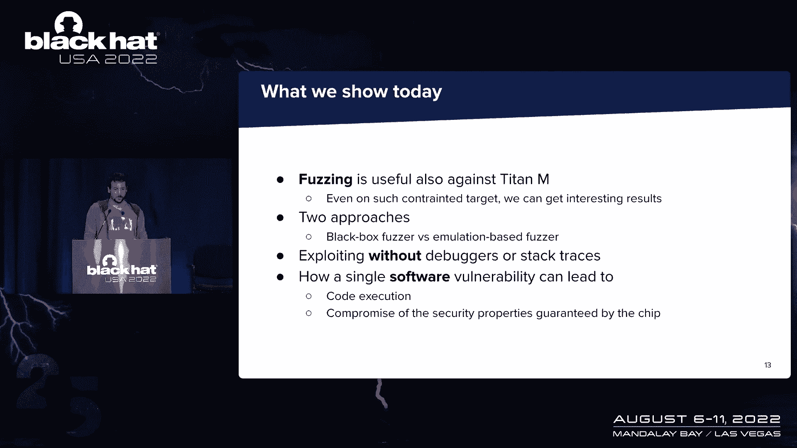
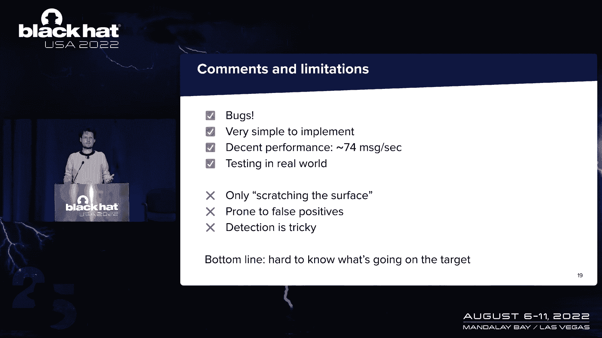
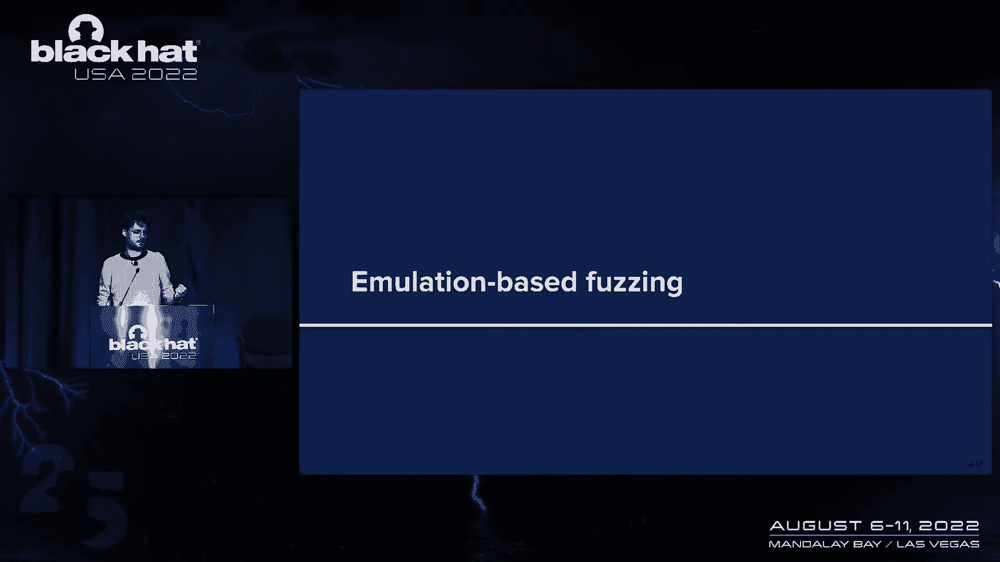
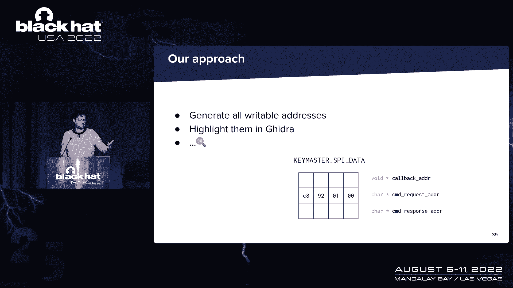
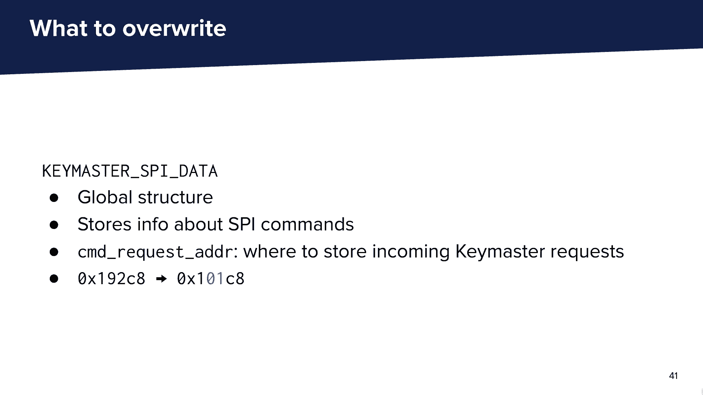
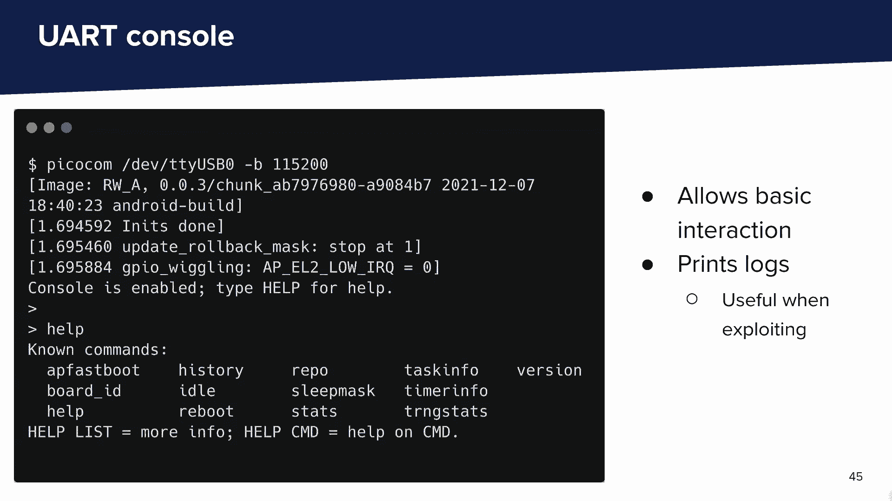
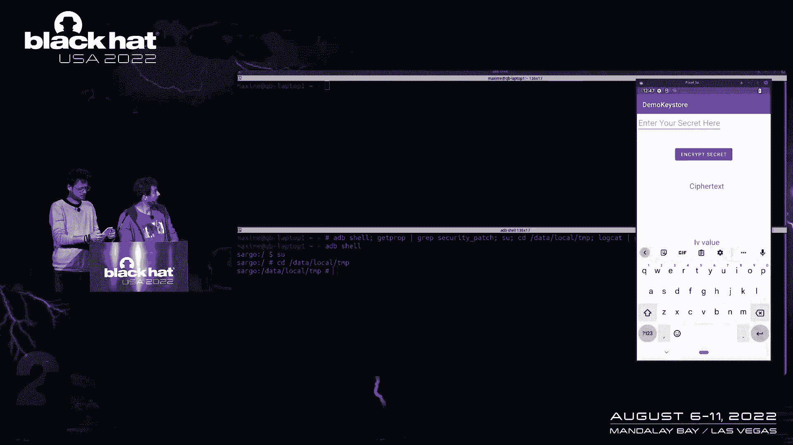

# 课程 P22：023 - 攻击泰坦 M 芯片重装上阵：现代安全芯片漏洞研究 🧠💻

在本课程中，我们将学习如何对谷歌 Pixel 设备中的硬件安全芯片——泰坦 M 芯片进行漏洞研究。我们将探讨其架构、通信方式，并详细介绍从固件逆向、模糊测试到发现并利用一个关键漏洞的全过程，最终演示如何泄露受其保护的密钥。

---

## 概述：泰坦 M 芯片与我们的研究动机 📱🔒

如今，智能手机供应商倾向于在设备中集成硬件安全模块。最关键的安全特性依赖于这个模块。这些模块具有加密功能和硬件级别的保护，能够抵御逆向工程或故障注入攻击。它们的设计细节通常只有芯片制造商或供应商知晓。

然而，对于安全研究人员而言，这些组件是整个设备安全的关键。这就是本次演讲的动机。我们将展示我们是如何对泰坦 M 芯片进行漏洞研究的。我们希望展示的内容对其他面临类似目标的研究人员有所帮助。

---

## 研究背景与目标 🎯

我们都是 Quarkslab 的安全研究员，在一个处理嵌入式设备的团队中工作。我们对移动设备目标也很感兴趣。今天我们要谈论的是泰坦 M 芯片。事实上，昨天有一场精彩的演讲，来自谷歌的团队，关于他们对泰坦 M 二代设备的红队测试。我们今天讨论的泰坦设备是老一代的，从 Pixel 3 到 Pixel 5 中都有使用。

在这个设备上，实现了智能手机的关键安全功能，包括安全启动、解锁功能（例如使用 PIN 码），以及 Keystore。Keystore 可能是我们今天最重要的一个功能，它允许 Android 应用程序在安全环境（即泰坦 M 芯片）中生成和使用密钥。每当这个功能依赖于安全芯片时，它被称为 StrongBox。

重要的是要记住，这个芯片与主 CPU（应用处理器）是分开的。你有一个运行在主系统上的应用程序，还有另一个芯片——泰坦 M。芯片通过硬件总线（如 SPI）进行通信，采用客户端-服务器模型。

根据谷歌的说法，这个芯片的推出是为了减轻广泛的侧信道攻击。泰坦 M 基于 ARM Cortex-M3 架构，这在微控制器中很常见。其固件基于一个名为 EC（嵌入式控制器）的开源操作系统，由谷歌设计，最初用于 Chrome OS 项目的各种微控制器。因此它非常简单和小巧，几乎没有动态分配，大多数代码都在运行一个任务。

我们感兴趣的两个硬件接口是：
*   用于与应用处理器通信的 SPI 总线。
*   用于日志和极简控制台的 UART。

---

## Android 与泰坦 M 的通信方式 🔄

在主 CPU 上，有一个内核驱动程序处理 SPI 通信，并将 I/O 接口暴露给一个硬件抽象层。一个名为 `gatekeeperd` 的守护进程与这个驱动程序通信。它的作用是将从服务接收到的各种消息分派给驱动程序。

每个安全功能都有一个对应的服务（例如一个给 Keystore，一个给 Gatekeeper）。这些服务将通用的 Android API 调用转换为定制化的命令。它们使用原始缓冲区和一个由谷歌设计的著名序列化框架——Protocol Buffers。幸运的是，protobuf 的定义可以在 AOSP 代码库中获得，这对我们开发各种工具非常方便。

---

## 第一阶段研究回顾：逆向与交互 🔍

这不是我们第一次谈论泰坦 M 芯片。去年，我们在这个芯片上进行了第一阶段的研究，可以归纳如下：

1.  **逆向固件**：我们分析了固件文件。
2.  **与芯片交互**：
    *   在 Android 层面，我们实现了一个 Frida 脚本来嗅探所有通信，通过挂钩 `gatekeeperd` 来查看应用程序发送的所有消息。
    *   我们还实现了自己的工具（称为客户端），用于向芯片发送自定义命令。所有工具都运行在用户空间。
    *   为了在硬件层面进行交互，我们通过精湛的焊接技术，将芯片的 64 个引脚引出到转接板上，然后将其重新安装回智能手机。这使我们能够从硬件层面与芯片交互。
3.  **发现并利用漏洞**：我们最重要的发现是一个允许我们刷写任意旧版固件的漏洞（副作用是擦除芯片上的所有数据）。利用此漏洞，我们能够降级到已知有漏洞的旧固件，并最终在芯片上执行代码，泄露包括引导 ROM 在内的固件隐藏部分。

---

## 模糊测试方法：黑盒与基于仿真 🧪

我们将讨论模糊测试及其对这个目标的有用性，尽管它受到很多限制。我们没有源代码，并且涉及大量硬件交互，但我们仍然可以得到有趣的结果。

我们将讨论两种方法：
1.  **黑盒模糊测试**：在这种情况下，我们根本不知道芯片内部发生了什么。
2.  **基于仿真的模糊测试**：在这种情况下，我们对内部情况有更多了解，但需要一些技巧来优化结果。

上一节我们回顾了初步研究，本节中我们来看看具体的漏洞挖掘技术。

### 黑盒模糊测试 📦

当我们对目标只有非常有限的可见性时，我们想测试我们所拥有的。我们需要的实际上只是向此目标发送消息的通道，以及一个告诉我们发生了什么的信号。

在我们的案例中，通道是我们开发的用于与芯片通信的自定义客户端。我们可以发送任意消息，在模糊测试工作流中对其进行变异，然后得到一个返回代码，它会告诉我们处理消息的结果。我们感兴趣的是那些返回代码大于或等于 2（内部错误）的情况，这通常意味着芯片崩溃了。

我们利用可用的 protobuf 语法生成变异的输入。我们从一个空的语料库开始，但尝试设置一些字段以通过某些检查，确保我们可以探索更多状态。当然，我们保留那些能产生有趣返回代码的输入。

我们在旧版本固件上进行了第一次活动，并发现了一些漏洞，其中一个是我们利用过的缓冲区溢出。这告诉我们这种方法是有效的。我们用当时最新的固件重复了同样的过程，发现了两个导致芯片崩溃的漏洞。有趣的是，所有这些结果都是在几分钟的模糊测试后产生的，表明这种方法有效且易于实施。

但同时，黑盒模糊测试有一个众所周知的限制：我们可能只是在锻炼目标的浅层状态，并且容易出现假阳性。我们实现的启发式检测相当复杂，只检测那些产生有意义返回代码的漏洞，但情况并非总是如此。

**核心难点在于：很难知道目标内部发生了什么。**

### 基于仿真的模糊测试 🖥️

因此，我们想尝试一种不同的方法：基于仿真的模糊测试。这是因为我们通过逆向工程知道了固件是如何工作的，并且我们知道如何泄露内存的某些部分（多亏了之前利用的固件回滚漏洞）。这样我们就可以在笔记本电脑上模拟固件，从而控制执行内容，并为模糊测试器提供良好的反馈（如覆盖率引导）。

要模拟固件，我们决定使用 Unicorn。Unicorn 是一个建立在 QEMU 之上的框架，它只允许模拟 CPU 而不关心整个系统的仿真，这正是我们想要的。我们可以轻松设置它，并对其进行调整以检测更多漏洞。

Unicorn 的一个非常有趣的特点是它与 AFL（一个流行的模糊测试器）集成得很好。AFL++ 有一个 Unicorn 模式，基本上可以让你模糊任何可以用 Unicorn 模拟的东西。你只需要注意将你的输入写入模拟脚本内存中的某个地方，然后你就会得到经典的 AFL 体验，包括使用自定义变异器。

基于仿真模糊测试的另一个好处是，你可以自由设置入口点、寄存器值和内存映射等属性。这给了我们很多自由，但同时，我们需要确保我们模拟的攻击面与实际攻击者能够触及的一致。

我们之前没有探索过的一个暴露攻击面是 **SPI 救援功能**。这个功能允许通过发送特定格式的新固件来刷写新固件，这是通过引导加载程序完成的，并且会擦除芯片上的用户数据。因为这是一个相当有趣的格式，我们想检查它是否被正确处理。

我们首先使用自定义变异器对这个特性进行模糊测试，使用了格式模糊器（一个允许根据特定格式生成和解析二进制文件的项目）。不幸的是，我们在这项活动中没有找到任何有趣的漏洞。但是，为这个特性构建仿真脚本让我们进入了逆向工程的下一个层次，发现了一些仅通过静态分析无法理解的东西（例如哈希中的零字节被替换为一字节）。

然后我们回到主要任务，重复同样的活动，但使用仿真。我们再次以 protobuf 为基础，使用变异器，主要专注于 `identity` 和 `keymaster` 任务。

第一个问题是：我们真的能找到我们所知道的相同漏洞吗？答案是肯定的，但除了一个。这揭示了这种方法的局限性：仿真总是存在你无法模拟的依赖代码。我们通过挂钩那些我们知道实际上不可能实现的功能来处理。检测仍然不完美，因为我们只有在 Unicorn 崩溃时才检测到漏洞，但如果发生越界写入或已映射页面内的损坏，我们真的无法察觉。此外，没有完整的系统仿真，你不会得到那些需要调度器等系统组件交互的漏洞，这就是我们没能再次找到那个特定漏洞的原因。

但这种方法的真正好处是你可以进行大量调整。你可以设计启发式和钩子来寻找你知道不应该发生的特定模式。例如，我们检查了是否从映射在地址零的引导 ROM 中读取，这是一些漏洞的模式。这在自定义钩子中是可能的。

但在某种程度上，在你逆向工程的深度、设计这些调整的多少以及最终让模糊测试运行的速度之间存在权衡。

---

## 关键漏洞剖析：`param_find_digest_internal` 🔓

现在，我们将展示我们发现的一个具体弱点。这是名为 `param_find_digest_internal` 的函数中的一个漏洞。

这是一个在请求中传递关键参数对象的函数。具体来说，这是一个单字节的写操作，正好写入一个字节。我最初遇到这个时，认为这可能是个小问题，无法利用。但让我们仔细分析。

以下是易受攻击的指令：`strb`（存储字节指令）。但是在这个操作之前有很多检查。我们从一个 32 位值开始，但只关心最低有效字节，因为应用了掩码。这个字节需要小于或等于 4，所以范围缩小了。然后是一个有点复杂的位操作。综合来看，最低有效字节只能是 0、2 或 4（255 个可能值中的 3 个）。

那么我们能做什么呢？实际上，有多种方法可以触发这段代码。它是一个在不同消息中处理这种类型字段的函数。别忘了泰坦 M 有静态内存布局，对象总是在同一位置。所以如果我们能在正确的位置写一个字节，我们也许能得到一些有趣的东西，从简单的拒绝服务到改变某些字段，再到在其他地方造成破坏。

我们可以做很多事情。我们所做的是生成所有我们能写入的可能地址，然后尝试逐个检查，看看我们能利用它们做什么。最终我们发现内存中有一种我们称之为 `keymaster_task_data` 的结构。

我们可以覆盖该结构中的一个字节，我们称之为 `request_addr`（命令请求地址）。这个字段表示密钥主消息最终将被存储的地址。通过覆盖这个字节，我们可以使请求被存储在远离它们应该存储的地方。

这是有趣部分的开始。

---

## 利用开发与调试挑战 🛠️

但首先，不要忘记，我们与泰坦 M 芯片通信的唯一方式是通过我们的自定义客户端。我们所能做的就是按照我们喜欢的方式构造消息并通过二进制文件发送，然后得到一个返回代码（也许是代码 2，如果芯片崩溃），但信息不多。你可以想象，开发和调试一个漏洞利用是一个相当大的挑战。

但是，我们一直藏着一张王牌：Max 简短提到了我们可以访问 UART。这要归功于主板上暴露的两个引脚。我们在这些引脚上焊接了两根电线，最终得到了这个 UART 控制台。它其实很简单，除了要求芯片提供版本和统计信息之外，你什么也做不了。但它是固件日志打印的地方。

因此，尽管这并没有提供任何关于哪里出了问题的详细信息，但在编写漏洞利用时非常有用，因为我们总是可以尝试触发一些日志，看看能否在 UART 上看到它们。

---

## 漏洞利用与影响：泄露 StrongBox 密钥 🗝️

我们不会详细说明泰坦 M 芯片的完整内存布局。我们只想将我们的请求写入新的地址，基本上看看会发生什么。所以我们发送越来越大的有效载荷，同时监控 UART。在某个时候，我们意识到芯片开始崩溃。如果我们实际上在特定点放置一个记录任务的函数指针呢？就在这一点上，芯片开始崩溃，我们在 UART 上得到了日志，告诉我们正在触发一个函数，我们正在执行代码。

发生了什么事？这可能是我们的“gadget”，至少，这是一个由某个任务推入堆栈的地址，可能是在执行后必须返回的地址。

从现在开始，事情变得非常复杂。我们需要转移到其他地方，因为我们不能在那里写任何 ROP 链，它相当笨重。我们实际上发布了一篇博客文章，详细介绍了此漏洞的利用细节。

现在让我们看看这个漏洞的影响，不仅对芯片本身，而且对整个系统安全。对我们来说，最好的事情是找到一个既可写又可执行的内存区域，这样我们就可以写代码了。但没有这样的区域。那么，我们可以尝试的另一件事是通过玩一种叫做内存保护单元的东西来重新配置内存和权限。但在泰坦 M 上，这个 MPU 有一个自定义接口，我们没有花足够的时间来逆向它。

所以我们能做的就是重用固件中已经存在的代码，构建一个 ROP 链。我们在自定义客户端工具中再次实现了一个漏洞利用，这次是根据我们刚才介绍的零日漏洞。因为我们没有降级固件，这次数据没有被擦除，这意味着我们可以泄露芯片内存中的所有秘密。

我们泄露了位于地址零的前 16 个字节（引导 ROM）。但是我们能对这个漏洞做一些在设备上更有害的事情吗？我们能泄露 StrongBox 密钥吗？

在我回答这个问题之前，让我们先来看看什么是 StrongBox。它是 Keystore 的硬件支持版本，允许应用程序在安全环境（即泰坦 M 芯片）中生成和使用密钥。但是泰坦 M 并不存储任何密钥本身。密钥存储在称为密钥块的对象中，在泰坦 M 内部使用一个密钥加密密钥进行加密。这个密钥是由几个内部元素生成的。然后这些密钥块被加密并存储在 Android 文件系统中。

因此，每当应用程序想要使用 StrongBox 中的密钥时，系统将密钥块发送到芯片，芯片会解密密钥块并使用密钥执行操作。有趣的是，只要用户拥有 root 权限，就可以访问 Android 文件系统中的所有密钥块，因此它可以使用任何密钥，但它应该永远无法提取密钥本身。

我们感兴趣的是泄露用于派生此密钥加密密钥的几个内部元素。但简而言之，有一个元素存储在无法从操作系统读取的内存区域中，所以这不是攻击 StrongBox 的方法。取而代之的是，让我们看看实际使用这些密钥块并执行加密操作的命令。

初始命令 `UNWRAP_KEY` 包含了密钥块和密钥的特征（算法、密钥大小等信息）。每当芯片收到它，它会解密密钥块，然后将解密的数据（即原始密钥）保存在固定地址的某个地方以便以后使用。另外两个命令 `BEGIN_OPERATION` 和 `UPDATE_OPERATION` 允许系统和芯片对其中包含的数据执行操作。

所以我们的策略很简单：
1.  首先，我们获取设备中的密钥块（它们存储在 `/data/misc/keystore/` 目录下的数据库中）。
2.  然后我们伪造一个 `UNWRAP_KEY` 操作请求，将其发送到芯片，芯片会解密密钥块。
3.  接着，我们利用漏洞从芯片内存中泄露这个已解密的密钥。

---

## 现场演示 🎬

以下是演示步骤：
1.  一个演示应用程序在 Pixel 3 设备上运行。当在应用程序中输入一个秘密时，应用程序将生成一个 StrongBox 密钥，并用它加密该秘密，打印出密文和 IV。
2.  使用我们的漏洞利用工具。首先，需要停止 `gatekeeperd` 守护进程，因为它会锁定与驱动程序的通信。
3.  使用我们实现的 `leak_kb` 命令列出可用的密钥块。我们看到只有一个，对应于我们的演示应用程序。
4.  使用漏洞泄露命令获取解密后的 AES 密钥字节。
5.  将泄露的密钥和 IV 转换为 OpenSSL 接受的格式，并使用 OpenSSL 解密最初的密文，成功恢复出原始秘密。

---

## 攻击前提与缓解措施 🛡️

在实施这次攻击之前，有几个条件必须满足：
1.  需要能够与芯片通信。在我们的案例中，我们 rooted 了设备。在现实生活中，你需要其他能力才能到达这一步。另一种尝试是直接在硬件层面上通过 SPI 总线与芯片交互。
2.  需要访问密钥块数据库。你需要有足够的权限来读取数据库，或者找到一种方法来绕过基于文件的加密。

这只是为了强调，在现实生活中利用此漏洞之前必须遵循的几个额外步骤。

关于缓解措施：
*   在实现应用程序时，每当声明使用 StrongBox 密钥时，可以添加一个参数 `userAuthenticationRequired`。当设置为 `true` 时，密钥块将使用从用户密码派生的值进行二次加密。每当应用程序尝试使用此密钥块时，用户将被要求输入密码。
*   当然，最好的缓解措施是更新固件。在我们向谷歌报告了这个漏洞后，他们已经发布了修复。

---

## 总结与要点 📝

在本节课中，我们一起学习了：
1.  **泰坦 M 是一个有趣且重要的目标**，因为它对整个系统的安全至关重要。
2.  **模糊测试的有效性**：我们证明了使用黑盒模糊测试可以相对容易地发现表面漏洞，但基于仿真的模糊测试对此类目标更有效，即使需要一些技巧来优化结果。
3.  **关键零日漏洞**：我们发现并提出了一个关键的零日漏洞，它允许我们在芯片上执行代码，并从芯片内存中泄露几乎任何数据。
4.  **漏洞影响**：我们利用这个漏洞足以泄露设备上安装的任何 StrongBox 密钥。
5.  **负责任披露**：我们要感谢谷歌和 Android 安全团队在漏洞报告和处理方面的努力，他们修复了漏洞，使我们能够在今天进行披露。

本次演讲的所有材料将发布在我们的 GitHub 存储库中。