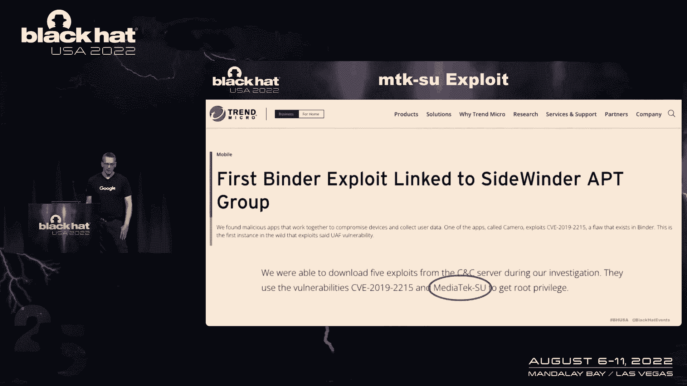
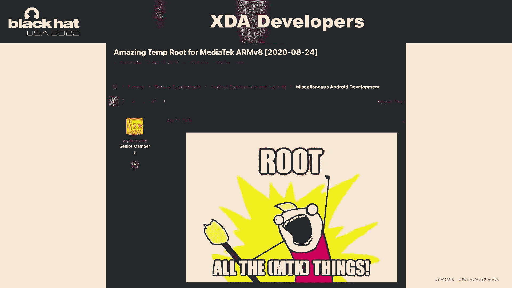
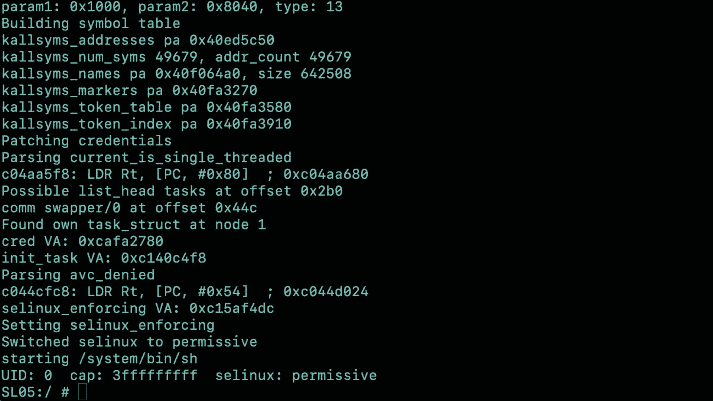
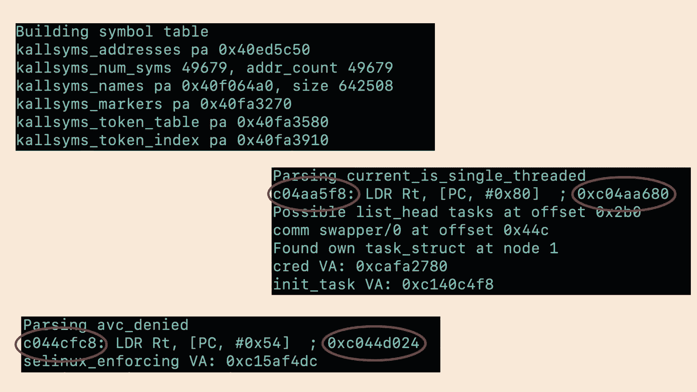
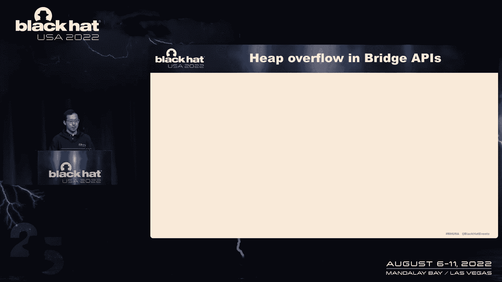
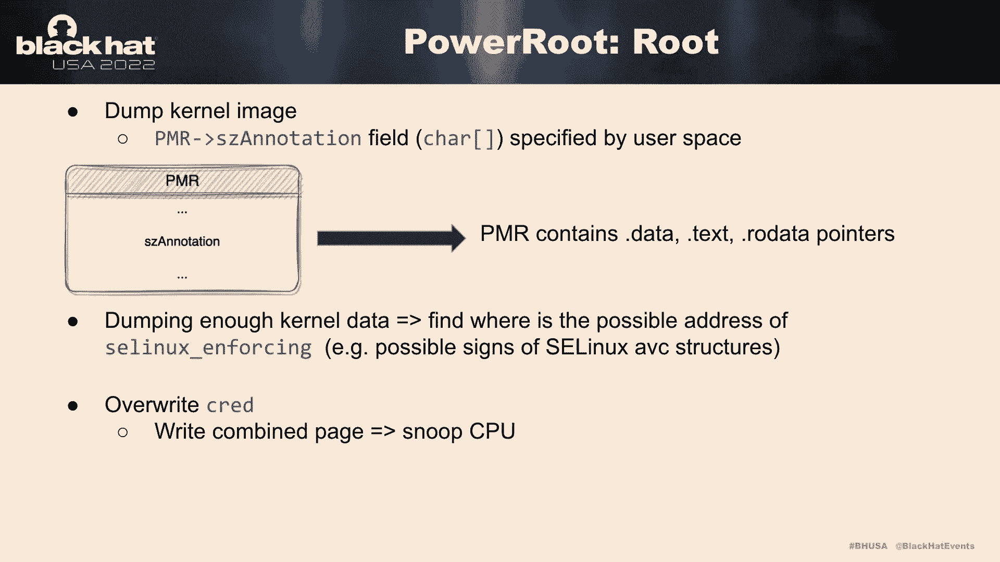
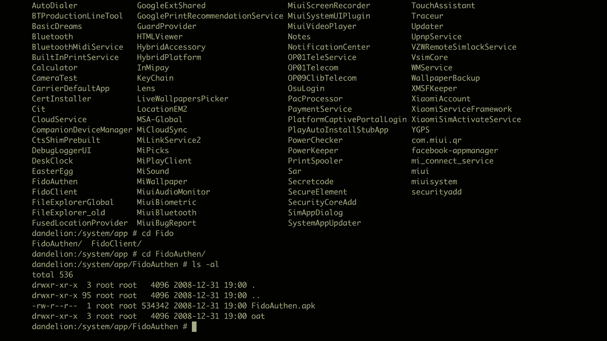
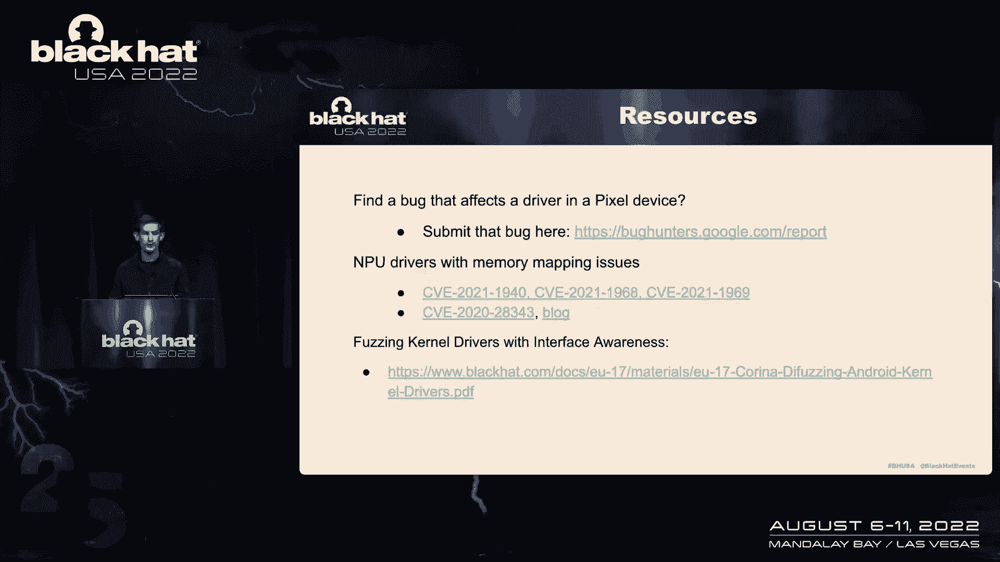

# 课程 P23：024 - Android 通用 Root：利用移动 GPU / 命令队列驱动程序 🚀


在本节课中，我们将学习一个关于 Android 设备获取 Root 权限的现代漏洞利用案例。我们将从一个在野外被利用的漏洞（MTKSU）开始，深入分析其原理，然后探讨针对 GPU 驱动程序（特别是 Imagination PowerVR）的内部研究发现，最后介绍 Google 的 Android 合作伙伴漏洞倡议（API）如何协调此类漏洞的修复与披露。

---

## 概述 📖

本次课程将分为三个主要部分。首先，我们将分析一个名为 MTKSU 的真实世界 Android Root 漏洞利用，了解其如何通过内核驱动程序的漏洞实现通用性。接着，我们将深入研究在 Imagination PowerVR GPU 驱动程序中发现的多个安全漏洞，这些漏洞同样可导致 Root 权限获取。最后，我们将介绍 Google 的 Android 合作伙伴漏洞倡议（API）在处理此类跨厂商漏洞中的作用。



---



## 第一部分：MTKSU - 一个现代 Root 漏洞利用案例



上一节我们概述了课程内容，本节中我们来看看一个在真实攻击中被使用的漏洞利用——MTKSU。

MTKSU 是一个针对联发科（MediaTek）芯片组 Android 设备的 Root 工具。它利用了内核驱动程序中的一个漏洞，允许用户模式程序创建可读写内核内存的映射。这与多年前的 “Framaroot” 漏洞家族类似，但实现方式更为复杂。




该漏洞最初由趋势科技在一篇关于 Android 恶意软件的博文中提及。博文主要分析了另一个漏洞（CVE-2019-2215，又名 “Bad Binder”），但在文章深处也提到了 MTKSU 使用的第二个漏洞。趋势科技将该恶意软件归因于一个高级持续性威胁（APT）组织。


MTKSU 最初支持亚马逊 Fire HD 设备，随后很快发布了支持更广泛硬件的第二个版本。至今仍有用户在测试其兼容性。

以下是 MTKSU 利用过程中的三个关键步骤：

1.  **通过内核符号表解析地址**：利用程序首先通过内核符号表获取关键函数的名称和地址。
2.  **扫描代码以定位关键数据**：通过寻找访问特定变量的指令模式，漏洞利用可以动态计算出所需数据结构的地址和偏移量，而无需硬编码。
3.  **利用驱动程序 `ioctl` 接口**：通过打开特定的设备节点（如 `/dev/ged`），并利用其 `ioctl` 写功能，将操作码缓冲区从用户空间发送到内核，从而执行恶意操作。

这种动态查找的方法使得漏洞利用具有很高的可移植性，能够适应不同设备、内核版本和 OEM 定制，避免了维护庞大硬编码地址列表的负担。


在二进制文件中，关键的字符串（如设备节点路径）被混淆处理。通过修改过的 DJB2 哈希算法进行查找和去混淆后，才能传递给系统调用。

该漏洞的初始修复方案相对简单：修改 SELinux 策略，阻止普通应用访问相关设备节点或调用 `ioctl`。然而，这可能会影响某些需要该驱动功能的预装应用。更彻底的解决方案包括实现进程外服务或仅暴露必要的特定功能，但这可能带来性能开销。

与早期的 “Framaroot” 系列漏洞相比，MTKSU 更复杂，但最终目标相同：获取内核内存的读写能力。



---

## 第二部分：深入研究 GPU 驱动程序漏洞

上一节我们分析了 MTKSU 如何利用驱动漏洞，本节我们将目光转向另一类复杂的驱动程序——GPU 驱动程序，特别是 Imagination PowerVR 的驱动。

GPU 驱动程序非常复杂，且对性能要求极高。它们需要在用户模式和内核（或 GPU）之间映射大量内存。这使得它们成为潜在的安全研究目标。我们选择研究 Imagination PowerVR 驱动，因为其广泛应用于多种 Android 设备，但公开的安全报告却相对较少。

### 桥接 API 的工作原理

PowerVR 驱动程序通过所谓的“桥接 API”向用户空间导出数百个内核接口。用户空间程序通过指定**组 ID**、**函数 ID** 和输入数据来调用这些 API。驱动程序根据 ID 调用相应的内部函数并返回结果。

桥接 API 的处理流程可分为三步，每一步都可能存在缺陷：

1.  **创建内核缓冲区并复制用户输入**。
2.  **调用内部内核函数**。
3.  **将结果复制回用户空间**。

#### 步骤一：整数溢出与边界检查缺失

计算所需缓冲区大小时，代码可能发生整数溢出。虽然驱动程序有许多健全性检查，但它们通常只检查大小是否大于零，这可能导致分配不足的缓冲区。

```c
// 伪代码示例：可能存在整数溢出的缓冲区大小计算
size = user_input_size * element_size; // 可能溢出
if (size > 0) { // 检查不充分
    buffer = kmalloc(size);
}
```

幸运的是，有时整数溢出会被后续的 `memcpy` 操作中的另一个溢出所抵消，从而可能没有直接的安全影响，但这仍然是错误的编码实践。

#### 步骤二：引用计数与释放后使用（UAF）

许多桥接 API 涉及内核对象的创建（`PVRSRVBridgeCreate`）、使用和释放（`PVRSRVBridgeDestroy`）。对象通过引用计数管理。

考虑以下竞争条件场景：
*   线程 A 增加引用计数（从 0 到 1）。
*   线程 B 读取引用计数为 1，并开始执行某些操作。
*   线程 C（恶意）将引用计数从 1 减到 0，导致对象被释放。
*   此时线程 A 或 B 尝试访问已释放的对象，引发 UAF。

由于每个桥接 API 都使用相同的同步机制，这种竞争条件可能影响数十个 API。

#### 步骤三：未初始化数据泄露

驱动程序在初始化对象后，将数据复制回用户空间。如果初始化函数提前失败，对象可能处于未初始化状态，从而导致内核指针或其他敏感数据泄露。

### 内存管理漏洞

GPU 内存管理涉及 CPU 虚拟内存、GPU 虚拟内存和物理内存之间的映射。一个核心概念是 **PMR**。

**PMR** 代表物理内存资源。用户程序可以“保留”一块物理内存并获得一个 PMR 句柄，用于后续的 GPU 或 CPU 虚拟内存分配。

#### 漏洞：绕过映射检查

驱动程序有一个安全检查（`PVRSRVBridgeUnpinMem`），旨在防止释放仍被映射的物理内存。逻辑如下：
1.  如果物理页的引用计数 > 1（即还有其他映射），则不允许解除固定（unpin）。
2.  然而，存在一个逻辑错误可以绕过此检查：
    *   先创建 PMR 句柄（此时无映射，引用计数为默认值）。
    *   然后立即解除固定（unpin）该内存。此时没有映射，所以操作成功，页面被放入全局“稍后释放”列表。
    *   接着，再调用映射（map）操作，为这些即将被释放的物理页创建虚拟映射。
    *   最终结果是：虚拟页面映射到了即将通过内核收缩器（shrinker）释放的物理页上，形成了释放后使用（UAF）条件。

通过反复进行此操作，可以制造内存压力，触发内核释放这些页面，从而获得稳定的 UAF 原语。这个漏洞（CVE-2021-3985）允许用户空间程序读写已释放的物理页面，堪称“通用 Root”漏洞。

#### 漏洞：绕过用户空间库限制

在某些高版本 Android 上，SELinux 策略可能禁止应用直接映射 GPU 设备。然而，用户空间的供应商库（实现 OpenGL ES 等 API）在实现上可能存在更宽松的检查。

研究发现，通过父子进程配合（使用 `fork` 和 `ptrace`），可以让父进程拦截子进程创建 PMR 的调用并篡改参数，然后子进程再通过供应商库映射 GPU 驱动，从而绕过内核层的访问限制。

### 利用链演示

利用上述内存管理漏洞，可以构建一个强大的利用链：
1.  **信息泄露**：通过未初始化的对象或可控的注释字段，泄露内核镜像和 SELinux 策略的地址。
2.  **权限提升**：通过 UAF 篡改内核数据结构（如 `cred` 结构体），将进程的 UID 改为 0。
3.  **关闭 SELinux**：找到内核中 SELinux 强制状态的变量地址并将其设置为禁用。

该利用非常稳定，因为它不依赖于堆布局（heap shaping）或特定内核版本（kASLR），而是直接搜索和操作物理内存。




视频演示了在一款流行设备上利用此漏洞获取 Root 权限的过程。


---

## 第三部分：Android 合作伙伴漏洞倡议（API）

上一节我们深入探讨了 PowerVR 驱动中的复杂漏洞，本节我们来看看 Google 如何通过 Android 合作伙伴漏洞倡议（API）来协调此类漏洞的修复与披露。

API 是 Google 为使 Android 生态系统更安全而建立的广泛努力的一部分。当 Google 员工发现影响第三方 OEM 的漏洞时，可通过 API 报告。




其工作流程如下：
1.  **报告与复现**：将漏洞报告给 API 团队，并复现问题。
2.  **识别影响范围**：识别所有受影响的合作伙伴设备构建版本。
3.  **协调披露**：向受影响的 OEM 合作伙伴（如 Imagination Technologies）和下游设备制造商披露问题。
4.  **补丁与公开**：协助提供补丁，并在补丁可用后，在公开的问题跟踪器上发布安全公告。

对于 PowerVR 漏洞，过程更为复杂，因为需要协调驱动 IP 提供商（Imagination Technologies）和众多使用该驱动的设备制造商。

Imagination Technologies 已表示将继续参与类似 API 的计划，以提升整个行业的安全性。

---

## 总结与要点 🎯

本节课我们一起学习了 Android Root 漏洞利用的现代案例。


**对于驱动程序开发者的启示**：
1.  **严格净化用户输入**：特别注意有符号/无符号整数转换、溢出和边界检查。
2.  **遵循最小权限原则**：仅向用户空间暴露必需的功能，并施加严格的访问控制（如 SELinux）。
3.  **加强开发生命周期安全**：融入模糊测试、代码审计和安全编码规范。

**对于安全研究人员的启示**：
1.  **关注内存映射**：在涉及多个处理单元（CPU、GPU 等）的复杂驱动中，内存映射和可见性问题是反复出现的高危区域。
2.  **使用接口感知模糊测试**：针对 `ioctl` 等接口进行模糊测试是发现驱动漏洞的有效方法。可以参考相关研究（见资源列表）。
3.  **负责任的披露**：发现漏洞后，可以通过 **Android Bug Bounty 程序** 或 **Android 合作伙伴漏洞倡议（API）** 进行报告。

通过本课程的分析，我们可以看到，尽管 Android 安全性不断提升，但复杂的硬件驱动仍然是潜在的攻击面。持续的代码审查、测试和协调的漏洞披露机制对于维护生态系统安全至关重要。

---

## 资源与延伸阅读 📚



*   Android 合作伙伴漏洞倡议（API）公开披露追踪器：`https://source.android.com/docs/security/bulletin/archive`
*   《Fuzzing the Kernel in New Ways: An Interface Aware Fuzzer for Kernel Drivers》- Black Hat USA 2020 演讲（涉及 MediaTek CMDQ 驱动漏洞发现）
*   Android Bug Bounty 程序：`https://bughunters.google.com`
*   Imagination Technologies 安全响应页面