# 课程 P25：026 - 你能追踪我吗？：绕过 Linux 系统调用追踪 🕵️♂️

在本节课中，我们将学习 Linux 系统调用追踪的工作原理，探讨其存在的漏洞，并了解攻击者如何利用这些漏洞来绕过安全监控。我们还将讨论相应的缓解措施。

## 概述 📖

想象一个熟练的攻击者入侵了您的 Linux 生产环境。他启动了一个 shell 漏洞利用程序，执行了一个反向 shell 连接到他的机器。接着，他发现机器上运行着一个易受攻击的程序版本，并尝试读取 `/etc/shadow` 文件以寻找可破解的信息。他还发现可以通过读取 SSH 环境变量移动到另一台机器。当他庆祝成功时，却发现自己的访问权限消失了。他再次尝试，但很快发现资产被锁定。

现在，让我们看看监控软件的另一面。这些软件监视器会处理机器上发生的所有系统调用信息。例如，当执行反向 shell 时，会有 `connect` 和 `execve` 等系统调用。当攻击者试图读取 `/etc/shadow` 文件时，会有 `open` 或 `openat` 系统调用。

问题在于，如何利用这种可见性来执行威胁检测？我们可以用一个简单的检测规则来说明这个想法。

这条规则是：检测正在读取影子文件的不可信程序。具体来说，如果系统调用是 `open` 或 `openat`，其文件名参数指向影子文件，并且该程序不在允许的程序列表中，我们就发出警报。

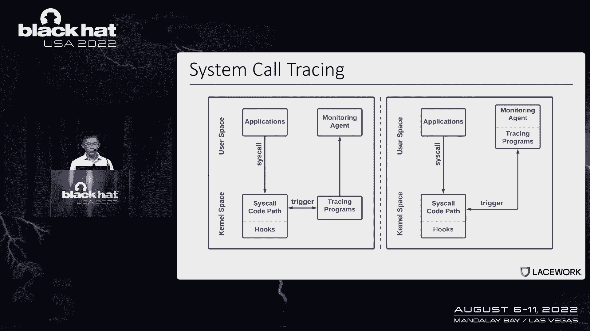

可以看到，我们可以快速构建非常复杂的规则，甚至可以使用多个系统调用。但所有这些逻辑都依赖于一个事实：被称为追踪软件的系统能够正确地提取数据。

在本次讨论中，我们将深入研究系统调用追踪的工作原理，探讨追踪软件中的漏洞，了解如何利用这些漏洞，最后以缓解措施和要点总结结束。

## 系统调用追踪的工作原理 🔧

正如前面提到的，追踪对于威胁检测非常重要。下图提供了系统调用追踪的概述，包括拦截钩子和追踪程序。

当应用程序发出系统调用时，内核会执行系统调用处理程序。如果处理程序中有任何地方附加了追踪程序，该程序将被触发以收集信息，并将这些数据发送到监视器代理以进行威胁检测。

追踪程序可以在内核空间中实现（如左图所示），或作为监视器代理的一部分在用户空间程序中实现（如右图所示）。

用来收集系统调用参数等数据的程序被称为追踪程序。这个程序可以附加到不同的钩子上，比如跟踪点、Kprobes 或 ptrace。

您可以直接使用 Linux 原生机制作为追踪程序，或者实现自己的追踪程序作为内核模块、eBPF 程序或用户空间程序。

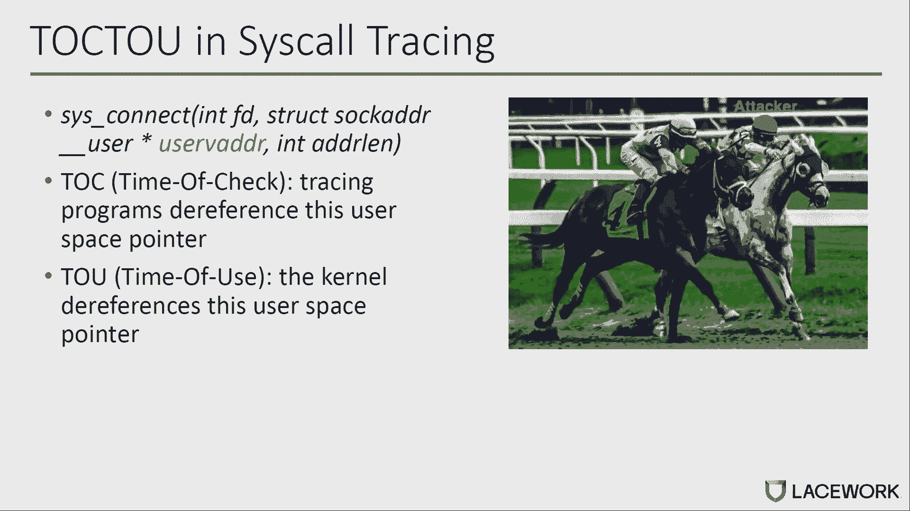

第一种用于物理拦截的钩子被称为跟踪点。它是内核中用于系统调用拦截的静态钩子。Linux 内核为每个系统调用提供进入和退出两个钩子。如果把追踪程序连接到跟踪点上，就可以在函数调用进入和退出时触发追踪程序。第一个参数是 `regs`，它包含了系统调用的参数；第二个参数是 `id`，也就是系统调用号。跟踪点不提供开销，但它只提供静态的系统调用拦截。

您也可以使用动态钩子，比如 Kprobes。您可以根据系统调用处理程序中的几乎任何指令注册追踪程序。当指令执行时，追踪程序会触发。Kprobes 是动态方法，但与跟踪点相比有点慢。而且，您需要确切地知道数据是如何存储在内存和寄存器中的，才能获得有用的信息（如参数）。

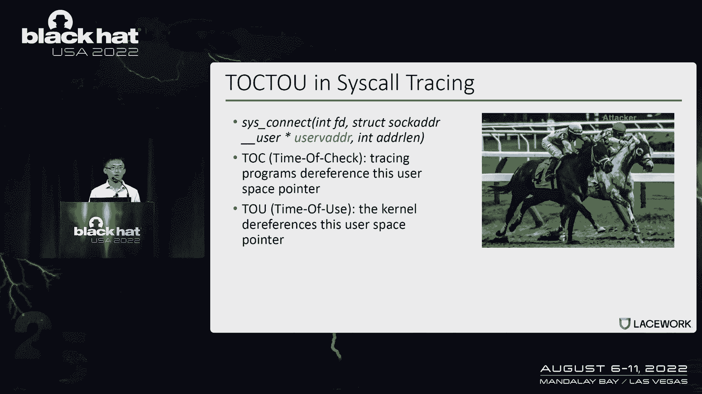

Ptrace 为系统调用追踪提供了一个用户空间解决方案。类似于跟踪点，它在系统调用进入和退出时有稳定的钩子。使用 ptrace，您不需要实现任何内核程序作为追踪程序，只需要用户空间程序。与前两种方法相比，ptrace 在优化时性能开销更高。您可以结合 seccomp 过滤以获得更好的性能，但是如果我们使用汇编代码来发出调用，这种方法很容易被绕过。

## 云工作负载中的追踪应用 ☁️

许多人可能听说过云工作负载保护产品，它们通常提供基于系统调用追踪的高级威胁检测。

有不同种类的云工作负载，像虚拟机、容器和无服务器。对于客户管理的虚拟机，您可以完全访问主机，所以可以使用任何类型的追踪程序。对于容器，您可以使用 eBPF 内核模块和 ptrace。对于无服务器容器或客户管理的虚拟机，只要我们有足够的能力，就可以拥有与虚拟机相同的选项。对于无服务器工作负载，我们没有主机访问权限，所以只能用 ptrace 作为钩点，并在用户空间实施追踪程序，而不是用 eBPF 和内核模块。

Falco 使用了类似的技术来追踪系统调用，它是 CNCF 中的开源项目，在内核空间中得到了广泛的应用，在用户空间中使用跟踪点支持内核模块和 eBPF 程序。Pdig 是在 Ptrace 技术的基础上开发的，被委托用于无服务器工作负载的系统调用追踪。

我们没有入侵其他安全监视器代理，但我们相信 Falco 的流行代表了一个被社区广泛接受的方案。不幸的是，这种方案存在一个普遍的问题。

## 追踪中的普遍问题：检查时间与使用时间差 ⏳

让我们以 `connect` 系统调用为例。`connect` 系统调用的第二个参数是一个名为 `uservaddr` 的用户空间指针，指向用户空间中的套接字地址结构。

在我们检查追踪程序的时候，它确实引用了这个用户空间指针来获取套接字地址。而在内核使用期间，内核确实引用了相同的用户空间指针来再次获取套接字地址。

然而，在“检查时间”与“使用时间”之间，用户指针所指向的用户空间内存容易被攻击者从用户空间更改。所以在这种情况下，套接字地址可以在不同的时间点（检查和使用）之间不同，从而引发问题。

让我们进入 `connect` 系统调用的细节，以帮助理解系统调用追踪的普遍问题。

当应用程序发出 `connect` 调用进入内核时，系统调用处理程序会检查是否有任何追踪程序附加到称为“进入”的静态钩子上（如 ptrace 和跟踪点）。如果是，追踪程序就会被触发。之后，系统调用处理程序将查找系统调用表，并跳转到 `connect` 调用以在套接字上创建连接。在返回到用户空间之前，处理程序将再次检查是否有追踪程序连接到称为“退出”的钩子上（如 ptrace、跟踪点退出等）。如果是，追踪程序就会被触发。

正如前面提到的，`connect` 系统调用的第二个参数是 `uservaddr`，指向用户空间中的套接字地址指针。此指针通过 `connect` 系统调用传递，并分配给不同的内核变量（用红色突出显示）。内核将套接字地址从用户空间复制到内核缓冲区。然后，内核将调用内部函数 `__sys_connect_file` 在套接字上创建连接，基于内核缓冲区。这是 Linux 内核使用系统调用参数的时候。

在内存复制功能之前，内核缓冲区尚未创建。因此，在系统调用进入时，或在内存复制功能之前的任何地方，使用 Kprobes 的追踪程序需要取消对用户指针的引用，或读取用户空间内存目录以获取套接字地址。正如前面提到的，用户内存容易受到来自用户空间的攻击者更改。在内存复制功能之后，内核缓冲区是用套接字地址的一个副本创建的。

不幸的是，普遍问题可能仍然存在。想想，如果我们将追踪程序附加到称为“退出”的静态钩子上（如跟踪点退出或 ptrace），追踪程序可能仍然会引用用户指针来再次获取套接字地址。用户内存仍然容易受到来自用户空间的攻击者的攻击。

Falco 和 Pdig 对系统调用的进入和退出使用 ptrace，但只使用了跟踪点退出。所以希望你对系统调用追踪的普遍问题有所了解。

在下一部分中，我们将讨论漏洞利用。

## 漏洞利用 💣

虽然我们使用的例子是在内核 5.7，但自从 ptrace 和跟踪点被引入以来，这个问题就一直存在。我们实际上与内核开发人员确认了这是预期的行为，因为这些特性最初是为性能和调试而设计的。在缓解方面，他们推荐的是，为了这种安全目的，软件需要实际监视内核内存。这听起来很简单，但实际实现时非常复杂。当我们谈论缓解时，我们会讨论这一点。

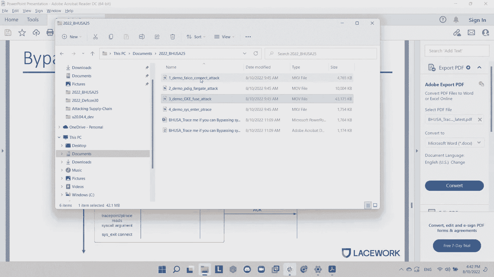

我们向 Falco 报告了这个问题。他们软件中的主要内容是他们必须通过 ptrace 来获取系统调用退出参数，因为他们用了跟踪点退出。Pdig 也用了 ptrace 退出。所以这将影响比 0.33.1 更老的 Falco 版本。如果您用的是商业版本，您可能想检查受影响的版本。我们在 12 月报告这一期，3 月份有所缓解。

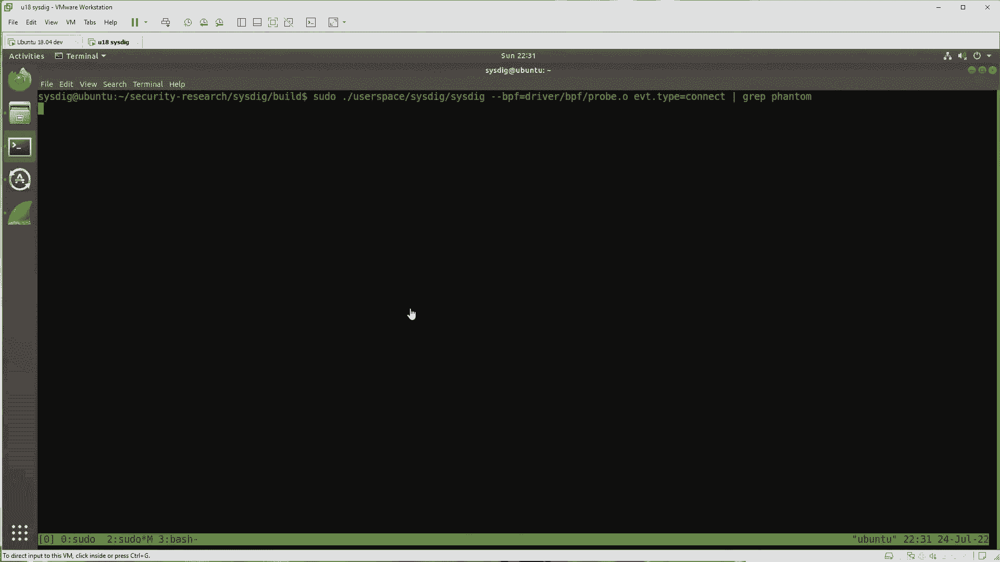

部署的缓解措施是：他们会比较跟踪点进入和退出的数据，如果有什么变化，那个事件将表明篡改企图。他们还为 ptrace 作为进入部署了相同的缓解措施，也是 ptrace 作为退出。

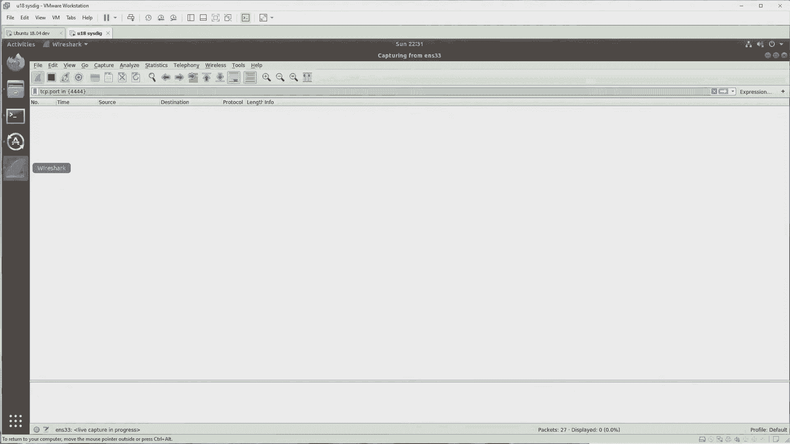

现在，什么样的系统调用实际上受到影响？我们分析了开源 Falco 规则中的重要系统调用，他们中的大多数人都受到了影响。此表中有两个例外：一个是 `execve` 系统调用，原因是当 Falco 追踪 `execve` 时，它们实际上进入并读取内核数据，所以他们没有完全依靠 ptrace 的结果。第二个是 `sendto` 和 `sendmsg` 系统调用。后来，我们将讨论如何使用阻塞条件来利用系统调用退出。但是在 `sendto` 和 `sendmsg` 中，我们没有找到影响阻塞状况的可靠方法。但也要记住，这两个系统调用的开销通常很高，这限制了它们的采用。

好的，所以我认为漏洞，希望每个人都能意识到现在的弱点是什么。让我们讨论如何实际利用漏洞。我们也不想获得任何额外的能力，在旁路中，我们需要有一定程度的控制。我们希望开发是百分之百可靠的，因为在这个游戏中，如果攻击者被检测到一次，那么整个行动就有潜在的风险。

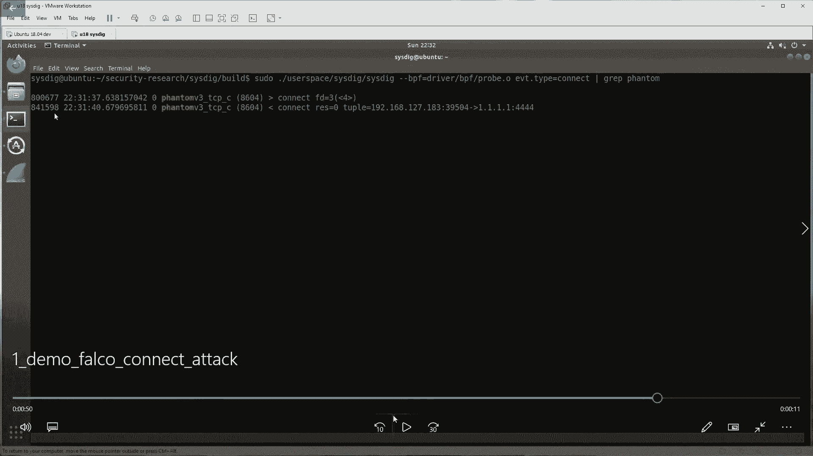

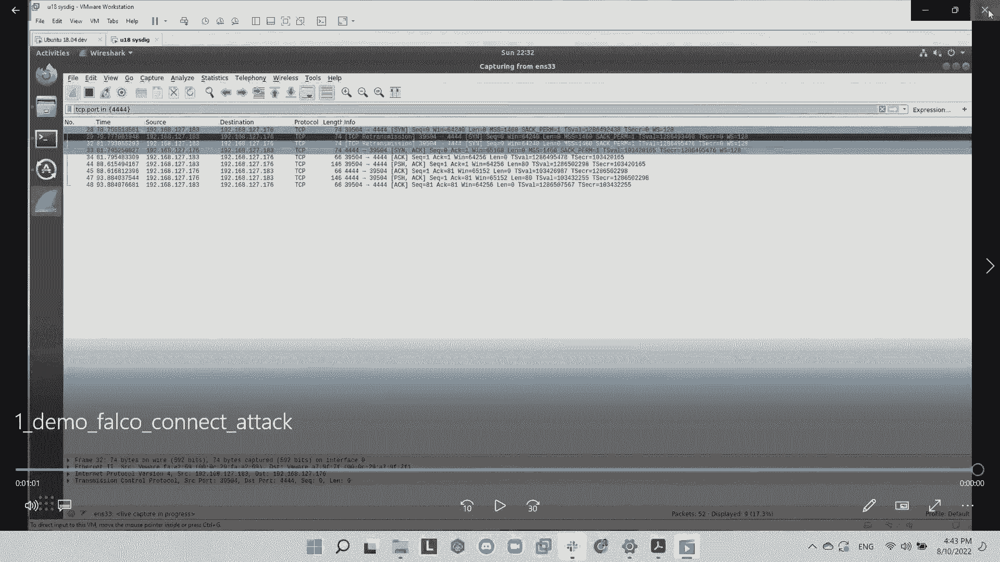

这给我们带来了两种开发策略。我们首先谈谈退出策略，这是我们在去年的 DEF CON 做的研究。从那里你可以看到，跨核中断，但是为了利用这个延迟正确地管理旁路，一切都必须精确同步。我们必须注入精确的时间，然后我们必须同步所有的数据操作。所以我们需要使用一个叫做 `futex` 的系统调用。使用此系统调用有一些限制：第一个是如果你使用的是 Docker 容器并且你启用了默认的 seccomp 配置文件，那么 seccomp 配置文件实际上将阻止该系统调用，所以这在容器里不起作用。另一个限制是，大多数云工作负载都不使用 `futex`，所以这个系统调用的使用表明有异常。这实际上是 Falco 去年部署的缓解措施：他们检测 `futex` 系统调用的使用情况。

去年我们回去了，我们想，我们如何克服这个限制？为了做到这一点，基本上意味着当我们注入延迟时，我们不能精确地同步。但如果我们能注入一个非常非常长的延迟呢？那么我们就完全不需要担心同步了。这个主意听起来很简单，但问题是我们如何真正做到这一点？我们实际上找到了两种方法来实现这一点。

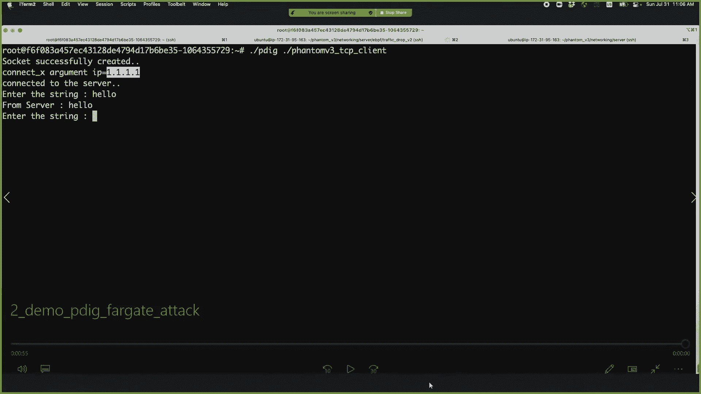

实现这一点的第一种方法是使用阻塞条件。现在我将更多地讨论阻塞条件。第二种方法是使用 seccomp 来延迟系统调用执行。

## 利用阻塞条件绕过追踪 🚧

那么，我们所说的“获得阻塞的系统调用”是什么意思？如果你想想基本的机制，系统调用本质上是内核代表用户空间程序与一些资源交互。现在这些资源中有很多是 I/O 设备，在内核将结果返回给用户空间之前，它们需要时间来响应。

更具体一点，让我们看看 `connect` 系统调用。在这个图中有两台机器：有一台客户机，有一台服务器。在客户端机器上，假设有一个应用程序，应用程序触发 `connect` 系统调用。正常情况下发生的是，系统调用将击中进入追踪点，ptrace 将读取参数，然后这叫做系统调用退出。

现在你可能想知道，这只是计算机网络基础，这里会出什么问题？想象下面的场景：攻击者会尝试连接到他们的命令和控制服务器，这意味着他们也控制着服务器。所以想象一下这个场景：我们有客户端和服务器。现在在客户端，攻击者首先创建系统调用线程，读取系统调用参数，会产生覆盖线程。然后系统调用线程将在调用系统调用时调用名为 `connect` 的系统调用。当这种情况发生时，客户端将尝试连接。但是服务器不会响应。然后客户端将重试。但是每次客户端重试时，延迟量由 TCP 拥塞算法控制，大概是指数级延迟。有那么多的延迟，覆盖线程有足够的时间覆盖用户空间内存，使其具有良性 IP 地址。然后当它有足够的时间传播所有的内存副本时，跟踪点和 ptrace 将愉快地读取良性 IP 地址。

我们将向您展示一个场景的演示。

在这个演示中，有两台机器，就像我们在图表中说明的那样。现在你看到的是一台服务器机器，服务器机器有一个以 176 结尾的 IP 地址。在服务器上启动监听程序。在客户端，我们要跑 Falco。我们还使用 Wireshark 来查看网络上实际运行的是什么。现在我们运行这个攻击程序，它将试图连接到服务器。你看到它现在连接在一起了，它试图发送一些假的数据。客户得到了消息。但现在如果你看看 Falco 报告的结果，你可以看到它实际上说我们的客户正在与 IP 地址 1.1.1.1 通话，表明搭桥成功。

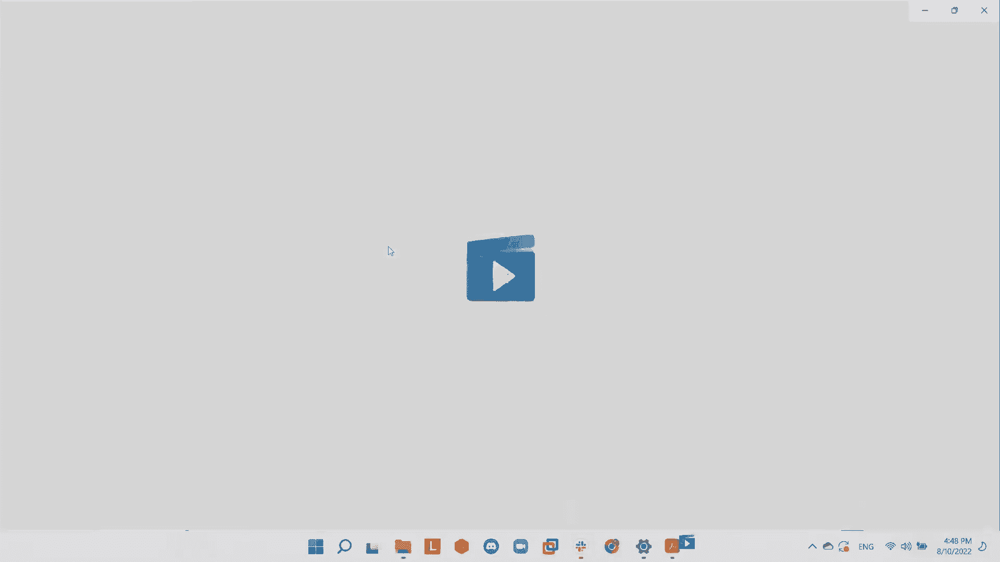

但现在如果你看看电线上实际发生的事情，它说我们实际上在和 IP 地址以 176 结束的服务器通话。

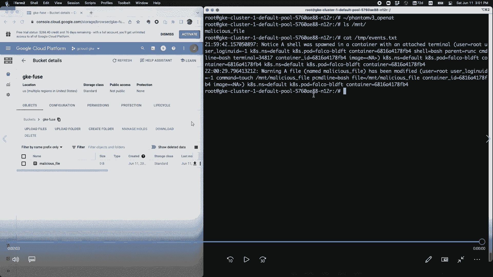

之前的演示是为 eBPF 和 Falco 的内核模块版本准备的，它使用跟踪点。现在我们将向你们展示如何为 ptrace 做同样的旁路，在 AWS 上使用 Pdig 和 Falco。

你在这里看到的又是服务器机器，IP 地址以 163 结尾。我们将启动 TCP 监听服务器。现在启动 Pdig 和我们的攻击者程序。这是同一个程序试图连接到服务器。你可以看到 Pdig 报告的 IP 地址又是 1.1.1.1，表明搭桥成功。

现在你可能想知道，这是用于 `connect` 系统调用，它实际上是否也适用于其他系统调用？我们实际上发现整个文件系统调用类也受到影响，其他一些依赖文件系统的系统调用也会受到影响，比如 `execve` 和 `openat`。原因是当你首先执行二进制文件时，因此他们也是下一个受到影响的人。我们将讨论如何利用文件系统调用。

## 利用 FUSE 文件系统绕过追踪 📁

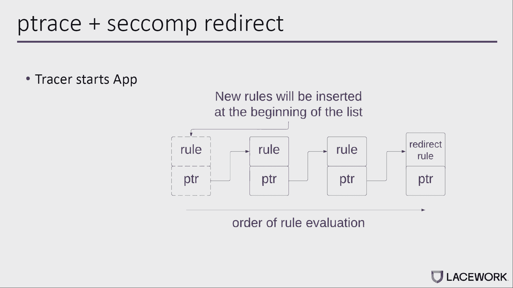

在我谈论如何绕过 `open` 访问追踪之前，我来介绍一下 FUSE。FUSE 是一个系统框架，允许在用户空间实现文件系统。在云场景中，FUSE 经常用作远程存储文件系统。使用这样的文件系统，可以将远程对象挂载为本地文件系统，并将远程文件作为本地文件访问。因为它是用户空间文件系统，它提供更快的参与或开发。你通常不会告诉内核。

以下是远程存储文件系统的示例列表，你可以看到它很受欢迎，被广泛使用。你可以看到主要的云提供商都有自己的 FUSE 实现。

这是远程存储文件系统的通用体系结构。如果用户空间应用程序或容器希望打开远程文件，它所做的与打开本地文件相同：它会向内核发出一个 `open` 或 `openat` 系统调用。当请求到达 VFS 层时，它将路由到 FUSE 内核驱动程序，然后使用像 GCS 这样的 FUSE 守护进程。守护进程将请求发送到远程存储。一旦响应从服务器返回，它将通过原始路径返回到用户空间应用程序。我需要提到的一件事是，客户端和服务器之间的延迟比物理延迟本身长得多。基本上我们可以利用这个长延迟来绕过系统调用的 `open` 访问。

让我展示一下它是如何工作的。我们有被追踪程序监控的恶意进程。该进程正试图打开一个名为“恶意文件”的远程文件。基本上，它会向内核发出一个 `open` 调用，`pathname` 参数指向用户空间中的恶意文件名。因为文件是远程存储的，因此 `open` 的请求将从内核到用户空间，然后到远程存储。在响应返回之前，重写线程可以跳入并尝试重写 `pathname` 指针所指向的内存，从“恶意文件”名改为“良性文件”名。因为延迟太久了，CPU 有足够的时间传播对 CPU 寄存器和内存的所有副本的更改。在响应返回后和返回用户空间之前，追踪程序可以利用退出钩子来读取系统调用参数，比如 `pathname`。不幸的是，`pathname` 已从“恶意文件”更改为“良性文件”，这意味着我们的搭桥会成功。

现在，让我给你看一个演示。

左边是谷歌云存储桶的控制台。我们在 GKE 集群中部署了 Falco。我们登录到其中一个容器，然后我们检查了容器内的进程。我们有 FUSE 代理在运行，它将谷歌云存储桶作为本地文件夹挂载。然后我们检查是否有 Falco 事件。我们生成了一个事件，因为我们只需登录到容器。现在文件夹是空的，这意味着远程存储是空的。然后试图打开文件夹中名为“恶意文件”的文件。你检查本地文件夹，因此文件是在远程存储中创建的。然后我们从 Falco 那里得到了一个事件，因为如果你试图打开恶意文件，它会生成事件。让我移除这恶意文件，所以它会把它从远程存储中移除。然后我们进行攻击。你检查文件夹，因此恶意文件是由攻击代码在远程存储桶中创建的。我们检查 Falco 事件，因此没有生成新事件，这意味着我们的攻击成功。

## 利用 Seccomp 绕过系统调用进入追踪 🛡️

现在我们要谈谈如何绕过系统调用进入追踪。如果你还记得前面的图表，当系统调用执行时，它击中了 ptrace 进入，然后击中了 seccomp，最终会被系统调用处理程序执行，实际上将取消用户空间内存的引用。所以现在的问题是，我们能用 seccomp 来推迟执行吗？从而绕过 ptrace 作为进入钩子。

在我深入细节之前，只是一个关于 seccomp 的快速回顾。seccomp 是一种内核级机制，允许开发人员指定允许或阻止系统调用。你甚至可以允许和阻止基于参数的系统调用。您可以在此机制之上构建一个沙箱。这些规则很快就会变得非常复杂，需要更多的时间来计算。最后一个警告：seccomp 中的第一个插入规则实际上是最后评估的。假设你会明白为什么这很重要。

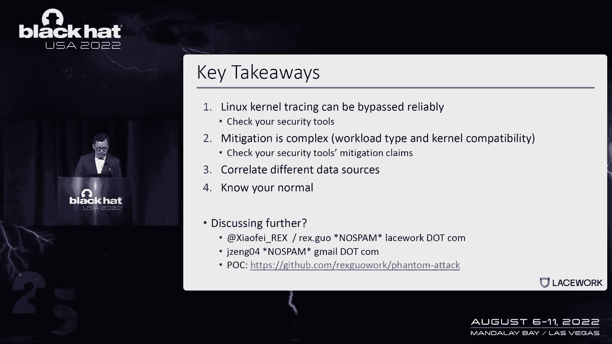

旁路的想法非常简单，如果你了解之前的攻击。在这张图中所有东西都在同一台机器上运行。有一个系统调用线程将首先插入一堆 seccomp 规则，就像常规应用一样。然后它将创建重写线程。然后它将调用名为 `open` 的系统调用。当